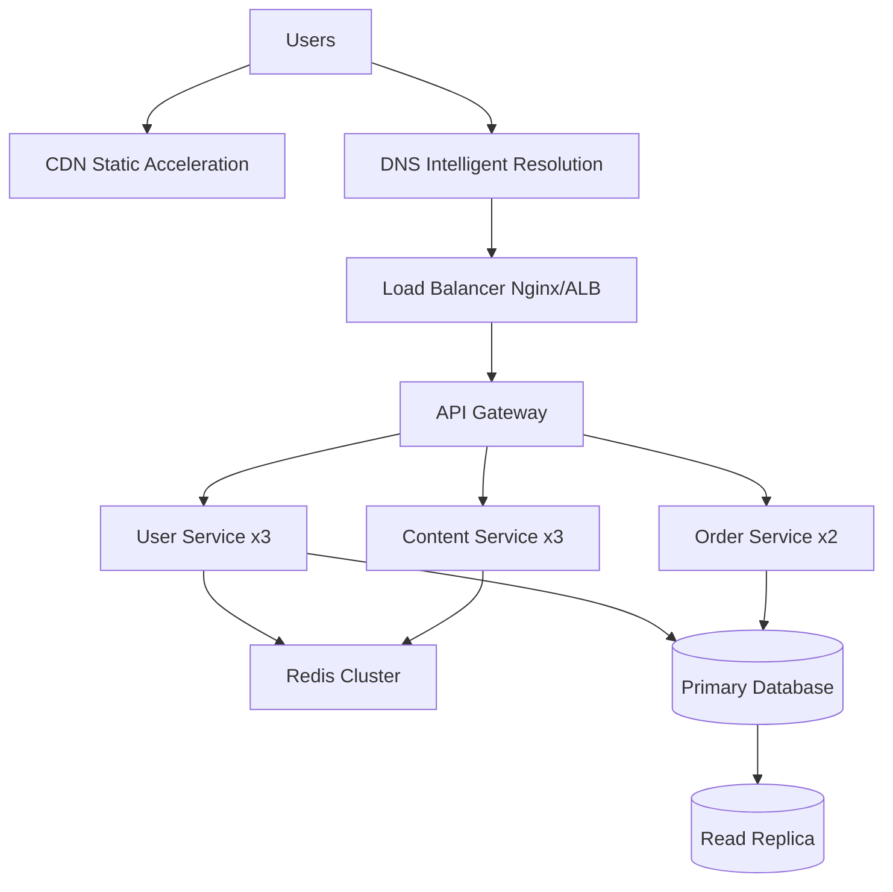
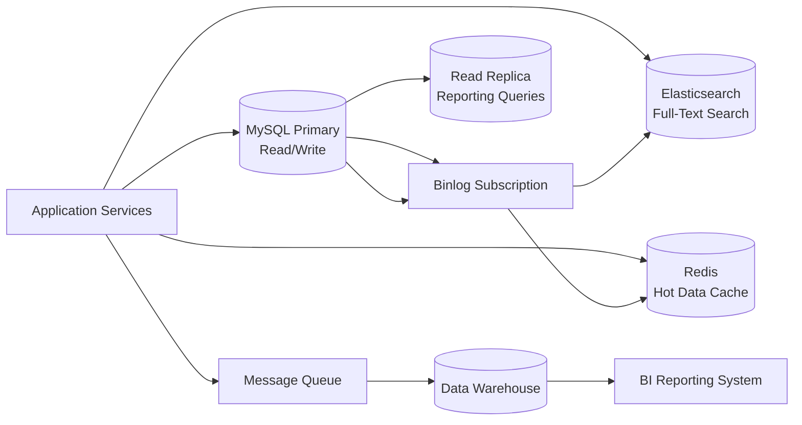
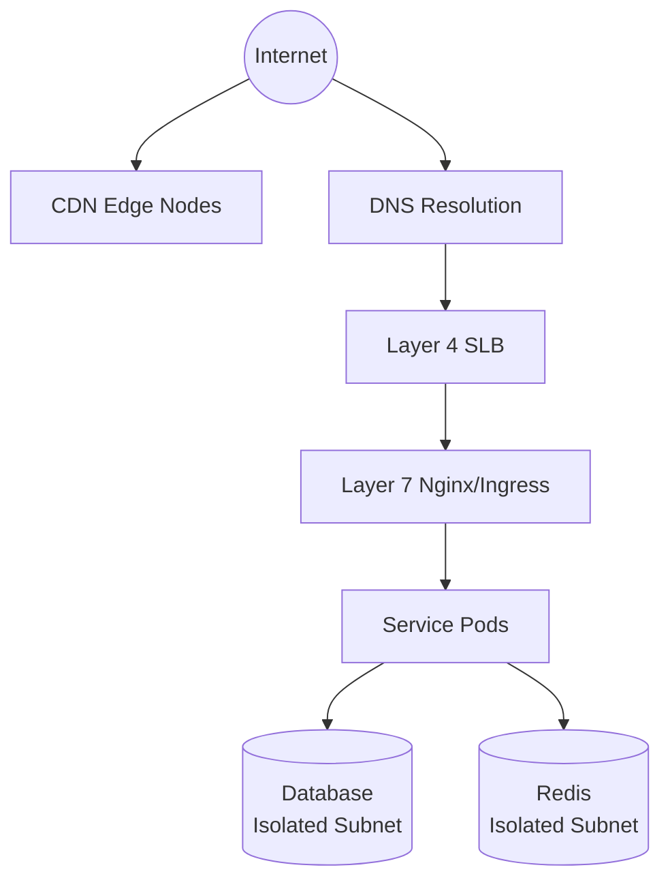
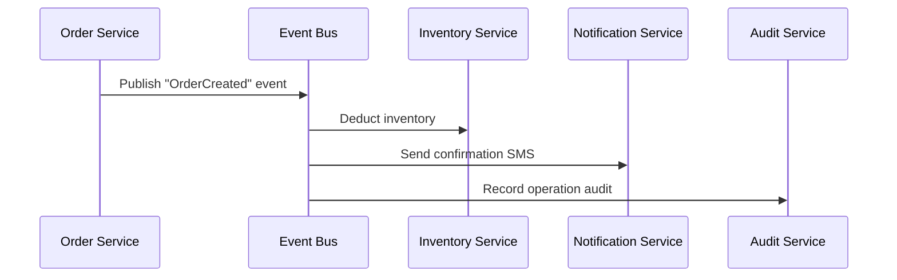
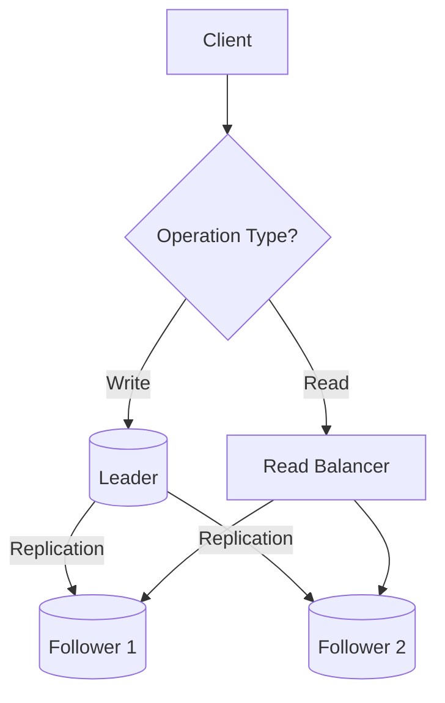

> I wrote this because I've seen too many people treat "drawing boxes" as architecture design. Anyone can draw boxes. The hard part is looking at those boxes afterward and saying: this thing will hold.

A friend once sent me the architecture diagram for his new system. "Gateway → User Service → Order Service → Database." Three or four boxes, a few arrows. Clean and tidy. I said, looks good. Now tell me — if the Order service goes down, can users still place orders? He paused. Well, I guess not. OK, so what if the User service is just slow, not dead, and the Order service waits 30 seconds for a response — what happens to the requests piling up during those 30 seconds?

He didn't have an answer.

Not because he drew a bad diagram. Because he hadn't thought about it.

This is the most unsettling thing about architecture design: drawing the diagram takes five minutes, but afterward you need to mentally simulate the entire system a thousand times — simulating every failure mode, every traffic spike, every stupid design decision you won't realize is stupid until three months later. If your mental simulation holds up, the architecture is solid. If it doesn't, launch day is the beginning of a nightmare.

This article won't teach you how to draw diagrams. We're going to talk through three things: what architecture design actually does, how to tell whether a design is "fine" or "screwed," and most importantly — you won't walk away with a checklist. You'll walk away with your own judgment framework.

---

## 1. Architecture Design Is Not "Designing Software"

### 1.1 Architecture Is a Set of Decisions, Not a Diagram

You join a new project. Your lead says, "Take a look at our architecture diagram." You open it — fifty microservices, arrows everywhere, Kafka wedged in the middle, Redis clusters, Elasticsearch nodes. It looks impressive. It looks complicated.

But here's the real question: **this diagram contains fifty decisions. How many of them can you actually see?**

- Why are the Order service and Inventory service separated instead of combined?
- Why is Kafka here instead of a direct HTTP call?
- Is Redis a cache or primary storage here? What happens if data gets evicted?

An architecture diagram is just the **projection** of those decisions. It's like a city map — it tells you which roads connect, but it doesn't tell you why the subway station was built at this intersection instead of that one. The map is useful, but it doesn't contain the designer's reasoning.

Martin Fowler once said something I can't improve on: **Architecture is the stuff that's hard to change once you get it wrong.** Your ORM choice, your logging library — swap them out, hurt for two days, move on. But once you decide "the User service and Order service run separately and communicate through Kafka asynchronously" — that decision seeps into your database design, your monitoring stack, your deployment pipelines, your team structure. Changing it means redoing half the system.

So the essence of architecture design isn't "producing a beautiful diagram." It's this: **making a series of interlocking technical decisions with incomplete information, and being fully aware of the cost of each one.**

### 1.2 Decomposition + Collaboration: The Two Moves of Architecture Design

Strip it all down and architecture design is exactly two moves:

1. **Cut the system into pieces**
2. **Define how the pieces talk to each other**

Think about a kitchen. You run a tiny diner — two people in the back, one chops, one cooks. You don't need a "cold dishes department" and a "hot dishes department" and a "pastry department." Two people just yell across the counter. Architecture? Unnecessary. Communication cost: zero.

Now picture a massive chain restaurant — 500 seats, 3,000 covers a day. You can't avoid splitting. The kitchen splits into cold dishes, hot dishes, pastry, and prep. Front of house splits into greeting, ordering, serving, and checkout. Once split, you need collaboration rules: "Order tickets come in duplicate — hot kitchen gets one, checkout gets one." "After hot kitchen finishes a dish, serving team delivers within three minutes or it's on them."

See the pattern? **Decomposition is the means. Collaboration is the goal.** Split too coarsely — a single module holds too much, one-line changes require testing the entire system, nobody dares to touch anything. Split too finely — the communication overhead between modules exceeds the benefit of the split, every simple feature requires changes across four services, and integration testing makes you want to quit.

The only judgment criterion: **after splitting, did the overall system complexity go down or up?** If splitting means you're writing twice the glue code, configuring three more middleware components, and maintaining a pile of interface docs — you're not doing architecture. You're planting landmines for your future self.

Which leads to the obvious question: how do you avoid planting landmines?

---

## 2. The Five "Don'ts" — Think Before You Build

Every architecture disaster I've witnessed had nothing to do with "not knowing enough technology." It was always about not stopping when you should have stopped. Not backing off when you should have backed off.

### 2.1 Don't Over-Engineer

This is my most common sin. Bar none.

Years ago I built an internal admin system. Two hundred daily active users. But I thought — what if it grows? So I set up microservices, container orchestration, a full CI/CD pipeline, even sharding middleware. You know, the stuff that makes you feel like a "real" engineering team.

Three months later the business pivoted. The entire thing was useless. Not "I wasted some time" useless. The excess abstraction layers became **shackles** on future iteration. Every new feature had to route around five layers of "future-proofing" middleware, each one asking: "Where did this data come from? Why am I here?"

Shit. I spent every night that month wondering: am I doing architecture, or am I just stacking blocks?

A practical litmus test: **Can the current approach survive until the next business milestone? If yes, don't touch it.** A system with 500 DAU — single MySQL table + Redis cache will comfortably carry you to 50,000 DAU. Six months is plenty of time to understand the business shape before deciding which direction to split.

Over-engineering isn't "you did a little extra work." It's that the extra work becomes a permanent obstacle. You built layers of abstraction for "possible future expansion," and by the time the future arrives, the business direction has changed and your abstraction direction was wrong.

### 2.2 Don't Blindly Copy Big Companies

Almost every "big tech architecture practice" talk has an unspoken premise: **their traffic is 100x yours, their org size is 50x yours.**

Why do big companies adopt microservices? Because five thousand engineers work in a single codebase — without splitting, it's merge conflict hell every single day. Do you have five thousand engineers? You have five people and you're running eight microservices. Each person maintains 1.6 services. You're not doing architecture — you're committing suicide.

Every microservice needs its own CI/CD pipeline, its own monitoring and alerting, its own deployment process, its own API documentation. Eight microservices means eight sets of infrastructure. You have five people. Do the math. Big company architecture was designed for **their problems**. Your problems — small team, shifting business, speed mattering more than elegance — are completely different.

What you should learn is **why** they designed things that way. What constraints they faced. What tradeoffs they made. Not copying their diagram wholesale into your system.

A simple rule: **if you can't explain why you need a piece of technology, don't introduce it.** Can't explain "why Kafka and not Redis Pub/Sub"? Don't use Kafka. Can't explain "why split into three services instead of two"? Don't split. If you can't articulate the reason, odds are you don't need it.

### 2.3 Don't Be Too Old, Don't Be Too New

There's an awkward but real dilemma in tech selection:

Too new — unstable, weak ecosystem, can't hire for it, only three Stack Overflow questions and none have answers. Too old — can't hire young talent, community atrophy, unpatched security vulnerabilities, and you slowly realize you're the last person on earth maintaining this thing.

My strategy is simple. One table:

| Type                   | Maturity               | Examples                    |
| ---------------------- | ---------------------- | --------------------------- |
| Core business path     | Widely proven 2+ years | PostgreSQL, Redis, Nginx    |
| Non-critical auxiliary | Can try newer          | Logging/monitoring/CI tools |
| Experimental           | Chase freely           | Internal tools, tech spikes |

One core principle: **don't put new things on the critical path.** Payment pipeline, user authentication, database — if these break, it's an incident. Use the most stable options. Want to try that hot new message queue everyone's tweeting about? Fine — run it in test, try it on non-critical log ingestion. Don't wire it into your "user places an order" flow. When you get paged at 2 a.m. for a production incident, you'll discover that "trying new things" is not a cool phrase.

### 2.4 Don't Detach from Practice

Architecture design isn't an ivory tower exercise. Whether a design is good or bad can only be judged in context.

I've seen three classic ways this kills a project:

**One: Ignoring team capability.** You design a beautiful Event Sourcing + CQRS architecture. Elegant theory, clean design. But nobody on the team has touched event sourcing. Nobody has even set up an Event Store. Once this goes live, every single issue is undebuggable by anyone except you. Congratulations — you've made yourself irreplaceable, and you've created an unacceptable risk for the company.

**Two: Ignoring upstream and downstream.** Your service exposes a clean RESTful API — beautiful JSON, semantic HTTP status codes. But the upstream system still speaks SOAP. The downstream vendor only accepts XML. Your "elegant design" now requires a jungle of adapters. The architecture diagram looks beautiful. The integration plan makes you want to look away.

**Three: Ignoring hiring.** You pick a niche tech stack — it's great, you love it. But the market has maybe five people who know it. Two years later, you want to move on and the company can't find anyone to take over your service. Or you want to grow the team and the candidate pool for this stack is smaller than the panda population.

Architecture design needs to consider three time horizons:

- **Short term (3-6 months)**: Can requirements land fast? Can the team get up to speed in three days?
- **Medium term (6-18 months)**: Once the business stabilizes, how do you evolve? When do you pay down that mountain of tech debt?
- **Long term (18+ months)**: When the team doubles, how do you collaborate? Does the system slowly rot into a ball of mud?

### 2.5 Don't Leave Decisions Undocumented

Today you decide, "Let's use Redis for user module caching, not local memory." Feels obvious. Not worth writing down.

Three months later, a new teammate shows up. They open the codebase. Wait — why Redis here? The user volume isn't that high. Wouldn't local memory be faster? They come ask you. You didn't record it. Three months later, you can't remember why you made that call. So you spend two hours debating, guessing, and eventually deciding "well it works right now so let's leave it." An undocumented decision is indistinguishable from an unmade one.

**ADRs (Architecture Decision Records)** deserve five minutes after every significant decision. Five things:

1. Decision title
2. Context and problem
3. Alternatives you considered with their tradeoffs
4. Your final choice and rationale
5. What this decision affected

Five minutes. In exchange for not fighting your own memory three months later. In exchange for a new teammate reading the doc and understanding the logic, instead of tapping you on the shoulder.

---

## 3. The Five Architecture Domains — Five Maps of the Same System

I've watched too many people mix up "system architecture" and "software architecture" in the same sentence, talking past each other for twenty minutes before realizing they're on different layers. This isn't terminology pedantry — if you can't separate the layers, you won't know which layer to solve a given problem on.

I think of a system's architecture as five perspectives. Imagine you have five maps of the same city:

- **City planning map** tells you where the industrial zones and residential zones are
- **Building floor plan** tells you how rooms are laid out inside each building
- **Logistics and storage map** tells you how goods enter, where they're stored, and how they leave
- **Traffic route map** tells you where the main roads and traffic lights are
- **Security deployment map** tells you where guards are posted and which areas require badges

Five maps. Same city. Each answers different questions. You don't use a city planning map to design the interior of a single building, and you don't use a traffic map to manage inventory.

These five maps correspond to the five domains of architecture design.

### 3.1 System Architecture — The City Planning Map

System architecture is the highest-level view. It's about **physical resources**: how many machines services run on, where load balancers sit, how database clusters are deployed, which regions CDN nodes cover.

It answers:

- What physical nodes does a user request travel through from browser to database?
- Which nodes are single points? If one goes down, can the system still function?
- When a traffic spike hits, how do you automatically add more machines?



Core discipline of system architecture:

- **Statelessness**: Any request can be handled by any instance. One instance dies, traffic shifts automatically, users don't notice.
- **Redundancy**: At least two replicas for every critical node. Don't let your system have an Achilles' heel — one pin to bring it all down.
- **Capacity planning**: Estimate based on QPS. Leave 30% headroom. Don't wait until CPU is pegged to start adding machines.

**What it doesn't solve:** System architecture doesn't care how your Controllers and Services are layered in code. It doesn't care whether your database schema is well-designed. It only cares about "where things sit." What the things look like — that's the next layer's job.

### 3.2 Software Architecture — The Building Floor Plan

Software architecture goes one level deeper. It's about **how code is organized**: what modules your codebase is split into, what responsibilities each module has, how modules communicate, which direction dependencies flow.

```
┌──────────────────────────────────┐
│   Presentation Layer (Controller) │ ← HTTP entry, parameter validation
├──────────────────────────────────┤
│   Application Layer (Service)     │ ← Business orchestration, transaction boundaries
├──────────────────────────────────┤
│   Domain Layer                    │ ← Core business rules, zero framework dependency
├──────────────────────────────────┤
│   Infrastructure Layer            │ ← Database, cache, message queue implementations
└──────────────────────────────────┘
```

Core discipline: **dependencies flow downward, always.** Upper layers can call lower layers. Lower layers never know about upper layers. The moment your Domain layer imports a DTO from the Controller layer, architecture rot has begun — changing Controllers breaks Domain unit tests, and swapping frameworks touches your core business logic.

Software architecture answers:

- Which module should this feature live in?
- Should module A call module B synchronously or asynchronously?
- Where does shared logic go? A common lib, or is duplication acceptable?

**What it doesn't solve:** Software architecture doesn't care how many machines your services run on. Doesn't care about network latency and packet loss. Doesn't care about Redis eviction policies. It only cares about "how code is organized." Where the code runs and how it performs — that's system architecture and network architecture's territory.

A common mistake: people try to solve system-level problems with software architecture logic. "Let's adopt microservices" — that's a system architecture decision (how to deploy, how to scale). But it ripples into your software architecture (cross-service communication, code reuse strategy). The two layers influence each other, but you can't use tools from one layer to fix problems in another.

### 3.3 Data Architecture — The Logistics and Storage Map

Data architecture is the most overlooked of the five domains. Most developers' understanding of data architecture stops at "MySQL or PostgreSQL?" That's not data architecture. That's database selection.

Data architecture is about **the full lifecycle of data, from birth to death.**



It answers:

- What storage fits this data? Relational, document, time-series, graph — different data shapes belong in different databases.
- How is data distributed? When a single database can't keep up, what key do you shard on?
- What's the consistency requirement? "Balance must update immediately after payment" is strong consistency. "Profile picture updates can take two seconds to propagate to the friend list" is eventual consistency. Which one do you need?
- How do you manage the data lifecycle? Hot data (last three months) on SSD. Warm data (three months to a year) on regular storage. Cold data (over a year) archived or deleted.

Some hard-won lessons:

- **Don't shard prematurely.** A single table under 20 million rows with proper indexing — PostgreSQL handles it fine. By the time your data volume genuinely needs sharding, congratulations, your business is already successful, and it's a completely different class of problem.
- **Caching is not a database replacement.** When cache data gets evicted, you need a fallback path. The database is always the ultimate source of truth. Don't treat Redis like a database — its job is "fast," not "reliable."
- **Read-write separation is the cheapest scaling method.** Most business scenarios are read-heavy. Add read replicas, read capacity scales linearly, touch zero lines of code.

**What it doesn't solve:** Data architecture doesn't care how your services are deployed. Doesn't care if your API is RESTful. Doesn't care if your frontend uses React or Vue. It only cares about data — where it lives, how it flows, when it should disappear.

### 3.4 Network Architecture — The Traffic Route Map

Network architecture is about **how data flows between nodes**. In a distributed system, network unreliability isn't an "if" question — it's a "when" question. Latency, packet loss, split-brain — these will happen.



Core questions network architecture answers:

- Service discovery: How does your Order service know which IP and port the User service is on? DNS? Consul? k8s Service?
- Load balancing: Layer 4 or Layer 7? Round-robin or least connections?
- Network isolation: Should the database be on the public internet? If the application layer is compromised, can the attacker reach Redis directly?
- Partition tolerance: When cluster nodes lose connectivity (split-brain), how do you prevent two nodes from writing to the same data simultaneously?

Core principle: **put important things in separate baskets, but make sure the baskets can't hurt each other.** Database and Redis in isolated subnets — even if the application layer is breached, attackers can't reach the database IPs. But simultaneously design fault isolation at the network level — a problem in one subnet shouldn't take down the whole cluster.

**What it doesn't solve:** Network architecture doesn't care about your code structure. Doesn't care how many methods your Service layer has. Doesn't care whether your database indexes are correct. It only cares about "data in transit" — can it get there, which route does it take, is the road safe.

### 3.5 Security Architecture — The Security Deployment Map

Security architecture isn't "add a firewall" or "configure HTTPS." Security is a thread that runs through every other domain — isolating at the network layer, authenticating and authorizing at the application layer, encrypting and masking at the data layer, auditing at the operations layer.

| Layer        | Focus                            | Typical Solutions                                    |
| ------------ | -------------------------------- | ---------------------------------------------------- |
| Network      | Who can access what              | VPC isolation, security groups, WAF, DDoS protection |
| Application  | Who's doing what                 | Auth (JWT/OAuth2), Authorization (RBAC), audit logs  |
| Data         | Where's the data, who can see it | Encryption at rest, masking, encrypted backups, TLS  |
| Operations   | Who changed what config          | Bastion hosts, operation auditing, least privilege   |
| Supply chain | Any dependency issues            | SCA scanning, image signing, SBOM                    |

Core design principles:

**Defense in Depth**: Don't rely on a single layer with a single solution. WAF gets bypassed? Application layer still has input validation. Application layer gets injected? Database still has least-privilege access — the attacker can only touch their own tenant's data even with a database connection.

**Deny by Default**: All endpoints require authentication by default. Public endpoints must be explicitly marked. This is the same principle as the `@Public()` decorator from our NestJS article — undeclared means private. Want it public? Tag it so I know.

**Shift Left**: Security checks happen as early as possible. SAST at commit time. Dependency scanning in CI. Container image scanning before deployment. Don't wait until post-launch to do penetration testing — the cost of fixing a vulnerability at design time is one percent of what it costs after launch.

One concept worth remembering: **Trust Boundary**. Every time data crosses from one security domain into another, it must be validated. User input entering the server. Server data passed to a third party. Logs written to an external system. These are all trust boundary crossing points. Spend an extra minute validating at these points now, save a sleepless night dealing with a security incident later.

**What it doesn't solve:** Security architecture can't make your system "absolutely secure" — that doesn't exist. It also can't replace a dedicated security team's day-to-day work. What it does is embed security DNA into your architecture, helping you avoid 90% of security pitfalls at design time. The remaining 10% is continuous monitoring and incident response.

---

## 4. Domain-Driven Design — A Way of Thinking, Not a Framework Config

### 4.1 Why You Need It

After covering the five domains, you might be thinking: I've got five maps. But how do I find the "right path" on them?

That's where DDD comes in.

A lot of people think DDD (Domain-Driven Design) is a "way of writing code" — Entity, Value Object, Repository, Aggregate — a set of technical patterns. It's not. It's a way of thinking that **keeps your code structure aligned with your business structure.** How you organize code follows how the business is organized — not how the technology layers dictate.

You've probably been here: six months into a project, you crack open the codebase and find that `OrderStatus` is stored as `"PENDING"` in the Order service, `"1"` in the Payment service, and displayed as `"Awaiting Payment"` on the frontend. Three places, three names. Who's right? They all are. Because nobody ever defined what "order status" actually means across the whole system. Everyone coded to their own understanding, and now the codebase is littered with synonyms and near-synonyms — maybe they mean the same thing, maybe they don't.

This is the core problem DDD solves: **when the code and the business speak different languages, the system gets harder and harder to change.** DDD gets you and the business side speaking the same language, and lets the code's boundaries follow the business's boundaries. You stop stuffing unrelated logic into the same module for "technical reasons" — business boundaries become your module boundaries.

### 4.2 Strategic Design — Bounded Contexts: Drawing Territorial Boundaries

DDD's strategic design does one thing: **uses Bounded Contexts to draw clear territorial boundaries for your system.**

"Bounded Context" sounds academic, but it's really just "this word means this within this boundary, and might mean something different outside it."

Think of a company. The Sales department and the Warehouse both talk about "orders." In Sales, an order means "the customer signed the contract and confirmed the purchase." In the Warehouse, an order means "a list of items to pack and an address to ship to." Same word, two meanings. If you force the entire company to use "the same Order model," you have to accommodate every field from both departments — and you end up with a bloated monster with more fields than lines of code.

What Bounded Contexts do: **acknowledge the differences, draw clear boundaries, and allow the same word to mean different things in different contexts.** The Sales context has its own Order model. The Warehouse context has its own. They sync necessary state through explicit interfaces.

What does this mean for architecture design? **Bounded Contexts are the natural basis for module decomposition.** Does one Bounded Context equal one microservice? Not necessarily. But it gives you a clear boundary — things inside the boundary change together, things outside don't. When you're splitting modules, you don't have to decide based on "this class is getting long." The map is already drawn — the boundaries are already there.

DDD has a companion concept called **Ubiquitous Language.** In a given Bounded Context, everyone — developers, product, business — uses the same vocabulary to describe the business. Class names in code are the words the business uses. Business processes map to method names. No "translator" needed in between.

### 4.3 Tactical Design — Aggregates, Entities, Value Objects: Building Inside the Borders

Strategic design draws the map of "who belongs with whom." But inside a Bounded Context there are still lots of pieces — which data must change together? Which operations must succeed or fail as a unit? That's tactical design's job.

**Entity**: Something with identity. A user changes their name — it's still the same user. An order changes status — it's still the same order. The core of an Entity is "sameness" — two objects with the same ID are the same thing, regardless of how other attributes differ.

**Value Object**: Something with no identity, only value. $100 is $100 — you don't need to distinguish "this $100 bill" from "that $100 bill." Addresses, monetary amounts, date ranges — these are all Value Objects. They have no independent lifecycle; they belong to an Entity.

**Aggregate**: This is the most important concept in tactical design. An Aggregate is a cluster of Entities and Value Objects that must remain **consistent as a unit.** Every Aggregate has an **Aggregate Root** — all modifications to anything inside the Aggregate must go through the Root.

Why Aggregate? Because without this constraint, your code is littered with `order.setStatus()`, `orderLine.setQuantity()`, `payment.setAmount()` — and nobody knows which of these can be called independently. The Aggregate makes it explicit: you want to confirm an order? Only through `Order.confirm()`. You want to change a line item quantity? Only through `Order.changeLineQuantity(lineId, newQty)`. The Aggregate Root is the single entry point for data modification, and it's responsible for ensuring the entire Aggregate remains consistent after any change.

Mapping this to data architecture: **one Aggregate = one transactional consistency boundary.** All changes within an Aggregate must happen in a single database transaction. Changes across different Aggregates can use eventual consistency — which ties into the event-driven pattern we'll cover later.

**Repository**: The "access interface" for Aggregates. Business code doesn't care how an Aggregate gets stored in or retrieved from a database — only "save this Aggregate" and "load this Aggregate." This abstraction lets you swap databases without touching business code — the "infrastructure layer can be independently replaced" principle in practice.

### 4.4 Domain Events — The Mail Carrier Between Contexts

How do Bounded Contexts communicate?

In a monolith, direct method calls work fine. But once systems are split into independent services — or might be split in the future — **Domain Events** are the most natural way for contexts to communicate.

"OrderCreated." "PaymentCompleted." "InventoryDeducted." These are Domain Events. After a context completes a business action, it publishes an event. Other contexts subscribe.

Important distinction: not every method call deserves to be an event. The criterion for a Domain Event is — **this state change is meaningful to the business.** "User changed cart quantity from 2 to 3" — not a Domain Event. That's a transient state. "User submitted an order" — that's a Domain Event, because it represents an irreversible business action.

How does this relate to event-driven architecture? **DDD-flavored event-driven architecture = Domain Events (defining "what deserves to be an event") × event-driven patterns (defining "how events are delivered").** DDD tells you which state changes should fire events — not "data changed" at the technical level, but "something happened" at the business level. Event-driven patterns tell you what message queue to use, how to guarantee delivery, how to handle duplicates. Together, they're complete.

### 4.5 What DDD Doesn't Solve

After explaining what DDD does, I need to explain what it doesn't — otherwise someone's going to think "I'll rewrite the entire system in DDD" and six months later it still won't be in production.

**DDD doesn't replace system architecture decisions.** DDD helps you draw business boundaries, but it doesn't tell you whether the services inside those boundaries run on k8s or bare metal. It cares about "what belongs with what," not "which machine things sit on."

**DDD doesn't replace database selection.** DDD's Repository abstraction lets you swap databases — but only if your data model naturally fits relational or document stores. If your data is IoT sensor time-series data, DDD's Entity-Aggregate model isn't a natural fit — forcing it will only make your code harder to read.

**DDD requires a domain expert who actually knows the business.** This is the most overlooked point. DDD's methodology presupposes "you sit down with a domain expert and define the model using a shared language." If your business stakeholders don't know what they want — or, more commonly, don't have time to sit and model with you — DDD becomes you gesturing at a whiteboard alone in a conference room.

**Not every system needs DDD.** If you're building a pure CRUD admin console — create, read, update, delete, no complex business rules — layered architecture + Repository pattern is enough. Full DDD methodology is bringing a sledgehammer to a thumbtack. DDD is for when your system has grown to a certain scale, when business complexity forces you to seriously ask "where the hell are the boundaries?" — that's when it's worth the investment.

Shit, I know someone's going to read this and start rewriting their entire system in DDD tomorrow. Don't. **DDD isn't something you can use after reading one article.** It's the thing you naturally reach for after six months of being tortured by business complexity — the moment when you say "alright, let me sit down and really think about what this system is actually doing."

---

## 5. Design Patterns — Six Hammers in the Toolbox

After covering the five domains, you might be thinking: each domain has so many options — how do I choose? That's where design patterns enter the picture.

Note: these aren't the code-level Factory, Strategy, or Observer patterns — those are micro-patterns. Architecture design patterns address **system-level structure**: how modules fit together, how data flows, how requests are distributed.

Every "hammer" has its nails it drives beautifully, and the things it smashes in the process.

### 4.1 Layered Architecture — The Safest Starting Point

This is the layered architecture we discussed earlier. Almost every new project should start here — not because it's "the best," but because it has the **lowest cost of being wrong.**

You're building a new system where the business is still shifting fast. You don't know if this feature will exist in three months. You don't know which modules will need to be extracted for independent deployment later. Layered architecture is like an adjustable shelf — you can rearrange what's on it anytime, but you don't need to nail it to the wall on day one.

**What it's good at:** Clear structure, fast onboarding. Each layer is independently replaceable (swap databases, only touch Repository). Easy testing — mock layer by layer.

**What it smashes:** Too many layers introduce performance overhead (data transformation at every boundary). Strict unidirectional dependency sometimes forces "bypass code" — skip the Service layer and query the database directly. When business logic naturally spans multiple layers, layered architecture makes every layer feel like it's in your way.

### 4.2 Data Flow Architecture — Pipes and Filters

The data flow pattern focuses on the **path data takes through the system**. The canonical implementation is Pipe-Filter.

```typescript
const processOrder = pipe(
  validateOrder, // 1. Validate
  calculateDiscount, // 2. Calculate discounts
  checkInventory, // 3. Check inventory
  createPayment, // 4. Create payment
  sendNotification, // 5. Send notification
)
```

Each stage is independent, connected by pipes. One stage's output is the next stage's input.

**What it's good at:** ETL data processing, log collection and cleaning, compiler pipelines (tokenize → parse → generate). Any scenario where "data comes in, gets processed through a series of stages, comes out the other end."

**What it smashes:** Struggles with branching and rollback workflows — "if inventory is insufficient, roll back the discount and payment steps." In these scenarios, the pipe pattern turns your flow into spaghetti. Also, individual filter error handling is isolated — a filter doesn't know what happened upstream in the pipe.

### 4.3 Module/Microservice Architecture — Split by Boundaries

Modular architecture's core is splitting the system along **business boundaries**. Microservices are the distributed implementation of modular architecture.

The criterion for splitting isn't "this file is getting long, let's split it." It's **change frequency and team boundaries.** If the User module's requirements never change in sync with the Order module's, they shouldn't live together. Conversely, if two modules always change together in lockstep, forcibly splitting them only adds coordination overhead.

**What it's good at:** Large teams developing in parallel. Each team owns their service. Independent deployment, independent scaling. Fault isolation — User service going down doesn't take Order service with it (in theory).

**What it smashes:** The inherent complexity of distributed systems — network latency, data consistency, distributed transactions, cross-service debugging. When the team is small, these overheads dwarf the benefits. Important reminder: modular architecture **does not equal** microservices. You can split within a monolith first (NestJS's Module mechanism), and only extract into microservices when independent deployment is genuinely needed. The code structure barely changes — only the deployment model does.

### 4.4 Event-Driven Architecture — The Price of Decoupling

In the event-driven pattern, services don't call each other directly. One service publishes events. Others subscribe.



**What it's good at:** Business processes requiring multiple services to coordinate without hard coupling. After placing an order — deduct inventory, send notification, write audit log — these three actions don't need to know about each other's existence. Adding a new "award loyalty points" consumer doesn't affect any existing service.

**What it smashes:** Jesus, the debugging traces are a nightmare. One event triggers four or five consumers, each of which might publish new events — when something breaks you follow the chain like you're looking for an exit in a maze. Also, eventual consistency means data is temporarily inconsistent — if you check loyalty points immediately after placing an order, the points might not be there yet. If your business can't tolerate "two seconds until consistent," don't use event-driven.

### 4.5 Leader-Follower Architecture — Read-Write Separation

One leader node handles all writes. Multiple follower nodes handle reads. The leader's writes replicate to the followers.



**What it's good at:** Read-heavy business scenarios. Add followers to linearly increase read capacity — no code changes, no business logic changes.

**What it smashes:** Replication lag between leader and followers. You write data, immediately read from a follower — you might get a stale value. The leader is a write bottleneck — write capacity can't scale by adding nodes. Most fatally: split-brain. The leader and follower lose network connectivity, both think they're the leader — two copies of data diverge, and by the time you notice, they're impossible to merge.

### 4.6 MVC / MVVM — Separate Concerns

| Pattern | Core Idea                             | Data Flow                 | Typical Frameworks |
| ------- | ------------------------------------- | ------------------------- | ------------------ |
| MVC     | Controller coordinates Model and View | View ← Controller → Model | Rails, Spring MVC  |
| MVVM    | View and Model bound via ViewModel    | View ↔ ViewModel → Model  | Vue, Angular       |

Simple distinction: server-rendered web apps use MVC — template engine returns HTML, Controller fetches data from Model and stuffs it into the template. Decoupled SPAs use MVVM — the frontend (Vue/React) manages View and ViewModel, the backend only provides APIs.

**What it's good at:** Each is optimal in its own scenario. Don't cross them.

**What it smashes:** Mixing the two. Forcing a frontend MVVM framework into a server-rendered project, or having the backend return HTML fragments via MVC templates in an SPA — all unnecessary complexity.

---

## 6. How Do You Know Your Design Is Right?

You've drawn the diagrams, split the modules, chosen the patterns. Now what? How do you know this thing won't explode in production?

An unverified architecture is as dangerous as untested code.

### 5.1 Architecture Review — Trace Scenarios, Don't Present Slides

Most architecture reviews go like this: you present a beautiful slide deck explaining your design. Everyone nods. Nobody asks questions. Meeting ends. Launch day, the problems start rolling in.

A good architecture review is not "reporting to leadership." It's **tracing real business scenarios across the architecture diagram.**

Take your system's five most important APIs. For each one, trace the full call chain — from the moment the user clicks to the moment the database returns data — walking step by step across the architecture diagram. Where the path breaks, you've found a design gap.

After normal scenarios, trace failure scenarios:

- User service goes down — can orders still be created? Does the cache still work?
- Primary database crashes — will data be lost? How long to switch to the replica?
- Message queue backs up — are messages lost or delayed? What business processes does the delay affect?

Bring at least one person who isn't building the system into the review. They don't share your mental inertia and are most likely to spot the blind spots you take for granted. You say, "This part here is fine, right?" They say, "Uh, why do you think it's fine?" And then you realize — you actually can't articulate why.

### 5.2 Prototype — Eliminate Weeks of Uncertainty with Two Days of Work

You want to use Kafka as the event bus, but nobody on the team has touched it. Or you're considering gRPC instead of HTTP, but you're not sure the performance gain is worth the switching cost.

Don't debate. Build a prototype.

Docker Compose a local environment. Write a simple Producer/Consumer. Or run a comparative load test. Two days of work. What you get isn't just a "works" or "doesn't work" — it's intuition about the technology. Next time you face a similar scenario, you won't need to research from scratch.

### 5.3 Testing IS Verification — Modules That Are Hard to Test Are Badly Designed

Here's a perspective most people miss: **testing isn't just a tool for verifying code correctness. It's also a tool for verifying architecture quality.**

If a Service's unit test needs ten mocks to run — don't blame the testing framework. The Service needs to be split. Too many dependencies means too many responsibilities.

If two modules' integration tests always need to be updated together — those modules probably shouldn't be separate. There's a hidden coupling you haven't noticed yet.

If a critical business scenario has zero test coverage — either you don't actually care about that scenario (so it shouldn't be called "critical"), or your design makes it too hard to test (which means the design is flawed).

**Testability is a mirror for architecture quality.** If the mirror shows you're overweight, the problem isn't the mirror.

### 5.4 RAID — Manage Uncertainty Explicitly

RAID is a project management framework, but it applies beautifully to architecture design:

- **Risk**: Choosing PostgreSQL when the team has only used MySQL. Risk: learning curve delays the schedule.
- **Assumption**: Assuming the Redis cluster has 99.99% availability. Verify: run it under load for 72 hours, measure actual availability.
- **Issue**: Third-party payment API documentation is incomplete, integration is blocked. Action: escalate, demand a technical point of contact.
- **Dependency**: Order service depends on the message queue. Mitigation: if the queue goes down, the Order service has a degradation path — write to local log, replay when the queue recovers.

Write the risks down. A risk written down transforms from "it'll blow up someday" to "I know it might blow up, and I have a plan."

---

## 7. The Big Picture — Putting the Five Maps Together

We've covered five domains, DDD's modeling methodology, six patterns, and four verification methods. Now take a step back and look from a distance — when a user performs an action in your system, how do these five architectures move together?

A user places an order:

1. **Network layer**: The request goes through DNS resolution, CDN accelerates static assets, hits the Layer 7 load balancer.
2. **System layer**: The load balancer distributes the request to one of the Order service's Pods. If that Pod dies, traffic shifts automatically to another.
3. **Software layer**: Request enters Controller → parameter validation → Service orchestrates business logic → Domain layer executes core rules → Repository layer persists.
4. **Data layer**: Order data writes to MySQL primary. Hot data cached in Redis. Binlog syncs to Elasticsearch for search. Async message goes to Kafka, triggering inventory deduction.
5. **Security layer**: Every step passes through authentication (who you are), authorization (what you can do), auditing (what you did).

The five architectures don't exist independently. They're the same system projected across different dimensions. You can't design one and ignore the others — just like you can't design a building's structure while ignoring its plumbing and electrical.

---

## 8. What You Take Away — A Judgment Framework

The article is almost done. But I don't want you to walk away with a list of "five domains, DDD, six patterns, five principles." Search engines are more reliable than your memory.

I want you to walk away with a few questions. From now on, whenever you face an architecture decision — your own design, or reviewing someone else's — run through these in your head:

1. **Can this approach survive until the next business milestone?** If yes, the complexity is sufficient. If not, keep thinking. If it far exceeds — you're probably over-engineering.

2. **If a specific component goes down, can the system still function? Which features are affected?** You don't need 100% uptime on everything. But you need to know what absolutely cannot fail — and give it redundancy.

3. **Besides you, can anyone on the team take over this architecture?** If the answer is "nobody" — you're not an architect. You're a single point of failure.

4. **Three months from now, can a new teammate understand this design?** If it requires you to sit next to them for two hours explaining — either the docs are insufficient, or the design is too complex. Both are your problem.

5. **What's the worst case? Do you have a Plan B?** Plan B doesn't need to be perfect. You just need "if the worst happens, I know what the first step is." That alone justifies all the thinking time.

6. **Three years from now, looking back at this decision — would you feel stupid?** Not asking "will this decision still be right in three years" — of course a three-year-old decision might not hold up in today's context. The question is: given the information you had at the time, did you make a reasonable judgment? If yes — it was a good decision.

These questions have no standard answers. But **asking them at all — that is architecture design.**

---

## Closing

It's dark outside now as I finish writing.

After years of doing architecture design, my biggest realization is this: a good architect isn't someone who knows all the answers. It's someone who, with incomplete information, makes the **least bad choice.** Someone who, when conditions change, has the courage to say "my earlier judgment needs revisiting." Someone who, while others stare at boxes and arrows debating which one "looks nicer," is already mentally simulating "what happens when this box goes down."

There are no correct answers on an architecture diagram. But ask the right questions, and you've already won.

Next time someone asks you to "draw an architecture diagram" — don't rush to open draw.io. Ask yourself first: how many pieces should this system be cut into? How do they talk to each other? If one piece explodes, how long can the rest hold?

Figure those out, and drawing the diagram is just the recording process. Don't figure them out, and no matter how beautiful the diagram, it's just beautiful garbage.
