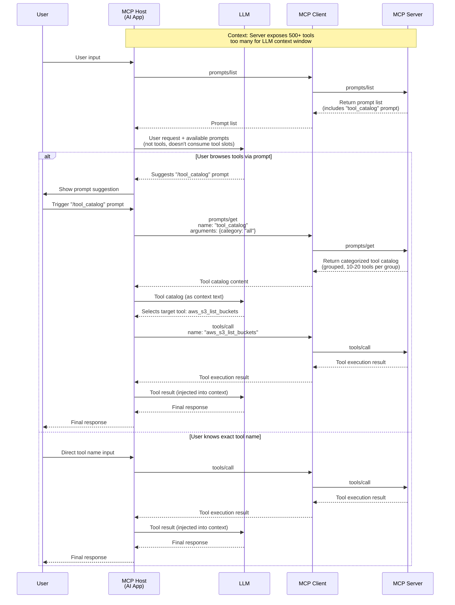
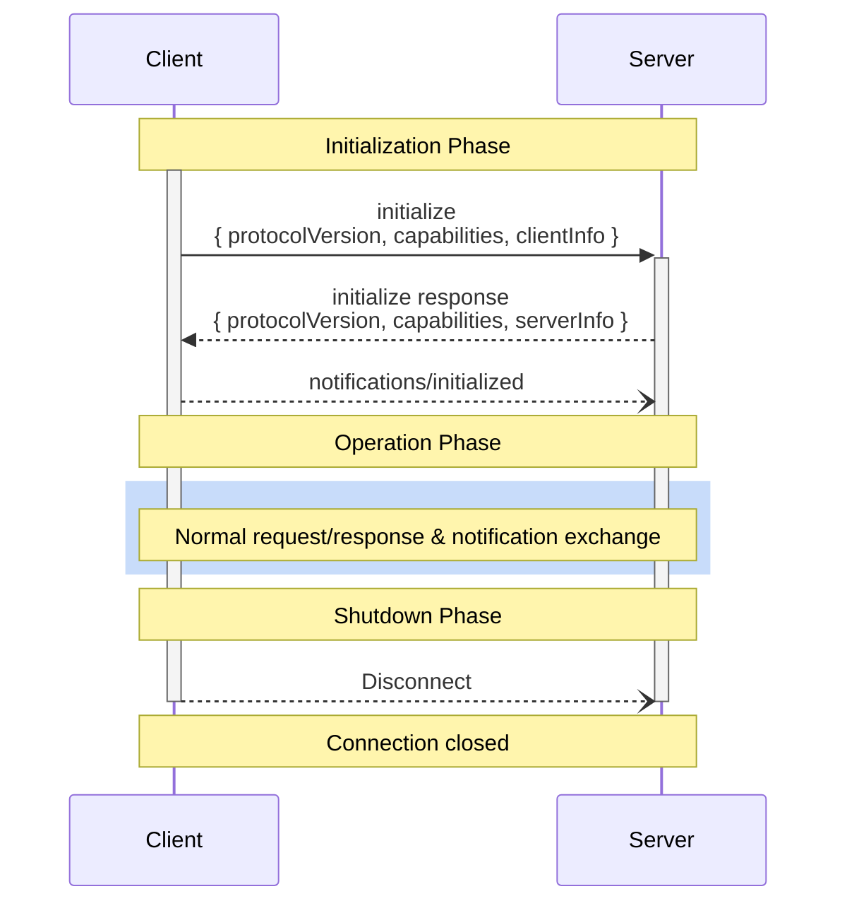
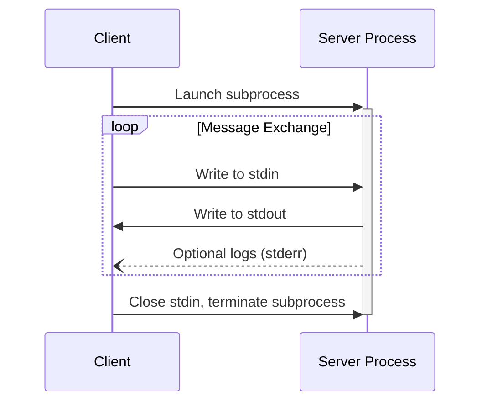

Remember that drawer? Ten years ago, every gadget came with its own charging cable — Nokia's round plug, Samsung's wide port, Apple's 30-pin, then Lightning, then micro-USB. Your drawer was a tangled mess of eight different cables, and going anywhere meant carrying at least two. USB-C changed that. Now, one cable does it all: phone, laptop, headphones, even monitors.

MCP does the same thing, just for AI integrations.

Before MCP, every time you wanted an AI application to talk to a new external service, you had to build a "custom cable": define an auth scheme, design a message format, handle reconnection logic, manage tool registration, write glue code. Ten services meant ten different cables. MCP unified the connector — any MCP Server works with any MCP Host, as long as both speak the same protocol.

But this article is not a primer. It's for developers who already know the rough shape of MCP and want to see the bones, not the skin. We'll go through JSON-RPC 2.0 message formats, the protocol methods of the three primitives, the Host/Client/Server triangle, the three lifecycle phases, the gotchas of both transports, and an advanced pattern you might not have thought of — using the Prompts primitive to escape tool-call context limits. Every section maps to a real problem you'll face when implementing or debugging MCP.

It's Tuesday morning, 10 AM. You open Claude Code and it invokes a tool from an MCP Server. Can you trace exactly how many JSON-RPC messages flew back and forth to make that happen? By the end of this article, you won't just know — you'll be able to draw it on a whiteboard.

# 1. What MCP Actually Simplifies

Let's rewind to a world without MCP. You're an IDE developer, and you want your VS Code AI Copilot to "show me the current file's git diff." What do you need?

First, you spawn a git subprocess or call a git Node.js binding. Second, you define the LLM's function call schema — the function name, parameters, and description. Third, you intercept the LLM's function call output and route it to your git invocation. Fourth, you take git's output and inject it back into the LLM's context. Fifth, if the user also wants the Copilot to query a database, you do it all over again.

That's one feature, one tool. Now imagine supporting git, databases, filesystems, Sentry error logs, Jira tickets, and Slack messages — all at once. This N×M integration matrix would cripple any team. Each tool needs a separate schema definition, separate call routing, separate connection lifecycle management.

MCP turns N×M into N+M: **M servers each expose capabilities via one unified protocol; N hosts each implement one protocol client.** Any host, any server, zero adaptation cost.

Specifically, MCP standardizes these workflows:

1. **Capability Discovery**: No more manually maintained tool lists. The host sends `tools/list`, the server returns complete tool metadata (name, description, input schema, output schema). When tools change, the server fires a notification.
2. **Call Routing**: The host no longer writes bespoke invocation logic per service. Every call is `tools/call` + `name` + `arguments` — one format.
3. **Context Injection**: The Resources primitive lets servers expose data (file contents, database schemas, API docs) in a structured way. The host auto-injects it into the LLM context.
4. **Connection Lifecycle**: Connection establishment, capability negotiation, reconnection — all handled at the protocol layer, not reinvented per server.
5. **Auth & Sessions**: The Streamable HTTP transport comes with `Mcp-Session-Id` and OAuth support built in. No more custom auth per remote service.

In one sentence: MCP turns a world where you had to pave every road yourself into one where the road is already there — you just drive on it.

# 2. The Three Core Primitives: Tools, Resources, Prompts

MCP's heart is three primitives. You declare which ones you support in your `initialize` capabilities. Each corresponds to a different interaction model.

## 2.1 Tools: Model-Driven Execution

A Tool is a "function" the MCP Server exposes to the LLM. Its interaction model is **model-controlled** — the LLM itself decides when to call which tool with what arguments.

A complete Tool definition looks like this:

```json
{
  "name": "get_weather",
  "title": "Weather Information Provider",
  "description": "Get current weather information for a location",
  "inputSchema": {
    "type": "object",
    "properties": {
      "location": { "type": "string", "description": "City name or zip code" }
    },
    "required": ["location"]
  },
  "outputSchema": {
    "type": "object",
    "properties": {
      "temperature": { "type": "number" },
      "conditions": { "type": "string" },
      "humidity": { "type": "number" }
    }
  }
}
```

Details every developer should internalize:

- **`inputSchema` uses JSON Schema**. This isn't decoration — the LLM literally reads this schema to decide arguments. Write a poor description, and the model will call the tool poorly.
- **`outputSchema` is optional but strongly recommended**. It enables structured result parsing on the host side, so you don't have to regex-crawl through text.
- **The `content` array in Tool Results is multi-typed**: `text`, `image`, `audio`, `resource_link`, `resource` — each with a `type` field.
- **`structuredContent` and `content` are parallel**: if you return structured results, include a JSON text version in `content` for backward compatibility.
- **Two layers of error handling**: JSON-RPC protocol errors (code `-32602` for invalid params, `-32603` for internal errors) handle "tool not found" cases. `isError: true` in the result handles "tool execution failed but protocol is fine" cases (e.g., API rate limits).

Protocol methods:

| Method                             | Purpose                                                                  |
| ---------------------------------- | ------------------------------------------------------------------------ |
| `tools/list`                       | List all available tools, with cursor-based pagination                   |
| `tools/call`                       | Invoke a specific tool                                                   |
| `notifications/tools/list_changed` | Tool list changed notification (requires `listChanged: true` capability) |

## 2.2 Resources: Application-Driven Context

A Resource is "data" provided to the LLM and user. Its interaction model is **application-driven** — the host app decides which resources to inject into context, not the LLM itself.

A Resource definition:

```json
{
  "uri": "file:///project/src/main.rs",
  "name": "main.rs",
  "title": "Rust Application Main File",
  "description": "Primary application entry point",
  "mimeType": "text/x-rust",
  "size": 1024
}
```

Resources support two content types:

- **Text**: `"text": "fn main() { ... }"`
- **Binary**: `"blob": "base64-encoded-data"` with `mimeType`

Key details:

- **URI is the unique identifier**. Standard URI schemes: `file://`, `https://`, `git://`, plus custom schemes. Note that `https://` carries semantic meaning — it signals the client can fetch the resource directly from the web, bypassing the MCP server proxy.
- **Resource Templates**: `resources/templates/list` returns URI templates (RFC 6570), e.g., `file:///{path}`, allowing clients to construct resource URIs on demand.
- **Subscriptions**: if the server declares `subscribe: true`, clients can `resources/subscribe` to specific resources and receive `notifications/resources/updated` pushes.
- **Annotations**: each resource can carry `audience` (`"user"` / `"assistant"`), `priority` (0.0 to 1.0), and `lastModified` (ISO 8601) — helping the host filter, sort, and budget context.

Protocol methods:

| Method                                 | Purpose                                       |
| -------------------------------------- | --------------------------------------------- |
| `resources/list`                       | List all available resources, with pagination |
| `resources/templates/list`             | List all resource templates (URI templates)   |
| `resources/read`                       | Read a specific resource by URI               |
| `resources/subscribe`                  | Subscribe to changes for a specific resource  |
| `notifications/resources/updated`      | Resource update notification                  |
| `notifications/resources/list_changed` | Resource list changed notification            |

## 2.3 Prompts: User-Driven Templates

A Prompt is a predefined prompt template. Its interaction model is **user-controlled** — the user actively selects it, like a slash command in an IDE.

A Prompt definition:

```json
{
  "name": "code_review",
  "title": "Request Code Review",
  "description": "Asks the LLM to analyze code quality and suggest improvements",
  "arguments": [{ "name": "code", "description": "The code to review", "required": true }]
}
```

Calling `prompts/get` returns a set of `messages`:

```json
{
  "description": "Code review prompt",
  "messages": [
    {
      "role": "user",
      "content": {
        "type": "text",
        "text": "Please review this Python code:\ndef hello():\n    print('world')"
      }
    }
  ]
}
```

Messages support four content types: `text`, `image` (base64 + mimeType), `audio`, and `resource` (embedded resources). `role` can be `"user"` or `"assistant"`, so you can define multi-turn conversation templates.

Protocol methods:

| Method                               | Purpose                                              |
| ------------------------------------ | ---------------------------------------------------- |
| `prompts/list`                       | List all available prompt templates, with pagination |
| `prompts/get`                        | Retrieve a specific prompt's content                 |
| `notifications/prompts/list_changed` | Prompt list changed notification                     |

**A key concept to lock in**: The three primitives map to three different loci of control in an AI system —

- Tool: control resides with the LLM
- Resource: control resides with the Host application
- Prompt: control resides with the User

Understanding this is how you make the right design decision when building an MCP server — whether something should be a Tool, a Resource, or a Prompt.

# 3. The Real Relationship Between MCP and Tool Call

Many people, on first exposure to MCP, ask: "Isn't this just function calling?" Or even: "I already use function calls in the OpenAI SDK — why wrap it in another layer?"

The answer: **Tool Call is the action. MCP is the wiring.** They aren't substitutes; they're layers working together.

Tool Call (function calling) handles the LLM's internal decision: "Based on context, which function should I call, with what arguments?" That's an LLM capability — it outputs a JSON blob containing `function_name` and `arguments`.

MCP handles the external connection: how that "function" is registered in the system, where its schema comes from, how results are formatted, what happens when the connection drops. MCP doesn't care about the LLM's function-calling decision process. It cares about "how to discover tools before the decision" and "how to execute tools after the decision."

Here's the full data flow for a single conversation turn:

```
[User input] → [LLM reasoning] → [LLM outputs function call]
                                        ↓
                            [Host intercepts function call]
                                        ↓
                      [Host looks up tool source in registry]
                                        ↓
                     [Host calls MCP Client → MCP Server]
                                        ↓
                          [Server executes business logic]
                                        ↓
                     [Server returns results → Client]
                                        ↓
                     [Host injects results into LLM context]
                                        ↓
                          [LLM continues → final response]
```

MCP owns the segment from "Host intercepts function call" through "Host injects results into LLM context." It doesn't participate in the LLM's reasoning, nor does it replace the function calling mechanism. It replaces the glue code you'd otherwise have to hand-write for tool registry + call routing + connection management.

Specifically, MCP does three things:

1. **Tool Registration**: During initialization, the host sends `tools/list` to every MCP server and merges all responses into a unified registry. The host then translates this registry into the LLM's function call schema format.
2. **Call Routing**: When the LLM produces a function call, the host reverse-looks-up the tool name to find the correct MCP server and connection, then issues `tools/call`.
3. **Result Propagation**: The MCP server returns structured results; the host injects them into the LLM context.

So the relationship is: **Tool Call is the LLM's mouth and hands; MCP is the central nervous system.** Mouth and hands express intent and perform actions; the nervous system routes signals.

# 4. When You Have Too Many Tools: The Prompt Escape Hatch

Now for a pattern that isn't obvious from the spec, and it's one of the most interesting things about MCP's design.

## 4.1 The Problem: Tool Call Has a Physical Ceiling

LLM function calling has a hard limit: **context window size**. Every request, you stuff the tool definitions (name + description + input schema) into the request body. A moderately complex tool definition is about 300–500 tokens. Fifty tools = 15K–25K tokens — already eating a big chunk of your context budget. Five hundred tools? Straight-up impossible.

Many models also cap the number of tool definitions. A certain model tops out at 128 function definitions. A comprehensive MCP server (say, a full AWS operations server) might expose hundreds of API operations that you literally can't fit.

## 4.2 The Solution: Shift from Tool Channel to Prompt Channel

The answer lives in MCP's third primitive: **Prompts**.

The Tool primitive is designed for "model auto-invocation" — but its cost is that tool definitions consume context window. The Prompt primitive is designed for "user manual selection" — you don't need to cram everything into one request. You can expose a "tool catalog" through Prompts:

```
User types "/aws_tools" → Host calls prompts/get for the tool catalog →
LLM sees the catalog (grouped by function) → User selects which function →
Host issues the actual tools/call
```

Here's the full sequence diagram:



## 4.3 Why This Pattern Matters

This solves three real problems:

1. **Bypasses tool slot limits**: The tool catalog appears as conversation text, not as tool definitions. Even 1000 tools are manageable through pagination, search, and categorization.
2. **Stepwise decision reduces context pressure**: The LLM doesn't need to understand all 500 tools at once. It only needs to parse a category overview (~20 tools), pick the closest match, and refine if needed.
3. **Tool discovery and browsing**: Users can browse available capabilities via `/` commands, like an actual app menu, instead of guessing in the dark.

A subtle but important design note: the MCP protocol itself does _not_ mandate "when you have too many tools, switch to Prompts." That's an application-layer strategy — a decision the Host developer makes. MCP merely provides Tools and Prompts as two primitives. It gives you the building blocks; how you combine them is your call. This is also why understanding "what MCP is not, what it only provides" matters so much.

# 5. The Triangle Architecture: How Host, Client, and Server Coordinate

## 5.1 It's Three Layers, Not Two

A lot of people think MCP is "Client connects to Server" — two layers. But the spec defines a three-layer architecture:

```
┌─────────────────────────────┐
│       MCP Host              │
│  ┌─────────┐ ┌─────────┐   │
│  │ Client 1│ │ Client 2│...│
│  └────┬────┘ └────┬────┘   │
└───────┼───────────┼────────┘
        │           │
   ┌────▼────┐  ┌───▼─────┐
   │ Server 1│  │ Server 2│
   │ (STDIO) │  │ (HTTP)  │
   └─────────┘  └─────────┘
```

- **Host** is the AI application itself — Claude Desktop, VS Code, Cursor, your custom chatbot. It manages the lifecycle of multiple clients, enforces permissions, handles user consent, and aggregates context from all servers.
- **Client** is a connection instance created by the host. Each client maintains a **1:1 relationship** with a single server. Its responsibilities: protocol negotiation, message routing, subscription/notification management, and maintaining security isolation between servers.
- **Server** is the external capability provider — filesystem service, database query service, SaaS API proxy. The server doesn't care who's calling it and doesn't see any other part of the conversation. It only knows: which primitive was requested, with what arguments.

The core security principle of this design: **Servers cannot read the full conversation history, nor can they "see" other servers.** The full conversation history stays in the Host. Each server connection is isolated. The Host process enforces security boundaries.

## 5.2 Why Not Just Client/Server?

Two reasons to separate Host from Client:

First, **multi-connection management**. A host might connect to 5 MCP Servers simultaneously: filesystem, PostgreSQL, Sentry, Jira, a custom business API. Each connection has independent state, independent sessions, independent auth. Making Client a separate component lets the Host manage this collection uniformly.

Second, **permission consolidation**. The Host is the single point of user interface contact. All user consent ("Allow AI to invoke file deletion?") is handled at the Host layer. If Clients communicated directly with Servers without Host arbitration, the permission model would fragment.

## 5.3 How Capability Negotiation Works

MCP is not a "server has it, host uses it" model. On connection, both sides negotiate capabilities:

1. Client declares its supported client-side capabilities in the `initialize` request (`sampling`, `roots`, `elicitation`, `experimental`).
2. Server declares its supported server-side capabilities in the `initialize` response (`tools`, `resources`, `prompts`, `logging`).
3. Each capability can have sub-capabilities. `tools.listChanged: true` means the server will proactively push tool-list change notifications. `resources.subscribe: true` means it supports resource subscriptions.
4. After negotiation, both parties **may only use successfully negotiated capabilities** throughout the session. If the server didn't declare `tools`, the client can't send `tools/call`.

This means MCP supports progressive enhancement — you can start with a Resources-only server, then add Tools and Prompts later. Client implementations can likewise start read-only and expand later.

# 6. JSON-RPC 2.0: Message Format, Field by Field

MCP's data layer is built entirely on JSON-RPC 2.0. Understanding its message structure is foundational for debugging MCP.

## 6.1 Four Message Types

JSON-RPC 2.0 defines four message patterns. MCP uses three of them:

### Request (request-response pattern)

```json
{
  "jsonrpc": "2.0",
  "id": 1,
  "method": "tools/call",
  "params": {
    "name": "get_weather",
    "arguments": { "location": "Beijing" }
  }
}
```

### Response (success)

```json
{
  "jsonrpc": "2.0",
  "id": 1,
  "result": {
    "content": [{ "type": "text", "text": "Beijing: 25°C, sunny" }]
  }
}
```

### Error Response

```json
{
  "jsonrpc": "2.0",
  "id": 1,
  "error": {
    "code": -32602,
    "message": "Unsupported protocol version",
    "data": { "supported": ["2025-06-18"], "requested": "1.0.0" }
  }
}
```

### Notification (one-way, no response expected)

```json
{
  "jsonrpc": "2.0",
  "method": "notifications/tools/list_changed"
}
```

**Note the absence of `id` in Notifications.** This is a JSON-RPC 2.0 spec convention — no `id` means the server must not (and cannot) send a response. All `notifications/`-prefixed methods in MCP are of this type.

## 6.2 Field Semantics

- **`jsonrpc`**: Always `"2.0"`. Not optional.
- **`id`**: Unique request identifier, **must be a String or Number**. The response's `id` must match the request's `id`. In STDIO transport, `id` correlates requests and responses (since they interleave on the same stream). In Streamable HTTP, `id` correlates within a single POST's SSE stream.
- **`method`**: MCP methods use dot-notation namespaces: `tools/list`, `resources/read`, `sampling/createMessage`, `notifications/tools/list_changed`. This is key to protocol extensibility — new methods don't break existing implementations.
- **`params`**: Method parameters, can be an object or array. Nearly all MCP methods use object format.
- **`result`**: Success response payload, type defined per method.
- **`error`**: Failure response. Contains `code` (integer), `message` (string), optional `data` (any type).

## 6.3 Standard Error Codes

| Code     | Meaning          | Typical MCP Scenario                       |
| -------- | ---------------- | ------------------------------------------ |
| `-32700` | Parse error      | Invalid JSON received                      |
| `-32600` | Invalid Request  | Not a valid JSON-RPC request               |
| `-32601` | Method not found | Method name not in server's supported list |
| `-32602` | Invalid params   | Parameter type or value invalid            |
| `-32603` | Internal error   | Unknown server internal error              |
| `-32002` | (MCP custom)     | Resource not found                         |

Note: `-32768` through `-32000` are reserved by the JSON-RPC spec. MCP defines custom error codes below `-32000`.

# 7. Why JSON-RPC, Not gRPC

This question deserves its own chapter. Almost every time you read the MCP docs, the thought crosses your mind: "Wait, why is this built on JSON-RPC instead of gRPC?"

## 7.1 JSON-RPC's Advantages

### First: Human Readability and Debuggability

This is the most important reason. MCP's positioning is "make servers extremely easy to build and debug." With the MCP Inspector, you can see every JSON-RPC message in plain text. You can hand-write requests with `curl` or `websocat`. gRPC's high-performance binary serialization (protobuf) is deadly during debugging — you need proto definition files just to decode a single message.

Tuesday afternoon, 4 PM. You get a bug report: "MCP server tool calls always return errors." You open the stderr logs and the last message is:

```json
{ "jsonrpc": "2.0", "id": 42, "method": "tools/call", "params": { "name": "delete_user", "arguments": { "id": 1234 } } }
```

You understand it instantly. If that were protobuf-encoded, the log would just be a hex dump.

### Second: Zero Schema Dependency

JSON-RPC messages are self-describing. To write an MCP client in any language, you only need to know method names and parameter structures — no `.proto` file imports. This makes the MCP ecosystem threshold incredibly low. Anyone can write a minimal client with curl.

### Third: STDIO-Friendly

MCP's most fundamental transport is STDIO — standard input/output streams. JSON-RPC uses one line per complete message (newline-delimited), which maps perfectly to UNIX inter-process communication conventions. gRPC's binary framing format simply can't work on a raw text stream — you'd need an HTTP/2 transport layer.

### Fourth: Cross-Language Friction-Free

JSON is supported by the standard library of virtually every programming language. No protobuf compilation, no stub generation, no proto file version management.

## 7.2 gRPC's Advantages (and Why MCP Chose Otherwise)

| Dimension         | JSON-RPC                      | gRPC                                  |
| ----------------- | ----------------------------- | ------------------------------------- |
| Serialization     | JSON text                     | Protobuf binary                       |
| Performance       | Lower (text parsing overhead) | Higher (binary zero-copy)             |
| Type Safety       | Runtime (JSON Schema)         | Compile-time (protobuf)               |
| Streaming         | Requires SSE/WebSocket        | Native bidirectional streaming        |
| Debuggability     | Excellent (human-readable)    | Poor (needs proto files)              |
| Barrier to Entry  | Extremely low (curl works)    | Medium (protoc + codegen)             |
| Network Transport | HTTP/1.1 + SSE                | HTTP/2 (native multiplexing)          |
| Schema Evolution  | Manual                        | Protobuf backward compatibility rules |

gRPC wins on performance, type safety, and native streaming. But MCP's first design principle is **"Servers should be extremely easy to build."** Trading a bit of performance for a protocol everyone can debug is a deliberate, intentional choice by MCP's designers.

## 7.3 Decision Framework: When to Choose What

- **Choose MCP/JSON-RPC**: You're connecting AI applications to external tools/data; you need rapid development and debugging; you need cross-language interop; performance isn't the primary bottleneck (MCP messages are infrequent and tolerate millisecond latencies).
- **Choose gRPC**: You're doing internal microservice communication; you need high throughput, low latency, and strong type constraints; you have a unified protobuf schema management pipeline; this isn't an AI context exchange scenario.

The MCP layer is not a high-performance data channel — it's a context exchange protocol. A few JSON-RPC messages per conversation turn. The bottleneck is LLM inference (seconds), not protocol transport (milliseconds). In the shadow of token costs and JWT latency, the overhead of JSON parsing is negligible.

# 8. The Three Phases of MCP's Lifecycle

MCP is a **stateful** protocol. It strictly defines three phases from establishment to teardown.

## 8.1 Initialization Phase

Initialization is the mandatory first step:

1. Client sends an `initialize` request with its supported protocol version, client capabilities, and client info.
2. Server responds with the negotiated protocol version, server capabilities, and server info.
3. Client sends a `notifications/initialized` notification, signaling readiness for operation.

Sequence diagram:



Key details:

- **Version Negotiation**: Client sends the highest version it supports; server responds with the highest version it supports. If the client can't handle the server's version, it should disconnect.
- **Before the `initialized` notification, the client may only send `ping` requests** — no business requests. The server, before receiving `initialized`, may only send `ping` and `logging`.
- **Every key in the `capabilities` object carries semantics**. `"tools": {}` means "supports tools but not list-change notifications." `"tools": {"listChanged": true}` means "supports both." An empty `{}` does NOT mean "no capability" — it means "supports the base capability but not its sub-capabilities."

## 8.2 Operation Phase

Normal request-response exchange. Both parties may only use capabilities negotiated during initialization.

## 8.3 Shutdown Phase

MCP defines no dedicated shutdown message. It relies on the transport layer:

- **STDIO**: Client closes the child process's stdin, waits for server to exit; sends SIGTERM if needed; sends SIGKILL after timeout. The server can also close stdout and exit proactively.
- **Streamable HTTP**: Client sends HTTP DELETE to the MCP endpoint (with `Mcp-Session-Id`); or either side closes the HTTP connection. The server may terminate a session at any time, after which all requests with that session ID return HTTP 404.

## 8.4 Timeouts and Error Handling

Implementers **SHOULD** set timeouts for every request. On timeout, send a `CancelledNotification` and stop waiting. The timeout clock **MAY** be reset on receiving a `ProgressNotification` (indicating work is in progress), but there **SHOULD** always be an absolute maximum timeout to prevent malicious or misbehaving servers from holding resources indefinitely.

# 9. Two Transport Mechanisms: STDIO and Streamable HTTP

## 9.1 STDIO Transport

STDIO is the recommended transport for local servers. How it works:

1. The host launches the MCP server as a **child process**.
2. The server reads JSON-RPC messages from **stdin** and writes JSON-RPC messages to **stdout**.
3. Each message is a complete JSON object, delimited by **newline (`\n`)**.
4. Messages **MUST NOT** contain embedded newlines (so JSON must be compact, never pretty-printed).
5. Server logs **MUST** go to **stderr**, never stdout.



### Developer Landmines

**Landmine #1: Accidental `print()` logging.** Python's `print()` writes to stdout by default. In a STDIO MCP server, any non-JSON-RPC content on stdout pollutes the protocol stream and breaks the client's parser. The fix: `print("log message", file=sys.stderr)` or use a logging library (defaults to stderr).

**Landmine #2: JSON pretty-print.** Newlines are message delimiters in compact JSON. If you pretty-print your JSON output — congratulations, one message just shattered into N fragments, and the client sees N syntactically broken "messages." Always use compact JSON.

**Landmine #3: No flush.** stdout is line-buffered by default, but if piped (not a terminal), it may become fully buffered. Always `flush()` after every JSON-RPC message write, or the client will wait forever for a message you've already "sent."

## 9.2 Streamable HTTP Transport

Introduced in protocol version 2025-03-26, Streamable HTTP replaced the old HTTP+SSE transport. It uses a single HTTP endpoint for bidirectional communication.

Core rules:

1. **Client → Server messages**: HTTP POST to the MCP endpoint. If POST contains a request, the server returns `Content-Type: text/event-stream` (SSE stream) or `Content-Type: application/json` (single response).
2. **Server → Client messages**: HTTP GET to the MCP endpoint opens an SSE stream; the server sends messages on this stream.
3. **Session Management**: The server assigns a session ID via the `Mcp-Session-Id` header in the `initialize` response. All subsequent requests must carry this header.
4. **Reconnection**: The server can assign `id` fields to SSE events. On reconnection, the client sends the `Last-Event-ID` header with the last received event ID; the server may replay from that point.

## 9.3 When to Choose Which

| Scenario                                         | Recommended Transport                                        |
| ------------------------------------------------ | ------------------------------------------------------------ |
| Local tools (filesystem, database proxy)         | STDIO                                                        |
| Remote services (SaaS APIs, enterprise services) | Streamable HTTP                                              |
| Multi-tenant server                              | Streamable HTTP (STDIO is 1:1 only)                          |
| Auth required (OAuth / Bearer Token)             | Streamable HTTP                                              |
| Single-user dev tools                            | STDIO                                                        |
| Server-to-client push needed                     | Both support it (STDIO via notification, HTTP via SSE + GET) |

A common misconception: "Streamable HTTP is more powerful than STDIO." It's not — STDIO also supports bidirectional messaging and notifications. The difference is that STDIO binds to a child process (1:1), while Streamable HTTP supports multiple clients connecting to a single server (1:N).

# 10. MCP's Evolution: From 2024-11-05 to 2025-11-25

MCP is not a frozen protocol. From its first formal release in November 2024, it has gone through three major revisions. Understanding these changes helps you assess the version of any MCP server or client you encounter.

## 10.1 Version Timeline

| Protocol Version | Date     | Key Changes                                                                                                                        |
| ---------------- | -------- | ---------------------------------------------------------------------------------------------------------------------------------- |
| `2024-11-05`     | Nov 2024 | First formal release. Defined Tools, Resources, Prompts primitives, HTTP+SSE transport                                             |
| `2025-03-26`     | Mar 2025 | Introduced Streamable HTTP transport, replacing old HTTP+SSE; added Session management                                             |
| `2025-06-18`     | Jun 2025 | Added Elicitation, structured Tool output (`structuredContent`), resource subscriptions                                            |
| `2025-11-25`     | Nov 2025 | Current latest stable. Tool `outputSchema` standardized, Tool Annotations, `elicitation/create` finalized, OAuth auth standardized |

## 10.2 Streamable HTTP Replaces HTTP+SSE

This is the most significant protocol change. The old HTTP+SSE transport had two endpoints: a POST endpoint (Client → Server) and a GET/SSE endpoint (Server → Client). These were separate and independently configured.

The new Streamable HTTP merges them into **one URL**:

- POST to this URL = send messages to server
- GET to this URL = receive messages from server (SSE stream)

This simplifies deployment and configuration. Backward compatibility is maintained via "probe mode": the client first tries POST; on failure, it falls back to GET to discover the SSE endpoint URL.

## 10.3 Elicitation

`elicitation` is a client-side capability that allows the server to proactively request additional information from the user. Typical scenario: the server wants to confirm user intent before a sensitive operation.

```json
// Server → Client
{
  "jsonrpc": "2.0",
  "id": 7,
  "method": "elicitation/create",
  "params": {
    "message": "About to delete 150 user records. Continue?",
    "requestedSchema": {
      "type": "object",
      "properties": {
        "confirm": { "type": "boolean" },
        "reason": { "type": "string" }
      }
    }
  }
}
```

This is unlike HTTP confirmation dialogs — elicitation is a protocol-level, transport-agnostic, language-agnostic user interaction mechanism.

## 10.4 Experimental Feature: Tasks

`tasks` is currently marked Experimental. It provides durable execution wrappers — long-running operations execute asynchronously, with results retrievable later. Think "fire off a job, get back a task ID, check results later." This is critical for large data queries, batch processing, and workflow orchestration scenarios.

# 11. Details You Might Miss

## 11.1 The Notification System

MCP's notification system isn't just "servers can push updates." It has precise semantics:

- Servers only send list-change notifications if they declared `listChanged: true` during initialization.
- Upon receiving `notifications/tools/list_changed`, the client's standard reaction is to immediately re-issue `tools/list` for the latest list.
- `notifications/resources/updated` requires that the client previously called `resources/subscribe` and the server declared `subscribe: true`.

## 11.2 Annotations: Priority and Audience

Resources, Prompt message content, and Tool results all support `annotations`:

```json
{
  "audience": ["user", "assistant"],
  "priority": 0.8,
  "lastModified": "2025-05-09T10:00:00Z"
}
```

- `audience`: `"user"` means content is suitable for display to the user; `"assistant"` means content is suitable for the LLM. The host can filter based on this.
- `priority`: 0.0 to 1.0, where 1.0 means "most important" (must include) and 0.0 means "least important" (can omit). In multi-server environments, priority is the key tool for context budget management.
- `lastModified`: ISO 8601 timestamp. The host can use it for caching, deduplication, and sorting.

## 11.3 Pagination

`tools/list`, `resources/list`, and `prompts/list` all support cursor-based pagination:

```json
// Request
{ "method": "tools/list", "params": { "cursor": "page-2" } }

// Response
{
  "result": {
    "tools": [...],
    "nextCursor": "page-3"
  }
}
```

If `nextCursor` is absent or empty, it's the last page. The `cursor` is an opaque string — clients should not parse its content.

## 11.4 Cancellation and Progress

**Cancellation**: Client sends `notifications/cancelled` (carrying the request id to cancel). The server should stop the ongoing operation and release resources.

**Progress**: During long-running operations, the server can send `notifications/progress` (carrying request id, completed count, optional total). The client can display a progress bar or update the UI.

## 11.5 Security Details

- **STDIO servers have no built-in network isolation**, but you should assume you need to audit everything a server does.
- **Streamable HTTP servers MUST validate the `Origin` header** to prevent DNS rebinding attacks. Locally-running servers **SHOULD** bind only to `127.0.0.1`, not `0.0.0.0`.
- **Tool Annotations are untrusted by default**: Clients should only trust annotations from trusted sources. A malicious MCP server could embed social engineering text in a tool description. Clients MUST validate tool annotations if the source is untrusted.
- **Inter-server isolation is architectural**: Each Client maintains an independent server connection. One server cannot, through the MCP protocol, "see" another server's tools or resources. This is enforced by the Host, not optional at the protocol level.

# 12. Judgment Framework: When to Use What in MCP

After all these details, if someone asks "how should I actually use MCP?", you should have a structured answer beyond "expose tools via MCP servers."

## 12.1 The Three Primitives, Each for Its Purpose

**Use Tools when you need LLM autonomous decisions:**

- Fewer than ~50 tools, total definitions ≤ 15K tokens
- The LLM can reasonably judge when to invoke
- Operations have side effects (write files, send emails, modify databases)
- You need structured input/output (`inputSchema` + `outputSchema`)

**Use Resources when you need to feed context to the LLM:**

- File contents, documentation, code snippets
- Static or quasi-static data assets
- Data you want to subscribe to changes on (e.g., live logs)
- Content that doesn't fit the "function call" paradigm

**Use Prompts when you need user interaction or have too many tools:**

- More than ~50 tools, tool call context window overflows
- User needs to manually select an action path (slash commands)
- Predefined conversation templates (code review, commit message generation)
- Multi-turn conversation scripts (AI analyzes → user confirms → AI executes)

## 12.2 Transport Selection

- **STDIO**: Server runs locally, only one user connects, you control server startup and shutdown.
- **Streamable HTTP**: Server runs remotely, multiple users/clients need to connect, OAuth auth required, reconnection support needed.

## 12.3 When NOT to Use MCP

MCP isn't a universal hammer. These scenarios are poor fits:

1. **High-frequency, low-latency function calls** (100+ calls per request): MCP's JSON-RPC isn't designed for near-zero latency. Implement these directly in the host process.
2. **Server needs full conversation context for decisions**: MCP's security model limits servers to only the content they're asked to process. If your server needs full conversation history, MCP isn't the right fit — you need tighter Host-level integration.
3. **Bidirectional high-frequency streaming**: MCP's push mechanism (SSE) suits event-driven notifications, not real-time bidirectional streaming. If you need continuous WebSocket-like bidirectional streams, MCP isn't optimal.
4. **Simple function libraries**: If you have a single Python script exposing 3 tools, the overhead of building an MCP server may exceed just defining function call schemas in code. MCP's value shows in "unified access to multiple external capabilities" and "cross-host reuse" — the bigger the scale, the more it pays off.

# 13. MCP Ecosystem Resources

Now that you know the protocol inside out, here's where to go next.

## 13.1 Official Resources

| Resource                                                                                               | Description                                                                                                |
| ------------------------------------------------------------------------------------------------------ | ---------------------------------------------------------------------------------------------------------- |
| [modelcontextprotocol.io](https://modelcontextprotocol.io)                                             | Official MCP site: concept docs, SDK guides, tutorials                                                     |
| [spec.modelcontextprotocol.io](https://spec.modelcontextprotocol.io)                                   | Protocol specification, RFC-level rigor                                                                    |
| [github.com/modelcontextprotocol/servers](https://github.com/modelcontextprotocol/servers)             | Official reference implementations (Everything, Fetch, Filesystem, Git, Memory, Sequential Thinking, Time) |
| [github.com/modelcontextprotocol/specification](https://github.com/modelcontextprotocol/specification) | Protocol spec repo with TypeScript schema definitions                                                      |

## 13.2 SDKs by Language

| Language / Framework | SDK                                     |
| -------------------- | --------------------------------------- |
| TypeScript / Node.js | `@modelcontextprotocol/sdk`             |
| Python               | `mcp` (pip), FastMCP high-level wrapper |
| Java                 | Spring AI MCP Boot Starter              |
| Kotlin               | `io.modelcontextprotocol:kotlin-sdk`    |
| C# / .NET            | `ModelContextProtocol` NuGet            |
| Rust                 | `modelcontextprotocol/rust-sdk`         |
| Go                   | `modelcontextprotocol/go-sdk`           |
| PHP                  | `php-mcp/server`, `php-mcp/client`      |
| Elixir               | `anubis-mcp`                            |
| Swift                | `modelcontextprotocol/swift-sdk`        |

## 13.3 Community Server Discovery

| Site                                                     | Description                                                 |
| -------------------------------------------------------- | ----------------------------------------------------------- |
| [MCP Registry](https://registry.modelcontextprotocol.io) | Official server registry for browsing published MCP servers |
| [Smithery](https://smithery.ai)                          | Largest community MCP server registry                       |
| [PulseMCP](https://pulsemcp.com)                         | MCP community hub + weekly newsletter                       |
| [mcp.so](https://mcp.so)                                 | Curated MCP server directory (CN community)                 |
| [mcpservers.org](https://mcpservers.org)                 | Awesome MCP Servers list website                            |
| [glama.ai/mcp/servers](https://glama.ai/mcp/servers)     | Searchable, categorized MCP server directory                |
| [mcprepository.com](https://mcprepository.com)           | MCP server aggregation index                                |

## 13.4 Debugging & Development Tools

| Tool                                                               | Description                                                 |
| ------------------------------------------------------------------ | ----------------------------------------------------------- |
| [MCP Inspector](https://github.com/modelcontextprotocol/inspector) | Official debugger — visualizes all MCP message interactions |
| [mcp-cli](https://github.com/wong2/mcp-cli)                        | CLI MCP debugging tool for interactive server testing       |
| [Apidog](https://apidog.com)                                       | API debugging platform with GUI MCP client                  |
| [OpenMCP](https://github.com/LSTM-Kirigaya/openmcp-client)         | VS Code extension for in-IDE MCP server debugging           |

## 13.5 MCP Hosts / Client Apps

Almost every major AI coding tool supports MCP: **Claude Desktop**, **Claude Code**, **VS Code / GitHub Copilot**, **Cursor**, **JetBrains AI Assistant / Junie**, **Amazon Q**, **Cline**, **Continue**, **Augment Code**, **ChatGPT** (remote server support).

Full list at [modelcontextprotocol.io/clients](https://modelcontextprotocol.io/clients).

## 13.6 Deployment & Hosting Platforms

| Platform                               | Description                                              |
| -------------------------------------- | -------------------------------------------------------- |
| [mcp.run](https://mcp.run)             | MCP server hosting and registry platform                 |
| [mcp.natoma.ai](https://mcp.natoma.ai) | Discover, install, manage, and deploy hosted MCP servers |
| [Klavis AI](https://klavis.ai)         | Open-source MCP infra with Slack/Discord MCP clients     |
| [Smithery](https://smithery.ai)        | Server registry plus remote deployment                   |
| [MCPVerse](https://mcpverse.dev)       | MCP server creation and hosting portal                   |

# Epilogue

Back to that drawer.

USB-C's success isn't about being the best — some proprietary protocols beat it on transfer speed; it has a charging power ceiling. USB-C won because of one thing: one cable, every device.

MCP does the same. JSON-RPC isn't the fastest RPC protocol. STDIO isn't the most sophisticated transport. But when you need Claude Desktop, VS Code, Cursor, your custom chatbot, and GitHub Copilot to all use the same filesystem tools, MCP's value crystallizes.

This article didn't teach you how to write MCP server code. There are already enough of those, right in the SDK docs. What this article aimed for is: when you're woken up at 3 AM by an MCP message format issue, you won't need four browser tabs open, jumping back and forth — you'll know JSON can't be pretty-printed because newlines are message delimiters, you'll know requests before the `initialized` notification are silently ignored, you'll know that when you have too many tools you can build a catalog as a prompt instead of jamming everything into function calls.

These details aren't worth memorizing. But they're worth seeing.
