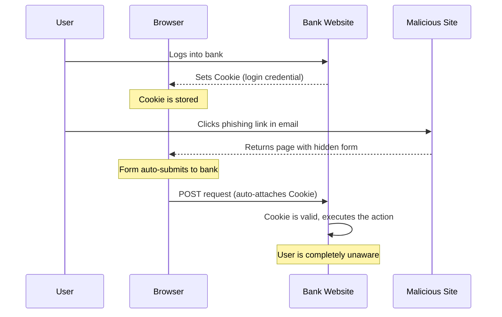
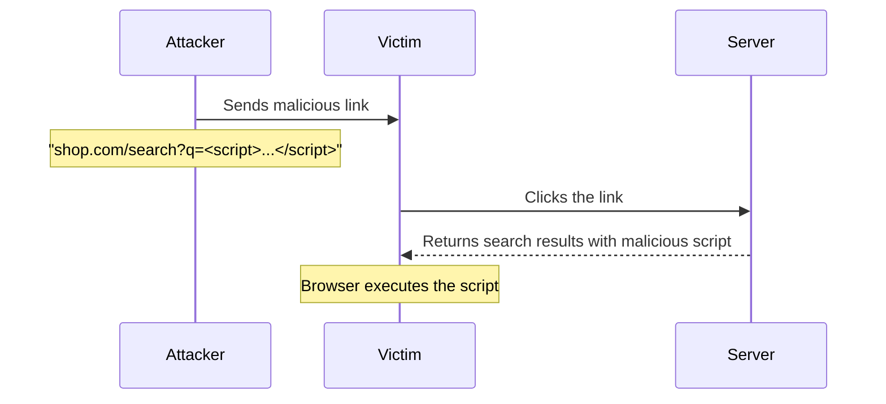
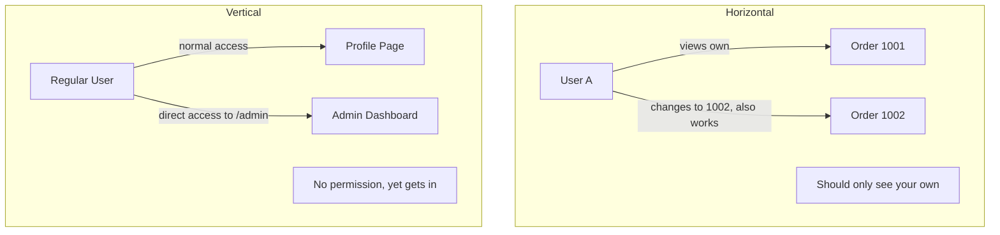
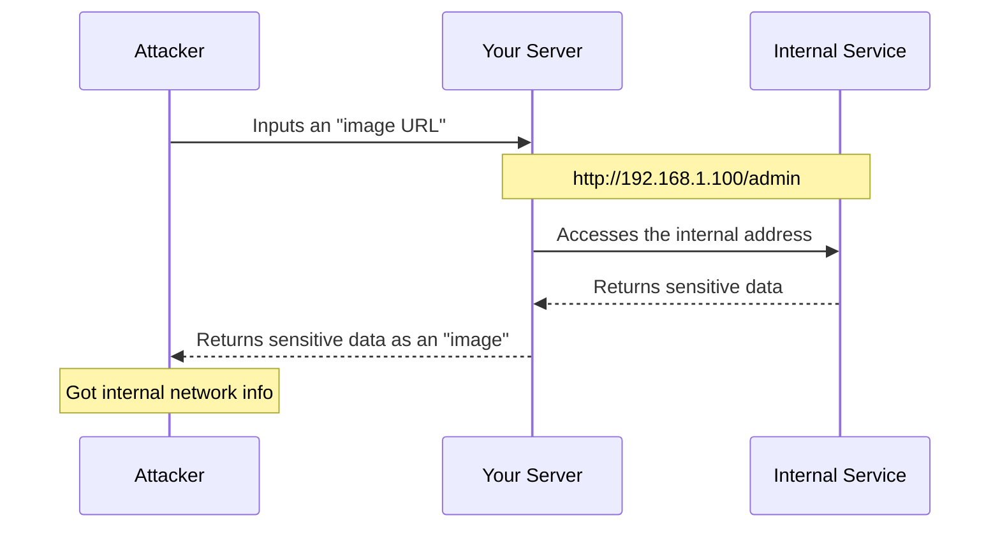
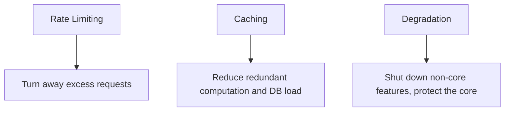

> Deploy on Friday afternoon. Database wiped by Monday morning. This is a true story from a friend of mine. You might think — what the hell, did this guy set his password to 123456? No. He just never considered that every single endpoint he wrote might be an unlocked door.

Here's what happened.

He worked at a small e-commerce company. Node.js, Express, MySQL. Nothing fancy — users place orders, check order history, manage shipping addresses. He thought he did a solid job. Everything worked. Bugs were squashed. On launch day, he even posted a "stable as a rock" meme in the team chat.

Monday morning, customer support told him: hundreds of orders had been rerouted to the same unknown address.

He dug through the logs for hours. The attack turned out to be devastatingly simple: register an account, place an order normally, then change the order ID in the URL from `10086` to `10085` and see if someone else's order shows up. It did. Try `10084`. Also worked. So the attacker wrote a script to iterate from `10001` to `20000`, scraped every order detail, picked the valuable ones, and changed all the shipping addresses to their own.

No SQL injection. No XSS. No advanced hacking technique. Just changing a number in a URL.

He sat there, staring at his screen, with a single thought: **fuck**.

After that, I started digging into web security — and I mean really digging. Most security vulnerabilities aren't mysterious hacker sorcery. They're more like the windows and doors of your house. You think they're locked, but you forgot one. This article covers every pitfall I've stepped into and witnessed, told to you straight. Not a sermon from a security expert — just a backend developer sharing what he's learned.

---

## 1. CSRF: When Someone Swipes Your Card Without Touching It

### Picture this

You're at a mall. You swipe your credit card to pay for something. The card is still in your wallet. Then some guy at another counter waves a POS terminal in the air, and money disappears from your account.

You'd say — bullshit, the card is in my pocket.

But in the browser, this happens every single day.

You log into your bank's website. Your browser stores the bank's cookie — this is your "credit card" now, held by the browser. You open a link from an email in another tab — it leads to an attacker's site. That site has a hidden form that submits a transfer request to your bank. The browser says, "Oh, we're sending a request to the bank?" and automatically attaches your cookie. The bank receives the request, sees a valid cookie, and processes the transfer.

You never knew anything happened. You didn't even type anything on that malicious page.

This is CSRF — Cross-Site Request Forgery. The name sounds intimidating. Here's the one-sentence version: **someone borrowed your identity to do something on your behalf.**

### How the attack works

Let's walk through it step by step:

1. You log into shop.com. Your browser gets a session cookie.
2. An attacker sends you an email: "Congratulations! Claim your $100 coupon here."
3. You click the link. A page loads saying "Coupon expired."
4. But hidden inside that page is an auto-submitting form targeting shop.com/change-address.
5. Your browser sees the target is shop.com, so it attaches your cookie automatically.
6. shop.com receives the request, validates the cookie, and changes your shipping address.
7. Every order you place from now on ships to the attacker.

What makes this vile is that the attacker never had your password. Never logged into your account. Never interacted with you directly — you did the work for them without knowing it.



### What it doesn't solve

CSRF protection does exactly one thing: **prevents someone from making requests pretending to be you.** It doesn't stop you from getting phished manually (typing the attacker's address into a real form yourself). It doesn't prevent XSS (we'll get to that). It doesn't guard against password leaks. It only handles the "browser automatically attaches cookies to cross-site requests" scenario.

### How to defend

Three approaches. Use them together.

**Approach 1: SameSite Cookie**

This is built into browsers. Add a `SameSite` attribute when setting cookies, and the browser checks: is this request coming from the same site? If not, don't send the cookie.

```javascript
res.cookie('session', userSessionId, {
  httpOnly: true, // JS can't read it — stops XSS from stealing cookies
  secure: true, // only over HTTPS
  sameSite: 'strict', // completely block cross-site cookie sending
})
```

`Strict` is the most restrictive — even clicking a legitimate link to your bank from an email won't carry the cookie, so you'll appear logged out. Slightly worse UX, but maximum safety.

`Lax` is a compromise: GET requests (like clicking links) carry the cookie, but POST requests (form submissions) don't. Most CSRF attacks use POST, so `Lax` already blocks the vast majority.

`None` means no restriction, but it must be paired with `secure` (HTTPS). Don't use this unless you genuinely need cross-site usage like embedded payment widgets.

**Approach 2: CSRF Token**

Simple idea: every time you render a form, the backend generates a random string, puts it in a hidden form field, and stores it in the session. When the form is submitted, the backend compares: does the submitted token match the session token? If not, reject.

```javascript
// Generate token
app.get('/transfer', (req, res) => {
  const csrfToken = crypto.randomBytes(32).toString('hex')
  req.session.csrfToken = csrfToken
  res.render('transfer', { csrfToken })
})
```

```html
<form action="/transfer" method="POST">
  <input type="hidden" name="csrfToken" value="{{csrfToken}}" />
  <input type="text" name="amount" />
  <button type="submit">Transfer</button>
</form>
```

```javascript
// Verify token
app.post('/transfer', (req, res) => {
  if (req.body.csrfToken !== req.session.csrfToken) {
    return res.status(403).json({ error: 'CSRF verification failed' })
  }
  // proceed with business logic
})
```

No matter how hard the attacker tries to forge a form, they can't get the token. It's different every time, and it lives in your session — the attacker's script can't read it.

**Approach 3: Double Submit Cookie**

This avoids server-side token storage. The idea: frontend JavaScript reads a value from a cookie and puts it in a request header. The backend verifies: are the cookie value and the header value identical? Cross-site requests can carry cookies but can't set custom headers, so the attacker can't forge this.

```javascript
const csrfProtection = (req, res, next) => {
  const cookieToken = req.cookies['csrf-token']
  const headerToken = req.headers['x-csrf-token']
  if (!cookieToken || !headerToken || cookieToken !== headerToken) {
    return res.status(403).json({ error: 'CSRF verification failed' })
  }
  next()
}
```

### My recommendation

SameSite: Lax as the baseline (browser-native protection). CSRF Token for sensitive operations (transfers, password changes, account deletion). If you're using Next.js or Laravel, they already bake in CSRF protection — don't reinvent the wheel.

---

## 2. XSS: The Page You See Might Not Be Yours

### What "the page might not be yours" means

You visit a website. Read an article. Scroll through the comments.

What you see is plain text. But what's stored in the database might be:

```html
Great article! 
```

It sits in the database, minding its own business. Someone opens the article, the server returns the article along with all the comments, the browser renders the page, hits the `` tag, fails to load `src=x`, triggers `onerror` — and sends the user's cookie to the attacker's server.

You didn't click anything. You didn't fill anything out. Your cookie is gone.

This is XSS — Cross-Site Scripting. The attacker injects malicious scripts into a trusted page and gets them to execute in other users' browsers.

### The three flavors of XSS

XSS isn't one attack. It's three. Different delivery paths, same goal: run someone else's code on your page.

**Reflected XSS: one-shot**

The malicious code comes in through a URL parameter. Take a search feature — you search for "iPhone" and the page says "You searched for: iPhone." If the server directly splices the search term into HTML without escaping:

```
https://shop.com/search?q=<script>alert('XSS')</script>
```

Someone clicks that link, the page renders "You searched for:", then executes the script. Attackers typically shorten the URL, dress it up, and blast it out in group chats or emails.

You might think — well, the victim has to click a link, the success rate can't be that high. But phishing emails don't need everyone to click. One person out of a hundred is enough.



**Stored XSS: poison in the well**

This is the most dangerous. Malicious code gets stored in the database, and every single person who visits the page gets hit.

The opportunities are everywhere: comment sections, user signatures, display names, article content, uploaded filenames — anything that comes from a user and gets rendered on a page is a potential vector.

Imagine a forum thread. Below the main post, there's a comment that looks perfectly normal. But buried in the comment body is a script. Every time the server renders this thread, it spits out the comment along with the script. Every person who opens the thread gets infected.

This isn't a one-time attack — it's persistent. The attacker might post it at 3 AM. For months afterward, tens of thousands of users have their cookies, personal info, and browsing history silently streaming to the attacker's server. And nobody notices because nobody reads the raw HTML of every comment.

**DOM-based XSS: the frontend-only trap**

This one has nothing to do with the backend. It's purely shitty frontend JavaScript.

```javascript
const params = new URLSearchParams(window.location.search)
const name = params.get('name')
document.getElementById('welcome').innerHTML = 'Welcome, ' + name
```

The attacker constructs `https://example.com?name=`. User opens it, JS splices the malicious string into the page via `innerHTML`, the browser parses the HTML and executes the script.

Does that code look familiar? A lot of old projects have welcome pages written exactly like that. Damn.

### What XSS can actually do

A lot of people think, "So what if an alert box pops up?" Listen to this:

1. Steal cookies, impersonate you with a full session
2. Keylog everything you type — passwords, card numbers, ID numbers
3. Rewrite page content — swap the "transfer" button with a "top up" button that sends money to the attacker
4. Embed crypto mining scripts, burning your CPU to mine coins
5. Auto-forward — use your account to spam phishing links to all your contacts

XSS is the root of all web security evil — because it gets every permission the browser has. Cookies, localStorage, page content, every user action. All accessible.

### How to defend

**Core principle: never directly splice user input into HTML.**

```javascript
// Wrong — direct splice
element.innerHTML = userInput

// Right — use textContent
element.textContent = userInput

// If you must use innerHTML, escape first
function escapeHtml(text) {
  const div = document.createElement('div')
  div.textContent = text
  return div.innerHTML
}
element.innerHTML = escapeHtml(userInput)
```

**Backend filtering with the xss library:**

```javascript
import xss from 'xss'

const clean = xss(userInput, {
  whiteList: {
    p: ['class'],
    strong: [],
    em: [],
    a: ['href', 'title'],
  },
})
```

Whitelist means: only allow these tags and attributes through, strip everything else. More reliable than a blacklist — you don't know what new attack vectors tomorrow will bring.

**Set CSP (Content Security Policy):**

This is the browser's last line of defense. Use HTTP headers to tell the browser: this page only allows scripts from these specific origins.

```javascript
import helmet from 'helmet'

app.use(
  helmet.contentSecurityPolicy({
    directives: {
      defaultSrc: ["'self'"],
      scriptSrc: ["'self'"],
      styleSrc: ["'self'"],
      imgSrc: ["'self'", 'https:'],
      objectSrc: ["'none'"],
      frameSrc: ["'none'"],
    },
  }),
)
```

With CSP set, even if an attacker successfully injects a script into the page, the browser refuses to execute it — because the script isn't on the whitelist. This is a safety net, not a replacement for escaping and filtering.

### What it doesn't solve

XSS protection only prevents malicious code from executing in the browser. It doesn't care if your password is weak, whether your server is patched, or if users get tricked by social engineering. It does one thing: stops other people from running their JavaScript on your pages.

---

## 3. Authorization Bypass: How Many Doors Does Your Key Open

### A scenario so real it'll make you uncomfortable

Your school has a student portal. Log in, see your grades.

The URL looks like this:

```
https://school.edu/score?studentId=20240001
```

You look at this URL, and a thought crosses your mind: what if I change `20240001` to `20240002`?

You try it. The page shows another student's grades.

You try `20240003`. Another person's grades.

Your heart rate picks up. You didn't "hack" the system. No password cracking. No tools. You just changed a number in the URL.

This is authorization bypass — the system trusts the user identifier that came from the frontend instead of confirming "who are you really?" from the session.

### Two kinds of privilege escalation

**Horizontal: see stuff from users at your level.**

You and other users have the same role. In theory, you should only see your own data. But the system never checks "does this data belong to you?" — so changing the ID lets you see anything. That's the grade-checking scenario above.

**Vertical: access features you have no permission for.**

You're a regular user, but you try hitting `/admin/dashboard` directly — and it loads. The system only hid the "Admin Panel" button from the menu, but never put any permission check on the backend. The attacker doesn't need to see a button — they just need browser dev tools.



### Why this is hard to catch in testing

Because developers and testers use the app "normally" — log in, check their own data, log out. Who's going to change the ID in the URL during testing? Nobody.

But attackers will. The first thing they do with your app: register an account, then start changing IDs, parameters, request methods — mapping out what they can touch.

### How to defend

**Rule number one: get the current user from the session. Never trust a user ID from the frontend.**

```javascript
// Wrong — uses URL userId directly
app.get('/order/:orderId', async (req, res) => {
  const order = await db.order.findById(req.params.orderId)
  res.json(order) // anyone can see any order
})

// Right — verify ownership first
app.get('/order/:orderId', async (req, res) => {
  const currentUser = req.session.userId
  const order = await db.order.findById(req.params.orderId)

  if (order.userId !== currentUser) {
    return res.status(403).json({ error: 'Access denied' })
  }

  res.json(order)
})
```

**Use UUID instead of auto-increment IDs.**

Auto-increment IDs are too easy to guess. 1001, 1002, 1003 — a loop covers them all. A UUID looks like:

```
a1b2c3d4-e5f6-7890-abcd-ef1234567890
```

You could iterate for a million years and never guess the next one. But be clear: UUID only **raises the difficulty of guessing** — it's not a replacement for authorization checks. Authorization is the real defense. UUID stops attackers from knowing what to guess; authorization says "even if you guess it, you don't get to see it."

**Global permission middleware:**

```javascript
function requireAuth(allowedRoles = []) {
  return async (req, res, next) => {
    if (!req.session.userId) {
      return res.status(401).json({ error: 'Login required' })
    }

    const user = await db.user.findById(req.session.userId)

    if (allowedRoles.length > 0 && !allowedRoles.includes(user.role)) {
      return res.status(403).json({ error: 'Insufficient permissions' })
    }

    req.user = user
    next()
  }
}

// Only admins
app.get('/admin/dashboard', requireAuth(['admin']), (req, res) => {
  res.json({ message: 'Admin panel' })
})
```

### What it doesn't solve

Authorization only handles "can you see/modify this resource." It doesn't care if the request is a CSRF attack (that's SameSite/CSRF Token territory) or if it contains an XSS payload (that's output escaping and CSP). Security stacks in layers — no single layer covers everything.

---

## 4. SSRF: Your Server Becomes Someone Else's Proxy

### Something that'll send a chill down your spine

Cloud servers (AWS, Alibaba Cloud, GCP) all run something called a "metadata service." The IP is fixed: `169.254.169.254`. This service isn't meant for external access — it's for the virtual machine to read internal info: API keys, instance IDs, network config.

Normally, the outside world can't reach this address. But if your server has a "screenshot this URL" feature — user inputs a URL, your server visits it, takes a screenshot, returns it — the attacker can input:

```
http://169.254.169.254/latest/meta-data/
```

Your server obediently visits the metadata service, fetches the keys, screenshots them, and returns them to the attacker.

Damn. Your server just opened an internal door for the attacker.

This is SSRF — Server-Side Request Forgery. **Your server makes a request to someplace the attacker wants to go but can't reach directly.**

### How the attack works

Normal user of your image download feature: inputs `https://cdn.example.com/photo.jpg`, your server downloads it, saves it. Fine.

Attacker using your image download feature: inputs `http://192.168.1.1:8080/admin`, your server accesses your internal admin panel and returns the page content as a "picture."



### Which features are vulnerable

- Webpage screenshot (Puppeteer rendering a URL to image)
- Image download / thumbnail generation
- Webhook callbacks — user provides a URL, you POST to it later
- File import — "import data from URL"
- API proxy — forwarding user requests as-is

These features share one trait: **the user controls a URL, and your server makes a request to that URL.** Think about that. As long as the attacker controls the URL, they control where your server goes.

### Real attack examples

**Read cloud credentials:**

```
http://your-app.com/fetch?url=http://169.254.169.254/latest/meta-data/iam/security-credentials/
```

Get IAM credentials, and the attacker effectively gets full access to your cloud account.

**Port scanning the internal network:**

```
http://your-app.com/fetch?url=http://10.0.1.5:3306/
```

MySQL responds `Host 'xxx' is not allowed`. Redis responds `-NOAUTH Authentication required`. From the responses, the attacker can map out what services are running on your internal network and which ports are open.

**Read local files:**

```
http://your-app.com/fetch?url=file:///etc/passwd
```

If your HTTP client didn't disable the `file://` protocol, you're directly serving system files.

### How to defend

**Approach 1: block internal IPs**

```javascript
import dns from 'node:dns/promises'
import { isInternal } from 'is-internal-ip'

app.post('/fetch', async (req, res) => {
  const { url } = req.body
  const urlObj = new URL(url)

  // Block localhost and .local
  if (urlObj.hostname === 'localhost' || urlObj.hostname.endsWith('.local')) {
    return res.status(400).json({ error: 'Local resources are blocked' })
  }

  // DNS resolve and check if IP is internal
  const records = await dns.lookup(urlObj.hostname, { all: true })
  for (const record of records) {
    if (await isInternal(record.address)) {
      return res.status(400).json({ error: 'Internal resources are blocked' })
    }
  }

  const response = await fetch(url)
  const buffer = await response.arrayBuffer()
  res.send(Buffer.from(buffer))
})
```

Important: checking the hostname alone isn't enough. You must do a DNS lookup and check the resolved IP. Someone can register a domain like `nice-pic.com` and point it to `10.0.0.1` — it looks like an external domain, but it resolves to an internal address.

**Approach 2: domain whitelist**

If you only need to fetch images from a few fixed domains, lock it down:

```javascript
const ALLOWED_DOMAINS = ['cdn.myapp.com', 'img.myapp.com']

const urlObj = new URL(url)
if (!ALLOWED_DOMAINS.includes(urlObj.hostname)) {
  return res.status(400).json({ error: 'Domain not allowed' })
}
```

**Approach 3: disable dangerous protocols**

```javascript
// Only allow http and https
if (!url.startsWith('http://') && !url.startsWith('https://')) {
  return res.status(400).json({ error: 'Only http/https supported' })
}

// Block common high-risk ports
const dangerousPorts = [22, 25, 3306, 5432, 6379, 27017]
const port = urlObj.port || (urlObj.protocol === 'https:' ? '443' : '80')
if (dangerousPorts.includes(parseInt(port))) {
  return res.status(400).json({ error: 'Port not allowed' })
}
```

### What it doesn't solve

SSRF protection only ensures requests your server makes don't hit internal resources. It doesn't prevent users from accessing those addresses directly (that's the firewall's job). It doesn't stop other injection types (XSS, SQL injection). Its sole responsibility: watching the requests your server makes on behalf of users.

---

## 5. The Other Things That'll Get You

CSRF, XSS, authorization bypass, SSRF — those are the big four. But there are smaller things that can still wreck you. Let me cover them together.

### 5.1 Open Redirect: You Think You're Going to the Real Site

A lot of login pages have a `redirect` parameter:

```
https://shop.com/login?redirect=/cart
```

After login, redirect to the cart. Totally fine. But if left unchecked:

```
https://shop.com/login?redirect=http://evil-fake-shop.com/login
```

The user clicks a link that starts with shop.com. After login, they land on a fake site that looks exactly like shop.com. They enter their credentials. The attacker has them.

```javascript
// Whitelist-based validation
const ALLOWED_HOSTS = ['shop.example.com', 'app.example.com']

app.get('/login', (req, res) => {
  const redirectUrl = req.query.redirect
  if (!redirectUrl || !ALLOWED_HOSTS.includes(new URL(redirectUrl).hostname)) {
    return res.redirect('/dashboard')
  }
  res.redirect(redirectUrl)
})
```

Simplest rule: only allow relative-path redirects, or stick to a strict domain whitelist.

### 5.2 HPP: One Parameter, Two Meanings

```
GET /search?q=apple&q=banana
```

Different frameworks handle duplicate parameters differently. PHP takes the last one. ASP.NET concatenates: `apple,banana`. Express takes the last one. Why does this matter?

Imagine a security filter plugin that only checks the first `q` parameter (`apple`, clean), but your downstream business logic uses the second `q` (`banana`, malicious). The check passes, and the attack lands.

```javascript
import hpp from 'hpp'
app.use(hpp({ allow: ['tags'] })) // only allow duplicates on specified params
```

### 5.3 Dependency Vulnerabilities: There Might Be a Stranger in Your Code

The npm ecosystem has millions of packages. You run `npm install` — maybe 50 direct dependencies, but they pull in hundreds of transitive ones. Any one of them having a security issue means your project has an open door.

In 2018, an attacker injected malicious code into the `event-stream` package — specifically targeting Bitcoin wallet private keys. `event-stream` had millions of weekly downloads. Many developers didn't even know they had it installed — it was a dependency of a dependency of a dependency.

What to do:

```bash
npm audit              # check for known vulnerabilities
npm audit fix          # auto-fix what's fixable
```

Add a CI check too:

```yaml
# .github/workflows/security.yml
name: Security Audit
on: [push, pull_request]
jobs:
  audit:
    runs-on: ubuntu-latest
    steps:
      - uses: actions/checkout@v4
      - uses: actions/setup-node@v4
        with: { node-version: '20' }
      - run: npm ci
      - run: npm audit --audit-level=high
```

Also: lock your dependencies with `package-lock.json`. Don't let them silently upgrade to a backdoored version. For critical dependencies, consider forking them to your own repo.

### 5.4 Path Traversal: Climbing Up With `../`

```javascript
// Vulnerable code
app.get('/download', (req, res) => {
  res.sendFile(__dirname + '/files/' + req.query.file)
})
```

Attacker inputs:

```
GET /download?file=../../../etc/passwd
```

The server actually reads `/var/www/app/files/../../../etc/passwd`, which resolves to `/etc/passwd`.

Fix: normalize the path, then verify it's still within the allowed directory.

```javascript
import path from 'node:path'
import fs from 'node:fs'

app.get('/download', (req, res) => {
  const baseDir = path.join(__dirname, 'files')
  const filePath = path.normalize(path.join(baseDir, req.query.file))

  if (!filePath.startsWith(baseDir)) {
    return res.status(403).json({ error: 'Invalid path' })
  }

  if (!fs.existsSync(filePath) || !fs.statSync(filePath).isFile()) {
    return res.status(404).json({ error: 'File not found' })
  }

  res.sendFile(filePath)
})
```

### 5.5 SQL Injection: Even Though Everyone Uses an ORM

An ORM blocks most SQL injection, but you'll eventually write raw SQL — complex reports, performance optimizations, legacy queries. When you do:

```javascript
// Wrong — string concatenation
const sql = `SELECT * FROM users WHERE name = '${username}'`
// User inputs ' OR '1'='1, actual query becomes:
// SELECT * FROM users WHERE name = '' OR '1'='1'
// Returns every single user!

// Right — parameterized query
const sql = 'SELECT * FROM users WHERE name = ?'
db.query(sql, [username])
```

The ORM isn't a silver bullet. You can still create injection vectors in `orderBy`, `groupBy`, or any place where you're dynamically splicing field names. Stay paranoid about user input. Always.

---

## 6. Rate Limiting: Not Everyone Wants to Use Your Site Nicely

### The scenario

Your API is running fine. QPS around a hundred. Then one day, CPU spikes to 100%. Database connection pool exhausted. Every request times out.

You check the logs — a single IP is sending ten thousand requests per second. Same endpoint, over and over.

Not a DDoS. Just a competitor or some bored person scanning your API with a script.

Your server never said no. It dutifully processed every single request until it collapsed.

Rate limiting handles exactly this. It doesn't do complex logic. It just counts: how many requests have you sent in this time window? Too many? Denied.

### Four rate limiting strategies

**Fixed Window Counter**

The simplest. Define a time window (say, 1 minute). Within that window, at most N requests. Exceed it? Rejected.

But there's a problem called "boundary burst": 100 requests at 0:59, and 100 requests at 1:00. Across two minutes, that's fine. But in reality, 200 requests hit within one second.

```javascript
import rateLimit from 'express-rate-limit'

const limiter = rateLimit({
  windowMs: 60 * 1000,
  max: 100,
  standardHeaders: true,
  keyGenerator: (req) => req.ip,
})
app.use('/api', limiter)
```

**Sliding Window Counter**

Chops the time window into smaller segments and computes a weighted average. Don't worry about the implementation details. Just know: it's smoother than fixed window, no boundary bursts, but a bit more complex.

```javascript
class SlidingWindowRateLimiter {
  constructor(windowMs, maxRequests) {
    this.windowMs = windowMs
    this.maxRequests = maxRequests
    this.requests = new Map()
  }

  isAllowed(ip) {
    const now = Date.now()
    const windowStart = now - this.windowMs
    const timestamps = (this.requests.get(ip) || []).filter((t) => t > windowStart)
    this.requests.set(ip, timestamps)

    if (timestamps.length >= this.maxRequests) {
      return { allowed: false, remaining: 0 }
    }

    timestamps.push(now)
    return { allowed: true, remaining: this.maxRequests - timestamps.length }
  }
}
```

**Leaky Bucket**

Picture a bucket with a small hole in the bottom. Requests pour in from the top. Water leaks out the bottom at a fixed rate. When the bucket is full, new water overflows — rejected.

Great for scenarios needing steady processing, like message queue consumption. But it can't handle bursts — even if the bucket is empty, the outflow rate is fixed.

```javascript
class LeakyBucket {
  constructor(capacity, leakRatePerSecond) {
    this.capacity = capacity
    this.water = 0
    this.leakRate = leakRatePerSecond
    this.lastLeakTime = Date.now()
  }

  drop() {
    this.leak()
    if (this.water < this.capacity) {
      this.water++
      return true
    }
    return false
  }

  leak() {
    const elapsed = (Date.now() - this.lastLeakTime) / 1000
    this.water = Math.max(0, this.water - elapsed * this.leakRate)
    this.lastLeakTime = Date.now()
  }
}
```

**Token Bucket**

This is my personal favorite. The bucket holds tokens. Tokens are generated at a fixed rate (up to the bucket's capacity). Each request must grab a token. No tokens left? Denied.

Token bucket has an excellent property: it supports bursts. Say the bucket holds 100 tokens. During quiet periods, tokens accumulate. Then a sudden spike hits — you can burn through all those accumulated tokens at once without getting rejected.

```javascript
class TokenBucket {
  constructor(capacity, refillRatePerSecond) {
    this.capacity = capacity
    this.tokens = capacity
    this.refillRate = refillRatePerSecond
    this.lastRefillTime = Date.now()
  }

  take() {
    this.refill()
    if (this.tokens >= 1) {
      this.tokens--
      return true
    }
    return false
  }

  refill() {
    const elapsed = (Date.now() - this.lastRefillTime) / 1000
    this.tokens = Math.min(this.capacity, this.tokens + elapsed * this.refillRate)
    this.lastRefillTime = Date.now()
  }
}
```

### Distributed rate limiting

Everything above counts on a single server. If you have 10 servers, each limiting 1000 QPS, your total becomes 10000 QPS — which might still crush your database.

You need a centralized counter. Redis is the standard choice:

```javascript
import Redis from 'ioredis'
const redis = new Redis(process.env.REDIS_URL)

async function slidingWindowLimit(key, windowMs, maxRequests) {
  const now = Date.now()
  const windowStart = now - windowMs

  const multi = redis.multi()
  multi.zremrangebyscore(key, 0, windowStart)
  multi.zadd(key, now, `${now}-${Math.random()}`)
  multi.zcard(key)
  multi.expire(key, Math.ceil(windowMs / 1000))

  const results = await multi.exec()
  const count = results[2][1]
  return { allowed: count <= maxRequests, remaining: Math.max(0, maxRequests - count) }
}
```

Redis sorted sets (ZSET). Each request timestamp is a score. Old records outside the window get purged automatically. Count within the window.

### Which algorithm to pick

| Algorithm      | What it gives you | What it fears         | Where to use it            |
| -------------- | ----------------- | --------------------- | -------------------------- |
| Fixed Window   | Simple            | Boundary bursts       | Less sensitive endpoints   |
| Sliding Window | Precision         | Slightly more complex | API rate limiting          |
| Leaky Bucket   | Smooth flow       | Can't handle bursts   | Message queue consumers    |
| Token Bucket   | Burst support     | Slightly more complex | Best choice for most cases |

Token bucket works for most situations. Simple and flexible.

### What it doesn't solve

Rate limiting only handles "too many requests." It doesn't distinguish between good and bad requests (rate, not content). It doesn't stop DDoS (the traffic might be blocked at the network layer before it reaches you). It doesn't fix logic bugs in your code. It's a traffic valve, not a firewall.

---

## 7. Rate Limiting, Caching, Degradation: Three Paths to Keeping Your System Alive

These three always get mentioned together. They're independent, but combined they keep your system from collapsing under pressure.

**Rate limiting** stands at the front door, turning away requests beyond capacity. Like a bouncer at a club — if it's full inside, you wait outside.

**Caching** stands in front of the database. Most requests query the same data — why recompute it from the database every single time? Use Redis or in-memory cache to absorb hot data. 90% of requests die at the cache layer before ever touching the database.

**Degradation** is the last resort — when you truly can't keep up, shut down non-critical features. During a flash sale, temporarily disable "view order history" to free up resources for checkout and payment.



There's a progression: rate limiting stabilizes overall pressure, caching absorbs most read traffic, and when all else fails, degradation sacrifices experience to prevent collapse.

---

## 8. Finally, a Set of Questions for You

I'm not going to summarize. Security isn't about memorizing a checklist. Real security awareness comes from a reflexive "wait — could this go wrong?" that fires in your head every time you write an endpoint.

So here are a few questions. Ask yourself these after every endpoint you build:

1. **Who can send this request?** Is there an auth check? Is there a permission check?
2. **Is the user ID / order ID coming from the session, or from the frontend?** If from the frontend — what happens if someone changes it?
3. **Does this endpoint's response contain user input?** If so, did you escape it?
4. **Does this endpoint make the server visit a user-provided URL?** If so, did you add SSRF protection?
5. **Does this endpoint create, modify, or delete data?** If it's a GET request doing this, switch it to POST/PUT/DELETE and check for CSRF.
6. **Did you at least glance at what `npm install` just pulled in?** At minimum, run `npm audit`.

Answer these six, and you'll dodge most of the traps. The rest comes from experience and staying alert.

The essence of security isn't "being unattackable." It's **adding one more thought to every feature you build, raising the attacker's cost**. You don't need to build an unbreakable safe — you just need to be harder to crack than the safe next to yours.

Damn, it's dark outside now. I'll leave you with this: every line of code you write, someone is watching it through a scanner.

A little more vigilance, a little less regret.
