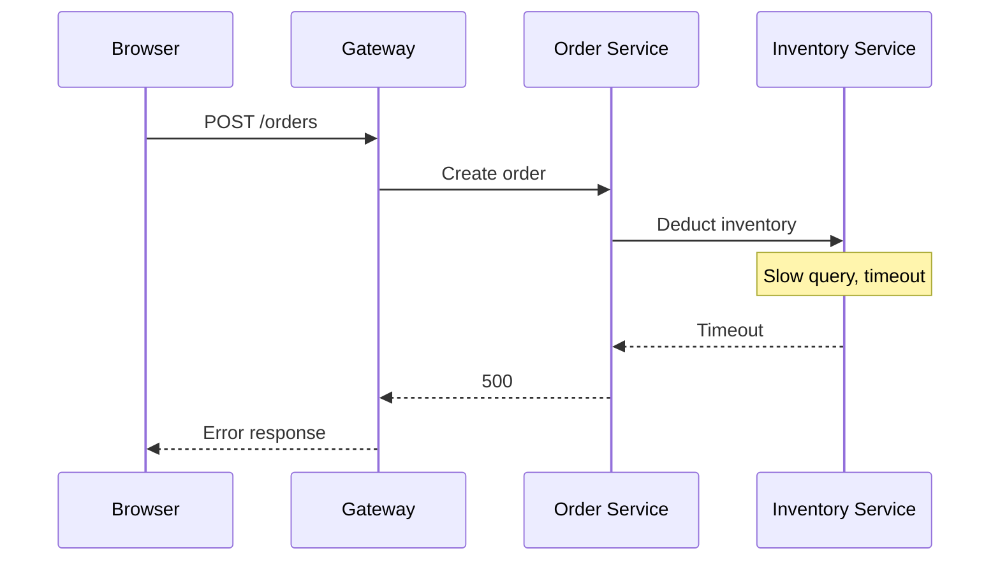

## What Is Observability

Observability comes from control theory: a system is observable if its internal state can be inferred from its external outputs. In software, the external outputs are telemetry data — logs, metrics, and traces. A service is observable when, at failure time, you can answer "what happened inside the system" using only the data you already have, instead of redeploying code, adding logs, and waiting for the failure to recur.

For software, "internal state" is not abstract: which queue a request is stuck in, why a database query is slow, why a message was retried three times, whether a new version introduced a regression. An observable system can answer these questions with existing data during an incident; an unobservable one can only reproduce, add logs, and wait.

Telemetry answers three different kinds of questions, with different costs and granularity:

| Signal  | Question it answers          | Granularity                     | Typical cost and retention                 |
| ------- | ---------------------------- | ------------------------------- | ------------------------------------------ |
| Logs    | What happened at a moment    | One record per event            | Largest volume, usually shortest retention |
| Metrics | How the system is performing | Aggregated time series          | Cheapest, usually longest retention        |
| Traces  | What a request went through  | Span tree organized per request | Moderate volume, usually sampled           |

Three sentences summarize it: logs give detail, metrics give the big picture, traces give causality. Used alone, each has blind spots: logs don't know where a request came from, metrics don't know what an individual request experienced, traces don't know business context. Together, the three signals reconstruct the full picture of an incident.

Take an order request: the log says "10:00:01.234 order creation failed, inventory service timed out"; the metric says "0.3% error rate, 800ms P99 latency"; the trace says "gateway → order service → inventory service → database", with the duration of each step. The three describe the same event at different granularities; only when joined do they form the complete story.

"Data you already have" is the key phrase in the definition. Monitoring presupposes you know in advance what to watch: CPU usage, error rate, queue length. Observability presupposes the data retains enough context that developers can ask questions they did not predefine when the problem happens: why a request was slow, why it took this branch, why only certain users failed.

### Monitoring vs. Observability

| Dimension      | Monitoring                                       | Observability                                                                        |
| -------------- | ------------------------------------------------ | ------------------------------------------------------------------------------------ |
| Question       | Is the system healthy?                           | Why is the system unhealthy?                                                         |
| Data source    | Predefined metrics and alerts                    | Context-rich logs, metrics, and traces                                               |
| Use case       | Known risks: capacity, availability, error rates | Unknown problems: intermittent slow requests, cross-service failures, anomalous data |
| Typical action | Threshold alerts, dashboards                     | Drill down along traces, correlate data, post-hoc analysis                           |

Monitoring and observability are not replacements. Monitoring signals when the system crosses a boundary; observability locates the cause once the signal appears. Without monitoring, failures may go unnoticed until users complain; without observability, an alert only says "something broke", not "where and why".

From an organizational view, monitoring answers "is the system available" and is consumed by on-call and alerting pipelines; observability answers "why is the system behaving this way" and is consumed by developers during debugging. They serve different roles, which is why they coexist rather than replace each other.

Observability also makes monitoring smarter: defining error rates from trace data can distinguish business errors from system errors; with SLOs and error budgets, alerts shift from "a number crossed a line" to "user experience is being affected". Monitoring still raises the signal; the quality of the signal depends on how complete the underlying data is.

Problems fall into two categories. Known unknowns are risks you can enumerate in advance: disks fill up, memory leaks, error rates rise — monitoring sets thresholds for them. Unknown unknowns are problems you cannot enumerate ahead of time: a cache stampede slowing a specific user segment, a new version changing request routing, a model taking a wrong branch on specific input. You cannot predefine alerts for these; you can only ask questions against context-rich raw data after the fact.

The threshold dilemma: set thresholds low and false positives pile up, alert fatigue sets in, and real failures drown in noise; set them high and failures manifest as gradual drift rather than sharp spikes — by the time a number crosses the line, the blast radius has grown. The deeper issue is that failure shapes don't repeat, so predefined thresholds always lag behind new problems. Observability's value is precisely here: it does not predict problems; it guarantees the data can answer any question.

Observability is also different from debugging. Debugging depends on reproduction: get the same input, step through breakpoints locally or in a test environment, find the code path. In distributed systems, many failures are triggered by traffic patterns, data distribution, or timing races and cannot be reproduced reliably. Observability does not require reproduction; it asks questions against data in the environment where the problem occurred. If the data is complete enough, the problem can be answered in production.

## Why Traditional Tools Fall Short

### More Components, Broken Causality

In the monolith era, one request completed inside a single process, and logs in chronological order reconstructed the whole journey; in-process call stacks revealed every call relationship. After services were split, one request crosses gateways, multiple services, message queues, and databases. Each component logs and reports metrics on its own, with no common identifier between them — you cannot answer "what did this request actually go through".

In distributed systems, even time is not naturally aligned. Host clocks can differ by seconds; a log timestamp only means "local time", so sorting events across hosts by timestamp can invert causality. Trace data does not depend on clock alignment: parent-child relationships are determined by propagated context; timestamps are only for display. That is why correlation identifiers are more reliable than timestamps.

Here is a common scenario:



The browser receives "order creation failed"; the gateway logs that upstream returned 500; the order service logs that the inventory call timed out; the inventory service logs that the SQL took 8 seconds. Every piece of data is true, but none of them alone explains the full causal chain. Finding the root cause requires reassembling the fragments of the same request across services — exactly what distributed tracing does.

Timeouts and retries distort symptoms further. After a downstream timeout, the upstream may retry twice or three times, and each service records its own error log; on a timeline, the errors look like three independent failures spread over a dozen seconds, when they are actually three manifestations of the same root cause. Without traces, investigators can only line up logs by time and guess — and guessing is expensive.

Asynchronous calls make this worse. Message queues, scheduled jobs, and background batches split one business operation into discontinuous execution segments; logs appear in different processes at different times. Synchronous calls can still be located with a call stack; async chains need extra information just to know "who called whom". Tracing is designed for exactly this: every execution segment records the same traceId and marks its parent, so async segments can be stitched back into the same chain.

### Metrics Only Answer "How Many"

Metrics are aggregated data: requests per second, error rate, P99 latency. Aggregation inherently discards individual information. A degrading P99 says the system as a whole is getting slower, but not which user, which trace, or which parameter caused it. Aggregates are right for capacity planning and alerting; for incident investigation they are only a starting point.

Error rates dilute problems too. A 0.1% overall error rate sounds low — but if only one request type is affected, those users experience 100% failure. Aggregation flattens the problem until it disappears; it only becomes visible when you break the data down by request dimension, which is exactly what trace data provides.

Consider what percentiles mean. Averages are dominated by long tails: if 1% of requests are 10x slower, the average rises by only a few percent, while the affected users experience a catastrophe. P99 means 99% of requests are faster than that value; it reflects tail experience better than the average, but it is still one aggregated curve — it does not say which requests make up that 1% or what conditions triggered them. The further down the aggregation path, the cleaner individual information is lost.

A concrete example: an alert shows order API P99 latency rising from 200ms to 800ms. The number says the system got slower, but every follow-up question needs finer data: which deployment caused it? A specific region, product category, or payment channel? Is the latency spent in the gateway, business logic, or database? After aggregation, these answers have been erased from the data. Answering them requires per-request trace data, not aggregated time series.

The aggregation window also affects conclusions. The same data may look fine at 1-minute windows and show a clear batch of timeouts at 1-second windows. The larger the window, the more transient failures get smoothed away; the smaller the window, the higher the storage and query cost. Teams switching between windows often get contradictory impressions, and metrics cannot explain the contradiction themselves.

The right role for metrics is capacity planning and trend discovery: long-term growth, seasonal patterns, version comparisons — these need aggregates. Treating a metric's conclusion as root cause is the most common misuse in debugging: metrics say "what changed", not "why it changed".

### Logs Lack Correlation

Logs are event records with no inherent request boundary. In a multi-service setup, the same request produces separate logs in every service; without a correlation field like trace_id, search is fuzzy time matching. The value of logs is not volume but whether all fragments of one event can be tied together.

Logs are also the hardest signal to standardize. Metrics have fixed numeric shapes, traces have fixed structure, logs are free text that can contain anything. How structured they are determines how searchable they are: plain text supports keyword search only; structured fields allow filtering by service, level, and user. The goal of a unified log model is not to constrain content but to give every log a correlatable shell.

Even with structured logging everywhere, cross-service correlation still depends on human conventions. One team uses request_id, another uses order_id; the gateway forwards a header, the downstream never propagates it, and the logs become islands again. Conventions only hold among the people who write the code; change teams, systems, or vendors and the convention breaks. OpenTelemetry's answer is a unified trace_id: the SDK automatically injects trace identifiers into log context, log backends aggregate by trace_id, and logs from any service can be attached to the full trace.

Logs also have cost and sampling problems. Full logs on high-traffic services grow storage directly with traffic; to control cost, a common practice is sampling — keep one in ten, for example. Once sampled, the failure log may happen to fall in the discarded portion, and you discover at investigation time that the key evidence does not exist. Logging systems need "findable when needed", not "store everything"; that contradiction cannot be solved by logging alone.

### AI Applications Amplify Unknown Problems

AI applications push "unknown problems" to a new level. LLM outputs are nondeterministic: the same input can produce different outputs. Agents autonomously decide which tools to call and in what order. The root cause of one failure can be spread across the prompt, tool calls, context window, and provider rate limits.

Agent scenarios are more complex than a single RAG call: one task may loop over tool calls and change its plan based on intermediate results. Every choice affects the final outcome, and the traditional binary "success/failure" status is nowhere near enough. What needs recording is the decision process itself, not just the result.

Take a RAG Q&A: it involves at least these stages — which documents retrieval returned, how long the context spliced into the prompt was, model call latency and token counts, whether a tool call was triggered, and what the tool returned. Any stage can determine the quality of the final answer. If you only record "call succeeded", neither quality nor cost problems can be localized.

Cost works the same way: the same feature with different models or context lengths can differ in unit cost by an order of magnitude. Once traces record the model and token usage, cost problems can be broken down by request, feature, and user.

The problems AI applications introduce fall into three categories. Quality: hallucinations, poor retrieval, truncated context — surfacing as "answers that miss the question". Cost: model selection, input/output tokens, failed retries — each directly maps to a bill line. Decision chain: why an Agent chose a tool or abandoned a branch — this determines whether behavior is explainable. Traditional metrics answer "did the call succeed and how long did it take", not these three. Answering them requires recording each stage as part of a trace, so "why is this answer bad" becomes a question you can search and compare. This is why observability gets more attention in the AI era.

## What Is OpenTelemetry

OpenTelemetry is an open-source, vendor-neutral standard and toolset for generating, collecting, processing, and exporting telemetry data, covering all three signals: traces, metrics, and logs.

Structurally it has three parts:

- Specification: defines the data model, API, cross-process context propagation, and semantic conventions for attribute names.
- SDKs and instrumentation libraries: official implementations for more than 20 languages, including automatic and manual instrumentation APIs.
- Collector: a standalone component that receives, processes, and forwards telemetry data, decoupled from application code.

| Part          | Responsibility                                         | Typical artifacts                                     |
| ------------- | ------------------------------------------------------ | ----------------------------------------------------- |
| Specification | Defines the data model, API, and semantic conventions  | Span structure, attribute naming, context propagation |
| SDK           | Generates and exports telemetry inside the application | Node.js, Go, Python instrumentation libraries         |
| Collector     | Receives, processes, and exports telemetry             | OTLP receivers, sampling, data redaction              |

The specification is what distinguishes OpenTelemetry from an ordinary SDK. A normal library binds data format and upload logic together, so switching backends means switching libraries; the specification pins down the data model, protocol, and attribute naming, and the SDK is just an implementation of it. Instrumentation no longer binds to a specific backend — switching backends only changes export configuration.

Inside the SDK there is another split between API and implementation: business code only depends on the API, creating tracers, meters, and loggers; how things are actually done (aggregation, sampling, export) is decided by the SDK. Automatic instrumentation is the key payoff of this layering: for common web frameworks, HTTP clients, and database drivers, the SDK creates spans, injects context, and captures request attributes via hooks without modifying business code. Business code only adds domain information: order IDs, user IDs, business branches. The cost of adoption drops to a few lines of initialization — which is the premise for OpenTelemetry's wide adoption.

The Collector is a component independent of application processes. It receives data from SDKs, runs it through a pipeline (sampling, filtering, redaction, routing), and exports to backends. Its existence keeps governance logic out of every application: changing sampling rules or export targets means changing Collector configuration only.

Putting the three parts together for one request: a browser request enters the gateway, the SDK creates a root span; when the gateway calls downstream it writes context into request headers; downstream services extract the context and create child spans; all spans are batched in-process and encoded by an Exporter into OTLP; the Collector receives them, applies sampling and filtering, and exports to a backend. Instrumentation, collection, and analysis are independent, and any layer can be replaced on its own.

This path is SDK-centric. For components that cannot run an SDK, the ecosystem also has zero-instrumentation approaches like eBPF that generate the same OTLP data through kernel hooks. The two paths complement each other and cover different scenarios.

Here is the minimal data shape of one HTTP request fragment:

```json
{
  "name": "GET /orders/:id",
  "traceId": "4bf92f3577b34da6a3ce929d0e0e4736",
  "spanId": "00f067aa0ba902b7",
  "parentSpanId": "73d1a3f6b3b6a1c5",
  "startTime": "2026-08-09T10:00:00.000Z",
  "endTime": "2026-08-09T10:00:00.120Z",
  "attributes": {
    "http.request.method": "GET",
    "server.address": "api.example.com"
  }
}
```

traceId ties the fragments of one request into a full trace; spanId identifies the current fragment; parentSpanId records its position in the trace; startTime and endTime give duration; attributes provide query dimensions. A span can also carry status (OK, Error, Unset) to mark success or failure, span events to record key moments, and links to connect cross-trace or asynchronous relationships.

Attribute names are governed by semantic conventions: the HTTP method is http.request.method, the database system is db.system, the model provider is gen_ai.provider.name. Without this layer, every team names things its own way, and even uniformly formatted data cannot be understood across services and tools. Conventions make out-of-the-box dashboards, alert templates, and cross-vendor migration possible. Conventions are graded by stability: stable promises not to change long-term, experimental may change, and a schema version lets tools identify them.

Semantic conventions cover more than span attributes: metric names, log fields, and Resource fields too. The whole namespace is unified, not just one signal; the three signals correlate across systems because they share the same naming.

Components communicate over OTLP (OpenTelemetry Protocol). OTLP is a protobuf-based binary protocol running over gRPC or HTTP, with batching and compression by default, used between SDK and Collector and between Collector and backend. gRPC suits high-volume service-to-service transfer; HTTP passes through proxies and firewalls more easily; SDKs and Collectors usually default to one and allow switching. With a unified protocol, the same instrumentation data can be sent to any OTLP-capable backend; cloud vendors and commercial products join the ecosystem by supporting OTLP. Contrast Prometheus's text format — designed for pull and its own storage — OTLP is designed for push and arbitrary backends: the protocol unification is the first time "collection" and "analysis" are truly separated.

OpenTelemetry is not a monitoring backend. It does not store or query data, and it does not provide dashboards. Data ultimately exports to Prometheus, Grafana, Jaeger, cloud vendors, or commercial observability platforms. OpenTelemetry sits in the "collection and standards" layer; backends sit in the "storage and analysis" layer; the two are decoupled by protocol.

The relationship between Prometheus, Grafana, and OpenTelemetry is often misunderstood: the former are storage and analysis, the latter is collection and standards. Grafana can consume OTel data; Prometheus can receive OTLP or have the Collector convert formats. They are not competitors; they occupy different positions on the data path.

## Why It Came to Be

OpenTelemetry is a response to two eras of history.

### The Logging Era

Logs were the earliest observation tool. In the single-machine era, logs recorded events in chronological order, and developers could reconstruct a process after a failure by reading logs. When distributed systems appeared, log volume exploded, logs from different services scattered across hosts, and aligning them by time became hard by itself. The representative centralized logging stack is ELK (Elasticsearch, Logstash, Kibana): Logstash collects, Elasticsearch stores and searches, Kibana visualizes. It pushed search to its limit, but what you searched was still a pile of events without correlation identifiers. Centralization solves "findable"; it does not solve "connectable": without a shared identifier, search results are events whose causal order you cannot confirm. Logs are the foundation of observation, but logs alone do not make a distributed system observable.

### The Metrics Era

Metrics took the opposite approach: discard individuals, keep aggregates. StatsD made counting and aggregation trivially easy — one line of code in an application reports an event — and Graphite provided time-series storage and graphing; together they became the canonical early monitoring setup. StatsD sends over UDP, does not retry on loss, and trades possible small losses for extremely low overhead — a tradeoff that still shapes metrics collection design today. Metrics' strength is cheap, stable, and alert-friendly; the price is that individual information is compressed — whether a request was fast or slow, and where a failure happened, is invisible after aggregation.

Prometheus further defined the metrics standard for cloud-native environments: applications expose an HTTP endpoint, Prometheus pulls actively, labels describe dimensions, and PromQL queries the data. The pull model and StatsD's push model are two design philosophies: push lets applications report proactively, simple and direct; pull lets the monitoring system discover targets and check liveness, suiting the constantly changing target set of container environments. In 2016 Prometheus became a CNCF project and the metrics ecosystem matured — but its boundary remains aggregation: it answers "how many", not "which one".

### The Tracing Era

In 2010 Google published the Dapper paper, proposing a third approach: don't aggregate, record the full path per request. Every request gets a traceId, every component it passes through records a span, and parent-child relationships form a tree; sampling controls cost, annotations add business information. The paper also called out tracing's cost problem: recording everything is unacceptable overhead. Sampling strategy later became the watershed in tracing system design — head sampling is simple, tail sampling is precise, and the tradeoff runs through the whole trace ecosystem.

This line of work produced open-source implementations like Twitter's Zipkin and Uber's Jaeger, and made "distributed tracing" an independent technical direction. Trace data answers the sharpest question in distributed systems — what a request went through — but early tracing systems each had their own SDKs and transport formats. Adopting Jaeger meant Jaeger's libraries; moving to Zipkin meant another set; commercial products meant private SDKs. Instrumentation was bound to the backend, and switching backends cost a full re-instrumentation.

### The Merger of Two Standard Camps

In 2016, OpenTracing joined the CNCF, trying to unify the tracing API: it defined an interface so application code no longer depended on a concrete implementation. An interface standard solved part of the problem but did not unify collection and transport, leaving the ecosystem fragmented. In 2018, Google open-sourced OpenCensus, taking a different path: a unified metrics and tracing collection library with collection, processing, and export all implemented. The two projects had similar goals and different routes — OpenTracing emphasized API specification, OpenCensus emphasized collection implementation — and each attracted its own ecosystem.

Developers were caught in the middle: choosing OpenTracing meant a standard without a complete implementation; choosing OpenCensus meant an implementation tied to its stack. Vendors took sides too, and moving data from one system to the other meant rewriting instrumentation. The split lasted until May 2019, when the two projects announced they were merging into OpenTelemetry and joining the CNCF as a sandbox project. The merger put "standard" and "implementation" in one project: the specification unifies the data model and semantics, SDKs provide multi-language implementations, and the Collector handles data flow.

Evolution after the merger mattered just as much: cross-process trace context is carried by the W3C Trace Context standard, whose header format is defined by an open standards body rather than any single vendor — any language or framework implementing it can interoperate with others, the underlying guarantee of interoperability. OpenCensus announced end-of-life in 2023 and the ecosystem migrated to OpenTelemetry. In 2021 OpenTelemetry entered CNCF incubation; in May 2026 it graduated.

### Where It Stands in 2026

Today OpenTelemetry is effectively the only neutral standard in observability. Official and community SDKs cover the major languages; automatic instrumentation supports common web frameworks, message queues, and database clients; semantic conventions extend from HTTP to databases, browsers, and GenAI; the Collector offers dozens of receivers, processors, and exporters; major cloud vendors and commercial products broadly support OTLP.

Its position is not the result of any single vendor pushing it; it is ecosystem consensus: the SDK is standard, the protocol is standard, attribute names are standard, and backends flourish. Standards have network effects: the more languages, frameworks, and vendors join, the lower the entry barrier for new members and the higher the cost of deviating — which is why it is hard for a parallel standard to emerge. For teams, choosing OpenTelemetry means betting the observability investment on a standard: instrumentation is decoupled from backends, so switching backends does not require rewriting instrumentation; newcomers learn one set of concepts; data can move across vendors without vendor lock-in.

## What's in This Series

- Part 2, "The Three Signals and Their Inner Workings", covers the data model and collection mechanics of traces, metrics, and logs: how spans chain together, how metrics aggregate, how logs relate to traces, and how the SDK and Collector divide the data path.
- Part 3, "The Ecosystem, Selection, and Rollout", covers the full ecosystem: Collector deployment modes, a backend selection framework, browser observability, eBPF zero-instrumentation, profiling and GenAI observability, plus a practical roadmap for team adoption.

To try OpenTelemetry directly, start with the [official getting-started docs](https://opentelemetry.io/docs/getting-started/).

Next: [OpenTelemetry Part 2: The Three Signals and Their Inner Workings](/posts/opentelemetry-guide-part-2)
