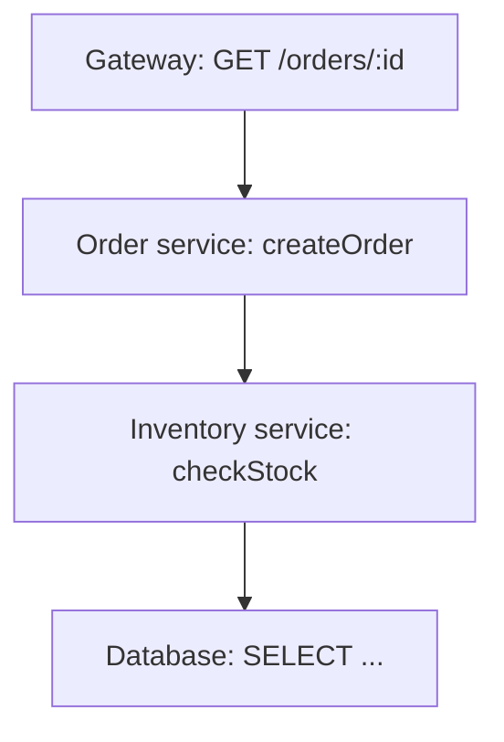

## One Main Line Shared by All Three Signals

OpenTelemetry's traces, metrics, and logs are not three independent systems; they are three views over one data model. They share the same identifier system: traceId, spanId, and the headers that carry context propagation. Any signal can carry these identifiers, so queries can jump between them: from a log to the trace it belongs to, from a trace to the metrics at a point in time, from a metric's exemplar back to a concrete request.

Context propagates across two boundaries. In-process: functions and async callbacks in the same process share the current span, and newly created spans inherit it automatically. Cross-process: when a service makes a call, it encodes the SpanContext into request headers; the downstream extracts it and keeps propagating. Both kinds are required: if in-process propagation breaks, spans inside one service cannot form a subtree; if cross-process propagation breaks, the whole trace splits in two at the service boundary.

The main line in one sentence: all data first belongs to a context, then describes a state. Traces describe the shape of context, metrics describe the aggregation of context, logs describe events within context. Each signal alone has blind spots; together they answer "what happened, why, and how big the impact was".

This design has a direct consequence: adopting OpenTelemetry, the three signals are not three separate projects. Initialize the SDK once, and traces, metrics, and logs share the same context, the same Resource, and the same export pipeline. That is why it ships as one SDK package rather than three separate libraries.

Correlation does not depend on clock alignment. Log timestamps come from each host, and clock skew can distort the ordering of events across services; trace data determines parent-child relationships from propagated context, using timestamps only to display duration. When investigating, trust structure first and time second — this order does not break because of clock issues.

## Trace: How a Trace Is Stitched Together

### Span: The Smallest Unit of a Trace

A trace is made of spans. A span represents the time slice of one operation: an HTTP request, a database query, a business function. Each span records a name, start and end time, status, attributes, events, and most importantly three fields: traceId, spanId, and parentSpanId.

- traceId: the globally unique identifier of the whole trace; all spans of one request share it.
- spanId: the unique identifier of the current span.
- parentSpanId: the identifier of the parent span, pinning each fragment into its position in the trace.

Spans also carry status (OK, Error, Unset) and events. Status marks success or failure; span events record key moments during the operation, such as a retry happening or a request being rate-limited; attributes provide query dimensions such as route, HTTP status code, and business IDs. When designing instrumentation, attributes determine which questions the data can answer; with too few attributes, traces can only reconstruct shape, not business detail.

Links solve two scenarios parent-child relationships cannot express: when an async task is picked up from a queue, the processing span links back to the enqueueing span instead of forming a parent-child relationship — parent-child implies containment by call, which async delivery does not satisfy; when an aggregation service merges requests from multiple sources, it uses links to keep entry points from all upstream traces, so you can trace back from any of them. There is only one parent span, but many links.

A span's full lifecycle: creation records the start time, attributes and events are appended during execution, and the end records status and end time. Manual instrumentation looks roughly like: create a span → set attributes → run business logic → end. Automatic instrumentation hands this flow to framework hooks, and business code does not write a single line of tracing code.

### Span Tree: The Full Path of One Request

When a request crosses multiple components, spans form a tree by call relationship. The root span is usually created by the entry component, and every downstream call creates a child span:



The tree records causality, not chronological order. B is A's child because A called B; even if B's logs land in storage first, structurally it still hangs under A. Parallel calls appear as multiple child spans under the same parent, and each child's duration can be analyzed independently.

The choice of root span shapes the semantics of the whole trace. The entry request handler is the natural root; a scheduled job uses its task function as the root; a message consumer uses the message-handling function. Pick the wrong root and the trace stays connected, but the tree's boundary drifts away from "one business operation", and statistics follow the error.

Sampling directly decides whether the tree is complete. If every span independently decides whether to record, only half the nodes in one trace may be saved, the tree becomes fragments, and duration analysis and error localization become impossible. Therefore the sampling decision must be made when the root span is created and propagated to all child spans via context.

### Context Propagation: How Spans Cross Process Boundaries

A span alone is meaningless; what makes a trace is stitching it across processes. What crosses processes is the SpanContext — the set of traceId, spanId, and sampling flags. When making an HTTP call, the SDK writes the context into request headers; the downstream extracts it and creates a child span.

The W3C Trace Context standard defines the header format; the most common one is traceparent:

`00-4bf92f3577b34da6a3ce929d0e0e4736-00f067aa0ba902b7-01`

The four fields are version, traceId, spanId, and flags. traceId is 32 hexadecimal characters, spanId is 16 hexadecimal characters, and the trailing 01 in flags means the trace is sampled. After reading traceparent, the downstream uses its spanId as the parentSpanId of its own span, and the trace continues.

traceparent only carries identity. For vendor-specific supplemental information, use the tracestate header: a comma-separated set of key-value pairs that different propagation implementations can write their own fields into. Ordinary applications do not need to read or write tracestate, but understanding it helps debug "why some backends can see extra context".

For supported standard libraries, the SDK does injection and extraction automatically; business code does nothing. Propagation requires every hop on the call chain to cooperate: upstream injects the header, downstream extracts it. If any hop is missing, the trace breaks there. The most common break points: middleware or proxies stripping unknown headers, async tasks losing the context object, message queue consumers not passing headers into handler logic. The SDK only automates frameworks it knows; everything else needs manual propagation.

### Baggage: Passing Business Context Across Services

SpanContext only carries trace identity, not business data. If you want business fields (user ID, tenant, experiment group) to follow the request to every downstream, use Baggage. It travels via the baggage header and can be attached to downstream spans and log attributes.

Baggage needs restraint: it is copied with every request, and the more fields, the higher the network overhead and privacy risk. Personally identifiable information and tokens must not go into Baggage; by default, only high-value, low-cardinality, low-sensitivity identifier fields belong there. One heuristic: if a field is only useful to one service, do not put it in Baggage; only context that every downstream might use is worth propagating.

### Sampling: The Cost Control for Traces

Trace volume is far larger than metrics, full collection is not viable in production, and sampling is a must. Sampling happens in two places:

- Head sampling: the SDK decides by probability when the request starts. The outcome is unknown at decision time, so it cannot select on "did it fail", but it is simple and cheap.
- Tail sampling: the Collector decides after receiving the complete trace, and can keep valuable traces based on errors, latency, or specific attributes — at the cost of buffering whole traces.

The sampling flag propagates with context. Head sampling decides when the root span is created, the flag goes into traceparent, downstream SDKs read the unsampled flag and only record structure without exporting, keeping the decision consistent across the tree. Probability consistency is another detail: if multiple entry points each independently roll 10%, the same business operation entering from different doors gets different sample rates, and cross-entry statistics distort; consistent sampling hashes the traceId to decide, guaranteeing the same trace gets the same verdict at every entry.

Tail sampling suits "errors first" scenarios: traces are staged at the Collector, and after completion, keep-or-drop is decided by status code, latency, or attributes. Error traces are usually a small fraction of volume; keeping them all does not raise cost significantly, yet every failure has evidence. Budgets should come from measuring real data volume and retention, not guesswork.

## Metrics: How Metrics Are Computed

### Instrument: The Entry Point of Metrics

Metrics are produced by instrumentation code calling instruments. OpenTelemetry splits instruments into synchronous and asynchronous: synchronous ones are called directly on the code path; asynchronous ones are sampled by the SDK on a schedule.

There are three synchronous kinds:

- Counter: monotonically increasing, for request counts and error counts.
- UpDownCounter: can go up and down, for queue length and online users.
- Histogram: records the distribution of a set of observations, for latency and payload size.

There are three asynchronous kinds: ObservableCounter and ObservableUpDownCounter correspond to increasing and up/down semantics, for values read from external systems; ObservableGauge represents a state value at a moment, such as memory usage or connection count. They are not triggered by the request path; the SDK calls back on the collection interval.

Instrumentation code only needs to choose a kind and call it:

```ts
counter.add(1, { 'http.request.method': 'GET', route: '/orders' })
```

Another important property of an instrument is its unit: request count, milliseconds, bytes. Data with inconsistent units cannot be compared directly, and semantic conventions specify units for common metrics. After the instrumentation code picks the instrument kind, aggregation and export are left to the SDK; business code only calls at the right time.

Metric names follow semantic conventions too: the standard name for HTTP server request duration is http.server.request.duration, unit seconds, instrument kind Histogram. When name, unit, and kind agree, metrics can aggregate across teams and languages; giving the same meaning two names creates two datasets that can never merge.

### Temporality: Two Views of Time

Metric points carry time semantics, or temporality: delta means "increment since the last export", cumulative means "accumulated value since process start". Prometheus style is cumulative; OTLP supports both, negotiated between SDK and backend.

Take request count: in the delta view, 120 new requests in an export cycle gives the value 120; in the cumulative view, the exported value is the total since process start, say 48321. Alert rules are sensitive to increments, so delta is more intuitive; long-term trends and capacity analysis rely on cumulative values.

The choice affects query semantics. Cumulative data suits "from start until now" curves, but resets to zero on restart and requires backends to handle resets across exports; delta data suits increment calculation but needs a stable export interval. Many "metrics look wrong" phenomena come from temporality mismatch: curves jump after a service restart, or numbers differ after migrating across backends.

In practice, temporality pitfalls usually appear in migration: moving from Prometheus to an OTLP-capable backend, if the backend's default differs, the same instrumentation data draws different curve shapes and alert thresholds need recalibration. The data is not wrong; the view of time changed.

### Aggregation: How Values Are Compressed in the SDK

The SDK does not export every observation as-is; it aggregates first: Counters default to sum, Gauges take the last value, Histograms fall into buckets (explicit or exponential).

A histogram's buckets decide query precision. Explicit buckets are configured boundaries, e.g., 5ms, 10ms, 25ms, 50ms, 100ms, 250ms; exponential buckets distribute boundaries by exponential growth, covering a wider range with fewer boundaries. Finer buckets make percentiles like P99 more accurate but cost more storage; too few buckets pack multiple latency magnitudes into one bucket and distort percentiles.

Whether aggregation happens in-process or in the Collector changes semantics. SDK-side pre-aggregation reduces network and storage volume but loses individual information before aggregation; Collector-side aggregation can merge data from many instances, suiting the global view of gateway mode. Downsampling is another layer of compression: re-aggregating raw series at coarser windows keeps long-term trends at the cost of short-term precision.

### Cardinality: The Blowup Problem of Metric Series

Attribute combinations determine the number of metric series. One metric with ten attributes, each with dozens of values, quickly explodes the series count — the cardinality problem. Runaway cardinality degrades storage and queries at the same time and is a core production governance issue.

A real runaway example: a request latency metric with route, status, region, and user_id attributes; route has 20 values, status 5, region 10, user_id hundreds of thousands. The first three combine into 1,000 series; adding user_id explodes the count. user_id is a typical high-cardinality attribute and belongs in logs or traces, not metrics.

Metric attribute design principles: keep only finite-enumeration dimensions such as route, status code, instance, and region; do not include near-infinite identifiers like user IDs, order IDs, or session IDs; when analysis by identifier is truly needed, use traces or logs. The cardinality problem is decided at instrumentation time; later governance can only stop the bleeding, not recover what was lost.

### Exemplar: Sewing Metrics and Traces Together

Aggregation discards individuals; the Exemplar returns one sample: during aggregation, a data point carries the traceId and spanId of one concrete observation. When querying a metric, you can follow the exemplar into a real trace and see what actually happened behind that data point.

Exemplars are not attached to every point; they are picked by rules, e.g., keeping the most recent observation per bucket. They add little storage but provide the jump from aggregate to individual when needed. This is the cleverest link between the three signals: metrics give the big picture, traces give detail, and exemplars give the doorway from the big picture into detail.

## Logs: How Logs Stop Being Islands

### LogRecord: Events with Identity

Logs are the signal with the widest adoption surface and the heaviest legacy. OpenTelemetry's goal is not to make every application abandon its logging framework, but to define a unified log model and pipeline: logs are still produced by familiar frameworks, and the SDK adds context, unifies format, and ships them to the Collector. This preserves the ecosystem while keeping logs from being a pile of islands.

OpenTelemetry's log model is a structured event called a LogRecord. Core fields include: timestamp, observed timestamp (when the SDK saw the log), severityText and severityNumber (level), body, a set of attributes, and optional traceId and spanId:

```json
{
  "timestamp": "2026-08-09T10:00:00.123Z",
  "severityText": "ERROR",
  "severityNumber": 17,
  "body": "inventory service timeout",
  "attributes": {
    "service.name": "order-service",
    "http.response.status_code": 500
  },
  "traceId": "4bf92f3577b34da6a3ce929d0e0e4736",
  "spanId": "00f067aa0ba902b7"
}
```

severityNumber uses a numeric scale of 1–24, with fixed ranges for TRACE, DEBUG, INFO, WARN, ERROR, and FATAL, enabling consistent filtering across frameworks. Framework levels map to OTel levels through a bridge layer; application code does not change.

Adoption is by bridging, not replacing: mainstream logging frameworks provide an OTel appender or handler that forwards log events to the OTel SDK; for frameworks without a bridge, you can create LogRecords manually through the API. The bridge also does one more thing — writing the current trace's traceId and spanId into logs, usually automatically.

### LogRecord vs. Span Event

Spans can carry events too: a retry, a key branch. The difference is ownership: a span event belongs to a span and is meaningless outside trace context; a LogRecord is an independent event that can exist detached from a trace or be linked back to one via traceId.

Retention policies also differ. Span events exist as long as the trace is sampled: if the trace is sampled, the events are saved; if the trace is dropped, they go with it. Whether logs are kept is decided by the log pipeline, independent of trace sampling. Mixing them makes data destinations unpredictable — write important diagnostic information as span events, lower the sampling rate, and that information quietly disappears.

In practice, divide by purpose: use span events for intermediate steps inside a trace, logs for diagnostic information independent of a request. For information that needs long-term audit or standalone search, default to logs.

### Correlation Mechanics

Correlation happens in the SDK layer. At initialization, the log SDK and trace SDK share the same context provider; when a logger writes, it automatically pulls the current spanId and traceId into the LogRecord. Once backends index by traceId, any log can jump to the full trace, and any trace can expand its logs.

The key word in this mechanism is "automatic". Developers do not hand-concatenate traceId into every log; context comes from the current execution environment. Manual concatenation is not only error-prone; it also picks up the wrong trace in async code: when a callback runs, the current context may no longer belong to the thread or coroutine that started the request.

## Resource and Semantic Conventions

### Resource: Metadata Attached to Every Signal

Resource describes where data comes from: service name, service version, namespace, deployment environment, host information. It is process-level metadata; all signals from one process share the same Resource, unlike request attributes.

Common fields include service.name, service.namespace, service.version, service.instance.id, deployment.environment, plus runtime environment info such as host.name and os.type. Most fields are filled automatically by resource detectors: reading environment variables, cloud platform metadata, and container information, merged into one Resource at startup without handwriting.

Resource merging follows deterministic ordering rules: when fields from multiple sources conflict, merge order decides the final value, and explicit configuration usually overrides auto-detection. Understanding this rule explains why service.name occasionally gets overridden in container environments — usually explicit config and detection coexist.

A common mistake is writing service.name as a request attribute. Resource is used for routing, filtering, and billing at the export side; request attributes vary with every record. Put them in the wrong places and queries distort immediately: filtering by service finds nothing, while request-dimension aggregation mixes in process-level information.

### Semantic Conventions: Why Attribute Names Must Be Unified

Attribute names are defined by semantic conventions: the HTTP method is http.request.method, the database system is db.system, the model provider is gen_ai.provider.name. The value of conventions is interoperability: when data from different teams, languages, and vendors lands in the same backend, consistent names make dashboards, alerts, and queries reusable.

Conventions are graded by stability: stable promises not to change long-term, experimental may change. Conventions evolve, so they carry versions: data includes a schema URL identifying which convention version produced it; when an attribute is renamed, tools can convert or warn by version rather than treating it as two unknown fields.

For developers, checking conventions before instrumenting matters more than naming by habit. Conventions already cover HTTP, databases, messaging, browsers, cloud resources, and GenAI; most common scenarios need no custom attribute names.

## Inside the SDK: From Instrumentation to Export

### API and SDK Separation

OpenTelemetry splits "how to instrument" from "how to implement". Business code only depends on the API: create tracers, meters, and loggers, call spans and instruments. The SDK that does the actual work is injected at startup: it provides Providers, Processors, and Exporters, deciding how data is aggregated, buffered, and exported.

The first payoff of separation is replaceability: the SDK implementation can be upgraded, swapped for another vendor, or reconfigured without changing business code. The second is testability: inject an in-memory SDK in tests and assert that data was recorded correctly, with no real network. Without this boundary, instrumentation couples to a concrete implementation and vendor neutrality is impossible.

Multiple SDK instances can coexist in one process: during migration, the old and new implementations run side by side, or different teams use different configurations. The global Provider handles the default path; named Providers serve specific modules. Multiple instances are the foundation of smooth migration, at the cost of duplicated exports, which a migration plan must handle.

### Providers, Processors, Exporters

Each signal has its own Provider (TracerProvider, MeterProvider, LoggerProvider), responsible for component lifecycle. Produced data enters a Processor and then goes to an Exporter.

The most common Processor implementation is batching: group many records into one batch and send on a fixed interval or size cap, cutting network requests dramatically. Batch processors also have queues and timeouts: when the queue is full, new data is dropped or the call blocks, depending on config; data not sent before a timeout is retried. Understanding these parameters explains two production phenomena: occasional data loss under high load (queue full) and retry storms during backend flapping.

Exporters encode data as OTLP and send it. If the network between SDK and Collector breaks, data waits in the in-memory queue; on process exit, unexported data is lost unless flush is explicitly triggered. Calling flush during graceful shutdown is an easy-to-miss item on the adoption checklist.

### Automatic Instrumentation

Automatic instrumentation is the key to low adoption cost. For mainstream web frameworks, HTTP clients, and database drivers, the SDK uses hooks to create spans, inject context, and capture standard attributes without changing business code. Manual instrumentation is reserved for business semantics: order IDs, user IDs, key branches.

Implementation varies by language: Java uses bytecode injection, rewriting classes at startup through an agent; Node.js and Python wrap runtime modules, intercepting HTTP clients and frameworks; Go has no general runtime hooks, so automatic coverage is limited and relies more on manual instrumentation or eBPF. When choosing a language, automatic instrumentation maturity is a major variable in adoption cost.

Zero-code approaches automate initialization too, injecting the SDK via environment variables and startup flags. Automatic coverage determines a language ecosystem's adoption cost: official and community instrumentation libraries cover mainstream HTTP frameworks, database clients, message clients, and cloud SDKs; components outside the list need manual instrumentation.

### In-Process Context Propagation

In-process propagation relies on runtime context mechanisms: Node.js AsyncLocalStorage, Python contextvars, Java thread-locals. The SDK stores the current span in context, and creating spans, writing logs, and recording metrics all read from it.

Async code is where in-process propagation most often breaks: callbacks, timers, and message handlers may run in another execution environment, and context does not follow automatically. The SDK propagates context when wrapping async APIs, but bare callbacks that bypass the SDK cannot get the current span. When debugging "spans break inside a service", check whether async boundaries are handled by the framework first.

## Collector: The Data Relay

The Collector is a standalone process that receives data from SDKs or other sources, runs it through a pipeline, and exports to backends. The pipeline has three parts:

- Receiver: receives data. OTLP is the primary entry, with Prometheus, Jaeger, Zipkin, and other formats also supported.
- Processor: processes data. Common uses include sampling, filtering, attribute enrichment, redaction, and routing.
- Exporter: sends processed data to one or more backends.

A typical Processor use case is attribute enrichment: read information from Resource or external sources and attach it uniformly to every record, such as cluster name, environment, and team ownership. Such rules live in one place and the application side stays unaware.

The core problem the Collector solves: SDKs do not need to know the backend, and governance logic does not need to be written into every application. Instrumentation decisions (sampling rules, redaction fields, export targets) concentrate in one Collector config, and changing them does not touch application code. Pipelines can process serially, or branch the same data to multiple backends: one copy to the metrics system, one to the log platform, one for audit.

The Collector also handles buffering, retry, and backpressure. When the SDK loses network or the backend flaps, data waits in the Collector queue; when the queue is full, the Collector can reject new data so the SDK feels the pressure instead of piling up indefinitely. Every hop from production to storage can lose data; retention of important data depends on queue configuration, retry limits, and idempotent backend writes, not on assuming the pipeline is reliable.

Its two deployment modes — an Agent co-located with applications, and an independent Gateway cluster — suit different scales and governance needs.

## How the Three Signals Work Together

Stitch the whole mechanism into one investigation: a user reports an operation failing; search the log platform by time and find an ERROR log carrying a traceId; follow the traceId into the trace and see the root span is the gateway's POST request, and among the child spans the order service timed out calling inventory, with the root cause pointing at a database query; return to metrics, look at the same database instance's latency curve for the period, and jump from a Histogram's exemplar into a real trace to confirm the slow query's request characteristics; finally, use Resource and attributes to confirm the affected version, instance, and user scope.

Logs give detail, metrics give the big picture, traces give causality, and exemplars are the springboard between them. Looking at any one signal alone, this investigation stops halfway; the three signals locate each other through one shared context — that is the final purpose of OpenTelemetry's data model design.

## What's in This Series

- Part 1 covers the concept of observability, the history, and OpenTelemetry's position.
- Part 3, "The Ecosystem, Selection, and Rollout", covers what happens after data leaves the application: Collector deployment shapes, backend selection, browser observability, eBPF zero-instrumentation, profiling, GenAI observability, and a team rollout roadmap.

Previous: [OpenTelemetry Part 1: Why Observability Matters](/posts/opentelemetry-guide-part-1)

Next: [OpenTelemetry Part 3: The Ecosystem, Selection, and Rollout](/posts/opentelemetry-guide-part-3)
