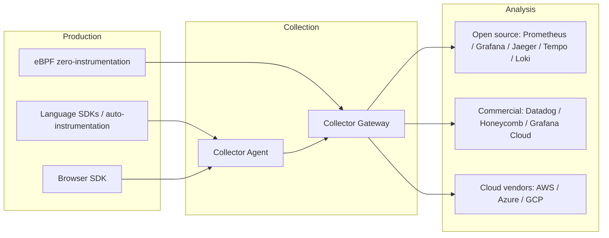

## The Ecosystem at a Glance: Every Hop from Production to Analysis

A complete observability solution has three layers: the production layer generates data inside and outside applications, the collection layer receives, processes, and forwards it, and the analysis layer stores, queries, and visualizes it. OpenTelemetry covers the first two layers; concrete backends handle the analysis layer.



The layers are decoupled by OTLP. The production layer does not know which backend it will eventually reach; the analysis layer does not care how data was produced; the collection layer is the governance point in between. The direct payoff: switching backends does not require rewriting instrumentation, and adding new data sources does not require changing the analysis platform.

There are more production sources than you might think. SDKs and auto-instrumentation in application code are the mainstay, but the list also includes: browser SDKs for the frontend, runtime infrastructure (node metrics, network traffic, service mesh proxy access logs), third-party components that cannot run an SDK (covered by zero-instrumentation approaches like eBPF), and existing systems brought in through protocol conversion (Prometheus endpoints, Jaeger formats, cloud vendor logs). The more diverse the sources, the more valuable a unified standard becomes — all sources share the same protocol and processing pipeline, so analysis can correlate across layers.

Each layer has its own selection logic. The production layer chooses SDKs and instrumentation approaches, looking at language coverage and auto-instrumentation capability; the collection layer chooses Collector deployment shapes, looking at scale, data volume, and governance needs; the analysis layer chooses a backend, looking at budget, operations capability, and compliance constraints. The rest of this post follows that order.

Layer decoupling has another payoff that is easy to underestimate: independent evolution. The production layer can go in first, the collection layer can be added later, and the analysis layer can change at any time. Adoption does not have to happen all at once; you can proceed as "data first, governance second, selection third", and no layer's change drags the others along.

Ecosystem adapters widen the adoption surface. The Collector can receive Prometheus text format, Jaeger and Zipkin traces, and cloud vendor log formats, and it can also convert OTLP into whatever a backend needs. Existing systems do not need a one-time migration; adapters can funnel them into the unified pipeline first, then replace them with native ingestion gradually.

When you meet any observability tool, ask where it sits in the three layers and what its relationship to OTLP is — that is more effective than memorizing feature lists. The same framework applies to evaluating new collection approaches, backend products, and AI observability platforms: position determines responsibility, protocol determines compatibility.

## Collector: Agent or Gateway

The Collector has two deployment shapes that solve different problems.

An Agent runs alongside applications: a sidecar or DaemonSet in container environments, one process per machine in VM environments. Its strength is nearby collection: data does not leave the node, latency is low, and local filtering and redaction can happen before forwarding; its weakness is that every machine needs deployment and updates, configuration is distributed, and per-instance processing capacity is limited.

Agents have two shapes in container environments. A sidecar runs one per Pod with the same lifecycle, suiting scenarios that need isolation and independent configuration, but resource overhead grows linearly with Pod count; a DaemonSet runs one per node shared by many Pods, with better resource utilization, but all applications share the same processing resources and need more careful quota configuration.

A Gateway is an independent cluster: all data flows into one center for global processing. It suits governance that needs global visibility: tail sampling needs complete traces, cardinality control needs all metric series, and routing and redaction can be managed centrally. Gateways also buffer, so data is not lost immediately when backends flap; the cost is an extra component set to operate and a new network dependency.

Compare the two shapes along five dimensions:

| Dimension       | Agent                                       | Gateway                                             |
| --------------- | ------------------------------------------- | --------------------------------------------------- |
| Deployment      | Co-located with applications                | Independent cluster                                 |
| Data locality   | Data stays on the node                      | Data is centralized                                 |
| Governance      | Local: filtering, redaction, basic sampling | Global: tail sampling, cardinality control, routing |
| Operations cost | One set per machine, grows with nodes       | One cluster, needs high-availability planning       |
| Failure impact  | Affects only its node                       | Affects all data sources                            |

Production commonly combines both: Agents do nearby collection and basic processing, and a Gateway does global governance and provides a unified egress. The usual data flow is SDK → Agent → Gateway → backend. Very small projects can skip Agents and let SDKs talk directly to the Gateway; but gateway high availability and capacity still need planning.

Both shapes introduce the same problem: the intermediate node itself can become a failure point or bottleneck. An Agent shares the application's lifecycle — when the app dies, the Agent captures nothing; if a Gateway overloads, every source is affected. Planning needs buffer and horizontal scaling for the Gateway, plus acceptance of reality — the collection path is not free, any hop can lose data, and retaining important data depends on queue configuration, retry mechanisms, and backend writes together.

There is no fixed answer; the decision follows data volume and governance complexity. Small data volume and no extra operations staff: one Gateway may be enough. Many nodes, or a need for local redaction or edge filtering: Agents earn their keep. Either way, the Collector's meaning is the same: move governance logic out of application code and onto the data path.

The order of pipeline processors affects results: sampling before or after batching and rate limiting changes the cost/loss tradeoff; redaction before sampling guarantees the kept data is already cleaned. Think through each Processor's purpose before deciding its position in the pipeline.

Configuration management is a hidden cost of Agent shapes: the more nodes, the easier configs drift. Common practice is template-generated config or distribution from a unified source, with Gateway and Agents sharing one versioned configuration and changes going through review instead of hand-editing machine by machine.

## Backend Selection: Three Routes

### Self-Hosted Open Source

The self-hosted route assembles a full stack from Prometheus, Grafana, Jaeger, Tempo, Loki, Mimir, and friends. Metrics use Prometheus or Mimir, logs use Loki, traces use Jaeger or Tempo; Grafana unifies the query interface, and alerts, dashboards, and cross-signal correlation all live in one surface.

The full stack's division of labor: Prometheus or Mimir for metrics, Loki for logs, Jaeger or Tempo for traces, Grafana for unified query and alerting. Each store has its own query language (PromQL, LogQL, TraceQL), and cross-signal correlation relies on a shared time range and traceId.

The strength is that data stays entirely in your hands, the cost is mainly hardware and operations labor, and there is no per-volume pricing pressure; functionally, the open-source ecosystem is mature enough that metrics, logs, and traces all have solid storage and query solutions. The price is operational complexity: each store has its own scaling, backup, and upgrade cadence, and capacity planning needs experience; for one person or a small team, this route's labor cost is often underestimated. It suits teams with infrastructure capability, stable data volume, and a hard requirement that data stay local.

### Commercial SaaS

Commercial products (Datadog, Honeycomb, Grafana Cloud, New Relic, and others) turn storage, query, alerting, and governance into a managed service. The strength is speed and completeness: cardinality governance, anomaly detection, SLOs, and cross-signal correlation are out of the box; the team does not maintain backends, and per-volume pricing keeps cost linear with scale.

Commercial billing is usually volume-based: metrics by series count, logs by GB, traces by span count. The three billing dimensions map to the three data types, and each has its own optimization direction: compress metric cardinality, control log sampling, and control trace sample rates and retention.

The costs are data leaving your domain and billing uncertainty. Telemetry must go to the vendor's cloud, which needs compliance review; cost grows with data volume, sampling budgets directly determine the bill, and the bill in turn drives sampling governance. For fast-moving, small teams, commercial products are usually the balance point of cost and efficiency; for data-sensitive or very large companies, cost becomes a constraint that cannot be ignored.

### Cloud Vendors

Cloud observability products (AWS, Azure, and GCP monitoring and tracing services) integrate best with cloud resources: instance, network, and service mesh metadata correlate automatically, billing is consolidated, data stays inside the cloud environment, and the compliance path is clear. In container and serverless environments, cloud probes can also cover some scenarios without SDKs.

The cost is ecosystem lock-in: when moving across clouds or back to self-hosted, data formats and query languages do not transfer; cloud support for OTLP varies in depth, with some receiving it natively and others needing an extra exporter or proxy. Choosing the cloud route presupposes accepting that cloud as the long-term runtime environment; when migrating to a cloud vendor, get the OTLP path working before migrating historical data, to avoid format chaos during the dual-run period.

The three routes are not mutually exclusive. Hybrid deployments are common: core business data stays self-hosted, externally facing or fast-changing business uses commercial products, and cloud vendor products carry cloud-resource-related data. The premise of hybrid is still a unified standard; otherwise each backend gets its own instrumentation, which is a regression to the binding era.

### A Selection Framework

Backend selection needs four questions answered:

1. Data volume and budget: how much raw data is there, and can per-volume pricing be sustained.
2. Operations capability: can the team maintain multiple stores long-term.
3. Compliance constraints: can data leave the domain, and how long must it be retained.
4. Lock-in tolerance: accept commercial or cloud vendor binding, or require the ability to migrate at any time.

Estimate data volume before deciding. A trace averages 50 spans at roughly 1KB each; 100 requests per second produces about 5MB/s of raw trace data; at 10% sampling that is 0.5MB/s, about 40GB of storage per day, multiplied further by indexing and replicas. Metrics and logs have similar magnitudes, just different structures. Write down the estimates for all three data types, multiply by retention, and the budget framework appears.

The four questions interact: data volume determines budget, budget influences the self-hosted vs. SaaS choice; compliance constraints may rule out commercial products outright; lock-in tolerance decides whether the cloud route is acceptable. Writing them into a one-page decision record beats comparing feature lists on the spot.

Two hypothetical cases illustrate the logic. Case one: a three-person team, 100K DAU, no dedicated operations — choose commercial SaaS, start with 10% sampling, and prioritize keeping all error traces. Case two: a financial company, data cannot leave the domain, infrastructure team exists — choose a self-hosted full stack and review capacity and sampling budgets quarterly. Both use OpenTelemetry for instrumentation; the only difference is export configuration.

Retention is an easily underestimated variable. Keeping traces 7 days vs. 30 days multiplies storage cost more than fourfold; audit requirements may force a year of logs. Put each signal's retention into the budget during selection instead of estimating by default values.

Alerting and SLOs do not depend on the concrete backend: whatever route you pick, define a few SLOs from error rate and latency first, then decide alert thresholds. Backend query languages may differ; SLO semantics should be consistent, so business metrics do not change when you switch backends.

There is only one hard requirement: the backend must support OTLP or have an official adapter. Whatever else a product offers, without this it rebinds instrumentation to a private format.

Another question often missed is whether all three signals must go to the same backend. A unified backend (like the Grafana stack) makes cross-signal queries simple — one trace can jump straight to same-period metrics; separate selection (Jaeger for traces, Prometheus for metrics, Elasticsearch for logs) lets each store do what it does best, but correlation queries hop between systems by traceId. Both are viable; the decision depends on how much the team relies on cross-signal correlation.

## Browser Observability

The browser is an easily overlooked part of the production layer. A frontend SDK can capture page load performance, resource loading, script errors, user interactions, and request information. These answer "what does the user actually experience", complementing backend data.

Frontend observation has two approaches. RUM (Real User Monitoring) captures real sessions from real users across all devices and networks, reflecting actual experience but with noisy data; synthetic monitoring visits pages on a schedule with scripts, producing clean, reproducible data that only represents the test environment. They complement each other: RUM answers "how is it right now", synthetic monitoring answers "did it regress".

Core Web Vitals are a common RUM dimension: LCP measures loading experience, INP measures interaction responsiveness, CLS measures visual stability. They are defined by browser standards, comparable across pages and versions, and are the basis for turning frontend experience from subjective feeling into quantifiable data.

Frontend and backend data connect through the same traceparent: the frontend injects trace context when it fires a request, the backend SDK extracts it and creates a child span, and the trace extends from the frontend page into backend services. In practice, cross-origin requests, CORS configuration, and privacy constraints can limit context propagation, and browser SDK compatibility with server frameworks needs verification.

Typical frontend dimensions include: page lifecycle and Core Web Vitals, resource load times, uncaught exceptions, network request success rates and latency, and session continuity. The session concept is frontend-specific — multiple requests from the same user are tied by a session identifier to reconstruct the complete experience of one use. Session data retention and anonymization need their own design; backend trace sampling strategies do not apply directly.

Frontend-backend stitching has a timing problem: page load happens before the request is fired, so navigation performance data (LCP, CLS) has no corresponding backend span; only after the request is sent does traceparent connect the two ends. The RUM page lifecycle and the backend trace are two segments of data; analysis must align them by session or time window, and you should not expect one trace to cover from click to render.

Frontend telemetry has stricter privacy boundaries than server-side: it involves user devices, behavior, and location, and needs a consent mechanism; collected content is anonymized by default, session IDs are separated from user IDs; traceparent in cross-origin headers must not carry sensitive business fields.

Frontend error localization depends on sourcemaps: production code is minified, stacks only carry line and column numbers, and sourcemaps restore source positions. Sourcemaps are sensitive assets; control access when hosting them and keep them internal-only.

The browser is usually not the first step in adoption. Server-side data covers the core path; frontend data solves experience-class problems; priority depends on the product shape. Frontend-heavy applications with complex interactions get more value from RUM; for API-centric products, complete the backend first and consider the frontend later. Also, frontend telemetry involves user device and behavior data; collection scope must comply with privacy policy instead of defaulting to full collection.

## eBPF Zero-Instrumentation

eBPF attaches hooks inside the Linux kernel, capturing behavior at system calls, network stacks, and user-space function boundaries, without modifying application code and without an SDK. For components whose code cannot be changed — third-party services, legacy systems, languages without official SDKs — it is the only realistic way in.

eBPF's capability boundary is just as clear. It sees system-level semantics: connections, syscalls, function execution; it cannot get business context: order IDs, user IDs, business branches. TLS traffic is invisible by default, and some capabilities depend on kernel versions. So eBPF and SDKs are not replacements; they complement each other: SDKs provide business depth, eBPF provides coverage breadth. In practice, eBPF auto-instrumentation tools (like Grafana Beyla) can generate OTLP-compliant trace data for the Collector and existing pipelines to process together.

eBPF creates spans with approximate semantics: uprobes hook function entry and exit and map one call to one span, with the function name as the span name. It reconstructs call structure and duration but cannot get application-level status codes, business attributes, or error reasons. When debugging, remember that an eBPF trace's "error" may just be a non-zero function return, not a business failure.

Adopting eBPF also requires checking the runtime environment: kernel support and privileges are needed, and permission models, security policies, and kernel versions in container and Kubernetes environments directly affect feasibility. eBPF data volume can be large, especially for high-frequency syscalls; start with sampling to control cost, then open up gradually.

eBPF programs run in kernel context, with stricter privilege and security boundaries than ordinary proxies: loading needs high privileges, and the programs themselves need validation and audit. In shared or tenant-isolated environments, do a security assessment before enabling it, so observability does not introduce a new attack surface.

When selecting, prioritize by need: use SDKs where business semantics matter; use eBPF where connection-level visibility is enough; for components where neither works, cover them with logs and metrics to a limited degree. eBPF is best as a "last mile" coverage tool, not the default way in.

## Profiling: The Fourth Signal Taking Shape

Continuous profiling samples process call stacks at a fixed frequency, answering "where does CPU and memory go". Data displays as flame graphs: the horizontal axis is time or sample share, the vertical axis is the call stack, and wide blocks are hotspots. A flame graph points at hotspot functions directly, without guessing first and verifying later.

It complements traces: traces describe which services a request crossed; profiling describes where resource consumption concentrates inside those services. A trace shows a span with abnormal duration, but server logs and metrics look normal — profiling data can then show which function the time concentrates in, and whether it is CPU-bound or lock-waiting. If performance conclusions rely only on traces, they tend to stop at "which service is slow"; profiling adds "why".

The profiling signal is still evolving in OpenTelemetry: the specification has not reached the stability of traces, metrics, or logs, but the direction is clear — profiling data also carries process context, can correlate with traces and metrics, and the protocol is converging into the OTLP ecosystem. Adoption cost is low, storage cost is high, and it suits targeted use when performance and capacity problems appear rather than full enablement from day one. Typical triggers: CPU spikes after a release, continuously growing memory, an endpoint with abnormal latency but no log errors.

Profiling also has types: CPU profiling answers "where does time go", memory profiling answers "where do allocations go", lock profiling answers "where does waiting happen". The type is determined by the sampling point; one process can collect several types at once, but overhead stacks. Higher sampling frequency means finer flame graphs and more extra CPU cost; production usually runs low-frequency continuous sampling and temporarily raises frequency for targeted debugging.

## GenAI Observability

### Questions Traditional Signals Cannot Answer

GenAI applications introduce three classes of problems traditional signals cannot cover: answer quality, call cost, and the decision chain.

Quality: hallucinations, poor retrieval recall, truncated context — surfacing as "answers that miss the question". These problems have no error codes, and the error rate may stay at zero the whole time. Cost: model selection, input/output token counts, failed retries — each directly maps to a bill line; the same feature with a different model or context length can differ in cost by an order of magnitude. Decision chain: why an Agent chose a tool or abandoned a branch — this determines whether behavior is explainable and reproducible.

A RAG Q&A involves at least retrieval, context assembly, model calls, and tool calls, and the final answer's quality depends on every stage; Agent scenarios additionally loop over tool calls and change plans from intermediate results. Traditional metrics only answer "did the call succeed and how long did it take", not these three questions. Answering them requires recording the full process of each inference as a trace.

### The gen_ai.\* Semantic Conventions

OpenTelemetry defines gen_ai.\* semantic conventions for AI calls, uniformly describing provider, model, request, and usage:

```text
gen_ai.provider.name: openai
gen_ai.request.model: gpt-4o
gen_ai.usage.input_tokens: 812
gen_ai.usage.output_tokens: 214
```

A typical AI trace includes an Agent orchestration span, retrieval spans, model call spans, and tool call spans. The model span records input/output summaries and token usage, retrieval spans record recall results, and tool spans record external calls. The trace shape is the same as an ordinary distributed trace; the difference is attributes carrying AI-specific business dimensions.

### Evaluation and Iteration

Trace data has an extra use in GenAI scenarios: as input to evaluation and iteration. When an answer is bad, follow the trace to see whether retrieval recall was reasonable, whether context was truncated, and whether model output was overridden by tool results. Put traces, evaluation scores, and prompt versions together, and quality problems turn from "mysticism" into reproducible, comparable data.

This is what distinguishes GenAI observability from traditional observability: the data is not only for debugging, but also for improving the product itself. Traditional traces get archived after an incident; AI traces become daily input to prompt engineering and model selection.

Writing evaluation scores into trace attributes is becoming common practice: eval results attach to the model span as span attributes (like eval.score), queries filter by score, and low-scoring samples jump straight into the trace for detail. The evaluation loop reads traces and writes back to traces, forming a closed loop.

### Ecosystem

A set of tools has formed around GenAI observability: OpenInference defines open conventions for machine learning and AI; platforms like Langfuse, OpenLLMetry, and LangSmith provide capabilities from tracing to evaluation. Most are built on OpenTelemetry or compatible with OTLP and can join a unified Collector pipeline.

Two points to watch in adoption: inputs and outputs may contain sensitive data and should be redacted or reduced to summaries by default; the accounting basis for token usage and cost must align with the billing side, or governance and invoices will disagree.

Cost governance unfolds along three dimensions: by feature, which scenarios consume most tokens; by model, whether to downgrade or switch; by day, whether fluctuations correlate with releases. All three depend on model and usage attributes in traces; without traces, cost analysis can only see the total bill.

## A Team Rollout Roadmap

From zero to production, the order of rollout matters more than the choice of tools.

Step one, pick a pilot: choose one backend service, one language, and one core request path; wire up the SDK and auto-instrumentation, export data to one backend, and verify trace completeness. The deliverable of the pilot is one complete trace from entry to database; the acceptance criterion is "any request can be followed end to end". The goal is not coverage; it is getting the path to work.

Step two, set the standard: decide service.name naming, Resource fields, sampling strategy, and attribute naming rules during the pilot. Standards come before scale; every later service follows the same conventions, avoiding each team inventing its own. Calibrate the sampling budget with real data at this step: run full collection for a week, look at volume and cost, then set the sample rate.

Step three, centralize governance: deploy the Collector and move sampling, redaction, and routing onto the data path. From then on, changing governance rules does not require changing applications. Acceptance criterion: change a sampling rule once and watch all services' trace data change in sync, with zero application-side changes.

Step four, expand: onboard by language and framework in batches, verifying trace completeness for each. eBPF covers components whose code cannot change, RUM follows product needs, and GenAI applications become their own projects by business priority. Every batch passes the same acceptance checklist: are traces complete, is Resource correct, is sampling in effect.

Step five, make the data used: observability's value is in use, not collection. Regularly review incidents with traces, and distill findings into alerts and dashboards; otherwise instrumentation just becomes a new cost line. The acceptance criterion is the team actually using trace data in real incidents instead of still guessing from logs.

Common failure modes have nothing to do with tools: collecting full traces with no budget constraint, letting data volume crush the backend within two weeks; rolling out before standards are set, ending up with thirty service.name values across thirty services; instrumenting but never using it, still guessing from logs during incidents. Avoiding these three covers most of the battle.

Rollout cadence needs governance mechanics to match: sampling budgets reviewed periodically, cardinality growth threshold alerts, attribute naming changes going through review. Observability data grows naturally with service count; without a governance cadence, early standards get washed away by the next wave of onboarding. Team documentation and example code matter too — new services should copy a standard config instead of reinventing one.

Rollout also needs organizational support: designate an observability owner for standards and governance; write "look at traces first" into the on-call flow as a fixed step; require every postmortem to attach trace screenshots and data evidence. Tools change capability; process decides whether capability gets used.

For deeper content, continue from the official docs: the specification and semantic conventions are the entry point for understanding design decisions, the Collector docs cover the data path in detail, and each language's SDK docs cover auto-instrumentation capabilities.

Previous: [OpenTelemetry Part 2: The Three Signals and Their Inner Workings](/posts/opentelemetry-guide-part-2)
