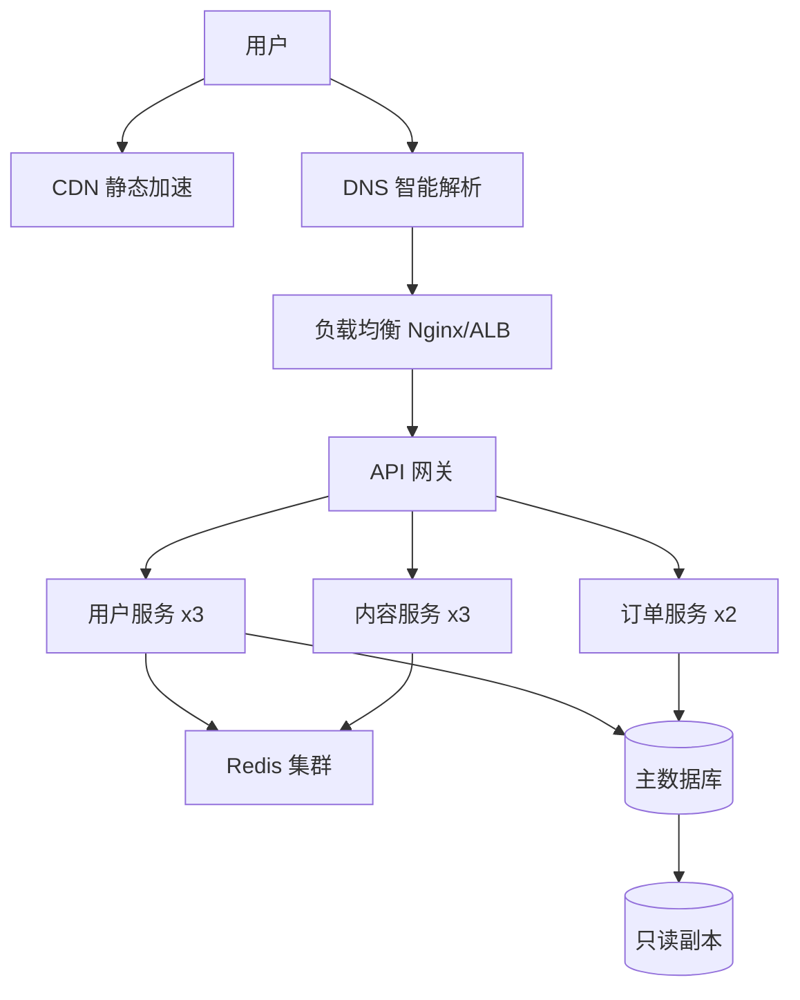
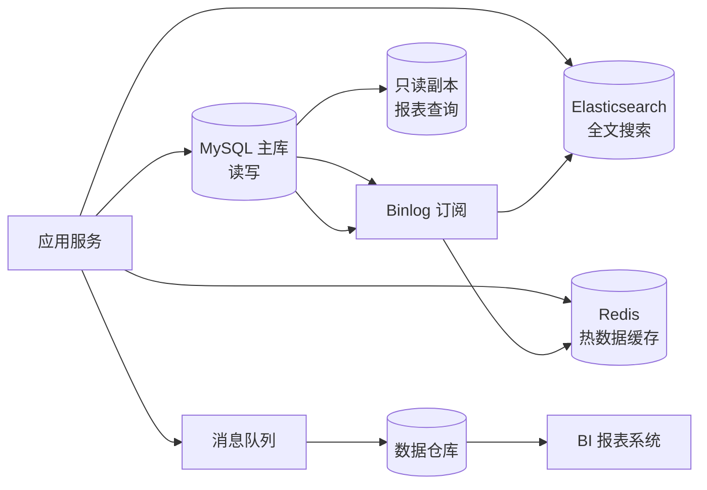
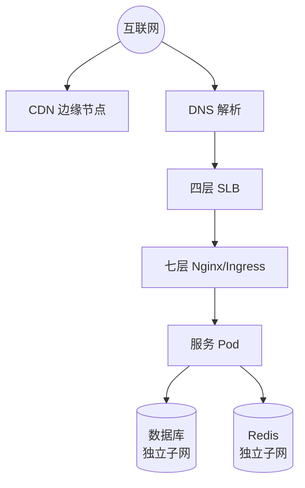
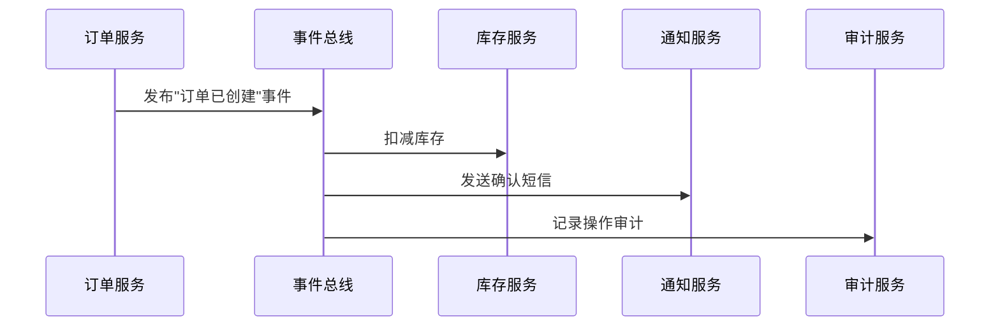
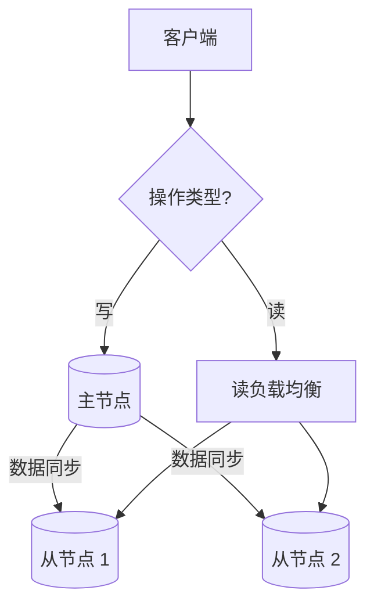

> 写这篇文章，是因为我见过太多人把一个"画框线图"的活儿当成了架构设计。画图谁不会？难的是画完之后你敢不敢拍板说：这玩意儿能扛住。

有一回，一个朋友把他新系统的架构图发给我看。图上画着"Gateway → 用户服务 → 订单服务 → 数据库"，三四个方框，几条箭头，干净利落。我说挺好的，那你给我讲讲——订单服务挂了，用户还能不能下单？他说，呃，应该不能吧。我又问，那如果用户服务只是慢，没挂，订单服务等它响应等了30秒——这30秒里新进来的请求会怎么样？他不说话了。

他不是画得不好。他是没想过。

这就是架构设计最让人心虚的地方：画图只是一瞬间的事，但画完之后你需要在脑子里把整个系统推演一千遍——推演各种故障模式、各种流量峰值、各种你三个月后才会意识到的愚蠢设计。推演得过来，这架构就稳了；推演不过来，上线那天就是噩梦的开始。

这篇文章不讲怎么画图。我们聊清楚三件事：架构设计到底在做什么、怎么判断一个方案是"还行"还是"要完"、以及带走的不是一堆 Checklist，而是一套你自己的判断框架。

---

## 一、架构设计不是"设计软件"

### 1.1 架构是一套决策，不是一张图

你新加入一个项目，Leader 说"你先看看我们的架构图"。你打开一看——哇，五十个微服务，满屏的箭头，中间还插着 Kafka、Redis、Elasticsearch。你觉得好厉害，好复杂。

但真正的问题是：**这张图上有五十个决策，你能从图上看出来几个？**

- 为什么订单服务和库存服务是分开的，而不是合在一起的？
- 为什么这里用 Kafka 而不是直接 HTTP 调用？
- Redis 在这里到底是缓存还是主存储？数据丢了会影响什么？

架构图只是这些决策的**投影**——就像一张城市地图能告诉你哪条路通哪儿，但看不出当初为什么要把地铁站修在这个路口而不是那个路口。地图有用，但它不包含设计者的思考过程。

Martin Fowler 说过一句话，我觉得不能再准了：**架构是那些一旦做错就很难改的东西。** 你选什么 ORM、用什么日志库——这些换了也就换了，疼两天。但你一旦定了"用户服务和订单服务分开部署，通过 Kafka 异步通信"——这个决策会渗透到你的数据库设计、你的监控体系、你的部署流水线、你团队的分工。改它，等于重做半个系统。

所以架构设计的本质不是"画出一套漂亮的图"。它的本质是：**在信息不完备的情况下，做出一系列相互咬合的技术决策，并且清楚地知道每个决策的代价。**

### 1.2 拆分 + 协作：架构设计的两个动作

所有的架构设计，拆到最底层，就两个动作：

1. **把这个系统切成哪些块**
2. **这些块之间怎么说话**

用厨房来类比。你开一家小餐馆，后厨两个人——一个切菜一个炒菜。你不需要搞什么"冷菜部""热菜部""面点部"三层组织架构，两个人站在一起吼一嗓子就对齐了。架构？不需要。沟通成本为零。

但你开一家大型连锁餐厅，500个座位，一天3000人。这时候不拆不行了——后厨分成凉菜间、热菜间、面点间、备料间；前厅分成迎宾、点单、传菜、收银四个组。拆完之后，你必须定义协作规则："点单组的单子一式两份，热菜间一份收银组一份""热菜间出菜后传菜组三分钟内上桌，超时罚款"。

你看，**拆分是手段，协作才是目的。** 拆得太粗——一个模块里塞了太多东西，改一行代码要测整个系统，没人敢动。拆得太细——模块之间的沟通成本超过了模块本身的收益，一个简单的需求要在四个服务里各改一点，联调调到你怀疑人生。

判断标准只有一个：**拆分之后，整个系统的复杂度是降低了还是增加了？** 如果拆完你发现自己要多写一倍的胶水代码、多配三套中间件、多维护一堆接口文档——那你不是在拆分，你是在给未来的自己埋雷。

这就引出了下一个问题：怎么避免埋雷？

---

## 二、五个"不"——在动工之前先想清楚

我见过的架构事故，没有一个是因为"技术不够好"导致的。全是——该停的时候没停，该怂的时候没怂。

### 2.1 不过度设计

这是我犯过最多的错。没有之一。

几年前我做过一个内部管理系统，日活不到200人。我当时想，万一以后量大了呢？于是搭了微服务、配了容器化、搞了 CI/CD 全链路，甚至上了分库分表中间件——你知道，就是那种你觉得"专业团队都这么搞"的东西。

结果呢？三个月后业务方向变了，整套东西全白搭。不是"浪费了一些时间"的问题——是那些多余的抽象层变成了后续迭代的**枷锁**。每个新需求都要绕过五层"为未来准备的"中间层，每一层都在问："这数据你是从哪来的？我为什么在这里？"

卧槽。那段时间我每天都在想：我到底是在做架构，还是在搭积木？

一个很实用的判断标准：**当前方案能不能撑到下一个业务里程碑？如果能，就别动。** 一个日活500的系统，MySQL 单表 + Redis 缓存撑到日活五万绰绰有余。半年的时间，够你把业务形态看清楚，再决定往哪个方向拆。

过度设计不是"多做了点工作"——是那些多余的东西会变成你迭代路上的绊脚石。你为"未来可能的扩展"加的层层抽象，到未来你会发现：业务方向变了，抽象的方向也错了。

**一个血淋淋的实战教训：** 有次我做一套 CMS 后台，产品说"未来可能有多语言需求"。好，我上了 i18n 框架，所有字段都设计成 `title: { zh: '', en: '' }` 结构。数据库表多了一层嵌套 JSON，前端表单加了一套切换逻辑——多出来的复杂度大概在 30% 左右。半年过去了，这个"多语言需求"从来没有被提上过日程。每次改一个字段定义，都要多处理那层嵌套结构。最后我花了一整天把这层抽象全部回滚——但数据库里已经存了几万条带着空语言字段的数据，清理起来又是一摊事。

还有个更经典的：**别为"这个需求迟早会来"做架构。** 产品经理说"我们下个季度可能会有报表功能"，你就搭了一套数据仓库。下个季度来了，报表需求变成了"做个简单的 Excel 导出就行"。你搭的 Hadoop 集群瞪着你的 CSV 文件，像一个大象瞪着地上的蚂蚁。

判断是否过度设计的一个好方法是**逆推法**：如果去掉这个抽象层，现有功能会不会受影响？如果不会——那你加它干嘛？等真正需要的时候再加，成本几乎一样。但提前加了的代价，是你每天都在为它买单。

**另一个实战技巧：先写五遍再抽象。** 同一段逻辑在三个不同地方被复制粘贴了？别急着抽象。等到第五个地方也需要它的时候，你才能看清这段逻辑的真正共性是什么。前三次你看到的"共性"大概率是巧合——抽象的时机比抽象本身更重要。

### 2.2 不无脑跟大厂

你看到的几乎所有"大厂架构实践"分享，都有一个你没注意到的隐含前提：**他们的流量是你的100倍以上，组织规模是你的50倍以上。**

大厂为什么要搞微服务？因为5000个工程师在一个代码库里干活，不拆就是天天 merge conflict。你有5000个工程师吗？你团队一共5个人，搞8个微服务——每人维护1.6个服务，你这不是在做架构，你是在他妈的自杀。

每一个微服务都需要独立的 CI/CD、独立的监控告警、独立的部署流程、独立的接口文档。8个微服务就是8套基础设施。你5个人。你觉得你能扛住吗？大厂的架构方案是为**他们的痛点**设计的。你的痛点——团队小、业务还在变、上线速度比架构优雅更重要——跟他们的完全不一样。

你该学的是他们**为什么**那样设计——他们面临什么约束，做了什么取舍。不是把他们的架构图原样搬到你的系统里。

一个简单的规则：**如果一样技术你说不清楚为什么需要它，就先别引入它。** 说不清楚"为什么是 Kafka 不是 Redis Pub/Sub"，那就先别用 Kafka。说不清楚"为什么拆成三个服务而不是两个"，那就先别拆。说不清楚的东西，八成是你不需要的。

**实战反例：** 我见过一个创业团队，CTO 以前在大厂干过，上来就搭了完整的微服务 + Kubernetes + Istio + 分布式链路追踪。团队 8 个人，3 个后端。结果呢？一个简单的注册登录功能，涉及 API 网关、用户服务、认证服务、通知服务四个服务。联调调了三周。三周啊，哥——一个单体 Spring Boot 一天半就能搞定的事。

不是大厂的技术不好，是**大厂的方案解决的是大厂的问题。** 大厂面临的是"5000 个工程师怎么并行工作"，你面临的是"8 个人怎么快速验证一个商业想法"。这两者的约束条件完全不同。你拿治大象的药去治一只猫，猫会被压死。

**还有一个被忽略的维度：组织架构。** Conway 定律说，系统设计会反映组织结构。大厂的微服务之所以长那样，是因为他们有 50 个独立的小团队。你有几个团队？如果只有一两个——你的系统就不该比你的团队更复杂。超出团队沟通带宽的架构拆分，产生的不是解耦，是混乱。

判断引不引入一项技术的标准就一条：**它能解决你现在正在疼的痛点吗？** 如果答案不是斩钉截铁的"是"，那它就不是你现在需要的。好东西多了去了——但不疼的地方别贴膏药。

### 2.3 不太旧，不太新

技术选型上有一个既尴尬又真实的困境：

用太新的东西——不稳定、生态差、招不到人、出了问题 Stack Overflow 上只有三个相关问题而且都没回答。用太旧的东西——招不到年轻人、社区萎缩、安全漏洞没人修、用着用着你发现自己是世界上最后一个还在维护这个技术的人。

我的策略很简单，就一张表：

| 类型           | 技术成熟度            | 举例                     |
| -------------- | --------------------- | ------------------------ |
| 核心业务链路   | 已被广泛验证 2 年以上 | PostgreSQL, Redis, Nginx |
| 非核心辅助工具 | 可以尝试较新          | 日志/监控/CI 工具        |
| 实验性功能     | 随便追                | 内部工具、技术预研       |

核心原则就一条：**别把新东西放在关键路径上。** 支付链路、用户认证、数据库——这些一旦出问题就是事故。用最稳的。你想尝鲜某个新出的消息队列？可以，放到测试环境跑，放到非核心的日志采集链路里试试水。别把它挂在"用户下单"这个路径上。你半夜两点被叫起来处理线上故障的时候，你会发现"尝鲜"这个词一点都不酷。

**实战例子：三年前的一个项目里，** 我们团队选了一个刚发布 3 个月的 Node.js ORM 框架，因为它的 API 设计确实漂亮——比 Sequelize 直观十倍。上线第一周就遇到一个古怪的 bug：事务回滚在某些并发场景下不生效。翻 GitHub Issues，发现有人三个月前提了相同的问题，没人回复。翻源码，那个模块的代码太年轻了，异常路径根本没覆盖全。最后我们花了两天写 workaround，然后在一个月内把整个 ORM 切回了 Sequelize——而这本来是一个可以避免的返工。

**另一个例子：** 有个团队用了最老牌的 Java EE 框架做新项目，结果招人成了大问题——现在会 Spring Boot 的满大街，会 J2EE 1.4 的你得去养老院找。同时社区也没人了，安全漏洞爆出来等了六个月才有补丁。六个月你的线上服务暴露在一个已知漏洞下——这不是技术债，是技术定时炸弹。

**"不太旧不太新"还有一个实用的量化标准：看 GitHub 的 issue 关闭率。** 如果过去三个月 issue 关闭率高于 80%，活跃 contributor 多于 20 个——这东西靠谱。如果 issue 区积压了 500 个还没分标签——说明维护者已经跑路了，你也别上了。

**核心策略可以总结成一个"双轨制"：**

- **主轨道（核心链路）：** 用被至少 1000 个生产项目验证过 2 年以上的技术。出了问题你能搜到解决方案，招人有人会。
- **实验轨道（非核心）：** 可以追新。内部工具、监控面板、日志分析——这些挂了不致命，试错成本低。而且在这些地方先试用新技术，积累经验后再考虑是否推上核心链路。

### 2.4 不脱离实践

架构设计不是闭门造车。一个方案好不好，要放到具体的**上下文**里才能判断。

我见过三种典型的脱离实践的死法：

**第一种：不考虑团队能力。** 你设计了一套 Event Sourcing + CQRS，完美的理论、优雅的设计。但团队里没人搞过事件溯源，连 Event Store 都没搭过。上线后，任何一个问题都只有你能排查——你成了整个系统的单点瓶颈。恭喜你，你给自己创造了一份不可替代的工作，也给公司创造了一个不可承担的风险。

**第二种：不考虑上下游。** 你的服务提供一套标准 RESTful API，优雅的 JSON，语义化的 HTTP 状态码。但上游是一个还在用 SOAP 的老系统，下游是一个只收 XML 的外部供应商。你这套"优雅的设计"对接起来全是适配层。你的架构图很好看，但整合方案丑得让你不想看。

**第三种：不考虑招聘。** 你选了一个非常小众的技术栈——好用，很爽。但市场上能找到的会用它的人一只手数得过来。两年后你想跳槽，公司发现没人能接手你的服务；或者你想扩团队，简历池里认识这个技术栈的人比大熊猫还少。

架构设计要考虑三个时间维度：

- **短期（3-6个月）**：当前需求能不能快速落地？团队三天内能不能上手？
- **中期（6-18个月）**：业务稳定后怎么演进？欠了一屁股技术债什么时候还？
- **长期（18个月以上）**：团队翻倍后怎么协作？系统会不会慢慢烂成一坨？

**一个真实的"不考虑团队能力"的惨案：** 我曾经接手过一个项目，原架构师（对，就是那个设计 Event Sourcing + CQRS 的家伙）离职三个月了。系统平稳运行了一年，然后有一天业务要求增加一个新字段。看起来简单的需求——在订单里加一个"优惠券来源"字段。结果你猜怎么着：因为 Event Store 里的历史事件格式是固定的，你不能直接改事件结构。你需要做事件版本升级（Event Upcasting），写新旧版本的转换逻辑，修改投影（Projection），重新生成读模型。整个团队没人懂这些——需求排期从"半天"变成了"两周"。两周后，新同事说了一句让所有人都沉默的话："如果当初用的是 MySQL 直接改表，现在已经上线十三天了。"

**一个不考虑上下游的翻车现场：** 我们有一套让前端同学很爽的 GraphQL 网关——灵活、精确、一次请求拿所有数据。但下游对接的供应商系统只支持 SOAP XML，而且他们的 WSDL 文档已经是四年前的了。我们不得不写一个中间适配层——GraphQL resolver → HTTP JSON → XML 转换 → SOAP 调用 → XML 解析 → JSON 返回。这个适配层有 1200 行代码，bug 率是整个系统最高的。你后端设计得越优雅，跟屎山对接的时候就越痛苦。**架构不是画在白纸上——是画在一张已经有很多涂鸦的纸上。** 你的设计必须跟这些涂鸦共存。

**实战教训：技术选型不仅要看技术本身，还要看生态的连接器。** 选了一个没有现成驱动的数据库？没问题，你可以自己写。但你自己写的那套东西不会有几千个 star 的库那么健壮——边缘 case 你根本没测到。所以选型的时候，不光看技术本身，也看它跟你上下游的连接器成熟不成熟。

**还有一种脱离实践：不考虑组织结构。** 你的团队是前端 5 人、后端 2 人，你非要搞微服务架构——每个后端维护 4 个服务。前端调一个接口需要在 4 个 BFF 层之间穿梭。后端忙到吐血，前端闲到怀疑自己是不是被排挤了。架构必须匹配团队分工——不是反过来。

### 2.5 不留没有文档的决策

你今天决定"用户模块的缓存用 Redis，不用本地内存"——你觉得这个决策很自然，不值一提。

三个月后新同事入职，打开代码一看：咦，为什么这里用 Redis？用户量也不大啊，本地内存不是更快吗？他跑来问你。你当时没记录，现在已经想不起来当初是怎么想的了。于是你们花了两个小时讨论、猜测、最终决定"反正现在能用就先用着吧"——一个没有记录的决策，等于没做。

**ADR（Architecture Decision Record）** 值得你在每一重大决策后花五分钟。包含五样东西：

1. 决策标题
2. 背景和问题
3. 你考虑过的备选方案及各自的权衡
4. 你最终的选择和理由
5. 这个决策影响了哪些地方

五分钟。换来的是三个月后不用跟自己的记忆搏斗。换来的是新同事看了文档之后能自己理解决策逻辑，而不是跑来打断你。

**实战例子：没有 ADR 的代价。** 我们系统里曾经有一个诡异的设定——所有 API 的超时时间都是 7 秒。不是 5 秒，不是 10 秒，就是 7 秒。没人知道为什么。新同事问了一圈，所有人都说"我来的时候就这样的"。后来离职两年多的前同事偶然在 Slack 上回了一句："当时那个第三方支付接口平均响应时间在 6 秒左右，设 7 秒是因为给他们留了 1 秒 buffer。"——如果当时有 ADR，这个信息五分钟就找到了，而不是花了两年。

**另一个例子：** 系统里有一个 Redis key 命名规范特别奇怪——用户缓存叫 `u:${id}`, 但订单缓存叫 `order:cache:${id}`。同一个系统，两种风格。原因是前后两个开发者各自按自己的习惯来。如果当初有一个 ADR 定下命名规则——甚至只是一条简短的记录——就不会出现这种分裂。

**ADR 怎么写才不变成形式主义？** 别搞什么模板七大段。就五条，手写就行：

1. **标题**：一句话说清楚做了什么决定（如"用户会话改用 Redis 存储而非 JWT"）
2. **背景**：当时遇到了什么问题逼着你做这个决定
3. **选项**：你认真考虑过的其他方案，以及为什么没选
4. **决策**：选了哪个，核心原因是什么（一句话）
5. **后果**：这个决策带来了什么正面和负面影响——诚实写，包括"这玩意儿可能会在未来成为瓶颈"

**团队里推行 ADR 的一个技巧：** 别强制"每个决策都要写 ADR"。让大家只写**那些如果不说清楚、三个月后一定会有人来问你的决策。** 如果你觉得"这个决定挺自然的，不用记录"——那就别记录。但如果你的直觉告诉你"这个可能以后会有争议"——五分钟，写下来。这个阈值让 ADR 从"额外的负担"变成了"有用的保险"。

还有一个常见的坑：**决策改了但文档没改。** ADR 不是一次性用品。当后续的决策推翻了之前的 ADR，不要删掉旧的，而是新增一条 ADR，写上"取代 ADR-003"。这样你留下的不是一堆过时的记录，而是一个**决策的演进历史**——这对后来者理解系统为什么长成现在这样，价值远超当前架构图。

---

## 三、五大架构领域——同一个系统的五张地图

很多人把"系统架构"和"软件架构"混着说，讲半天发现讲的根本不是同一层。这不是术语洁癖的问题——是如果分不清层次，你就不知道一个具体的问题该放到哪一层去解决。

我把一个系统的架构分成五个视角。想象你手上有同一个城市的五张地图：

- **城市规划图**告诉你哪是工厂区哪是住宅区
- **建筑内部设计图**告诉你每栋楼里面的房间怎么布局
- **物流仓储图**告诉你货物从哪里进、存哪、怎么出
- **交通路线图**告诉你主干道和红绿灯的位置
- **安保布防图**告诉你保镖站在哪、哪个区域需要刷卡

五张图描述的是同一座城市。但每张图回答不同的问题。你不可能用城市规划图来设计一栋楼的内部结构，也不可能用交通路线图来管理库存。

这五张图，对应架构设计的五个领域。

### 3.1 系统架构——城市规划图

系统架构是最顶层的视角。它关心的是**物理资源**：服务跑在几台机器上、负载均衡器在哪、数据库集群怎么部署、CDN 节点覆盖哪些区域。

它回答的问题是：

- 用户请求从浏览器到数据库，走了哪些物理节点？
- 哪些节点是单点？挂了之后系统还能不能跑？
- 流量尖峰来了，怎么自动加机器？



系统架构的核心纪律：

- **无状态化**：任何请求可以被任何实例处理。一个实例挂了，流量自动切走，用户无感。
- **冗余**：每个关键节点至少双副本。别让你的系统有一根"命门"——拔了它就全瘫。
- **容量规划**：基于 QPS 预估，留 30% 余量。别等到流量打满 CPU 了才想起来加机器。

**它不解决什么：** 系统架构不关心你代码里 Controller 和 Service 怎么分层的。它不关心你的数据库表设计合理不合理。它只管"东西放在哪"——至于放的东西长什么样，那是下一层的事。

### 3.2 软件架构——建筑内部设计图

软件架构往下一层，关心的是**代码层面的组织方式**。你的代码拆成哪些模块、每个模块有什么职责、模块间怎么通信、依赖方向从哪到哪。

```text
┌──────────────────────────────────┐
│       表示层 (Controller)         │ ← HTTP 请求入口，参数校验
├──────────────────────────────────┤
│       应用层 (Service)            │ ← 业务流程编排，事务边界
├──────────────────────────────────┤
│       领域层 (Domain)             │ ← 核心业务规则，不依赖任何框架
├──────────────────────────────────┤
│       基础设施层 (Infrastructure)  │ ← 数据库、缓存、消息队列实现
└──────────────────────────────────┘
```

软件架构的核心纪律：**依赖方向永远向下。** 上层可以调用下层，下层绝不感知上层。一旦 Domain 层 import 了 Controller 层的 DTO，架构就开始腐烂——改 Controller 会炸 Domain 的单元测试，换框架会改到你的核心业务代码。

软件架构回答的是：

- 这个功能应该放在哪个模块？
- A 模块调用 B 模块是同步还是异步？
- 公共逻辑放哪？是抽成一个 lib 还是允许拷贝代码？

**它不解决什么：** 软件架构不关心你的服务部署在几台机器上。不关心网络延迟和丢包。不关心 Redis 的内存淘汰策略。它只管"代码怎么组织"——至于代码跑在哪、跑得怎么样，那是系统架构和网络架构的事。

一个常见误区：很多人试图用软件架构的分层逻辑去解决系统层面的问题。比如"我们搞个微服务架构吧"——微服务是系统架构层面的决策（怎么部署、怎么扩缩容），但它会反过来影响你的软件架构（服务间通信方式、代码复用策略）。两个层面相互影响，但你不能用一个层面的工具去解决另一个层面的问题。

### 3.3 数据架构——物流仓储图

数据架构是五个领域里最容易被忽略的一个。大部分开发者对数据架构的理解停留在"用 MySQL 还是 PostgreSQL"——这不叫数据架构，这叫数据库选型。

数据架构关心的是：**数据从出生到死亡的全生命周期。**



它回答的问题是：

- 这笔数据用什么存储？关系型、文档型、时序、图——不同形状的数据天生适合不同的库。
- 数据怎么分布？单库扛不住了，按什么键来分片？
- 数据一致性要求是什么？"用户下单后余额必须立刻扣"是强一致；"用户改了头像后好友列表晚两秒更新"是最终一致——你要哪种？
- 数据生命周期怎么管？热数据（最近三个月）放 SSD，温数据（三个月到一年）放普通存储，冷数据（一年以上）归档或删除。

几条血泪教训：

- **别一上来就分库分表。** 单表 2000 万行以内，PostgreSQL 配合理索引完全扛得住。等你的数据量真的到了需要分库分表的时候，恭喜你——你的业务已经成功了，那时候再拆是完全不同量级的问题。
- **缓存不是数据库的替代品。** 缓存里的数据丢了，得有兜底的逻辑。数据库永远是数据一致性的最终来源。别把 Redis 当数据库用——它的使命是"快"，不是"靠谱"。
- **读写分离是成本最低的扩展方式。** 绝大多数业务场景读远多于写。加只读副本，读能力线性扩展，不碰一行代码。

**它不解决什么：** 数据架构不关心你的服务怎么部署。不关心你的 API 设计得是否 RESTful。不关心你的前端用 React 还是 Vue。它只管数据——数据放在哪、数据怎么流动、数据什么时候该消失。

### 3.4 网络架构——交通路线图

网络架构关心的是**数据在节点之间怎么流动**。在一个分布式系统里，网络不可靠不是"如果"的问题，是"什么时候"的问题。延迟、丢包、脑裂——这些迟早会发生。



网络架构回答的核心问题：

- 服务发现：你的订单服务怎么知道用户服务在哪个 IP 的哪个端口？DNS？Consul？k8s Service？
- 负载均衡：四层还是七层？轮询还是最小连接数？
- 网络隔离：数据库能暴露在公网上吗？应用层被攻破后，攻击者能直接访问 Redis 吗？
- 分区容忍：当集群节点之间网络断了（脑裂），怎么防止两个节点同时写同一份数据？

核心原则：**把重要的东西放在独立的篮子里，但确保篮子之间不会互相伤害。** 数据库和 Redis 放在独立的子网，即便应用层被攻破，攻击者也摸不到数据库的 IP。但同时要在网络层做好故障隔离——一个子网出问题不能拖垮整个集群。

**它不解决什么：** 网络架构不管你代码怎么写的。不管你的 Service 层有几个方法。不管你的数据库索引建得对不对。它只管"数据在路上"的事——能不能到、走哪条路、路上安不安全。

### 3.5 安全架构——安保布防图

安全架构不是"加个防火墙"或者"配个 HTTPS"。安全是一条贯穿所有领域的线——它在网络层做隔离，在应用层做认证授权，在数据层做加密脱敏，在运维层做审计。

| 层次   | 关注点             | 典型方案                               |
| ------ | ------------------ | -------------------------------------- |
| 网络层 | 谁能访问什么       | VPC 隔离、安全组、WAF、DDoS 防护       |
| 应用层 | 谁在操作、做了什么 | 认证(JWT/OAuth2)、授权(RBAC)、审计日志 |
| 数据层 | 数据在哪、谁能看   | 加密存储、脱敏、备份加密、TLS          |
| 运维层 | 谁改了配置         | 堡垒机、操作审计、最小权限             |
| 供应链 | 依赖有没问题       | SCA 扫描、镜像签名、SBOM               |

几个核心设计原则：

**纵深防御（Defense in Depth）**：别在单一层面依赖单一方案。WAF 被绕过了，应用层还有输入校验。应用层被注入了，数据库还有最小权限——攻击者就算拿到了数据库连接，也只能操作他自己的租户数据。

**默认拒绝（Deny by Default）**：所有接口默认需要认证。公开接口必须显式标记。这跟我们在 NestJS 文章里讲的 `@Public()` 装饰器是同一个原则——不声明的就是私密的，想公开必须打个标签让我知道。

**安全左移（Shift Left）**：安全检查越早越好。代码提交时跑 SAST，CI 里跑依赖扫描，部署前跑容器镜像扫描。别等到上线之后再做渗透测试——那时候改一个漏洞的成本是设计阶段的100倍。

有一个概念值得记住——**信任边界（Trust Boundary）**。每次数据从一个安全域进入另一个安全域，必须经过校验。用户输入进入服务端、服务端数据传给第三方、日志写入外部系统——这些都是信任边界的跨越点。在这些点上多花一分钟校验，未来少花一整夜处理安全事故。

**它不解决什么：** 安全架构没办法让你的系统变得"绝对安全"——那不存在的。它也不能替代安全团队的日常工作。它做的是在你的架构里嵌入安全的基因，让你在设计阶段就避开90%的安全坑。剩下10%，靠持续监控和应急响应。

---

## 四、领域驱动设计——一套思维方式，不是几行框架配置

### 4.1 为什么你需要它

讲完五个领域，你可能在想：五张地图是有了，但怎么在地图上找到"正确的路"？

这就是 DDD 进来的地方。

DDD（Domain-Driven Design）很多人以为是一套"写代码的方法"——Entity、Value Object、Repository、Aggregate 这些名词。它不是。它是一种**让代码的结构跟业务的结构保持一致的思维方式**。代码怎么组织，跟着业务怎么组织走——而不是跟着技术分层走。

你有没有经历过这种情况——系统跑了半年，你翻开代码，发现一个叫 `OrderStatus` 的字段在订单服务里存的是 `"PENDING"`，在支付服务里存的是 `"1"`，在前端展示的时候又叫 `"待付款"`。三个地方三个名字。谁对谁错？都对。因为当初没人定义过"订单状态"在整个系统里到底意味着什么。每个人都在用自己的理解写代码，系统里散落着各种同义词和近义词——它们说的可能是一回事，也可能不是。

这就是 DDD 要解决的核心问题：**当代码和业务各说各的话，系统就会越来越难改。** DDD 让你和业务方说同一套语言，让代码的边界跟着业务的边界走。你不再因为"技术原因"把不相干的逻辑塞进同一个模块——业务的边界就是模块的边界。

### 4.2 战略设计——限界上下文：画清领土边界

DDD 的战略设计做一件事：**用限界上下文（Bounded Context）把系统的领土画清楚。**

"限界上下文"这个词听着玄乎，本质上是"这个词在这个范围内是这个意思，出了这个范围可能是另一个意思"。

打个比方：同一家公司，销售部和仓库都在说"订单"这个词。销售部的订单指的是"客户签了合同、确认要买了"，仓库的订单指的是"需要打包多少个什么东西、发到哪个地址"。同一个词，两个含义。如果你非要全公司用"同一个订单模型"——那你得兼容两个部门的所有字段，最后得到一个字段比代码还多的四不像。

限界上下文做的事就是：**承认差异，画清边界，允许不同上下文里同一个词有不同的含义。** 销售上下文有自己的 Order 模型，仓库上下文有自己的 Order 模型，它们之间通过明确的接口来同步必要的状态。

这对架构设计意味着什么？**限界上下文就是模块拆分的天然依据。** 一个限界上下文是不是等于一个微服务？不一定。但它给你一个清晰的边界——边界里的东西一起变，边界外的东西不一起变。你在做模块拆分时，不用再靠"我觉得这个类太长了"来决策——你拿着限界上下文的地图，边界已经画好了。

DDD 里还有一个配套的概念叫**通用语言（Ubiquitous Language）**。说的就是：在一个限界上下文里，所有人——开发、产品、业务——用同一套词汇来描述业务。代码里的类名就是业务方用的词，业务方说的流程就是代码里的方法名。不需要"翻译员"在中间来回转换。

### 4.3 战术设计——聚合、实体、值对象：边界内的工事

战略设计画清了"谁跟谁是一伙的"。但一个限界上下文内部也有很多东西——哪些数据必须一起改？哪些操作必须一起成功或者一起失败？这就是战术设计的活。

**实体（Entity）**：有身份的东西。用户改了名字，他还是同一个用户。订单状态变了，它还是同一张订单。实体的核心是"同一性"——两个对象如果 ID 相同，它们就是同一个东西，不管其他属性怎么变。

**值对象（Value Object）**：没有身份、只有值的东西。100 块钱就是 100 块钱——你不需要区分"这张 100 块"和"那张 100 块"。地址、金额、日期范围——这些都是值对象。它们没有独立的生命周期，它们属于某个实体。

**聚合（Aggregate）**：这是战术设计里最重要的概念。聚合是一组**必须一起保持数据一致性的实体和值对象**。一个聚合有一个**聚合根（Aggregate Root）**——外部对聚合内部任何数据的修改，必须通过聚合根来进行。

为什么要搞聚合？因为如果没有聚合约束，你的代码里到处散落着 `order.setStatus()`、`orderLine.setQuantity()`、`payment.setAmount()`——没人知道这些操作能不能单拎出来执行。聚合明确告诉你：你想改订单的状态？只能通过 `Order.confirm()`。你想改订单行的数量？只能通过 `Order.changeLineQuantity(lineId, newQty)`。聚合根是数据修改的唯一入口，它负责保证修改之后整个聚合的数据依然是一致的。

这对应到数据架构里，**一个聚合就是一个事务一致性边界。** 同一个聚合里的数据修改，必须在一个数据库事务里完成。不同聚合之间的修改，可以通过最终一致性——呼应了后面要讲的事件驱动模式。

**仓储（Repository）**：聚合的"存取接口"。业务代码不关心聚合怎么存进数据库、怎么取出来——只关心"把聚合存起来"和"把聚合拿出来"。这个抽象让你可以换数据库而不改业务代码——这就是前面软件架构里讲的"基础设施层可以独立替换"的实践。

### 4.4 领域事件——上下文之间的邮差

限界上下文之间怎么通信？

在单体里，直接方法调用就够了。但如果系统已经拆成了独立的服务——或者未来可能会拆——**领域事件（Domain Event）**是最自然的跨上下文通信方式。

"订单已创建""支付已完成""库存已扣减"——这些都是领域事件。一个上下文在完成某个业务动作后，发布一个事件。别的上下文订阅它。

注意区分：不是所有的方法调用都值得变成事件。领域事件的判断标准是——**这个状态变化对业务有意义。** "用户把购物车里的商品数量从 2 改成 3"——这不是领域事件，这是一个临时状态。"用户提交了订单"——这才是领域事件，因为它代表着一个不可逆的业务动作。

这跟后面要讲的事件驱动架构是什么关系？**DDD 的事件驱动架构 = 领域事件（定义"什么值得成为事件"） × 事件驱动模式（定义"事件怎么传递"）。** DDD 告诉你哪些状态变化应该发事件——不是技术层面的"数据变了"，而是业务层面的"事情发生了"。事件驱动模式告诉你用什么消息队列、怎么保证投递、怎么处理重复消费。两者配合，才是完整的。

### 4.5 DDD 不解决什么

讲清楚能做什么之后，必须讲清楚不能做什么——不然你可能会觉得"我要用 DDD 重写整个系统"，然后半年后发现项目还没上线。

**DDD 不替代系统架构决策。** DDD 帮你画业务边界，但不告诉你边界内的服务跑在 k8s 上还是裸金属上。它关心的是"什么和什么是一起的"，不关心"东西放在哪台机器上"。

**DDD 不替代数据库选型。** DDD 的 Repository 抽象让你能换数据库——但前提是你的数据模型确实适合关系型或者文档型。如果你的数据是物联网传感器的时序数据，DDD 的实体-聚合模型并不天然匹配——强行套用只会让代码更难读。

**DDD 需要一个懂业务的领域专家。** 这是最容易被忽略的一点。DDD 的方法论前提是"你跟领域专家坐在一起，用同一套语言定义模型"。如果你的业务方不知道自己要什么——或者更常见的，业务方根本没时间跟你坐在一起建模——DDD 就变成了你在会议室里对着空气比划。

**不是所有系统都需要 DDD。** 如果你做的是一个纯 CRUD 的管理后台——新增、查询、修改、删除，没有复杂的业务规则——分层架构 + Repository 模式已经足够了。DDD 的全套方法论是杀鸡用牛刀。它是在系统长到一定规模、业务复杂度逼得你不得不认真思考"边界到底在哪"的时候才值得投入的手段。

卧槽，我知道肯定有人看完这段，明天就开始用 DDD 改造整个系统。别。**DDD 不是你读完一篇文章就能用的东西。** 它是你被业务复杂度折磨了半年之后，"行吧，让我坐下来好好想想这个系统到底在做什么"的那个时刻，自然会想到的东西。

---

## 五、设计模式——工具箱里的六把锤子

讲完五个领域，你可能觉得——每个领域都有很多选择，我该怎么选？这就是设计模式登场的时候。

注意：这里说的设计模式不是代码层面的工厂、策略、观察者——那些是微观模式。架构设计模式关心的是**系统级别的结构**：模块怎么拼、数据怎么流、请求怎么分配。

每一把"锤子"都有它擅长的钉子，也有它砸坏的东西。

### 4.1 分层架构——最安全的起点

就是前面讲的分层架构。几乎所有新项目都应该从分层架构开始——不是因为它是"最好的"，而是因为它是**犯错成本最低的**。

你在做一个业务还在快速变化的新系统。你不知道三个月后这个功能还会不会存在，你不知道哪些模块将来需要拆出去独立部署。这时候分层架构就像一个可以随时调整的架子——上面的东西怎么摆都行，但你不用一开始就把架子钉死。

**它擅长什么：** 结构清晰，新人上手快。每层可以独立替换（换数据库只改 Repository 层）。测试容易——一层层 mock 就行。

**它砸坏什么：** 层数多了有性能损耗（每层都要做数据转换）。严格的单向依赖有时候逼你写"绕路代码"——跳过 Service 层直接查数据库。当业务逻辑天然跨越多层时，分层架构会让你觉得每一层都在挡你的路。

### 4.2 数据流架构——管道与过滤器

数据流模式关注的是数据在系统中的**流转路径**。典型的实现是管道-过滤器（Pipe-Filter）。

```typescript
const processOrder = pipe(
  validateOrder, // 1. 校验
  calculateDiscount, // 2. 计算折扣
  checkInventory, // 3. 检查库存
  createPayment, // 4. 创建支付
  sendNotification, // 5. 发送通知
)
```

每个阶段独立，通过管道连接。上一个阶段的输出是下一个阶段的输入。

**它擅长什么：** ETL 数据处理、日志采集和清洗、编译器的词法分析→语法分析→代码生成流程。任何"数据进来，经过一系列加工，然后出去"的场景。

**它砸坏什么：** 不擅长处理有分支和回退的业务流程——"如果库存不够，要回滚前面的折扣和支付"。这种场景下管道模式会让你的流程变成一团乱麻。另外，单个过滤器的错误处理是孤立的——它不知道整个管道的上一步发生了什么。

### 4.3 模块/微服务架构——按边界拆

模块化架构的核心是按**业务边界**拆分系统。微服务是模块化架构在分布式场景下的实现。

拆分的判断标准不是"这个文件太长了，拆一拆"——是**变更频率和团队边界**。如果用户模块的需求和订单模块的需求从来不同步变更，它们就不该放在一起。反过来，如果两个模块每次需求变更都联动修改，强行拆开只是在增加联调成本。

**它擅长什么：** 大团队并行开发。每个团队维护自己的服务，独立部署、独立扩缩容。系统整体的故障隔离——用户服务挂了不影响订单服务（理论上）。

**它砸坏什么：** 分布式系统的固有复杂度——网络延迟、数据一致性、分布式事务、跨服务调试。团队小的时候，这些开销远超收益。所以一个重要提醒：模块化架构**不等于**微服务。你可以先在一个单体里按模块拆分（NestJS 的 Module 机制），等真正需要独立部署时再抽出去。代码结构基本不变，只是部署方式变了。

### 4.4 事件驱动架构——解耦的代价

事件驱动模式里，服务之间不直接调用。一个服务发布事件，其他服务订阅事件。



**它擅长什么：** 业务流程需要多个服务联动但又不希望硬耦合。下单后——减库存、发通知、记审计日志——这三个动作互相之间不需要知道对方的存在。新增一个"给用户加积分"的消费者，不影响任何已有的服务。

**它砸坏什么：** 他妈的，调试链路是个噩梦。一个事件触发了四五个消费者，每个消费者又可能发布新事件——出了问题时你顺着链路找，跟在迷宫里找出口一样。另外，最终一致性意味着数据在短时间内是不一致的——如果你在下单后立刻查积分，可能积分还没加上。如果你的业务不能接受"晚两秒才一致"，就别用事件驱动。

### 4.5 主从架构——读写分离

一个主节点处理所有写操作，多个从节点处理读操作。主节点的数据同步到从节点。



**它擅长什么：** 读远多于写的业务场景。加从节点就可以线性提升读能力——不改代码，不改业务逻辑。

**它砸坏什么：** 主从之间有同步延迟。你刚写了一笔数据，立刻去从库读——读到的可能是旧值。主节点是写入瓶颈——写能力不能通过加节点来提升。最致命的是脑裂：主从之间网络断了，两个节点都以为自己是主——两份数据各自写入，等你发现的时候已经没法合并了。

### 4.6 MVC / MVVM——各管各的

| 模式 | 核心理念                              | 数据流                    | 典型框架          |
| ---- | ------------------------------------- | ------------------------- | ----------------- |
| MVC  | Controller 协调 Model 和 View         | View ← Controller → Model | Rails, Spring MVC |
| MVVM | View 和 Model 通过 ViewModel 双向绑定 | View ↔ ViewModel → Model  | Vue, Angular      |

简单区分：服务端渲染的 Web 应用用 MVC，模板引擎返回 HTML，Controller 从 Model 拿数据塞给模板。前后端分离的 SPA 用 MVVM——前端是 Vue/React 管理 View 和 ViewModel，后端只负责提供 API。

**它擅长什么：** 各自场景下都是最优解。不需要跨场景混用。

**它砸坏什么：** 两者混用。在服务端渲染的项目里强行引入前端 MVVM 框架，或者在前端 SPA 里让后端用 MVC 模板返回 HTML 片段——全是不必要的复杂度。

---

## 六、怎么知道你的设计是对的？

画完图、拆完模块、定了模式——然后呢？你怎么知道这套东西上线之后不会炸？

不验证的架构，和没测试的代码一样危险。

### 5.1 架构评审——拿场景推演，别拿 PPT 汇报

大部分架构评审都是这样：你用精美的 PPT 讲了一遍设计，大家点点头，没人提问，散会。然后上线那天，问题一个接一个。

一个好的架构评审不是"向领导汇报"。它是**拿真实的业务场景在架构图上推演**。

拿你系统最重要的五个接口——每个接口的完整调用链路，从用户点下去那一刻到数据库返回数据那一刻，在架构图上一步一步走一遍。走不通的地方，就是你的设计漏洞。

推演完正常场景，推演故障场景：

- 用户服务挂了——订单还能创建吗？缓存还有用吗？
- 数据库主库宕机了——数据会不会丢？切到从库要多久？
- 消息队列堵了——消息是丢了还是延迟了？延迟会影响什么业务？

拉上一个不做这个系统的人参与评审。他没有你的思维惯性，最容易发现你自以为理所当然的盲区。你问一句"这里没问题吧？"，他说"呃，为什么你觉得没问题？"——然后你发现，你确实说不清楚。

### 5.2 原型——用两天消除两周的不确定性

你打算用 Kafka 做事件总线，但团队里没人用过。或者你打算用 gRPC 替代 HTTP，但不确定性能提升值不值得这个切换成本。

这时候别讨论，搭原型。

Docker Compose 本地起一套环境，写个简单的 Producer/Consumer，或者跑一个对比压测。花两天时间，拿到真实数据。两天换来的不仅仅是"能用"或"不能用"的结论——更是你对这项技术的直觉。下次再遇到类似场景，你不需要从头调研。

### 5.3 测试就是验证——难写测试的模块就是烂设计

这是一个很多人都没意识到的角度：**测试不只是验证代码正确性的工具，它也是验证架构质量的工具。**

如果一个 Service 的单元测试需要 mock 十个依赖才能跑——别怪测试框架不好用，是这 Service 该拆了。依赖太多说明职责太杂。

如果两个模块的集成测试总是联动修改——这两个模块大概率不该分开。它们之间有一个你还没发现的强耦合关系。

如果一个关键业务场景没有任何测试覆盖——要么你不在乎这个场景（那它就不该是关键场景），要么你的设计让这个场景很难测试（那设计就有问题）。

**可测试性是架构质量的一面镜子。** 镜子里的你不胖，是镜子有问题——这不是架构，这是自欺欺人。

### 5.4 RAID——把不确定性管起来

RAID 是项目管理的框架，但用在架构设计上同样好用：

- **Risk（风险）**：数据库选 PostgreSQL，团队之前只用过 MySQL。风险：学习成本导致排期延误。
- **Assumption（假设）**：假设 Redis 集群的可用性是 99.99%。验证：压测环境下连续跑72小时，看实际可用性。
- **Issue（已发生问题）**：第三方支付接口文档不全，联调受阻。行动：升级沟通，要求对方提供技术对接人。
- **Dependency（依赖）**：订单服务依赖消息队列。应对：消息队列挂了，订单服务要有降级——先写本地日志，消息队列恢复后补发。

把风险写下来。写下来的风险就从"总有一天会出问题"变成了"我知道它可能会出问题，我有预案"。

---

## 七、全景——五张地图拼在一起

说完了五个领域、DDD 的建模方法论、六种模式、四种验证方式。最后退后一步，从远处看一眼——当用户在你的系统里做了一个操作，这五种架构是怎么联动的。

一个用户下单：

1. **网络层**：用户请求经过 DNS 解析，通过 CDN 加速静态资源，打到七层负载均衡。
2. **系统层**：负载均衡把请求分发到订单服务的某个 Pod 上。如果这个 Pod 挂了，自动切到另一个。
3. **软件层**：请求进入 Controller → 参数校验 → Service 编排业务逻辑 → Domain 层执行核心规则 → Repository 层持久化。
4. **数据层**：订单数据写入 MySQL 主库。缓存热数据进 Redis。通过 Binlog 同步到 Elasticsearch 供搜索。异步消息进 Kafka，触发库存扣减。
5. **安全层**：每一步都经过认证（你是谁）、授权（你能做什么）、审计（你做了什么）。

五种架构不是独立存在的。它们是同一个系统在不同维度的投影。你不可能只设计其中一种而忽略其他——就像你不可能只设计一栋楼的结构而不管它的水电管线。

来，用一张图把这五张地图的协作关系画清楚：

```mermaid
flowchart TB
    subgraph 网络架构["🌐 网络架构 —— 交通路线图"]
        DNS[DNS 解析] --> CDN[CDN 加速]
        CDN --> LB[负载均衡]
        LB --> GW[API 网关]
    end

    subgraph 系统架构["🖥️ 系统架构 —— 城市规划图"]
        GW --> PodA[订单服务 Pod]
        GW --> PodB[用户服务 Pod]
        GW --> PodC[库存服务 Pod]
        PodA --> K8s[k8s 自动扩缩容]
    end

    subgraph 软件架构["📦 软件架构 —— 建筑内部设计图"]
        PodA --> Ctrl[Controller 层]
        Ctrl --> Svc[Service 层]
        Svc --> Domain[Domain 层]
        Domain --> Repo[Repository 层]
    end

    subgraph 数据架构["🗄️ 数据架构 —— 物流仓储图"]
        Repo --> MySQL[(MySQL 主库)]
        Repo --> Redis[(Redis 缓存)]
        MySQL -->|Binlog| ES[(Elasticsearch)]
        MySQL -->|Binlog| Kafka[Kafka 消息队列]
        Kafka --> PodC
    end

    subgraph 安全架构["🔒 安全架构 —— 安保布防图"]
        安全架构 -->|认证| GW
        安全架构 -->|授权| Svc
        安全架构 -->|加密| MySQL
        安全架构 -->|审计| Kafka
    end

    网络架构 --> 系统架构 --> 软件架构 --> 数据架构
    安全架构 -.-> 网络架构
    安全架构 -.-> 软件架构
    安全架构 -.-> 数据架构
```

这张图不是五层堆叠——**安全架构不是"第五层"，它是渗透在所有层里的一条线。** 就像一栋楼的消防系统——它不是某一层的设施，而是每一层都有烟雾探测器、每一层都有灭火器。网络层的 WAF、应用层的 RBAC、数据层的加密——安全是在每个维度上嵌入的约束条件，不是独立叠加的东西。

**反过来看：如果你只在某一层做了安全，其他层裸奔——那不叫安全架构，那叫给小偷留了个后门。** 攻击者会绕过你加固的那一层，从你没设防的那层进来。

五种架构不是独立存在的。它们是同一个系统在不同维度的投影。你不可能只设计其中一种而忽略其他——就像你不可能只设计一栋楼的结构而不管它的水电管线。

---

## 八、你带走的是什么——一套判断框架

文章快写完了。但我不希望你看完之后带走的是"五个领域、DDD、六种模式、五个原则"这种知识点列表。搜索引擎比你的记忆可靠得多。

我希望你带走的是几个问题。以后每当你面对一个架构决策时——自己设计也好、评审别人的方案也好——你在心里过一遍这几个问题：

1. **这个方案能撑到下一个业务里程碑吗？** 如果能，说明复杂度够了。如果不能，继续想。如果远超过——你大概率在过度设计。

2. **如果某个组件挂了，系统还能用吗？哪些功能会受影响？** 你不需要所有功能都100%可用。但你需要知道什么是绝对不能挂的——那就给它双副本。

3. **除了你之外，团队里有人能接手这套架构吗？** 如果答案是"没人"——你不是架构师，你是单点故障。

4. **三个月后新同事入职，他能看懂这个设计吗？** 如果必须你在旁边讲两小时才能看懂——文档没写够，或者设计太复杂了。两者都是你的问题。

5. **最坏的情况是什么？你有 Plan B 吗？** 你不需要 Plan B 完美无缺。你需要的是"如果最坏的情况发生了，我知道第一步该做什么"——这本身就值回所有思考时间。

6. **三年后回看这个决策，你会觉得自己蠢吗？** 不是问"三年后这个决策还对不对"——三年前的决策放在今天的语境里不对是正常的。问的是"在当时的信息下，我有没有做出合理的判断"。如果有——那就是好决策。

这些问题没有标准答案。但**问出这些问题本身，就是架构设计。**

---

## 九、FAQ——答你不敢问的那些问题

### Q1: DDD 和整洁架构到底什么关系？选哪个？

**它们不冲突，它们解决不同维度的问题。**

DDD（领域驱动设计）解决的是"你的业务到底是什么、边界在哪"——它帮你理解问题域。整洁架构（Clean Architecture）解决的是"代码怎么分层、依赖怎么走"——它帮你组织解决方案。

打个比方：DDD 是城市规划——哪是商业区、哪是住宅区、哪条路连哪儿。整洁架构是建筑规范——每栋楼的承重墙在哪、管线怎么走、楼层之间的依赖关系是什么。你不可能用城市规划替代建筑规范，也不可能用建筑规范解决"商业区该不该挨着住宅区"这种问题。

**实战关系是这样的：**

- DDD 画出了限界上下文（Bounded Context）——这是你的"拆模块地图"
- 整洁架构在每个限界上下文内部，帮你组织代码的分层结构
- DDD 的战术设计（聚合、实体、值对象）告诉整洁架构的 Domain 层"里面应该放什么"
- DDD 的 Repository 接口，恰好就是整洁架构里"Domain 层定义接口，Infrastructure 层实现接口"的体现

**选哪个？** 这不是二选一的问题。如果你在做复杂业务系统——两个都上。DDD 指导"宏观拆分"，整洁架构指导"微观分层"。如果你的系统是纯 CRUD——两个都不用全上。分层架构 + Repository 模式够了。别为了"专业"而引入你不需要的复杂度——那才是真正的不专业。

### Q2: 六种设计模式什么时候不该用？

每种模式都有它的反面——什么时候你该**拒绝**使用它：

**分层架构不该用的时候：** 你的系统极度简单——一共就三个接口，业务逻辑不超过 50 行。分层架构带来的那些 Controller → Service → Repository 的跳转，比业务逻辑本身还长。这时候直接写——把所有东西放在一个文件里——反而是对的。等你文件超过 300 行了，再谈分层。

**数据流/管道架构不该用的时候：** 你的业务流程有大量分支和回退逻辑。"如果库存不够，回退支付，再回退优惠券，再给用户发通知说失败了"——这种场景下管道模式会让你想死。它的强项是单向流动——一旦要回头，它比普通的函数调用还痛苦。

**微服务架构不该用的时候：** 团队少于 10 人，业务还在验证阶段，或者你没有独立的 CI/CD 能力。这三个条件满足任何一个，微服务都会让你付出的代价远超收益。先用模块化单体跑，等真正需要独立部署的时候再抽出去。

**事件驱动架构不该用的时候：** 你的业务要求强一致性——下单后立刻要看到库存扣减结果，不能接受"晚两秒"。或者你的业务链路很短——就两个步骤，直接调就行了，上消息队列纯属多此一举。

**主从架构不该用的时候：** 你的业务是写密集型而非读密集型。主从架构的读写分离对写没有帮助——主库是单点写入瓶颈。如果写压力大，反而应该考虑分片而不是主从。

**MVC/MVVM 不该用的时候：** 不要在服务端渲染的项目里用 MVVM，不要在前端 SPA 里用服务端 MVC 模板——这一点前面已经说清楚了。如果你在纠结"到底用 MVC 还是 MVVM"，大概率是你的前后端职责没分清楚。

**总的一条铁律：模式是工具，不是身份。** 你不需要做"事件驱动架构师"或"微服务架构师"。你需要做的是"知道手里有哪些工具，什么时候该拿起来，什么时候该放下"的人。

### Q3: 架构设计文档要写多细？画什么图？

这是绝大部分人被卡住的地方——文档写少了怕别人看不懂，写多了自己都不想维护。

**一个实用标准：能让新同事在半天之内独立做一个简单的需求变更，并且不炸。**

具体到图：

| 图类型     | 画什么                          | 不画什么                     | 画多细              |
| ---------- | ------------------------------- | ---------------------------- | ------------------- |
| 系统架构图 | 服务节点、数据流向、外部依赖    | 类名、方法名、具体 API       | 到服务级别          |
| 部署架构图 | 机器/容器分布、网络区域、副本数 | 代码仓库地址、CI/CD Pipeline | 到实例级别          |
| 数据流图   | 数据从哪里来、经过谁、落到哪    | 数据库字段定义               | 到数据存储级别      |
| 时序图     | 核心业务链路的调用顺序          | 非核心分支逻辑               | 到方法调用级别      |
| ER 图      | 核心实体关系                    | 所有表的所有字段             | 到核心实体+关键字段 |

**什么不画：** 别画 UML 类图。那些东西写代码的人自己看代码就行，画在文档里除了增加维护成本没有任何价值。也别画太抽象的"概念图"——几个大框框几条线，谁知道你什么意思？

**文档维护的一个实操技巧：把文档放在代码仓库里，跟代码一起提交。** 当架构变更时，文档变更和代码变更在同一个 PR 里——你不会出现"代码改完了，文档忘更新"的情况。PR reviewer 也能同时看到架构层面的变更影响。

最关键的：**文档的目的是让人理解你的设计决策，不是证明你有多努力。** 如果你写文档的心态是"我要让领导看到我做了很多工作"——你已经跑偏了。

### Q4: 单体什么时候比分拆更好？不要盲目微服务

**单体比微服务更好的五种情况：**

1. **团队少于 10 人。** 微服务需要每个服务独立的 CI/CD、监控、部署、文档。8 个微服务 = 8 套基础设施。你 8 个人维护 8 个服务，每人维护一套？不现实。结果就是所有服务都是几个人共用——那就成了一坨分布式单体（Distributed Monolith），比纯单体还烂——因为你现在不仅要处理业务逻辑的耦合，还要处理网络延迟、分布式事务、跨服务调试这些额外的东西。

2. **业务还在快速试错阶段。** 你的产品方向可能每个月都在变。如果你已经把系统拆成了微服务，每次业务方向调整都要在多个服务之间重新划界。但在单体里——改就完事了。等业务稳定下来了，边界清楚了，你在单体的代码结构也能清晰反映每个模块的边界——这时候再拆，是有据可依的精准拆分，不是盲人摸象。

3. **你没有独立的运维能力。** 微服务不是"写完了就跑"的东西。你需要能监控每个服务的健康状态、能独立扩缩容、能处理服务间的网络故障。如果你的运维还是"SSH 上去重启一下"，那微服务对你来说就是一个故障放大器——原来一个服务崩了可能是单点故障，微服务下变成随机崩溃链。

4. **你的业务天然不具备可拆分的边界。** 不是所有系统都能拆分。如果你的业务逻辑是一个巨大的状态机——每一步都依赖上一步的结果，拆分只会引入不必要的网络开销和数据一致性难题。勉强拆开的结果就是"看起来是微服务，实际上每个服务都在调别的服务来获取自己需要的数据"——接口依赖图复杂到没人能画出当前版本的样子。

5. **你只是在"赶时髦"。** 如果你拆分微服务的理由里包含"因为大厂都这么做"或者"因为我们公司要求用微服务"——停下来，重新想一想。拆分的技术决策应该由业务需求驱动，不是由技术潮流驱动。

**一个判断框架：**

- 如果你的系统可以拆成几个"独立部署、独立变更、独立扩展"的模块 → 可以考虑微服务
- 如果拆完之后，一个需求还要同时改三个服务 → 你拆错了，它们本应该是一个东西
- 如果拆完之后，72 小时内没有任何一个服务需要独立部署 → 单体比微服务更适合你

**最后的实话：** 我见过的最成功的架构演进路径是"单体起跑 → 模块化重构 → 按需拆分"。先用一个代码仓库把所有东西跑起来，验证业务。业务稳定后，在单体内部按模块拆分（这只需要代码层面的纪律，不涉及部署）。等到某个模块真的需要独立部署的时候——流量暴增需要独立扩缩容，或者某个团队需要独立迭代——再把它抽成独立服务。这个路径每一步的代价都是可控的，每一步都有明确的触发条件。没有一步是"为了未来"的赌博。

### Q5: 架构评审的时候，最容易被问住的三个问题是什么？

如果你在准备架构评审，这三个问题是所有高级工程师必问的——提前想好，别被问愣。

**第一问："你这个方案里最脆弱的一环是什么？"**

这个问题考验的不是你的方案有多完美，而是你对自己方案的盲区有多清醒。没有完美的架构——每一种方案都有它最薄弱的点。你主动指出来，说明你想过了。你说"我觉得都挺稳的"——说明你根本没认真推演过故障场景。

好的回答是这样的："我们的核心假设是 Redis 始终可用。如果 Redis 挂了，用户登录会失败但不会丢数据——Session 写过一次 DB 兜底。最脆弱的是订单确认的异步通知——如果 Kafka 丢消息，用户付了钱但订单状态还是'待付款'。我们计划上线后前三周人工对账来消除这个风险。"

**第二问："如果三个月后业务方向变了，这个方案要改多少？"**

技术方案不是孤立的——它嵌在业务的生命周期里。如果你现在设计的方案绑死了当前的业务形态，三个月后业务一转向你就得重写——那这个方案的信息不完备脆弱性太高了。

好的回答不是"我们的方案很灵活什么都能改"——而是诚实地标出哪些决策是可逆的、哪些是不可逆的。"选 MySQL 是可逆的——我们通过 Repository 抽象了存储层。拆成三个服务这个决策不可逆——如果业务方向变了需要合并，代价会很大。所以我们确认过，这三个领域的业务边界在未来一年内不会发生变化。"

**第三问："除了你之外，谁能接手？"**

这个问题直击架构的风险单点——就是你这个人。一个只有设计者能维护的架构，不是好架构。你必须有至少一个同事理解你的设计，能在你休假的时候做一个紧急变更而不炸。

如果答案是"没人"——那你需要在这周内安排一次架构 Walkthrough，拉上两个同事，从头到尾走一遍完整的调用链路。他们不需要成为专家——但他们需要在你的文档里能找到关键决策的理由，能在代码里找到对应的模块边界。

---

## 收束

写到这里，窗外的天已经暗下来了。我不知道你在什么时间、什么状态下读到了这里——是刚接手一个新项目的忐 忑，还是被一个野蛮生长的系统折磨了半年后的疲惫，又或者是正准备明天的架构评审，想快速攒点弹药。

无论是哪种，有一件事我想让你记住：

做架构设计这些年，我最大的体会是：好的架构师不是知道所有答案的人。是在信息不完备的情况下，做出**最不坏的选择**的人；是在条件变化时，有勇气说"我当时的判断需要修正"的人；是在别人盯着方框和箭头讨论"哪个好看"的时候，脑子里已经在推演"这个方框挂了会发生什么"的人。

架构图上没有正确答案。但问对了问题，你已经赢了。

下次有人让你"画个架构图"——别急着打开 draw.io。先问自己：这个系统要拆成几块？它们怎么说话？如果其中一块炸了，剩下的人能撑多久？

想清楚这些，画图只是一个记录的过程。想不清楚，画得再漂亮，也只是一幅漂亮的废纸。

这篇文章从"架构是什么"讲到了"怎么不做错"，从五个维度讲到了六种模式，从验证方法讲到了判断框架。但我最希望你带走的不是这些知识点——而是那个习惯：**在每做一个架构决策之前，多问一句"这东西挂了会怎么样"。**

因为等你真正问出这句话的时候，你就会发现——架构设计从来不是在"好"和"坏"之间选，而是在"这个痛苦我扛得住"和"那个痛苦我扛不住"之间选。认清自己能扛住什么，比知道所有理论都重要。

祝你的系统永远不崩。如果崩了——至少你知道为什么。如果不知道——回来再看一遍第五章。然后去问那个设计了系统的人：你这东西最脆弱的一环在哪？如果他说不出——那脆弱的就是整个系统。

---

_这篇文章写了很久——不是因为它难写，是因为每写一段，我都会想起自己犯过的那些错。有些错想起来还是疼。但如果这些疼能帮你少走一段弯路，那它们就有了意义。_

_如果你读完觉得某个地方跟你经历的对不上，或者你踩过我还没写到的坑——欢迎告诉我。架构这件事，没有终极答案，只有越来越好的问题。_
