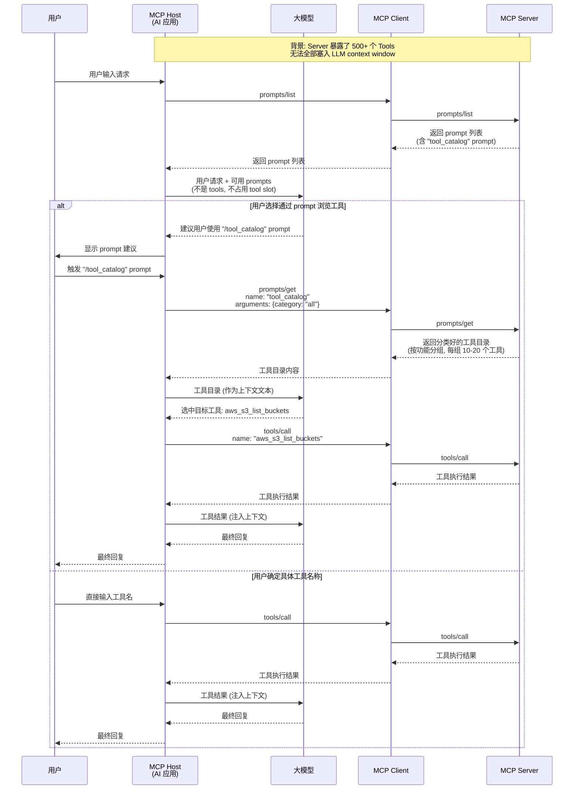
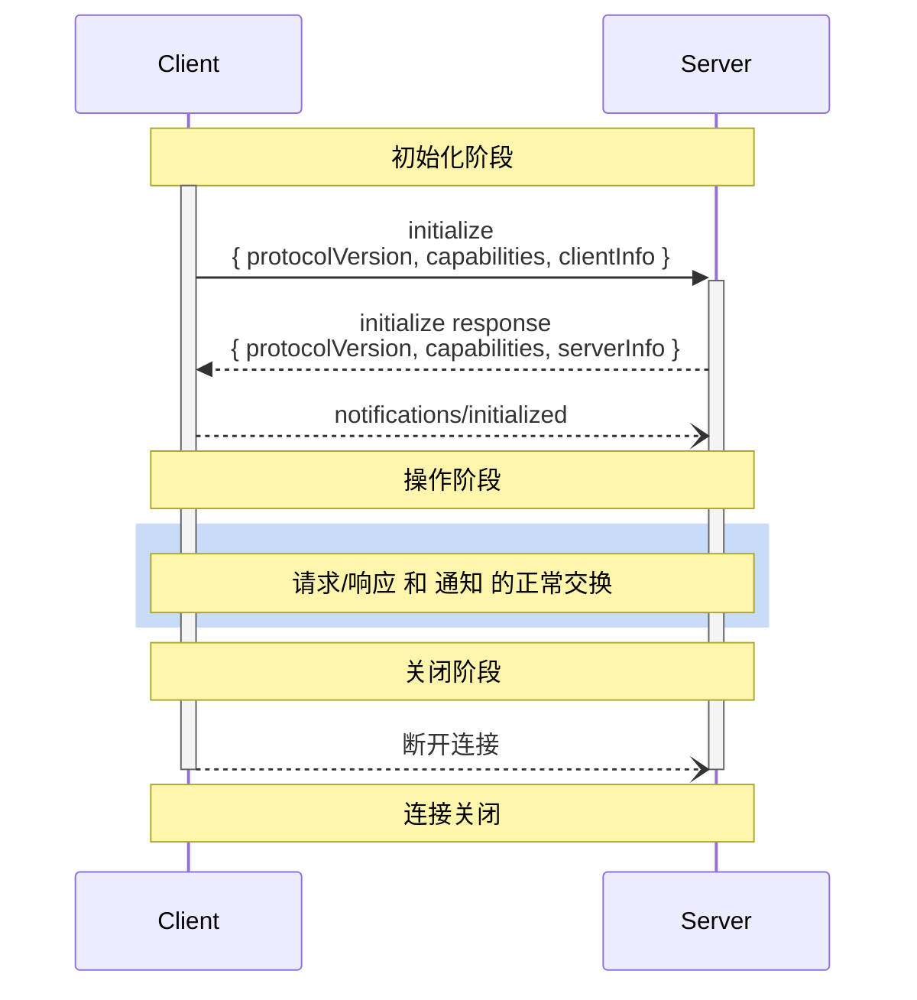
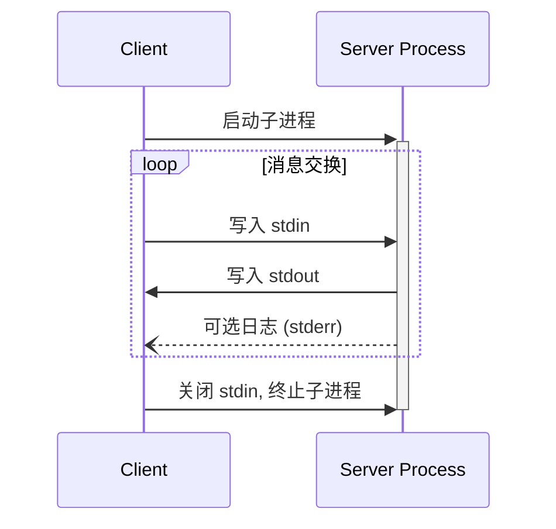

还记得那个抽屉吗？十年前，每个数码产品都自带一根充电线。诺基亚的圆头、三星的宽口、苹果的 30-pin、后来的 Lightning、再后来的 micro-USB——你家的抽屉里缠着七八根线，出门还得带两根。2014 年 USB-C 出现以后，事情开始变——手机、笔记本、耳机、甚至显示器，一根线全部搞定。

MCP 做的事情，和 USB-C 一模一样。

在没有 MCP 之前，每当你需要让 AI 应用连接一个新的外部服务，你就要写一根"专用充电线"：定义认证方式、设计消息格式、处理断线重连、管理工具注册、写一堆 glue code。十个服务就是十根不同的线。MCP 把"线头"统一了——任何 MCP Server 都能被任何 MCP Host 接入，只要双方都说同一种协议语言。

但这篇文章不是科普。这篇是写给已经知道"MCP 大概是什么"的开发者看的。我们要拆的是骨头，不是皮肤。从 JSON-RPC 2.0 的消息格式开始，到三大原语的协议方法，到 Host/Client/Server 的三角架构，到生命周期的三个阶段，到两种传输的坑，到一个你可能没想到的使用方式——用 Prompts 原语绕开 tool call 的限制。每一节都直接对应一个你实现或调试 MCP 时会碰到的真实问题。

周三上午十点，你打开 Claude Code，发现它调了一个 MCP Server 的工具。卧槽，中间到底走了多少步 JSON-RPC 消息？看完这篇文章，你不仅能说出来，你还能把它写在白板上。

# 一、MCP 到底简化了什么流程

让我们先回到没有 MCP 的时候。假设你是一个 IDE 开发者，你想在 VS Code 的 AI Copilot 里让 LLM 能"查看当前文件的 git diff"。你需要做什么？

第一，你需要在插件里启动一个 git 子进程，或者调用 git 的 Node.js 绑定。第二，你需要定义 LLM 的 function call schema——`function_name` 叫什么、参数有哪些、描述怎么写。第三，你需要处理 LLM 返回的 function call 请求，把它路由到刚才的 git 调用上。第四，拿到 git 的返回结果后，再把它塞回 LLM 的上下文里。第五，如果用户还要用这个 Copilot 操作数据库，你得再写一遍上面所有步骤。

这还只是一个功能、一个工具。如果你想让 Copilot 同时支持 git、数据库、文件系统、Sentry 错误日志、Jira 工单、Slack 消息——这个 N×M 的集成矩阵会让任何团队崩溃。每个工具都要单独定义 schema、单独处理调用路由、单独维护连接生命周期。

MCP 做的事情就是把这个 N×M 矩阵变成 N+M：**M 个 Server 各自暴露符合统一协议的能力，N 个 Host 各自实现一次协议客户端**。任何 Host 接入任何 Server，零适配成本。

具体来说，MCP 把以下流程标准化了：

1. **能力发现**：不用再手动维护工具列表了。Host 发一个 `tools/list`，Server 返回完整的工具元数据（名称、描述、输入 schema、输出 schema）。工具变了，Server 发个通知就行了。
2. **调用路由**：Host 不再需要为每个外部服务写不同的调用逻辑。所有调用都是 `tools/call` + `name` + `arguments`，统一格式。
3. **上下文注入**：Resources 原语让 Server 可以把数据（文件内容、数据库 schema、API 文档）以结构化的方式暴露给 Host，Host 自动注入到 LLM 的上下文中。
4. **连接生命周期**：连接建立、能力协商、断线重连——都定义在协议层，不需要每个 Server 自己实现一套。
5. **认证与会话**：Streamable HTTP 传输自带 `Mcp-Session-Id` 和 OAuth 认证机制，不需要每个远程服务自己发明轮子。

简单说：MCP 把一个"每个工具都要自己铺路"的原始状态变成了"路已经铺好了，你只需要在上面开车"。

# 二、三大核心原语：Tools、Resources、Prompts

MCP 协议的核心是三个原语（Primitives）。你可以在 `initialize` 的 `capabilities` 里声明支持哪些、不支持哪些。这三者分别对应三种不同的交互模型。

## 2.1 Tools：模型驱动的执行

Tool 是 MCP Server 暴露给 LLM 的"函数"。它的交互模型是 **model-controlled**——LLM 自己决定什么时候调用哪个工具、传什么参数。

一个完整的 Tool 定义长这样：

```json
{
  "name": "get_weather",
  "title": "Weather Information Provider",
  "description": "Get current weather information for a location",
  "inputSchema": {
    "type": "object",
    "properties": {
      "location": {
        "type": "string",
        "description": "City name or zip code"
      }
    },
    "required": ["location"]
  },
  "outputSchema": {
    "type": "object",
    "properties": {
      "temperature": { "type": "number" },
      "conditions": { "type": "string" },
      "humidity": { "type": "number" }
    }
  }
}
```

这里面有几个开发者必须注意的细节：

- **`inputSchema` 使用 JSON Schema**。这不是摆设——LLM 真的会读这个 schema 来决定传什么参数。你写 `"description": "City name or zip code"`，模型就看到了这个描述。写得烂，调得就烂。
- **`outputSchema` 是可选的，但强烈建议写**。它让 Host 可以做结构化的结果解析，不用靠 regex 从文本里抠数据。
- **Tool Result 的 `content` 数组是多类型的**：`text`、`image`、`audio`、`resource_link`、`resource` 都可以塞进去，每种都有 `type` 字段标识。
- **`structuredContent` 和 `content` 是并行的**：如果你返回结构化结果，最好同时在 `content` 里放一份 JSON 文本以保持向后兼容。
- **错误处理有两层**：JSON-RPC 协议错误（`-32602` 参数无效、`-32603` 内部错误）用于"工具找不到"这类问题；`isError: true` 用于"工具执行失败但协议层没问题"（比如 API rate limit 了）。

协议方法：

| 方法                               | 用途                                                                       |
| ---------------------------------- | -------------------------------------------------------------------------- |
| `tools/list`                       | 列出所有可用工具，支持分页（`cursor` / `nextCursor`）                      |
| `tools/call`                       | 调用指定工具                                                               |
| `notifications/tools/list_changed` | 工具列表变更通知（需要 server 在 capabilities 里声明 `listChanged: true`） |

## 2.2 Resources：应用驱动的上下文

Resource 是提供给 LLM 和用户的"数据"。它的交互模型是 **application-driven**——不是 LLM 自己决定读什么，而是 Host 应用根据场景决定注入哪些资源到上下文中。

Resource 的定义：

```json
{
  "uri": "file:///project/src/main.rs",
  "name": "main.rs",
  "title": "Rust Application Main File",
  "description": "Primary application entry point",
  "mimeType": "text/x-rust",
  "size": 1024
}
```

Resource 支持两种内容类型：

- **Text Content**：`"text": "fn main() { ... }"`
- **Binary Content**：`"blob": "base64-encoded-data"`，配 `mimeType`

关键细节：

- **URI 是资源的唯一标识**。使用标准 URI scheme：`file://`、`https://`、`git://`，也可以自定义。注意 `https://` 是有语义的——它表示客户端自己能从 web 上加载这个资源，不需要走 MCP Server 代理。
- **Resource Templates**：`resources/templates/list` 返回 URI template（RFC 6570），比如 `file:///{path}`，允许客户端按需构造资源 URI。
- **订阅机制**：如果 server 声明 `subscribe: true`，客户端可以 `resources/subscribe` 订阅某个资源的变化，server 通过 `notifications/resources/updated` 推送更新。
- **Annotations**：每个 resource 可以有 `audience`（`"user"` / `"assistant"`）、`priority`（0 到 1）、`lastModified`（ISO 8601）注解，帮助 Host 做上下文过滤和排序。

协议方法：

| 方法                                   | 用途                             |
| -------------------------------------- | -------------------------------- |
| `resources/list`                       | 列出所有可用资源，支持分页       |
| `resources/templates/list`             | 列出所有资源模板（URI template） |
| `resources/read`                       | 读取指定 URI 的资源内容          |
| `resources/subscribe`                  | 订阅某个资源的变更通知           |
| `notifications/resources/updated`      | 资源更新通知                     |
| `notifications/resources/list_changed` | 资源列表变更通知                 |

## 2.3 Prompts：用户驱动的模板

Prompt 是预定义的提示词模板。它的交互模型是 **user-controlled**——由用户主动选择触发，比如 IDE 里的 slash command。

一个 Prompt 定义：

```json
{
  "name": "code_review",
  "title": "Request Code Review",
  "description": "Asks the LLM to analyze code quality and suggest improvements",
  "arguments": [
    {
      "name": "code",
      "description": "The code to review",
      "required": true
    }
  ]
}
```

调用 `prompts/get` 后返回一组 `messages`：

```json
{
  "description": "Code review prompt",
  "messages": [
    {
      "role": "user",
      "content": {
        "type": "text",
        "text": "Please review this Python code:\ndef hello():\n    print('world')"
      }
    }
  ]
}
```

Messages 支持四种内容类型：`text`、`image`（base64 + mimeType）、`audio`、`resource`（可嵌入资源）。`role` 可以是 `"user"` 或 `"assistant"`，这意味着你可以定义多轮对话模板。

协议方法：

| 方法                                 | 用途                               |
| ------------------------------------ | ---------------------------------- |
| `prompts/list`                       | 列出所有可用 prompt 模板，支持分页 |
| `prompts/get`                        | 获取指定 prompt 的内容             |
| `notifications/prompts/list_changed` | Prompt 列表变更通知                |

**一个重要概念**：这三个原语的交互模型分别对应了 AI 系统中的三种控制权归属——

- Tool 的控制权在 LLM
- Resource 的控制权在 Host 应用
- Prompt 的控制权在用户

理解了这个区分，你才能在设计 MCP Server 时做出正确的选择——该暴露的东西是用 Tool、Resource 还是 Prompt。

# 三、MCP 和 Tool Call 的真实关系

很多人第一次见到 MCP 时会问："这不就是 function call 吗？"他甚至会反问："我已经在 OpenAI SDK 里用 function call 了，为什么要再套一层 MCP？"

答案是：**Tool Call 是"调用动作"，MCP 是"工具接入协议"。它们不是替代关系，是分层协作。**

Tool Call（function call）解决的是 LLM 内部的决策：模型根据上下文判断"我现在应该调用哪个函数，传什么参数"。这是 LLM 的能力——它输出的是一个包含 `function_name` 和 `arguments` 的 JSON。

MCP 解决的是外部连接：这个"函数"怎么注册到系统中、它的 schema 从哪来、调用后的结果怎么格式化、连接断了怎么办。MCP 不关心 LLM 产生 function call 的决策过程，它只关心"决策之前怎么发现工具"和"决策之后怎么执行工具"。

完整的数据流是这样的（一个典型的 LLM 对话轮次）：

```
[用户输入] → [LLM 推理] → [LLM 输出 function call]
                                ↓
                        [Host 截获 function call]
                                ↓
                   [Host 在注册表中查找工具来源]
                                ↓
                   [Host 调用 MCP Client → MCP Server]
                                ↓
                         [Server 执行业务逻辑]
                                ↓
                    [Server 返回 results → Client]
                                ↓
                    [Host 将 results 注入 LLM 上下文]
                                ↓
                        [LLM 继续推理 → 最终回复]
```

MCP 在这一条链里负责的是从"Host 截获 function call"到"Host 将 results 注入 LLM 上下文"这一段。它不参与 LLM 的推理决策，也不替代 LLM 的 function calling 机制。它替代的是你亲手写的那个"工具注册表 + 调用路由 + 连接管理"的胶水代码。

具体来说，MCP 承担了三件事：

1. **工具注册**：Host 在初始化阶段向所有 MCP Server 发 `tools/list`，把返回的所有工具定义合并成一个统一的注册表。Host 再把这个注册表翻译成 LLM 能理解的 function call schema list。
2. **调用路由**：LLM 产生一个 function call 后，Host 根据工具名称反向查找对应的 MCP Server 和连接，通过 `tools/call` 发起调用。
3. **结果回传**：MCP Server 返回结构化结果，Host 将其注入 LLM 上下文。

所以 MCP 和 Tool Call 的配合关系是：**Tool Call 是 LLM 的"嘴和手"，MCP 是"中枢神经系统"**。嘴和手负责表达意图和执行动作，中枢神经负责路由信号。

# 四、当工具太多：Prompt 原语的逃逸通道

现在讲一个你可能没意识到的用法，也是 MCP 设计最有趣的地方之一。

## 4.1 问题：Tool Call 的物理上限

LLM 的 function calling 有一个硬性限制：**context window 大小**。每次请求你都要把 tool definitions（name + description + input schema）塞进请求体里。一个中等复杂的工具定义大约 300-500 tokens。如果你有 50 个工具，就是 15K-25K tokens——这已经吃掉了很多模型的 context 预算。如果你有 500 个工具呢？直接炸了。

而且很多模型的 tool call 有数量限制。比如某模型最多支持 128 个 function definitions。一个大型 MCP Server（比如一个全面的 AWS 操作 Server）可能暴露几百个 API 操作，根本塞不进去。

## 4.2 解法：把工具通道改成 Prompt 通道

答案藏在 MCP 的第三个原语里：**Prompts**。

Tool 原语的设计是"模型自动调用"——但它的代价是工具定义必须占用 context window。Prompts 原语的设计是"用户手动选择"——你不需要把所有东西都塞进一次请求里。你可以通过 Prompts 暴露一个"工具目录"：

```
用户输入 "/aws_tools" → Host 调用 prompts/get 获取 tool catalog →
LLM 看到目录内容（按功能分组）→ 用户选择使用哪个功能 →
Host 再发起实际的 tools/call
```

下面是这个流程的完整时序图：



## 4.3 这个模式的核心价值

这种模式解决了三个实际问题：

1. **突破 tool slot 限制**：工具目录以文本形式出现在对话上下文中，不占用 tool 槽位。即使有 1000 个工具，也可以通过分页、搜索、分类来降低 token 消耗。
2. **分步决策降低上下文压力**：LLM 不需要一次性理解所有 500 个工具的细节。它只需要理解"分类目录 ±20 个工具"，选出最接近的，再让用户确认或细化。
3. **工具发现和功能浏览**：用户可以通过 `/` 命令浏览可用能力，像一个真正的应用菜单，而不是在黑暗中靠模型猜。

这里有一个微妙但重要的设计决策值得注意：MCP 协议本身并没有规定"工具太多就要转成 Prompts"。这个模式是应用层的策略，是 Host 开发者的选择。MCP 只是提供了 Tools 和 Prompts 两个原语，搭好积木，怎么组合是开发者的事。这也解释了为什么理解"MCP 不是什么，只提供什么"如此重要。

# 五、三角架构：Host、Client、Server 怎么协同

## 5.1 不是两层，是三层

很多人以为 MCP 就是"Client 连 Server"——两层。但实际上 MCP 的架构标准定义的是三层：

```
┌─────────────────────────────┐
│       MCP Host              │
│  ┌─────────┐ ┌─────────┐   │
│  │ Client 1│ │ Client 2│...│
│  └────┬────┘ └────┬────┘   │
└───────┼───────────┼────────┘
        │           │
   ┌────▼────┐  ┌───▼─────┐
   │ Server 1│  │ Server 2│
   │ (STDIO) │  │ (HTTP)  │
   └─────────┘  └─────────┘
```

- **Host** 是 AI 应用本身——Claude Desktop、VS Code、Cursor、你自己写的 chatbot。它管理多个 Client 的生命周期、执行权限控制、做用户许可、聚集来自各个 Server 的上下文。
- **Client** 是 Host 创建的一个连接实例。每个 Client 和一个 Server 维持 **1:1 的关系**。它的职责包括：协议协商、消息路由、订阅和通知管理、保持不同 Server 之间的安全隔离。
- **Server** 是外部能力提供方——文件系统服务、数据库查询服务、SaaS API 代理。Server 不关心谁在调用它，也不关心对话的其他部分。它只知道它暴露的原语被谁请求了什么。

这个设计的核心安全原则是：**Server 不能读取完整的对话历史，也不能"看到"其他 Server 的存在。** 完整的对话历史始终留在 Host 里。每个 Server 连接相互隔离。Host 进程执行安全边界。

## 5.2 为什么不是简单的 Client/Server 两层

把 Host 和 Client 分开的理由有两个：

第一，**多连接管理**。一个 Host 可能同时连接 5 个 MCP Server：文件系统、PostgreSQL、Sentry、Jira、自定义业务 API。每个连接有独立的状态、独立的 session、独立的认证。把 Client 作为独立组件可以让 Host 统一管理这些连接的集合。

第二，**权限收敛**。Host 是唯一的用户界面接触点。所有用户许可（"是否允许 AI 调用文件删除操作？"）都在 Host 层处理。如果 Client 直接和 Server 通信而没有 Host 的仲裁，权限模型就会失控。

## 5.3 Capability Negotiation 的工作机制

MCP 不是"Server 有什么 Host 就用什么"的模型。连接建立时，双方要进行**能力协商**：

1. Client 在 `initialize` 请求中声明自己支持的客户端能力（`sampling`、`roots`、`elicitation`、`experimental`）。
2. Server 在 `initialize` 响应中声明自己支持的服务端能力（`tools`、`resources`、`prompts`、`logging`）。
3. 每种能力可以有子能力。比如：`tools.listChanged: true` 表示 Server 会主动推送工具列表变更通知；`resources.subscribe: true` 表示 Server 支持资源订阅。
4. 协商完成后，双方在整个会话中 **只能使用协商成功的能力**。如果 Server 没有声明 `tools`，Client 就不能发 `tools/call`。

这个设计意味着 MCP 是渐进增强的——你可以先写一个只支持 Resources 的 Server，以后再慢慢加上 Tools 和 Prompts。Client 端的实现也是：你可以先做一个只读工具的 Client，以后再扩展支持资源订阅和 sampling。

# 六、JSON-RPC 2.0：消息格式逐字段拆解

MCP 的数据层完全建立在 JSON-RPC 2.0 之上。理解 JSON-RPC 的消息格式是你调试 MCP 的基础。

## 6.1 四种消息类型

JSON-RPC 2.0 定义了四种消息模式。MCP 使用了其中三种：

### Request（请求-响应模式）

```json
{
  "jsonrpc": "2.0",
  "id": 1,
  "method": "tools/call",
  "params": {
    "name": "get_weather",
    "arguments": { "location": "Beijing" }
  }
}
```

### Response（成功的响应）

```json
{
  "jsonrpc": "2.0",
  "id": 1,
  "result": {
    "content": [{ "type": "text", "text": "Beijing: 25°C, sunny" }]
  }
}
```

### Error Response（错误的响应）

```json
{
  "jsonrpc": "2.0",
  "id": 1,
  "error": {
    "code": -32602,
    "message": "Unsupported protocol version",
    "data": { "supported": ["2025-06-18"], "requested": "1.0.0" }
  }
}
```

### Notification（单向通知，不需要响应）

```json
{
  "jsonrpc": "2.0",
  "method": "notifications/tools/list_changed"
}
```

**注意 Notification 没有 `id` 字段。** 这是 JSON-RPC 2.0 规范的定义方式——没有 `id` 意味着 Server 不需要（也不能）发送响应。MCP 里所有的 `notifications/` 前缀方法都是这种东西。

## 6.2 字段语义

- **`jsonrpc`**：永远是 `"2.0"`。不是可选项。
- **`id`**：请求的唯一标识符，**必须是 String 或 Number**。响应的 `id` 必须和请求的 `id` 匹配。在 Stdio 传输中，`id` 用于关联请求和响应（因为请求和响应在同一个流上交错）。在 Streamable HTTP 中，`id` 在单次 POST 请求的 SSE 流内关联。
- **`method`**：MCP 的 method 使用点号命名空间：`tools/list`、`resources/read`、`sampling/createMessage`、`notifications/tools/list_changed`。这是协议扩展性的关键——新增 method 不破坏现有实现。
- **`params`**：方法参数，可以是对象或数组。MCP 规范中几乎所有 method 都使用对象格式。
- **`result`**：成功响应的返回值，类型由 method 定义决定。
- **`error`**：失败响应。包含 `code`（整数）、`message`（字符串）、可选的 `data`（任意类型）。

## 6.3 标准错误码

| 错误码   | 含义             | MCP 中的典型场景                  |
| -------- | ---------------- | --------------------------------- |
| `-32700` | Parse error      | 接收到的 JSON 不合法              |
| `-32600` | Invalid Request  | 不是有效的 JSON-RPC 请求          |
| `-32601` | Method not found | method 名称不在 Server 支持列表内 |
| `-32602` | Invalid params   | 参数类型或值不合法                |
| `-32603` | Internal error   | Server 内部未知错误               |
| `-32002` | (MCP 自定义)     | Resource not found                |

注意 `-32768` 到 `-32000` 是 JSON-RPC 规范预留的，MCP 在 `-32000` 以下定义了自定义错误码。

# 七、为什么是 JSON-RPC，而不是 gRPC

这个问题值得单独开一章。你几乎每看一次 MCP 文档就会有一次这个念头："等等，为什么它是基于 JSON-RPC 而不是 gRPC？"

## 7.1 JSON-RPC 的优势

### 第一，人类可读和可调试性

这是最重要的原因。MCP 的定位是"让开发者非常容易地构建和调试 Server"。你用 MCP Inspector 可以直接看到所有 JSON-RPC 消息的明文内容，用 `curl` 或者 `websocat` 就能手写请求。gRPC 的高性能二进制序列化（protobuf）在调试时是致命的——你需要 protobuf 定义文件才能解码一条消息。

周三下午四点，你接到一个 bug report："MCP Server 的工具调用总是返回错误"。你用 `stderr` 打开日志，看到最后一条消息是：

```json
{ "jsonrpc": "2.0", "id": 42, "method": "tools/call", "params": { "name": "delete_user", "arguments": { "id": 1234 } } }
```

你一眼就能看懂发生了什么。如果是 protobuf 编码的消息，日志里只有一堆十六进制字节。

### 第二，零 Schema 依赖

JSON-RPC 消息是自描述的。你用任何语言写一个 MCP Client，只需要知道 method 名称和参数结构，不需要 import 任何 `.proto` 文件。这让 MCP 生态的门槛极低——任何人都可以用 curl 写一个最简单的 Client。

### 第三，STDIO 友好

MCP 最核心的传输机制之一是 STDIO——标准输入输出流。JSON-RPC 的每一行就是一个完整的消息（换行符分隔），恰好符合 UNIX 进程间通信的惯例。gRPC 的二进制帧格式在纯文本流上无法直接工作——你需要一个 HTTP/2 传输层。

### 第四，跨语言无摩擦

JSON 是几乎所有编程语言的标准库都支持的类型。不需要编译 protobuf、不需要生成 stub 代码、不需要管理 proto 文件版本。

## 7.2 gRPC 的优势（以及为什么 MCP 没选它）

| 维度        | JSON-RPC                  | gRPC                           |
| ----------- | ------------------------- | ------------------------------ |
| 序列化      | JSON 文本                 | Protobuf 二进制                |
| 性能        | 较低（文本解析开销）      | 较高（二进制零拷贝）           |
| 类型安全    | 运行时校验（JSON Schema） | 编译时校验（protobuf）         |
| 流式        | 需要 SSE/WebSocket 辅助   | 原生双向流                     |
| 调试        | 极好（人类可读）          | 差（需要 proto 文件）          |
| 入门门槛    | 极低（curl 即可）         | 中等（需要 protoc + 代码生成） |
| 网络传输    | HTTP/1.1 + SSE            | HTTP/2（原生多路复用）         |
| Schema 演进 | 手动管理                  | Protobuf 向后兼容规则          |

gRPC 在性能、类型安全、原生流式方面有优势，但 MCP 的设计原则中第一条就是 **"Servers should be extremely easy to build"**。牺牲一点性能换取一个所有人都能调试的协议，是 MCP 故意做出的权衡。

## 7.3 判断框架：什么时候选哪个

- **选 MCP/JSON-RPC**：你要连接 AI 应用和外部工具/数据，需要快速开发和调试，需要跨语言互操作，性能不是首要瓶颈（MCP 消息通常不频繁，且能容忍毫秒级延迟）。
- **选 gRPC**：你在做微服务间的内部通信，需要高吞吐、低延迟、强类型约束，有统一的 protobuf schema 管理流程，不是 AI 上下文交换场景。

MCP 层不是高性能数据通道——它是上下文交换协议。每次对话轮次发几条 JSON-RPC 消息，瓶颈在 LLM 推理（秒级）而不是协议传输（毫秒级）。在 LLM token 成本面前，他妈的 JSON 解析那点额外开销可以忽略不计。

# 八、MCP 生命周期的三个阶段

MCP 是一个**有状态**的协议。它严格定义了从建立到销毁的三个阶段。

## 8.1 初始化阶段（Initialization）

初始化是必须的第一步。在这个阶段：

1. Client 发送 `initialize` 请求，携带自身支持的协议版本、客户端能力、客户端信息。
2. Server 返回 `initialize` 响应，携带协商后的协议版本、服务端能力、服务端信息。
3. Client 发送 `notifications/initialized` 通知，表示准备好进入操作阶段。

时序图：



关键细节：

- **版本协商**：Client 发送它支持的最高版本，Server 回应它支持的最高版本。如果 Client 不支持 Server 的版本，Client 应该断开。
- **在 `initialized` 通知之前，Client 只能发 `ping` 请求**，不能发任何业务请求。Server 在收到 `initialized` 之前也只能发 `ping` 和 `logging`。
- **Capability 对象里面每一个 key 都是有语义的**。`"tools": {}` 表示支持 tools 但不支持 list change 通知；`"tools": {"listChanged": true}` 表示两者都支持。空的 `{}` 不是"没能力"，是"支持基础能力但不支持子能力"。

## 8.2 操作阶段（Operation）

操作阶段是正常的请求-响应交换。双方只能使用初始化阶段协商好的能力。

## 8.3 关闭阶段（Shutdown）

MCP 没有定义专门的关闭消息。它依赖于传输层：

- **STDIO**：Client 关闭子进程的 stdin，等待 Server 退出；必要时发送 SIGTERM；超时后发送 SIGKILL。Server 也可以主动关闭 stdout 并退出。
- **Streamable HTTP**：Client 发送 HTTP DELETE 到 MCP endpoint（携带 `Mcp-Session-Id`）；或者任何一方关闭 HTTP 连接。Server 也可以在任意时间终止 session，之后对该 session 的所有请求返回 HTTP 404。

## 8.4 超时和错误处理

实现者**应该**为所有请求设置超时。超时后发送 `CancelledNotification` 并停止等待响应。收到 `ProgressNotification` 时可以重置超时时钟（表示任务还在进行），但必须有绝对最大超时，防止恶意或异常的 Server 无限占用资源。

# 九、两种传输机制：STDIO 和 Streamable HTTP

## 9.1 STDIO 传输

STDIO 是本地 Server 的推荐传输。工作原理：

1. Host 启动 MCP Server 作为**子进程**。
2. Server 从 **stdin** 读取 JSON-RPC 消息，向 **stdout** 写入 JSON-RPC 消息。
3. 每条消息是一个完整的 JSON 对象，以 **换行符（`\n`）** 分隔。
4. 消息内部**不能包含嵌入的换行符**（所以 JSON 必须 compact，不能 pretty-print）。
5. Server 的日志必须写到 **stderr**，绝对不能写 stdout。



### 开发者踩坑记录

**坑 #1：不小心用 `print()` 输出日志。** Python 的 `print()` 默认输出到 stdout。在 STDIO MCP Server 中，任何 stdout 的非 JSON-RPC 内容都会污染协议流，导致 Client 解析失败。正确做法：`print("log message", file=sys.stderr)` 或使用 logging 库（默认输出到 stderr）。

**坑 #2：JSON pretty-print。** 换行符在 compact JSON 中是消息分隔符。如果你把 JSON 格式化输出——什么鬼，一个消息裂成了 N 段，Client 看到了 N 条语法错误的"消息"。永远用 compact JSON。

**坑 #3：没有 flush。** stdout 默认是行缓冲的（line-buffered），但如果你用管道而不是终端，可能变成全缓冲。这个行为切换他妈的逆天——同一个程序，在终端里跑和用管道跑，缓冲策略不一样。每个 JSON-RPC 消息写完后一定要 `flush()`，否则 Client 会永远等你还没发出的消息。

## 9.2 Streamable HTTP 传输

这是从协议版本 2025-03-26 开始引入的，替代了旧的 HTTP+SSE 传输。它用一个统一的 HTTP endpoint 同时处理双向通信。

核心规则：

1. **Client → Server 消息**：HTTP POST 到 MCP endpoint。如果 POST 的是 request，Server 返回 `Content-Type: text/event-stream`（启动 SSE 流）或 `Content-Type: application/json`（单次响应）。
2. **Server → Client 消息**：HTTP GET 到 MCP endpoint 打开 SSE 流，Server 在流上发送消息。
3. **Session 管理**：Server 在 `initialize` 响应中通过 `Mcp-Session-Id` header 分配 session ID。后续所有请求都必须带这个 header。
4. **断线恢复**：Server 可以为 SSE 事件分配 `id` 字段。Client 断线后通过 `Last-Event-ID` header 告诉 Server 最后收到的 event ID，Server 可以选择从该位置重放。

## 9.3 什么时候选哪个

| 场景                             | 推荐传输                                               |
| -------------------------------- | ------------------------------------------------------ |
| 本地工具（文件系统、数据库代理） | STDIO                                                  |
| 远程服务（SaaS API、企业服务）   | Streamable HTTP                                        |
| 多租户 Server                    | Streamable HTTP（STDIO 只能 1:1）                      |
| 需要认证（OAuth / Bearer Token） | Streamable HTTP                                        |
| 单用户开发工具                   | STDIO                                                  |
| 需要 Server 向 Client 主动推送   | 两者都支持（STDIO 用 notification，HTTP 用 SSE + GET） |

一个常见的误解是"Streamable HTTP 比 STDIO 更强大"。其实不是——STDIO 也支持双向消息和通知。区别在于 STDIO 绑定到子进程（1:1），而 Streamable HTTP 可以支持多个 Client 同时连接一个 Server（1:N）。

# 十、MCP 的演进：从 2024-11-05 到 2025-11-25

MCP 不是一个一成不变的协议。从 2024 年 11 月的第一个正式版本开始，它已经经历了三次重大修订。理解这些变化能帮你判断一个 MCP Server 或 Client 的实现版本。

## 10.1 版本时间线

| 协议版本     | 发布日期   | 关键变化                                                                                                      |
| ------------ | ---------- | ------------------------------------------------------------------------------------------------------------- |
| `2024-11-05` | 2024年11月 | 首个正式版本。定义了 Tools、Resources、Prompts 三大原语，HTTP+SSE 传输                                        |
| `2025-03-26` | 2025年3月  | 引入 Streamable HTTP 传输，替代旧 HTTP+SSE；增加 Session 管理                                                 |
| `2025-06-18` | 2025年6月  | 增加 Elicitation、结构化 Tool 输出（`structuredContent`）、资源订阅                                           |
| `2025-11-25` | 2025年11月 | 当前最新稳定版。Tool `outputSchema` 标准化、Tool Annotations、`elicitation/create` 协议完善、OAuth 认证标准化 |

## 10.2 Streamable HTTP 替代 HTTP+SSE

这是最重要的协议变更。旧的 HTTP+SSE 传输有两个端点：一个 POST 端点（Client → Server）和一个 GET/SSE 端点（Server → Client）。这两个端点是分离的、独立配置的。

新的 Streamable HTTP 把两者合并到**一个 URL**：

- POST 到这个 URL = 向 Server 发消息
- GET 到这个 URL = 从 Server 收消息（SSE 流）

这简化了部署和配置。对于向后兼容，旧协议通过"probe 模式"持续支持：Client 先尝试 POST，失败则回退到 GET 获取 SSE endpoint URL。

## 10.3 Elicitation

`elicitation` 是 Client 端能力，允许 Server 主动向用户请求额外信息。典型场景：Server 在执行一个敏感操作前想确认用户意图。

```json
// Server → Client
{
  "jsonrpc": "2.0",
  "id": 7,
  "method": "elicitation/create",
  "params": {
    "message": "即将删除 150 条用户记录，是否继续？",
    "requestedSchema": {
      "type": "object",
      "properties": {
        "confirm": { "type": "boolean" },
        "reason": { "type": "string" }
      }
    }
  }
}
```

这和 HTTP 的确认对话框不同——elicitation 是在 MCP 协议层面、跨传输、跨语言的用户交互机制。

## 10.4 实验性功能：Tasks

`tasks` 是目前标记为 Experimental 的功能。它提供了持久化执行包装——允许长时间运行的任务以异步方式执行，结果可以在之后检索。类似于"触发一个作业，拿回一个 task ID，过后再查结果"。这对于大数据查询、批量处理、工作流编排等场景非常关键。

# 十一、你可能忽略的细节

## 11.1 通知机制

MCP 的通知系统不仅是"Server 可以推送更新"。它有精确的语义：

- Server 只有在 initialize 时声明了 `listChanged: true` 才会发送列表变更通知。
- 客户端收到 `notifications/tools/list_changed` 后的标准反应是立即重新调用 `tools/list` 获取最新列表。
- `notifications/resources/updated` 的前提是 Client 之前调用了 `resources/subscribe` 且 Server 声明了 `subscribe: true`。

## 11.2 Annotations：优先级和受众

Resources、Prompts 的消息内容、Tool 的结果都支持 `annotations`：

```json
{
  "audience": ["user", "assistant"],
  "priority": 0.8,
  "lastModified": "2025-05-09T10:00:00Z"
}
```

- `audience`：`"user"` 表示内容适合展示给用户，`"assistant"` 表示内容适合给 LLM 看。Host 可以根据这个做过滤。
- `priority`：0.0 到 1.0，1.0 表示"最重要"（必须包含），0 表示"最不重要"（可以省略）。Host 可以用这个来做上下文的优先级排序。在多 Server 环境下，priority 是控制 context 预算的关键工具。
- `lastModified`：ISO 8601 时间戳。Host 可以用它来做缓存、去重、排序。

## 11.3 分页

`tools/list`、`resources/list`、`prompts/list` 都支持基于 cursor 的分页：

```json
// 请求
{ "method": "tools/list", "params": { "cursor": "page-2" } }

// 响应
{
  "result": {
    "tools": [...],
    "nextCursor": "page-3"
  }
}
```

如果 `nextCursor` 不存在或为空，说明已经是最后一页。`cursor` 是一个不透明的字符串——Client 不应该解析它的内容。

## 11.4 取消和进度

**取消**：Client 发送 `notifications/cancelled`（携带要取消的 request id）。Server 收到后应该停止正在进行的操作并清理资源。

**进度**：Server 在长时间操作中可以发送 `notifications/progress`（携带 request id、已完成的 token 数、可选的 total），Client 可以展示进度条或更新 UI。

## 11.5 安全细节

- **STDIO Server 不能访问网络**（没有天然的网络隔离，但你应该假定要审计 Server 做的所有事情）。
- **Streamable HTTP Server 必须校验 `Origin` header**，防止 DNS rebinding 攻击。本地运行的 Server **应该**只绑定到 `127.0.0.1` 而不是 `0.0.0.0`。
- **Tool Annotations 默认不可信**：Client 应该来自可信 Server 的信息才可信。一个恶意的 MCP Server 可以在 tool description 里写一段 social engineering 文本。Client 必须 validate tool annotations——如果 source 不可信。
- **Server 间隔离是架构级别的**：每个 Client 维持独立的 Server 连接，一个 Server 不能通过 MCP 协议"看到"另一个 Server 的工具或资源。这由 Host 强制，不是在协议层面可选的。

# 十二、判断框架：什么时候用 MCP 的什么

学完这些细节，如果有人问你"MCP 到底怎么用"，你应该能给出一个有条理的答案而不只是"用 MCP Server 暴露工具"。

## 12.1 MCP 的三个原语，各有各的用武之地

**用 Tools 当你需要 LLM 自主决策：**

- 工具数量 < 50 个，总 tool definitions ≤ 15K tokens
- LLM 能在对话中合理判断调用时机
- 操作有副作用（写文件、发邮件、改数据库）
- 需要结构化输入输出（`inputSchema` + `outputSchema`）

**用 Resources 当你需要给 LLM 喂上下文：**

- 文件内容、文档、代码片段
- 静态或准静态的数据资产
- 需要订阅变更的数据（比如实时日志）
- 内容不适合做成"函数调用"

**用 Prompts 当你需要用户交互或工具太多：**

- 工具 > 50 个，tool call context window 装不下
- 需要用户手动选择操作路径（slash command）
- 预定义的对话模板（code review、commit message generation）
- 多轮对话脚本（先让 AI 分析，再让用户确认，再让 AI 执行）

## 12.2 传输选择

- **STDIO**：Server 运行在你本地、只有一个用户需要连、你控制 Server 的启动和关闭。
- **Streamable HTTP**：Server 运行在远端、多个用户/客户端需要连接、需要 OAuth 认证、需要断线恢复。

## 12.3 什么时候不用 MCP

MCP 不是万能的。以下场景不适合：

1. **高频低延迟的函数调用**（比如每个请求需要 100+ 次函数调用）：MCP 的 JSON-RPC 不是为零延迟设计的。这种场景应该直接在 Host 进程内实现函数调用。
2. **Server 需要了解完整的对话上下文来做决策**：MCP 的安全模型限制 Server 只能看到它被要求处理的那部分内容。如果你的 Server 需要完整的对话历史，MCP 不适合——这需要在 Host 层做更紧密的集成。
3. **双向高频流式通信**：MCP 的推送机制（SSE）适合事件驱动的通知，不适合实时双向流。如果需要类似 WebSocket 的持续双向流，MCP 不是最优解。
4. **简单的函数库**：如果你只有一个 Python 脚本暴露 3 个工具，写一个 MCP Server 的开销可能大于直接在代码里定义 function call schema。MCP 的价值体现在"统一接入多个外部能力"和"跨 Host 复用"——规模越大越划算。

# 十三、MCP 生态资源推荐

学完协议细节，接下来就是找对地方、用对工具。以下是开发者最值得关注的 MCP 资源站点：

## 13.1 官方资源

| 站点                                                                                                   | 说明                                                                                  |
| ------------------------------------------------------------------------------------------------------ | ------------------------------------------------------------------------------------- |
| [modelcontextprotocol.io](https://modelcontextprotocol.io)                                             | MCP 官方网站，包含概念文档、SDK 指南、教程                                            |
| [spec.modelcontextprotocol.io](https://spec.modelcontextprotocol.io)                                   | 协议规范原文，RFC 级别的严谨定义                                                      |
| [github.com/modelcontextprotocol/servers](https://github.com/modelcontextprotocol/servers)             | 官方参考实现（Everything、Fetch、Filesystem、Git、Memory、Sequential Thinking、Time） |
| [github.com/modelcontextprotocol/specification](https://github.com/modelcontextprotocol/specification) | 协议规格说明仓库，含 TypeScript schema 定义                                           |

## 13.2 SDK 和语言支持

| 语言/框架            | SDK                                  |
| -------------------- | ------------------------------------ |
| TypeScript / Node.js | `@modelcontextprotocol/sdk`          |
| Python               | `mcp` (pip), FastMCP 高级封装        |
| Java                 | Spring AI MCP Boot Starter           |
| Kotlin               | `io.modelcontextprotocol:kotlin-sdk` |
| C# / .NET            | `ModelContextProtocol` NuGet         |
| Rust                 | `modelcontextprotocol/rust-sdk`      |
| Go                   | `modelcontextprotocol/go-sdk`        |
| PHP                  | `php-mcp/server`, `php-mcp/client`   |
| Elixir               | `anubis-mcp`                         |
| Swift                | `modelcontextprotocol/swift-sdk`     |

## 13.3 社区 Server 发现

| 站点                                                     | 说明                                          |
| -------------------------------------------------------- | --------------------------------------------- |
| [MCP Registry](https://registry.modelcontextprotocol.io) | 官方 Server 注册中心，浏览已发布的 MCP Server |
| [Smithery](https://smithery.ai)                          | 最大的社区 MCP Server 注册中心                |
| [PulseMCP](https://pulsemcp.com)                         | MCP 社区中心 + 每周通讯                       |
| [mcp.so](https://mcp.so)                                 | 中文社区整理的 MCP Server 目录                |
| [mcpservers.org](https://mcpservers.org)                 | Awesome MCP Servers 列表网站                  |
| [glama.ai/mcp/servers](https://glama.ai/mcp/servers)     | 带搜索和分类的 MCP Server 目录                |
| [mcprepository.com](https://mcprepository.com)           | MCP Server 聚合索引                           |

## 13.4 调试和开发工具

| 工具                                                               | 说明                                       |
| ------------------------------------------------------------------ | ------------------------------------------ |
| [MCP Inspector](https://github.com/modelcontextprotocol/inspector) | 官方调试器，可视化查看所有 MCP 消息交互    |
| [mcp-cli](https://github.com/wong2/mcp-cli)                        | 命令行 MCP 调试工具，直接交互式测试 Server |
| [Apidog](https://apidog.com)                                       | API 调试平台的 MCP Client，支持 GUI 操作   |
| [OpenMCP](https://github.com/LSTM-Kirigaya/openmcp-client)         | VS Code 插件，IDE 内调试 MCP Server        |

## 13.5 MCP Host / Client 应用

几乎所有主流 AI 编码工具都支持 MCP：**Claude Desktop**、**Claude Code**、**VS Code / GitHub Copilot**、**Cursor**、**JetBrains AI Assistant / Junie**、**Amazon Q**、**Cline**、**Continue**、**Augment Code**、**ChatGPT**（远程 Server 支持）。

完整列表见 [modelcontextprotocol.io/clients](https://modelcontextprotocol.io/clients)。

## 13.6 部署和托管平台

| 平台                                   | 说明                                             |
| -------------------------------------- | ------------------------------------------------ |
| [mcp.run](https://mcp.run)             | MCP Server 托管和注册平台                        |
| [mcp.natoma.ai](https://mcp.natoma.ai) | 托管 MCP Server 的发现、安装、管理和部署         |
| [Klavis AI](https://klavis.ai)         | 开源 MCP 基础设施，支持 Slack/Discord MCP Client |
| [Smithery](https://smithery.ai)        | 同时提供 Server 注册和远程部署                   |
| [MCPVerse](https://mcpverse.dev)       | MCP Server 创建和托管门户                        |

# 尾声

回到那个抽屉。

Type-C 的统一不在于它最好——论最高传输速率，它打不过一些私有协议；论供电能力，它有上限。Type-C 赢在"一根线，所有设备"。

MCP 做的是一样的事。JSON-RPC 不是最快的 RPC 协议，STDIO 不是最高级的传输方式。但当你需要让 Claude Desktop、VS Code、Cursor、你自己写的 chatbot 和 GitHub Copilot 都能用同一套文件系统工具时，MCP 的价值就出现了。

这篇文章没有教你写 MCP Server 的代码。教写代码的文章已经够多了，SDK 文档里就有。这篇文章想做的是：当你有一天凌晨三点被 MCP 的消息格式问题叫醒时，你不需要再开着四个浏览器 tab 来回跳——你知道 JSON 不能 pretty-print 因为换行符是消息分隔符，你知道 `initialized` 通知之前的请求会被忽略，你知道 tool 太多时可以把目录做成 prompt 而不是硬塞进 function call。

这些细节不值得背，但它们值得被看到。
