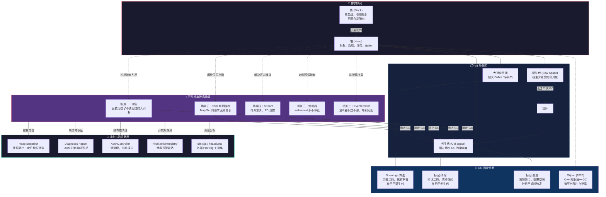

> 写给想搞清楚内存泄露是什么、怎么排查怎么治的开发者们

去年冬天，我盯着 Grafana 上那条线看了快两个小时。

它在涨。很慢，但方向确定无疑——每过一小时往上走十几兆。像漏水的龙头，一滴一滴，你听不见声音，但地板迟早会湿透。我们的 Node.js 服务每隔三天必崩一次，运维同事已经麻木到给它配了自动重启脚本。卧槽，这不叫解决问题，这叫假装看不见。

但你看，大部分讲内存泄露的文章都他妈的一个套路：甩一堆概念，贴几段代码，最后告诉你"注意清理资源"。你看完还是不知道怎么找你自己的问题。这篇文章不一样。我要带你钻进 V8 肚子里，看清楚每个字节是怎么丢的，又是怎么找回来的。

你准备好了吗？我说的是**真的准备好**——准备好用一两个小时，彻底搞懂这件事。

---

## 你他妈的先得知道内存长什么样

我们来聊点底层的。V8，Chrome 和 Node.js 共用的那个 JavaScript 引擎，它管内存的方式像一个被强迫症支配的仓管员。

### 栈：手里的便利贴

你在餐厅点菜，服务员拿个小本子记下来——"3 号桌，鱼香肉丝，米饭一碗"。客走了，这一页撕掉，本子还是那个本子。

栈就是这个本子。

```javascript
const name = '张三'
const age = 25
const isStudent = true
```

这些东西小而确定，用完就扔。操作系统帮你管，你不用操心。但它有个致命短处：**太小了**。你没法把整个冷库的货都登记在便利贴上。

### 堆：后面那个永远理不清的仓库

大件东西——对象、数组、Buffer、闭包——全丢堆里。堆空间大，但没人帮你收拾。这时候就需要"垃圾回收器"（GC）上场了。

```javascript
const user = { name: '张三', age: 25 } // 堆
const scores = [98, 97, 100, 99] // 堆
const buffer = Buffer.alloc(1024 * 1024) // 堆，1MB

function createCounter() {
  let count = 0 // 这个 count 也在堆里，因为闭包抓着它
  return () => ++count
}
```

关键认知：**栈上的变量是指向堆的遥控器**。遥控器丢了，堆里的东西就成了垃圾——没人能再找到它。

### 堆的内部长什么样

V8 把堆切成了五块，像仓库分了生鲜区、干货区、冷藏区：

| 区域       | 官方名             | 放什么                       | 脾气          |
| ---------- | ------------------ | ---------------------------- | ------------- |
| 新生代     | New Space          | 刚创建的小对象，朝生夕死     | 小但打扫勤快  |
| 老生代     | Old Space          | 活了很久的对象，比如全局缓存 | 大但懒得打扫  |
| 大对象空间 | Large Object Space | 超过一定尺寸的大家伙         | 不参与常规 GC |
| 代码空间   | Code Space         | 编译好的机器码               | 你基本不用管  |
| Map 空间   | Map Space          | 对象的结构信息               | V8 的内部账本 |

新生代和老生代是你需要盯紧的两个区域。它们有点像酒店的前台和后台：

- 新生代 = 前台：人来人往，天天打扫
- 老生代 = 库房深处的货架：东西放得久，半年也不一定清一次

新生代里的对象如果经历两次 GC 还没死，就"晋升"到老生代。这是个光荣的退休，但也意味着它更难被清理掉了。

---

## GC 不是魔法，是个清洁工

GC 到底在干什么？如果一句话解释：**它从一组"肯定还活着"的根对象出发，沿着引用链把所有能找到的对象标记为"活的"，剩下的全部回收。**

但问题来了：如果每次 GC 都把整个堆扫一遍，你的应用就别想响应任何请求了。早期的 V8 就是这样——"Stop the World"，全世界停下来，等我扫完地。

现在不一样了。V8 用了三个巧妙的策略：

- **增量标记**：不一次扫完，分批次来，中间穿插你的业务代码。像你在刷剧的时候顺手叠衣服，两边都不耽误。
- **并发标记**：请别人帮忙——开几个辅助线程一起扫，主线程继续接客。
- **并行回收**：扫完了要清理是吧？大家一块儿扔，速度快得多。

结果呢？GC 的停顿从"用户明显感觉卡顿"变成了"你根本感知不到"。毫秒级，甚至微秒级。

### 新生代的清理术：Scavenge

新生代里的东西大多是"用完就扔"，所以 V8 用了狠招：只把活着的搬走，死的不管。

想象你家门口的地垫，太脏了就换块新的。把垫子上的东西挪到新垫子上，丢的脏东西不拿了，旧垫子扔掉。角色互换。

新生代分两块等大区域：From 和 To。新对象全放 From。From 快满的时候触发清理：

1. 把 From 里还活着的对象复制到 To
2. From 和 To 身份互换
3. 原来 From 里的空间全部释放

这招狠在哪？**它不清理死的，它只搬活的。**死的东西原地消失。因为新生代里大部分对象都是短命鬼，活着的很少，搬起来极快。

### 老生代的清理术：标记-清除 + 标记-整理

老生代不能这么玩。里面的东西又多又大，搬家太贵了。所以用了更传统的方法：

1. **标记**：从根开始，一路做记号，活着的打钩
2. **清除**：遍历整个空间，没打钩的回收

但这有个毛病：清除完了，空间跟狗啃的一样，全是碎片。大对象塞不进去。这时候 V8 就会偶尔启动**标记-整理**模式——把所有活的对象挤到一边，碎片都挤没了，边界外的全清掉。

整理开销大，V8 只在碎片严重时才做。

### Oilpan：2026 年的新玩具

Node.js 里有些东西不是 JavaScript 管：比如 `Buffer` 底层的 C++ 对象、Native Addon 的内存。这些以前是灰色地带，谁都不管，最容易泄露。

2026 年 Node.js 引入了 Oilpan，一个专门给 C++ 对象做 GC 的工具，和 V8 主 GC 配合用。以前那些奇怪的"外部内存泄露"（`external` 指标莫名涨到好几 G）现在大大减少了。

**边界：Oilpan 不解决什么？**

它不解决你代码逻辑层面的问题。你写了一个无限增长的 Map，Oilpan 帮不了你。它是清理 C++ 侧"该回收但没人管"的对象的，不是清理你的 JavaScript 代码里的烂摊子。

---

## 全景关系图：一张图看懂内存到底是怎么丢的

我们把这堆概念串起来。下面这张图展示了从代码运行到内存分配、GC 回收、再到五种泄露场景的完整关系链路：



**怎么读这张图：**

从左到右，从上到下。你的代码创建对象 → 对象分配到堆的不同区域 → GC 按策略回收 → 但有五种场景会阻止回收 → 用五种武器来排查和治理。

关键的点：**五种泄露场景无一例外，都是因为"堆里的对象还被某条引用链拴着不放"。** GC 不是傻——它不知道你的业务逻辑。它只知道"这个对象还有没有人引用"。只要有人引用，哪怕你的业务已经不需要这个对象了，GC 也会老老实实留着它。这就是那句反直觉的真相：**内存泄露不是因为 GC 没干活，而是因为你的代码告诉 GC "这东西我还要用"。**

---

## 五种死法：内存泄露的经典场景

好，现在你有底层知识了。我们来看看那些真正在生产环境里咬过你的场景。别急着看解决方案——先看问题是怎么发生的。不懂病因，你治不好病。

### 场景一：闭包——它是有记忆的

闭包是 Node.js 里最美妙也最危险的东西。美妙的点在于它能"记住"外部函数的环境，危险的点也一样。

```javascript
function createLeakingClosure() {
  const hugeBuffer = Buffer.alloc(1024 * 1024 * 10) // 10MB

  return () => {
    // 我只想要 hugeBuffer 的第一个字节
    // 但闭包把整个 10MB 都记住了
    console.log(hugeBuffer[0])
  }
}

const leak = createLeakingClosure()
// 10MB 没了。你对 hugeBuffer 已经"不需要了"，但闭包还不知道。
```

把闭包想象成一张照片。你拍了大合照，只想要 Aunt Lucy 的脸。但你不能只留住她的脸——你得把整张照片都存着。闭包里的函数也一样：它引用了外部环境里的一个变量，就得把**整个外部环境**都留着。

**你该怎么想这个问题？**

永远问自己：这个闭包会不会被长期持有？如果是，它引用的东西里有没有大家伙？大家可以只拿需要的部分，用完就让闭包死掉，或者手动置 null。

```javascript
function createSafeClosure() {
  let hugeBuffer = Buffer.alloc(1024 * 1024 * 10)

  return () => {
    if (!hugeBuffer) return
    console.log(hugeBuffer[0])
    hugeBuffer = null // 主动断舍离
  }
}
```

### 场景二：EventEmitter——那些不肯走的服务员

Node.js 的事件驱动全靠 EventEmitter。但你加一个监听器不删，加一百个不删，加一万个不删——你的进程就被监听器活活淹死了。

```javascript
import { EventEmitter } from 'node:events'

const globalEmitter = new EventEmitter()

export async function handleRequest(req, res) {
  const onData = (data) => {
    console.log('收到数据:', data)
  }

  globalEmitter.on('update', onData) // 加了监听器

  res.end('OK')
  // 忘了移除！每次请求都挂一个新监听器
  // 1000 个请求 = 1000 个 onData 函数
  // 每个 onData 还可能引着请求上下文
}
```

想象你开了一家餐馆。每来一个客人，你就派一个服务员站他旁边等。客人吃完走了，服务员还杵在那。一百个客人来，一百个服务员站着不动。最后整个餐厅塞满了服务员，新客人没地儿坐了。

**三种解法：**

```javascript
// 解一：记着移除
res.on('finish', () => {
  globalEmitter.off('update', onData)
})

// 解二：只干一次
globalEmitter.once('update', (data) => {
  console.log('收到数据:', data)
})

// 解三（推荐）：用 AbortController 一键全清
const controller = new AbortController()

emitter.on('data', handleData, { signal: controller.signal })

// 请求结束时
controller.abort() // 所有绑着这个 signal 的监听器全清
```

### 场景三：定时器——永不消逝的电波

`setInterval` 是泄露经典中的经典。你创建一个定时器它就一直跑，你不叫停它不停。

```javascript
function startTask(data) {
  const timer = setInterval(() => {
    process.send(data.status)
  }, 1000)
  // timer 没被保存，也没被 clear
}

startTask({ status: '任务1' })
startTask({ status: '任务2' })
// ...调了 100 次
// 100 个定时器同时跑，100 个 data 对象永远无法回收
```

就像你约了 100 个快递员每隔一小时来送一次东西。后来你不需要那么多快递了，但忘了取消预约。他们就一直来，一直敲门。

解法：要么记下 timerId 到时候清掉，要么用带 `signal` 的新版 API，要么改成 `setTimeout` 递归——让它有条件就自停。

```javascript
// 用 AbortController
const controller = new AbortController()

setInterval(() => process.send(data.status), 1000, { signal: controller.signal })

// 不需要的时候
controller.abort()
```

### 场景四：Stream——开了忘关的门

Stream 处理大文件很爽，但如果你忘了关，文件描述符和缓冲区就泄露了。

```javascript
import fs from 'node:fs'

function processFile(filePath) {
  const stream = fs.createReadStream(filePath)

  stream.on('data', (chunk) => {
    processChunk(chunk)
  })
  // 如果中途出错，stream 没被销毁
  // 文件描述符不释放，缓冲区占着不走
}
```

就像你进了一栋楼，打开 50 扇门拿东西。拿到一半发现不对，转身去开别的门。门越开越多，你忘了关前面的。最后整栋楼的门都开着。

解法：用 `for await...of` 或 `pipeline`，出错自动关。或者挂 `AbortController`。

```javascript
async function processFileSafely(filePath) {
  const stream = fs.createReadStream(filePath)

  try {
    for await (const chunk of stream) {
      await processChunk(chunk)
    }
  } catch (error) {
    stream.destroy()
  }
}
```

用 pipeline 更省事：

```javascript
import { pipeline } from 'node:stream/promises'
import { createGzip } from 'node:zlib'

async function compressFile(input, output) {
  try {
    await pipeline(fs.createReadStream(input), createGzip(), fs.createWriteStream(output))
  } catch (error) {
    // pipeline 自动把所有流都关了，你不用操心
  }
}
```

### 场景五：SSR 单例缓存——服务端的定时炸弹

这是最容易被忽略、也是最危险的一种。在 Next.js、Nuxt.js 这类 SSR 框架里，模块顶层定义的变量会跨请求共享。

```javascript
// lib/auth.js - 这是你同事写的，在模块顶层
const userCache = new Map() // 从进程启动活到进程死掉

export async function getUserData(userId) {
  if (userCache.has(userId)) return userCache.get(userId)

  const data = await fetchUserData(userId)
  userCache.set(userId, data) // 卧槽，只增不减！
  return data
}
```

Node.js 进程不像浏览器页面刷新就没了。它一跑就是几天、几周、几个月。这个 `userCache` 从第一天开始涨，没有任何人清理它。

第一个用户访问？加一条。
第一万个用户访问？一万条。
十万个？十万条。
最后 OOM，进程崩了，重启，从头再来。

缓存的本质是"用空间换时间"，但如果你不设空间上限，你就不是在换时间，是在借高利贷。

**解法：**

```javascript
// 方案一：LRU 缓存，自动淘汰最老的
import { LRUCache } from 'lru-cache'

const userCache = new LRUCache({
  max: 500,
  ttl: 1000 * 60 * 10, // 10 分钟自动过期
})

// 方案二：Redis 等外部缓存，和进程生命周期解耦
import { createClient } from 'redis'

const redis = createClient()

export async function getUserData(userId) {
  const cached = await redis.get(`user:${userId}`)
  if (cached) return JSON.parse(cached)

  const data = await fetchUserData(userId)
  await redis.setEx(`user:${userId}`, 600, JSON.stringify(data))
  return data
}
```

记住一个铁律：**SSR 环境中，绝对不要在模块顶层存用户相关数据。**要么用完就丢，要么有明确的容量上限和过期时间。

---

## 两件新武器：你的"清理自动化"

好消息是，Node.js 这几年自己也在变。有些工具让资源管理简单了一个量级。

### AbortController：一键全清

你不需要对每种资源用不同的清理 API 了。以前你得记：EventEmitter 用 `off()`，定时器用 `clearInterval()`，Stream 用 `destroy()`，Fetch 用 `AbortController`（等等，Fetch 也用这个）。记住这堆 API 本身就需要内存。

现在的 `AbortController` 一把抓：

```javascript
import { EventEmitter } from 'node:events'
import { setTimeout } from 'node:timers/promises'
import { Readable } from 'node:stream'

const controller = new AbortController()
const { signal } = controller

// 监听器
emitter.on('data', handler, { signal })

// 定时器
setTimeout(5000, '时间到！', { signal })

// Stream
Readable.from([1, 2, 3], { signal })

// 请求结束，按一下总开关，全清
res.on('finish', () => {
  controller.abort()
})
```

核心思路：`controller.abort()` 一行代码，所有绑了同个 signal 的资源自动清理。你把清理逻辑从"记住每一把锁"变成了"只关一个总闸"。

**边界：AbortController 不解决什么？**

它解决的是"忘记清理"的问题，但如果你压根不知道有哪些资源需要清理，它帮不了你。它只是一个清理的"遥控器"，不能代替你判断什么资源该在什么时候释放。

### FinalizationRegistry：泄露预警雷达

这个 API 不防止泄露，它帮你**发现**泄露。

思路很朴素：你告诉 V8，"这个对象如果被 GC 了，通知我一声"。如果半天没通知，说明对象还活着——可能泄露了。

```javascript
const registry = new FinalizationRegistry((heldValue) => {
  console.warn(`对象 "${heldValue}" 被正常回收了`)
})

function createSession(userId) {
  const session = {
    id: Math.random().toString(36).slice(2),
    userId,
    data: Buffer.alloc(1024 * 1024),
  }

  registry.register(session, `Session_${session.id}`)
  return session
}

let session = createSession('用户A')
session = null // 解除引用

// 如果正常，GC 后你会收到上面的 console.warn
// 如果等半天没消息，说明 session 还被谁抓着没放
```

**警告：** FinalizationRegistry 的回调不保证一定触发。GC 有自己的节奏，进程退出前可能来不及。所以这是开发阶段的探测工具，别把它用在生产的关键逻辑里。

---

## 怎么找到泄露：从观察到定位

现在你知道泄露长什么样了。但你服务在用，内存在涨，你怎么找？

### 第一步：确认是不是真的泄露

不是每次内存上涨都是泄露。有时候只是 GC 没来得及跑。

```bash
node --expose-gc app.js
```

```javascript
if (global.gc) {
  console.log('GC 前:', process.memoryUsage().heapUsed)
  global.gc() // 强制执行一次完整 GC
  console.log('GC 后:', process.memoryUsage().heapUsed)
}
```

- GC 后内存大幅下降 → 没泄露，只是正常波动
- GC 后基本不变 → **确认泄露**

### 第二步：拍快照对比

像侦探破案时拍现场照片一样，你先在内存干净的时点拍一张，服务跑一阵再拍一张，然后看谁在涨。

```bash
node --inspect app.js
```

在 Chrome 浏览器打开 `chrome://inspect`，切到 Memory 面板：

1. 启动后立刻拍一张快照
2. 模拟用户操作或压测几分钟
3. 再拍一张快照
4. 选择 **Comparison** 视图
5. 按 Delta（增量）排序

重点看这些类型是否疯涨：

- `(closure)` 数量暴增 → 闭包泄露
- `EventListener` 暴涨 → 监听器泄露
- `Buffer` 越来越多 → Buffer 泄露
- `Timeout` / `Immediate` 增长 → 定时器泄露

快照里的两个概念你得知道：

- **Shallow Size**：对象本身占多大。就它自己，不算它引用的。
- **Retained Size**：对象 + 它引用的所有对象的总大小。这个值才代表"删掉它能释放多少内存"。

### 第三步：用监控看曲线

```javascript
setInterval(() => {
  const mem = process.memoryUsage()
  console.log({
    heapUsed: `${Math.round(mem.heapUsed / 1024 / 1024)}MB`,
    heapTotal: `${Math.round(mem.heapTotal / 1024 / 1024)}MB`,
    rss: `${Math.round(mem.rss / 1024 / 1024)}MB`,
    external: `${Math.round(mem.external / 1024 / 1024)}MB`,
  })
}, 10000)
```

健康的内存曲线应该像锯齿——GC 周期性地回收，内存一涨一跌。

泄露的曲线是单调的——只涨不跌，像一条斜向上的直线。

### 第四步：生产环境的黑匣子

生产环境你不能随便停服务抓快照，但可以用 Diagnostic Report。

```bash
node \
  --report-on-fatalerror \
  --report-on-signal \
  --report-signal=SIGUSR2 \
  app.js
```

OOM 崩溃时报告会自动生成。里面有什么？堆内存分布、资源限制、JS 和 C++ 调用栈、所有 libuv 句柄。你拿到报告就相当于拿到了案发现场的监控录像——不用复现问题，证据已经在手上了。

手动触发：

````bash
kill -USR2 <pid>

### 第五步：深入实战——Profiling 工具全家桶

前面四步是从"确认泄露"到"定位证据"的标准流程。但生产环境的泄露往往是隐晦的——不是一眼能看出哪种对象在涨。这时候你需要更猛的武器。

#### clinic.js —— Node.js 性能诊所

clinic.js 是 NearForm 开源的一套 Node.js 性能诊断工具，包含三个子工具：

```bash
# 安装
npm install -g clinic

# Doctor —— 整体健康诊断
clinic doctor -- node app.js

# BubbleProf —— 异步操作可视化
clinic bubbleprof -- node app.js

# Flame —— CPU 火焰图
clinic flame -- node app.js

# HeapProfiler —— 内存分配火焰图（找泄露利器）
clinic heapprofiler -- node app.js
````

**实战经验：** `clinic heapprofiler` 是你找泄露时最该先跑的工具。它会在你的服务运行期间持续采样内存分配，最后生成一个交互式火焰图。火焰图的宽度代表内存分配量——哪个函数分配得最宽，哪个函数就是内存的"吞金兽"。

我举一个真实案例：有个服务跑一周内存从 200MB 涨到 1.5GB。用 `clinic heapprofiler` 跑了两小时，火焰图显示有一个叫 `serializeAxiosResponse` 的函数占了 40% 的分配量。点进去一看——每一次 HTTP 请求的响应对象都被深拷贝了一份存进了调试日志里，而这个日志 Map 永远不会被清理。修掉这行代码，内存曲线直接平了。

**别只看 top-level 函数名。** clinic.js 的火焰图可以逐层展开——一个看起来很正常的 `processRequest` 可能底层调了某个库的内部方法，而这个方法在疯狂分配 Buffer。展开到底，才能找到真正的元凶。

#### heapdump —— 老牌快照工具

```bash
npm install heapdump
```

```javascript
import heapdump from 'heapdump'

// 写一个手动触发的端点
app.get('/debug/heapdump', (req, res) => {
  const filename = `/tmp/heapdump-${Date.now()}.heapsnapshot`
  heapdump.writeSnapshot(filename, (err) => {
    if (err) {
      res.status(500).send('Dump failed')
      return
    }
    res.download(filename)
  })
})
```

**实战技巧：在压测的不同阶段各拍一张。**

- 阶段 1：服务刚启动，拍基线快照
- 阶段 2：压测进行到一半，拍中间快照
- 阶段 3：压测结束后等待 2 分钟（等待 GC 完成），拍最终快照

然后在 Chrome DevTools 里加载这三张快照，用 Comparison 视图对比阶段 3 和阶段 1。如果阶段 3 的堆内存明显大于阶段 1——说明压测过程中产生了无法回收的对象。按 Retained Size 排序，最大的那几个通常就是泄露源。

**注意：** heapdump 在生成快照时会触发一次完整的 GC（这是 V8 的机制），所以快照里的内存用量会比实际运行时低。这其实是有用的——如果 GC 之后仍然有很多你预期应该被回收的对象，那泄露就确认无疑了。

#### Chrome DevTools 高级技巧

很多开发者只用 DevTools 的 Comparison 视图。但 Memory 面板里还有几个更精细的武器：

**1. Containment 视图 —— 按引用层级看内存**

Comparison 告诉你"谁涨了"，Containment 告诉你"谁抓着它不放"。

打开快照，切换到 Containment 视图。你会看到对象的引用层级树——`global` → `你的模块` → `某个 Map` → `百万个缓存对象`。这条链路上的每一环都是阻止 GC 的原因。砍掉任何一环，整条链路上的对象都会被释放。

**2. 按 Constructor 分组 + Retained Size 排序**

在快照的 Summary 视图中，按 Constructor 分组，然后点击 Retained Size 列头排序。通常你会看到：

- `(closure)` —— 闭包
- `(array)` —— 大型数组
- `Object` —— 普通对象
- `Buffer` —— Buffer 对象
- `Map` / `Set` —— 集合

如果某个 Constructor 的 Retained Size 占总堆的 30% 以上——这就是你的目标。展开它，看具体是哪些实例最肥。

**3. 三次快照法（解决"涨得慢"的泄露）**

有些泄露很慢——一小时涨 2MB。两小时拍快照对比增量太小，看不出来。这时用三次快照法：

- T0：启动后立刻拍
- T1：跑 1 小时后拍
- T2：跑 3 小时后拍

分别对比 T1 vs T0 和 T2 vs T0。如果同一个对象类型在两个对比中都出现在增量前列——基本就是它了。如果 T2 vs T1 的增量跟 T1 vs T0 差不多，说明是匀速泄露（定时器或定时任务导致的）；如果 T2 的增量远大于 T1，说明是加速泄露（缓存膨胀或递归引用）。

#### 0x —— 火焰图生成器

```bash
npm install -g 0x
0x -- node app.js
```

0x 会在进程退出时生成一个火焰图 HTML 文件。它专注于 CPU profiling，但对内存也有间接帮助——如果某个函数占用了大量 CPU 时间且在不断创建新对象，那它大概率也是内存分配的"大户"。

**使用技巧：** 0x + autocannon 组合拳。用 autocannon 打流量，同时用 0x 采样。

```bash
# 终端 1
0x -- node app.js

# 终端 2
autocannon -c 100 -d 60 http://localhost:3000/api/test
```

压测结束后关闭 app.js，0x 生成火焰图。在火焰图里找那些"又宽又平"的函数——说明它在整个采样周期里都在消耗资源。对比火焰图和 heap snapshot 的结果，如果同一个函数在两个工具里都"表现突出"——它就是你的重构目标。

#### 实战组合：用对工具的顺序

不是所有工具都要一上来就全用。按这个顺序来，效率最高：

1. **先看监控曲线**（Grafana/Prometheus）——确认泄露存在，判断泄露速度
2. **跑 `clinic heapprofiler`** —— 快速定位到"哪个函数在产生最多内存分配"
3. **拍两次快照对比** —— 确认哪些对象类型在疯涨
4. **Containment 视图** —— 找到阻止对象被回收的引用链
5. **修完之后再跑一轮** —— 验证泄露曲线变平

如果第 2 步 clinic 已经清楚指向了某个函数，就不要浪费时间在第 3 步上——直接改代码。**工具是为人服务的，不是反过来。**

---

## 不用背，一套问题掂量自己

文章最后我不会给你一个"总结"——总结是作者偷懒的方式。我给你一套问题，你自己问自己。能答上来，说明你真的懂了。

**代码层面：**

1. 这个闭包会不会被长期持有？它引用的东西里有没有大对象？
2. 这个 EventEmitter 的监听器加上了，它什么时候被移除？
3. 这个定时器什么时候停？有没有清不掉的路径？
4. 这个 Stream 在异常路径上会关闭吗？
5. 这个模块顶层的 Map / Set / Array，有没有上限和过期时间？
6. 能不能用 `AbortController` 把清理逻辑收拢到一个点？

**排查层面：**

1. GC 后内存还高吗？不高就不是泄露。
2. 拍两次快照对比，哪种类型的对象在疯涨？
3. 内存曲线是锯齿还是单调向上？
4. 外部工具（clinic.js、heapdump）确认了吗？
5. 生产环境配置 Diagnostic Report 了吗？

**监控层面：**

1. Prometheus 监控了 `nodejs_heap_used_bytes` 吗？
2. 设置了告警阈值吗？（比如持续 15 分钟涨超 20%）
3. 接近容器内存限制时有没有预警？
4. 做过 4 小时以上的压测看长期曲线吗？

如果你每条都能回答，你不需要背任何东西。如果有些问题你心想"呃，这个倒没想过"——那就是你下周需要搞定的东西。

---

## FAQ——答你半夜 Debug 时会想问的问题

### Q1: Node.js GC 到底是怎么工作的？触发时机是什么？

GC 不是定时执行的——它是**按需触发**的。当新生代或老生代的空间快满时，V8 会启动对应区域的 GC。

**新生代的触发条件：** 当你创建新对象时，如果新生代的 From 空间剩余空间不够放这个对象，V8 就会触发一次 Scavenge（新生代 GC）。新生代很小——默认大概 16MB 到 32MB（具体取决于堆总大小），所以 Scavenge 非常频繁，但每次都非常快（毫秒级甚至亚毫秒级）。

**老生代的触发条件：** 当老生代的空间快满时，触发标记-清除。V8 有几个阈值来控制老生代 GC 的触发时机：

- **分配触发**：老生代分配的内存超过了某个阈值（通常是当前堆大小的增长比例）
- **增量标记触发**：当老生代空闲空间低于一定比例时
- **Idle 触发**：当事件循环空闲时，V8 会主动跑一轮 GC（也叫"空闲 GC"）

**他妈的，一个常识级别的误区：** 很多人以为手动调 `global.gc()`（需要 `--expose-gc` 启动）触发的是"一次 GC"。实际上 `global.gc()` 会触发一次**完整的老生代 GC**——包括标记-清除-整理全流程。这在生产环境是非常重的操作，会带来明显的停顿。所以 `global.gc()` 只用于**调试确认泄露**，别把它当解决方案写进代码里——你在定期手动触发 GC 这件事本身就说明你的代码有问题。

**增量标记的调度细节：** V8 把标记工作拆成每 5ms 左右的一小段，插在事件循环的间隙里执行。你可以通过 `--gc-interval` 标志调整这个间隔。如果你的服务对延迟极其敏感（比如高频交易），可以适当拉大这个间隔，让 GC 更不"打扰"——但代价是堆内存会涨到更高才开始回收。

### Q2: 什么情况下 V8 的 GC 本身会成为性能瓶颈？

**四种情况，每一种我都见过在生产环境把服务拖死的：**

**1. 频繁的短命大对象分配。** 如果你的代码在请求处理中频繁创建大对象（比如每次请求都 `JSON.parse` 一个 5MB 的 payload，然后马上丢弃），这些对象会先进入新生代，然后因为太大或者撑满了新生代，触发频繁的 Scavenge。Scavenge 虽然快，但你一秒触发几千次它也扛不住。更糟的是——如果对象太大，直接进入大对象空间，而大对象空间的回收要走老生代的标记-清除流程——等于你把老生代 GC 的频率也拉高了。解法很简单：**复用对象，或者用对象池，别在热路径上频繁分配大块内存。**

**2. 老生代"内存墙"——长期不释放导致 GC 频繁扫全堆。** 你的老生代可能有 2GB，其中 1.8GB 是活跃对象（真在用），200MB 是垃圾。每次老生代 GC 都要扫描整个 2GB 来找到那 200MB 垃圾。标记阶段的开销跟**活跃对象数量**成正比，不是跟垃圾数量成正比。也就是说，你的存活对象越多，GC 就越慢。这就是为什么"用小缓存 + 外部存储"比"全量内存缓存"更健康——你让 GC 的扫描范围变小了。

**3. 碎片化导致频繁的标记-整理。** 老生代里的对象有长有短、有大有小。当碎片多到"有大对象没地方放"的时候，V8 被迫启动标记-整理——把所有活得好的对象挤到一边。整理的开销远大于标记-清除。如果整理发生得太频繁，你会看到 CPU 飙高同时 QPS 急降。解决办法：避免在老生代里频繁创建和销毁大小差异极大的对象——比如字符串拼接（每次拼接产生一个新字符串，旧字符串变成垃圾碎片）。

**4. 并发标记时的写屏障开销。** V8 的并发标记允许 JS 主线程在标记期间继续跑业务代码。但业务代码可能会**修改**正在被标记的对象引用关系——比如你刚把 `a.next = b` 改成了 `a.next = c`。V8 需要通过**写屏障（Write Barrier）**来追踪这些修改，确保不会漏标活对象。在极端情况下（比如你的代码在 GC 期间做了大量引用关系的修改），写屏障的开销会变得异常大。这种情况比较少见，但一旦出现，表现是"GC 期间响应时间飙升但看不出原因"。

**诊断方法：** 用 `--trace-gc` 启动 Node.js，观察 GC 的耗时和频率。

```bash
node --trace-gc --expose-gc app.js
```

输出类似：

```
[12345:0x...] 12345 ms: Scavenge 4.2 (5.0) -> 3.8 (6.0) MB, 0.5 / 0.0 ms
[12345:0x...] 23456 ms: Mark-sweep 45.0 (50.0) -> 30.0 (55.0) MB, 15.2 / 0.0 ms
```

关注两个数字：

- Scavenge 太频繁（每秒超过 10 次）→ 新生代压力太大，别在热路径上创建临时大对象
- Mark-sweep 耗时超过 50ms → 老生代存活对象太多或碎片太严重，需要优化内存使用策略

如果 Mark-sweep 的间隔时间越来越短——这本身就是泄露的可疑信号：垃圾越来越多，GC 越来越频繁。

```bash
node --trace-gc-verbose app.js  # 更详细，能看到增量标记的每一步
```

### Q3: 闭包泄露和全局变量泄露哪个更常见？

**闭包泄露更常见，但全局变量泄露更致命。** 这是我看了至少上百个 Node.js 项目的经验结论。

**闭包泄露为什么更常见：** 因为闭包看起来"无害"。你写一个事件处理器、一个回调、一个 middleware——这些几乎天天都在写，你觉得它们是正常代码。但每个闭包都可能悄悄地抓着外部作用域的大对象。最经典的情况是：你在一个请求 handler 里创建了一个闭包，这个闭包被注册到了一个全局的 EventEmitter 上——现在这个闭包引着 req/res 对象，req/res 引着整个请求上下文，而这个闭包永远不被移除。每个请求都这样，你的内存就线性增长。

**全局变量泄露为什么更致命：** 因为一旦发生，排查起来极其痛苦。闭包泄露你还能看到"某个函数的内存占用在增长"，全局变量泄露你打开快照，发现 `global` 下面挂了一大坨东西，很难追踪到底是哪个模块、哪个文件、哪个开发者加的。而且全局变量泄露通常跟业务逻辑耦合在一起——你不敢随便删，因为删了可能某个隐藏依赖会炸。

**一个粗略的统计数据：** 在我排查过的 Node.js 内存泄露中，大概 60% 是闭包相关（包括 EventEmitter 里的闭包），20% 是模块顶层单例（Map/Set/Array 无上限膨胀），15% 是定时器和 Stream 泄露，5% 是其他。

不过有一个逐步在好转的趋势——随着 `AbortController` 的普及和 async/await 的广泛使用，闭包泄露的比例在下降。因为 async/await 让你不需要把回调函数挂在别的地方——函数执行完，作用域自然释放。而 `AbortController` 给了你一个标准化的"清理"入口。

### Q4: 用 Docker / K8s 部署时内存限制设多少合适？

这是运维问得最多的问题，也是最常设置错的。

**先搞清楚三个内存指标的区别：**

| 指标        | 含义                                                   | 在容器里谁说了算 |
| ----------- | ------------------------------------------------------ | ---------------- |
| `heapTotal` | V8 堆的总大小（已用 + 空闲）                           | V8 自动管理      |
| `heapUsed`  | V8 堆实际使用的内存                                    | V8 自动管理      |
| `rss`       | 进程常驻内存（堆 + 栈 + C++ 内存 + 代码段 + 外部内存） | 操作系统管理     |

**关键在于：`rss` 永远比 `heapTotal` 大，而且大不少。** 因为 `rss` 还包含了 V8 堆之外的 C++ 对象、Buffer 的底层内存、libuv 的句柄、Node.js 自身的运行时开销。通常 `rss` 是 `heapTotal` 的 1.2 到 1.5 倍，但在大量使用 Buffer 或 Native Addon 的场景下可以到 2 倍甚至更多。

**所以如果你给容器设的内存限制是 512MB，Node.js 实际能用的堆内存大概只有 300-400MB。** 如果你的 `--max-old-space-size` 设了 512MB，而容器限制是 512MB——OOM 是迟早的事。

**实用设置公式：**

```
容器内存限制 = max-old-space-size × 1.4 + 额外 buffer（建议 +100MB）
```

或者反过来算：

```
max-old-space-size = (容器内存限制 - 100MB) ÷ 1.4
```

**具体数值建议：**

| 服务类型                    | 容器内存限制  | max-old-space-size | 说明                           |
| --------------------------- | ------------- | ------------------ | ------------------------------ |
| 轻量 API（简单 CRUD）       | 256MB - 512MB | 128MB - 350MB      | 大部分请求无状态，没有大对象   |
| 中等 API（带缓存/复杂计算） | 512MB - 1GB   | 350MB - 700MB      | 可能有 LRU 缓存或数据处理      |
| SSR 渲染服务                | 1GB - 2GB     | 700MB - 1.4GB      | React/Vue SSR 内存消耗显著更大 |
| 流处理/大文件处理           | 1GB - 4GB     | 700MB - 3GB        | Buffer 和外存占用大            |

**几个实战经验：**

1. **别设得太宽松。** 如果给每个 Pod 设了 4GB 但实际只用 500MB，你就是在浪费集群资源。但也别设得太紧——内存限制最好比正常运行时的 `rss` 峰值高 30% 以上，给 GC 和流量尖峰留缓冲。

2. **在 K8s 里必须同时设置 `limits` 和 `requests`。** `requests` 设正常运行时的值，`limits` 设峰值允许值。如果只设 `limits` 不设 `requests`，调度器会把你的 Pod 塞到资源紧张的节点上。

3. **用 `NODE_OPTIONS` 环境变量传 GC 参数，而不是硬编码在启动脚本里。**

```yaml
# K8s deployment.yaml
env:
  - name: NODE_OPTIONS
    value: '--max-old-space-size=700'
```

4. **监控 `rss` 与容器限制的比值。** 当 `rss / 容器限制 > 0.8` 时就应该发告警——说明 Pod 快撑不住了。别等 OOMKilled 了再查。

5. **设了 max-old-space-size 不等于万事大吉。** 它只限制 V8 堆内存——但如果你的代码里有 Native Addon 或者大量使用 Buffer，外存（`external`）可以远超这个限制。这时候要盯的是 `process.memoryUsage().external` 而不是只看 `heapUsed`。

最后，如果你们用 K8s 的 HPA 做自动扩缩容，**给每个 Pod 设小一点的内存限制，通过增加 Pod 数量来扛流量——这比几个大 Pod 更不容易 OOM。** 单个大 Pod OOM 了影响面大，而多 Pod 下 OOM 一个，剩下的还能扛。

---

内存泄露这件事，搞明白了就会发现它其实没那么玄——本质上就是"你不需要的东西，还被人抓着不放"。GC 再好，它也只能清理"找不到"的垃圾。你给了东西一个永久的引用，GC 就不敢动它。

好的代码习惯不是"我要记住清理每种资源"，而是"把清理写在创建旁边"——创建和销毁天生就该在一个地方管。如果你每个中间件里都有个 `setInterval`，每个 handler 里都有个 `EventEmitter.on`，你自己都记不住谁该清。把它们收拢到一个 controller 里，一把清零。

这就是全部了。你现在应该能去修那个三天崩一次的服务了。
