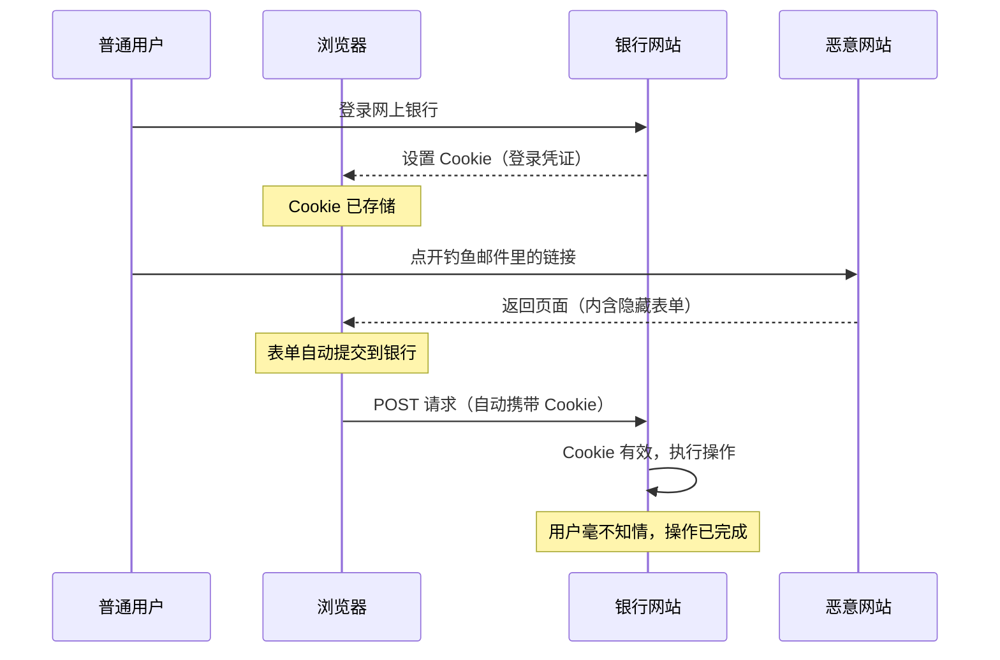
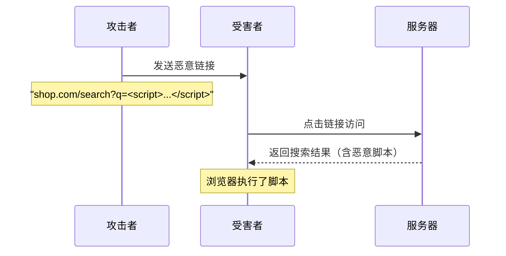
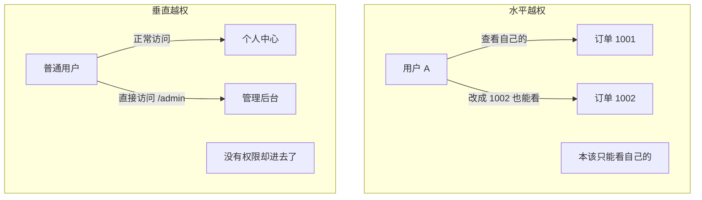
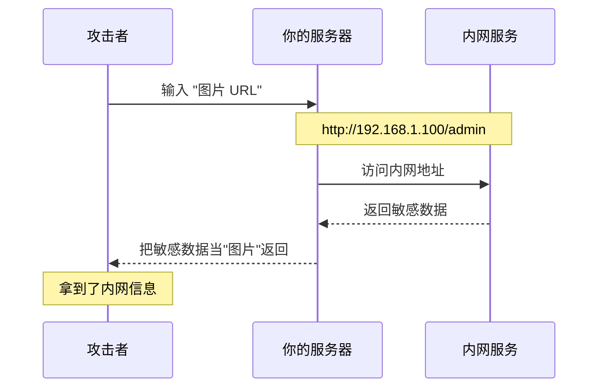
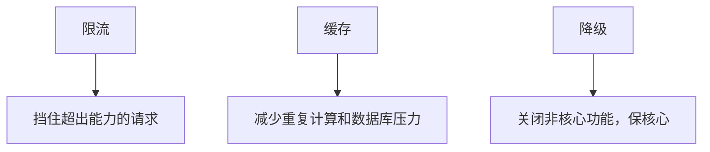

> 周五下午上线，周一早上数据库被清空——这是我一个朋友的真实故事。你可能会想，他妈的，这哥们是不是把密码设成 123456 了？不是。他只是没想过，自己写的每一个接口都可能是一扇没锁的门。

事情是这样的。

他在一个小电商公司做后端。Node.js，Express，MySQL。业务不复杂，就是用户下单、查订单、收货地址这些。他觉得自己写得挺好——该有的功能都有，该查的 bug 都查了。上线那天他还在群里发了个表情包，说"稳如老狗"。

然后周一早上，客服告诉他：几百个用户的订单全部被转到了同一个陌生地址。

他查了半天日志，最后发现攻击者做的事情极其简单：先注册一个账号，正常下单，然后把自己的订单 ID 从 `10086` 改成 `10085`，看看能不能看到别人的订单。能。再改一个，还能。于是写了个脚本，从 `10001` 遍历到 `20000`，把所有人的订单详情都看了一遍，挑了些值钱的，把收货地址全改成了自己的。

没有SQL注入，没有XSS，没有任何高深的技术。就是把 URL 里的一个数字改了一下。

他坐在工位上，盯着屏幕，满脑子只有两个字：**卧槽**。

这件事之后我开始认真研究 Web 安全。我发现大部分安全漏洞都不是什么神秘的黑客技术——它们更像是你家的门窗。你以为关了，其实有一扇忘了锁。这篇文章就是我踩过和看见过的所有坑，用最直白的方式讲给你听。不是什么安全专家的布道，就是一个写后端的人，跟你聊聊他学到的东西。

---

## 一、CSRF：别人替你刷卡的瞬间

### 你先想象一个场景

你去商场买东西，刷了信用卡。卡还揣在你兜里。这时候有人在另一个柜台拿起POS机，对着空气"滴"了一下——然后你卡里少了一笔钱。

你会说，扯淡吧，卡在我身上他怎么刷？

但在浏览器里，这事儿每天都在发生。

你登录了银行网站，浏览器里存了银行的 Cookie——这等于你的"信用卡"被浏览器握在手里。然后你在另一个标签页打开了一封邮件里的链接——那个链接指向攻击者的网站。攻击者的网站里藏了一个看不见的表单，这个表单向银行发起转账请求。浏览器一看，"哦，要给银行发请求是吧"，自动把你的 Cookie 贴上去。银行那边收到请求，一看 Cookie 是合法的，就执行了转账。

你全程不知道发生了什么。你甚至没在那个恶意页面里填任何东西。

这就是 CSRF，Cross-Site Request Forgery，跨站请求伪造。名字听着唬人，翻译过来就一句话：**别人借你的身份帮你做了一件事。**

### 攻击长什么样

咱们用大白话走一遍流程：

1. 你登录了 shop.com，浏览器拿到了 shop.com 的 session cookie
2. 攻击者给你发了封邮件："恭喜你获得 100 元优惠券，点此领取"
3. 你点了链接，跳到一个页面，上面写着"优惠券已过期"
4. 但这个页面里藏了一个自动提交的表单，目标地址是 shop.com/change-address
5. 浏览器一看目标是 shop.com，自动带上了你的 cookie
6. shop.com 收到请求，验证 cookie 有效，把收货地址改成了攻击者的
7. 你之后下的所有订单，全寄到攻击者那里去了

恶心在哪？在于攻击者从头到尾没有拿过你的密码，没有登录你的账号，甚至没有跟你产生过任何"交互"——你自己帮他把事儿办了，只是你不知道。



### 它不解决什么

CSRF 防护只解决一个问题：**别人不能假借你的身份发起请求。** 它不防止自己主动被骗（比如你在真的页面里手动输入了攻击者的地址）、不防止 XSS（后面会讲）、也不防止密码泄露。它就是专门管"浏览器自动带 Cookie 发请求"这种场景的。

### 怎么防

有三个方案，推荐混着用。

**方案一：SameSite Cookie**

这是浏览器原生提供的机制。你在设置 Cookie 的时候加一个 `SameSite` 属性，浏览器就会判断：这个请求是不是从同一个站点发起的？不是？那我不带这个 Cookie。

```javascript
res.cookie('session', userSessionId, {
  httpOnly: true, // js 读不到，防 XSS 偷 cookie
  secure: true, // 只走 HTTPS
  sameSite: 'strict', // 完全禁止跨站携带
})
```

`Strict` 是最严格的——连你从邮件里点银行链接都带不上 cookie，所以点进去是未登录状态，得重新登录。用户体验差了点，但最安全。

`Lax` 是个折中：GET 请求（比如点链接）会带 cookie，POST（比如表单提交）不带。大部分攻击用的是 POST，所以 `Lax` 已经能挡住绝大多数 CSRF 了。

`None` 是不限制，但必须配合 HTTPS。除非你真的需要跨站使用（比如嵌入式支付），否则别用。

**方案二：CSRF Token**

思路很简单：每次渲染表单的时候，后端生成一个随机字符串塞到表单的一个隐藏字段里，同时把这个字符串存到 session 里。表单提交上来，后端对比一下：表单里的 token 和 session 里的一样不一样？不一样就拒绝。

```javascript
// 生成 token
app.get('/transfer', (req, res) => {
  const csrfToken = crypto.randomBytes(32).toString('hex')
  req.session.csrfToken = csrfToken
  res.render('transfer', { csrfToken })
})
```

```html
<form action="/transfer" method="POST">
  <input type="hidden" name="csrfToken" value="{{csrfToken}}" />
  <input type="text" name="amount" />
  <button type="submit">转账</button>
</form>
```

```javascript
// 验证 token
app.post('/transfer', (req, res) => {
  if (req.body.csrfToken !== req.session.csrfToken) {
    return res.status(403).json({ error: 'CSRF 验证失败' })
  }
  // 继续业务逻辑
})
```

攻击者随便怎么构造表单，他拿不到这个 token——因为它每次都不一样，而且存在你的 session 里，攻击者的脚本读不到。

**方案三：双重提交 Cookie**

这个方案不需要在服务端存储 token。思路是：前端 JavaScript 去读 Cookie 里的一个值，然后把它放进请求的 Header 里。后端验证：Cookie 里的值和 Header 里的值是不是一样的？因为跨站请求虽然能带 Cookie，但不能自定义 Header，所以攻击者没法伪造。

```javascript
const csrfProtection = (req, res, next) => {
  const cookieToken = req.cookies['csrf-token']
  const headerToken = req.headers['x-csrf-token']
  if (!cookieToken || !headerToken || cookieToken !== headerToken) {
    return res.status(403).json({ error: 'CSRF 验证失败' })
  }
  next()
}
```

### 我的推荐

SameSite: Lax 兜底（浏览器自动防护），敏感操作加 CSRF Token（转账、改密码、删账号）。如果你用 Next.js 或 Laravel，它们内置了很多 CSRF 防护，别自己从头造轮子。

---

## 二、XSS：你看到的页面，可能是别人写的

### 什么叫"页面可能是别人写的"

你打开一个网站，看了篇文章，顺手翻了下评论。

你看到的评论是一段文字。但存进数据库的，可能是这样：

```html
这篇文章写得真好！ 
```

数据库中规中矩地存着。有人打开这篇文章，服务器把评论连同文章一起返回。浏览器渲染页面的时候，解析到 `` 标签，发现图片路径是 `x`，加载失败，于是触发 `onerror` 里的代码——把用户的 cookie 发给攻击者的服务器。

你什么都没点，什么都没填，cookie 就出去了。

这就是 XSS，Cross-Site Scripting。攻击者把恶意脚本注入到一个被信任的页面里，让它在其他用户的浏览器里执行。

### XSS 的三种形态

XSS 不是一种攻击，是三种。它们攻击的路径不一样，但目的都一样：让别人的代码在你的页面里跑。

**反射型 XSS：一击脱离**

恶意代码在 URL 参数里。比如搜索功能，你搜"iPhone"，页面显示"您搜索的关键词是：iPhone"。如果服务器直接把搜索词拼进 HTML 里没有转义：

```
https://shop.com/search?q=<script>alert('XSS')</script>
```

有人点了这个链接，页面显示"您搜索的关键词是："，然后执行了那段 script。通常攻击者会把这个链接缩短、包装一下，发到群里或者邮件里。

他妈的，这种攻击看起来需要受害者点链接，好像成功率不高——但钓鱼邮件本来就不需要所有人点，一百个人里有一个人点就够了。



**存储型 XSS：毒进入水源**

这个最危险。恶意代码被存进了数据库，任何人访问这个页面都会中招。

场景太多了：评论区、用户签名、昵称、文章内容、上传文件名——只要是从用户那里来、又在页面里展示的内容，都有可能。

你想象一下：一个论坛帖子，正文下面有个看起来很正常的评论。但是评论内容里嵌了一段脚本。服务器每次渲染这个帖子的时候都会把评论连同脚本一起吐出来。每一个打开这个帖子的人都中招。

这他妈的不是一次性攻击，这是持续性的。只要没人发现这个评论有问题，它就一直生效。攻击者可能在凌晨偷偷发了一条评论，接下来的几个月里，几万个用户的 cookie、个人信息、操作历史都在源源不断地流到他的服务器上。

**DOM 型 XSS：纯前端的坑**

这种和后端没关系，纯粹是前端 JavaScript 写的烂。

```javascript
const params = new URLSearchParams(window.location.search)
const name = params.get('name')
document.getElementById('welcome').innerHTML = '欢迎，' + name
```

攻击者构造 `https://example.com?name=`，用户打开，JS 把恶意字符串用 `innerHTML` 塞进页面，浏览器解析 HTML 时执行了脚本。

这个代码看起来是不是特别常见？很多老项目的欢迎页就是这么写的。卧槽。

### XSS 能干什么

很多人觉得"弹个 alert 框有什么大不了的"。听听这个：

1. 偷 Cookie，冒充你登录
2. 记录你敲的键盘（密码、卡号、身份证号）
3. 修改页面内容——比如把转账按钮替换成"充值"按钮，钱打到攻击者账号
4. 在页面里嵌入挖矿脚本，用你的 CPU 挖币
5. 自动转发——用你的账号给你的好友群发钓鱼链接

XSS 是 Web 安全的"万恶之源"——因为它拿到的是浏览器里所有的权限。Cookie、localStorage、当前页面内容、用户一切操作，全都能碰。

### 怎么防

**核心原则：永远不要直接拼用户输入的东西进 HTML。**

```javascript
// 错的——直接拼
element.innerHTML = userInput

// 对的——用 textContent
element.textContent = userInput

// 如果非要用 innerHTML，先转义
function escapeHtml(text) {
  const div = document.createElement('div')
  div.textContent = text
  return div.innerHTML
}
element.innerHTML = escapeHtml(userInput)
```

**后端用 xss 库过滤：**

```javascript
import xss from 'xss'

const clean = xss(userInput, {
  whiteList: {
    p: ['class'],
    strong: [],
    em: [],
    a: ['href', 'title'],
  },
})
```

白名单的意思是：只允许这些标签和属性通过，其他的全部删掉。比黑名单靠谱——你不知道攻击者明天会发明什么新标签。

**设置 CSP（内容安全策略）：**

这是浏览器提供的最后一道防线。通过 HTTP 头告诉浏览器：这个页面只允许加载来自哪些源头的脚本。

```javascript
import helmet from 'helmet'

app.use(
  helmet.contentSecurityPolicy({
    directives: {
      defaultSrc: ["'self'"],
      scriptSrc: ["'self'"],
      styleSrc: ["'self'"],
      imgSrc: ["'self'", 'https:'],
      objectSrc: ["'none'"],
      frameSrc: ["'none'"],
    },
  }),
)
```

设置了 CSP 之后，即使攻击者成功把脚本嵌入了页面，浏览器也不执行——因为脚本不在白名单里。这是个兜底方案，不是替代转义和过滤的。

### 它不解决什么

XSS 防护只防止恶意代码在浏览器里执行。它不管你的密码是不是太弱，不管你的服务器有没有打补丁，也不管用户是否被社会工程学攻击骗了。它只管一件事：别人不能在你的页面里跑他的 JS。

---

## 三、越权：你手里那把钥匙，能开几扇门

### 一个真实到让你难受的场景

你的学校有学生系统。登录进去，可以看到自己的成绩。

URL 长这样：

```
https://school.edu/score?studentId=20240001
```

你看着这个 URL，脑子里冒出一个念头：如果把 `20240001` 改成 `20240002`，会怎样？

你试了一下。页面上显示了另一个同学的成绩。

你再改成 `20240003`，又看到了另一个人的。

你心跳加速。你没有"黑"进系统，没有破解密码，没有装任何工具。你只是在 URL 里改了一个数字。

这就是越权——系统相信前端传来的用户标识，而没有从 session 里确认"你到底是谁"。

### 两种越权

**水平越权：看同级别用户的东西。**

你和其他用户是同级权限，按理说你只能看自己的数据。但因为系统没有验证"这条数据是不是你的"，你通过改 ID 就能看别人的。就是刚才那个成绩查询的场景。

**垂直越权：访问你没权限的功能。**

你是普通用户，但你试了一下直接访问 `/admin/dashboard`，居然进去了。系统只在菜单上藏了"管理后台"的入口，但后端接口根本没做权限校验。攻击者不需要看到那个按钮——他只用浏览器开发者工具就够了。



### 为什么这很难靠"安全测试"发现

因为开发者和测试者默认是"正常使用"的——登录、查自己数据、退出。谁会在测试的时候把 URL 里的 ID 改成别人的？没有人。

但攻击者会的。他拿到你的应用，第一件事就是注册一个账号，然后开始改 ID、改参数、改请求方法，看哪些东西能被碰到。

### 怎么防

**第一条铁律：从 session 拿当前用户，永远不要信前端传来的用户标识。**

```javascript
// 错的——直接用了 URL 里的 userId
app.get('/order/:orderId', async (req, res) => {
  const order = await db.order.findById(req.params.orderId)
  res.json(order) // 任何人都能看任意订单
})

// 对的——先确认订单是不是当前用户的
app.get('/order/:orderId', async (req, res) => {
  const currentUser = req.session.userId
  const order = await db.order.findById(req.params.orderId)

  if (order.userId !== currentUser) {
    return res.status(403).json({ error: '无权访问' })
  }

  res.json(order)
})
```

**用 UUID 代替自增 ID。**

自增 ID 太容易猜了。1001，1002，1003……写个循环就遍历完了。UUID 是长这样：

```
a1b2c3d4-e5f6-7890-abcd-ef1234567890
```

你遍历一百万年也猜不出下一个是什么。但注意：UUID 只是**增加了猜测难度**，不是替代权限校验。权限校验才是真正的防线。UUID 是让攻击者"不知道该猜什么"，权限校验是"猜到了也不给你看"。

**全局权限中间件：**

```javascript
function requireAuth(allowedRoles = []) {
  return async (req, res, next) => {
    if (!req.session.userId) {
      return res.status(401).json({ error: '请先登录' })
    }

    const user = await db.user.findById(req.session.userId)

    if (allowedRoles.length > 0 && !allowedRoles.includes(user.role)) {
      return res.status(403).json({ error: '无权限' })
    }

    req.user = user
    next()
  }
}

// 只有 admin 能访问
app.get('/admin/dashboard', requireAuth(['admin']), (req, res) => {
  res.json({ message: '后台' })
})
```

### 它不解决什么

权限校验只管"你能不能看/改这个资源"。它不管这个请求是不是 CSRF（那是 SameSite、CSRF Token 的活），也不管这个请求里有没有 XSS 注入（那是输出转义和 CSP 的活）。安全是层层叠加的，没有哪一层能覆盖全部。

---

## 四、SSRF：你的服务器成了别人的跳板

### 先讲个让你后背发凉的东西

云服务器（阿里云、AWS、腾讯云）都运行着一个叫做"元数据服务"的东西。地址是固定的：`169.254.169.254`。这个服务不是给外面用的，是给虚拟机内部读取信息的——比如这台机器的密钥、实例 ID、网络配置。

正常情况下，外网访问不到这个地址。但如果你服务器上有个"网页截图"的功能——用户输入一个 URL，服务器去访问那个 URL，截图，返回——那攻击者就可以输入：

```
http://169.254.169.254/latest/meta-data/
```

你的服务器乖乖地去访问了元数据服务，拿到了密钥信息，截图，返回给了攻击者。

卧槽。你的服务器帮攻击者打开了一扇内网的门。

这就是 SSRF，Server-Side Request Forgery，服务器端请求伪造。**你服务器去请求的地方，可能是攻击者想去但去不了的地方。**

### 攻击长什么样

正常人用你的图片下载功能：输入 `https://cdn.example.com/photo.jpg`，服务器下载，保存。

攻击者用你的图片下载功能：输入 `http://192.168.1.1:8080/admin`，服务器访问了你的内网管理后台，把页面内容当"图片"返回给了攻击者。



### 哪些功能容易中招

- 网页截图（Puppeteer 抓页面转图片）
- 图片下载/缩略图生成
- Webhook 回调——用户填一个 URL，你事后发 POST
- 文件导入——比如"从 URL 导入数据"
- API 代理——原样转发用户的请求

这些功能有一个共同点：**用户控制了一个 URL，服务器去请求这个 URL。** 你想到什么？只要能控制 URL，攻击者就控制了服务器去访问谁。

### 真实攻击案例

**读云服务密钥：**

```
http://your-app.com/fetch?url=http://169.254.169.254/latest/meta-data/iam/security-credentials/
```

拿到了 IAM 凭证，攻击者等于拿到了你整个云账号的操作权限。

**探测内网端口：**

```
http://your-app.com/fetch?url=http://10.0.1.5:3306/
```

MySQL 返回 `Host 'xxx' is not allowed`；Redis 返回 `-NOAUTH Authentication required`。用返回内容就能判断内网跑了什么服务，开了哪些端口。

**读本地文件：**

```
http://your-app.com/fetch?url=file:///etc/passwd
```

如果你的 HTTP 客户端没有禁用 `file://` 协议，直接读系统文件。

### 怎么防

**方案一：禁止内网 IP**

```javascript
import dns from 'node:dns/promises'
import { isInternal } from 'is-internal-ip'

app.post('/fetch', async (req, res) => {
  const { url } = req.body
  const urlObj = new URL(url)

  // 拦截 localhost 和 .local
  if (urlObj.hostname === 'localhost' || urlObj.hostname.endsWith('.local')) {
    return res.status(400).json({ error: '禁止访问本地资源' })
  }

  // DNS 解析后检查 IP 是否内网
  const records = await dns.lookup(urlObj.hostname, { all: true })
  for (const record of records) {
    if (await isInternal(record.address)) {
      return res.status(400).json({ error: '禁止访问内网资源' })
    }
  }

  const response = await fetch(url)
  const buffer = await response.arrayBuffer()
  res.send(Buffer.from(buffer))
})
```

注意：光看 hostname 不够，必须做 DNS 解析后检查 IP。因为有人可以用域名绑定内网 IP。你看到的域名是 `nice-pic.com`，解析出来是 `10.0.0.1`——看起来像外部域名，实际上指向内网。

**方案二：白名单域名**

如果你只需要从固定的几个域名下载图片，那就直接限制死：

```javascript
const ALLOWED_DOMAINS = ['cdn.myapp.com', 'img.myapp.com']

const urlObj = new URL(url)
if (!ALLOWED_DOMAINS.includes(urlObj.hostname)) {
  return res.status(400).json({ error: '只允许指定域名' })
}
```

**方案三：禁用危险协议**

```javascript
// 只允许 http 和 https
if (!url.startsWith('http://') && !url.startsWith('https://')) {
  return res.status(400).json({ error: '仅支持 http/https' })
}

// 禁止常见高危端口
const dangerousPorts = [22, 25, 3306, 5432, 6379, 27017]
const port = urlObj.port || (urlObj.protocol === 'https:' ? '443' : '80')
if (dangerousPorts.includes(parseInt(port))) {
  return res.status(400).json({ error: '禁止访问该端口' })
}
```

### 它不解决什么

SSRF 防护只管服务器发起的请求不会打到内网。它不防止用户直接请求这些地址（那是防火墙的事），也不防止其他类型的注入（XSS、SQL 注入等）。它就是专门看好"你的服务器替用户发出去的这个请求"的。

---

## 五、其他不能忽视的小东西

CSRF、XSS、越权、SSRF——这四个是大头。但还有一些看起来小、搞起来也能要命的。我一块说了。

### 5.1 开放式重定向：你以为跳到了真网站

很多网站登录页带一个 `redirect` 参数：

```
https://shop.com/login?redirect=/cart
```

登录后自动跳到购物车，没毛病。但如果你不改的话：

```
https://shop.com/login?redirect=http://evil-fake-shop.com/login
```

用户点的是 shop.com 的链接，登录后跳到了一个假网站。假网站长得跟 shope.com 一模一样，用户输入账号密码——攻击者拿到了。

```javascript
// 白名单验证
const ALLOWED_HOSTS = ['shop.example.com', 'app.example.com']

app.get('/login', (req, res) => {
  const redirectUrl = req.query.redirect
  if (!redirectUrl || !ALLOWED_HOSTS.includes(new URL(redirectUrl).hostname)) {
    return res.redirect('/dashboard')
  }
  res.redirect(redirectUrl)
})
```

最简单的原则：只允许相对路径的跳转，或者严格的白名单域名。

### 5.2 HPP：一个参数，两份结果

```
GET /search?q=apple&q=banana
```

不同框架对重复参数的处理不一样。PHP 取最后一个，ASP.NET 拼成 `apple,banana`，Express 取最后一个。这有什么问题？

假设你前面有一个安全过滤插件只检查了第一个 `q` 参数（`apple`，正常），但后面的业务逻辑用的是第二个 `q`（`banana`，恶意）。检查通过了，攻击也生效了。

```javascript
import hpp from 'hpp'
app.use(hpp({ allow: ['tags'] })) // 只允许指定的参数重复
```

### 5.3 依赖漏洞：你的代码里可能藏着一个"别人"

npm 生态有几百万个包。你 npm install 一下，可能是 50 个直接依赖，但连带安装了几百个子依赖。这里面任何一个包出了安全问题，你的项目就等于有一个没关的门。

2018 年有个事件：攻击者向 npm 包 `event-stream` 里注入了恶意代码，专门偷比特币钱包的私钥。`event-stream` 每周有几百万下载量。很多人连自己装了它都不知道——因为它是某个大包的依赖的依赖。

怎么办：

```bash
npm audit              # 查已知漏洞
npm audit fix          # 自动修（能修的话）
```

在 CI 里也加一道：

```yaml
# .github/workflows/security.yml
name: Security Audit
on: [push, pull_request]
jobs:
  audit:
    runs-on: ubuntu-latest
    steps:
      - uses: actions/checkout@v4
      - uses: actions/setup-node@v4
        with: { node-version: '20' }
      - run: npm ci
      - run: npm audit --audit-level=high
```

另外，用 `package-lock.json` 锁死版本，别让依赖偷偷升级到带后门的版本。核心依赖可以考虑 fork 到自己的仓库。

### 5.4 目录遍历：用 `../` 爬到不该去的地方

```javascript
// 隐患代码
app.get('/download', (req, res) => {
  res.sendFile(__dirname + '/files/' + req.query.file)
})
```

攻击者输入：

```
GET /download?file=../../../etc/passwd
```

服务器实际读的是 `/var/www/app/files/../../../etc/passwd`，等价于 `/etc/passwd`。

修复：规范化路径，检查最终路径是否在允许的目录内。

```javascript
import path from 'node:path'
import fs from 'node:fs'

app.get('/download', (req, res) => {
  const baseDir = path.join(__dirname, 'files')
  const filePath = path.normalize(path.join(baseDir, req.query.file))

  if (!filePath.startsWith(baseDir)) {
    return res.status(403).json({ error: '非法路径' })
  }

  if (!fs.existsSync(filePath) || !fs.statSync(filePath).isFile()) {
    return res.status(404).json({ error: '文件不存在' })
  }

  res.sendFile(filePath)
})
```

### 5.5 SQL 注入：虽然大家都在用 ORM

用 ORM 能挡住大部分 SQL 注入，但你总有写原生 SQL 的时候（复杂报表、性能优化）。这时候：

```javascript
// 错的——拼接字符串
const sql = `SELECT * FROM users WHERE name = '${username}'`
// 用户输入 ' OR '1'='1，实际执行：
// SELECT * FROM users WHERE name = '' OR '1'='1'
// 返回所有用户！

// 对的——参数化
const sql = 'SELECT * FROM users WHERE name = ?'
db.query(sql, [username])
```

ORM 不是万能药。你依然可能在 `orderBy`、`groupBy` 这些需要拼接字段名的地方搞出注入。永远对用户输入保持警惕。

---

## 六、限流：不是所有人都想好好用你的网站

### 场景

你的 API 正常运行，QPS 大概一百多。突然有一天，服务器 CPU 飙到 100%，数据库连接池耗尽，所有请求超时。

你翻日志一看——某个 IP 一秒钟发了一万个请求。全是同一个接口。

不是 DDoS，就是一个竞争对手或者无聊的人在扫你的接口。他用脚本发的。

你的服务器没有做任何限制，老老实实地处理每一个请求，直到扛不住。

限流就是管这个的。它不做复杂的逻辑判断，就是数数：你这段时间发了多少个请求？超过上限就别发了。

### 四种限流策略

**固定窗口计数器**

最简单。定一个时间窗口（比如 1 分钟），窗口内最多允许 N 个请求。超过就拒绝。

但有个问题叫"边界突刺"：在 0:59 秒发 100 个，在 1:00 秒发 100 个，虽然是两分钟，但实际上在 1 秒内处理了 200 个。

```javascript
import rateLimit from 'express-rate-limit'

const limiter = rateLimit({
  windowMs: 60 * 1000,
  max: 100,
  standardHeaders: true,
  keyGenerator: (req) => req.ip,
})
app.use('/api', limiter)
```

**滑动窗口计数器**

把时间窗口切成多个小段，计算加权平均。别管实现细节，你记住：它比固定窗口平滑，没有边界突刺，但实现复杂一些。

```javascript
class SlidingWindowRateLimiter {
  constructor(windowMs, maxRequests) {
    this.windowMs = windowMs
    this.maxRequests = maxRequests
    this.requests = new Map()
  }

  isAllowed(ip) {
    const now = Date.now()
    const windowStart = now - this.windowMs
    const timestamps = (this.requests.get(ip) || []).filter((t) => t > windowStart)
    this.requests.set(ip, timestamps)

    if (timestamps.length >= this.maxRequests) {
      return { allowed: false, remaining: 0 }
    }

    timestamps.push(now)
    return { allowed: true, remaining: this.maxRequests - timestamps.length }
  }
}
```

**漏桶算法**

想象一个底部有个小洞的水桶。请求从上面倒进去，水从下面以固定速率流出。水满到顶了，新倒进来的水直接溢出——也就是被拒绝。

这玩意适合需要"匀速处理"的场景，比如消息队列消费。但它没法处理"突发流量"——就算桶是空的，流出的速度也是固定的。

```javascript
class LeakyBucket {
  constructor(capacity, leakRatePerSecond) {
    this.capacity = capacity
    this.water = 0
    this.leakRate = leakRatePerSecond
    this.lastLeakTime = Date.now()
  }

  drop() {
    this.leak()
    if (this.water < this.capacity) {
      this.water++
      return true
    }
    return false
  }

  leak() {
    const elapsed = (Date.now() - this.lastLeakTime) / 1000
    this.water = Math.max(0, this.water - elapsed * this.leakRate)
    this.lastLeakTime = Date.now()
  }
}
```

**令牌桶算法**

这是我个人最喜欢的。桶里放令牌，令牌按固定速率生成（最多积攒到桶容量）。请求来了必须拿走一个令牌。没令牌了？拒绝。

令牌桶有个特别好的特性：支持突发流量。比如桶能装 100 个令牌，平常没什么请求的时候令牌会慢慢攒起来。突然来了一波请求，可以一口气消耗掉积攒的令牌——不会被直接拒绝。

```javascript
class TokenBucket {
  constructor(capacity, refillRatePerSecond) {
    this.capacity = capacity
    this.tokens = capacity
    this.refillRate = refillRatePerSecond
    this.lastRefillTime = Date.now()
  }

  take() {
    this.refill()
    if (this.tokens >= 1) {
      this.tokens--
      return true
    }
    return false
  }

  refill() {
    const elapsed = (Date.now() - this.lastRefillTime) / 1000
    this.tokens = Math.min(this.capacity, this.tokens + elapsed * this.refillRate)
    this.lastRefillTime = Date.now()
  }
}
```

### 分布式限流

前面的都是在单台服务器上计数。如果你有 10 台服务器，每台限 1000 QPS，那总共就是 10000 QPS——可能还是把数据库打死了。

需要用一个中心化的计数器，通常是 Redis：

```javascript
import Redis from 'ioredis'
const redis = new Redis(process.env.REDIS_URL)

async function slidingWindowLimit(key, windowMs, maxRequests) {
  const now = Date.now()
  const windowStart = now - windowMs

  const multi = redis.multi()
  multi.zremrangebyscore(key, 0, windowStart)
  multi.zadd(key, now, `${now}-${Math.random()}`)
  multi.zcard(key)
  multi.expire(key, Math.ceil(windowMs / 1000))

  const results = await multi.exec()
  const count = results[2][1]
  return { allowed: count <= maxRequests, remaining: Math.max(0, maxRequests - count) }
}
```

用 Redis 的有序集合（ZSET），每个请求的时间戳作为 score，窗口外的老数据自动删掉，窗口内计数。

### 四种算法怎么选

| 算法     | 要什么   | 怕什么       | 用在哪儿             |
| -------- | -------- | ------------ | -------------------- |
| 固定窗口 | 简单     | 边界突刺     | 不太敏感的接口       |
| 滑动窗口 | 精准     | 实现复杂一点 | API 限流             |
| 漏桶     | 流量光滑 | 无法处理突发 | 消息队列消费         |
| 令牌桶   | 支持突发 | 实现稍复杂   | 大部分场景的最佳选择 |

大部分情况下令牌桶就够了。简单又灵活。

### 它不解决什么

限流只管"请求太多"的问题。它不管请求是不是恶意的（只管频率不管内容），不管你是不是被 DDoS 了（DDoS 的流量可能在网络层就被堵住了），也不管你的代码有没有逻辑 Bug。它就是一个流量控制阀，别把它当防火墙。

---

## 七、限流、缓存、降级：保护系统的三条路

这三个东西总被放在一起说。它们各自独立，但配合起来才能让系统在高压下不崩。

**限流**挡在前面，把超出能力的请求拒掉。就像一个酒吧门口的保安——里面满了，你就得在外面等着。

**缓存**挡在数据库前面。大部分请求查的是同一批数据，干嘛每次都去数据库重新算一遍？用 Redis 或者内存缓存把热门数据兜住，90% 的请求在缓存层就消掉了。

**降级**是在实在扛不住的时候关掉一些不紧急的功能。比如大促期间，暂时关闭"查看历史订单"这种非核心功能，把资源全部腾给下单和支付。



这三者有个递进关系：先有限流稳住整体压力，再用缓存消化大部分常读请求，最后实在不行了就降级——牺牲体验但保证不崩。

---

## 八、最后，给你一套问题

我不打算总结。安全不是背 checklist 的事——真正的安全感来自每次写代码时脑子里自动响起的那句"等一下，这里会不会出问题"。

所以我给你几个问题，你以后每次写完一个接口，问自己：

1. **这个请求谁能发？** 有没有做登录校验？有没有做权限校验？
2. **这个请求里的 user ID / order ID 是我从 session 里拿的，还是从前端传上来的？** 如果是前端传来的，改了它怎么办？
3. **这个接口返回的数据里，有没有用户输入的内容？** 如果有，做了转义没有？
4. **这个接口有没有让服务器去访问用户提供的 URL？** 如果有，做了 SSRF 防护没有？
5. **这个接口有没有创建、修改、删除操作？** 如果是 GET 请求干了这个，改成 POST/PUT/DELETE，而且检查 CSRF。
6. **刚才 npm install 的包，你看了一眼没？** 至少跑一遍 `npm audit`。

这几个问题问完，大部分坑就避开了。剩下的，靠经验和持续关注。

安全的本质不是"不被攻击"，而是**每加一个功能就多想一步，让攻击者的成本变高**。你不需要造一个打不开的保险柜——你只需要比旁边的保险柜更难开。

他妈的，写到这里天都黑了。最后送你一句话：你写的每行代码，都有人在用扫描器盯着它。

多一分警惕，少一分后悔。
