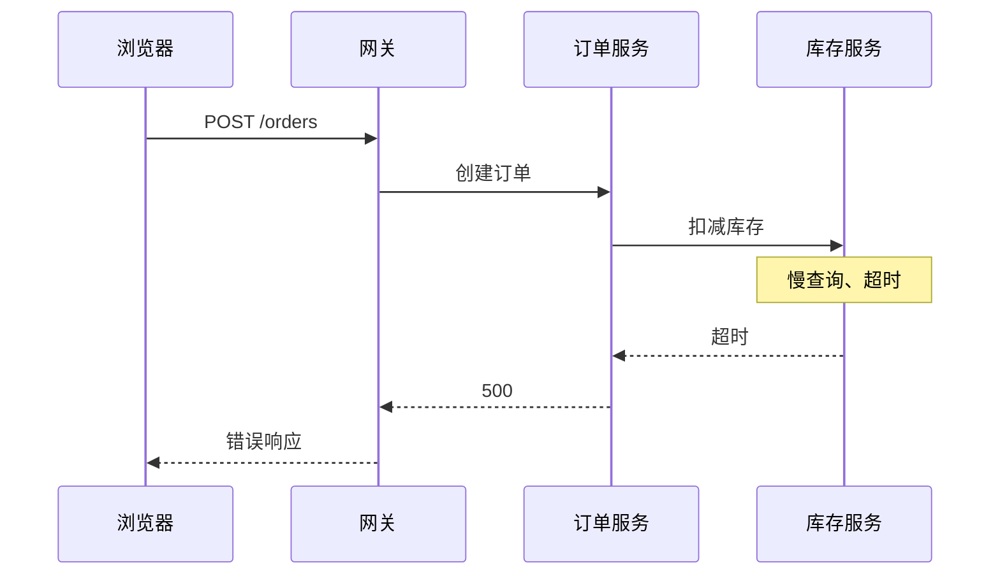

## 可观测性是什么

可观测性（observability）来自控制理论：如果一个系统能够根据外部输出推断内部状态，就称它是可观测的。软件系统中的外部输出是遥测数据，即日志（logs）、指标（metrics）和链路（traces）。一个服务是否可观测，取决于故障发生时能否只依靠已有数据回答“系统内部发生了什么”，而不是重新部署代码、追加日志、等待故障再次出现。

对软件系统来说，“内部状态”并不抽象：某个请求正停留在哪个队列、某次数据库查询为什么慢、某条消息为什么被重试了三次、某个新版本是否带入了回归。可观测的系统能在故障时用已有数据回答这类问题；做不到，就只能复现、加日志、等下次。

遥测数据可以回答三类不同的问题，成本和粒度也完全不同：

| 信号 | 回答的问题           | 数据粒度             | 典型成本与保留期       |
| ---- | -------------------- | -------------------- | ---------------------- |
| 日志 | 某个时刻发生了什么   | 每条事件一条记录     | 量最大，通常保留期最短 |
| 指标 | 系统整体表现如何     | 聚合后的时间序列     | 最便宜，通常保留期最长 |
| 链路 | 一次请求完整经过什么 | 按请求组织的 Span 树 | 量适中，通常需要采样   |

三句话可以概括：日志给细节，指标给全景，链路给因果。单独使用都有盲区：日志不知道请求从哪里来，指标不知道个体经历了什么，链路不知道业务上下文。组合起来，三类信号才能还原一次故障的完整画面。

用一次下单请求举例：日志是“10:00:01.234 创建订单失败，库存服务超时”；指标是“错误率 0.3%、P99 延迟 800ms”；链路是“网关 → 订单服务 → 库存服务 → 数据库”，每一步带耗时。三类数据对同一件事的描述粒度不同，拼在一起才是完整事件。

“已有数据”是定义里的关键词。监控的前提是事先知道要关注什么：CPU 使用率、错误率、队列长度。可观测性的前提是数据本身保留足够的上下文，让开发者能在问题发生时提出事先没有预设的问题：某个请求为什么慢、为什么走了这条分支、为什么只有特定用户失败。

### 监控与可观测性的区别

| 维度       | 监控                           | 可观测性                                   |
| ---------- | ------------------------------ | ------------------------------------------ |
| 回答的问题 | 系统是否正常                   | 系统为什么异常                             |
| 数据来源   | 预定义的指标与告警             | 保留上下文的日志、指标、链路               |
| 适用场景   | 已知风险：容量、可用性、错误率 | 未知问题：偶发慢请求、跨服务故障、异常数据 |
| 典型动作   | 阈值告警、仪表盘               | 沿链路下钻、关联数据、事后分析             |

监控与可观测性不是替代关系。监控在系统越界时发出信号，可观测性在信号出现后定位原因。没有监控，故障可能等到用户投诉才发现；没有可观测性，告警只能说明“出事了”，不能说明“哪里出事、为什么”。

从组织视角看，监控回答的是“系统是否可用”，由值班与告警体系消费；可观测性回答的是“系统为什么这样”，由开发者在排障时消费。两者服务不同角色，这也是它们长期并存而不是互相取代的原因。

可观测性也不排斥监控，它让监控变得更聪明：基于链路数据定义错误率，可以区分业务错误与系统错误；基于 SLO 与错误预算，告警从“数字越线”变成“用户体验受影响”。监控仍然负责发出信号，只是信号的质量依赖底层数据的完整程度。

可以把问题分成两类。已知的未知（known unknowns）是可以预先枚举的风险：磁盘会满、内存会泄漏、错误率会上升，监控为它们设置阈值。未知的未知（unknown unknowns）是事先无法列举的问题：一次缓存击穿让特定用户群变慢、某个新版本改变了请求路由、模型在特定输入下进入错误分支。这类问题无法预设告警，只能依靠保留上下文的原始数据事后提问。

阈值告警的困境在于：阈值设得低，误报多，团队产生告警疲劳，真正的故障被淹没在噪音里；阈值设得高，故障表现为渐变而不是突变，等数字越线时影响已经扩散。更本质的问题是故障形态不会重复，预设的阈值永远落后于新出现的问题。可观测性的价值恰恰体现在这里：不预设问题，而是保证数据能回答任何问题。

可观测性也不同于调试。调试依赖复现：拿到同样的输入，在本地或测试环境里逐步断点，找到代码路径。分布式系统里，很多故障由流量特征、数据分布、时序竞争触发，无法稳定复现。可观测性不要求复现，它直接在产生问题的环境里用数据提问：数据足够完整，问题就能在线上回答。

## 为什么传统手段不够用

### 组件变多，因果关系被拆散

单体应用时代，一次请求在一个进程内完成，日志按时间顺序就能还原全过程；进程内还有调用栈，可以看清每一步的调用关系。服务拆分后，一次请求要穿过网关、多个服务、消息队列和数据库。每个组件各自记日志、各自上报指标，数据之间没有共同标识，无法回答“这次请求到底经历了什么”。

分布式系统里连时间都不是天然对齐的。各主机的时钟可能相差几秒，日志时间戳只表示“本地时间”，跨主机按时间排序会把因果顺序排错。链路数据不依赖时钟对齐：父子关系由传播的上下文决定，时间只是展示用。这是关联标识比时间戳更可靠的原因。

下面是一个常见场景：



浏览器收到“创建订单失败”，网关记录上游返回 500，订单服务日志显示调用库存服务超时，库存服务日志显示 SQL 执行了 8 秒。每条数据都是真的，但任何一条单独拿出来都解释不了完整因果链。定位根因必须把同一请求在多个服务里的片段重新拼接起来，这正是链路追踪做的事。

超时和重试会让症状进一步失真。下游超时后，上游可能重试两次、三次，每个服务各记一条错误日志；从时间线上看，错误分散在十几秒里，像三起独立故障，实际只是同一个根因的三次表现。没有链路，排查者只能按时间把日志拼起来猜，猜错的成本很高。

异步调用让问题更难追踪。消息队列、定时任务、后台批处理把一次业务操作拆成多个不连续的执行段，日志在不同进程、不同时间出现。同步调用还能靠调用栈定位，异步链路连“谁调了谁”都需要额外信息。链路追踪正是为这种场景设计：每个执行段记录同一个 traceId，并在父子关系上标明调用来源，异步段也能拼回同一条链。

### 指标只能回答“有多少”

指标是聚合数据：每秒请求数、错误率、P99 延迟。聚合天然丢失个体信息。P99 变差说明系统整体在退化，但指不出是哪个用户、哪条链路、哪个参数导致的。容量规划和告警需要聚合，故障排查则只是起点。

错误率也会稀释问题。0.1% 的整体错误率听起来很低，但如果只有一种请求类型受影响，这部分用户就是 100% 失败。聚合把问题摊薄到看不见，只有按请求维度拆开才能发现，而按请求维度拆开正是链路数据提供的能力。

先看分位数意味着什么。平均值会被长尾掩盖：1% 的请求慢 10 倍，平均值只上升几个百分点，但受影响用户感受到的是灾难。P99 表示 99% 的请求延迟低于该值，它比平均值更能反映尾部体验，但仍然只是一条聚合曲线——它不说这 1% 是哪些请求、什么条件触发的。聚合越靠后，个体信息丢得越干净。

一个具体的例子：告警显示订单接口 P99 延迟从 200ms 升到 800ms。这个数字说明系统变慢了，但接下来的问题都需要更细的数据：是哪个版本的部署引起的？是某个地区用户、某个商品分类，还是某个支付渠道？延迟消耗在网关、业务逻辑还是数据库？指标聚合后，这些答案从数据里被抹掉了。要回答它们，需要按请求维度保留的链路数据，而不是聚合后的时间序列。

聚合窗口也会影响结论。同样的数据，按 1 分钟窗口看可能一切正常，按 1 秒窗口看可能有一批明显的超时。窗口越大，瞬时故障越容易被抹平；窗口越小，存储与查询开销越大。团队在不同窗口之间切换时，常常得到互相矛盾的印象，而指标本身无法解释这种矛盾。

指标的正确定位是容量规划与趋势发现：长期增长、季节性波动、版本对比，这些都需要聚合数据。把指标的结论直接当根因，是排查中最常见的误用——指标能指出“哪里变了”，不能指出“为什么变”。

### 日志缺少关联

日志是事件记录，本身没有请求边界。多服务场景下，同一请求在每个服务产生各自日志，若没有 trace_id 之类关联字段，检索只能按时间模糊匹配。日志的价值不在数量，而在能否把同一事件的所有片段关联起来。

日志也是最难标准化的信号。指标有固定数值，链路有固定结构，日志是自由文本，可以包含任何信息。结构化的程度决定可检索性：纯文本只能按关键字搜，结构化字段可以按服务、级别、用户过滤。统一日志模型的目标不是限制内容，而是给所有日志一个可关联的外壳。

即使每个服务都做了结构化日志，跨服务的关联仍然依赖人为约定。一个团队用 request_id，另一个团队用 order_id，网关传了 header，下游却没透传，日志就再次变成孤岛。约定只在写代码的人之间成立，换团队、换系统、换供应商，约定就断了。OpenTelemetry 的解决方式是统一的 trace_id：SDK 自动把链路标识注入日志上下文，日志后端按 trace_id 聚合，任意服务的日志都能和整条链路挂在一起。

日志还有成本和采样问题。高流量服务的全量日志量非常大，存储成本直接随流量增长；为了控成本，常见做法是采样，比如只保留十分之一。一旦采样，故障日志可能恰好落在被丢弃的那部分里，排查时才发现关键证据不存在。日志系统需要的是“在需要时能找到”，而不是“什么都存”，这个矛盾靠日志本身解决不了。

### AI 应用放大了未知问题

AI 应用把“未知问题”推到新的高度。大模型调用结果不确定，相同输入可能产生不同输出；Agent 自主决定调用哪些工具、按什么顺序执行；一次失败的根因分散在提示词、工具调用、上下文窗口、模型提供方限流等多个环节。

Agent 场景比单次 RAG 更复杂：一次任务可能循环调用工具、根据中间结果改变计划。每一步的选择都影响最终结果，传统的“成功/失败”二元状态完全不够用。需要记录的是决策过程本身，而不是结果。

以一次 RAG 问答为例，它至少包含这些环节：检索召回哪些文档、拼进提示词的上下文有多长、模型调用耗时与 token 数、是否触发了工具调用、工具返回了什么。任何一环都可能决定最终答案的质量。如果只记录“调用成功”，质量问题和成本问题都无从定位。

成本也一样：同一功能用不同模型、不同上下文长度，单次成本可能差一个数量级。链路记录模型与 token 用量后，成本问题才能按请求、按功能、按用户拆开分析。

AI 应用引入的问题可以分成三类。质量：模型幻觉、检索召回差、上下文被截断，最终表现为“答非所问”；成本：模型选择、输入输出 token 数、失败重试，每一项都直接对应账单；决策链：Agent 为什么选择某个工具、为什么放弃某个分支，决定了行为是否可解释。传统指标能回答“调用是否成功、延迟多少”，回答不了这三类问题。回答它们，需要把每个环节作为链路的一部分记录下来，让“这个回答为什么不好”变成可以检索、可以比较的问题。这也是可观测性在 AI 时代更受关注的原因。

## OpenTelemetry 是什么

OpenTelemetry 是一个开源、厂商中立的标准与工具集合，用于生成、采集、处理和导出遥测数据，覆盖链路、指标、日志三类信号。

结构上由三部分组成：

- 规范（specification）：定义数据模型、API、跨进程上下文传播方式，以及属性名的语义约定（semantic conventions）。
- SDK 与埋点库：为超过 20 种语言提供官方实现，包含自动埋点和手动埋点 API。
- Collector：独立组件，负责接收、处理、转发遥测数据，不与应用代码耦合。

| 组成部分  | 职责                         | 典型产物                        |
| --------- | ---------------------------- | ------------------------------- |
| 规范      | 定义数据模型、API 与语义约定 | Span 结构、属性命名、上下文传播 |
| SDK       | 在应用内生成并导出遥测数据   | Node.js、Go、Python 埋点库      |
| Collector | 接收、处理、导出遥测数据     | OTLP 接收器、采样、数据脱敏     |

规范是 OpenTelemetry 与普通 SDK 库的本质区别。普通库把数据格式和上传逻辑绑在一起，换后端就要换库；规范把数据模型、协议和属性命名定下来，SDK 只是规范的实现。这样埋点代码不再绑定具体后端，切换后端只需要改导出配置。

SDK 内部还分 API 与实现两层：业务代码只依赖 API，创建 tracer、meter、logger；具体怎么做（聚合、采样、导出）由 SDK 决定。自动埋点是这个分层的关键收益：对常见的 Web 框架、HTTP 客户端、数据库驱动，SDK 可以在不修改业务代码的情况下，通过钩子自动创建 Span、注入上下文、采集请求属性。业务代码只负责补充领域信息：订单号、用户 ID、业务分支。接入成本低到只需几行初始化代码，这是 OpenTelemetry 能大规模推广的前提。

Collector 是独立于应用进程的组件，负责接收 SDK 发来的数据，经过一条管线处理（采样、过滤、脱敏、路由），再导出到后端。它的存在让治理逻辑不用写进每个应用：改采样规则、改导出目标，都只改 Collector 配置。

把三个部分串起来看一次请求的完整路径：浏览器请求进入网关，SDK 创建根 Span；网关调用下游时把上下文写入请求头；下游服务提取上下文，创建子 Span；所有 Span 在进程内经过批处理，由 Exporter 编码成 OTLP 发送；Collector 接收后执行采样、过滤等处理，再导出到后端。埋点、采集、分析各自独立，任何一层都可以单独替换。

这套路径以 SDK 为主。对无法接入 SDK 的组件，生态里还有 eBPF 等零埋点方案，通过内核钩子生成同样的 OTLP 数据。两条路径互补，覆盖不同场景。

下面是一次 HTTP 请求片段的最小数据形状：

```json
{
  "name": "GET /orders/:id",
  "traceId": "4bf92f3577b34da6a3ce929d0e0e4736",
  "spanId": "00f067aa0ba902b7",
  "parentSpanId": "73d1a3f6b3b6a1c5",
  "startTime": "2026-08-09T10:00:00.000Z",
  "endTime": "2026-08-09T10:00:00.120Z",
  "attributes": {
    "http.request.method": "GET",
    "server.address": "api.example.com"
  }
}
```

traceId 把同一请求的多个片段串成一条完整链路；spanId 标识当前片段；parentSpanId 记录它在链路中的位置；startTime 与 endTime 给出耗时；attributes 提供查询维度。Span 还可以携带状态（OK、Error、Unset）标记成败、事件（span event）记录关键瞬间、links 连接跨链路或异步关系。

属性名由语义约定（semantic conventions）规定：HTTP 方法叫 http.request.method，数据库系统叫 db.system，模型提供方叫 gen_ai.provider.name。没有这层约定，每个团队各自命名，数据即使格式统一也无法跨服务、跨工具理解。约定让开箱即用的仪表盘、告警模板和跨厂商迁移成为可能。约定按稳定程度分级：stable 表示承诺长期不变，experimental 表示可能调整，并带 schema 版本供工具识别。

语义约定覆盖的不只是 Span 属性，还包括指标名、日志字段和 Resource 字段。统一的是整套命名空间，而不只是某一种信号；三类信号能跨系统关联，正是建立在同一套命名之上。

各组件之间使用 OTLP（OpenTelemetry Protocol）通信。OTLP 是基于 protobuf 的二进制协议，走 gRPC 或 HTTP，默认支持批量与压缩，SDK 与 Collector、Collector 与后端之间都使用它。gRPC 适合服务间大批量传输，HTTP 更容易穿透代理和防火墙，SDK 与 Collector 通常默认其中一种，配置可切换。协议统一后，同一份埋点数据可以发给任何支持 OTLP 的后端；云厂商和商业产品也通过支持 OTLP 来兼容整个生态。对比 Prometheus 的文本格式——它面向拉取和自家存储，OTLP 面向推送和任意后端——协议的统一让“采集”与“分析”第一次真正分离。

OpenTelemetry 不是监控后端。它不负责存储和查询，也不提供仪表盘。数据最终导出到 Prometheus、Grafana、Jaeger、云厂商或商业可观测平台。OpenTelemetry 处于“采集与标准层”，后端处于“存储与分析层”，两层通过协议解耦。

Prometheus、Grafana 与 OpenTelemetry 的关系经常被误解：前者是存储与分析，后者是采集与标准。Grafana 可以消费 OTel 数据，Prometheus 可以通过 OTLP 接收或由 Collector 转换格式。它们不是竞争关系，而是数据路径上的不同位置。

## 它为什么会出现

OpenTelemetry 的出现，是对两段历史的回应。

### 日志时代

日志是最早的观测手段。单机时代，日志按时间顺序记录事件，开发者在故障后翻日志就能还原过程。分布式系统出现后，日志总量爆炸，不同服务的日志散落在不同主机，按时间对齐本身就变得困难。集中式日志平台的代表是 ELK（Elasticsearch、Logstash、Kibana）体系：Logstash 负责收集，Elasticsearch 负责存储检索，Kibana 负责展示。它把检索能力做到极致，但检索到的仍然是一堆没有关联标识的事件。集中只能解决“找得到”，解决不了“串起来”：日志之间缺少共同标识，检索结果是一堆无法确认先后因果的事件。日志是观测的基础，但只有日志，分布式系统仍然不可观测。

### 指标时代

指标的思路是放弃个体、保留聚合。StatsD 把计数和聚合变得极其简单，应用里一行代码就能上报事件，Graphite 提供时序存储与绘图，两者组合成了早期监控的标准形态。StatsD 通过 UDP 发送数据，丢包不重试，用可能的少量丢失换取极低的性能开销——这个取舍至今影响着指标采集的设计。指标的优势是便宜、稳定、适合告警；代价是个体信息被压缩，一个请求是快是慢、失败发生在哪一步，聚合之后都不可见。

Prometheus 进一步定义了云原生环境的指标标准：应用暴露 HTTP 端点，Prometheus 主动拉取，用标签（label）描述维度，用 PromQL 查询。拉取模型与 StatsD 的推送模型是两种设计哲学：推送让应用主动上报，简单直接；拉取让监控系统发现目标、检查存活，也更适合容器环境里不断变化的目标集合。2016 年，Prometheus 成为 CNCF 项目，指标生态随之成熟，但它的边界仍然是聚合——它能回答“有多少”，不能回答“哪一个”。

### 追踪时代

2010 年，Google 发表 Dapper 论文，给出第三种思路：不聚合，而是按请求记录完整路径。每个请求生成一个 traceId，经过的每个组件记录一个 span，父子关系构成一棵树；用采样控制成本，用注解补充业务信息。论文同时指出追踪的成本问题：全量记录开销不可接受。采样策略后来成为追踪系统设计的分水岭——头部采样简单，尾部采样精准，两者的权衡贯穿整个链路生态。

这条技术路线催生了 Twitter 的 Zipkin、Uber 的 Jaeger 等开源实现，也让“链路追踪”成为独立的技术方向。链路数据回答的是分布式系统里最尖锐的问题——一次请求完整经过了什么——但早期的追踪系统各有各的 SDK、各有各的传输格式。接入 Jaeger 用 Jaeger 的库，接入 Zipkin 换一套库，接入商业产品再用私有 SDK。埋点代码与后端绑定，切换后端的成本等于重新埋点。

### 两个标准阵营的合并

2016 年，OpenTracing 加入 CNCF，尝试统一追踪 API：它定义一套接口，让应用代码不依赖具体实现。接口标准解决了一部分问题，但没有统一采集与传输，生态仍然碎片化。2018 年，Google 开源 OpenCensus，走另一条路：提供统一的指标与追踪采集库，把采集、处理和导出都实现好。两个项目目标接近、路线不同：OpenTracing 偏重 API 规范，OpenCensus 偏重采集实现，各自吸引了一批生态。

开发者被夹在中间：选 OpenTracing，得到标准但缺少完整实现；选 OpenCensus，得到实现但绑定了它的体系。厂商也分阵营，一个项目里的数据迁到另一个体系，埋点要重写。这种分裂持续到 2019 年 5 月，两个项目宣布合并为 OpenTelemetry，以 sandbox 项目身份加入 CNCF。合并把“标准”和“实现”放进同一个项目：规范统一数据模型与语义，SDK 提供多语言实现，Collector 处理数据流转。

合并之后的演进同样重要：跨进程追踪上下文由 W3C Trace Context 标准承载，header 格式由开放标准组织定义，而不是某家厂商——任何语言、任何框架只要实现这个标准，就能与其他实现互相串联，这是互操作性的底层保障；OpenCensus 在 2023 年宣布停止维护，生态迁移到 OpenTelemetry。2021 年，OpenTelemetry 进入 CNCF 孵化阶段；2026 年 5 月，从 CNCF 毕业。

### 2026 年的位置

今天，OpenTelemetry 已经是可观测性领域事实上唯一的中立标准。官方与社区 SDK 覆盖主流语言，自动埋点支持常见 Web 框架、消息队列和数据库客户端；语义约定从 HTTP 扩展到数据库、浏览器与 GenAI；Collector 提供几十种接收器、处理器与导出器；主流云厂商和商业产品普遍支持 OTLP。

它的地位不是单一厂商推动的结果，而是生态共识：SDK 是标准的，协议是标准的，属性名是标准的，后端百花齐放。标准还有网络效应：接入的语言、框架、厂商越多，新成员的门槛越低，偏离标准的成本越高，这也是后来者很难再建立一个平行标准的原因。对团队来说，选择 OpenTelemetry 意味着把可观测性投资押在标准上——埋点代码与后端解耦，换后端不需要重写埋点；新成员只需要学一套概念；数据可以跨供应商迁移，不会被单一厂商锁定。

## 本系列内容

- 中篇《三大信号与内部机制》介绍链路、指标、日志各自的数据模型与采集原理：Span 如何串联、指标如何聚合、日志如何与链路关联，以及 SDK 与 Collector 在数据链路中的分工。
- 下篇《生态链与选型落地》介绍完整生态：Collector 的部署模式、后端选型框架、浏览器端可观测性、eBPF 零埋点、Profiling 与 GenAI 可观测性，以及团队推行的路线。

想直接体验 OpenTelemetry，可以从[官方快速开始文档](https://opentelemetry.io/docs/getting-started/)入手。

下一篇：[《OpenTelemetry 中篇：三大信号与内部机制》](/zh/posts/opentelemetry-guide-part-2)
