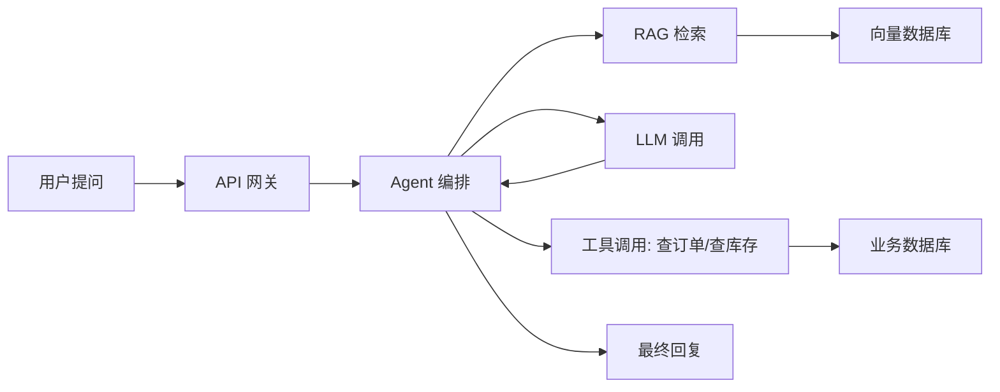
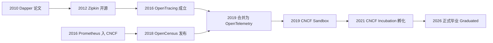
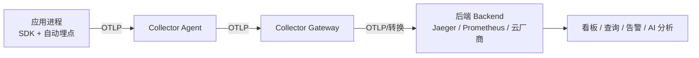
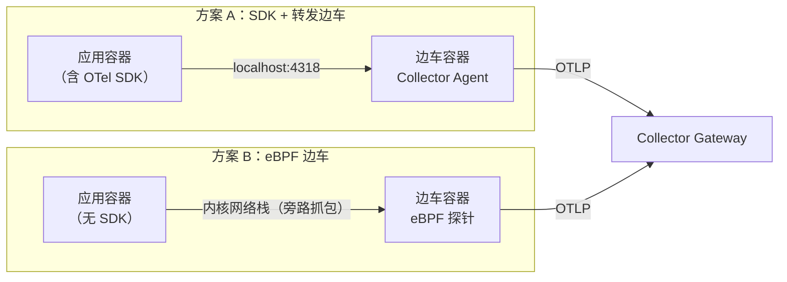
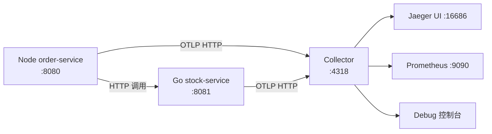
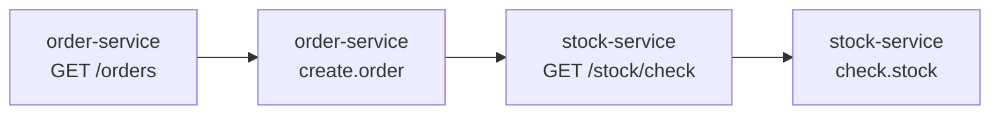

> 本篇你会得到：
>
> - 一套判断"系统到底发生了什么"的思维框架；
> - OpenTelemetry 的来龙去脉：它从哪来、为什么存在、现在是啥地位；
> - 十个核心概念的一次讲清；
> - 一个能跑的实验：Node 服务调用 Go 服务，链路、指标、日志全部落地。
>
> 前置要求：会装依赖、会写最基本的 Node.js 或 Go；装好 Docker 与 Docker Compose。不需要任何可观测性基础。
>
> 预计耗时：完整跟完约 90 分钟（只看概念约 30 分钟）。

## 先回答一个最基础的问题：监控和可观测性到底差在哪

我写这系列文章时，有个朋友问我：监控和可观测性是不是同一个东西，换了个高级叫法？

不是。这俩的区别决定了你后面搭的每一块东西，所以我先把它讲透。

先看一个 2026 年天天都在发生的场景。

凌晨两点，告警响了：AI 客服应用的错误率飙升。你打开监控面板，CPU 30%，内存充足，QPS 正常，健康检查一路绿灯。看起来一切正常。

但用户说："客服机器人开始胡说八道了。"

你打开日志，看到几百条一模一样的报错：`upstream timeout`。哪个 upstream？模型 API？知识库检索？向量数据库？还是 Agent 编排层在某个环节超时后，把一段残缺的上下文喂给了模型？

猜不出来。日志只告诉你"超时了"，不告诉你这个请求经历了什么。而这一次请求背后可能有二十个内部服务、三次模型调用、一次向量检索、两次工具调用。任何一个环节出问题，最后都表现为同一个症状：用户觉得 AI 变傻了。

更气人的是，错误率现在又恢复正常了。服务自己"好了"。但你心里清楚它没真正好，只是触发条件还没再次出现。

这就是监控和可观测性的分界线。

**监控是"我知道可能会出什么问题，所以我盯着这几个数"。** CPU 超 90% 报警、内存快满报警、支付接口 5 秒没响应报警。你预先写好了故障清单，照着清单检查。这像体检——体检单上没列的项目，医生不会给你查。

**可观测性是"我不知道会出什么鬼问题，但系统发生的每件事都留了可查询的痕迹"。** 它不是不监控了，而是让"追问"成为可能：你不用预先知道故障长什么样，也能顺着痕迹把它找出来。

有个比喻我用了很多年：监控是拿体温计找发烧，可观测性是核磁共振。核磁共振的价值不是扫得快，而是它**不预设病灶**——不知道问题在哪，它也能把全身拍下来。

落到工程上，可观测性通常拆成三根支柱：

| 信号         | 回答的问题               | 例子                               |
| ------------ | ------------------------ | ---------------------------------- |
| 日志 Logs    | 发生了什么具体事件       | 一条报错、一次登录                 |
| 指标 Metrics | 系统整体健康吗、趋势怎样 | QPS、延迟分位数、错误率            |
| 链路 Traces  | 一个请求完整经过了什么   | 从网关到 A 服务到数据库再到 B 服务 |

三根支柱各有所长，也各有短板：

- **日志**信息最丰富，但量最大、最散。没有上下文，一条日志就是一座孤岛。你看到"超时了"，却不知道它是哪个用户、哪条链路上的超时。
- **指标**最便宜、最适合告警，但信息最薄。它告诉你"慢了"，不告诉你谁慢、为什么慢。
- **链路**信息最完整，能还原请求的完整旅程，但成本高、必须采样，而且它只覆盖"请求"，覆盖不了进程内部的事。

所以生产级的可观测性不是"三样都装"，而是**三样关联**：用同一个 `trace_id` 把一次请求的链路、日志、指标串起来。这正是 OpenTelemetry 的核心设计目标之一。

另外补一句：2026 年，Profiles（剖析）正在成为第四根支柱，回答"代码层面的资源到底花在哪"，后面下篇会讲。

### 怎么确认你懂了

试着用自己的话说清三件事：

1. 监控和可观测性的本质区别是什么？
2. 三支柱各自回答什么问题、短板是什么？
3. 为什么"用同一个 ID 把日志、指标、链路串起来"在 AI 时代特别重要？

说不出来就翻回去再看一遍，这是全篇的地基。

## AI 时代：为什么这事比从前更急

传统微服务时代，可观测性解决的是"看不见"的问题。AI 时代，问题升级成了"**看起来正常，但行为不对**"。

为什么？四个原因。

**第一，不确定性从边缘变成了核心。** 传统代码是确定性的：同样的输入，同样的输出，查链路、看日志，能还原出它为什么这样。但 LLM 应用的核心是一个概率模型：同一个提示词，这次和下次回答可能不一样。错误不再是"代码 bug"这一种形态，还包括上下文被污染、检索结果差、模型幻觉、工具调用顺序错。这些都不是传统指标能捕捉的，你得看请求内部发生了什么：提示词被注入了什么、检索到了哪些片段、模型返回了什么、Agent 做了哪几步决策。

**第二，调用链变长，而且跨了系统边界。** 一个简单的 AI 客服背后可能是这样一条链：



任何一个环节变慢、失败、返回脏数据，最终都体现为"AI 答错了"。没有链路追踪，你连"这个回答是哪条路径生成的"都说不清。

**第三，成本和安全性变成了运行时问题。** 每一次失败的模型调用、每一次无意义的重试都是真金白银。一个死循环的 Agent 可能一小时烧光预算。提示词注入、敏感数据被塞进上下文，这些是安全事件。可观测性是唯一能让你在运行时看到"钱花哪了、数据去哪了"的手段。

**第四，AI 系统需要"可解释性"作为工程能力。** 监管、审计、用户投诉、模型迭代，全都要回答同一个问题："这个回答是怎么来的？"可观测性系统就是 AI 应用的飞行记录仪：输入、上下文、检索结果、模型输出、评分，全部留痕。

所以这不是一篇运维工具教程。它讲的是一个所有写软件的人都需要的基本能力，而 OpenTelemetry 恰好是这个能力的标准载体。

## 来龙去脉：这玩意儿是怎么被造出来的

理解了"为什么需要"，再看"为什么是它"。这段历史不是八卦，它解释了 OpenTelemetry 每个设计决策的来源。

### 石器时代：日志加脑补

最早的排查手段就是日志加猜。`tail -f`、`grep error`、深夜盯着滚动屏幕。分布式系统出现后，一个请求要经过十几个进程，每个进程的日志各自为政。想从头串到尾？把时间戳对上、把 IP 对上、把用户 ID 对上——这就是最早的"手工链路追踪"。

### 指标时代：StatsD、Graphite、Prometheus

2011 年前后，StatsD 在 Etsy 诞生，用极简的 UDP 协议把业务指标推给 Graphite，形成"埋点 → 聚合 → 看板"的经典范式。2016 年，Prometheus 成为 CNCF 第二个托管项目（第一个是 Kubernetes），带来了拉取模型、多维标签、PromQL 查询语言。到今天，Prometheus 的指标模型仍然是 OTel Metrics 底层思想的重要来源。

### 追踪的启蒙：从 Dapper 到 Zipkin 到 Jaeger

2010 年，Google 公开了论文《Dapper, a Large-Scale Distributed Systems Tracing Infrastructure》。这是现代分布式追踪的圣经：它第一次系统性地回答了如何给每个请求分配全局 ID、如何在跨服务调用时传递这个 ID、如何用低采样率控制成本。

2012 年，Twitter 基于 Dapper 的思路开源了 Zipkin。2017 年，Uber 开源了 Jaeger（2019 年从 CNCF 毕业）。一时间分布式追踪工具有了，但没有统一标准——每家 SDK 的数据格式、上下文传递方式、埋点 API 全不一样。

### 两个阵营：OpenTracing 与 OpenCensus

2016 年，OpenTracing 作为 CNCF 第三个托管项目成立。它的思路是定义一个**厂商中立的追踪 API**：应用只依赖一套接口，底层接 Jaeger、Zipkin 还是商业产品，都由配置决定。

2018 年，Google 推出 OpenCensus。它的思路更"全家桶"：不只追踪，还包含指标，而且自带收集与导出能力，甚至可以直接上报到自家监控产品。

两个项目都想统一世界，结果世界被劈成两半：一部分库只支持 OpenTracing，另一部分只支持 OpenCensus。更尴尬的是，它们都只解决了一半问题——OpenTracing 专注追踪、没有指标；OpenCensus 有指标但追踪生态弱。

### 2019：合并，OpenTelemetry 诞生

2019 年 5 月，CNCF 官宣：OpenTracing 和 OpenCensus 合并为 **OpenTelemetry**，同时进入 CNCF Sandbox。这次合并不是简单地把代码加在一起，而是把两个项目的设计教训揉在一起：

- 从 OpenTracing 继承：**厂商中立的 API + 可插拔 SDK**；
- 从 OpenCensus 继承：**多信号（不只追踪）+ 完整采集导出链路**；
- 双方共同承认：**必须有一个标准的、不依赖任何后端的传输协议**（后来成为 OTLP）；
- 还加上了前两者都没做好的：**跨厂商的语义约定**（Semantic Conventions），让"HTTP 延迟"在任何语言、任何 SDK 里都叫同一个名字。

时间线帮你串一下：



中间还有一个重要的旁支：**W3C Trace Context**。2019 年前后，浏览器、网关、云厂商也需要参与追踪，但 HTTP 头里没有统一标准。W3C 分布式追踪工作组制定了 `traceparent` / `tracestate` 两个头，2020 年成为 W3C 正式推荐标准。这让"从浏览器到网关到微服务到数据库"的全链路追踪第一次有了通用语言。OpenTelemetry 完整实现了它。

### 2026 年的位置：事实上的标准

到 2026 年，OpenTelemetry 走完了 CNCF 项目生涯的最后一站：

- 2021 年 8 月进入孵化（Incubation）；
- **2026 年 5 月正式毕业（Graduated）**，成为可观测性领域第一个达到毕业级的 CNCF 项目；
- 所有主流云厂商和可观测性厂商（AWS、Google Cloud、Microsoft、Datadog、Grafana、New Relic、Dynatrace、阿里云等）都在产品里原生支持 OTLP；
- Traces、Metrics、Logs 三大信号规范全部稳定；Profiles 进入 Alpha；eBPF 自动埋点项目（OBI）发布首个 Alpha；GenAI 语义约定接近稳定。

一句话总结这段历史：**可观测性经历了"日志时代 → 指标时代 → 追踪时代 → 标准混战 → OpenTelemetry 统一"五个阶段。** 你现在学到的，是这个领域第一次真正收敛出的公共基础设施。

## 十分钟建立地图：十个核心词

在动手之前，先建立一张地图。这十个词整个系列都会反复出现，现在用最直白的方式讲一遍。

**1. Signal（信号）**：OTel 把要采集的数据统称为 Signal：Traces、Metrics、Logs、Profiles。它是"采集什么"的分类。

**2. API 与 SDK**：这是 OTel 最重要也最容易被误解的设计。API 是稳定不变的接口（`tracer.startSpan()`、`meter.createCounter()`），业务代码只依赖 API；SDK 是实现（负责采样、批处理、导出），可以升级、替换，业务代码不用改。打个比方，这像 Java 的 JDBC：你写 JDBC 代码，底层是 MySQL 驱动还是 PostgreSQL 驱动，不关业务的事。OTel 把这个思路搬到了可观测性上，而且更彻底。

**3. Instrumentation（埋点 / 插桩）**：自动埋点靠拦截 HTTP 库、数据库驱动、消息队列自动生成 span，一行业务代码都不用改；手动埋点是在业务关键路径上自己创建 span，表达"这段代码在做什么业务"。好用的可观测性 = 自动埋点打底 + 手动埋点补业务语义。

**4. Context 与 Propagation（上下文与传播）**：分布式追踪的魔法核心。一个请求跨服务时，怎么让下游知道"我是同一个 trace"？上游把 `trace_id` 写进 HTTP 头（`traceparent`），下游 SDK 读到后，把新 span 挂到同一个 trace 下。传播发生在 HTTP、gRPC、消息队列，甚至进程内的异步回调里。

**5. Resource（资源）**：描述"这批数据来自哪个东西"：服务名、版本、环境、容器 ID。没有它，所有服务的数据混在一起，无从区分。

**6. OTLP（OpenTelemetry Protocol）**：OTel 定义的标准传输协议，支持 gRPC 和 HTTP，一套协议同时承载 Traces、Metrics、Logs、Profiles。它是可观测性领域的"普通话"。

**7. Collector（采集器）**：一个独立进程，接收各服务发来的 OTLP 数据，做加工（过滤、采样、补标签、脱敏），再转发给后端。两种经典形态：Agent（每节点一个，就近收）和 Gateway（集中部署，统一治理）。

**8. Exporter（导出器）**：负责把数据发给某个后端：Prometheus、Jaeger、Datadog、云厂商……SDK 和 Collector 里都有。

**9. Backend（后端）**：真正存储、查询、展示、告警的地方。OTel 不负责最终展示，它负责把数据以标准格式送到后端。后端可以是开源全家桶，也可以是商业产品。

**10. Semantic Conventions（语义约定）**：最容易被低估的一环。它规定"HTTP 请求延迟"这个指标在所有语言里都叫 `http.server.request.duration`，"服务名"属性在所有地方都叫 `service.name`。没有它，每个 SDK 自己起名，跨系统关联就是灾难。

整条数据流长这样：



记住这条主线就够了：**埋点产生数据 → SDK 规范数据 → OTLP 传输 → Collector 加工 → 后端存储展示**。

## 先回答一个常见疑问：可观测性一定要改代码吗？

写到这里，你应该会冒出一个很自然的疑问：我提到的 SDK 都要装进服务里，那是不是意味着每个服务都要改代码？可观测性不能完全不碰业务吗？比如用边车模式？

这是个好问题，而且答案比你想的复杂一点。先说清楚"服务在哪儿跑"，再说"不改代码有几种做法"。

### 容器和 Pod 到底啥区别

你提到"服务可能在某个容器或者某个 Pod 里"，这两个词经常混着用，其实不是一回事：

|            | 容器（Container）                                        | Pod                                            |
| ---------- | -------------------------------------------------------- | ---------------------------------------------- |
| 是什么     | 一个隔离的进程运行环境（自己的文件系统、网络、资源限制） | K8s 里最小的调度单元，**可以装一个或多个容器** |
| 类比       | 一个独立的"房间"                                         | 一层"楼"，房间共用走廊和门牌（网络、存储）     |
| 共享什么   | 各自隔离                                                 | 同 Pod 的容器共享 IP、端口空间、挂载的卷       |
| 为什么需要 | 打包和运行应用                                           | 让紧密协作的容器像一台机器一样调度             |

关键点：**同一个 Pod 里的容器可以通过 `localhost` 互相访问**。这是边车模式能成立的物理基础——应用容器和边车容器住在同一层楼，应用喊一声 `localhost:4318`，边车就听到了。

### 不改代码，有三种做法

**第一种：自动埋点 SDK。** 它确实要装进服务进程里（加一个依赖、启动时初始化一行），但不改你的业务代码。OTel SDK 会自动拦截 HTTP 库、数据库驱动、框架路由，帮你生成 80% 的通用数据。代价是进程里多一个库和一点点开销。

**第二种：eBPF 边车（完全无感）。** 边车里跑一个 eBPF 探针（Beyla/OBI/Odigos 这类），它不碰应用进程，而是挂在内核网络栈上，直接观察应用发出的 HTTP/gRPC 流量并生成链路。应用完全无感，连 SDK 都不用装。代价后面说：它只看得见"网络协议层"，看不见业务语义。

**第三种：纯转发边车。** 很多文章说"边车模式采集日志"，指的是 OTel Collector 以边车容器形式跟应用住在一起，接收数据、加工、转发。但注意：**这种边车自己不产生数据**，它只是个中转站。数据还是得靠应用里的 SDK 或旁边的 eBPF 探针产生。

两种边车的正确画法：



那是不是"绝对不碰代码"最好？我的观点是**别追求绝对**。eBPF 能告诉你"这个服务调了那个服务、耗时多少"，但看不到"这是哪个用户的下单""这次模型调用的提示词是什么"。业务语义恰恰是 AI 时代排障最需要的东西。所以成熟团队的做法是组合拳：

1. 自动埋点打底，覆盖所有服务，零业务代码改动；
2. eBPF 兜底，覆盖动不了的遗留系统；
3. 关键路径手动埋点，只给真正重要的业务（下单、支付、LLM 调用）补语义；
4. Collector 做统一治理，采样、脱敏、路由全在这一层，业务团队感知不到。

下篇会把边车模式在生产里怎么搭展开讲。现在先回到动手环节，你马上就会理解 SDK 为什么是"最顺手的默认选项"。

## 实践：搭一条能看的链路

现在是动手时间。我们要搭的东西很小，但五脏俱全：

- 一个 Node.js 服务（`order-service`），监听 8080；
- 一个 Go 服务（`stock-service`），监听 8081；
- Node 服务调用 Go 服务查库存；
- 两者把 Traces、Metrics、Logs 发给本地 Collector；
- Collector 转发：链路到 Jaeger，指标到 Prometheus，日志打到控制台；
- 你在 Jaeger 里看到一条跨语言、跨进程的完整链路。



### 第一步：起本地基础设施

新建一个目录 `otel-demo`，放三个文件。

`docker-compose.yml`：

```yaml
services:
  otel-collector:
    image: otel/opentelemetry-collector-contrib:0.158.0
    command: ['--config=/etc/otelcol/config.yaml']
    volumes:
      - ./otel-collector.yaml:/etc/otelcol/config.yaml:ro
    ports:
      - '4317:4317' # OTLP gRPC
      - '4318:4318' # OTLP HTTP
      - '8889:8889' # Prometheus 抓取 Collector 的指标出口

  jaeger:
    image: jaegertracing/jaeger:2.20.0
    ports:
      - '16686:16686' # Jaeger UI
    depends_on:
      - otel-collector

  prometheus:
    image: prom/prometheus:v3
    volumes:
      - ./prometheus.yaml:/etc/prometheus/prometheus.yml:ro
    ports:
      - '9090:9090'
    depends_on:
      - otel-collector

  grafana:
    image: grafana/grafana:13.0.6
    volumes:
      - ./grafana-datasources.yaml:/etc/grafana/provisioning/datasources/datasources.yaml:ro
    ports:
      - '3000:3000'
    depends_on:
      - jaeger
      - prometheus
```

版本说明：这里用的是 2026 年 8 月的最新稳定版本，将来有新版把 tag 换掉就行，配置结构不变。Jaeger 用的是 v2（2024 年底发布的新一代，本身就是基于 OTel Collector 定制的发行版），默认开启 OTLP 接收。

`otel-collector.yaml`：

```yaml
receivers:
  otlp:
    protocols:
      grpc:
        endpoint: 0.0.0.0:4317
      http:
        endpoint: 0.0.0.0:4318

processors:
  batch:

exporters:
  debug:
    verbosity: detailed
  otlphttp/jaeger:
    endpoint: http://jaeger:4318
  prometheus:
    endpoint: 0.0.0.0:8889

service:
  pipelines:
    traces:
      receivers: [otlp]
      processors: [batch]
      exporters: [debug, otlphttp/jaeger]
    metrics:
      receivers: [otlp]
      processors: [batch]
      exporters: [debug, prometheus]
    logs:
      receivers: [otlp]
      processors: [batch]
      exporters: [debug]
```

`prometheus.yaml`：

```yaml
scrape_configs:
  - job_name: otel-collector
    scrape_interval: 5s
    static_configs:
      - targets: ['otel-collector:8889']
```

`grafana-datasources.yaml`：

```yaml
apiVersion: 1
datasources:
  - name: Jaeger
    type: jaeger
    access: proxy
    url: http://jaeger:16686
    isDefault: false
  - name: Prometheus
    type: prometheus
    access: proxy
    url: http://prometheus:9090
    isDefault: true
```

启动：

```bash
cd otel-demo
docker compose up -d
docker compose ps
```

等容器全部 Up，先验证 Collector 活着：

```bash
curl -s -o /dev/null -w '%{http_code}\n' -X POST http://localhost:4318/v1/traces
```

返回任何 HTTP 状态码（而不是 `connection refused`）就说明端口通了。打开 http://localhost:16686 看 Jaeger UI，http://localhost:9090 看 Prometheus。

### 怎么确认这一步对了

四个容器全部 Up，4318 和 16686 两个端口能访问。任何一步不对，先看 `docker compose logs otel-collector`。

### 第二步：Node 服务

新建 `node-app/`，初始化项目并装依赖：

```bash
mkdir -p node-app && cd node-app
npm init -y
npm install express@4
npm install @opentelemetry/api@1.9.1 \
  @opentelemetry/api-logs@0.221.0 \
  @opentelemetry/sdk-node@0.221.0 \
  @opentelemetry/auto-instrumentations-node@0.79.0 \
  @opentelemetry/exporter-trace-otlp-http@0.221.0 \
  @opentelemetry/exporter-metrics-otlp-http@0.221.0 \
  @opentelemetry/exporter-logs-otlp-http@0.221.0 \
  @opentelemetry/sdk-metrics@2.10.0 \
  @opentelemetry/sdk-logs@0.221.0 \
  @opentelemetry/resources@2.10.0 \
  @opentelemetry/semantic-conventions@1.43.0
```

创建 `tracing.js`——整个 Node 应用的观测入口：

```js
// tracing.js
import { NodeSDK } from '@opentelemetry/sdk-node'
import { getNodeAutoInstrumentations } from '@opentelemetry/auto-instrumentations-node'
import { OTLPTraceExporter } from '@opentelemetry/exporter-trace-otlp-http'
import { OTLPMetricExporter } from '@opentelemetry/exporter-metrics-otlp-http'
import { OTLPLogExporter } from '@opentelemetry/exporter-logs-otlp-http'
import { PeriodicExportingMetricReader } from '@opentelemetry/sdk-metrics'
import { SimpleLogRecordProcessor } from '@opentelemetry/sdk-logs'
import { Resource } from '@opentelemetry/resources'
import { ATTR_SERVICE_NAME, ATTR_SERVICE_VERSION } from '@opentelemetry/semantic-conventions'

const resource = new Resource({
  [ATTR_SERVICE_NAME]: 'order-service',
  [ATTR_SERVICE_VERSION]: '1.0.0',
})

const sdk = new NodeSDK({
  resource,
  traceExporter: new OTLPTraceExporter(),
  metricReaders: [
    new PeriodicExportingMetricReader({
      exporter: new OTLPMetricExporter(),
      exportIntervalMillis: 5000,
    }),
  ],
  logRecordProcessors: [new SimpleLogRecordProcessor(new OTLPLogExporter())],
  instrumentations: [getNodeAutoInstrumentations()],
})

sdk.start()
```

再创建 `server.js`：

```js
// server.js
import './tracing.js'
import express from 'express'
import { trace, metrics } from '@opentelemetry/api'
import { logs } from '@opentelemetry/api-logs'

const app = express()
const tracer = trace.getTracer('order-service')
const meter = metrics.getMeter('order-service')
const logger = logs.getLogger('order-service')
const orderCounter = meter.createCounter('orders.created')

app.get('/orders', async (req, res) => {
  await tracer.startActiveSpan('create.order', async (span) => {
    span.setAttribute('order.user', 'demo-user')

    // 调用 Go 服务查库存
    const response = await fetch('http://localhost:8081/stock/check')
    const stock = await response.text()
    span.setAttribute('order.stock', stock)

    orderCounter.add(1, { status: response.ok ? 'success' : 'failed' })

    span.end()
    logger.emit({
      body: `order created, stock=${stock}`,
      severityText: 'INFO',
      attributes: { order.user: 'demo-user' },
    })
    res.json({ ok: true, stock })
  })
})

app.listen(8080, () => console.log('order-service on :8080'))
```

两件事注意一下：

1. `import './tracing.js'` 必须在最前面，先启动 SDK 再创建服务，否则埋点会错过启动阶段；
2. `fetch` 调 Go 服务时的上下文传播是自动埋点完成的，你不需要手动传 `traceparent` 头。

跑起来：

```bash
node server.js
```

### 第三步：Go 服务

新建 `go-app/`，初始化模块并装依赖：

```bash
mkdir -p go-app && cd go-app
go mod init example.com/otel-demo/go-app
go get go.opentelemetry.io/otel@v1.45.0
go get go.opentelemetry.io/otel/sdk@v1.45.0
go get go.opentelemetry.io/otel/exporters/otlp/otlptrace/otlptracehttp@v1.45.0
go get go.opentelemetry.io/otel/semconv/v1.30.0
go get go.opentelemetry.io/contrib/instrumentation/net/http/otelhttp@latest
```

创建 `main.go`：

```go
package main

import (
	"context"
	"fmt"
	"log"
	"net/http"
	"time"

	"go.opentelemetry.io/contrib/instrumentation/net/http/otelhttp"
	"go.opentelemetry.io/otel"
	"go.opentelemetry.io/otel/attribute"
	"go.opentelemetry.io/otel/exporters/otlp/otlptrace/otlptracehttp"
	"go.opentelemetry.io/otel/sdk/resource"
	sdktrace "go.opentelemetry.io/otel/sdk/trace"
	semconv "go.opentelemetry.io/otel/semconv/v1.30.0"
)

func initTracer() (*sdktrace.TracerProvider, error) {
	exporter, err := otlptracehttp.New(context.Background())
	if err != nil {
		return nil, err
	}
	tp := sdktrace.NewTracerProvider(
		sdktrace.WithBatcher(exporter),
		sdktrace.WithResource(resource.NewWithAttributes(
			semconv.SchemaURL,
			semconv.ServiceName("stock-service"),
			semconv.ServiceVersion("1.0.0"),
		)),
	)
	otel.SetTracerProvider(tp)
	return tp, nil
}

func stockHandler(w http.ResponseWriter, r *http.Request) {
	ctx, span := otel.Tracer("stock-service").Start(r.Context(), "check.stock")
	defer span.End()

	time.Sleep(20 * time.Millisecond) // 模拟库存查询
	span.SetAttributes(attribute.Int("stock", 42))

	fmt.Fprint(w, "42")
}

func main() {
	tp, err := initTracer()
	if err != nil {
		log.Fatal(err)
	}
	defer func() { _ = tp.Shutdown(context.Background()) }()

	handler := otelhttp.NewHandler(http.HandlerFunc(stockHandler), "GET /stock/check")
	log.Println("stock-service on :8081")
	log.Fatal(http.ListenAndServe(":8081", handler))
}
```

跑起来：

```bash
go run .
```

### 第四步：制造流量并观察

两个服务都跑在本地（不是容器里），通过 `localhost:4318` 发数据给容器里的 Collector，这是本实验唯一需要理解的网络关系。

打几次请求：

```bash
for i in 1 2 3 4 5; do curl -s http://localhost:8080/orders; echo; done
```

然后：

1. 打开 Jaeger：http://localhost:16686
2. Service 下拉框选 `order-service`
3. 点 Find Traces

你会看到一条链路，展开是四层：



注意四个 span 共享同一个 `trace_id`，但属于两个进程。Node 的 fetch 自动把 `traceparent` 头带给了 Go，Go 的 SDK 自动把它接上。**这一条跨语言链路，就是分布式追踪的全部意义。**

再看指标：打开 Prometheus http://localhost:9090 ，执行：

```promql
{__name__=~"http_server_(request_)?duration.*"}
```

能看到两个服务的 HTTP 延迟指标（不同版本语义约定下名字略有差异，所以用正则捞）。再执行：

```promql
orders_created_total
```

能看到你埋的计数器，带 `status` 标签。

最后看日志：`docker compose logs otel-collector | tail -30`，能看到 OTLP 收到的 Traces、Metrics、Logs 三种数据详情，其中 logs 部分是每次下单时通过 `@opentelemetry/api-logs` 发出的结构化日志。注意：这里日志只是"到了 Collector"，还没接入真正的日志后端，中篇会补上 Loki 链路。

### 怎么确认这一步对了

- Jaeger 里能找到 `order-service`，链路跨了 Node 和 Go 两个进程；
- Prometheus 里能查到 HTTP 延迟指标和 `orders_created_total`；
- Collector 日志里有来自两个服务的 OTLP 数据。

做到这三件事，你的第一套 OTel 链路就算通了。

## 常见坑速查

| 症状                             | 原因                                  | 解法                                                                                 |
| -------------------------------- | ------------------------------------- | ------------------------------------------------------------------------------------ |
| Jaeger 里搜不到服务              | 埋点没生效 / SDK 启动失败             | 先看服务启动日志有没有报错；`import './tracing.js'` 是否在文件最顶部                 |
| Collector 没收到数据             | 端口或端点不对                        | 确认 `OTEL_EXPORTER_OTLP_ENDPOINT` 没被设置成别的值；服务与 Collector 之间网络通不通 |
| 链路只有一半（Node 有、Go 没有） | Go 服务没初始化 SDK                   | 确认 `main()` 里 `initTracer()` 被调用                                               |
| 指标查不到                       | 指标还没到导出周期                    | 等 5 秒以上再查；示例里把导出周期调成了 5 秒                                         |
| Docker 端口冲突                  | 4317/4318/8889/16686/9090/3000 被占用 | 换 host 端口映射，并同步改应用和配置文件里的地址                                     |

## 小结

上篇的终点不是"会跑一个 demo"，而是建立起三张图：

1. **问题图**：监控与可观测性的区别，三支柱与 AI 时代的新挑战；
2. **历史图**：从 Dapper、Zipkin、Jaeger，到 OpenTracing 与 OpenCensus 合并，再到 CNCF 毕业；
3. **架构图**：SDK → OTLP → Collector → Backend，十个核心概念各就各位，以及"不改代码"的三种做法。

中篇会回答下一个层次的问题：**它内部到底怎么工作**——Span 是怎么串起来的、指标是怎么聚合的、日志怎么和链路关联、Collector 怎么帮你做采样治理。我们还会把 Python 加进来，组成三语言全家桶。

## 自测题

1. 为什么 OpenTracing 和 OpenCensus 的合并是"1+1 大于 2"？它们各自带来了什么？
2. API 和 SDK 分离的意义是什么？举一个"只改 SDK 不改业务代码"的场景。
3. 一次跨服务调用中，下游服务怎么知道自己是同一个 trace？
4. Collector 在架构里扮演什么角色？如果没有它，直接用 SDK 连后端会缺什么能力？
5. "不改代码"有哪三种做法？为什么我建议别追求"绝对无侵入"？
6. AI 应用相比传统微服务，在可观测性上多了哪些必须看的数据？

## 练习任务

1. 把上面的 demo 完整跑通，把 Jaeger 链路的截图保存下来。
2. 给 `create.order` 这个手动 span 增加两个自定义属性，验证它们在 Jaeger 里显示。
3. 把 Go 服务也接上指标：用 `go.opentelemetry.io/otel/metric` 创建一个计数器，导到 Prometheus。（提示：`otlpmetrichttp` exporter + `PeriodicReader`）
4. 思考题：如果 `order-service` 调用的是一个不支持 OTel 的第三方服务，你如何让链路跨过这个"黑洞"？（提示：想想 `traceparent` 头）

## 附录：本篇命令与文件汇总

```bash
# 基础设施
docker compose up -d
docker compose ps
docker compose logs -f otel-collector

# Node 服务
cd node-app && npm install && node server.js

# Go 服务
cd go-app && go run .

# 制造流量
for i in 1 2 3 4 5; do curl -s http://localhost:8080/orders; echo; done

# 观察
open http://localhost:16686   # Jaeger
open http://localhost:9090    # Prometheus
open http://localhost:3000    # Grafana（初始账号 admin/admin）
```

文件清单：`docker-compose.yml`、`otel-collector.yaml`、`prometheus.yaml`、`grafana-datasources.yaml`、`node-app/tracing.js`、`node-app/server.js`、`go-app/main.go`。

下一篇：《OpenTelemetry 中篇：从会用到底层原理》。
