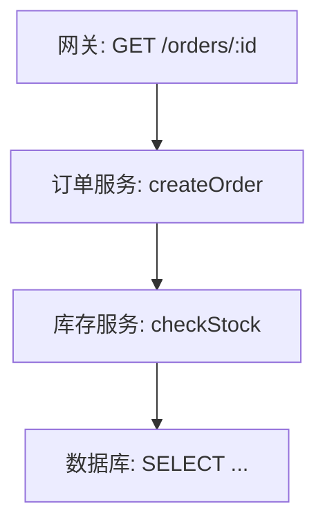

## 三类信号共用一条主线

OpenTelemetry 的链路、指标、日志不是三个独立系统，而是一套数据模型的三类视图。它们共用同一套标识体系：traceId、spanId 以及表示上下文传播的 header。任何一类信号都可以携带这套标识，因此查询时可以互相跳转：从一条日志跳到它所属的链路，从一条链路跳到某个时间点的指标，从指标上的示例数据跳回具体请求。

上下文在两类边界上传播。进程内：同一进程的多个函数、异步回调共享当前 Span，新创建的 Span 自动继承；进程间：服务调用时把 SpanContext 编码进请求头，下游取出后继续传递。两类传播缺一不可：进程内断链，同一服务里的 Span 拼不成子树；进程间断链，整条链路在服务边界断成两截。

主线可以概括为一句话：一切数据先归属上下文，再描述状态。链路描述上下文的形状，指标描述上下文的聚合，日志描述上下文中的事件。三类信号分开看都有盲区，合在一起才能回答“发生了什么、为什么、影响多大”。

这套设计有一个直接后果：接入 OpenTelemetry 时，三类信号不是三个独立工程。初始化一次 SDK，链路、指标、日志共用同一个上下文、同一份 Resource、同一条导出管道。这也是它通常以一个 SDK 包的形式出现，而不是三个互相独立的库的原因。

关联不依赖时间对齐。日志时间戳来自各自主机，时钟偏移可能让跨服务的事件排序失真；链路数据用传播的上下文确定父子关系，时间只用于展示耗时。排查时以结构为准、以时间为辅，这个顺序不会因为时钟问题出错。

## Trace：一条链路怎么串起来

### Span：链路的最小单元

链路由 Span 组成。一个 Span 表示一次操作的时间片段：一次 HTTP 请求、一次数据库查询、一段业务函数。每个 Span 记录名称、开始与结束时间、状态、属性、事件，以及最重要的三个字段：traceId、spanId、parentSpanId。

- traceId：整条链路（trace）的全局唯一标识，同一个请求的所有 Span 共享。
- spanId：当前 Span 的唯一标识。
- parentSpanId：父 Span 的标识，把每个片段固定在链路中的位置。

Span 还携带状态（OK、Error、Unset）与事件。状态标记操作成败；事件（span event）记录操作过程中的关键瞬间，比如重试发生、请求被限流；属性（attributes）提供查询维度，例如路由、HTTP 状态码、业务 ID。设计埋点时，属性决定数据能被哪些问题检索到；属性不足，链路只能还原形状，还原不了业务细节。

links 解决父子关系表达不了的两类场景：异步任务从队列取出时，处理 Span 通过 link 指回投递 Span，而不建立父子关系——父子意味着调用包含，异步投递不满足这个语义；聚合服务把多个来源的请求合并处理时，用 links 保留所有上游 trace 的入口，方便从任意上游回溯。父 Span 只有一个，links 可以有很多个。

一个 Span 的完整生命周期是：创建时记录开始时间，执行期间追加属性和事件，结束时记录状态与结束时间。手动埋点的代码形状大致是：创建 Span → 设置属性 → 执行业务 → 结束。自动埋点把这一流程交给框架钩子，业务代码不需要写任何一行追踪代码。

### Span 树：一次请求的完整路径

一次请求经过多个组件时，Span 按调用关系形成树。根 Span 通常由入口组件创建，后续每次下游调用生成一个子 Span：



树形结构记录的是因果关系，不是时间顺序。B 是 A 的子 Span，因为 A 调用了 B；即使 B 的日志先落库，结构上它仍然挂在 A 下面。并行调用表现为同一父 Span 下的多个子 Span，各子 Span 的耗时可以独立分析。

根 Span 的选择影响整条链路的语义。入口请求的处理器是天然根节点；定时任务以任务执行函数为根；消息消费者以处理消息的函数为根。根选错了，链路虽然不断，但整棵树的边界会偏离“一次业务操作”，统计口径跟着错。

采样直接决定树是否完整。如果每个 Span 独立决定是否记录，同一个 trace 里可能只有一半节点被保存，树变成碎片，耗时分析和错误定位都无法进行。因此采样决策必须在根 Span 创建时做出，并通过上下文传播给所有子 Span。

### 上下文传播：Span 怎么穿过进程边界

一个 Span 单独存在没有意义，跨进程把它串起来才是链路。跨进程传递的是 SpanContext——traceId、spanId 和采样标记的集合。SDK 在发起 HTTP 调用时把上下文写入请求头，下游收到后取出并创建子 Span。

W3C Trace Context 标准定义了 HTTP 头的格式，最常用的是 traceparent：

`00-4bf92f3577b34da6a3ce929d0e0e4736-00f067aa0ba902b7-01`

四个字段依次是版本、traceId、spanId、flags。traceId 是 32 个十六进制字符，spanId 是 16 个十六进制字符，flags 末尾的 01 表示这条链路被采样。下游读取 traceparent 后，用其中的 spanId 作为自己 Span 的 parentSpanId，链路就延续了下去。

traceparent 只承载身份。需要传递供应商特有的补充信息时，使用 tracestate 头，它是一组键值对，按逗号分隔，供不同传播实现写入自己的字段。普通应用不需要读写 tracestate，但理解它有助于排查“为什么某些后端能看到额外上下文”。

对支持的标准库，SDK 自动完成注入与提取，业务代码无需处理。传播要求调用链路上的每一环都配合：上游注入 header，下游提取 header。缺任何一环，链路就在这里断成两截。最常见的断点包括：中间件或代理删除了未知 header、异步任务丢失了上下文对象、消息队列消费者没有把 header 透传到处理逻辑。SDK 能自动处理的只是它认识的框架，不认识的部分需要手动传播。

### Baggage：跨服务传业务上下文

SpanContext 只传链路身份，不传业务数据。如果希望业务字段（用户 ID、租户、实验分组）跟随请求到达所有下游，使用 Baggage。它通过 baggage 头传输，可以附加到下游 Span 和日志的属性上。

Baggage 的使用需要克制：它随每个请求复制，字段越多，网络开销和隐私风险越大。个人身份信息、令牌这类敏感数据不应放进 Baggage，默认只放高价值、低基数、低敏感的标识字段。一个判断标准：如果字段只对某个服务有用，就不要放进 Baggage；只有所有下游都可能用到的上下文才值得传播。

### 采样：链路的成本控制

链路数据量远大于指标，全量采集在生产环境不可行，采样是必选项。采样发生在两个位置：

- 头部采样（head sampling）：SDK 在请求开始时按概率决定是否记录。决策时结果未知，因此无法针对“是否出错”做选择，但实现简单、开销低。
- 尾部采样（tail sampling）：Collector 收到完整链路后按规则决定，可以基于错误、延迟、特定属性保留有价值的链路，代价是需要缓冲整条链路。

采样标记随上下文传播。头部采样在根 Span 创建时决策，flags 写入 traceparent，下游 SDK 读到未采样标记后只记录结构、不导出数据，整棵树的决策保持一致。概率一致性是另一个细节：多个入口如果各自独立按 10% 抽签，同一业务操作的不同入口会出现不同的采样率，跨入口统计会失真；一致采样（consistent sampling）用 traceId 的哈希决定是否采样，保证同一 trace 在不同入口得到相同结论。

尾部采样适合“错误优先”场景：链路全部暂存到 Collector，结束后按状态码、延迟或属性决定去留。错误链路通常只占总量的一小部分，全部保留不会显著增加成本，却能让每次故障都有据可查。预算怎么定，依赖数据量与保留期的实际测量，而不是拍脑袋。

## Metrics：指标怎么算出来

### Instrument：指标的入口

指标由埋点代码通过 instrument（计量器）产生。OpenTelemetry 把 instrument 分成同步与异步两类：同步类型在代码路径里直接调用，异步类型由 SDK 定期回调采集。

同步类型有三种：

- Counter：只增不减的计数器，适合请求数、错误数。
- UpDownCounter：可增可减，适合队列长度、在线人数。
- Histogram：记录一组观测值的分布，适合延迟、请求体大小。

异步类型有三种：ObservableCounter 与 ObservableUpDownCounter 分别对应递增与增减语义，用于从外部系统读取的数值；ObservableGauge 表示某一时刻的状态值，比如内存用量、连接数。它们不能由请求路径触发，而是由 SDK 按采集周期回调。

埋点代码只需要选择类型并调用：

```ts
counter.add(1, { 'http.request.method': 'GET', route: '/orders' })
```

instrument 的另一个重要属性是单位（unit）：请求数、毫秒、字节。单位不一致的数据无法直接比较，语义约定对常见指标的单位有明确规定。埋点代码选定 instrument 类型后，聚合与导出交给 SDK，业务代码只负责在正确的时机调用。

指标名同样遵循语义约定：HTTP 服务端请求延迟的标准名是 http.server.request.duration，单位是秒，instrument 类型是 Histogram。命名、单位、类型三者一致，指标才能跨团队、跨语言聚合；同一含义起两个名字，等于制造两套无法合并的数据。

### Temporality：两种时间观

指标点带有时间语义，即 temporality：delta 表示“距上次导出以来的增量”，cumulative 表示“进程启动以来的累计值”。Prometheus 风格是 cumulative，OTLP 两种都支持，由 SDK 与后端协商。

以请求计数为例：delta 视角下，导出周期内新增 120 次请求，数值是 120；cumulative 视角下，导出的是进程启动以来的累计值，比如 48321。告警规则对增量敏感，用 delta 更直观；长期趋势和容量分析依赖累计值。

选择影响查询语义。cumulative 的数据适合“从开始到现在”的曲线，但服务重启会归零，多次导出需要后端处理重置；delta 的数据适合增量计算，但需要稳定的导出周期。很多“指标看起来不对”的现象都来自 temporality 不一致：服务重启后曲线跳变、跨后端迁移后数值口径不同。

实际排查时，temporality 的坑经常出现在迁移场景：从 Prometheus 迁到支持 OTLP 的后端，如果后端的默认口径不同，同一份埋点数据画出来的曲线形状会不一样，告警阈值也需要重新校准。不是数据错了，是时间观变了。

### Aggregation：值在 SDK 里怎么被压缩

SDK 不会把每个观测值原样导出，而是先聚合：Counter 默认聚合成 sum，Gauge 取 last value，Histogram 落入分桶（显式桶或指数桶）。

Histogram 的桶决定查询精度。显式桶（explicit bucket）由配置给出边界，例如 5ms、10ms、25ms、50ms、100ms、250ms；指数桶（exponential bucket）按指数增长分布边界，覆盖范围更广、边界数量更少。桶边界越细，P99 等分位数计算越精确，存储开销越大；桶太少，多个量级的延迟被塞进同一个桶，分位数失真。

聚合发生在进程内还是 Collector 内，语义不同。SDK 端聚合（pre-aggregation）减少网络与存储量，但丢失了聚合前的个体信息；Collector 端聚合可以合并多个实例的数据，适合网关模式的全局视图。指标降采样（downsampling）是另一层压缩：把原始序列按更粗的窗口重聚合，保留长期趋势、牺牲短期精度。

### 基数：指标序列的膨胀问题

属性组合决定指标序列的数量。同一指标带十个属性、每个属性有几十个取值，组合出的序列数量会迅速膨胀，这就是基数（cardinality）问题。基数失控会让存储与查询同时劣化，是生产治理的核心议题之一。

一个真实的失控例子：请求延迟指标带 route、status、region、user_id 四个属性，route 有 20 个值，status 有 5 个，region 有 10 个，user_id 有几十万。前三个属性组合出 1000 个序列，加上 user_id，序列数量直接爆炸。user_id 属于典型的高基数属性，只应该出现在日志或链路里，而不是指标里。

指标属性的设计原则：只放有限枚举的维度，如路由、状态码、实例、区域；不放用户 ID、订单 ID、会话 ID 这类接近无限的标识；确实需要按标识分析时，用链路或日志。基数问题从埋点阶段就决定，后期靠治理只能止损，不能补回。

### Exemplar：把指标和链路缝起来

聚合丢掉了个体，Exemplar 补回一个样本：在聚合过程中，为数据点附带一条具体观测的 traceId 与 spanId。查询指标时，可以顺着 Exemplar 跳进一条真实链路，看这个数据点背后的请求到底发生了什么。

Exemplar 不是每个数据点都带，而是按规则挑选，例如每个桶保留最近一次观测。它不会显著增加存储，却能在需要时提供从聚合到个体的跳转入口。这是三类信号关联中最巧妙的一环：指标负责全景，链路负责细节，Exemplar 负责从全景进入细节。

## Logs：日志怎么不再孤立

### LogRecord：带身份的事件

日志是三类信号里接入面最广、历史包袱最重的。OpenTelemetry 的目标不是让所有应用抛弃现有日志框架，而是定义统一的日志模型与管道：日志仍由熟悉的框架产生，SDK 负责补充上下文、统一格式、送往 Collector。这样既保留生态，又让日志不再是一堆孤岛。

OpenTelemetry 的日志模型是结构化事件，称为 LogRecord。核心字段包括：时间戳、observed timestamp（SDK 观察到日志的时间）、severityText 与 severityNumber（级别）、body（正文）、一组属性，以及可选的 traceId、spanId：

```json
{
  "timestamp": "2026-08-09T10:00:00.123Z",
  "severityText": "ERROR",
  "severityNumber": 17,
  "body": "inventory service timeout",
  "attributes": {
    "service.name": "order-service",
    "http.response.status_code": 500
  },
  "traceId": "4bf92f3577b34da6a3ce929d0e0e4736",
  "spanId": "00f067aa0ba902b7"
}
```

severityNumber 采用 1–24 的数字分级，TRACE、DEBUG、INFO、WARN、ERROR、FATAL 各有固定区间，便于跨框架统一过滤。日志框架的级别与 OTel 级别之间由桥接层映射，应用代码不需要改。

接入方式是桥接而不是替换：主流日志框架提供 OTel appender 或 handler，把日志事件转发给 OTel SDK；没有桥接的框架，可以通过 API 手动创建 LogRecord。桥接层还负责一件事——把当前链路的 traceId、spanId 写进日志，这一步通常自动完成。

### LogRecord 与 Span Event

Span 自身也可以携带事件（span event）：某次重试、某个关键分支。两者的区别在于归属：span event 属于某个 Span，离开链路上下文就没有意义；LogRecord 是独立事件，可以脱离链路存在，也可以借助 traceId 关联回链路。

保留策略也不同。span event 随链路采样而存在：链路被采样，事件才保存；链路被丢弃，事件跟着丢。日志是否保留由日志管道决定，与链路采样无关。混用会让数据去向难以预期——把重要诊断信息写成 span event，链路采样率调低后，这些信息就悄悄消失了。

实践中按用途划分：链路内部的中间步骤用 span event，独立于请求的诊断信息用日志。需要长期审计或独立检索的信息，默认走日志。

### 关联机制

关联发生在 SDK 层。初始化时，日志 SDK 与链路 SDK 共享同一个上下文提供器；logger 写日志时自动取出当前 spanId 与 traceId 写入 LogRecord。后端按 traceId 建索引后，从任意一条日志都能跳到完整链路，从链路也能展开它产生的日志。

这套机制的关键是“自动”。开发者不需要在每处日志手工拼接 traceId，上下文从当前执行环境获取。手动拼接不仅容易遗漏，还会在异步代码里拿到错误的链路：回调执行时，当前上下文可能已经不属于发起请求的线程或协程。

## Resource 与语义约定

### Resource：附着在所有信号上的元数据

Resource 描述数据的来源：服务名、服务版本、命名空间、部署环境、主机信息。它属于进程级元数据，一个进程的所有信号共享同一份，与请求属性不同。

常用字段包括 service.name、service.namespace、service.version、service.instance.id、deployment.environment，以及 host.name、os.type 等运行环境信息。多数字段由 resource detector 自动填充：读取环境变量、云平台元数据、容器信息，启动时合并成一份 Resource，不需要手写。

Resource 的合并遵循确定的顺序规则：多个来源的字段发生冲突时，合并顺序决定最终值，显式配置通常覆盖自动探测的结果。理解这条规则，能解释为什么容器环境里 service.name 偶尔被覆盖——通常是显式配置与探测结果同时存在。

一个常见错误是把 service.name 写成请求属性。Resource 用于导出端的路由、过滤与计费，请求属性随每条数据变化。两者放反，查询会立刻失真：按服务过滤时找不到数据，按请求维度聚合时又混入进程级信息。

### 语义约定：为什么属性名必须统一

属性名由语义约定（semantic conventions）定义：HTTP 方法叫 http.request.method，数据库系统叫 db.system，模型提供方叫 gen_ai.provider.name。约定的价值在互操作：不同团队、不同语言、不同供应商的数据进入同一后端时，名称一致，仪表盘、告警和查询才能复用。

约定按稳定程度分级：stable 表示承诺长期不变，experimental 表示可能调整。约定会演进，因此带版本：数据携带 schema URL，标识产生数据时遵循的约定版本；某个属性改名时，工具可以按版本转换或提示，而不是直接当成两个不认识的字段。

对开发者来说，先查约定再埋点，比按个人习惯命名更重要。约定已经覆盖 HTTP、数据库、消息、浏览器、云资源与 GenAI 等领域，绝大多数常见场景不需要自定义属性名。

## SDK 内部：从埋点到导出

### API 与 SDK 分离

OpenTelemetry 把“怎么埋点”和“怎么实现”分成两层。业务代码只依赖 API：创建 tracer、meter、logger，调用 span、instrument。真正干活的 SDK 在启动时注入：它提供 Provider、Processor、Exporter，决定数据如何聚合、缓存、导出。

分离的第一个收益是可替换性：SDK 的实现可以升级、换厂商、换配置，业务代码不变。第二个收益是可测试性：测试里注入一个内存版 SDK，断言数据是否被正确记录，不需要真实网络。没有这层边界，埋点代码会和具体实现耦合，厂商中立就无从谈起。

一个进程里也可以并存多个 SDK 实例：迁移期间旧实现与新实现同时运行，或不同团队使用不同配置。全局 Provider 负责默认路径，命名 Provider 供特定模块使用。多实例是平滑迁移的基础，代价是数据会重复导出，需要迁移计划处理。

### Provider、Processor、Exporter

三类信号各有对应的 Provider（TracerProvider、MeterProvider、LoggerProvider），负责管理组件的生命周期。数据产生后进入 Processor，再交给 Exporter。

Processor 最常见的实现是批处理：把多条数据攒成一个批次，按固定间隔或数量上限发送，显著降低网络请求次数。批处理器还有队列与超时：队列满时丢弃新数据或阻塞调用，取决于配置；超时未发出去的数据会尝试重试。理解这几个参数，就能解释生产中的两种现象：高负载下偶发丢数据（队列满）、后端抖动时出现重试风暴。

Exporter 负责把数据编码成 OTLP 并发送。SDK 与 Collector 之间的网络中断时，数据在内存队列里等待；进程退出时，未导出的数据会丢失，除非显式触发 flush。优雅停机时调用 flush，是接入清单里容易被忽略的一步。

### 自动埋点

自动埋点（auto-instrumentation）是接入成本的关键。对主流 Web 框架、HTTP 客户端、数据库驱动，SDK 通过钩子自动创建 Span、注入上下文、采集标准属性，业务代码不需要改动。手动埋点只用于补充业务语义：订单号、用户 ID、关键分支。

实现方式随语言不同：Java 使用字节码注入，启动时通过 agent 改写类；Node.js 与 Python 通过运行时包装模块，拦截 HTTP 客户端与框架的调用；Go 没有通用的运行时钩子，自动埋点覆盖有限，更依赖手动埋点或 eBPF 方案。选择语言时，自动埋点的成熟度是接入成本的重要变量。

零代码方案进一步把初始化也自动化，通过环境变量和启动参数注入 SDK。自动埋点的覆盖范围决定了一个语言生态的接入成本：官方与社区维护的 instrumentation 库覆盖主流 HTTP 框架、数据库客户端、消息客户端与云 SDK；不在列表里的组件只能手动埋点。

### 进程内上下文传播

进程内传播依赖运行时提供的上下文机制：Node.js 的 AsyncLocalStorage、Python 的 contextvars、Java 的线程局部变量。SDK 把当前 Span 存在上下文里，新建 Span、写日志、创建指标时都从上下文取。

异步代码是进程内传播最容易出错的地方：回调、定时器、消息处理器可能运行在另一个执行环境里，上下文不会自动跟随。SDK 在包装异步 API 时负责传递上下文，但绕过 SDK 的裸回调拿不到当前 Span。排查“Span 断在服务内部”的问题时，先看异步边界是否被框架自动处理。

## Collector：数据的中转站

Collector 是独立进程，负责从 SDK 或其它来源接收数据，经过一条管线处理，再导出到后端。管线由三部分组成：

- Receiver：接收数据。OTLP 是主要入口，也支持 Prometheus、Jaeger、Zipkin 等格式。
- Processor：处理数据。常见用途包括采样、过滤、属性增强、数据脱敏、路由。
- Exporter：把处理后的数据发给一个或多个后端。

Processor 的一个典型例子是属性增强：从 Resource 或外部数据源读取信息，统一附加到每一条数据上，比如把集群名、环境、团队归属写进属性。这类规则集中在一处，应用侧完全无感。

Collector 解决的核心问题：SDK 不需要知道后端是谁，治理逻辑不需要写进每个应用。埋点决策（采样规则、脱敏字段、导出目标）集中在 Collector 一处，改动不影响应用代码。管线可以串行处理，也可以把同一份数据分支发给多个后端：一份进指标系统，一份进日志平台，一份用于审计。

Collector 还承担缓冲、重试与背压。SDK 断网或后端抖动时，数据在 Collector 队列里等待；队列满时，Collector 可以拒绝新数据，让 SDK 侧感知压力而不是无限堆积。数据从产生到落库的每一跳都可能丢，重要数据的留存依赖队列配置、重试上限与后端的幂等写入，而不是假设链路可靠。

它的两种部署模式——与应用同机部署的 Agent、独立集群的 Gateway——分别适合不同的规模与治理需求。

## 三类信号如何协同工作

把整套机制串起来看一次完整的排查：用户反馈某个操作失败，先在日志平台按时间检索，找到一条 ERROR 日志，日志里带着 traceId；顺着 traceId 打开链路，看到根 Span 是网关的 POST 请求，子 Span 里订单服务调用库存服务超时，超时的根因指向数据库查询；回到指标，查看该数据库实例同期的延迟曲线，从 Histogram 的 Exemplar 跳进一条真实链路，确认慢查询的请求特征；最后用 Resource 与属性确认受影响的版本、实例和用户范围。

日志给细节，指标给全景，链路给因果，Exemplar 是三者之间的跳板。单看任何一类信号，这次排查都会停在半路；三类信号靠同一套上下文互相定位，这才是 OpenTelemetry 数据模型设计的最终目的。

## 本系列内容

- 上篇介绍可观测性的概念、历史与 OpenTelemetry 的定位。
- 下篇《生态链与选型落地》介绍数据走出应用之后的部分：Collector 部署形态、后端选型、浏览器端可观测性、eBPF 零埋点、Profiling、GenAI 可观测性与团队推行路线。

上一篇：[《OpenTelemetry 上篇：为什么需要可观测性》](/zh/posts/opentelemetry-guide-part-1)

下一篇：[《OpenTelemetry 下篇：生态链与选型落地》](/zh/posts/opentelemetry-guide-part-3)
