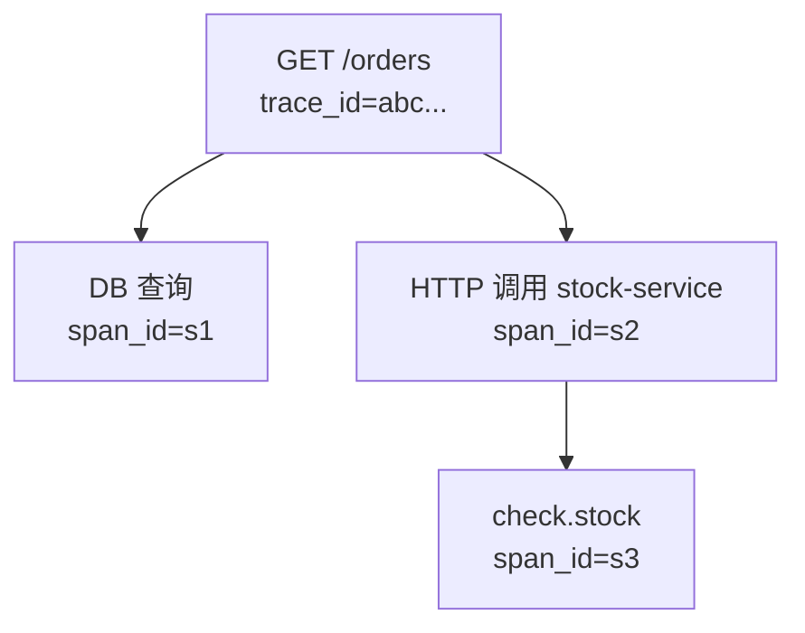
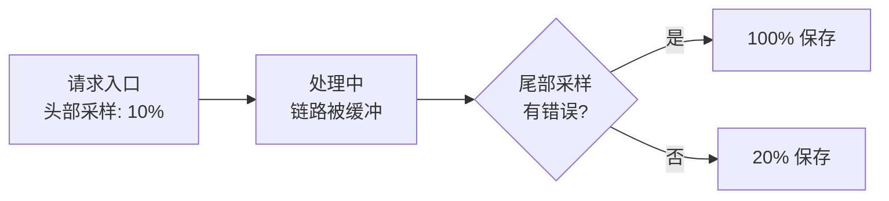
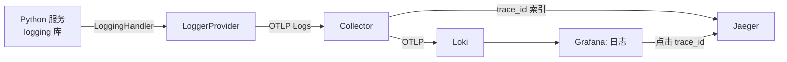
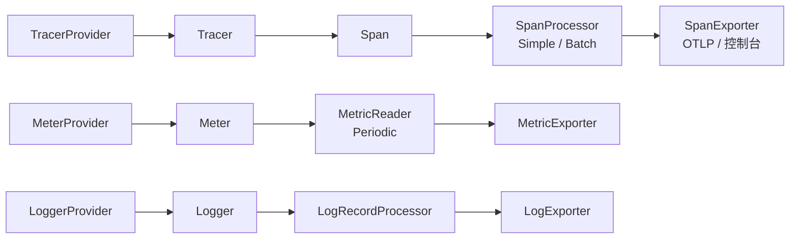
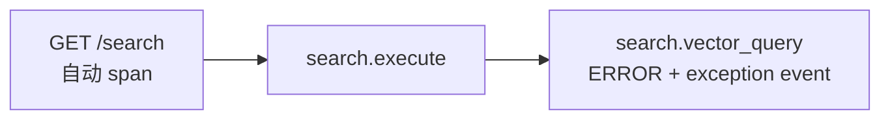

> 本篇你会得到：
>
> - Trace 的底层原理：Span、SpanContext、W3C Trace Context、Baggage、采样，以及"为什么有的链路就是串不起来"；
> - Metrics 的底层原理：五种 Instrument、Temporality、Aggregation、View 与 Exemplar；
> - Logs 的关联原理：LogRecord 如何带上 `trace_id` 与 `span_id`；
> - Semantic Conventions 与 Resource：为什么跨语言数据能长成同一个样子；
> - Collector 深入：管线、尾部采样、Agent 与 Gateway 架构；
> - 一个完整的 Python 实践：FastAPI 服务把 Traces、Metrics、Logs 全部接上，日志进入 Loki，点击 `trace_id` 直达 Jaeger，再配置尾部采样。
>
> 前置要求：跟上篇的实践环境（Docker Compose、Node、Go）跑通过；会最基本的 Python。
>
> 预计耗时：完整跟完约 120 分钟。

## 会跑之后，你遇到的第一批"为什么"

假设你已经把上篇的 demo 跑通，而且真的用在了自己的项目里。两周后，你大概率会撞上这些问题：

- 为什么明明加了 SDK，有的请求在 Jaeger 里只有入口一个 span，里面的数据库调用全不见了？
- 为什么指标的名字和 Prometheus 文档里对不上？`http.server.request.duration` 和 `http_server_duration_seconds` 到底哪个对？
- 为什么日志里有 `trace_id`，点击跳转却打不开链路？
- 为什么全量采样一个月后，存储账单让人想报警？可一旦采样，出问题的链路又抓不到？

这些问题，靠"会用"解决不了，得靠"理解"。中篇就是把上篇那台机器打开，看看里面的齿轮怎么转。

我们按"一条数据从产生到落地"的顺序讲：先 Trace，再 Metrics，再 Logs，然后讲它们共同的底座（语义约定与 Resource），最后讲中转站 Collector。

## Trace 深潜：一条链路到底是怎么串起来的

### Span：链路的最小单元

一切追踪都建立在 Span 上。一个 Span 代表**一段有时间范围的操作**："处理一次 HTTP 请求""执行一条 SQL""调用一次模型 API"，都行。

一个 Span 由这些部分组成：

| 字段                  | 含义                                                   | 示例                       |
| --------------------- | ------------------------------------------------------ | -------------------------- |
| name                  | 操作名                                                 | `GET /orders`              |
| context               | 自己的身份（trace_id + span_id + flags）               | 见下文                     |
| parent                | 父 Span 的引用                                         | 调用方的 span              |
| kind                  | 角色：CLIENT / SERVER / PRODUCER / CONSUMER / INTERNAL | SERVER                     |
| start_time / end_time | 开始与结束时间                                         | 毫秒精度以上               |
| attributes            | 键值对，描述这次操作                                   | `http.request.method: GET` |
| events                | 带时间戳的事件                                         | 一次重试、一次缓存命中     |
| status                | 结果：UNSET / OK / ERROR                               | ERROR                      |
| links                 | 关联到其他 Span（不构成父子关系）                      | 关联消息队列里的原始请求   |

Span 之间的父子关系构成一棵树，这棵树叫 Trace：



注意一个细节：**Trace 是树，不是线**。一个请求可能并行调用三个下游，产生三棵子树。所以"链路"这个名字有点误导，它其实是一棵有向树。

### SpanContext：身份三件套

每个 Span 都带着自己的身份，叫 SpanContext，由三部分组成：

- `trace_id`：16 字节（32 位十六进制字符），全局唯一，标识整棵树；
- `span_id`：8 字节（16 位十六进制字符），标识树上的某个节点；
- `trace_flags`：目前主要用一位——`sampled`（这条链路是否被采样保留）。

这三个值就是全链路关联的"主键"。日志、指标、链路要做关联，靠的就是把 `trace_id` 和 `span_id` 写进每条记录。

### W3C Trace Context：跨进程的身份证

问题来了：一个请求从 Node 服务发到 Go 服务，Go 怎么知道该把新 Span 挂在哪棵树下？

答案在 HTTP 头里。W3C Trace Context 标准定义了两个头。

`traceparent` 长这样：

```text
00-4bf92f3577b34da6a3ce929d0e0e4736-00f067aa0ba902b7-01
```

四段分别是：版本号（`00`）、trace_id（32 位 hex）、span_id（16 位 hex）、flags（`01` = sampled）。

`tracestate` 长这样：

```text
vendor1=opaque-value-1,vendor2=opaque-value-2
```

它是给**各厂商或团队留的私有扩展位**：比如 Datadog 想带上自己的内部 ID，就写在自己的 key 后面，不污染标准字段。

传播流程是这样的：

1. Node 服务的 SDK 发起 HTTP 调用前，把当前 SpanContext 序列化进 `traceparent` 头；
2. Go 服务的 SDK 收到请求时，解析 `traceparent`，把新 Span 的父节点设为上游；
3. 响应返回时同样会传播（用于异步或回调场景）；
4. `tracestate` 跟着走，但不参与父子关系判定。

这就是分布式追踪的魔法核心：**身份信息跟请求走，而不是存在某个中央数据库里。**

浏览器端也一样：网页里注入 SDK 后，从浏览器发出的请求也会带上 `traceparent`，于是"浏览器 → CDN → 网关 → 微服务 → 数据库"全链路串起来了。这也是 W3C 标准的意义：它不属于任何厂商，浏览器厂商、云厂商、网关厂商都实现它。

### Baggage：跨服务传业务上下文

有时候你不想只传"追踪身份"，还想传业务上下文，比如"当前用户是 VIP""这次请求来自 A/B 实验组 B"。OTel 提供了 Baggage：

```text
bageen=battlefield,jwt=eyJhbGciOiJIUzI1NiJ9
```

API 长这样：

```js
import { propagation } from '@opentelemetry/api'
import { createBaggage, setBaggage, getBaggage } from '@opentelemetry/api'

// 写入
const baggage = createBaggage().setEntry('tier', { value: 'vip' })
propagation.setBaggage(context.active(), baggage)

// 下游读取
const received = getBaggage(context.active())
const tier = received?.getEntry('tier')?.value
```

Baggage 强大，也危险，三个坑记住：

1. **容量有限**：头总长有上限（实践中超过 8KB 会被很多网关丢弃），别塞大对象；
2. **隐私风险**：Baggage 会跟着所有出站请求跑，把手机号塞进去等于把 PII 广播给每个下游和第三方；
3. **它不是指标属性**：默认情况下，Baggage 不会自动变成 span attribute，你需要显式把它写进 span 才能展示。

一句话：**Baggage 传"小、通用、不敏感"的上下文**。

### 采样：可观测性的经济学

全量采集在真实流量下不可持续。一个 QPS 1000 的服务，全量保存链路，一天就是 8600 万条 Span。所以采样不是可选项，是生产必需品。

采样发生在两个层面。

**头部采样（Head Sampling）**：请求还没处理完，在入口就决定"这条链路要不要"。优点是简单、开销小；缺点是决策时不知道后面会不会出错。常见实现：

- `always_on` / `always_off`：全采 / 全不采；
- `traceidratio`：按 trace_id 哈希抽固定比例（如 10%）。同一链路的所有服务用同一个 trace_id，因此会**一致地**采或不采；
- `parentbased_*`：默认跟随父 Span 的决定（上游没采样，下游也丢掉），避免"半条链路"。

**尾部采样（Tail Sampling）**：请求处理完，看到完整链路后再决定。优点是能"错误全采、正常抽采"；缺点是需要把链路缓冲一段时间（如 5 秒），有内存成本，通常做在 Collector 里。本篇实践会配置它。



### 为什么"链路串不起来"：六个高频原因

1. **中间有一个不带 OTel 的组件**（老服务、第三方 API、消息中间件）：它不解析也不重新生成 `traceparent`，链路就在那断掉。解法：看它支不支持标准头透传；不行就手动传播，或用下篇讲的 eBPF 零埋点。
2. **异步代码丢了 Context**：Node 的定时器、Python 的线程池、Go 的 goroutine 不会自动继承上下文。Node 用 AsyncLocalStorage 由 SDK 自动处理，但如果你把 Context 存进全局变量再取出来用，就断了。
3. **采样不一致**：上游没采，下游采了，或者反过来，就会出现"孤儿 Span"。生产上统一用 `traceidratio` 或父采样。
4. **HTTP 客户端没被埋点**：用了 SDK 但 fetch/axios/requests 的库没在自动埋点清单里，出站调用不带头。
5. **反向代理/网关改了头**：某些网关会去重或改写自定义头。确认网关透传 `traceparent` 和 `tracestate`。
6. **手动创建了根 Span**：代码里 `tracer.startSpan('x')` 没传父 Context，它就成了新根。要挂到当前请求下，必须用 `context.with` 或 `startActiveSpan`。

### 怎么确认你理解了

用 `curl -v http://localhost:8080/orders`，在输出里找到 `traceparent` 头，确认它的 trace_id 和 Jaeger 里这条链路的 trace_id 一致。然后故意把 Go 服务停掉再请求一次，观察 Jaeger 里出现的是"半条链路"——这就是传播断裂的样子。

## Metrics 深潜：指标到底是怎么"算"出来的

上篇你看到了 `orders_created_total`，现在把它拆开。

### Instrument（计量器）家族

OTel 定义了几种基础 Instrument，每种回答不同的问题：

| Instrument              | 类型             | 回答的问题             | 例子                 |
| ----------------------- | ---------------- | ---------------------- | -------------------- |
| Counter                 | 同步、单调递增   | 发生了多少次 / 多少量  | 订单数、请求字节数   |
| UpDownCounter           | 同步、可增可减   | 当前水位               | 在线连接数、队列长度 |
| Histogram               | 同步、记录分布   | 延迟 / 大小的分布      | P99 延迟、响应体大小 |
| ObservableCounter       | 异步、单调递增   | 由系统回调采集的计数   | CPU 总时间           |
| ObservableUpDownCounter | 异步、可增可减   | 由系统回调采集的水位   | 当前线程数           |
| ObservableGauge         | 异步、可任意变化 | 由系统回调采集的瞬时值 | 内存使用、温度       |
| Gauge                   | 同步、可任意变化 | 实验性：显式记录瞬时值 | 传感器读数           |

"同步"意味着应用代码主动调用（`counter.add(1)`）；"异步"意味着 SDK 定期回调你的函数拿值（比如每 30 秒调一次读取内存）。

### Temporality：同一个指标，两种时间观

这是指标最容易让人困惑的地方。

**Cumulative（累计）**：SDK 保存"从进程启动以来的总量"，每次导出都报累计值。Prometheus 就是这种模型：计数器只增不减（除非进程重启）。

**Delta（增量）**：SDK 只报"上次导出到现在这段时间的变化量"。Datadog、CloudWatch 等更适合这种模型。

同一个 `Counter`，用不同 Temporality 导出，曲线看起来完全不同。所以指标"对不上"经常不是 bug，而是**后端模型不同**。OTel 的做法是：SDK 按 OTLP 的默认（通常 Cumulative）采集，Exporter 或后端按需转换。

### Aggregation：值在 SDK 里怎么被压缩

一次请求记一个延迟值，直接全量发到后端不现实。SDK 会先聚合：

- **Sum**：把计数器加起来；
- **Last Value**：保留最新值（Gauge 用）；
- **Histogram（显式分桶）**：按预设桶记录计数，如 `<0.1s, <0.5s, <1s, <5s, +Inf`，后端由此估算分位数；
- **Exponential Histogram（指数直方图）**：桶按 2 的指数分布，高基数下更省内存、更精确，后端可算出更准的 P99。

View 是"自定义聚合规则"的入口：比如"只保留 `http.server.request.duration` 的 P50/P95/P99"，或"把某个指标改名"，或"过滤掉某个标签"。

### Exemplar：把指标和链路缝起来

指标太"薄"，丢失了单次请求的细节。Exemplar 是补救：**在聚合时，附带一个代表样本的 trace_id + span_id**。

比如直方图记录 1000 次请求延迟，其中桶 `<1s` 里可以挂一个"最慢那次请求"的 trace_id。点击 Prometheus 里的 Exemplar，就能跳到对应链路。这就是"指标能看到趋势，点击趋势能看到真相"的机制。

### 怎么确认你理解了

在上篇的 Prometheus 里打开 `orders_created_total`，把鼠标移到某个数据点上，看看有没有 Exemplar 图标。如果后端配置了与 Jaeger 的关联，点它就能跳链路。（本地 Prometheus 默认展示 Exemplar 需要看版本支持，看不到也不影响理解。）

## Logs 深潜：日志怎么不再是一座孤岛

### LogRecord：带身份的事件

OTel 的日志模型叫 LogRecord，核心字段：

| 字段                            | 作用                       |
| ------------------------------- | -------------------------- |
| timestamp / observed_timestamp  | 事件发生时间与观察到的时间 |
| body                            | 日志正文                   |
| severity_text / severity_number | 级别：INFO、WARN、ERROR……  |
| attributes                      | 结构化键值                 |
| trace_id / span_id              | **关联当前链路**           |

最后两个字段就是"日志孤岛问题"的解药：**只要日志是在某个 Span 上下文里打的，SDK 就自动把 trace_id 和 span_id 写进日志**。后端拿到后，日志就有了"出身"。

### Logs 与 Span Events 的区别

很多人纠结：日志和 span 上的 event 有什么区别？

- **LogRecord 属于日志信号**，是独立的数据流，量大、适合检索、进日志系统；
- **Span Event 属于 Trace 信号**，挂在具体 span 下，量小、有上下文、跟着链路走。

经验法则：**通用排障日志走 Logs，关键路径上的里程碑事件写进 Span Event**。比如"重试了 3 次"是 span event，"第 3 次重试失败，错误详情如下"是日志。

### 日志关联的完整链路



实践部分会把它完整跑通。先记住结论：**日志要带 trace_id 才能成为链路的入口，链路要能反查日志才能成为排障的出口**。

## Semantic Conventions 与 Resource：让数据说同一种语言

### 为什么属性名必须统一

如果 A 服务把 HTTP 方法叫 `method`，B 服务叫 `http_method`，你的告警规则就得写两套，跨服务关联就断了。Semantic Conventions（SemConv）就是**属性的字典**：

- `service.name`：服务名；
- `http.request.method`：HTTP 方法；
- `http.response.status_code`：状态码；
- `db.system`、`db.namespace`：数据库类型与库名；
- `gen_ai.provider.name`、`gen_ai.request.model`：AI 提供方与模型（下篇详述）；
- `user.id`：用户标识。

所有语言的 SDK 都按这本字典埋点，数据到了后端才能直接互认。

### Stable 与 Experimental：约定也有版本

SemConv 自己也在演进。约定分两种状态：

- **Stable（稳定）**：进入长期支持，名字不再随便改；
- **Experimental（实验）**：还在探索，可能改名，需要显式 `OTEL_SEMCONV_STABILITY_OPT_IN` 开启（GenAI 相关约定 2026 年正处于这个阶段）。

作为使用者，你要做的只有一件事：**跟着官方字典命名业务属性**，不要自己发明"同义词"。如果非要自定义，用命名空间前缀（如 `order.*`），避免和官方属性冲突。

### Resource：数据的名片

Resource 描述"这批数据来自谁"：

```text
service.name=order-service
service.version=1.0.0
deployment.environment=production
k8s.pod.name=order-abc123
host.name=node-01
```

SDK 支持自动探测：K8s 环境自动补 Pod/Node 信息，容器环境自动补容器 ID，云环境自动补实例 ID。有了 Resource，Collector 才能按服务、按环境路由和治理数据。

### Schema：约定的版本号

每个 Resource 还带一个 `SchemaURL`（如 `https://opentelemetry.io/schemas/1.30.0`）。它告诉后端"这份数据按哪个版本的字典命名"，后端可以据此做字段迁移。这是 OTel 为"约定会演进"留的保险丝。

## 自动埋点 vs 手动埋点：谁干什么活

### 自动埋点怎么工作

自动埋点不是魔法，是**插桩**：每个语言的 instrumentation 库会 hook 常见库的调用点。比如 Node 的 `@opentelemetry/instrumentation-http` 会包装 `http.request`，在发出请求前注入 `traceparent`，在响应回来时结束 span。Python 的 `opentelemetry-instrumentation-fastapi` 同理。

它能覆盖：HTTP 客户端/服务端、数据库驱动、消息队列、缓存、框架路由……而且**不改变业务行为**。

### 什么时候必须手动埋点

自动埋点覆盖不了"业务语义"：

- 这段逻辑算不算一个"下单"操作？
- 一次 Agent 决策的意图是什么？
- 一个缓存命中的分支走了哪条路？

这些必须手动建 span。实践中的比例大致是：**自动埋点覆盖 80% 的传输链路，手动埋点补齐 20% 的业务关键路径**。

## SDK 内部：Provider、Processor、Reader、Exporter

把上篇的 SDK 拆开，每个语言都一样，只是 API 名字略不同：



每个信号都遵循同一套模式：

1. **Provider** 是全局注册的工厂（`TracerProvider` / `MeterProvider` / `LoggerProvider`）；
2. **Processor/Reader** 决定数据如何被处理（批量还是立即发、多久发一次）；
3. **Exporter** 决定发给谁（OTLP、控制台、Jaeger、Prometheus……）；
4. 所有配置都可以用环境变量覆盖（`OTEL_SERVICE_NAME`、`OTEL_TRACES_SAMPLER`、`OTEL_EXPORTER_OTLP_ENDPOINT` 等）。

这意味着：**业务代码只碰 API，SDK 的采样率、导出地址、批处理策略全部可运维化**。这就是"零代码改可观测性配置"的根基。

## Collector 深潜：数据的中转与治理中心

### 管线模型

Collector 的每个 pipeline 都是三段式：

```yaml
receivers: # 怎么收
processors: # 怎么加工
exporters: # 发给谁
```

之前你已经用过 `otlp` receiver、`batch` processor、`debug`/`otlphttp`/`prometheus` exporters。生产上最常用的 processor：

| Processor        | 作用                                     |
| ---------------- | ---------------------------------------- |
| `batch`          | 攒一批再发，大幅降低后端压力（必须配）   |
| `memory_limiter` | 内存超限时丢数据保护进程（必须配）       |
| `resource`       | 给所有数据补 Resource 属性（环境、团队） |
| `attributes`     | 增删改属性（脱敏、加租户）               |
| `transform`      | 用 OTTL 做复杂转换（改名字、删字段）     |
| `filter`         | 按条件丢弃（如丢掉健康检查的链路）       |
| `tail_sampling`  | 尾部采样                                 |
| `k8sattributes`  | 把 K8s Pod 信息关联进数据                |

### Agent 还是 Gateway？

两种形态解决不同问题：

- **Agent**：跟应用同机部署（K8s 里是 DaemonSet），就近收数据。优点：应用与后端解耦、失败有本地缓冲；缺点：节点数多，治理分散。
- **Gateway**：集中部署（Deployment），统一接收 Agent 转发的数据。优点：统一做采样、脱敏、路由、鉴权、出口管控；缺点：单点压力，需要高可用。

标准生产形态是**两级：每节点 Agent + 集中 Gateway**。

### 高可用与数据保护

- Gateway 无状态，可以随便扩；
- Agent 崩溃不丢业务数据，最多丢遥测；
- Collector 自身指标要送监控（`prometheus` exporter 或 OTLP 到自监控）；
- 网络抖动时 SDK/Collector 有重试与背压，别关掉默认重试。

## 实践：Python 服务接满三信号 + 尾部采样

现在把 Python 加进来，补上日志关联和尾部采样两块拼图。

### 第一步：扩展基础设施（加 Loki）

在 `docker-compose.yml` 里加一个 Loki 服务：

```yaml
loki:
  image: grafana/loki:3.7.6
  command: ['-config.file=/etc/loki/local-config.yaml']
  ports:
    - '3100:3100'
```

（Loki 3.x 起原生支持 OTLP 日志接入，端口 3100 的 `/otlp/v1/logs`。）

在 Grafana 的 datasources 文件里追加：

```yaml
- name: Loki
  type: loki
  access: proxy
  url: http://loki:3100
  isDefault: false
```

再在 Collector 配置里给 logs pipeline 加上 Loki 导出：

```yaml
exporters:
  otlphttp/loki:
    endpoint: http://loki:3100/otlp

service:
  pipelines:
    logs:
      receivers: [otlp]
      processors: [batch]
      exporters: [debug, otlphttp/loki]
```

重启：

```bash
docker compose up -d
docker compose ps
```

### 第二步：Python 服务

```bash
mkdir -p python-app && cd python-app
python3 -m venv .venv
source .venv/bin/activate
pip install fastapi uvicorn
pip install opentelemetry-api opentelemetry-sdk opentelemetry-exporter-otlp-proto-http
pip install opentelemetry-instrumentation-fastapi
```

（2026 年 8 月验证版本：`opentelemetry-sdk 1.44.0`、`opentelemetry-instrumentation-fastapi 0.65b0`。依赖会自动带 instrumentation 所需的库。）

`app.py`：

```python
import logging
import random

import uvicorn
from fastapi import FastAPI
from opentelemetry import metrics, trace
from opentelemetry.exporter.otlp.proto.http.log_exporter import OTLPLogExporter
from opentelemetry.exporter.otlp.proto.http.metric_exporter import OTLPMetricExporter
from opentelemetry.exporter.otlp.proto.http.trace_exporter import OTLPSpanExporter
from opentelemetry.instrumentation.fastapi import FastAPIInstrumentor
from opentelemetry.sdk._logs import LoggingHandler, LoggerProvider
from opentelemetry.sdk._logs.export import BatchLogRecordProcessor
from opentelemetry.sdk.metrics import MeterProvider
from opentelemetry.sdk.metrics.export import PeriodicExportingMetricReader
from opentelemetry.sdk.resources import SERVICE_NAME, Resource
from opentelemetry.sdk.trace import TracerProvider
from opentelemetry.sdk.trace.export import BatchSpanProcessor
from opentelemetry.trace import Status, StatusCode

resource = Resource.create(
    {SERVICE_NAME: "search-service", "service.version": "1.0.0"}
)

# Traces
trace_provider = TracerProvider(resource=resource)
trace_provider.add_span_processor(
    BatchSpanProcessor(OTLPSpanExporter())
)
trace.set_tracer_provider(trace_provider)

# Metrics
meter_provider = MeterProvider(
    resource=resource,
    metric_readers=[
        PeriodicExportingMetricReader(OTLPMetricExporter(), export_interval_millis=5000)
    ],
)
metrics.set_meter_provider(meter_provider)
meter = metrics.get_meter("search-service")
search_latency = meter.create_histogram(
    "search.latency",
    unit="ms",
    description="搜索耗时",
)
search_count = meter.create_counter("search.count")

# Logs
logger_provider = LoggerProvider(resource=resource)
logger_provider.add_log_record_processor(
    BatchLogRecordProcessor(OTLPLogExporter())
)
logging.basicConfig(level=logging.INFO)
logging.getLogger().addHandler(LoggingHandler(level=logging.INFO, logger_provider=logger_provider))
logger = logging.getLogger("search-service")

app = FastAPI()
tracer = trace.get_tracer("search-service")


@app.get("/search")
def search(q: str, fail: bool = False):
    with tracer.start_as_current_span("search.execute") as span:
        span.set_attribute("search.query", q)
        latency = random.uniform(5, 500)

        # 模拟一个子操作：向量检索
        with tracer.start_as_current_span("search.vector_query") as child:
            child.set_attribute("db.system", "qdrant")
            if fail:
                child.record_exception(Exception("vector db timeout"))
                span.set_status(Status(StatusCode.ERROR))
                logger.error("search failed q=%s", q, extra={"query": q})
                return {"error": "vector db timeout"}, 500

        search_latency.record(latency)
        search_count.add(1, {"result": "hit"})
        span.set_attribute("search.latency_ms", latency)
        logger.info("search done q=%s latency=%.1fms", q, latency, extra={"query": q})
        return {"q": q, "hits": random.randint(0, 20)}


FastAPIInstrumentor.instrument_app(app)

if __name__ == "__main__":
    uvicorn.run(app, host="0.0.0.0", port=8082)
```

说明：

- `FastAPIInstrumentor.instrument_app(app)` 自动给每个 HTTP 请求生成 server span；
- 手动 span `search.execute` 挂在自动 span 下，表达"这一步是搜索业务"；
- 子 span `search.vector_query` 里 `record_exception` 会写 span event 并把状态置为 ERROR；
- `LoggingHandler` 把 Python 标准日志接到 OTel 的 LoggerProvider，日志自动带上当前 span 的 `trace_id`；
- `search.latency` 和 `search.count` 是手动指标。

跑起来：

```bash
python app.py
```

### 第三步：验证日志关联

制造正常和失败两种流量：

```bash
for i in 1 2 3 4 5; do curl -s "http://localhost:8082/search?q=otel"; echo; done
curl -s "http://localhost:8082/search?q=broken&fail=1"; echo
```

打开 Grafana http://localhost:3000，进 Explore，选 Loki 数据源，查询：

```logql
{service_name="search-service"}
```

你会看到两条日志：`search done` 和 `search failed`，且**都带 trace_id**。点开 `search failed` 日志里的 trace_id（Grafana 配置了 Jaeger 数据源后会自动生成链接），跳进 Jaeger，你会看到：



这就是"日志 → 链路"的闭环。再切回 Prometheus，查询：

```promql
search_latency_seconds_bucket
search_count_total
```

你的 Python 指标也进来了。到此，三信号齐全。

### 第四步：尾部采样

把 Collector 的 traces pipeline 加上 `tail_sampling`：

```yaml
processors:
  tail_sampling:
    decision_wait: 5s
    num_traces: 1000
    expected_new_traces_per_sec: 20
    policies:
      - name: errors-always
        type: status_code
        status_code:
          status_codes: [ERROR]
        percentage: 100
      - name: sample-rest
        type: probabilistic
        probabilistic:
          sampling_percentage: 20

service:
  pipelines:
    traces:
      receivers: [otlp]
      processors: [tail_sampling, batch]
      exporters: [debug, otlphttp/jaeger]
```

重启 Collector 后，连续打 20 次正常请求 + 2 次失败请求，去 Jaeger 数一下：**失败的都在，正常的只有约 20%**。这就是"错误全保、正常抽采"的生产级策略雏形。

### 怎么确认这一步对了

- Loki 里能看到带 trace_id 的日志，点 trace_id 能跳 Jaeger；
- Prometheus 里有 `search_latency` 与 `search_count` 指标；
- 尾部采样生效：正常链路约 20%，错误链路 100%。

## 常见坑速查（中篇）

| 症状                     | 原因                                                             | 解法                                                                                                 |
| ------------------------ | ---------------------------------------------------------------- | ---------------------------------------------------------------------------------------------------- |
| 日志没带 trace_id        | LoggingHandler 与当前 Context 没关联，或日志在 span 外打的       | 确认在请求处理函数里打日志；不要用全局缓存的 logger 在异步线程里打                                   |
| 指标数字和后端对不上     | Temporality 模型不同                                             | 检查后端期望 Delta 还是 Cumulative；必要时在导出端转换                                               |
| 尾部采样没生效           | 忘记 `parentbased` 会导致子 span 独立决策，或 decision_wait 太短 | 采样放 Collector 时，SDK 端用 `always_on` 或 `traceidratio`，把决策权交给 Collector                  |
| `traceparent` 被网关改掉 | 反向代理去重或改写                                               | 配置网关透传标准头                                                                                   |
| 异步任务里 span 断掉     | Context 没传进线程/任务                                          | Node 用 AsyncLocalStorage（SDK 默认），Python 用 `context.attach` 或传递 `trace_id`，Go 显式传 `ctx` |

## 小结

中篇之后，你拥有的不是"会配 OTel"，而是一张完整的原理图：

- **Trace**：Span 是节点，Context 是胶水，`traceparent` 是跨进程的身份证，采样是经济学；
- **Metrics**：Instrument 决定语义，Temporality 决定时间观，Aggregation 决定压缩方式，Exemplar 决定怎么跳回链路；
- **Logs**：LogRecord 带上 `trace_id` 就从孤岛变成入口；
- **SemConv + Resource**：约定让数据互认，名片让数据可区分；
- **Collector**：Receiver/Processor/Exporter 三段管线，尾部采样与两级部署是生产标配。

下篇我们走出"单个服务怎么接入"，进入"整个系统怎么规划"：后端怎么选型、生产怎么治理、eBPF 零埋点和 Profiling 第四信号怎么用，以及 AI 时代最重要的一块——**GenAI 可观测性**。

## 自测题

1. `traceparent` 的四个字段分别是什么？为什么采样决策要写在 flags 里？
2. 头部采样和尾部采样各自的决策时机与代价是什么？什么场景必须用尾部采样？
3. Counter 和 UpDownCounter 的语义区别是什么？举个例子说明什么时候不能用 Counter。
4. Cumulative 和 Delta 的区别是什么？为什么 Prometheus 喜欢 Cumulative？
5. 日志为什么要带 trace_id？它和 span event 的分工是什么？
6. 如果团队里有人把业务属性随意命名（如 `uid`、`user_id`、`userId` 混用），你会怎么说服他改用 SemConv？

## 练习任务

1. 完成 Python 实践，三信号 + 日志跳链路全部跑通。
2. 给 `search.latency` 加一个 View：把直方图改成指数直方图，对比 Prometheus 里的 bucket 变化。
3. 在 Node 服务里把 Baggage 写入 `tier=vip`，在 Python 服务里读出来并写进 span attribute，验证跨语言传递。
4. 配置 `memory_limiter` 和 `filter`：把健康检查路径的链路在 Collector 里过滤掉。
5. 读一遍 `docker compose logs otel-collector`，找出 batch processor 和 tail_sampling 的实际效果（吞吐、丢弃）。

## 附录：本篇新增命令与配置

```bash
# 基础设施（新增 Loki）
docker compose up -d

# Python
cd python-app
source .venv/bin/activate
python app.py

# 流量
for i in 1 2 3 4 5; do curl -s "http://localhost:8082/search?q=otel"; echo; done
curl -s "http://localhost:8082/search?q=broken&fail=1"; echo

# Loki 查询（Grafana Explore）
{service_name="search-service"}

# 指标
search_latency_seconds_bucket
search_count_total
```

文件清单：`python-app/app.py`，以及更新后的 `docker-compose.yml`、`otel-collector.yaml`、`grafana-datasources.yaml`。

下一篇：《OpenTelemetry 下篇：从落地到整个生态链》。
