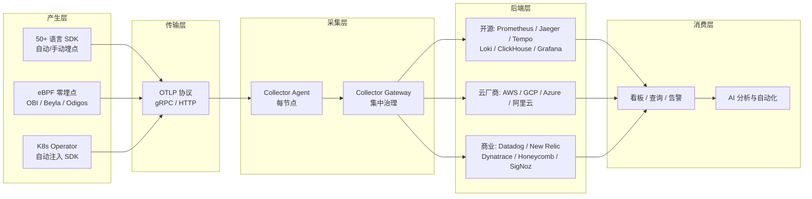
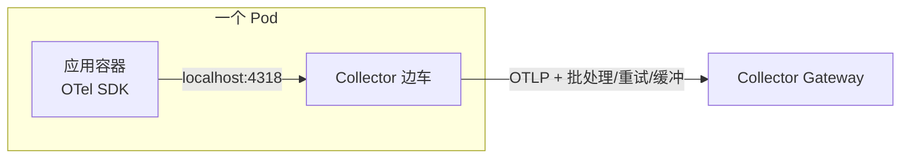
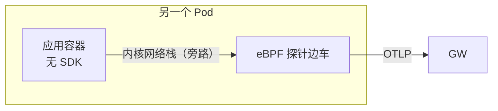
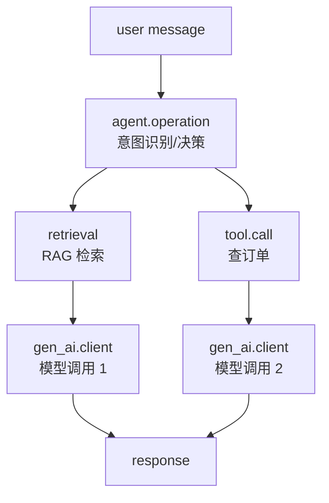
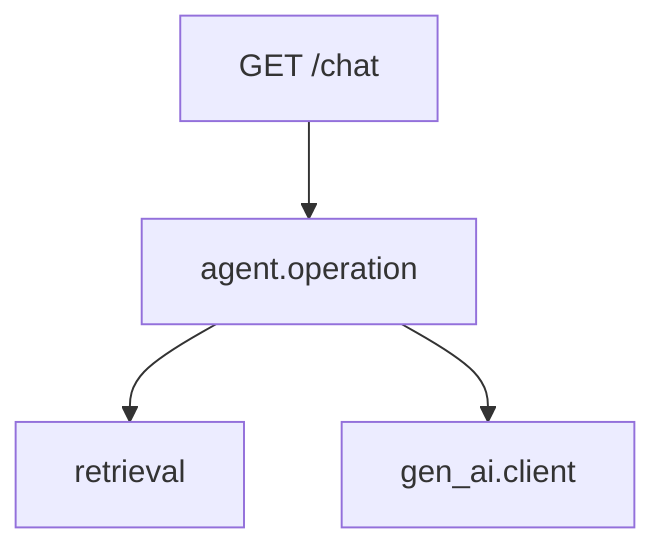
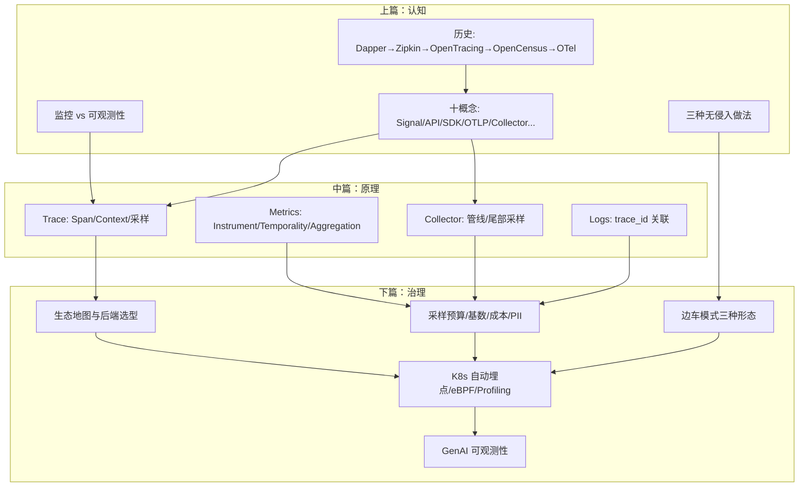

> 本篇你会得到：
>
> - 一张完整的生态地图：SDK → OTLP → Collector → 后端，每一环都有谁、怎么选；
> - 开源、商业、云厂商后端选型对照表，外加一套可复用的选型问题；
> - 生产落地工程：采样预算怎么算、基数怎么控制、成本怎么治理、PII 怎么脱敏、K8s 怎么自动埋点；
> - 边车模式在生产里的三种形态，彻底说清"边车到底在干嘛"；
> - eBPF 零埋点与 Profiling 第四信号的现状与适用场景；
> - AI 时代最重要的一章：GenAI 可观测性——用 `gen_ai.*` 语义约定看清每次 LLM 调用的输入、输出、成本与 Agent 决策链；
> - 一个生产风格完整演练：本地跑通"Agent 编排 + RAG 检索 + LLM 调用"的可观测链路。
>
> 前置要求：完成上篇与中篇的实践；了解三信号与 Collector 的基本概念。
>
> 预计耗时：完整跟完约 120 分钟。

## 先回答一个现实问题：一个人会了，有什么用

前两篇我们完成了一个人的跨越：先会跑，再懂原理。但真实世界的可观测性从来不是一个人的事，也不是一台机器的事。它是一个**生态**：

- 公司有几十个服务，用了五种语言、三个云、两套遗留系统；
- 后端要从 Jaeger、Prometheus、Grafana 全家桶、Datadog、云厂商里选，还可能中途换；
- 数据量从每天几 GB 涨到每天几 TB，账单开始上新闻；
- AI 应用上线了，模型调用比数据库还贵，而且它"犯错"的方式跟代码 bug 完全不一样；
- 你还要说服老板、说服同事，让大家按同一套标准干活。

下篇就是为这个现实准备的，分四块：**生态地图 → 后端选型 → 生产治理 → AI 时代**，最后用一个完整演练把整个系列串起来。

## 生态全景图：从埋点到 AI 分析，每一环是谁

先看全局。2026 年的 OpenTelemetry 生态长这样：



一句话总结：**OpenTelemetry 自己不做"最后一公里的展示"，它做的是从产生到传输到采集的公共底座**。所有后端都争着接入 OTLP，因为谁接得好，谁就能成为最终被选中的那个"消费层"。

这正是 2026 年 5 月 OpenTelemetry 从 CNCF 毕业时行业对它的评价：**厂商不再比拼"谁的遥测采集得好"，而是比拼"谁能在大家都能拿到的遥测之上做出更好的价值"**。

### 产生层：不只是语言 SDK

除了主流语言的 SDK，2026 年的"产生层"还有三股新力量：

1. **K8s Operator**：通过 CRD 声明式注入 SDK 和 Collector，Pod 无感接入；
2. **eBPF 零埋点（OBI）**：不碰应用代码、不改依赖，在协议层直接抓取 HTTP/gRPC/数据库调用；
3. **Profiling Agent**：eBPF 剖析器采集 CPU/内存火焰图数据，作为第四信号。

### 传输层：OTLP 是唯一的普通话

OTLP 同时支持 gRPC 与 HTTP，一套协议承载 Traces、Metrics、Logs、Profiles。它成功靠三个设计：

- **统一**：所有信号一个协议，SDK 到 Collector、Collector 到后端都是它；
- **可扩展**：protobuf 定义，向后兼容，未来加新信号不用推翻重来；
- **中立**：由 CNCF 治理，不属于任何厂商。

### 采集层：Collector 的双层架构

生产标准形态是"每节点 Agent + 集中 Gateway"。Agent 就近收、失败缓冲；Gateway 统一采样、脱敏、路由、鉴权、出口管控。下面生产实践会给出完整 Gateway 配置。

## 后端选型：开源全家桶、商业产品还是云厂商

选后端是团队最贵、最难回头的决策。先把主流选项摆开。

### 开源全家桶（自托管）

| 组件                    | 负责什么           | 一句话点评                                                    |
| ----------------------- | ------------------ | ------------------------------------------------------------- |
| Prometheus              | 指标存储与查询     | 事实标准，但单机有容量上限；高可用需要 Mimir/Thanos           |
| Jaeger                  | 链路存储与查询     | 轻量，v2 已基于 OTel Collector，OTLP 原生                     |
| Grafana Tempo           | 链路存储与查询     | 面向超大链路量，依赖对象存储，支持 trace 与 logs/metrics 关联 |
| Loki                    | 日志存储与查询     | 标签索引 + 压缩块，性价比高，3.x 原生收 OTLP                  |
| Grafana                 | 统一 UI            | 一个面板看三信号                                              |
| ClickHouse              | 列式 OLAP          | 给"想自己造后端"的团队，性能怪兽，社区有 OTel 数据模型        |
| VictoriaMetrics / Mimir | 高可用指标         | 指标量大时的扩容方案                                          |
| SigNoz                  | 开箱即用 OTel 后端 | 想"开源版 Datadog"就选它，自带告警和看板                      |

自托管的成本不是软件，是**人**：升级、容量、高可用、数据迁移全要自己扛。适合有运维能力、数据敏感、或者想控制长期成本的中大型团队。

### 商业产品

| 产品             | 特点                         | 适合谁                       |
| ---------------- | ---------------------------- | ---------------------------- |
| Datadog          | 全家桶、生态最全、APM 成熟   | 大厂、混合云、愿意付费买时间 |
| New Relic        | 全栈、SaaS、有免费额度       | 中小团队快速起步             |
| Dynatrace        | 自动化程度高、AI 能力强      | 大型企业 IT                  |
| Honeycomb        | 高基数事件驱动、追问式分析强 | 想做"高保真可观测性"的团队   |
| Splunk / Elastic | 日志起家，OTLP 接入成熟      | 已有 SIEM/日志体系的组织     |
| Grafana Cloud    | 开源全家桶的托管版           | 想用 Grafana 栈又不想运维    |
| SigNoz Cloud     | OTel 原生 SaaS               | 预算有限的团队               |

商业产品的核心价值不是"采集"，而是**消费层**：查询体验、告警智能、成本洞察、AI 辅助排障。

### 云厂商

| 云           | 接入方式                    | 后端                                                      |
| ------------ | --------------------------- | --------------------------------------------------------- |
| AWS          | ADOT（AWS Distro for OTel） | X-Ray + CloudWatch + Managed Prometheus + Managed Grafana |
| Google Cloud | 官方 OTel 集成              | Cloud Monitoring + Cloud Trace + Cloud Logging            |
| Azure        | Azure Monitor OpenTelemetry | Application Insights + Log Analytics                      |
| 阿里云       | ARMS 支持 OTLP              | ARMS + Prometheus 托管 + SLS                              |

云厂商的优点是零运维、与云资源集成深（自动补实例/集群信息）；缺点是锁定，且跨云统一时体验割裂。多云的团队通常选"云上采集、自建或商业后端汇聚"。

### 选型框架：问自己四个问题

1. **数据量级**：每天多少 Span、多少日志？百万级和 TB 级是完全不同的架构；
2. **基数（Cardinality）**：你有没有用户级、请求级的高基数维度？Prometheus 单实例最怕这个，Honeycomb 最擅长这个；
3. **运维能力**：团队有人能养 ClickHouse 和 Tempo 吗？没有就选 SaaS 或云托管；
4. **未来需求**：要不要 GenAI 可观测性？要不要 eBPF/Profiling？后端对 OTLP 的原生支持程度，决定了你今天写的埋点明天能不能带走。

最后一个问题特别关键：**选择后端时，永远让"OTLP 原生接入"成为硬条件**。这样埋点层和后端解耦，未来换后端不重写埋点——这是 OpenTelemetry 给团队最大的期权。

## 生产落地：从 demo 到能治理的工程

demo 和生产之间隔着一整座山。这座山有五个必经关口。

### 关口一：采样预算

先算账，再谈方案。假设：

- 业务高峰 5000 QPS；
- 每个请求平均 30 个 Span；
- 单个 Span 序列化后约 1 KB；
- 希望链路保留 30 天。

全量存储一天：5000 × 30 × 1KB × 86400 秒 ≈ 12.4 TB/天。任何团队都扛不住。

生产常见组合：

- **入口 10% 固定采样**（`traceidratio`，跨服务一致）+ **尾部采样保错误**（Collector `tail_sampling`）；
- 关键业务（支付、登录、AI 调用）单独通道，采样率提到 100% 或 50%；
- 低价值环境（测试、压测）降到 1% 甚至 0；
- 按保留时长分层：热数据 30 天、冷数据 90 天、聚合 1 年。

算出你的预算公式：`每天可存 Span 数 = 预算 / 单 Span 成本`，然后反推采样率。这个公式要写进团队文档，不然三个月后没人记得为什么是 10%。

### 关口二：基数控制

指标系统最怕高基数标签。`user_id`、`request_id`、`session_id` 这类**每请求都变**的标签一旦上指标，Prometheus 的序列数会爆炸（10 万用户 × 10 个接口 = 百万级序列）。

铁律：

- **指标（Metrics）只带低基数标签**：服务、接口、状态码、租户、版本；
- **高基数信息放 Span attribute 和日志里**，那里没有基数上限；
- 给属性加白名单，Collector 里用 `attributes` / `transform` processor 删除不该上指标的高基数属性；
- 用视图（View）在 SDK 侧就限制：哪些属性允许参与聚合。

### 关口三：成本治理

成本大头通常按这个顺序出现：

1. **日志**：最容易失控，先治理；
2. **链路**：采样率决定一切；
3. **指标**：基数决定一切；
4. **Profiling**：2026 年还新，等它进入稳定再全量铺。

具体手段：

- 日志分级：DEBUG 不进生产后端，ERROR 全量、INFO 按需、访问日志抽样；
- 体积控制：日志正文截断、重复日志合并（如"同一错误 1000 次"压缩成一条带计数的）；
- 属性裁剪：Collector 里删掉大字段（如响应体）；
- 分环境路由：测试环境数据送低配后端或不落盘；
- 用 `filter` processor 丢掉健康检查、探针、压测流量的遥测。

### 关口四：安全与隐私

可观测性数据是**敏感数据的重灾区**：日志里可能带手机号，Span 属性里可能带 SQL 参数，AI 调用里可能带用户原文。

治理动作：

1. **埋点层克制**：不要把请求体、响应体自动进属性；默认只留方法、路由、状态码；
2. **Collector 脱敏**：`attributes` / `transform` processor 对 `password`、`token`、`id_card` 等字段做 hash 或删除；
3. **传输加密**：SDK 与 Collector、Collector 与后端之间全程 TLS；
4. **权限隔离**：按团队、环境分 Collector 出口；生产链路权限与日志权限分离；
5. **浏览器隐私**：Web SDK 默认不采集敏感字段；Baggage 严禁携带 PII；
6. **审计**：谁改了采样配置、谁导出了原始链路，都要有记录。

### 关口五：K8s 自动埋点

K8s 上给几百个 Pod 手动加 SDK 不现实。用 OpenTelemetry Operator：

```yaml
apiVersion: opentelemetry.io/v1alpha1
kind: Instrumentation
metadata:
  name: my-instrumentation
spec:
  exporter:
    endpoint: http://otel-collector:4318
  propagators:
    - tracecontext
    - baggage
  sampler:
    type: parentbased_traceidratio
    argument: '0.1'
```

然后在目标 Deployment 上打一个注解：

```yaml
spec:
  template:
    metadata:
      annotations:
        instrumentation.opentelemetry.io/inject-java: 'true'
        instrumentation.opentelemetry.io/inject-python: 'true'
        instrumentation.opentelemetry.io/inject-nodejs: 'true'
```

Operator 通过 Mutating Webhook 自动注入 SDK 环境变量与 sidecar，业务代码零改动。注意：**自动注入的采样率要全局统一**，否则不同 Pod 之间链路会"半采半不采"。

## 边车模式在生产里到底怎么搭

上篇讲了"不改代码"的三种做法，这里把边车模式展开。你可能会听到两种说法："用边车采集数据"和"用边车转发数据"，它们不是一回事。

### 三种边车，三种分工

**第一种：转发边车（Collector Agent sidecar）。** 应用容器里装了 OTel SDK，SDK 把数据发给同 Pod 里的 Collector 容器（`localhost:4318`），Collector 加工后转发给 Gateway。边车在这里是"小区门口的中转站"，不产生数据，只负责收、处理、传。



这种形态解决什么问题？应用不再需要知道后端在哪、用什么协议、要不要重试。SDK 只认 `localhost:4318`，边车认 Gateway。换后端、加采样、做脱敏，全在边车这一层完成，应用完全无感。

**第二种：eBPF 边车（零埋点）。** 应用容器里什么都没有，边车里跑一个 eBPF 探针（Beyla/OBI/Odigos），它挂在内核网络栈上旁路观察应用发出的 HTTP/gRPC 流量，自己生成 span 再发出去。



**第三种：注入边车（Operator 干的活）。** K8s Operator 在创建 Pod 时自动往里面塞 SDK 环境变量（有时候还会塞一个 Collector 边车）。你什么都没写，Pod 创建出来就自带观测能力。

三种不是互斥的，同一个集群里经常混用：新服务用 Operator 注入 SDK，遗留服务用 eBPF 边车，Gateway 统一收口。

### 边车 vs DaemonSet：什么时候用哪个

Collector 放边车还是放节点级 DaemonSet，是个经典问题：

|          | 边车（每 Pod 一个）                | DaemonSet（每节点一个）      |
| -------- | ---------------------------------- | ---------------------------- |
| 资源开销 | 高：每个 Pod 多一个容器            | 低：一个节点一个             |
| 隔离性   | 好：应用各自独立、互不干扰         | 共享，一个出问题影响全节点   |
| 适用场景 | 高价值服务、需要独立限流/采样/配额 | 海量低价值 Pod、想控制总成本 |
| 典型配置 | 资源多、带 memory_limiter          | 轻量、只做转发               |

我的建议：**先 DaemonSet 起步，给高价值服务单独配边车**。别一上来全员边车，成本翻倍。

### eBPF 边车的几个现实问题

再补充几个 eBPF 边车实际部署时绕不开的点：

- **需要特权**：eBPF 探针要挂内核钩子，容器需要 privileged 权限或特定 capability，安全团队一般会问一句"为什么"；
- **加密流量**：TLS 流量在 eBPF 里看到的是密文，要么配中间人解密，要么接受"只能看到连接级信息"；
- **看不到业务语义**：它不知道"这是 VIP 用户的下单"，这是和 SDK 最大的差距；
- **成熟度**：OBI 2025 年底才发布首个 Alpha，大规模生产前要压测。

## eBPF 零埋点：没有 SDK 的世界

总有你碰不到的应用：老服务、第三方二进制、找不到源码的组件。eBPF 方案在 2025 年底迎来里程碑：OpenTelemetry 官方把 Grafana Labs 捐赠的 Beyla 整合为 **OpenTelemetry eBPF Instrumentation（OBI）**，2025 年 11 月发布首个 Alpha。

它的原理是**在协议层观察**：eBPF 钩子挂在内核网络栈上，解析 HTTP/gRPC/TLS 流量，直接生成 span，完全不进应用进程。

适用场景：

- 无法改代码的遗留系统；
- 语言没有成熟 SDK（或不想引入依赖）；
- 想快速摸底"我的系统里到底有哪些调用关系"；
- 覆盖 DNS、TLS 握手、数据库协议等 SDK 不易覆盖的层。

局限也说清楚：

- 看不到应用内部业务语义（拿不到"这笔订单是哪个用户"）；
- 加密流量需要配置解密的中间人代理；
- TLS/HTTP2 解析在不同内核版本上有兼容性坑；
- 2026 年仍是 Alpha，生产大规模使用要评估。

正确姿势是**组合**：核心服务用 SDK（有业务语义），外围和遗留系统用 eBPF（有覆盖），两边数据在 Collector 汇聚，用统一的 OTLP 和 SemConv 对齐。

## Profiling：正在成型的第四信号

2026 年 3 月，OpenTelemetry Profiling SIG 宣布 Profiles 信号进入公开 Alpha。它回答的是三支柱都回答不了的问题：**代码层面的资源到底花在哪**。

- 火焰图告诉你"CPU 时间都烧在哪个函数"；
- 它可以和 Trace 双向关联：这条慢链路里，哪个函数最贵；
- 官方同时提供 eBPF 剖析器，Linux 上无需改代码即可采集大部分语言；
- 2026 年 7 月起 Collector 已支持 Profiles 管道（v0.148+），但生产级后端仍在成熟中。

现在的建议：**试点**。把 Profiling 接到一个关键服务上，用它回答"这个 P99 到底是等待还是计算"，但别在 2026 年把它当生产 SLA 依赖。

## AI 时代：GenAI 可观测性

这是下篇最重要的一章，也是整个系列在开篇埋下的问题：**AI 应用到底该观测什么？**

### 传统信号解决不了的新问题

传统三支柱能告诉你"模型调用慢了、超时了"，但回答不了：

- 这次回答用了哪个模型、哪个版本、哪条提示词？
- 检索（RAG）拿回了哪些片段，为什么模型选了错误的那个？
- Agent 做了哪几步决策？哪一步把上下文搞坏了？
- 这一次调用花了多少 token、多少钱？
- 用户输入里有没有注入攻击、有没有敏感数据？

这些答案藏在**应用语义**里，不在 HTTP 层。所以 GenAI 可观测性 = 传统可观测性 + 一组描述"AI 操作"的标准字段。

### gen_ai.\* 语义约定

OpenTelemetry 社区正在制定 GenAI 语义约定（Semantic Conventions for GenAI），核心是用一套统一属性描述 LLM 调用：

```text
gen_ai.provider.name            # 提供方：openai、anthropic、ollama……
gen_ai.request.model            # 请求的模型：gpt-4o、claude-sonnet……
gen_ai.request.max_tokens       # 最大生成长度
gen_ai.usage.input_tokens       # 输入 token 数
gen_ai.usage.output_tokens      # 输出 token 数
gen_ai.response.model           # 实际响应的模型（可能被降级）
gen_ai.operation.name           # 操作：chat、embeddings……
gen_ai.input.messages           # 输入消息（可含敏感内容，谨慎）
gen_ai.output.messages          # 输出消息
```

加上 Agent 层面的约定（`gen_ai.agent.*`），可以把"用户问题 → Agent 决策 → 工具调用 → 检索结果 → 模型输入 → 模型输出"完整记录成一棵 span 树。

**2026 年的状态要说清楚**：GenAI 语义约定仍处于 Experimental / Stable Preview 阶段，需要显式开启：

```bash
export OTEL_SEMCONV_STABILITY_OPT_IN=gen_ai_latest_experimental
```

预计很快进入 Stable，但今天写代码时就要按这套命名来，避免以后迁移。

### 开源生态：OpenInference、Langfuse 与朋友们

AI 可观测性的开源生态已经成型：

| 项目                           | 定位                                 | 与 OTel 的关系                                              |
| ------------------------------ | ------------------------------------ | ----------------------------------------------------------- |
| OpenInference（Arize Phoenix） | LLM 追踪格式与本地分析平台           | 基于 OTel 扩展，可直接导 OTLP，Phoenix 本身就是个 OTLP 后端 |
| Langfuse                       | LLM 全生命周期（追踪 + 评测 + 成本） | 支持 OTel/OTLP 接入                                         |
| OpenLLMetry（Traceloop）       | 一键埋点 OpenAI/LangChain 等         | 生成 OTel 兼容 span                                         |
| Laminar / Helicone 等          | LLM 网关与追踪                       | 多数支持 OTLP                                               |

选型建议：**团队要的是"标准"就选 OpenInference（和 OTel 最贴近）；要的是"开箱即用产品"就选 Langfuse；两者可以共存**——数据都往 OTLP 里灌，看板随便换。

### 一个 AI 链路的理想 span 树



每一层都带自己的属性：检索层带 `db.system=qdrant` 和命中片段 ID；模型层带 `gen_ai.*`；工具层带工具名与参数。有了这棵树，你才能回答 AI 应用最核心的问题：**这个回答是"想"出来的，还是"找"出来的，还是"编"出来的？**

## 实践：生产风格完整演练（含 LLM 服务）

把全系列知识装进一个场景：一个 AI 客服服务，做"意图判断 → 检索 → 模型回答"，带成本指标和日志关联，再配上生产级 Collector 治理。

### 第一步：本地起一个"LLM 后端"

为了让课程不依赖任何 API Key，我们做一个可切换的实现：

- 设置 `OPENAI_API_KEY` 就用真实的 OpenAI 兼容接口（任何兼容端点都行，包括本地 vLLM/Ollama）；
- 没设置就返回模拟响应，但**照样生成真实的 gen_ai 属性与 token 用量**，可观测链路完全一致。

新建 `ai-app/`：

```bash
mkdir -p ai-app && cd ai-app
python3 -m venv .venv && source .venv/bin/activate
pip install fastapi uvicorn opentelemetry-api opentelemetry-sdk opentelemetry-exporter-otlp-proto-http
```

`ai_app.py`：

```python
import json
import os
import random

import uvicorn
from fastapi import FastAPI
from opentelemetry import metrics, trace
from opentelemetry.exporter.otlp.proto.http.metric_exporter import OTLPMetricExporter
from opentelemetry.exporter.otlp.proto.http.trace_exporter import OTLPSpanExporter
from opentelemetry.sdk.metrics import MeterProvider
from opentelemetry.sdk.metrics.export import PeriodicExportingMetricReader
from opentelemetry.sdk.resources import SERVICE_NAME, Resource
from opentelemetry.sdk.trace import TracerProvider
from opentelemetry.sdk.trace.export import BatchSpanProcessor

resource = Resource.create({SERVICE_NAME: "ai-agent-service"})

trace_provider = TracerProvider(resource=resource)
trace_provider.add_span_processor(BatchSpanProcessor(OTLPSpanExporter()))
trace.set_tracer_provider(trace_provider)

meter_provider = MeterProvider(
    resource=resource,
    metric_readers=[PeriodicExportingMetricReader(OTLPMetricExporter(), export_interval_millis=5000)],
)
metrics.set_meter_provider(meter_provider)
meter = metrics.get_meter("ai-agent-service")
token_counter = meter.create_counter("gen_ai.tokens", unit="token")
cost_counter = meter.create_counter("gen_ai.cost", unit="USD")

app = FastAPI()
tracer = trace.get_tracer("ai-agent-service")


def call_llm(prompt: str, span, model="gpt-4o-mini"):
    """一次真实的 LLM 调用，走 gen_ai 语义约定。"""
    input_tokens = len(prompt) // 3
    output_tokens = random.randint(50, 200)
    span.set_attributes({
        "gen_ai.provider.name": "mock" if not os.getenv("OPENAI_API_KEY") else "openai",
        "gen_ai.request.model": model,
        "gen_ai.operation.name": "chat",
        "gen_ai.usage.input_tokens": input_tokens,
        "gen_ai.usage.output_tokens": output_tokens,
        "gen_ai.response.model": model,
        "gen_ai.input.messages": json.dumps([{"role": "user", "content": prompt}]),
    })
    if os.getenv("OPENAI_API_KEY"):
        # 真实调用：这里替换成你的 openai SDK 调用即可
        answer = f"[real-llm] reply to: {prompt[:20]}"
    else:
        answer = f"[mock-llm] reply to: {prompt[:20]}"
    span.set_attribute("gen_ai.output.messages", json.dumps([{"role": "assistant", "content": answer}]))
    token_counter.add(input_tokens + output_tokens, {"gen_ai.provider.name": "mock"})
    cost_counter.add((input_tokens + output_tokens) * 0.000005, {"gen_ai.provider.name": "mock"})
    return answer


@app.get("/chat")
def chat(q: str):
    with tracer.start_as_current_span("agent.operation") as op:
        op.set_attribute("gen_ai.agent.name", "customer-service-agent")
        op.set_attribute("user.query", q)

        # RAG 检索
        with tracer.start_as_current_span("retrieval") as rag:
            rag.set_attribute("db.system", "qdrant")
            rag.set_attribute("db.query.text", q)
            hits = random.randint(1, 5)
            rag.set_attribute("retrieval.hits", hits)

        # LLM 调用
        with tracer.start_as_current_span("gen_ai.client") as llm:
            answer = call_llm(f"基于 {hits} 条检索结果回答: {q}", llm)

        op.set_attribute("gen_ai.agent.response", answer)
        return {"answer": answer}


if __name__ == "__main__":
    uvicorn.run(app, host="0.0.0.0", port=8083)
```

跑起来并打流量：

```bash
python ai_app.py
for i in 1 2 3 4 5; do curl -s "http://localhost:8083/chat?q=退款政策"; echo; done
```

打开 Jaeger 选 `ai-agent-service`，你会看到一棵完整的 AI 调用树：



点开 `gen_ai.client`，属性里有 `gen_ai.request.model`、输入输出 token、输入消息。Prometheus 里能看到 `gen_ai_tokens_total` 和 `gen_ai_cost_total`——**你的 AI 成本第一次变成了可观测指标**。

### 第二步：给 Collector 上"生产级治理"

把前面的 Collector 配置升级成生产雏形：内存保护、资源补全、属性脱敏、尾部采样一次配齐：

```yaml
receivers:
  otlp:
    protocols:
      grpc:
        endpoint: 0.0.0.0:4317
      http:
        endpoint: 0.0.0.0:4318

processors:
  memory_limiter:
    check_interval: 1s
    limit_percentage: 70
    spike_limit_percentage: 20
  resource:
    attributes:
      - key: deployment.environment
        value: production
        action: upsert
  attributes/redact:
    actions:
      - key: password
        action: delete
      - key: authorization
        action: delete
      - key: user.id
        action: hash
  batch:
    send_batch_size: 1024
    timeout: 5s
  tail_sampling:
    decision_wait: 5s
    num_traces: 2000
    policies:
      - name: errors
        type: status_code
        status_code:
          status_codes: [ERROR]
        percentage: 100
      - name: ai-service
        type: string_attribute
        string_attribute:
          key: service.name
          values: [ai-agent-service]
        percentage: 50
      - name: rest
        type: probabilistic
        probabilistic:
          sampling_percentage: 10

exporters:
  debug:
    verbosity: basic
  otlphttp/jaeger:
    endpoint: http://jaeger:4318
  prometheus:
    endpoint: 0.0.0.0:8889
  otlphttp/loki:
    endpoint: http://loki:3100/otlp

service:
  pipelines:
    traces:
      receivers: [otlp]
      processors: [memory_limiter, resource, attributes/redact, tail_sampling, batch]
      exporters: [debug, otlphttp/jaeger]
    metrics:
      receivers: [otlp]
      processors: [memory_limiter, resource, batch]
      exporters: [debug, prometheus]
    logs:
      receivers: [otlp]
      processors: [memory_limiter, resource, attributes/redact, batch]
      exporters: [debug, otlphttp/loki]
```

这里体现生产治理的四个动作：

1. `memory_limiter` 保护 Collector 自己不死；
2. `resource` 给所有数据补环境标签；
3. `attributes/redact` 在数据进入后端前删敏感字段；
4. `tail_sampling` 三重策略：错误 100%、AI 服务 50%、其他 10%。

重启 Collector，重复打流量，观察 Jaeger 里 `ai-agent-service` 的链路大约只有一半——**按服务差异化采样**就是生产里最常见的治理姿势。

### 第三步（可选）：eBPF 零埋点观察

用 Grafana Beyla（OBI 的前身镜像仍可用）观察你的 Go 服务，全程不改代码：

```bash
docker run --rm --name beyla \
  -e BEYLA_OPEN_PORT=8081 \
  -e OTEL_EXPORTER_OTLP_ENDPOINT=http://host.docker.internal:4318 \
  --privileged \
  grafana/beyla:latest
```

然后在 Jaeger 里看 `stock-service` 的链路是否多了一层"无埋点也能观测"的 span。注意：容器里访问宿主要用 `host.docker.internal`（Docker Desktop 默认支持，Linux 需加 `--add-host`）。这一步是加分项，跑不通不影响主线。

### 怎么确认这一步对了

- Jaeger 里能看到 `ai-agent-service` 的四层 span 树，且 `gen_ai.*` 属性完整；
- Prometheus 里能查到 `gen_ai_tokens_total` 与 `gen_ai_cost_total`；
- 采样生效：错误 100%、AI 服务约 50%、其他约 10%；
- 日志里没有 `password` / `authorization` 字段（脱敏生效）。

## 团队推行路线图：从零到生产

把上面的知识变成团队的现实，我推荐一个四阶段路线：

**第 1 阶段（1–2 周）：地基**。搭 Collector + 一个后端（先用开源全家桶），把 1 个核心服务接上三信号，跑通"日志 ↔ 链路"关联。

**第 2 阶段（2–4 周）：覆盖**。推广到全部服务：统一 SDK 版本、统一环境变量、统一采样策略；接上 K8s Operator 实现新服务自动接入。

**第 3 阶段（4–8 周）：治理**。定采样预算公式、基数白名单、PII 脱敏清单、分环境路由；写一份《可观测性约定》文档：属性命名、保留时长、告警规范。

**第 4 阶段（8–12 周）：AI 化**。接 GenAI 语义约定与成本指标；试点 Profiling；把"AI 调用成本"和"回答质量"做成看板，让可观测性从排障工具变成产品决策工具。

## 全系列知识地图



三篇合起来就是一个完整的能力闭环：**看得懂（上）→ 弄得清（中）→ 治得住（下）**。

## 常见坑速查（下篇）

| 坑                        | 后果                          | 解法                                          |
| ------------------------- | ----------------------------- | --------------------------------------------- |
| 指标里塞高基数标签        | Prometheus 序列爆炸、账单失控 | 指标只留低基数；高基数进 span/日志            |
| 采样策略各服务不一致      | 半条链路、孤儿 span           | 全公司统一 `traceidratio` 或 parentbased      |
| 日志全量进后端            | 成本第一大头                  | 分级、截断、合并、采样                        |
| 敏感字段进属性            | 数据泄露事故                  | 埋点克制 + Collector 脱敏 + TLS               |
| 把 GenAI 当普通 HTTP 观测 | 看不到提示词、token、成本     | 用 `gen_ai.*` 语义约定 + OpenInference 类工具 |
| eBPF 当万能药             | 没有业务语义、兼容性坑        | 核心服务用 SDK，遗留系统用 eBPF，组合使用     |
| 全员边车                  | 资源翻倍                      | 先 DaemonSet 起步，高价值服务再单独配边车     |
| 后端不支持 OTLP           | 埋点被锁死                    | 选型时把 OTLP 原生支持设为硬条件              |

## 自测题

1. 为什么说 OpenTelemetry 的成功让厂商竞争从"采集"转移到了"消费"？这对选型意味着什么？
2. 每天 1000 万 Span、单 Span 0.5 KB、预算 20 GB/天，全量能存几天？采样率该定多少？
3. 高基数数据应该放在三个信号里的哪一个？为什么？
4. 转发边车和 eBPF 边车各自产生数据吗？它们分别解决什么问题？
5. 边车和 DaemonSet 怎么选？什么场景必须用边车？
6. 生产 Collector 配置里，`memory_limiter` 和 `batch` 为什么缺一不可？
7. GenAI 可观测性和传统 HTTP 可观测性的本质区别是什么？`gen_ai.*` 至少解决哪三类问题？

## 练习任务

1. 完成本篇演练：AI 服务四层 span 树 + 成本指标 + 差异化采样全部跑通。
2. 给 `gen_ai.client` span 加一个"模型降级"事件：当 mock 或重试发生时记录 span event，验证在 Jaeger 里可见。
3. 用 OpenInference 的 instrumentation（`pip install openinference-instrumentation-openai`）替换手动 LLM span，对比生成的属性差异。
4. 把 Collector 的 `attributes/redact` 扩展：对 `gen_ai.input.messages` 内容做 hash 后再进 Loki，验证脱敏生效。
5. 画一张你们团队当前系统的数据流图：哪些服务有埋点、数据经过什么、后端是什么、哪里是黑洞。把这张图作为推行路线图的起点。

## 附录：本篇命令与配置汇总

```bash
# AI 服务
cd ai-app && source .venv/bin/activate
python ai_app.py
for i in 1 2 3 4 5; do curl -s "http://localhost:8083/chat?q=退款政策"; echo; done

# 可选：eBPF 零埋点观察 Go 服务（Docker Desktop / 带 host.docker.internal 的 Linux）
docker run --rm --name beyla \
  -e BEYLA_OPEN_PORT=8081 \
  -e OTEL_EXPORTER_OTLP_ENDPOINT=http://host.docker.internal:4318 \
  --privileged \
  grafana/beyla:latest

# 关键 PromQL
gen_ai_tokens_total
gen_ai_cost_total
{__name__=~"http_server_(request_)?duration.*"}
```

文件清单：`ai-app/ai_app.py`、升级版 `otel-collector.yaml`（含 memory_limiter / resource / attributes / tail_sampling）。

## 写在最后

三篇写到这里，你已经从"听说过 OpenTelemetry"走到了"能带队把它落地"。

上篇回答"是什么"，中篇回答"为什么这么设计"，下篇回答"怎么让它为一个组织服务"。这个顺序本身就是可观测性思维：先建立全局模型，再深入机制，最后回到治理与生态。

2026 年的 OpenTelemetry 已经毕业，GenAI 语义约定即将稳定，eBPF 与 Profiling 正在补上最后两块拼图。这个领域不会再回到"每个厂商一套埋点"的战国时代。今天你花在这三篇文章上的时间，买的不是一套工具的使用说明，而是一个未来十年都在增值的基础能力。

去把第一条链路跑起来吧。凌晨两点再出问题时，你手里会有核磁共振，而不是体温计。

（全文完）
