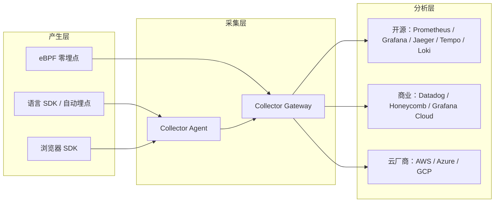

## 生态全景：数据从产生到分析的每一环

一套完整的可观测性方案由三层组成：产生层负责在应用内外生成数据，采集层负责接收、处理与转发，分析层负责存储、查询与展示。OpenTelemetry 覆盖前两层，分析层由具体后端承担。



三层之间通过 OTLP 解耦。产生层不知道最终后端是谁，分析层不关心数据是怎么产生的，采集层是中间的治理点。这个结构带来的直接收益是：换后端不需要重写埋点，加新的数据来源不需要改分析平台。

产生层的来源比想象中多。应用代码里的 SDK 与自动埋点是主力，但还包括：浏览器端的前端 SDK、运行基础设施（节点指标、网络流量、服务网格代理的访问日志）、无法接入 SDK 的第三方组件（通过 eBPF 等零埋点方案）、以及通过协议转换接入的已有系统（Prometheus 端点、Jaeger 格式、云厂商日志）。来源越多样，统一标准的价值越明显——所有来源共享同一套协议与处理管道，分析时才能跨层关联。

三层各自的选型逻辑不同。产生层选 SDK 与埋点方式，看语言覆盖与自动埋点能力；采集层选 Collector 部署形态，看规模、数据量与治理需求；分析层选后端，看预算、运维能力与合规约束。下面按这个顺序展开。

层间解耦还有一个容易被低估的收益：演进独立。产生层可以先上，采集层可以后补，分析层可以随时换。团队的接入不必一次到位，可以按“先有数据、再治理、后选型”的顺序推进，每一层的变化都不牵动其他层。

生态适配器扩大了接入面。Collector 能接收 Prometheus 文本格式、Jaeger 与 Zipkin 的 trace、云厂商日志格式，也能把 OTLP 转成后端需要的格式。已有系统不需要一次迁移，可以通过适配器先汇入统一管道，再逐步替换为原生接入。

遇到任何一个可观测性工具，先问它在三层里处于哪个位置、与 OTLP 是什么关系，比背功能清单更有效。这个框架同样适用于评估新出现的采集方案、后端产品和 AI 观测平台——位置决定职责，协议决定是否兼容。

## Collector：Agent 还是 Gateway

Collector 有两种部署形态，解决不同的问题。

Agent 与应用同机部署：容器环境里是边车或 DaemonSet，虚拟机环境里是每台机器一个进程。它的优势是就近采集：数据不出节点，延迟低，可以先做本地过滤与脱敏再转发；缺点是每台机器都要部署和更新，配置分散，单机处理能力有限。

Agent 在容器环境里还有两种形态。边车（sidecar）每个 Pod 一个，与应用同生命周期，适合需要隔离与独立配置的场景，但资源开销随 Pod 数量线性增长；DaemonSet 每台节点一个，由多个 Pod 共享，资源利用率更高，但所有应用共用同一套处理资源，需要更谨慎的限额配置。

Gateway 是独立集群：所有数据汇入一个中心，做全局处理。它适合需要全局视野的治理：尾部采样要看完整链路，基数控制要看所有指标序列，路由和脱敏可以集中管理。Gateway 还有缓冲能力，后端抖动时数据不会立刻丢失；代价是增加一组需要运维的组件，并引入新的网络依赖。

两种形态的取舍可以从五个维度对比：

| 维度       | Agent                      | Gateway                        |
| ---------- | -------------------------- | ------------------------------ |
| 部署位置   | 与应用同机                 | 独立集群                       |
| 数据本地性 | 数据不出节点               | 数据集中                       |
| 治理能力   | 局部：过滤、脱敏、基础采样 | 全局：尾部采样、基数控制、路由 |
| 运维成本   | 每台机器一套，随节点增长   | 一套集群，需要高可用规划       |
| 故障影响   | 只影响本节点               | 影响所有数据来源               |

生产环境常见的是两者结合：Agent 负责就近采集和基础处理，Gateway 负责全局治理与统一出口。数据流通常是 SDK → Agent → Gateway → 后端。规模很小的项目也可以省掉 Agent，让 SDK 直连 Gateway；但网关的高可用和容量仍然需要规划。

两种形态都引入了同一个问题：中间节点本身可能成为故障点或瓶颈。Agent 与应用同生命周期，应用挂了 Agent 也拿不到数据；Gateway 一旦过载，所有来源的数据都会受影响。规划时需要为 Gateway 留出缓冲与水平扩展能力，并接受一个现实——采集链路不是零成本，任何一跳都可能丢数据，重要数据的留存要靠队列配置、重试机制与后端写入共同兜底。

选择没有一个固定答案，决策依据是数据量和治理复杂度。数据量小、团队没有额外运维能力，可以只用一个 Gateway；节点多、需要本地脱敏或边缘过滤，Agent 更有价值。无论哪种形态，Collector 的意义都一样：把治理逻辑从应用代码里拿出来，集中到数据路径上。

处理管线的顺序影响结果：采样放在批量与限流之前还是之后，决定了成本与丢数据的平衡；脱敏放在采样之前，保证被保留的数据已经清理过。先想清楚每个 Processor 的用途，再确定它们在管线里的位置。

配置管理是 Agent 形态的隐藏成本：节点越多，配置同步越容易漂移。常见做法是配置由模板生成，或从统一配置源分发，Gateway 与 Agent 使用同一份版本化配置，变更走评审而不是逐台手工改。

## 后端选型：三种路线

### 自托管开源

自托管路线用 Prometheus、Grafana、Jaeger、Tempo、Loki、Mimir 等组件搭建全家桶。指标用 Prometheus 或 Mimir，日志用 Loki，链路用 Jaeger 或 Tempo；Grafana 统一查询界面，告警、仪表盘、跨信号关联都在同一套界面里完成。

全家桶的职责划分：Prometheus 或 Mimir 管指标，Loki 管日志，Jaeger 或 Tempo 管链路，Grafana 统一查询与告警。每套存储有自己的查询语言（PromQL、LogQL、TraceQL），跨信号关联依赖共同的时间范围与 traceId。

优势是数据完全留在自己手里，成本主要是硬件与运维人力，没有按量计费的压力；功能上开源生态的成熟度已经很高，指标、日志、链路都有对应的存储与查询方案。代价是运维复杂度：每套存储都有自己的扩容、备份、升级节奏，容量规划需要经验；对一个人或小团队，这条路的人力成本经常被低估。适合有基础设施能力、数据量稳定、数据必须留在本地的团队。

### 商业 SaaS

商业产品（Datadog、Honeycomb、Grafana Cloud、New Relic 等）把存储、查询、告警、治理做成托管服务。优势是上手快、功能完整：基数治理、异常检测、SLO、跨信号关联开箱即用；团队不需要维护后端，按量计费让成本与规模线性相关。

商业产品的账单结构通常是按量计费：指标按序列数，日志按 GB，链路按 Span 数。三个计费维度对应三类数据，优化方向也各不相同：指标压基数，日志控采样，链路控采样率与保留期。

代价是数据出域和费用不确定性。遥测数据要发到供应商的云上，需要过合规审查；费用随数据量增长，采样预算直接决定账单，账单反过来倒逼采样治理。对快速迭代、人少的团队，商业产品通常是成本与效率的平衡点；对数据敏感或规模巨大的公司，费用会成为不可忽视的约束。

### 云厂商

云厂商的观测产品（AWS、Azure、GCP 各自的监控与追踪服务）与云资源集成最好：实例、网络、服务网格的元数据自动关联，账单合并，数据留在云环境内，合规路径清晰。容器与无服务器环境里，云厂商的探针还能覆盖一部分没有 SDK 的场景。

代价是生态锁定：跨云或迁回自托管时，数据格式与查询语言不通用；云厂商对 OTLP 的支持深度不同，有的原生接收，有的需要额外的 exporter 或代理。选云厂商路线的前提是接受该云作为长期运行环境；迁移到云厂商时，先把 OTLP 链路跑通再迁移历史数据，避免双轨期的格式混乱。

三条路线不是只能选一条。混合部署很常见：核心业务数据留在自托管环境，面向外部或快速变化的业务用商业产品，云厂商产品承担与云资源相关的数据。混合的前提仍然是统一标准，否则每个后端一套埋点，等于退回绑定时代。

### 选型框架

后端选型需要明确四个问题：

1. 数据量与预算：全量数据有多少，按量计费是否可承受。
2. 运维能力：团队能不能长期维护多套存储。
3. 合规约束：数据能不能出域，需要保留多久。
4. 锁定容忍度：接受商业产品或云厂商绑定，还是要求随时可迁移。

数据量可以先估算再决定。一条链路平均 50 个 Span、每个 Span 约 1KB，每秒 100 个请求的原始链路数据约 5MB/s；按 10% 采样后是 0.5MB/s，一天的存储需求约 40GB，考虑索引与副本还要乘上系数。指标和日志的量级类似，只是结构不同。把这三类数据的估算写下来，再乘以保留期，预算框架就出来了。

四个问题之间互相影响：数据量决定预算，预算影响自托管与 SaaS 的选择；合规约束可能直接排除商业产品；锁定容忍度决定云厂商路线是否可接受。把它们写成一页决策记录，比现场比较功能清单更有效。

两个虚构案例可以说明决策逻辑。案例一：三人小团队、日活十万、无专职运维，选择商业 SaaS，采样率从 10% 起步，优先保证错误链路全量保留。案例二：金融公司、数据不能出域、有基础设施团队，选择自托管全家桶，按季度回顾容量与采样预算。两者的埋点代码都是 OpenTelemetry，区别只在导出配置。

保留期是容易被低估的变量。链路保留 7 天与保留 30 天，存储成本相差四倍多；日志的审计要求可能强制保留一年。选型时把每类信号的保留期写进预算，而不是统一按默认值估算。

告警与 SLO 不依赖具体后端：无论选哪条路线，都建议先用错误率与延迟定义少量 SLO，再决定告警阈值。后端的查询语言可以不同，SLO 的语义应该一致，这样换后端时业务口径不会变。

硬性条件只有一个：后端必须支持 OTLP 或具备官方适配。不符合这个条件的产品，无论功能多好，都会把埋点重新绑回私有格式。

另一个常被忽略的问题是三类信号是否必须进同一个后端。统一后端（如 Grafana 全家桶）的好处是跨信号查询简单，一条链路可以直接跳到同期指标；分开选型（链路用 Jaeger、指标用 Prometheus、日志用 Elasticsearch）可以各取所长，但关联查询要靠 traceId 在多个系统间跳转。两者都是可行路线，决策取决于团队对“跨信号关联”的依赖程度。

## 浏览器端可观测性

浏览器是可观测性产生层里容易被忽视的一环。前端 SDK 可以采集页面加载性能、资源加载、脚本错误、用户交互与请求信息。这些数据回答的是“用户实际体验如何”，与后端数据互补。

前端观测有两种口径。RUM（Real User Monitoring）采集真实用户的真实会话，覆盖所有设备与网络环境，能反映实际体验但数据有噪声；合成监控（synthetic monitoring）用脚本定时访问页面，数据干净、可复现，但只代表测试环境。两者互补，RUM 回答“现在如何”，合成监控回答“是否回归”。

核心 Web 指标（Core Web Vitals）是 RUM 的常见维度：LCP 衡量加载体验，INP 衡量交互响应，CLS 衡量视觉稳定性。它们由浏览器标准定义，可以跨页面、跨版本比较，是前端体验从主观感受变成可量化数据的基础。

前端数据和服务端数据的关联方式是同一套 traceparent：前端发起请求时注入链路上下文，后端 SDK 提取后创建子 Span，整条链路从前端页面延伸到后端服务。实践中，跨域请求、CORS 配置和隐私约束会限制上下文传递，浏览器 SDK 对服务端框架的兼容也需要验证。

前端采集的典型维度包括：页面生命周期与核心 Web 指标、资源加载耗时、未捕获异常、网络请求的成功率与延迟、用户会话的连续性。其中会话概念是前端特有的——同一用户的多条请求通过会话标识关联，用于还原一次使用过程的完整体验。会话数据的保留与匿名化需要单独设计，不能直接沿用服务端的链路采样策略。

前端与后端的拼接有时序问题：页面加载发生在请求发出之前，导航性能数据（LCP、CLS）没有对应的后端 Span；只有请求发出之后，traceparent 才把前后端连起来。RUM 里的页面生命周期与后端链路是两段数据，分析时需要按会话或时间窗口对齐，不能期待一条链路覆盖从点击到渲染的全过程。

前端遥测的隐私边界比服务端更严格：涉及用户设备、行为与位置信息，需要用户同意机制；采集内容默认匿名化，session ID 与用户 ID 分离；跨域请求头里的 traceparent 不能携带敏感业务字段。

前端错误定位依赖 sourcemap：生产代码是压缩后的，堆栈只有行列号，需要 sourcemap 还原源码位置。sourcemap 属于敏感资产，托管时要控制访问权限，只对内部可见。

浏览器端通常不是落地的第一步。服务端数据覆盖核心链路，前端数据解决体验类问题，两者优先级取决于产品形态。前端重、交互复杂的应用，RUM 的价值更高；对服务端 API 为主的产品，先补齐后端再考虑前端。另外，前端遥测涉及用户设备信息与行为数据，采集范围需要符合隐私政策，避免默认全量采集。

## eBPF 零埋点

eBPF 在 Linux 内核中挂载钩子，在系统调用、网络栈和用户态函数边界捕获行为，不需要修改应用代码，也不需要 SDK。对无法改动代码的组件——第三方服务、老系统、没有官方 SDK 的语言——它是唯一现实的接入方式。

eBPF 的能力边界同样明确。它看到的是系统层语义：连接、系统调用、函数执行；拿不到业务上下文：订单号、用户 ID、业务分支。TLS 流量默认不可见，部分能力依赖内核版本。因此 eBPF 与 SDK 不是替代关系，而是互补：SDK 提供业务深度，eBPF 提供覆盖广度。实践中，eBPF 自动埋点工具（如 Grafana Beyla）可以生成符合 OTLP 的链路数据，供 Collector 与现有管道一起处理。

eBPF 生成 Span 的方式是近似语义：通过 uprobes 挂钩函数入口与出口，把一次调用映射成一个 Span，函数名成为 Span 名。它能还原调用结构与耗时，但拿不到应用层的状态码、业务属性与错误原因。调试时要注意，eBPF 链路的“错误”可能只是函数返回非零，而不是业务失败。

引入 eBPF 还需要考虑运行环境条件：需要内核支持与相应权限，容器与 Kubernetes 环境的权限模型、安全策略和内核版本会直接影响可行性。eBPF 采集的数据量可能很大，尤其是高频系统调用，建议先用采样控制成本，再逐步放开。

eBPF 程序运行在内核上下文，权限与安全边界比普通代理更严格：加载需要高权限，程序本身要有校验与审计。在共享或租户隔离环境里，先做安全评估再启用，避免为了观测引入新的攻击面。

选型时可以按优先级排列：需要业务语义的场景用 SDK；只需要连接级视野的场景用 eBPF；两者都做不到的组件，用日志与指标做有限覆盖。eBPF 适合作为“最后一公里”的覆盖手段，而不是默认接入方式。

## Profiling：正在成型的第四信号

持续剖析（continuous profiling）按固定频率采样进程调用栈，回答“CPU 和内存花在哪里”。数据以火焰图展示：横轴是时间或样本占比，纵轴是调用栈，宽块即热点。火焰图能直接指出热点函数，不需要先猜测再验证。

它与链路互补：链路描述请求经过了哪些服务，剖析描述这些服务内部的资源消耗集中在哪段代码。一条链路显示某个 Span 耗时异常，但服务端日志和指标都正常，此时剖析数据能指出耗时集中在哪个函数、是 CPU 密集还是锁等待。性能优化的结论如果只来自链路，容易停在“哪个服务慢”的层次；加上剖析才能回答“为什么慢”。

剖析信号在 OpenTelemetry 中仍在演进，规范尚未达到链路、指标、日志三类信号的稳定度，但方向已经明确：剖析数据同样携带进程上下文，可以与链路、指标关联，协议也在向 OTLP 生态收敛。接入成本低，存储开销大，适合在性能优化和容量问题出现时作为专项手段，而不是一开始就全量开启。常见使用时机：上线后出现 CPU 峰值、内存持续增长、某个接口延迟异常但日志没有报错。

剖析也分类型：CPU 剖析回答“时间花在哪”，内存剖析回答“内存分配在哪”，锁剖析回答“等待在哪”。类型由采样点决定，同一进程可以同时采集多种，但开销会叠加。采样频率越高，火焰图越精细，额外 CPU 开销越大；生产环境通常用低频率持续采样，专项排障时临时提高频率。

## GenAI 可观测性

### 传统信号回答不了的问题

GenAI 应用引入了三类传统信号覆盖不到的问题：答案质量、调用成本和决策链。

质量：模型幻觉、检索召回差、上下文被截断，最终表现为“答非所问”。这类问题没有异常码，错误率可能一直是零。成本：模型选择、输入输出 token 数、失败重试，每一项都直接对应账单；同一功能换模型或换上下文长度，成本可能差一个数量级。决策链：Agent 为什么选择某个工具、为什么放弃某个分支，决定了行为是否可解释、是否可复现。

一次 RAG 问答至少包含检索、上下文组装、模型调用、工具调用多个环节，最终答案的质量取决于每一环；Agent 场景还会循环调用工具、根据中间结果改变计划。传统指标只能回答“调用是否成功、延迟多少”，无法回答这三类问题。回答它们，需要把每次推理的完整过程记录成链路。

### gen_ai.\* 语义约定

OpenTelemetry 为 AI 调用定义了 gen_ai.\* 语义约定，统一描述提供方、模型、请求与用量：

```text
gen_ai.provider.name: openai
gen_ai.request.model: gpt-4o
gen_ai.usage.input_tokens: 812
gen_ai.usage.output_tokens: 214
```

一个典型的 AI 链路包含 Agent 编排 Span、检索 Span、模型调用 Span 与工具调用 Span。模型 Span 记录输入输出摘要与 token 用量，检索 Span 记录召回结果，工具 Span 记录外部调用。整条链路的形状与普通分布式链路一致，区别在于属性携带了 AI 特有的业务维度。

### 评估与迭代

链路数据在 GenAI 场景有一个额外用途：作为评估与迭代的输入。一次回答质量差，可以顺着链路看到检索召回是否合理、上下文是否被截断、模型输出是否被工具结果覆盖。把链路、评估分数与提示词版本放在一起，质量问题就从“玄学”变成可复现、可比较的数据。

这也是 GenAI 可观测性区别于传统可观测性的地方：数据不仅要用于排障，还要用于改进产品本身。传统链路排完障就归档，AI 链路会成为提示词工程与模型选型的日常输入。

把评估分数写进链路属性的做法正在普及：eval 结果作为 span attribute（如 eval.score）附着在模型 Span 上，查询时按分数过滤，低分样本直接跳进链路看细节。评估循环的输入是链路，输出又回到链路，形成闭环。

### 生态

围绕 GenAI 可观测性已经形成一批工具：OpenInference 定义了面向机器学习与 AI 的开放约定，Langfuse、OpenLLMetry、LangSmith 等平台提供从追踪到评估的完整能力。它们大多建立在 OpenTelemetry 之上或兼容 OTLP，可以接入统一的 Collector 管道。

落地的两个注意点：输入输出可能包含敏感数据，默认应脱敏或只保留摘要；token 用量与成本的统计口径需要与计费侧对齐，否则治理和账单会对不上。

成本治理按三个维度展开：按功能看哪些场景消耗了大部分 token，按模型看是否需要降级或换模型，按天看波动与发布是否相关。三个维度都依赖链路里的模型与用量属性，没有链路，成本只能看账单总量。

## 团队推行路线

从零到生产，推行顺序比工具选择更重要。

第一步，确定试点：选一个后端服务、一种语言、一条核心请求链路，接上 SDK 与自动埋点，数据导到一个后端，验证链路完整。试点阶段的产出物是一条从入口到数据库的完整链路，验证标准是“任意一次请求都能从头追到尾”。目标不是覆盖范围，而是打通。

第二步，定标准：在试点中确定 service.name 命名、Resource 字段、采样策略、属性命名规则。标准先于规模，后面每个服务接入时都套同一套约定，避免每个团队各起炉灶。采样预算在这一步用实际数据校准：先全量跑一周，看数据量与成本，再定采样率。

第三步，集中治理：部署 Collector，把采样、脱敏、路由集中到数据路径上。此后调整治理规则不再需要改应用。验证标准：改一次采样规则，观察所有服务的链路数据同步变化，应用侧零改动。

第四步，扩展：按语言和框架分批接入，每批验证链路完整性。eBPF 用于无法改代码的组件，RUM 按产品需求补充，GenAI 应用按业务优先级单独立项。每批接入都要过同一套验收清单：链路是否完整、Resource 是否正确、采样是否生效。

第五步，让数据被使用：可观测性的价值在使用，不在采集。定期用链路复盘故障，把排查结果沉淀成告警与仪表盘；否则埋点只会变成新的成本项。验证标准是团队在真实故障里实际用上了链路数据，而不是继续从日志开始猜。

常见的失败模式与工具无关：没有预算约束地全量采集链路，数据量在两周内压垮后端；标准未定就铺开，三十个服务出现三十种 service.name；只埋不用，故障时仍然从日志开始猜。避免这三种情况，推行路线就成功了一大半。

推行节奏还需要配套治理机制：采样预算定期回顾，基数增长设阈值提醒，属性命名变更走评审。可观测性数据会随着服务数量自然膨胀，没有治理节奏，前期的标准会被新一轮接入冲散。团队的文档与示例代码同样重要，新服务接入时能直接复制标准配置，而不是重新发明一遍。

推行还需要组织配套：指定可观测性负责人，负责标准与治理；值班流程把“先看链路”写成固定步骤；复盘 SOP 要求每次事故附上链路截图与数据证据。工具能改变能力，流程决定能力是否被使用。

更深入的内容可以从官方文档继续：规范与语义约定是理解设计决策的入口，Collector 文档提供数据路径的细节，各语言 SDK 文档覆盖自动埋点能力。

上一篇：[《OpenTelemetry 中篇：三大信号与内部机制》](/zh/posts/opentelemetry-guide-part-2)
