凌晨三点，手机震了。

你睁开眼看到的那条告警很简洁：`PostgreSQL connection refused`。

大脑一片空白，然后开始转——主库挂了？Slave 呢？切过去了没有？数据丢了没？用户现在看到的是报错页面还是空白页面？

你他妈的翻了个身，打开笔记本，开始查。

这种时刻谁都经历过。这篇文章就是为这种时刻写的。不是给你列配置文件的——配置你自己能查——而是帮你把这些东西的工作原理装进脑子里。下次出事，你不用翻文档，脑子里有个地图。

---

## 从一次故障说起

假设你跑着一个 SaaS 平台。架构不复杂：前端请求进 Nginx，打到 Node.js 后端，后端连 PostgreSQL 和 Redis。消息队列用 BullMQ，依赖 Redis。整套东西跑在 K3s 上。

某个下午，PostgreSQL 主库的磁盘满了，进程直接崩了。

用户开始刷不出来页面。然后 Redis 的 Sentinel 也跟着炸了——因为那台机器上恰好也跑了一个 Sentinel 节点，而你的 Sentinel 只部署了两个。

你看，这就是经典的多米诺。

事后复盘，每一层都有"单点"。但没人告诉你这些单点是怎么串在一起的，也没人告诉你每一层那个"自动切换"到底靠谱不靠谱。

我们一层一层拆。

---

## PostgreSQL：你的数据库比你想象的脆弱

### 它挂了就是挂了

PostgreSQL 自己不会自动切。它就是老老实实执行 SQL 的一个进程。挂了，就没了。

所以你得给它配跟班。

### 主从复制：先解决"数据不丢"的问题

PG 的主从复制靠的是 WAL——Write-Ahead Log。

这个 WAL 没什么神秘的。你可以把它想象成 Git 的 commit log。你每改一行代码，Git 先记录这个变更再改文件。PG 也是：每个写操作，先写 WAL 日志，再改数据文件。

WAL 日志是二进制、页面级别的记录，不是 SQL 语句。它记录是的"把第几页的第几个元组从 A 状态改成 B 状态"。所以 Slave 重放的时候不需要重新解析 SQL、不需要走索引、不需要检查约束——直接改内存里的页面就行了。这比 Master 上面的原始写入快多了。

三条关键数据你需要记住：

- `write_lag`：WAL 流从 Master 到达 Slave 网络缓冲区的延迟
- `flush_lag`：WAL 真正落到 Slave 磁盘的延迟
- `replay_lag`：Slave 把 WAL 应用到数据文件、查询能读到这条数据的延迟

**`replay_lag` 最重要。它直接决定 Slave 是不是能接住流量。**

如果 replay_lag 太大——比如 Master 上跑了一个大事务，改了 500 万行，产生了 2GB 的 WAL——Slave 就在后面吭哧吭哧追。这时候如果 Master 挂了，你切到 Slave，Slave 还没追平的那部分数据就丢了。

### 同步复制：零丢失的代价

PG 支持异步复制（默认）和同步复制。

异步复制：Master 写完 WAL 就返回客户端，然后异步发给 Slave。Master 宕机，可能丢最近几秒的数据。

同步复制：Master 必须等 Slave 确认 WAL 已落盘后，才返回客户端成功。数据零丢失。

听起来同步复制很香是吧？

卧槽，代价很大。如果 Slave 网络断了或者本身挂了，Master 就写不进去了——整个写操作挂起，直到超时。你的 API 全线阻塞。

所以实际做法是配**1 个同步 + N 个异步**。兼顾安全性和可用性。

同步 Slave 挂了，PG 自动降级为异步。Slave 恢复后追平，再自动升回同步。这是你能在"零丢失"和"高可用"之间找到的最好平衡。

### 复制是怎么跑的：WAL Sender 和 WAL Receiver

Master 上有一个 `WAL Sender` 进程。Slave 上有一个 `WAL Receiver` 进程和一个 `Startup` 进程。

流程是这样的：

1. Slave 连接 Master，说："我从 LSN `0/1A000000` 开始要数据。"
2. Master fork 出一个 WAL Sender，从那个 LSN 位置开始读 WAL 文件，把记录打包，通过 TCP 流式发给 Slave。
3. Slave 上的 WAL Receiver 接收，先写到自己本地的 `pg_wal/` 目录。
4. Slave 上的 Startup 进程从本地 WAL 文件逐条读取，应用到数据文件。
5. 追平后进入 streaming 模式，Master 产生的每一个 WAL 记录都实时发送，不等攒够一个 16MB 的文件段。

如果 Slave 是新加的，或者断连太久，会先走**文件级复制**（把 Master 上已完成的 WAL 段整个拷贝过去），追平后再切流式。

用 `pg_basebackup` 重建 Slave 的全过程：

1. 连 Master，创建 replication slot（标记"从此刻起保留 WAL"）
2. 对 Master 数据文件做物理备份（tar 包）
3. Slave 用这个包恢复出自己的数据目录
4. 启动时读 `backup_label` 知道从哪个 LSN 开始重放
5. 启动 WAL Receiver，从那个 LSN 开始追
6. 追平了，切 streaming

### 自动故障切换：Patroni 出场

光有主从不够。Master 挂了，你得手动上去敲 `pg_ctl promote` 把 Slave 提成 Master。

凌晨三点，你不想敲命令。你需要自动切。

**Patroni** 就是干这个的。它本质上是一个 Python 脚本，部署在每个 PG 节点旁边。

它的工作方式是：

1. 所有 Patroni 实例向 etcd 写心跳和当前 LSN 位置
2. etcd 里有一把"锁"——谁持有这把锁谁就是 Master
3. Master 上的 Patroni 定期续约这把锁（TTL 机制）
4. Master 挂了 → 锁 TTL 超时，自动释放
5. 其他节点上的 Patroni 发现锁没了 → 开始竞选
6. LSN 最新的那个 Slave 抢到锁 → 执行 `pg_ctl promote` 把自己升为 Master
7. 其他 Slave 自动 `follow` 新 Master

整个过程 10-30 秒。够你从床上坐起来了。

这里有一个关键：**etcd 自身也得高可用。**

etcd 基于 Raft 共识协议。最少 3 个节点。写请求必须半数以上节点确认。挂了 1 个（3 节点剩 2），集群正常工作。挂了 2 个，不可写，但数据还在。

所以你的 etcd 至少得 3 个节点，而且这 3 个节点不能都在一台物理机上——否则那台机器一挂，etcd 全灭，Patroni 没法切。

### 连接池：PgBouncer

PG 每个客户端连接会 fork 一个进程，一个进程大约占 5-10MB 内存。你部署 10 个应用 Pod，每个开 100 个连接，就是 1000 个连接 = 5-10GB 内存。

这还没干事呢，内存先炸了。

**PgBouncer** 本质上就是一个连接复用器。几百个应用端短连接被它复用成十几个 PG 长连接。PG 永远只需要应付那十几个长连接。

PgBouncer 自己怎么高可用？部署 2 个实例。应用连接串里配两个地址。一个挂了切另一个。

### 备份：最后的防线

所有自动切换都失败了，你还有备份。

一般是**全量备份 + WAL 持续归档**：

- `pg_basebackup` 每周做一次全量
- WAL 持续归档到 S3 或 MinIO

这叫 PITR——Point-in-Time Recovery。你可以恢复到过去任意一个时间点。RPO 取决于 WAL 归档频率，通常几十秒。

但别把备份和 HA 搞混。备份保住的是数据，HA 保住的是服务。服务挂了 3 分钟，用户骂娘；数据丢了，你上法庭。

### 生产环境踩坑：PostgreSQL

**踩坑一：pg_basebackup 重建 Slave，把 Master 磁盘 IO 打满了。**

有个团队发现 Slave 追不上 Master 了——replay_lag 飙到了两个小时，wal_sender 和 wal_receiver 中间有个网络瓶颈。决定推倒重建 Slave。

DBA 在 Master 上敲了 `pg_basebackup -h master -D /pgdata --checkpoint=fast`。这条命令跑了二十分钟之后，Master 磁盘 IO 的 await 从 2ms 飙到了 800ms。业务请求开始大面积超时。监控大盘一片红。

原因简单到傻逼：pg_basebackup 做物理全量备份的时候，先把所有脏页做检查点刷盘（产生大量 WAL），然后全量拷贝数据目录（400GB 数据通过 TCP 往外传），这两个动作吃满了 Master 的磁盘 IO 带宽。而 Master 还得同时处理正常的业务写入——三股 IO 同时挤一根水管。

解决方案不是不重建——是别在业务高峰期重建，或者用 `--max-rate=100M` 限制传输速率，或者更聪明的做法：从现有 Slave 上做级联备份（`pg_basebackup` 连 Slave 而不是 Master），把 IO 压力从 Master 身上挪走。

**踩坑二：`synchronous_commit = on` + 单台同步 Slave + 网络中断 = 全线写入阻塞。**

一个金融系统团队看了 PG 文档，看到 `synchronous_commit = on` 能保证"事务提交后数据一定在至少一个 Standby 上持久化了"。他妈的太好了——零丢失！设上！

结果某天机房核心交换机做固件升级，网络中断了 40 秒。Master 和那台唯一的同步 Slave 之间断了。所有写操作——INSERT、UPDATE、DELETE——全部挂起。不是慢，是完全卡死。应用端连接池瞬间撑满，内存爆炸。四十秒内，客户投诉电话打爆了运维座机。

事后复盘：`synchronous_commit = on` 的实际语义是"等待一个同步 Standby 把 WAL 写到磁盘"。同步 Standby 只有一台，它一挂你就死了。正确的配置是：

- `synchronous_commit = remote_apply`：等 Standby 把 WAL 应用到数据文件（不只是写盘）再返回，比 `on` 更安全
- `synchronous_standby_names = 'ANY 1 (node1, node2)'`：任意一个同步 Standby 确认即返回。挂一个不影响。这才是生产该用的配置
- 或者干脆用 `synchronous_commit = remote_write`：等 Standby 写到 OS buffer 而非 fsync 到磁盘。延迟低得多，RPO 依然接近零

生产环境不丢数据的正确姿势不是"死等一台 Slave 落盘"，而是"有多个同步候选者，谁的盘先落算谁的"。

---

## Redis：快，但别信它不会丢数据

Redis 的问题跟 PG 刚好相反。

PG 的问题是"挂了不会自己切"。Redis 的问题是"你以为它会切，但它切的时候可能丢数据"。

### 三种玩法

- **单机**：开发环境用用。生产环境跑单机 Redis，等于走在高速公路上不系安全带。
- **主从 + Sentinel**：数据量不大（单机几十 GB 以内），读多写少，这是最常见的生产方案。
- **Cluster**：数据量超过单机内存，需要分片。把 16384 个哈希槽分到多个 Master 上，每个 Master 只存一部分数据。扩容缩容方便。

### Sentinel 模式：选主这件事

Sentinel 是一个独立的进程，部署在你的 Redis 节点旁边。它不存数据，只干三件事：

**1. 监控。** 每秒 ping Master 和 Slave。如果 `down-after-milliseconds`（通常 30 秒）没回，判"主观下线"。

**2. 投票。** 一个 Sentinel 觉得 Master 挂了不算。需要过半 Sentinel 同意，才算"客观下线"。

这里你肯定想问：为什么非要过半？

考虑这个场景：网络抖动了一下，不是 Master 真挂了。Sentinel-1 连不上 Master，自己判下线。如果这时候直接就切换，Sentinel-2 和 Sentinel-3 还连得好好的——你搞出脑裂了。两个 Master，数据各写各的，恢复的时候你哭都来不及。

过半机制就是为了防止网络分区导致的误判。少于半数 Sentinel 同意，不切。

**3. 切换。** 选出新 Master → 让其他 Slave 改跟新 Master → 通知客户端新地址。

最少部署 3 个 Sentinel，并且部署在不同物理机上。否则机器一挂，Sentinel 全灭，Master 挂了也没人切。

### 客户端怎么知道切了

你的应用不直连 Redis。它连 Sentinel。客户端库（比如 ioredis）内置了对 Sentinel 的支持：

```typescript
const redis = new Redis({
  sentinels: [
    { host: 'sentinel-1', port: 26379 },
    { host: 'sentinel-2', port: 26379 },
    { host: 'sentinel-3', port: 26379 },
  ],
  name: 'mymaster',
})
```

切走后，客户端短暂失败后自动连新 Master。这中间可能会有几个请求失败，你的业务代码需要处理重试。

### Cluster 模式：没有 Sentinel 也能切

当数据量超过单机内存，每个节点都存全量是对内存的浪费。Cluster 把数据打散：

```
Master 1 负责 slot 0-5460
Master 2 负责 slot 5461-10922
Master 3 负责 slot 10923-16383
```

写入时 `CRC16(key) % 16384` 决定 key 落到哪个 slot，也就决定了去哪个 Master。

Cluster 不依赖 Sentinel——节点之间通过 **Gossip 协议**互相监控。每个节点定期随机选几个节点交换信息（谁在线、谁负责哪些 slot）。

Gossip 的好处是去中心化，没有单点。坏处是故障检测比 Sentinel 慢——秒级 vs 毫秒级。

### 持久化：Redis 的数据到底靠不靠谱

Redis 重启会丢数据吗？取决于你开了什么持久化。

- **RDB**：定时快照。比如每 5 分钟 dump 一次全量内存到磁盘。简单、性能影响小。但最多丢 5 分钟数据。RPO=5 分钟，这在生产环境通常不可接受。
- **AOF**：每条写命令追加到日志文件。可配每秒 fsync 一次。RPO 最多 1 秒。Redis 重启后逐条重放 AOF 命令恢复数据。生产必须开。
- **混合持久化**：RDB 做底座，AOF 做增量。Redis 4.0 之后推荐这个。AOF 文件不会无限膨胀——定期用 RDB 做一次全量快照，之后的增量才记 AOF。

```conf
appendonly yes
appendfsync everysec
aof-use-rdb-preamble yes
```

这三行配置，生产环境必加的。

但你要清楚：Redis 的持久化不是为"绝对不丢数据"设计的。它是内存数据库，持久化是锦上添花。如果你的业务需要"写进去就一定不丢"，你应该用 PostgreSQL。

Redis 的定位是：**极快，允许极短时间窗口内的数据丢失。** 计数器、缓存、Session、排行榜——这些丢个几秒可以接受。用户余额？存 PostgreSQL。

### 生产环境踩坑：Redis

**踩坑一：`down-after-milliseconds` 设成 10 秒，遇上网络抖动，Sentinel 像嗑了药一样疯狂切。**

有个团队看了某个"高性能 Redis 最佳实践"文章，把 `down-after-milliseconds` 设成了 10 秒。逻辑是"故障检测越快越好，10 秒够了"。听起来很合理对吧？卧槽，一点都不合理。

某天机房做网络设备维护，核心交换机重启了一次。网络抖动了大约 15 秒。这 15 秒里发生了什么：

1. Sentinel-1 在 T+10 秒连不上 Master，判主观下线
2. Sentinel-1 拉 Sentinel-2 和 Sentinel-3 投票——它俩也连不上 Master（网络抖动是全局的）
3. 三家一合计：超过半数同意了，"客观下线！" 切！
4. T+15 秒，网络恢复。但集群已经切到了 Slave

然后更傻逼的事发生了：旧 Master 在被误判下线的那几秒里还处理了一批客户端写入——因为它自己根本没挂，只是 Sentinel 连不上它。这批写入新 Master 没有。两台"Master"各有各的数据，脑裂了。恢复的时候，数据冲突，丢了一批写入。

教训：`down-after-milliseconds` 不是设得越小越牛逼。它的含义是"多长时间没回应该被怀疑挂了"，不是"多长时间没回应就该切"。生产环境 30 秒起步，60 秒也不保守。你宁愿用户多等 30 秒，也别让一个网络抖动把一个健康的 Master 干掉。记住一个事实：Redis Sentinel 判断故障不是靠精度，是靠共识。而共识需要时间。

**踩坑二：AOF 重写策略默认值 + 高频写入 = AOF 文件膨胀到 200GB，磁盘满了。**

一个短视频平台的实时计数系统用 Redis 存播放量。QPS 轻松过万。团队知道要开 AOF，也开了 `appendonly yes`。但不知道 Redis 的 AOF 自动重写有个默认触发条件：`auto-aof-rewrite-percentage 100`（AOF 文件比上次重写后增长了 100%）和 `auto-aof-rewrite-min-size 64mb`。

问题来了：这个业务的写入量太大了，AOF 文件在两次重写之间能长到几十 GB。更糟的是，每次重写都要 fork 子进程——Redis 32GB 内存的页表拷贝一次就要将近一秒。在这一秒里 Redis 主进程被操作系统卡住（fork 的 copy-on-write 页表复制是阻塞的），所有读写请求排队。

某次重写时磁盘空间本来就不太够（85%），重写失败了。Redis 没来得及清理旧 AOF 文件。新旧两个 AOF 加起来 200GB。磁盘满了。Redis 直接拒绝所有写操作。所有计数器冻结，所有排行榜停更，所有 Session 写不进去——用户开始随机掉登录。

教训三条：第一，别信默认值。`auto-aof-rewrite-min-size` 手动设到 1GB，`auto-aof-rewrite-percentage` 设到 50%。第二，监控 Redis 实例所在机器的磁盘使用率，超过 70% 就告警。第三，也是最他妈的关键的——AOF 文件和 RDB 文件别放在 OS 盘上。单独挂一块数据盘。OS 盘满了系统崩，数据盘满了 Redis 崩——至少不会一起死。

---

## BullMQ：你的消息队列依赖 Redis，这事儿没问题

BullMQ 是 Node.js 生态里最常见的任务队列。它完全跑在 Redis 上。

有人就问："消息队列跑在 Redis 上靠谱吗？Redis 挂了怎么办？"

这个问题拆开看。

BullMQ 的数据结构全存在 Redis 里：

- `wait`（list）：等待执行的任务
- `active`（list）：正在执行的任务
- `completed`（set）：已完成的任务
- `failed`（set）：失败的任务
- `delayed`（zset）：延迟任务
- `stalled`（set）：卡住的任务

如果 Redis 挂了，这些数据全丢。所以 BullMQ 的高可用本质上 = **Redis 高可用 + Stalled 检测**。

Redis 侧你已经配好了 Sentinel 或者 Cluster，这部分我们不重复了。

### Stalled 检测：Worker 挂了任务不丢

这是 BullMQ 自己最核心的设计。

你的 Worker 是一个 K3s Pod。它从 `wait` 队列取一个任务，任务从 `wait` 移到 `active`，Worker 开始执行。执行过程中，Worker 定时发心跳。

如果 Pod 崩了，心跳中断。BullMQ 扫描到某个任务在 `active` 里停留了超过 `lockDuration`（比如 30 秒）还没心跳——判定 stalled，把它移回 `wait`，其他 Worker 接手。

这个过程有两个关键参数：

- `lockDuration`：多长时间没心跳算 stalled
- `stalledInterval`：多久扫一次 stalled 队列

设大了，任务被卡住很长时间才发现。设小了，正常执行时间长一点的任务可能被误判。根据你的任务执行时间调。

### 这个架构能撑到什么程度

Redis 用 Sentinel 自动切，Worker 用 K3s Deployment 多副本自动重建，任务用 stalled 检测兜底——三层保障。

但最坏情况：整个 Redis 集群同时崩了（比如 3 个 Sentinel 节点都部署在同一台物理机上，机器挂了）。BullMQ 全线瘫痪。

这是极端情况。跨 AZ 部署可以进一步降低概率。但你需要对这个概率心里有数。

BullMQ 适合的场景是：**任务允许短暂延迟，但不能永久丢失。** 如果你需要"消息绝对不会丢"的精确语义，你应该上 Kafka 或者 RabbitMQ 的持久队列。

### 生产环境踩坑：BullMQ

**踩坑一：`lockDuration` 设成 10 秒，AI 视频生成任务被反复"救活"了八次。**

一个做视频处理的团队用 BullMQ 管理 AI 视频渲染任务。一个任务正常执行时间是 2-6 分钟（取决于视频长度和分辨率）。Worker 从 `wait` 里取到任务，开始跑。跑的过程中每隔 `lockRenewTime` 发一次心跳续锁。

问题出在哪？他们把 `lockDuration` 设成了 10 秒——这个值是给"网络请求、简单数据库查询"这种短任务设计的。视频渲染任务跑 6 分钟的过程中，心跳其实一直在发，续锁也在正常续。但有一次 Pod 所在的节点 CPU 飙到 100%（隔壁 Pod 在搞事情），Worker 的 Node.js 事件循环被卡住了 15 秒——心跳没发出去、锁也没续上。

BullMQ 的 stalled 检测器扫描发现这个任务在 `active` 里停了超过 10 秒没心跳——判定 stalled，把它移回 `wait`。另一个 Worker 抢到，开始执行。10 分钟后，第一个 Worker 的事件循环缓过来了，已经渲染到 80% 的视频继续跑完了——但第二个 Worker 也跑完了。用户收到了两条一模一样的视频处理结果通知。

这个案例的核心教训：`lockDuration` 不是随便设的。它要大于你的任务在极端情况下的最大可能卡顿时间。视频、图片、大文件处理这类重 IO 任务，`lockDuration` 设到 60 秒甚至 120 秒都不夸张。宁可晚一点检测到 stalled，也别让正常的任务被误判。

**踩坑二：Redis 内存淘汰策略把 BullMQ 的 `wait` 队列给清掉了。**

一个团队把 BullMQ 部署在了一个共享 Redis 实例上——和缓存、Session 存在一起。Redis 内存设了 8GB，`maxmemory-policy` 设成了 `allkeys-lru`（内存满时淘汰最近最少用的 key）。BullMQ 的任务数据也吃这块内存。

某天流量上来，缓存数据增多，Redis 内存到了 8GB 上限。`allkeys-lru` 策略开始踢 key。BullMQ 的 `wait` 列表里的任务、`delayed` zset 里的延迟任务——统统被当成缓存踢掉了。几千条待处理的任务凭空消失。用户提交了任务、拿到了任务 ID、然后石沉大海。

这个他妈的的问题本质上是因为 BullMQ 的数据结构和缓存数据混在一个 Redis 实例里。解决方案很简单：BullMQ 用独立的 Redis 实例。不和缓存、Session 共享。并且这个独立实例的 `maxmemory-policy` 一定要设成 `noeviction`——内存满时拒绝写入并报错，而不是悄悄删数据。丢连接、报错、告警——这些都比"悄悄丢了数据而你三个月后才发现"好一万倍。

---

## K3s 自己挂了怎么办

K3s 是一个轻量的 K8s。它自带内嵌 etcd。最少 3 台 Server 节点即可组成 HA 集群。

### 控制面和数据面是两回事

理解 K3s HA 最关键的一点：**控制面挂了，不影响已经跑着的 Pod。**

控制面——就是 K3s Server，包括 API Server 和 etcd——负责调度新 Pod、创建/更新/删除资源。但 Pod 一旦被创建并分配到了某个 Agent 节点上，kubelet 在 Agent 上独立工作，维持 Pod 的生命周期。

Service 也是——流量转发靠的是 iptables 规则，由内核执行，不依赖 API Server。

所以：

- 挂了 1 台 Server（etcd 3 节点剩 2）：集群正常。可以正常调度、部署、删除。
- 挂了 2 台 Server（etcd 3 节点剩 1）：不能调度新 Pod，不能改任何资源。但已有 Pod 继续跑，已有 Service 继续转发流量。

这就是 K8s 最精妙的设计：控制面和数据面的解耦。

### 实际部署

3 台 Server 节点。Agent 节点随意加。Server 前面放一个 TCP LB（用 HAProxy 或 Nginx 都行），Agent 通过 LB 连 API Server。任何一台 Server 挂了，LB 自动踢掉。

```bash
# 第一个 Server：初始化 etcd 集群
curl -sfL https://get.k3s.io | sh -s - server --cluster-init

# 第二、第三个 Server：加入 etcd 集群
curl -sfL https://get.k3s.io | sh -s - server \
  --server https://server-1-ip:6443 --token <token>

# Agent：通过 LB 连控制面
curl -sfL https://get.k3s.io | \
  K3S_URL=https://lb.example.com:6443 \
  K3S_TOKEN=<token> sh -
```

### 每一层的冗余

生产环境的 K3s 需要多层冗余：

| 层级        | 怎么做                                        |
| ----------- | --------------------------------------------- |
| 控制面      | 3 Server + 内嵌 etcd + 前置 LB                |
| Worker 节点 | 多节点，Pod 通过亲和性策略分散                |
| Pod 本身    | Deployment replicas + liveness/readiness 探针 |
| Service     | iptables/ipvs 规则（内核态，没进程可挂）      |
| Ingress     | Nginx Ingress 多副本                          |
| 存储        | PVC + Longhorn 分布式块存储                   |
| 中间件      | 各自独立的 HA 机制                            |

每一层都是独立的故障域。

### 生产环境踩坑：K3s

**踩坑一：内嵌 etcd 从来没做过 defrag，etcd 存储空间悄然膨胀到 8GB。**

K3s 内嵌的 etcd 存储了所有集群状态——Pod、Service、ConfigMap、Secrets、CRD。每次更新资源，etcd 都是 append-only 写入。删除旧数据不会立即回收磁盘空间——它只是标记为可回收。etcd 需要定期做 compaction（压缩历史版本）和 defrag（整理碎片回收空间）。

一个团队跑了 K3s 一年半，从来没做过 defrag。CI/CD 每天部署几十次，历史版本堆积如山。etcd 的数据目录从几百 MB 悄悄涨到了 8GB。直到某天 Server 节点磁盘满了，etcd 写不进去——整个集群不可操作。不能部署、不能更新、不能删除。

而最坑爹的是——etcd 写不进去这事，K3s API Server 表现得像"请求超时"。没有直接报"etcd 磁盘满"。所有 `kubectl apply`、`kubectl delete` 都只是在转圈超时。运维排查了三个小时才找到根因。

定期维护脚本就三行：

```bash
# 每个月跑一次
ETCDCTL_API=3 etcdctl --endpoints=https://127.0.0.1:2379 \
  --cacert=/var/lib/rancher/k3s/server/tls/etcd/server-ca.crt \
  --cert=/var/lib/rancher/k3s/server/tls/etcd/server-client.crt \
  --key=/var/lib/rancher/k3s/server/tls/etcd/server-client.key \
  compaction $(etcdctl endpoint status --write-out=json | jq -r '.[0].Status.header.revision') && \
  defrag
```

别等到磁盘满了再想"怎么还有这种东西要维护"。

**踩坑二：PodDisruptionBudget 设得太保守，Node NotReady 后 Pod 卡了两小时不驱逐。**

团队给核心服务配了 PDB——`maxUnavailable: 1`，三副本。逻辑是"任何时候至少两个在跑，一个可以停"。听起来完美。

结果某台 Worker 节点的 kubelet 挂了——不是节点彻底死了，是 kubelet 进程卡住了。节点状态变成 `NotReady`。但 K3s 控制面不会立即驱逐 `NotReady` 节点上的 Pod——默认要等 `--pod-eviction-timeout`（K3s 默认 5 分钟，但很多老版本这个值设得很大）。

更卧槽的是，PDB 限制了这个服务"最多只能有一个 Pod 不可用"。那个 NotReady 节点上的 Pod 已经不在跑了（kubelet 挂了，容器不响应），但它技术上报给 API Server 的状态还是"Running"。驱逐器想驱逐它——但驱逐器认为驱逐这个 Pod 会让"不可用 Pod 数变成 2"（超过 PDB maxUnavailable=1）——拒绝驱逐。

结果：服务三副本，一个在 NotReady 节点上死着但不被驱逐，PDB 挡着不让动。另一个副本因为正常滚动更新被停掉了。只剩一个副本扛全量流量——直接被打爆。

教训：PDB 是保护你的，但配错了也能坑你。关键服务的 PDB 值一定要大于 1（比如 `maxUnavailable: 50%`），让你的驱逐器有操作空间。另外，`node-monitor-grace-period` 和 `pod-eviction-timeout` 不要设太大——一个挂掉的 Pod 占着茅坑不拉屎，越快清理越好。

---

## 负载均衡：你挂不了的那一层

### L4 和 L7 的区别

K3s 里的流量转发分两层：

**L7 Ingress**：基于域名/路径路由，能终止 TLS，能做限流、重写。部署为 Deployment 多副本。有进程，可能挂，所以要多副本。

**L4 Service**：TCP/UDP 层负载均衡。由 kube-proxy 维护 iptables 规则。注意——这层没有进程。就是几条 iptables 规则，由 Linux 内核执行。没有进程就没有东西可以挂。K3s Service 比你写的任何用户态 LB 都稳。

这就是为什么 K8s 的 Service 几乎不出故障——只要内核没崩，流量就正常。

### 自建机房怎么办

如果你在云上，云厂商的 LoadBalancer Service 自动创建云 LB（阿里云 SLB、AWS ELB），由云厂商保证高可用。

如果你在自己机房里，需要 Keepalived + 浮动 IP：

两台物理 LB 机器。一台持有虚拟 IP（VIP），一台备着。它们通过 VRRP 协议互相发心跳。主 LB 挂了，备 LB 在 1-3 秒内抢过 VIP。客户端永远访问那个 VIP，不知道后面换人了。

VRRP 不是新技术，但它是自建机房最成熟的 LB 高可用方案。二十多年了，稳定得让人想哭。

### 生产环境踩坑：负载均衡

**踩坑：Keepalived 的 VRRP 广告包被交换机丢弃，两台 LB 都认为自己是 Master。**

两台物理 LB 机器跑 Keepalived + VRRP。一切正常运行了半年。某天运维给交换机升级了固件，开了"组播/广播风暴控制"功能。VRRP 用的是组播包（224.0.0.18）来发心跳。

交换机新规则认为这些组播包是"疑似风暴"，直接丢弃了。两台 LB 互相收不到对方的心跳——都认为对方挂了——各自把自己升成 Master，各自绑定了同一个 VIP（192.168.1.100）。

结果：VIP 同时绑在两台机器上。ARP 应答在两个 MAC 地址之间疯狂跳变。客户端请求随机打到两台 LB，一半连接成功，一半连接被 RST。整个集群的服务入口变成了俄罗斯轮盘赌。

排查了四个小时才找到根因——因为所有监控指标都是绿的，每台 LB 自己都觉得"我活得好好的"。

教训：自建机房的 VRRP 方案不只是配 Keepalived。你要和网络团队确认交换机允许 VRRP 组播包通过。另外，可以加一个额外的健康检查脚本——比如 Keepalived 的 `track_script` 配一个 `curl` 检查——当 LB 自己检测到"我能绑 VIP 但我调不通后端"的时候主动释放 VIP。

---

## Consul：服务发现的 etcd 表亲

Consul 自身高可用的原理和 etcd 几乎一模一样——也是 Raft 共识，也是 3-5 节点集群，也是半数以上确认才算成功。

Leader 处理写请求，复制给 Follower。Leader 挂了，剩下的节点自动选举新的。3 节点挂 1 个能继续工作。

差别在于 Consul 多做了一层健康检查。

Consul 监控注册的服务实例。某个实例挂了 → 健康检查失败 → Consul 把它从 DNS 列表里移除。客户端通过 Consul DNS 查询服务地址，自动只拿到健康的实例。

这形成了一个自动驱逐链路：
服务实例异常 → Consul 健康检查失败 → DNS 列表移除 → 客户端请求不会打到故障实例

整个过程自动完成。前提是你的应用代码写了重试和熔断——Consul 只负责"告诉你哪些是健康的"，不负责"你调过去出错了怎么办"。

### 生产环境踩坑：Consul

**踩坑一：DNS TTL 缓存导致已下线的服务实例被解析了 30 秒。**

Consul 服务发现默认走 DNS 接口（端口 8600）。某个后端服务实例挂了，Consul 健康检查在 10 秒内检测到，从 DNS 列表里移除了这个实例。但客户端侧——Node.js 应用里的 DNS 解析器有缓存。操作系统层的 `nscd` 或者 `systemd-resolved` 也有缓存。应用代码里更有人写了 DNS 缓存。

Consul DNS 记录的 TTL 默认是 0 秒（不缓存），但很多人在 `/etc/resolv.conf` 里配置了 `options rotate` 或者 `options timeout`，导致客户端没有严格遵守 TTL。挂了 10 秒的实例，客户端还在往它发请求——连续 20 次 500 错误之后才被熔断器踢掉。而这 20 次 500 错误里，有 3 个是支付回调。

根本解决方案不是关缓存——是在应用侧加**主动健康检查 + 熔断**。即使 Consul 告诉你某实例是健康的，你的应用也要在连接池层面做健康检查。连续失败 N 次，主动标记为不健康，跳过它。Consul 的健康检查和你的连接池健康检查是两套独立的、互补的系统——不是替代关系。

**踩坑二：网络分区导致 Consul 出现两个 Leader，服务注册信息互相覆盖。**

3 节点 Consul 集群部署在同一个机房的 3 个机架上。某天机房核心交换机故障，3 个节点被分成了两个网络分区：节点 A 和 B 在一个分区，节点 C 单独在另一个分区。

节点 A 和 B 组成多数（2/3），根据 Raft 协议选出 A 为新 Leader。节点 C 在没有 Leader 的分区里，无法选主——它不能写，只能返回陈旧数据。到这里还算正常。

问题出在网络恢复之后。在分区期间，应用 Pod 在不同的网络分区各自注册了服务实例。分区 A 里的 Pod 往 A 注册，分区 C 里的 Pod 往 C 注册（失败了，但缓冲在本地）。分区恢复后，两边的注册数据要合并——有些旧数据覆盖了新数据，有些新数据丢了。

教训：Consul 集群的节点必须跨可用区（或者至少跨机架）部署，减少同时被网络分区隔离的概率。另外，别依赖 Consul 来做强一致性的配置存储——配置放 Vault 或者 etcd 更合适。Consul 的定位是"最终一致性服务发现"，不是"强一致性 KV 存储"。

---

## Kafka：当 BullMQ 不够用的时候

BullMQ 适合大多数任务队列场景。但如果你需要"消息绝对不能丢"的语义，你得看 Kafka。

Kafka 的高可用核心是 **ISR——In-Sync Replicas**。

一个 Topic 有多个 Partition，每个 Partition 有多个 Replica（副本），其中一个被选为 Leader。写入只走 Leader，然后 Leader 把数据同步给 Follower。

关键：不是所有 Follower 都有资格当 Leader。只有同步延迟在阈值内的 Follower 才在 ISR 集合里。Leader 挂了，新 Leader 只能从 ISR 里选——保证数据不丢。

### acks 参数：你到底要多安全

| acks      | 含义                               | 安全性            |
| --------- | ---------------------------------- | ----------------- |
| 0         | 发了就不管，甚至不保证 Leader 收到 | 可能丢            |
| 1         | Leader 写成功就返回                | Leader 挂了可能丢 |
| all（-1） | 所有 ISR 副本都确认后才返回        | 最高              |

追求极致可靠性就上 `acks=all`，代价是写入延迟变高。这就是你要做的权衡。

Kafka 和 BullMQ 不是对立的——它们的定位不同。

BullMQ：基于 Redis，轻量，任务队列。适合"处理完标记完成"的 Job 模型。你的 AI 视频生成任务就是这个场景。

Kafka：基于自己的存储引擎，消息日志（append-only）。适合"多个消费者各自消费、不互相影响"的流式场景。事件驱动架构、数据管道、日志聚合——这些用 Kafka。

### 生产环境踩坑：Kafka

**踩坑一：ISR 频繁缩容扩容导致端到端延迟剧烈抖动。**

一个日志采集系统用 Kafka 做缓冲。Topic 配置了 3 副本、`acks=all`、`min.insync.replicas=2`。一切正常的时候，端到端延迟稳定在 40ms。

某天一台 Broker 的磁盘出现坏道，IO 延迟从 2ms 飙升到 200ms。这个 Broker 上的所有 Follower 开始追不上 Leader——`replica.lag.time.max.ms`（默认 10 秒）一过，这些 Follower 被踢出 ISR。ISR 从 \{1,2,3\} 缩成 \{1,2\}。

但 `min.insync.replicas=2`，ISR 还剩 2 个，写入还能继续。只是写入延迟从 40ms 涨到了 120ms——因为 Follower 少了一个确认快的副本。

然后磁盘坏道更严重了，第二个 Follower 也追不上了。ISR 缩成 {1}——只剩 Leader 自己。但 `min.insync.replicas=2`，只有 1 个 ISR 副本不够！所有写入被拒绝。生产者开始无限重试，重试队列爆炸。

教训：`min.insync.replicas` 和 `replication factor` 的关系要设计好。`min.insync.replicas = replication factor - 1` 是比较安全的公式。3 副本配 2 个 min ISR——允许挂一个副本同时保持写入。另外，`replica.lag.time.max.ms` 在 IO 不稳定的环境里不要设太小（30 秒比 10 秒更稳），减少 ISR 频繁抖动的概率。

**踩坑二：消费者组重平衡（Rebalance）触发了雪崩。**

一个微服务集群有 50 个消费者实例，订阅了同一个 Topic 的 20 个 Partition。Consumer Group 正常工作。

某天运维部署了新版本，滚动更新。第一个 Pod 重启——退出消费组——触发 rebalance。所有 49 个实例暂停消费，重新分配 Partition。Rebalance 完成后恢复。然后第二个 Pod 重启——触发第二次 rebalance——49 个实例再次暂停。第三个、第四个……50 个实例滚动更新，触发了 30+ 次 rebalance。每次 rebalance 期间整个消费组暂停消费 5-10 秒。

结果：消息堆积了 8GB。下游依赖这些消息的服务开始报超时。用户看到的延迟从秒级暴增到分钟级。

教训：大规模消费者组的滚动更新是定时炸弹。解决方案：用 Kafka 的 **Static Group Membership**（`group.instance.id`），消费者重启后不会被踢出组，避免不必要的 rebalance。另外，`session.timeout.ms` 和 `max.poll.interval.ms` 要根据业务消费时间合理配置，别让心跳超时误触发 rebalance。

---

## 跨可用区：当整栋楼都没电的时候

### 三层故障域

先理清楚概念：

- **同 AZ 多副本**：同一个机房里多台机器。防单台机器故障。这是基础，每个人都该做。
- **跨 AZ 部署**：同一个城市里不同机房。防单个机房断电、网络故障、空调坏了。机房之间有专线，延迟 1-3ms。
- **异地多活**：跨城市。防整个城市级别的灾难。延迟 20-50ms。

### 数据库的跨 AZ 痛点

同城跨 AZ 延迟 1-3ms，PG 主从同步完全可行。你可以把 Slave 放在另一个 AZ，Master 挂了，Slave 顶上。

跨城延迟 20-50ms 就麻烦了。如果你开了同步复制，每一次写操作都要等跨城的 Slave 确认——你 API 的响应时间直接暴增几十毫秒。所以跨城只能做异步复制。

这就是异地多活最难的地方：**一致性 vs 延迟的矛盾。**

如果你的业务是 AI 视频生成，P99 延迟要求 200ms，跨 AZ 增加的几毫秒延迟感觉不到。但如果你做在线支付，几十毫秒的延迟就是事故。

### 实际的优先级

中小团队优先做好同 AZ 内的 HA——多节点、多副本、自动切换。这已经能防住 99% 的故障。

跨 AZ 灾备是下一步——不要求跨 AZ 实时切换，至少有一个异步只读副本在另一个 AZ，万一 A 区全挂了，能从备份恢复。

异地多活是奢侈品。绝大多数公司不需要，也养不起。

---

## 全景关系图：把它们拼在一起

这篇文章拆开了六个中间件各自的 HA 机制。但生产环境从来不是一个中间件在跑——它们是互相咬合的齿轮。下面对这张全景图，把你脑子里的碎片拼成一张地图。

```mermaid
graph TB
    subgraph "外部流量"
        USER[用户请求]
    end

    subgraph "L4 入口 | 自建机房用 Keepalived+VRRP"
        VIP[虚拟 IP VIP<br/>Keepalived VRRP]
        LB1[LB Node 1]
        LB2[LB Node 2]
    end

    subgraph "K3s 集群控制面 | Raft 共识 3 节点"
        API1[API Server 1]
        API2[API Server 2]
        API3[API Server 3]
        ETCD1[内嵌 etcd 1]
        ETCD2[内嵌 etcd 2]
        ETCD3[内嵌 etcd 3]
    end

    subgraph "K3s 数据面 - Worker Nodes"
        subgraph "App Layer"
            APP1[App Pod 1]
            APP2[App Pod 2]
        end
        subgraph "Infra Layer"
            PGB1[PgBouncer 1]
            PGB2[PgBouncer 2]
            INGRESS[Nginx Ingress]
        end
    end

    subgraph "PostgreSQL HA 体系"
        subgraph "数据层"
            PG_M[(PG Master)]
            PG_S1[(PG Slave 1)]
            PG_S2[(PG Slave 2<br/>同步复制)]
        end
        subgraph "仲裁层"
            PATRONI1[Patroni 1]
            PATRONI2[Patroni 2]
            PATRONI3[Patroni 3]
            PETCD1[etcd 1]
            PETCD2[etcd 2]
            PETCD3[etcd 3]
        end
    end

    subgraph "Redis HA 体系 | Sentinel 模式"
        REDIS_M[(Redis Master)]
        REDIS_S1[(Redis Slave 1)]
        REDIS_S2[(Redis Slave 2)]
        SENT1[Sentinel 1]
        SENT2[Sentinel 2]
        SENT3[Sentinel 3]
    end

    subgraph "消息队列层"
        subgraph "BullMQ | 依赖 Redis"
            BULLMQ[BullMQ Queue<br/>wait/active/completed<br/>delayed/stalled]
        end
        subgraph "Kafka 集群"
            KAFKA1[Broker 1<br/>Topic Partition Leader]
            KAFKA2[Broker 2<br/>ISR Follower]
            KAFKA3[Broker 3<br/>ISR Follower]
        end
    end

    subgraph "服务发现层 | Raft 共识"
        CONSUL1[Consul Server 1<br/>Raft Leader]
        CONSUL2[Consul Server 2]
        CONSUL3[Consul Server 3]
    end

    subgraph "外部存储"
        MINIO[(MinIO / S3<br/>WAL 归档 + 备份)]
    end

    %% 流量路径
    USER --> VIP
    VIP --> LB1
    VIP --> LB2
    LB1 --> INGRESS
    LB2 --> INGRESS
    INGRESS --> APP1
    INGRESS --> APP2

    %% K3s 控制面
    API1 --- ETCD1
    API2 --- ETCD2
    API3 --- ETCD3
    ETCD1 <-->|Raft| ETCD2
    ETCD2 <-->|Raft| ETCD3

    %% App → 数据库（通过 PgBouncer 连接池）
    APP1 --> PGB1
    APP2 --> PGB1
    APP1 --> PGB2
    APP2 --> PGB2
    PGB1 --> PG_M
    PGB2 --> PG_M
    PGB1 -.->|读可路由到 Slave| PG_S1
    PGB2 -.->|读可路由到 Slave| PG_S2

    %% PG 主从复制
    PG_M -->|WAL Streaming| PG_S1
    PG_M -->|WAL Streaming<br/>同步| PG_S2

    %% Patroni 仲裁
    PATRONI1 -.->|管控| PG_M
    PATRONI2 -.->|管控| PG_S1
    PATRONI3 -.->|管控| PG_S2
    PATRONI1 -->|写心跳+LSN| PETCD1
    PATRONI2 -->|写心跳+LSN| PETCD2
    PATRONI3 -->|写心跳+LSN| PETCD3
    PETCD1 <-->|Raft| PETCD2
    PETCD2 <-->|Raft| PETCD3

    %% PG WAL 归档
    PG_M -->|WAL 持续归档| MINIO

    %% App → Redis（通过 Sentinel 发现）
    APP1 -->|查询 Master 地址| SENT1
    APP2 -->|查询 Master 地址| SENT1
    APP1 -->|查询 Master 地址| SENT2
    APP2 -->|查询 Master 地址| SENT3
    SENT1 -->|监控+PING| REDIS_M
    SENT1 -->|监控| REDIS_S1
    SENT2 -->|监控| REDIS_M
    SENT2 -->|监控| REDIS_S2
    SENT3 -->|监控| REDIS_M

    %% Redis 主从复制
    REDIS_M -->|异步复制| REDIS_S1
    REDIS_M -->|异步复制| REDIS_S2

    %% App → Redis（实际读写）
    APP1 -->|读写| REDIS_M
    APP2 -->|读写| REDIS_M
    APP1 -.->|只读可分担| REDIS_S1
    APP2 -.->|只读可分担| REDIS_S2

    %% BullMQ 依赖 Redis
    APP1 -->|入队/出队| BULLMQ
    APP2 -->|入队/出队| BULLMQ
    BULLMQ -->|数据存储在| REDIS_M

    %% App → Kafka
    APP1 -->|生产消息| KAFKA1
    APP2 -->|消费消息| KAFKA2
    KAFKA1 -->|ISR 同步| KAFKA2
    KAFKA1 -->|ISR 同步| KAFKA3

    %% App → Consul 服务发现
    APP1 -->|注册+健康检查| CONSUL1
    APP2 -->|注册+健康检查| CONSUL2
    CONSUL1 <-->|Raft| CONSUL2
    CONSUL2 <-->|Raft| CONSUL3

    %% 跨组件依赖关系（虚线 = 依赖）
    BULLMQ -.-|"BullMQ 可用性 = Redis HA × Stalled 检测"| REDIS_M
    PG_M -.-|"Patroni 选主依赖 etcd 共识"| PETCD1
    KAFKA1 -.-|"ISR 机制类比 Raft 日志复制"| PG_M
    CONSUL1 -.-|"与 etcd 共享 Raft 共识原理"| PETCD1

    %% 样式
    classDef control fill:#f9f,stroke:#333,stroke-width:2px
    classDef data fill:#bbf,stroke:#333,stroke-width:2px
    classDef app fill:#bfb,stroke:#333,stroke-width:2px
    classDef external fill:#fbb,stroke:#333,stroke-width:2px
    class API1,API2,API3,PATRONI1,PATRONI2,PATRONI3,SENT1,SENT2,SENT3 control
    class PG_M,PG_S1,PG_S2,REDIS_M,REDIS_S1,REDIS_S2,KAFKA1,KAFKA2,KAFKA3 data
    class APP1,APP2,BULLMQ,PGB1,PGB2,INGRESS app
    class VIP,LB1,LB2,MINIO external
```



看懂这张图的关键只有一句话：**每一条实线箭头都是一个可能故障的链路，每一条虚线都是一个跨组件的隐式依赖。**

你做 HA 规划的时候，不能只看 PostgreSQL 自己的 HA 靠不靠谱——你得看 Patroni 依赖的 etcd 是不是也高可用了、PgBouncer 有没有冗余、App Pod 到 PgBouncer 之间有没有重试。这不是六个独立的问题，这是一个系统问题。

具体的依赖链条：

1. **PostgreSQL HA 依赖 etctd**：Patroni 的选主锁存在 etcd 里。etcd 挂了，PostgreSQL 无法自动切换。这两个东西看起来是两个中间件，实际上是一条命。
2. **BullMQ 依赖 Redis**：BullMQ 没有自己的存储。它的所有数据结构都在 Redis 里。Redis Sentinel 切主的时候 BullMQ 会短暂不可用，业务代码要处理这段窗口期。
3. **K3s 控制面依赖 etcd**：K3s 的内嵌 etcd 如果不健康，API Server 拒绝所有写操作。Pod 还能跑，但你不能部署、不能更新、不能回滚——看着服务慢慢坏掉而没有任何办法。
4. **Consul 和 etcd 是同类，但用途不同**：Consul 管服务发现（谁在哪），etcd 管配置和锁（谁是 Master）。别把它们混用——也别在 Consul 上做 etcd 该做的事。
5. **Kafka ISR 机制和 PG 同步复制是同类思想**：都是"写入 Leader，同步给 Follower，只从同步追上的副本里选新 Leader"——理解了一个，另一个你就懂了。

---

## 你带走的一套判断框架

这篇文章不是给你背的。下次你面对一个中间件，问自己这几个问题：

**1. 它挂了会怎样？**

- 自己不会切？需要加 Patroni/Sentinel/K8s Deployment
- 自己是集群？看看共识协议是否满足半数以上存活

**2. 数据会丢吗？**

- 异步复制 → 可能丢最近的几秒
- 同步复制 → 不丢，但性能代价大
- 持久化开了没？AOF？Raft log？WAL 归档？

**3. 故障检测靠谱吗？**

- 一个节点说挂了不算，需要半数以上同意（防脑裂）
- 检测节点本身高可用了没？（Sentinel 3 个，etcd 3 个）

**4. 恢复了怎么补数据？**

- 备份有吗？（RPO 多少？）
- 恢复要多久？（RTO 多少？）
- 主从重连后能自动追平吗？

**5. 能否接受极端情况全挂？**

- 所有控制面节点部署在同一台物理机上？
- 所有 Sentinel 在同一个 AZ？
- 能承受的概率 × 能承受的后果 = 你需要投入的资源

把这五个问题过一遍，你对任何一个中间件的 HA 都心里有数。不用背配置，脑子转一圈就够了。

---

## FAQ：那些你不方便开口问的问题

### Q1: PostgreSQL 主从和 Redis 哨兵有啥本质区别？

卧槽，这个问题问得好。很多人觉得它们都是"一个 Master、几个 Slave、自动切"，混为一谈。但实际上它们的哲学完全不一样。

**PostgreSQL 主从复制（+ Patroni）的核心是"数据安全优先"。** PG 的复制是物理级别的——WAL 日志记录的是数据页面的二进制变更。Slave 重放 WAL 后，Slave 的数据文件和 Master 是逐字节一致的。PG 的同步复制模式下，Master 必须等 Slave 确认 WAL 落盘后才能返回客户端——这是"宁可慢，不可丢"的哲学。Patroni 选主的时候选的是 LSN 最大的那个 Slave——确保丢的数据最少。

**Redis 主从 + Sentinel 的核心是"可用性优先"。** Redis 的复制是逻辑级别的——Master 把写命令流发给 Slave 重放。复制是异步的（Redis 没做同步复制），Master 挂了可能丢最近几秒的数据。Sentinel 选主的时候不比较数据新旧——它比较的是"哪个 Slave 被多数 Sentinel 认为更合适"（基于 `slave-priority` 和复制偏移量，但不像 PG 那样有 LSN 这种精确的比较基准）。Redis Sentinel 的哲学是"先让服务活过来，数据丢了再想办法"。

总结一句话：**PG 主从是为了让你不丢数据，Redis 哨兵是为了让你不停服。** 这是两种完全不同的设计目标，不能拿同一个标准去量。

### Q2: 什么时候该用 Kafka 而不是直接调 API？

这个问题的前提就是对的：Kafka 和"直接调 API"不是同类东西——它俩解决的根本不是同一个问题。

**直接调 API（同步 RPC）：** 你问，我答。你等我答完了你再干下一件事。适合"我需要立刻知道结果"的场景——用户下单，你得告诉用户"下单成功"还是"库存不足"。如果下单服务挂了，你直接报错，用户重试。

**Kafka（异步消息）：** 你说，我记下来。你不需要等我处理完。适合"你不需要立刻知道结果，但这事儿必须得做成"的场景。用户下单后，你要发短信、更新积分、同步到 ERP、写审计日志——这四个事你如果同步调四个 API，任何一个慢了或者挂了都拖死你的下单接口。但如果你把"下单成功"这件事写进 Kafka，四个消费者各自消费——短信服务挂了不影响积分更新，积分服务慢了不影响下单返回。这就是**解耦**。

什么时候不该用 Kafka？

- 你的 QPS 不到 1000，消息量一天几千条 → 别上 Kafka，杀鸡用牛刀。BullMQ 或者直接 Redis List 够了。
- 你需要同步响应，不能异步 → 用 gRPC/HTTP。
- 你的团队没人懂 Kafka 运维 → 别给自己挖坑。Kafka 的运维复杂度远高于 BullMQ 和 RabbitMQ，调参调到你怀疑人生。

一句话：**Kafka 解决的是"生产者和消费者之间的时间解耦和可靠性解耦"，不是"更快地调 API"。**

### Q3: Consul 和 etcd 选哪个做服务发现？

先看它们像在哪：都基于 Raft，都 3-5 节点集群，都是强一致性的 KV 存储。技术层面上它们是表亲。

再看它们不一样在哪：

**Consul 是"服务发现 + 健康检查"的一体化方案。** 内置了 DNS 接口（`service.consul`）、HTTP API、健康检查、多数据中心支持。你注册一个服务，Consul 自动做健康检查，挂了自动从 DNS 里摘除。它的定位是**服务网格的控制面**。

**etcd 是"分布式配置存储 + 选主"。** 极简、极快、极稳定。它不关心你的服务是死是活——它只关心"这个 key 的值是什么"和"谁持有这把锁"。它的定位是**分布式系统的协调基石**。

选哪个的简单判断：

- 你需要**服务注册、发现、健康检查** → Consul。它在这个领域做了十年，开箱即用。etcd 也能干（自己写注册逻辑），但你相当于用螺丝刀开啤酒瓶——能开，但没必要。
- 你需要**配置管理、分布式锁、Leader 选举** → etcd。K8s 选它不是因为巧合——是它在这件事上做到了极致。Consul 有 KV 存储，但它的强项不在一致性保证，它的 KV 是最终一致性的（别指着 Consul KV 做选主）。
- 你已经有了 K8s → 直接上 etcd（K8s 自带），服务发现用 K8s Service + CoreDNS。不需要额外引入 Consul，多一个组件多一个故障点。
- 你是非 K8s 环境（虚拟机、裸金属）且需要服务发现 → Consul 是事实标准。搭配 Consul Template 或者 Envoy 做 sidecar，非常成熟。

什么鬼场景两个都不适合？——你的服务不到 10 个，半年不会变 → 别折腾。Nginx upstream 手动配就行。工具是为了省心，不是为了多操心。

### Q4: K3s 轻量在哪？什么场景不适合？

K3s 的"轻量"是相对于标准 K8s 的，不是跟 Docker Compose 比的。它主要在三个地方做了减法：

1. **砍掉了不常用的云厂商集成和 alpha 功能。** 标准 K8s 的 API Server 里带了 50+ 个云厂商的卷插件、负载均衡器、存储驱动。K3s 全砍了——如果你不用这些，它们只是占内存的废代码。
2. **内嵌 etcd 代替外部 etcd 集群。** 标准 K8s 需要你单独部署 3 台 etcd 机器。K3s 把 etcd 嵌进 Server 进程里，一个二进制文件启动就是控制面。
3. **用 SQLite 作为默认存储（可切换到 etcd）。** 单机开发场景下直接用 SQLite，零运维。生产环境切换到内嵌 etcd。
4. **裁减了旧版 API 和 deprecated 资源。** 比如 extensions/v1beta1、networking/v1beta1 这些在 K8s 里还留着兼容的老 API，K3s 直接删了。包体积从 K8s 的近 1GB 砍到了 100MB 以下。

**什么场景不适合 K3s？**

- **你需要完整的 K8s 生态兼容性。** 比如你用了一个只支持标准 K8s Ingress API v2 的网关，K3s 的裁减可能导致行为不一致。虽然大部分都兼容，但边缘 Case 会坑到你。
- **你管理超过 500 个节点。** K3s 的设计目标是小规模集群（3-100 节点）。上到 500+ 节点的时候，内嵌 etcd 会成为瓶颈——你需要独立的 etcd 集群或者用外部数据库（MySQL/PostgreSQL）代替。
- **你需要多租户和高安全隔离。** K3s 默认的安全性配置比标准 K8s 松——它为了"一条命令跑起来"做了很多安全妥协。多租户场景下，标准 K8s 的 PodSecurityPolicy、NetworkPolicy、RBAC 体系更完整。
- **你的云厂商只支持标准 K8s（EKS/AKS/GKE）。** 别在云上自建 K3s——用托管版 K8s。云厂商的控制面是免费的，你自建反而费钱费人。

一句话：**K3s 是 K8s 的"够用就好"版本，不是"阉割版"。** 它砍掉的是你不用的东西，但它不是给"我懒得学 K8s"的人用的——你用 K3s 之前，先得能把标准 K8s 跑起来。

### Q5: BullMQ 真的能保证任务不丢吗？

妈的，最烦的就是这种"真的能保证吗"的问题——因为答案是"能，但有前提"，而大部分问这个问题的人没搞清楚"前提"是什么。

BullMQ 保任务不丢靠的是三层机制：

**第一层：Redis 持久化。** BullMQ 的数据存在 Redis 里。Redis 开了 AOF（`appendfsync everysec`），Redis 重启后从 AOF 恢复数据。这一层保的是"Redis 重启不丢任务"。RPO 最多 1 秒。

**第二层：Stalled 检测。** Worker 拿了任务后卡死了（Pod 崩了、进程卡了），BullMQ 通过心跳超时检测到 stalled，把任务从 `active` 移回 `wait`，其他 Worker 接手。这一层保的是"Worker 挂了任务不死"。

**第三层：任务事件和状态追踪。** 每个任务的完整生命周期——从 `wait` → `active` → `completed` 或 `failed` ——都有事件记录。你可以在 `completed` set 里查到已完成的任务，在 `failed` set 里查到失败的任务和失败原因（`attemptsMade`、`failedReason`）。这一层保的是"你能知道任务到底去哪了"。

**那什么时候会丢？**

1. **Redis 没开 AOF，或者 AOF 配的是 `appendfsync no`（让 OS 自己决定何时 fsync）→ Redis 重启丢最多 30 秒数据。** 这 30 秒里入队的任务和状态变更全丢。
2. **Redis 用了 `maxmemory-policy allkeys-lru` → 内存满时 Redis 把 BullMQ 的任务数据当缓存踢掉了。** 这不是 BullMQ 的锅，但丢任务的人会骂 BullMQ。
3. **你手动删了 Redis 的 key。** 听起来像废话，但有的人真的会在调试的时候 `FLUSHALL` 然后一脸无辜地说"BullMQ 丢了数据"。
4. **整个 Redis 集群（Sentinel + 所有节点）同时挂了，且没有异地灾备。** 这是极端情况，RPO=你的最后一次备份时间。BullMQ 本身没有跨集群复制机制——它信任 Redis 的 HA。

**BullMQ 不保什么？**

- 不保"任务只被执行一次"。Stalled 检测依赖心跳超时——如果 Worker 其实还在正常跑，只是心跳没发出去（被 CPU 卡了），任务会被误判为 stalled 并重新分给另一个 Worker——被执了两次。你的任务逻辑需要处理幂等。
- 不保"任务顺序"。多个 Worker 并发消费，先入队的不一定先执行完成。
- 不保"任务延迟精确到毫秒"。延迟任务用的是 Redis Sorted Set + 轮询，精度受 `stalledInterval` 和 Redis 轮询频率影响，秒级精度是 OK 的，毫秒级别想。

总结：BullMQ 能保证"任务不会凭空消失"，前提是你开了 AOF、没设 allkeys-lru、Worker 处理了幂等、Redis 自己高可用了。如果你需要一个"经过数学证明绝对不会丢消息"的系统——那确实不是 BullMQ，那是 Kafka 配 `acks=all` + `min.insync.replicas=3`。但你同时也要接受 Kafka 的运维成本和写入延迟。
