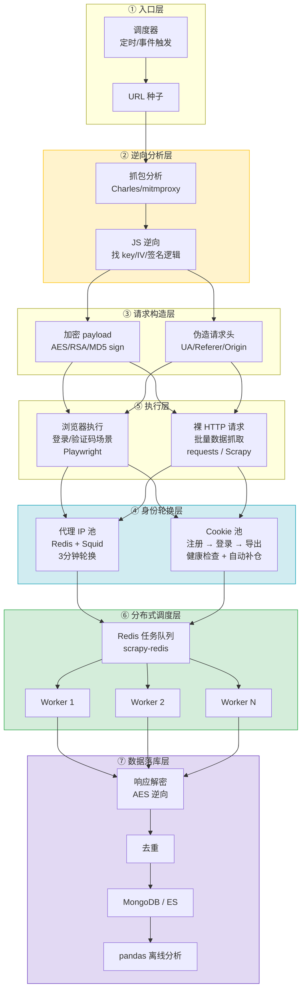

周三下午两点，第三杯咖啡凉透了。屏幕上 Chrome DevTools 的 Network 面板里，那个登录请求的 Payload 还是一坨看不懂的东西——`U2FsdGVkX1` 开头，后面跟着几百个字节的乱码。你用 `requests.post()` 原样发过去，服务器回你一个 403。你把浏览器里发出的原始字节复制粘贴，再发一次，还是 403。

你他妈的明明发的东西一模一样。

这就是爬虫这行的第一课：**你以为你发的跟浏览器一样，其实不一样**。中间差的东西，就是我这篇文章想讲清楚的。

2018 年中到 2019 年底，我在搞一个保险条款爬虫系统。听起来很无聊是吧——爬保单、爬费率表、爬保障细则。但各家保险网站和经纪平台的安全机制可以说是八仙过海。Selenium、Scrapy、Pyppeteer 这些工具当然都知道，但从"知道工具存在"到"写一个能稳定跑十天的爬虫"，中间隔着一整个太平洋。

这篇文章记录的是我踩过的坑。不是教程，不是最佳实践，就是一线记录。所有东西都围绕抓取保险条款这个真实场景展开。

---

## 你面对的其实是三个问题

先把格局拉开一点。2018 年那会儿，你想爬一个稍微上点台面的网站，基本是三座大山：

1. 登录接口发的数据是加密的，你拼不出来
2. 页面内容是 JS 渲染的，`requests.get()` 拉下来就是一个空壳
3. 跑了 20 个请求之后 IP 被拉黑，只能出门晒太阳

这三座大山分别对应三个核心技术问题：**逆向加密**、**浏览器模拟**、**身份轮换**。它们不是独立存在的——你解了加密没有代理，等于白解；有了代理没有 Cookie 池，照样被封；三层都搞定了，单机跑不动还得上分布式。

好，现在一层一层来。

---

## 第一章：登录这件事，比你想的麻烦得多

### 你看到的和你拿不到的

想象你在一个保险产品查询平台的登录页。打开 DevTools，切到 Network 面板，输入用户名密码，点登录。

请求发出去了。Payload 长这样：

```json
{
  "data": "U2FsdGVkX1+...很长一坨...",
  "timestamp": 1559347200,
  "sign": "a1b2c3d4e5f6..."
}
```

卧槽，这什么东西？你没发过这串东西。

真相是：前端在你点登录按钮的那一刻，已经对你的明文密码做了一套组合拳。通常是几种算法的排列组合：

| 算法       | 它干了什么         | 你怎么办                         |
| ---------- | ------------------ | -------------------------------- |
| MD5        | 把密码哈希了       | 彩虹表撞，或者直接重放哈希值     |
| SHA-256    | 做了个签名         | 哈希不可逆，但你可以复现签名过程 |
| AES        | 加密了整个 payload | 找到 key 和 IV 就能解            |
| RSA        | 用公钥加密了密码   | 拿不到私钥，但公钥可以拿来加密   |
| Base64     | 混淆了一下         | 直接解码，不叫加密               |
| 自定义异或 | 自己搓的玩具加密   | 几组测试数据就能看出规律         |

2018 年底我遇到的一个真实例子。前端做了这件事：

```javascript
const encrypted = CryptoJS.AES.encrypt(
  JSON.stringify({ username, password }),
  CryptoJS.enc.Utf8.parse('some-hardcoded-key'),
  { mode: CryptoJS.mode.ECB, padding: CryptoJS.pad.Pkcs7 },
).toString()
```

key 是硬编码在 webpack 打包的 JS 里的。找到它之后，用 Python 复现就是几行的事：

```python
from Crypto.Cipher import AES
import base64, json

key = b'some-hardcoded-key'
cipher = AES.new(key, AES.MODE_ECB)
data = json.dumps({'username': 'user', 'password': 'pass'})
padded = data + chr(16 - len(data) % 16) * (16 - len(data) % 16)
encrypted = base64.b64encode(cipher.encrypt(padded.encode()))
```

看起来很简单对吧？就六行代码。

真正要命的是——你怎么在五万行压缩过的 JS 里找到这个 key？怎么确认用的是 ECB 而不是 CBC？怎么保证你 Python 加密出来的结果跟浏览器发出去的字节完全一致？这三件事，哪一件都不是"搜一下"能解决的。

### 当你打开 DevTools，网站开始发疯

更卧槽的事情在后面。你打开 Chrome DevTools，准备开始调试，页面突然卡住了——停在一个 `debugger` 语句上。你点继续执行，马上又触发下一个。无限循环。

网站上埋了这种东西：

```javascript
;(function () {
  setInterval(function () {
    debugger
  }, 100)
})()
```

更有甚者用 `Function("debugger")()` 动态生成，你搜字符串都搜不到。

这就是反调试陷阱。它不阻止你访问页面，但它让调试体验变成一种折磨。每 100 毫秒弹出来一次，你的思路被切得稀碎。

我当时对付这玩意儿有几招：

1. **"Never pause here"**：在 Chrome DevTools 里右键行号，选这个选项。对付静态的 `debugger` 语句够用了。

2. **禁用所有断点**：Sources 面板上那个带斜杠的暂停图标。点一下，所有断点静默。简单粗暴。

3. **在反调试代码运行前劫持它**：

```javascript
var _setInterval = window.setInterval
window.setInterval = function () {}
```

4. **用代理在源头拦截**：通过 mitmproxy 或 Fiddler 拦截包含反调试代码的 JS 文件，直接把 `debugger` 删掉再发回去。这是最稳的方案——代码在浏览器看到之前就已经被改了。

实战里一个保险平台可能同时用 `setInterval` 丢 `debugger`、代码里散落几个 `Function("debugger")()`、再加一个检测 DevTools 是否打开的计时器。你得一层一层关掉。像剥洋葱，每一层都想让你流眼泪。

### 在五万行屎山代码里找一个函数

过了反调试陷阱，真正的活才开始。

你在一个 18000 行的 webpack bundle 里找加密函数。代码被压缩成一行，变量名叫 `a`、`b`、`c`。这时候你需要一套方法，而不是运气。

我当时的工作流程是这样的：

1. **XHR 断点**：在 Sources → XHR/fetch breakpoints 里，给登录请求的 URL 加断点。请求发出的那一瞬间，调用栈直接告诉你发送前经过了哪些函数。这是最快定位加密逻辑的方式。

2. **全局搜索关键字**：`Cmd+Shift+F`，搜 `encrypt`、`AES`、`CryptoJS`、`sign`、`md5`。即使是压缩过的代码，这些字符串通常不会消失。

3. **沿着调用栈往上追**：断点命中以后，不要只看当前函数。调用加密函数的那个函数往往是构造 payload 的——看懂它，你就看懂了一半。

4. **在 Console 里做实验**：在加密调用前设断点，然后在 console 里用测试数据直接调函数、看输出。这个阶段是确认你理解对不对的关键——值不值得开始写 Python，全看这一刻的判断。

说个具体的。2019 年初那个保险条款查询平台，登录接口的数据长这样：

```json
{
  "data": "U2FsdGVkX1+...",
  "timestamp": 1559347200,
  "sign": "a1b2c3d4e5f6..."
}
```

`sign` 字段是 `md5(timestamp + 固定secret + 加密后的data)`。不带 sign 发请求，403。sign 算错了，也 403。

要穿过这道门，你必须：

1. 在 Sources 面板里找到 sign 是在哪算的（全局搜 `md5`）
2. 找到那个固定 secret（它是某段字符串的 `btoa` 结果，在 console 里解码就行）
3. 在 Python 里精确复现字符串拼接的顺序

这种活极其枯燥。但我干到第十次的时候发现了一个真相：**大部分网站用的加密库就那几个**——CryptoJS、JSEncrypt、jsrsasign。手法也八九不离十。你有了一套调试流程，剩下的就是体力活。

---

## 第二章：身份的游戏

### 你的 IP 就是你的脸

没有代理的爬虫在裸奔。这句话不是比喻。

机房 IP 几分钟就会被限频。家宽 IP 能撑久一点——但你就一个。一个 IP 在短时间内请求同一个网站的几百个页面，这在任何风控系统眼里都不是人类行为。

解法是搞一堆可以轮换的 IP。2018-2019 年国内的代理市场极其碎片化，我当时摸过的主要是这几类：

**静态短效 IP**：你给一笔钱买一组 IP，3-5 分钟内这些 IP 归你。过期后被回收，分配给下一个客户。芝麻代理、站大爷、蘑菇代理都做这类业务。对于绝大多数爬虫项目，这是性价比最高的选择——轮换够快、带宽还行、成本可控。代价是它们是机房 IP，有些网站对机房 IP 封得特别狠。

**动态转发**：服务商不给你 IP 列表，给你一个转发端口。你把请求发到他们的服务器，他们通过自己的 IP 池帮你转发出去。按次计费。听起来很爽对不对？但一个页面请求 0.3-0.5 元，一天爬几千页，账根本算不过来。高并发场景下这种方案就是无底洞。

**隧道代理**：阿布云这类，按月订阅，给一个 API，需要的时候自取 IP。IP 质量普遍更高，因为服务商自己维护了底层基础设施。

**按流量计费**：像流光这类，不按 IP 数量收费，按数据流量算。买 10GB 流量，想用多少 IP 都行。对大 payload 场景比按次计费省很多。

**选服务商的时候你真正在意的几件事**：

- 能不能选地理区域？爬保险条款，不同省份返回的产品不一样
- 认证方式是 IP 白名单还是用户名密码？前者省事，后者灵活
- IP 质量：共享还是独享？独享效果一直更好，但是贵 2-3 倍
- 提取方式是 URL 还是 SDK？URL 可移植性最好

还有一个土办法——如果你预算特别紧，2018 年有不少人用 VPS（DigitalOcean、Vultr 都行），程序化重启网络接口换一个新 IP。速度慢（每次 30-90 秒），但除 VPS 本身费用外几乎不花钱。低频爬虫的备选方案。

### 自己搭代理层

如果你已经有一批 IP，想让它们管理得更规整，2018 年最简洁的方案是 Squid。

为什么要自己搭代理层？因为你想让**代理和爬虫解耦**。你的 Python 代码不应该知道、也不应该关心 IP 是怎么轮换的。它只需要往本地代理发请求就行了。

部署一行就够了：

```bash
docker run -d --name squid \
  --restart=always \
  -p 3128:3128 \
  -v /data/squid/cache:/var/spool/squid \
  sameersbn/squid:latest
```

配置上有几条硬道理：

```
# 不要用默认端口——会被扫
http_port 0.0.0.0:9128

# 必须认证
auth_param basic program /usr/lib/squid/basic_ncsa_auth /etc/squid/passwords
auth_param basic realm proxy
acl authenticated proxy_auth REQUIRED
http_access allow authenticated

# 其他全部拒绝
http_access deny all

# 爬虫不需要缓存
cache deny all
```

为什么这样配：

- **非标准端口**：3128、8080、1080 这些默认端口，公网上 24 小时不间歇地被人扫。用 9128 能减少 90% 以上的噪音。
- **必须认证**：公网上的开放代理几个小时之内就会被发现并被滥用。basic auth 加一个随机强密码，挡住大部分扫描器。
- **云安全组**：在防火墙层面只允许来自你爬虫服务器的入站连接。深度防御——就算密码泄漏了，别人也连不上。

Squid 本身不支持自动轮换上游 IP。你需要一个轮换层：

```python
import requests
import random

class ProxyPool:
    def __init__(self):
        self.proxies = []
        self.refresh_proxies()

    def refresh_proxies(self):
        resp = requests.get('https://provider-api.com/get-ips?num=50')
        self.proxies = resp.json()['data']

    def get_proxy(self):
        if not self.proxies:
            self.refresh_proxies()
        return random.choice(self.proxies)

    def request(self, url, **kwargs):
        proxy = self.get_proxy()
        return requests.get(
            url,
            proxies={'http': proxy['http'], 'https': proxy['https']},
            **kwargs
        )
```

这个思路的核心是：**代理层的问题在代理层解决，不要让爬虫代码分担这个负担**。这是一个分离关注点的设计原则，但放在爬虫语境里它意味着——当代理池挂了，你只需要修代理池，不需要改任何一行爬虫代码。

---

## 第三章：让浏览器替你干活

### 什么时候你需要一个真的浏览器

有些网站的登录流程，几乎不可能用裸 HTTP 请求复现：

- 多步骤登录向导，CSRF token 嵌在某个 `<script>` 标签的深处
- 登录后弹验证码，而且验证码的触发规则不透明
- 需要通过企业 SSO 跳转
- 需要短信或邮件验证码才能进

面对这种场景，务实方案是用 headless 浏览器走登录这一步。登录完成后把 Cookie 导出，交给后续的 Scrapy 或 requests 会话用。

你用浏览器只干登录这 30 秒的活——而不是对每个条款页面都拉起一个完整浏览器。

```python
import asyncio
from pyppeteer import launch

async def login_and_get_cookies():
    browser = await launch(headless=True, args=['--no-sandbox'])
    page = await browser.newPage()

    await page.goto('https://broker.example-insurance.com/login')
    await page.type('#username', 'broker_account')
    await page.type('#password', 'broker_pass')
    await page.click('#login-btn')
    await page.waitForNavigation()

    cookies = await page.cookies()
    await browser.close()
    return cookies
```

拿到 Cookie 之后，把它交给你的 Scrapy Spider。后面的几千个页面请求都用这个 Cookie 发，完全不需要再碰浏览器。这种"浏览器只做闸门"的模式，是 2018 年最实操的高级玩法。

### 你的鼠标出卖了你

2018 年有些保险平台开始分析鼠标轨迹。如果你的鼠标从 (0,0) 直线跳到 (500,300)，这他妈的显然不是人类。

解法是用贝塞尔曲线模拟类人运动：

```python
import random
import asyncio
from typing import List, Tuple

def bezier_curve(p0, p1, p2, p3, steps=50):
    """三次贝塞尔曲线——平滑曲线的数学描述"""
    points = []
    for t in [i / steps for i in range(steps + 1)]:
        x = ((1 - t) ** 3) * p0[0] + 3 * ((1 - t) ** 2) * t * p1[0] + \
            3 * (1 - t) * (t ** 2) * p2[0] + (t ** 3) * p3[0]
        y = ((1 - t) ** 3) * p0[1] + 3 * ((1 - t) ** 2) * t * p1[1] + \
            3 * (1 - t) * (t ** 2) * p2[1] + (t ** 3) * p3[1]
        points.append((x, y))
    return points

def generate_mouse_path(start, end, steps=60):
    cp1 = (
        start[0] + (end[0] - start[0]) * random.uniform(0.2, 0.4),
        start[1] + random.uniform(-50, 50)
    )
    cp2 = (
        start[0] + (end[0] - start[0]) * random.uniform(0.6, 0.8),
        end[1] + random.uniform(-50, 50)
    )
    path = bezier_curve(start, cp1, cp2, end, steps)

    # 人类会先冲过头再拉回来
    overshoot = (end[0] + random.uniform(-5, 10), end[1] + random.uniform(-5, 10))
    path.append(overshoot)
    path.append(end)
    return path

async def human_like_move(page, x, y):
    start = (random.randint(0, 200), random.randint(0, 200))
    path = generate_mouse_path(start, (x, y))
    for px, py in path:
        jx = px + random.gauss(0, 0.5)  # 人手有微幅抖动
        jy = py + random.gauss(0, 0.5)
        await page.mouse.move(jx, jy)
        await asyncio.sleep(random.uniform(0.005, 0.015))
```

这还不够完美——高级反爬系统还会分析时间模式、滚动节奏、UI 交互顺序。但比起当时大多数爬虫用的"起点到终点直线"方案，已经好太多了。记住这是一场军备竞赛，你不可能一劳永逸。

### 远程调试：一个被低估的技巧

2018 年最实用但最少人提的技巧：Chrome 远程调试。

你的爬虫跑在云服务器上。页面出了 bug，你看不到浏览器里发生了什么。这时候你可以在服务器上以调试模式启动 Chrome：

```bash
google-chrome \
  --headless \
  --remote-debugging-port=9222 \
  --no-sandbox \
  --user-data-dir=/tmp/chrome-profile
```

然后从本地建一条 SSH 隧道：

```bash
ssh -L 9222:localhost:9222 user@server
```

在你的本地 Chrome 里打开 `chrome://inspect`，就能用完整的 DevTools 操作远程服务器上的页面——检查元素、设断点、看网络请求，全都是远程的。

这个技巧的妙处在于：你可以在一个因地理限制返回不同内容的保险门户网站上，用目标地区的服务器去拿到真实页面，同时在自己电脑上完整地调试它。调试和获取是在同一个环境里完成闭环的。

---

## 第四章：数据拿回来了，但它是加密的

### 双向加密的困局

有些网站不仅加密请求，还加密响应。你千辛万苦发出了正确的加密请求，拿回来的是一坨同样看不懂的东西。得再解密一次才能看到真正的保单数据。

这类手法常见于保险核保平台、产品比对网站、理赔管理系统——任何通过内部 API 暴露结构化数据的场景。

逆向的思路跟登录加密差不多，只是方向反了：

1. 在 API 端点上设 XHR 断点
2. 触发一个请求
3. 从响应处理器往上追调用栈
4. 找 `CryptoJS.AES.decrypt()` 的调用

通常你会看到类似这样的拦截器代码：

```javascript
axios.interceptors.response.use(function (response) {
  if (response.data && response.data.encrypted) {
    var decrypted = CryptoJS.AES.decrypt(response.data.encrypted, CryptoJS.enc.Utf8.parse(KEY), {
      mode: CryptoJS.mode.CBC,
      iv: CryptoJS.enc.Utf8.parse(IV),
    })
    response.data = JSON.parse(decrypted.toString(CryptoJS.enc.Utf8))
  }
  return response
})
```

拿到了算法、key 和 IV，Python 这边就是镜像操作：

```python
from Crypto.Cipher import AES
from Crypto.Util.Padding import unpad
import base64, json

def decrypt_response(encrypted_b64: str, key: str, iv: str) -> dict:
    cipher = AES.new(key.encode('utf-8'), AES.MODE_CBC, iv.encode('utf-8'))
    encrypted = base64.b64decode(encrypted_b64)
    decrypted = cipher.decrypt(encrypted)
    unpadded = unpad(decrypted, AES.block_size)
    return json.loads(unpadded.decode('utf-8'))
```

有了解密函数，你的数据流就变成了：发请求 → 拿加密响应 → 解密 → 拿到结构化 JSON → 提取保单信息。

一个重要的发现：**解密后的 API 响应往往比页面上渲染出来的丰富得多**。渲染后的 HTML 每页可能只展示 20 个产品的基本摘要。但解密后的 JSON 里，可能是完整的保单文档——全部条款、附加险、免责清单、保费明细。你拿到的数据比页面上任何人能看到的多。

---

## 第五章：Cookie 也是需要养活的

### 你不只是一个 IP，你是一个"人"

IP 换了还不够。很多网站用 Cookie 追踪会话。同一个 Cookie 短时间内请求太多，照样会被标记。

解法是维护一个 Cookie 池——注册多个账号，登录后提取 Cookie，存起来轮换。

**批量注册账号**：用 Puppeteer 或 Selenium 走注册流程。邮箱验证用临时邮箱服务（Guerrilla Mail、10 分钟邮箱）解决。手机验证是真正的难点——你需要接码平台，那个不便宜。

**登录并导出 Cookie**：注册后登录，提取 Cookie，按这个格式入库：

```json
{
  "account_id": "broker_1234",
  "cookies": [
    { "name": "sessionid", "value": "abc123...", "domain": ".example-insurance.com" },
    { "name": "csrftoken", "value": "xyz789...", "domain": ".example-insurance.com" }
  ],
  "created_at": "2019-06-15T10:30:00Z",
  "last_used": "2019-06-15T10:30:00Z",
  "status": "active"
}
```

### Cookie 会死，你需要殡仪馆

Cookie 过期。会话超时。服务端可能在 30 分钟不活动后让会话失效，也可能设一个固定生命周期（比如 24 小时）。

维持一个可用的 Cookie 池需要持续监控：

```python
import time
import redis
import json

class CookiePool:
    def __init__(self, redis_client, min_pool_size=20):
        self.redis = redis_client
        self.min_pool_size = min_pool_size

    def get_cookie(self) -> dict:
        cookie_ids = self.redis.smembers('cookie_pool:active')
        if len(cookie_ids) < self.min_pool_size:
            self.trigger_refill()

        cookie_id = random.choice(list(cookie_ids))
        cookie_data = json.loads(self.redis.get(f'cookie:{cookie_id}'))
        cookie_data['last_used'] = time.time()
        self.redis.set(f'cookie:{cookie_data["account_id"]}', json.dumps(cookie_data))
        return cookie_data

    def validate_cookie(self, account_id: str) -> bool:
        cookie_data = json.loads(self.redis.get(f'cookie:{account_id}'))
        try:
            resp = requests.get(
                'https://www.example-insurance.com/api/account',
                cookies={c['name']: c['value'] for c in cookie_data['cookies']},
                timeout=5
            )
            return resp.status_code == 200
        except Exception:
            return False

    def trigger_refill(self):
        # 调 Puppeteer 登录脚本来补充池子
        pass
```

实战中的维护节奏：

- **每 5 分钟抽查**：随机挑 5 个 Cookie 测试。失败率超过 20%，跑一轮全量检查。
- **每 30 分钟全量检查**：测试所有 Cookie，移除死掉的。
- **池子低于阈值，触发补充**：自动走注册和登录流水线。
- **每次请求轮换**：简单随机选择就够了——关键是别让单个会话表现出异常活跃的模式。

Cookie 的属性里有几个坑要注意：

- `httpOnly`：设置为 `true` 时，JavaScript 访问不到这个 Cookie——但 Python 的 `requests` 库照样能发。所以别用 JS 能访问到的 Cookie 来判断 python 能发什么。
- `secure`：只通过 HTTPS 发。忘记这个，本地调试的时候你会花一小时骂自己。
- `expires`：服务端往往在应用层设了更短的会话超时，所以不要太相信这个值。

经验法则：**把每个 Cookie 当作 15 分钟不活动就可能失效来处理**。

---

## 第六章：分布式——一台机器不够用的时候

### 把问题拆开

到 2019 年底，我最终确立了一套分层架构来做保险条款爬虫。

你把它想象成一个流水线：

```
调度器（什么时候爬）
  ↓
任务队列（爬什么——Redis 里存 URL，带优先级和重试次数）
  ↓
Worker 集群（谁来爬——多个 Scrapy 实例，共享队列）
  ↓
代理池（换脸——Squid 实例 + 上游 IP 轮换）
  ↓
Cookie 池（换身份——Redis 管理，带健康检查和自动补充）
  ↓
目标网站
  ↓
数据管道（去重 → 校验 → 存储 → 索引）
```

每一层是独立的。代理挂了不影响 Cookie 池。Cookie 池空了不影响 Worker 拿到任务。这种解耦意味着你不会在凌晨三点被一个单点故障叫醒。

### 让多个 Worker 共享一个任务队列

Scrapy 本身是个单机框架。但加上 `scrapy-redis`，它就能共享请求队列：

```python
# settings.py
SCHEDULER = "scrapy_redis.scheduler.Scheduler"
DUPEFILTER_CLASS = "scrapy_redis.dupefilter.RFPDupeFilter"
REDIS_URL = 'redis://localhost:6379/0'
REDIS_START_URLS_KEY = 'spider:start_urls'
```

有了这个配置，你在任何一台机器上往 Redis 推一个 URL：

```bash
redis-cli lpush spider:start_urls "https://www.example-insurance.com/policies/page/1"
```

任何空闲 Worker 都会取走。简单、稳定、水平扩展。你要做的就是加机器——每个 Worker 跑在独立服务器或 Docker 容器上，从同一个 Redis 实例取任务。

### IP 代理池也独立管理

```python
# proxy_pool.py
import redis
import requests
import json
import time

class ProxyPoolManager:
    def __init__(self, redis_client):
        self.redis = redis_client
        self.refresh_interval = 180  # 3分钟

    def refresh_proxies(self):
        resp = requests.get('https://proxy-api.com/get?num=50&format=json')
        proxies = resp.json()['proxies']
        pipe = self.redis.pipeline()
        for proxy in proxies:
            key = f"proxy:{proxy['ip']}:{proxy['port']}"
            pipe.setex(key, self.refresh_interval * 2, json.dumps(proxy))
        pipe.execute()

    def run(self):
        while True:
            try:
                self.refresh_proxies()
            except Exception as e:
                print(f"代理刷新失败: {e}")
            time.sleep(self.refresh_interval)
```

Worker 侧只做一件事——从 Redis 拿代理：

```python
def get_random_proxy(redis_client) -> dict:
    keys = redis_client.keys('proxy:*')
    if not keys:
        return None
    key = random.choice(keys)
    return json.loads(redis_client.get(key))
```

代理和 Cookie 独立管理。Worker 不知道代理从哪来的，也不知道 Cookie 怎么维护的——它只需要向各自的池子请求。这是设计上的减法，但它的收益是乘法的。

### 数据存进去只是第一步

数据量上来以后，去重和检索就变成新的问题。

**去重**：URL 层面，`scrapy-redis` 通过 Redis set 自动处理。Item 层面，需要自己来：

```python
class DedupPipeline:
    def __init__(self, redis_client):
        self.redis = redis_client

    def process_item(self, item, spider):
        key = f"seen:{item['insurer']}:{item['policy_id']}"
        if self.redis.exists(key):
            raise DropItem(f"重复: {item['policy_id']}")
        self.redis.setex(key, 86400 * 7, '1')
        return item
```

**存储**：2018-2019 年 MongoDB 是爬虫数据的默认选择。非结构化数据友好、写入吞吐好、文档模型天然匹配保险条款那种多层嵌套结构——主条款下面有附加险、除外责任、现金价值表。

```python
from pymongo import MongoClient

class MongoPipeline:
    def __init__(self):
        self.client = MongoClient('mongodb://localhost:27017/')
        self.db = self.client['insurance_data']

    def process_item(self, item, spider):
        collection = self.db[spider.name]
        collection.update_one(
            {'_id': item['policy_id']},
            {'$set': dict(item)},
            upsert=True
        )
        return item
```

数据量到百万级，就要做批量写入：

```python
class BatchMongoPipeline:
    def __init__(self):
        self.buffer = []
        self.batch_size = 100

    def process_item(self, item, spider):
        self.buffer.append(dict(item))
        if len(self.buffer) >= self.batch_size:
            self.flush(spider)
        return item

    def flush(self, spider):
        self.db[spider.name].insert_many(self.buffer)
        self.buffer.clear()

    def close_spider(self, spider):
        if self.buffer:
            self.flush(spider)
```

当 MongoDB 里有了上千万条保单记录，不加索引查一次就是噩梦。给常用查询字段建索引——保险类型、保费、生效日期。对于时序数据（保费变化、新产品上线），按天分集合能让删旧数据变得简单，单个集合也控制在可控大小。

做临时分析的时候用 pandas：

```python
import pandas as pd
from pymongo import MongoClient

client = MongoClient()
cursor = client.insurance_data.policies.find(
    {'insurance_type': 'medical'},
    {'_id': 0, 'product_name': 1, 'premium': 1, 'coverage_amount': 1}
)
df = pd.DataFrame(list(cursor))
df['premium'] = pd.to_numeric(df['premium'])
print(df.describe())
```

实时报表的需求上 Elasticsearch。数据一边入库一边往 ES 灌，立刻就能全量搜索和聚合。

---

## 第七章：2026 年回头看

从上面这些记录到现在，好几年过去了。底层原理并没有太大变化——加密还是加密，Cookie 还是 Cookie——但格局在几个方向上变了。

### 更难的东西

**Bot 检测大幅进化了**。Cloudflare、Akamai、DataDome 现在会分析 TLS 指纹（JA3/JA4）、HTTP/2 帧模式、Canvas/WebGL 指纹，甚至键盘输入的时间模式。一个裸的 `requests.get()` 加个假 User-Agent，在受保护网站上几乎秒识别。

**验证码隐形化了**。reCAPTCHA v3 和 hCaptcha 对每个页面访问都做隐性评分。你连挑战框都看不到——分数不够，网站直接返回垃圾数据。要过这关，你得模拟一个能通过所有指纹检测的浏览器。

**数据藏得更深了**。很多保险服务把数据移到了移动 App 里，加上证书固定和混淆的 API 协议。要爬这些，要么逆向移动 App（Frida、objection、APK 反编译），要么在网络层拦截 API 流量（mitmproxy + 证书解固定）。

**法律风险更复杂了**。GDPR、CCPA 和各种数据保护法让爬虫的法律边界更模糊。几个典型判例（hiQ v. LinkedIn、Van Buren v. US）明晰了部分规则，但整体上依然是灰色地带。

### 更简单的东西

**AI 辅助逆向**。2026 年你可以把一段混淆的 JS 扔给 LLM，几秒内拿到一份基本准确的解混淆版本。不一定 100% 对，但能省掉 80% 的工作。ChatGPT、Claude 和各种 Copilot 集成能识别加密模式、建议 Python 等价写法、协助重构函数逻辑。

**Headless 浏览器的可靠性**。Playwright 已基本取代 Puppeteer，支持多浏览器（Chromium、Firefox、WebKit），自动等待做得更好，有微软持续维护。对需要 JS 渲染的抓取场景，Playwright + stealth 插件是当前的最佳实践。

**代理基础设施**。家宽代理网络成熟了很多。Bright Data、Oxylabs、Smartproxy 提供海量高质量 IP 池，价格相比 2018 年大幅下降。但高并发爬虫如果自己做，机房代理配合精心轮换仍然是经济上的优选。

**新工具的出现**：

- **Crawlee**（Apify）：现代 Python 框架，同时支持 HTTP 抓取和 headless 浏览器，内置自动扩缩容和代理轮换。
- **ScrapeGraphAI**：基于 LLM 的爬虫，用自然语言描述目标 schema 就能提取结构化数据。做原型不错，但太慢太贵，不适合生产链路。
- **Browserbase / Rebrowser**：Headless 浏览器即服务平台，帮搞定指纹、代理、验证码。付溢价，省掉基础设施投入。

### 没变的东西

**核心工作流**：你还是需要理解加密、管理代理、处理 Cookie、把工作分配到多个 Worker。工具在变，问题没变。

**规模经济**：每月爬几百万页的话，自己搭代理池、Cookie 池、分布式架构仍然比付给爬虫 SaaS 便宜。小项目的话，SaaS 工具已经好到不值得自己折腾了。

**JS 逆向的核心地位**：即使有 AI 辅助，你还是需要理解自己看的是什么。LLM 会幻觉。它会建议一个听起来很像的解密方案，但输出是垃圾。那个"逐字节验证 Python 解密和浏览器输出是否一致"的能力——目前没有被自动化。

**猫鼠游戏**：网站加新的反爬措施，爬虫方开发新的对策。循环继续。具体技术在进化，底层博弈和 2018 年一模一样。

---

## 全景关系图

从请求发出到数据落库，七个层次一条链路。下面这张图把文章里散落的组件串起来，让你一眼看清谁在谁上面、谁依赖谁。



这张图的阅读方式：

- **纵轴是数据流向**，从上到下是"URL 种子 → 分析 → 构造 → 轮换身份 → 执行 → 调度 → 存库"
- **加密逆向（黄色）**在入口之后、请求发出之前——它决定了你能不能通过门禁
- **身份轮换（蓝色）**横跨执行层，代理和 Cookie 同时生效——缺一个就是裸奔
- **分布式调度（绿色）**把单点变成集群，Worker 之间无状态，加机器就加速
- **数据落库（紫色）**是最后一环，响应解密必须在入库之前完成

你对照着各章回看：第一章和第四章对应逆向分析层和请求构造层的"加密/解密"两个方向；第二章和第五章对应身份轮换层；第三章对应浏览器执行；第六章把执行层和调度层拆开。这张图就是整篇文章的目录。

---

## 读者常见困惑预判（FAQ）

**Q: requests 和浏览器发出的请求到底差在哪？**

A: 差在三个层面。第一层 TLS——`requests` 用的是 Python 的 TLS 库，JA3 指纹跟 Chrome 完全不一样，Cloudflare 在握手阶段就能识别你是脚本。第二层 HTTP 头——浏览器会自动带几十个请求头（`Sec-Ch-Ua`、`Sec-Fetch-Site`、各种优先级头），而且顺序是固定的，`requests` 不帮你干这事。第三层 JS 执行——浏览器先跑完页面上所有 JS 之后再发 AJAX 请求，过程中可能改了 header、加了 token、算了签名，`requests` 完全不知道有这回事。所以你以为你复制了浏览器里的请求，其实你只复制了最后一帧画面，前面整部电影你都没看。

**Q: 什么时候用 Selenium 什么时候用 Playwright？**

A: 2026 年还在纠结这个的话——直接用 Playwright，别他妈的犹豫了。Selenium 4 比以前好很多，但 Playwright 的自动等待、网络拦截 API、多浏览器支持、以及跟现代反检测方案的集成度，已经不是同一个时代的东西。唯一保留 Selenium 的理由是你公司现有的测试基础设施全绑在 Selenium 上，换框架成本太高。新项目从零开始，Playwright + `playwright-stealth` 是当前的最佳组合。

**Q: 代理 IP 池到底要多大才够？**

A: 这是个算数题，不是玄学。先搞清楚目标网站的限频阈值：假设每个 IP 每分钟最多发 N 个请求不触发风控，你需要维持的爬取速率是每分钟 M 个请求，那池子底线就是 `M/N`。然后乘以 1.5 到 2 的安全系数——因为代理会挂、会被回收、会有少数被提前封禁。中等规模爬虫（每分钟 100-200 请求），50-100 个 IP 的池子通常够用。但记住：**轮换策略比绝对数量重要得多**。100 个 IP 用随机拿的策略，比 500 个 IP 每次都从第一个开始顺序拿效果好。真正决定你死不死的是单个 IP 在时间窗口内的曝光频率，不是池子有多大。

**Q: 爬虫被发现了怎么办？**

A: 先判断你到底是被"发现"了还是被"针对"了。429（限频）→ 降速，加延迟，换 IP。403 / 连接超时 → IP 进了黑名单，代理池自动切换就行，不算大事。最逆天的情况是返回假数据——返回码 200，数据结构也对，但内容是假的——你以为在正常爬，其实在收集垃圾。解法就一招：定期用已知的真实数据做抽查对比。比如你爬保险条款，抽几个已知产品的保费和保障额度，拿爬回来的数据对一下，对不上就说明被"投毒"了。如果确认被投毒，唯一的出路是**整栈换身份**：新 IP + 新 Cookie + 新 UA + 新 TLS 指纹，相当于整个重新来过——网站风控系统给你建的那份"可疑画像"彻底作废。最后说一句大实话：永远不要觉得自己能完全躲过检测。这是一场军备竞赛，你的目标不是隐形，是让爬取速度远低于对方封禁你的阈值。

---

## 你不用全记住——但要会问对的问题

这篇文章从头到尾是我两年里踩过的坑。你不需要记住每一个代码片段，但如果你下次面对一个防爬网站，可以拿下面这组问题来掂量局面：

1. **加密在哪个环节？** 登录请求？API 响应？还是两头都加密？先搞清楚你需要逆向几个方向。

2. **JS 好找吗？** 是 webpack 打包的还是自研框架？代码格式化后能看吗？大概有多少行？

3. **身份轮换需要几个维度？** 只换 IP 够不够？还是 Cookie 也会被追踪？需不需要维护一个账号池？

4. **需要浏览器吗？** 如果登录流程复杂（多步骤、验证码、SSO），考虑用 headless 浏览器只走登录这一步。后续的批量抓取用裸 HTTP。

5. **规模多大？** 几百页，一台机器裸跑就行。几万页，需要代理池和 Cookie 池。几百万页，必须上分布式架构。

6. **能不能买个服务解决？** 你的项目有价值吗？体量多大？如果只是验证一个 idea，用托管爬虫服务。如果这是核心业务数据链路，自己搭基础设施。

7. **法律风险你掂量了吗？** 目标网站有没有 robots.txt 禁止爬取？有没有用户协议限制？数据的使用目的是什么？

就这些东西。2018 年适用的，2026 年大部分仍然适用。工具在进化，手段在迭代，但核心原则没变——搞清楚浏览器到底发了什么、忠实复现它、轮换身份、分散负载。

而且说真的，这东西有意思也就在这儿。爬虫变成完完全全的"已解决问题"的那一天，也是它不再有趣的那一天。
