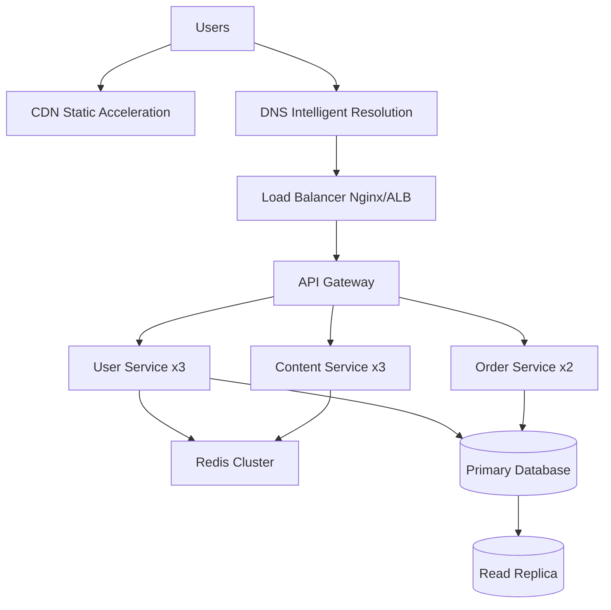
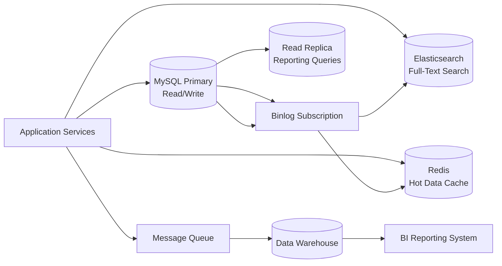
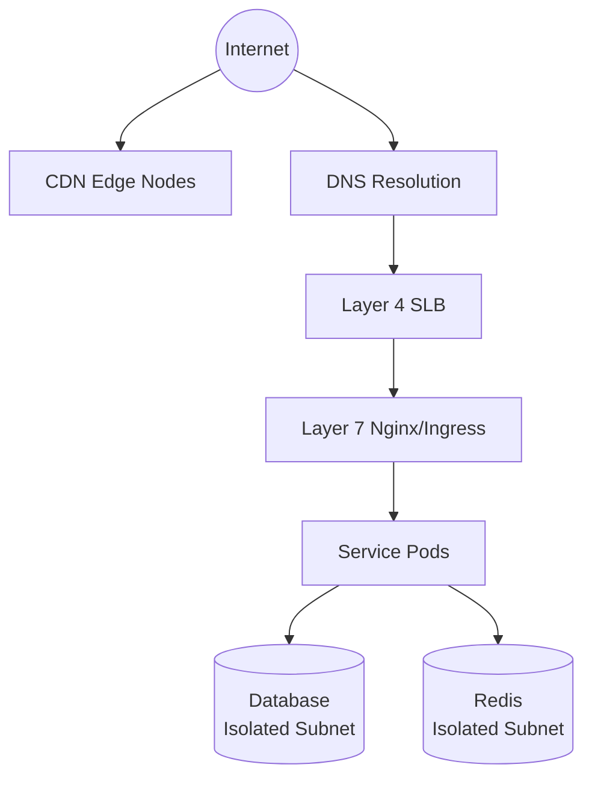
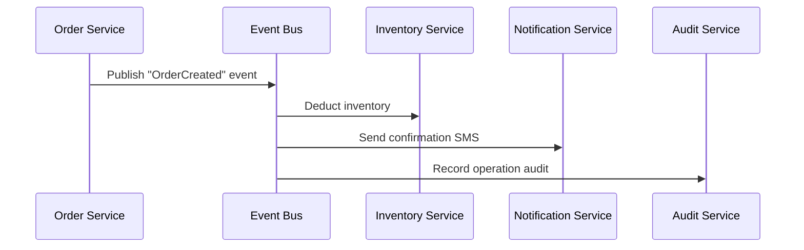
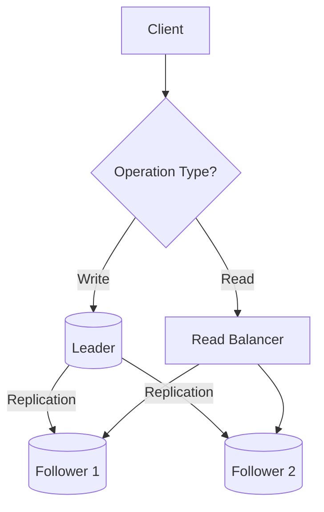

> A deep guide for developers who want to understand what architecture design actually is.

You've probably been in this situation: an interviewer asks, "Walk me through your last company's system architecture." Boxes and arrows flash in your head, but when you start explaining, you realize your version sounds nothing like your colleague's. Or even worse — your lead asks you to draft an architecture plan for a new system, you open draw.io and draw a bunch of boxes, but deep down you're not sure either: will this architecture hold up? Will anyone still be able to maintain it three years from now?

The hardest part of architecture design isn't drawing diagrams. It's **not knowing whether what you drew is right**.

This article won't teach you how to draw diagrams, and it won't paste big-tech architecture charts for you to copy. What we'll really talk about: what architecture design is, how to judge whether an architecture is good or bad, and which dimensions to think through and verify when designing one.

---

## 1. What Architecture Design Actually Is

### 1.1 Architecture Is Not "Software"

When most people first encounter the word "architecture," they think of microservice diagrams or layered architecture diagrams — boxes and arrows. But architecture itself is not the software, not the code, and not even those diagrams.

Architecture is an **abstract description of a system's overall structure and component relationships**.

Think about building a house. Concrete, rebar, and glass are materials (analogous to code and libraries). The blueprint isn't the house itself, but it defines the structure — where the load-bearing walls go, where the utility shafts are, where the elevator shaft sits. That blueprint is the "architecture."

Software architecture is the same — it doesn't care what library you use to implement caching, but it does care about "where the cache layer sits in the overall system and what its boundaries are."

Martin Fowler has a precise definition: **Architecture is the stuff that's hard to change once you get it wrong.** You can swap routing solutions, you can swap ORMs. But "which services are split, how databases are distributed, how cross-service communication works" — once those are set, changing them is surgery.

### 1.2 The Essence of Architecture Design: Decomposition + Collaboration

At its core, architecture design comes down to two things:

1. **What modules (or services, components, layers) should this system be decomposed into?**
2. **How do these modules communicate and collaborate?**

Let's use the restaurant industry as an analogy:

- You open a small diner with two people in the kitchen — one chops, one cooks. You wouldn't create a "cold dishes department," "hot dishes department," and "pastry department" with three layers of architecture. With so few people, the communication overhead of too many modules exceeds the benefits of splitting.
- But you open a large chain restaurant — 500 seats, 3,000 customers a day. Now you can't avoid splitting. The back kitchen splits into cold dishes, hot dishes, pastry, and prep sections. The front of house splits into greeting, ordering, serving, and checkout teams. Once split, you need collaboration rules: "Order tickets come in duplicate — one for the hot kitchen, one for checkout." "After the hot kitchen finishes a dish, the serving team must deliver it to the table within 3 minutes."

That's architecture design — **decomposition is the means, collaboration is the goal**. Split too coarsely, and a single module contains too much, making it impossible to change or test. Split too finely, and the communication overhead between modules exceeds the benefits of the split. The only judgment criterion: **after splitting, did the overall system complexity go down or up?**

---

## 2. The Five "Don'ts"

Before diving into specific architecture types, these principles matter more than any methodology. They're hard-won lessons from countless failures.

### 2.1 Don't Over-Engineer

Over-engineering is the most common mistake engineers make. No contest. It manifests as:

- Daily active users haven't broken 100, but you're already doing microservices + containers + full CI/CD pipelines
- Data volume is in the tens of thousands, but you've already deployed sharding middleware
- Business requirements are still shifting weekly, but you've already defined a "perfect" set of abstractions and interface contracts

A practical litmus test: **Can the current approach survive until the next business milestone? If yes, don't touch it.** A system with 500 DAU — MySQL single table + Redis cache will easily carry you to 50,000 DAU. Six months gives you enough time to understand the business shape before deciding how to split.

The cost of over-engineering isn't "you did some extra work" — it's that the extra work becomes a **shackle** on future iteration. You added five layers of abstraction for "possible future expansion," and three months later the business pivoted. None of those five abstractions are useful, and now every new feature has to route around them.

### 2.2 Don't Blindly Copy Big Companies

Almost every "big tech architecture practice" talk you've seen has an implicit premise: **their traffic volume, organizational size, and business complexity are 100x yours or more.**

Why do big companies adopt microservices? Because they have 5,000 engineers working in a single codebase — without splitting, every day is merge conflict hell. Your team has 5 people and you're running 8 microservices — each person maintains 1.6 services, and all the overhead of version compatibility, debugging traces, and deployment orchestration lands squarely on you.

Big company architecture solutions were designed for **their problems**, not yours. What you should learn is **why** they designed things that way — what constraints they faced, what tradeoffs they made. Not copying their architecture diagram wholesale into your system.

A simple rule: **If you can't explain why you need a piece of technology, don't introduce it.**

### 2.3 Don't Be Too Old, Don't Be Too New

A classic dilemma in tech selection: too new means unstable, weak ecosystem, can't hire for it. Too old means can't hire young talent, community atrophy, security issues left unpatched.

Recommended strategy:

| Project Type                 | Recommended Maturity       | Example                       |
| ---------------------------- | -------------------------- | ----------------------------- |
| Core business path           | Widely proven for 2+ years | PostgreSQL, Redis, Nginx      |
| Non-critical auxiliary tools | Can try newer tech         | Logging, monitoring, CI tools |
| Experimental features        | Can chase new              | Internal tools, tech spikes   |

The core principle: **Don't put new things on the critical path.** Your payment pipeline, user authentication, database — if these break, it's an incident. Use the most stable options. Want to try Vitest over Jest? Fine — put it in your toolchain, run it in test environments, and if it breaks, just switch back. But don't plug a message queue that was released two months ago into your "user places an order" flow.

### 2.4 Don't Detach from Practice

Architecture design isn't an ivory tower exercise. Whether a design is good or bad can only be judged in a specific **business context**. Architecture detached from practice typically shows up in three ways:

**One: Ignoring team capability.** You design a beautiful Event Sourcing + CQRS architecture, but no one on the team has ever worked with event sourcing or even set up an Event Store. Once this goes live, you're the only person who can debug any issue — you've become the system's single point of failure.

**Two: Ignoring upstream and downstream.** Your service exposes a clean RESTful API, but upstream is a legacy system still using SOAP, and downstream is an external vendor that only accepts XML. Your "elegant RESTful design" is nice to look at, but integration becomes a forest of adapters.

**Three: Ignoring hiring.** You pick a niche tech stack — it's great, but the market has almost no one who knows it. Two years later, you want to move on, and the company can't find anyone to take over your service. Or you want to grow the team and discover the candidate pool that knows this stack fits on one hand.

Architecture design needs to consider three time horizons:

- **Short term (3-6 months)**: Can current requirements land quickly? Can the team get up to speed?
- **Medium term (6-18 months)**: How does the system evolve once the business direction stabilizes? How do you pay down tech debt?
- **Long term (18+ months)**: How does collaboration work when the team doubles? How do you prevent system degradation?

---

## 3. System Architecture

System architecture is the highest-level perspective — it's concerned with **hardware resources, service deployment, and network topology**. When you draw a diagram with "Nginx → Gateway → Service Cluster → Database Cluster → Redis Cluster," you're describing system architecture.

System architecture answers these core questions:

- How many machines are services running on? How do we scale up and down?
- What paths does a request take from the user's browser to the database?
- Which nodes are single points? If they go down, does the system still function?
- Where is the traffic entry point? How do we prevent DDoS?



Key design points for system architecture:

1. **Statelessness**: Any request can be handled by any instance. An instance dying shouldn't affect users.
2. **Redundancy**: At least two replicas for every critical node. Don't let a single point become the system's Achilles' heel.
3. **Capacity planning**: Estimate resource requirements based on QPS and data volume. Leave 30% headroom.
4. **Disaster recovery**: Database backups, geo-redundancy — low probability, but if it happens, it's an incident.

> Note: The term "system architecture" is often used interchangeably with "deployment architecture" in practice. Strictly speaking, system architecture includes deployment architecture but also encompasses disaster recovery, scaling, monitoring, and other operational dimensions.

---

## 4. Software Architecture

Software architecture sits one level below system architecture. It's concerned with **how code is organized and how it runs**. When you discuss whether a project should use layered architecture or hexagonal architecture, or whether modules communicate through interfaces or events, you're discussing software architecture.

Common decision dimensions in software architecture:

| Dimension            | Question                           | Example                                     |
| -------------------- | ---------------------------------- | ------------------------------------------- |
| Layering             | How is code organized into layers? | Controller → Service → Repository           |
| Module division      | Split by business or by function?  | User module vs Auth module                  |
| Communication        | Synchronous calls or async events? | HTTP/gRPC vs Kafka/Redis Pub                |
| Dependency direction | Who can depend on whom?            | Upper layers depend on lower, never reverse |
| Shared code          | Where does common logic live?      | libs/common vs copying code                 |
| Extension points     | Where do we allow custom behavior? | Strategy pattern, plugin mechanism          |

Take the classic layered architecture as an example:

```
┌──────────────────────────────────┐
│   Presentation Layer (Controller) │ ← HTTP entry point, parameter validation
├──────────────────────────────────┤
│   Application Layer (Service)     │ ← Business process orchestration, transaction boundaries
├──────────────────────────────────┤
│   Domain Layer                    │ ← Core business rules, no framework dependency
├──────────────────────────────────┤
│   Infrastructure Layer            │ ← Database, cache, message queue implementations
└──────────────────────────────────┘
```

The core discipline of layered architecture: **Dependency direction is always downward. Upper layers can call lower layers, never the reverse.** The moment a lower layer depends on an upper layer (e.g., the Domain layer imports a DTO from the Controller layer), the architecture starts to rot — changes to Controllers break Domain unit tests, and swapping frameworks touches business code.

---

## 5. Data Architecture

Data architecture is the area developers most often overlook — most people only ask "MySQL or PostgreSQL?" But data architecture is far more complex than database selection.

Data architecture addresses these core concerns:

1. **Storage selection**: Relational, document, time-series, graph databases — different data shapes suit different storage
2. **Data distribution**: Single database or sharded? Table partitioning? What's the shard key?
3. **Data consistency**: Strong consistency or eventual consistency? How to handle distributed transactions?
4. **Data flow**: Where does data come from, what systems does it pass through, where does it end up?
5. **Data lifecycle**: How are hot, warm, and cold data tiered? When to archive? When to delete?



Practical advice for data architecture:

- **Don't shard prematurely**. With a single table under 20 million rows, PostgreSQL with proper indexing handles it just fine. By the time you genuinely need sharding, your business is already successful — and you'll have the data volume and business requirements to justify the split.
- **Caching is not a database replacement**. Data in cache must have a fallback path when lost. The database is always the ultimate source of truth for consistency.
- **Read-write separation is the cheapest scaling method**. Most business scenarios are read-heavy. Adding read replicas linearly increases read capacity without code changes.
- **Separate hot and cold data**. Move orders older than 6 months to an archive database. Keeping the primary database lightweight dramatically improves query speed and backup times.

---

## 6. Network Architecture

Network architecture concerns **how data flows between nodes**. In a distributed system, network unreliability is a reality that architecture design must confront — latency, packet loss, and partitions will all happen eventually.

Core topics in network architecture:

1. **Network partition (Split-Brain)**: Nodes in a cluster lose network connectivity, and every node thinks it's the master — how do you prevent two "masters" from writing simultaneously?
2. **Service discovery**: How does a client know which IP and port a target service is on? DNS? Consul? k8s Services?
3. **Load balancing**: Layer 4 or Layer 7? Round-robin or least connections?
4. **Network isolation**: Should services be separated by VPC/security groups? Should databases live in isolated subnets?
5. **CDN and edge computing**: What paths do static assets and dynamic content take respectively?



A key principle of network architecture: **Put eggs in different baskets, but make sure the baskets can't hurt each other.** Meaning — databases and Redis live in isolated subnets so that even if the application layer is compromised, attackers can't get the database IP. But at the same time, design fault isolation at the network level — a problem in one subnet shouldn't bring down the entire cluster.

---

## 7. Security Architecture

Security architecture isn't "adding a firewall" or "using HTTPS" — it's a thread that runs through system architecture, software architecture, and data architecture. Security isn't something you "patch in" after building the system — it's embedded into the architecture at design time.

Core dimensions of security architecture:

| Layer        | Focus                              | Typical Solutions                                                  |
| ------------ | ---------------------------------- | ------------------------------------------------------------------ |
| Network      | Who can access what                | VPC isolation, security groups, WAF, DDoS protection               |
| Application  | Who is operating, what did they do | Authentication (JWT/OAuth2), Authorization (RBAC/CASL), Audit logs |
| Data         | Where is data, who can see it      | Encryption at rest, masking, encrypted backups, TLS                |
| Operations   | Who changed what config            | Bastion hosts, operation auditing, least privilege                 |
| Supply chain | Any dependency issues              | SCA scanning, image signing, SBOM                                  |

Key design principles:

1. **Defense in Depth**: Don't rely on a single layer with a single solution. Even if WAF is bypassed, the application layer still has input validation. Even if the application layer is injected, the database still has least-privilege restrictions.
2. **Least Privilege**: A service only gets access to the resources it absolutely needs. The Order service doesn't need access to the user passwords table. The Notification service doesn't need access to payment logs.
3. **Deny by Default**: All endpoints require authentication by default. Public endpoints must be explicitly marked. The `@Public()` decorator we covered in the NestJS article is a direct practice of this principle.
4. **Shift Left**: Security checks happen as early as possible — SAST at commit time, dependency scanning in CI, container image scanning before deployment.

> Note: Security architecture has a concept called "Trust Boundary" — when data crosses from one security domain into another, it must be validated. Examples: user input entering the server, server data being passed to a third party, logs being written to an external system — these are all trust boundary crossing points.

---

## 8. Design Patterns

Architecture design patterns are **reusable solutions** to common architecture problems. Unlike code-level design patterns (Factory, Strategy, Observer), architecture patterns address system-level structural problems.

### 8.1 Layered Architecture Pattern

Already discussed earlier, this is the most classic and widely used pattern. The core idea: split the system into layers, each handling only its own responsibilities, with **upper layers depending on lower layers, lower layers unaware of upper layers**.

Best for: Nearly all business systems. When you're building a new system where the functionality is uncertain and the business is changing fast, layered architecture is the safest starting point.

Strengths:

- Clear structure, quick onboarding for new team members
- Each layer can be independently replaced (e.g., swapping databases only touches the Repository layer)
- Easy to test — layers can be mocked independently

Weaknesses:

- Performance overhead with too many layers (data transformations at every boundary)
- Strict unidirectional dependencies sometimes force "bypass code" (skipping the Service layer to query the database directly)
- Inflexible — struggles when business logic needs to cross multiple layers

### 8.2 Data Flow Architecture Pattern

The data flow pattern focuses on **the path data takes through the system**. The canonical implementation is the Pipe-Filter architecture:

```typescript
// Data flow pattern: each stage is independent, connected by pipes
const processOrder = pipe(
  validateOrder, // 1. Validate order data
  calculateDiscount, // 2. Calculate discounts
  checkInventory, // 3. Check inventory
  createPayment, // 4. Create payment
  sendNotification, // 5. Send notification
)
```

Best for: Data processing pipelines (ETL, log processing), compiler flows (tokenize → parse → generate), order processing flows.

### 8.3 Module Architecture Pattern (Microservices)

The core of modular architecture is splitting the system into independently deployable units by business boundaries. Microservices are the distributed implementation of the modular architecture.

The criterion for modular splitting isn't "lines of code" — it's **change frequency and team boundaries**. If one module's requirements never change in sync with another module's, they shouldn't live together. Conversely, if two modules always change together in lockstep, forcibly splitting them just adds coordination overhead.

> Tip: Modular architecture doesn't equal microservices. You can split within a monolith first (like NestJS's Module mechanism) and only extract into microservices when independent deployment is genuinely needed — the code structure barely changes.

### 8.4 Event-Driven Architecture Pattern (Pub/Sub)

In an event-driven pattern, services don't call each other directly — they communicate through **events**. One service publishes events; other services subscribe.



Best for: Business processes requiring multiple services to coordinate without hard coupling, scenarios needing async processing (place order → deduct inventory, send notification, write audit log), businesses where "eventual consistency" is acceptable rather than "strong consistency."

Strengths: Thoroughly decoupled. Adding a new consumer doesn't affect the publisher.
Weaknesses: Debugging and tracing become complex — when an event triggers a long chain, troubleshooting feels like detective work.

### 8.5 Distributed System Architecture Pattern (Leader-Follower)

In the Leader-Follower pattern, one leader node handles all writes, and multiple follower nodes handle reads. The leader's writes are replicated to the followers.



Strengths:

- Read-write separation. Read capacity scales linearly.
- If the leader fails, a follower can be elected as the new leader (requires Sentinel or similar).
- Data has natural redundancy.

Weaknesses:

- Replication lag is inevitable between leader and followers. Reading from followers may return stale data.
- The leader is a write bottleneck — write capacity cannot scale by adding nodes.
- Split-brain — if the leader and follower lose connectivity, both may think they are the leader.

### 8.6 UI Patterns (MVC / MVVM)

MVC and MVVM are the two patterns frontend developers know best, but they serve different scenarios at the architecture level:

| Pattern | Core Idea                             | Data Flow                 | Typical Frameworks                                   |
| ------- | ------------------------------------- | ------------------------- | ---------------------------------------------------- |
| MVC     | Controller coordinates Model and View | View ← Controller → Model | Ruby on Rails, Spring MVC                            |
| MVVM    | View and Model bound via ViewModel    | View ↔ ViewModel → Model  | Vue, React (unidirectional but conceptually aligned) |

The key difference: In MVC, the Controller is a "coordinator" — it fetches data from the Model and passes it to the View. In MVVM, the ViewModel is a "translator" — it transforms the Model's data into a format the View can directly consume, and View changes automatically sync back to the Model.

Selection advice: If you're building a server-rendered web app (template engine returning HTML), MVC is perfectly fine. If you're building a decoupled SPA, use MVVM on the frontend (Vue/React) and have the backend focus on providing RESTful/gRPC APIs — the frontend's MVVM and the backend's API layer are two independent architectures.

---

## 9. Design Tools

Architecture design can't happen entirely in your head. The purpose of tools isn't to "draw pretty pictures" — it's to **help you turn fuzzy thoughts in your mind into clear expressions**.

### 9.1 UML (Unified Modeling Language)

UML is the most classic standardized modeling language. Though many now consider it "too heavy," its core diagram types remain valuable today:

| Diagram Type | Purpose                                       | When to Use                                         |
| ------------ | --------------------------------------------- | --------------------------------------------------- |
| Use Case     | Describe system functions and external actors | Requirements analysis                               |
| Class        | Show classes and their relationships          | Designing data models, domain models                |
| Sequence     | Show interaction sequences between objects    | Tracing complex API call chains                     |
| Activity     | Describe business processes                   | Aligning with stakeholders on process understanding |
| Deployment   | Show physical deployment structure            | System architecture reviews                         |

You don't need to learn every UML diagram. The three most practical day-to-day are: **Sequence diagrams** for tracing call chains (especially cross-service), **Class diagrams** for aligning on data models, and **Deployment diagrams** for communicating system architecture.

### 9.2 ProcessOn / Draw.io

These are two popular online diagramming tools. ProcessOn has a richer template library; Draw.io is fully free and supports local deployment.

The common problem in practice isn't not knowing how to use the tool — it's **no shared convention for what the diagrams mean**. On a team, Person A uses red boxes for "external services," Person B uses red boxes for "high-risk components." During review, everyone asks "what does this red box mean?" and time is spent clarifying symbol definitions.

Recommendation: Agree on a simple diagram legend within the team — what color represents what layer, what shape represents what component type. Write it down in the team wiki. Half a page is enough.

### 9.3 Visual Paradigm

For larger projects needing full UML modeling support, Visual Paradigm is a professional-grade tool. It supports generating code skeletons from class diagrams and reverse-engineering class diagrams from code. It's well-suited for creating formal architecture documentation in enterprise projects.

### 9.4 Navicat

Database design isn't just writing DDL. Navicat provides visual ER diagram design — you can drag and drop tables, create foreign keys, and see data relationships. For data architecture design, an ER diagram is far more intuitive than a pile of `CREATE TABLE` statements.

Recommendation: When designing a database, **sketch the ER diagram in Navicat or a similar tool first**. Clarify table relationships before writing DDL. Many performance issues trace back to poor table structure design — creating a table takes 30 seconds; changing it might require downtime.

### 9.5 Feishu / Jira

You might wonder what project management tools have to do with architecture design.

**Architecture Decision Records (ADRs)** need a place to live. Today you decide "User Service caching uses Redis, not local memory" — three months later, a new teammate will inevitably ask "Why Redis?" If you didn't record it, no one can answer.

Recommendation: Store every significant architecture decision as an ADR in a Jira/Feishu doc, containing:

1. Decision title
2. Context and problem
3. Considered alternatives with pros and cons
4. Final choice and rationale
5. Consequences (what changed because of this decision)

### 9.6 Axure

Axure is primarily a prototyping tool, but its value in the architecture design phase is **rapidly producing interactive prototypes** — especially when you need to communicate with product managers and business stakeholders about "how this feature flows through the system." A clickable prototype communicates more than ten architecture diagrams.

---

## 10. Architecture Design Verification

Drawing the architecture isn't the finish line. An unverified architecture is as dangerous as untested code.

### 10.1 Architecture Review

An architecture review is not a "present-clap-dismiss" process. A good architecture review should answer three questions:

1. **Does it meet requirements?** Trace through concrete business scenarios — walk the five most important API call chains across the architecture diagram. Where the path breaks, you've found a design gap.
2. **What will go wrong?** Assume each component fails one by one. Can the system still function? Will data be lost? How long does recovery take?
3. **Can the team execute?** Audit the team's technical capability, timeline, and upstream/downstream dependencies — a technically perfect solution that no one can build is worth zero.

A review isn't a one-person affair. Bring at least one person who isn't building the system — they don't share your mental inertia and are most likely to spot the blind spots you missed.

### 10.2 Simulation, Prototype, ADR, RAID

**Simulation**: If traffic is the core challenge of this system (e.g., flash sales), run simple traffic simulations before full development. Nothing complicated — a JMeter script or a wrk load test to get order-of-magnitude reference data.

**Prototype**: For the most uncertain part of the architecture, build a minimal prototype to validate feasibility first. Say you want to use Kafka as the event bus, but no one on the team has used it — spin up a local Docker environment, write a simple Producer/Consumer, and prove it works. Spending two days to eliminate weeks of uncertainty is a great trade.

**ADR (Architecture Decision Record)**: Already covered. Critical decisions must be recorded, or six months later no one remembers why A was chosen over B.

**RAID (Risk, Assumption, Issue, Dependency)**: A project risk management framework equally applicable to architecture design:

- **Risk**: Choosing PostgreSQL for the database, but the team has only used MySQL before — there's a learning curve risk
- **Assumption**: Assuming the Redis cluster has 99.99% availability, but we haven't verified it — needs testing
- **Issue**: The third-party payment API documentation is incomplete, integration is blocked — needs escalation
- **Dependency**: The User Service depends on the message queue being operational — need a degradation strategy if the queue goes down

### 10.3 Unit Testing and Integration Testing

Architecture design needs code to validate it. Code needs tests to validate it. This forms a closed loop:

```
Architecture Design → Code Implementation → Unit Tests (verify component correctness)
                                                   ↓
                                          Integration Tests (verify collaboration correctness)
                                                   ↓
                                          Architecture Review (verify overall design soundness)
```

But there's a perspective that's often missed: **testing is itself an architecture verification tool**. If a module is "hard to write tests for," that signals a design problem — too many dependencies, unclear boundaries, too many side effects. **Testability is a key indicator of architecture quality.**

In practical terms:

- If a Service's unit test needs to mock 10 dependencies, that Service probably needs to be split
- If two modules' integration tests always need to be updated together, those modules probably shouldn't be separate
- If a critical business scenario has zero test coverage, either your testing strategy is wrong, or you don't think the scenario matters — either way, it's worth reassessing

---

## 11. Summary: The Core Mindset of Architecture Design

### 11.1 What Architecture Design Is

- **Not drawing diagrams — making decisions.** Behind every architecture diagram are tradeoffs: Redis or local cache? Three services or five? HTTP or gRPC? The diagram's purpose is to **record and communicate those decisions**.
- **Not software — an abstract description.** Architecture cares about module boundaries, responsibilities, and communication patterns, not about implementation details.
- **Essentially decomposition + collaboration.** The purpose of splitting is to reduce complexity. The cost is increased communication overhead. Good splitting makes complexity reduction >> communication cost increase.

### 11.2 Five Non-Negotiable Principles

- **Don't over-engineer**: If the current approach can reach the next milestone, don't touch it. Excess abstractions are not assets — they're liabilities.
- **Don't blindly copy big companies**: Learn their "why," not their "how."
- **Don't be too old, don't be too new**: Core paths use proven technology. Save the innovation space for auxiliary tools and experimental projects.
- **Don't detach from practice**: Architecture design must consider team capability, upstream/downstream integration, and the hiring market — an architecture no one can maintain might as well not exist.
- **Don't leave zero documentation**: Write ADRs for major decisions. An undocumented decision differs from an unmade one only in that the former gets repeatedly questioned.

### 11.3 The Relationship Between Five Architecture Domains

| Domain                | Focus Level   | Core Question                                                 |
| --------------------- | ------------- | ------------------------------------------------------------- |
| System Architecture   | Physical      | How are services deployed? What happens when something fails? |
| Software Architecture | Code          | How are modules split? How do they communicate?               |
| Data Architecture     | Storage       | Where does data live? How is consistency guaranteed?          |
| Network Architecture  | Communication | How does data flow? How to handle latency and partitions?     |
| Security Architecture | Cross-cutting | Who can do what? How to prevent attacks?                      |

### 11.4 Choosing Design Patterns

- **Layered Architecture**: The safest starting point for new projects. Run the business first, then consider other patterns.
- **Data Flow Architecture**: Suited for data processing pipelines and ETL scenarios.
- **Module/Microservice Architecture**: The split criterion is change frequency and team boundaries, not lines of code.
- **Event-Driven Architecture**: A powerful decoupling tool, but debugging becomes harder — weigh the tradeoffs clearly before adopting.
- **Leader-Follower Architecture**: The simplest and most effective read-write separation pattern. But you must handle replication lag and split-brain.
- **MVC/MVVM**: Server-rendered apps use MVC. Decoupled SPAs use frontend MVVM + backend API layer — each handles its own domain.

### 11.5 Verification Is Continuous

- **Architecture reviews** trace concrete scenarios — where the path breaks, you've found a gap.
- **Prototype validation** has low investment and high return — eliminate weeks of uncertainty with two days of work.
- **Testing as verification**: A module that's hard to test is a module with design problems.
- **RAID tracking**: Explicitly manage risks, assumptions, issues, and dependencies. The attack you forget about is the most dangerous one.

Architecture design has no single "correct" answer. Same business, same requirements, same team — the morning architecture proposal might differ from the afternoon one. A good architect isn't someone who knows all the answers. It's someone who makes the **least bad choice** with incomplete information, and is **willing to overturn their own design** when conditions change.
