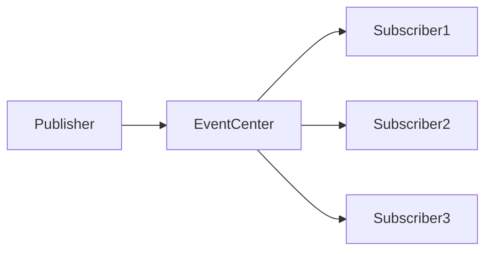

> A beginner-friendly handbook for understanding and applying design patterns in real-world projects

Ever read a bunch of articles about design patterns, felt like you understood them, then forgot how to actually use them a few days later? Or maybe you had a gut feeling that "this code could use some pattern" but couldn't quite figure out which one?

Don't worry—this article is written for you. We're not going for the goal of memorizing all 23 patterns. Instead, we want you to really understand: **when to use which pattern, when NOT to use them, and how to actually apply them in your own projects**.

---

## First Things First: What Are Design Patterns?

Let me use an analogy. Say you're renovating a house—how to arrange the kitchen, where to run the bathroom pipes, where to put the electrical outlets. These are all problems that previous generations have already figured out solutions for. You don't need to reinvent the wheel.

That's exactly what design patterns are. They're **battle-tested solutions that programmers have developed over years of practice**, specifically designed to tackle common problems that keep showing up in software development.

Why bother learning design patterns?

- **Easier to maintain code**: When someone else takes over your code, they won't be completely lost
- **Handle changing requirements**: Adding new features doesn't mean rewriting old code
- **Avoid common pitfalls**: Many mistakes have already been made and solved by others

But here's one thing to keep in mind: **patterns are a tool, not a goal in themselves.** Forcing patterns into situations where they don't fit will only make simple things complicated.

---

## 1. The Foundation: SOLID Principles

Before we dive into specific patterns, there are some fundamental principles you need to know. Think of them as the "inner energy" of martial arts—once you grasp them, understanding design patterns becomes much faster.

### OCP: Open/Closed Principle

**Open for extension, closed for modification.**

Sounds confusing? Let me tell you a story.

You run a burger shop, initially only selling beef burgers. Later, customers ask for chicken burgers and pork burgers. What do you do?

**Wrong approach**: Modify the burger-making machine to handle chicken and pork. The problem? Every time you add a new type, you have to modify the machine. What if you accidentally break the beef burger function?

**Right approach**: The machine has a swappable "meat patty" interface. Just swap in different patties for different burgers, no need to touch the machine itself.

In frontend code, this principle looks like this:

```typescript
// Wrong: Hardcoded logic for button types
function Button({ type, children }) {
  if (type === 'primary') {
    return <button className="bg-blue-500">{children}</button>
  } else if (type === 'danger') {
    return <button className="bg-red-500">{children}</button>
  }
  // Have to change this every time we add a new type...
}

// Right: Extensible interface
function Button({ variant = 'default', children, ...props }) {
  return (
    <button
      className={`btn btn-${variant}`}
      {...props}
    >
      {children}
    </button>
  )
}
```

Vue's `slot` mechanism is a great example: you don't need to modify the component code, just put whatever content you want into the slot.

### SRP: Single Responsibility Principle

**Each thing should do one job and do it well.**

This one's pretty straightforward. Just like you wouldn't make one person do the job of a chef, a waiter, AND a cashier at the same time, your code should also have clear responsibilities.

Here's how this looks in real frontend projects:

```typescript
// Wrong: One component doing three things
function UserProfile({ userId }) {
  const [user, setUser] = useState(null)
  const [posts, setPosts] = useState([])

  useEffect(() => {
    // Fetch user data
    fetchUser(userId).then(setUser)
    // Fetch posts
    fetchPosts(userId).then(setPosts)
    // Send analytics
    trackView('profile', userId)
  }, [userId])

  return (
    <div>
      <UserInfo user={user} />
      <PostList posts={posts} />
    </div>
  )
}

// Right: Split into three focused parts

// 1. Hook for fetching user data
function useUser(userId) {
  const [user, setUser] = useState(null)
  useEffect(() => {
    fetchUser(userId).then(setUser)
  }, [userId])
  return user
}

// 2. Hook for sending analytics
function useTrackView(pageName, id) {
  useEffect(() => {
    trackView(pageName, id)
  }, [pageName, id])
}

// 3. Pure UI component
function UserProfile({ userId }) {
  const user = useUser(userId)
  useTrackView('profile', userId)

  return <UserInfo user={user} />
}
```

After splitting things up, each piece is much easier to test and reuse.

### LSP: Liskov Substitution Principle

**Subclasses can extend what parents do, but they can't change the original behavior.**

Simply put: **a child can be more capable than its parent, but it must still follow the rules.**

Here's a frontend-friendly example:

```typescript
// Parent class: Bird
class Bird {
  fly() {
    return 'Bird flying in the sky'
  }
}

// Correct subclass: Penguin (can't fly, but has its own way)
class Penguin extends Bird {
  swim() {
    return 'Penguin swimming in water'
  }
}

// Wrong subclass: Changes the parent's behavior
class DeadBird extends Bird {
  fly() {
    throw new Error("I'm dead, can't fly") // This violates LSP
  }
}
```

In TypeScript, this principle reminds us: when using inheritance, subclasses must be able to fully replace their parent class. If using the subclass causes errors where the parent wouldn't, something's wrong.

### ISP: Interface Segregation Principle

**Don't force people to use things they don't need.**

Think of it this way: you go to a restaurant, and the menu says "You must order the combo meal, no single items allowed"—that's the opposite of interface segregation.

In frontend code, this commonly shows up as bloated props:

```typescript
// Wrong: Passing props the component doesn't even use
function UserCard({ name, age, email, phone, address, avatar, bio, ...extras }) {
  return <div>{name}</div>
}

// When calling it
<UserCard
  name="John"
  age={25}
  email="john@example.com" // This component doesn't need these
  phone="13800138000"
  address="Beijing"
  avatar="xxx.jpg"
  bio="This is my bio"
/>

// Right: Split interfaces by what's actually needed
function BasicInfo({ name, avatar }) { return <div>{name}</div> }
function ContactInfo({ email, phone }) { return <div>{email}</div> }
function FullProfile({ name, email, phone, ... }) { /* ... */ }
```

### DIP: Dependency Inversion Principle

**Program to interfaces, depend on abstractions rather than concrete implementations.**

This sounds fancy, let me give you an example.

You're assembling a computer. The CPU, RAM, and hard drive all have fixed interfaces (abstractions). It doesn't matter if you buy Intel or AMD—as long as the interface matches, it works.

In frontend projects, this shows up as dependency injection:

```typescript
// Wrong: Directly depending on concrete implementation
class UserService {
  private db = new MySQLDatabase() // Hardcoded

  getUser(id) {
    return this.db.query(...)
  }
}

// Right: Depend on abstract interface
interface Database {
  query(sql: string): any
}

class UserService {
  constructor(private db: Database) {} // Any database works

  getUser(id) {
    return this.db.query(`SELECT * FROM users WHERE id = ${id}`)
  }
}

// Switching databases doesn't require changing UserService
const mysqlDb = new MySQLDatabase()
const userService = new UserService(mysqlDb)

// Or
const postgresDb = new PostgreSQLDatabase()
const userService2 = new UserService(postgresDb)
```

Angular's service injection heavily uses this principle.

### Bonus: Unix Philosophy

You can borrow some ideas from Unix when writing frontend code:

1. **Small is beautiful**: One function, one component, does one thing
2. **Each tool does one thing**: Don't make a single function handle too many responsibilities
3. **Pipes and filters**: The `compose` and `pipe` functions in functional programming embody this idea

```typescript
// Function composition via piping
const pipe =
  (...fns) =>
  (x) =>
    fns.reduce((v, f) => f(v), x)

const processUser = pipe(
  validateInput, // Step 1: Validate input
  normalizeData, // Step 2: Normalize data
  saveToDatabase, // Step 3: Save
  sendNotification, // Step 4: Notify
)

processUser(rawData)
```

---

## 2. Creational Patterns: Where Objects Are Born

Creational patterns solve the problem of **how objects get created**. Why care? Because how you create objects affects your code's flexibility and maintainability.

### 2.1 Factory Pattern

**When to use**: When object creation is complex, or you need to create different types of objects based on conditions.

**Real-world analogy**: Going to McDonald's—you don't make the burger yourself. You tell the cashier what you want, and they make it for you. The cashier is a "factory."

#### Practical Example A: jQuery's `$`

Remember jQuery? The `$('div')` syntax is powered by the factory pattern:

```typescript
class jQuery {
  constructor(selector: string) {
    // Complex DOM query logic
    const dom = Array.from(document.querySelectorAll(selector))
    for (let i = 0; i < dom.length; i++) {
      this[i] = dom[i]
    }
    this.length = dom.length
  }

  addClass(name: string) {
    // Logic for adding classes
  }

  // ... many more methods
}

// Factory function: Users don't need to know about jQuery class
window.$ = function (selector: string) {
  return new jQuery(selector)
}

// Usage
$('div').addClass('active')
```

Users only need to know that `$()` helps them query the DOM—they don't need to know how the underlying `jQuery` class works.

#### Practical Example B: React's `createElement`

Why can React use JSX to write UI? Because of the `createElement` factory function:

```typescript
// This is how React converts JSX to objects internally
function createElement(type, props, ...children) {
  return {
    type, // Tag name like 'button', or a component
    props: {
      ...props,
      children: children.map((c) => (typeof c === 'object' ? c : { type: 'TEXT_ELEMENT', props: { nodeValue: c } })),
    },
  }
}

// <button className="btn">Click me</button>
// Becomes:
createElement('button', { className: 'btn' }, 'Click me')
```

#### When NOT to use

If your object creation is simple, like just `new Something()`, don't overcomplicate things. The factory pattern solves complex problems.

### 2.2 Singleton Pattern

**When to use**: When you only need one instance of something, like global state management, modal containers, or global config.

**Real-world analogy**: A country can only have one president (under normal circumstances), a company only has one CEO.

#### Practical Example: Global Modal Container

Modal dialogs on a page don't need a new container every time:

```typescript
class Modal {
  // Key: Static property, only one exists at class level
  private static instance: Modal
  private container: HTMLElement

  // Key: Private constructor, can't use new Modal()
  private constructor() {
    this.container = document.createElement('div')
    this.container.id = 'global-modal'
    document.body.appendChild(this.container)
  }

  // Key: Get the single instance via getInstance
  public static getInstance(): Modal {
    if (!Modal.instance) {
      Modal.instance = new Modal()
    }
    return Modal.instance
  }

  show(content: string) {
    this.container.innerHTML = content
    this.container.style.display = 'block'
  }

  hide() {
    this.container.style.display = 'none'
  }
}

// Usage: No matter how many times you call it, you get the same instance
const modal1 = Modal.getInstance()
const modal2 = Modal.getInstance()
console.log(modal1 === modal2) // true
```

Vuex/Pinia stores are applications of the singleton pattern, ensuring a single source of truth for global state.

#### When NOT to use

- When you need multiple instances
- When instances need to be independent from each other
- When singletons make testing difficult

### 2.3 Prototype Pattern

**When to use**: When you need to create lots of similar objects, but each only differs in a few properties.

**Real-world analogy**: Blueprints for building houses—the prototype is the same, but you can change colors, materials, etc. as needed.

#### Practical Example: `Object.create` and Property Descriptors

JavaScript's prototype chain is itself an application of the prototype pattern:

```typescript
// Define a base template
const baseUser = {
  getRole() {
    return this.role
  },
  introduce() {
    return `I'm ${this.name}`
  },
}

// Create new objects with baseUser as the prototype
const admin = Object.create(baseUser, {
  role: {
    value: 'ADMIN',
    writable: false, // Cannot be modified
  },
  permissions: {
    value: ['READ', 'WRITE', 'DELETE'],
    writable: false,
  },
  name: { value: 'Admin User' },
})

const normalUser = Object.create(baseUser, {
  role: { value: 'USER' },
  name: { value: 'Normal User' },
})

console.log(admin.getRole()) // ADMIN
console.log(admin.introduce()) // I'm Admin User
console.log(normalUser.getRole()) // USER
```

Vue's `data` option is based on the prototype pattern: all instances share the same prototype methods but have their own data properties.

---

## 3. Structural Patterns: The Art of Organizing Objects

Structural patterns focus on **how things get assembled together**, like building with LEGO blocks—how you combine them determines the final result.

### 3.1 Proxy Pattern

**When to use**: When you need to do something extra before or after accessing an object, like permission checks, caching, or logging.

**Real-world analogy**: You go to visit the CEO at a company. The receptionist stops you first and asks "Do you have an appointment?" The receptionist is acting as a proxy.

#### Practical Example: Vue3 Reactivity

Vue3's reactivity system is built on Proxy:

```typescript
function reactive<T extends object>(target: T): T {
  return new Proxy(target, {
    get(target, key, receiver) {
      const res = Reflect.get(target, key, receiver)

      // Auto-log when accessing properties
      console.log(`Reading ${String(key)}`)

      // If it's a function, bind it back to the original object
      if (typeof res === 'function') {
        return res.bind(target)
      }

      // If it's an object, recursively proxy it (deep reactivity)
      return typeof res === 'object' && res !== null ? reactive(res) : res
    },

    set(target, key, value, receiver) {
      console.log(`Setting ${String(key)} = ${value}`)
      return Reflect.set(target, key, value, receiver)
    },
  })
}

// Usage
const state = reactive({ count: 0 })
state.count++ // Auto-logs: "Reading count", "Setting count = 1"
```

That's why modifying data in Vue3 automatically updates the view—Proxy does the "intercepting" work for you.

#### Practical Example: Image Lazy Loading

```typescript
function lazyLoadImage(img: HTMLImageElement, realSrc: string) {
  return new Proxy(img, {
    get(target, prop) {
      if (prop === 'src' && !target.dataset.loaded) {
        // Return placeholder
        return target.dataset.placeholder || ''
      }
      return target[prop as keyof HTMLImageElement]
    },
    set(target, prop, value) {
      if (prop === 'src' && value === realSrc) {
        target.dataset.loaded = 'true'
      }
      target[prop as keyof HTMLImageElement] = value
    },
  })
}
```

### 3.2 Decorator Pattern

**When to use**: When you need to add new functionality to an object without modifying its original code. AOP (Aspect-Oriented Programming) is a typical application of the decorator pattern.

**Real-world analogy**: A phone case. The phone is still the same phone, but now it has the extra protection from the case.

#### Practical Example: TypeScript Decorators

```typescript
// Timer decorator: Automatically logs function execution time
function timeTrack(target: any, name: string, descriptor: PropertyDescriptor) {
  const original = descriptor.value

  descriptor.value = function (...args: any[]) {
    const start = performance.now()
    const result = original.apply(this, args)
    const duration = performance.now() - start
    console.log(`${name} took ${duration.toFixed(2)}ms`)
    return result
  }

  return descriptor
}

class ApiService {
  @timeTrack
  fetchUserList() {
    // Simulated API request
    return new Promise((resolve) => setTimeout(() => resolve([1, 2, 3]), 500))
  }

  @timeTrack
  fetchDetail(id: number) {
    return new Promise((resolve) => setTimeout(() => resolve({ id }), 200))
  }
}

const api = new ApiService()
api.fetchUserList() // Output: fetchUserList took 502.34ms
```

#### Practical Example: Redux `connect` Principle

Redux's `connect` function is essentially the decorator pattern—it "decorates" components, adding Redux state and dispatch capabilities.

### 3.3 Adapter Pattern

**When to use**: When two incompatible interfaces need to work together.

**Real-world analogy**: A power plug adapter. The outlet has three holes, the charger has two prongs. The adapter lets them work together.

#### Practical Example: Adapting Between Old and New API Formats

```typescript
// Old API response format
interface OldUser {
  name: string
  age: number
  job_detail: string  // snake_case format
}

// New API expected format
interface NewUser {
  fullName: string
  years: number
  jobDetail: string   // camelCase format
}

// Adapter: Converts old format to new format
class UserAdapter {
  static adapt(oldUser: OldUser): NewUser {
    return {
      fullName: oldUser.name,
      years: oldUser.age,
      jobDetail: oldUser.job_detail,
    }
  }
}

// Usage: Adapt before calling new components
async function loadUserProfile(userId: string) {
  const oldData = await oldApi.getUser(userId)  // Old API
  const user = UserAdapter.adapt(oldData)       // Convert format
  return <UserProfile user={user} />            // Feed to new component
}
```

This pattern is super useful when your frontend talks to backend APIs—the backend's data format often doesn't match what your frontend expects.

### 3.4 Facade Pattern

**When to use**: When a feature requires calling many low-level APIs, but users just want a simple interface.

**Real-world analogy**: A TV remote control. You press one "power" button, but behind the scenes the TV is doing a bunch of things (turning on the screen, connecting to the signal, adjusting volume) that you don't need to know about.

#### Practical Example: Vue's `computed`

Vue's `computed` is a classic facade pattern—it hides all the complex logic (dependency tracking, dirty checking, caching) behind a simple ".value" interface.

```typescript
// Your code: Simple to write
const fullName = computed(() => firstName.value + ' ' + lastName.value)

// What Vue does behind the scenes:
// 1. Track dependencies (firstName, lastName)
// 2. Detect data changes
// 3. Recalculate values
// 4. Cache results to avoid recalculation
// 5. Notify dependents to update
```

---

## 4. Behavioral Patterns: How Objects Communicate

Behavioral patterns focus on **how objects talk to each other**, much like how people communicate with each other.

### 4.1 Observer Pattern

**When to use**: When one object's state changes need to notify other objects.

**Real-world analogy**: Following a WeChat public account. When the author posts an article, all subscribers get notified.

```typescript
// Simple implementation
class Subject {
  private observers: Function[] = []

  // Subscribe
  subscribe(observer: Function) {
    this.observers.push(observer)
  }

  // Unsubscribe
  unsubscribe(observer: Function) {
    this.observers = this.observers.filter((o) => o !== observer)
  }

  // Notify: When state changes, notify all subscribers
  notify(data: any) {
    this.observers.forEach((observer) => observer(data))
  }
}

// Usage
const news = new Subject()

news.subscribe((content) => console.log('User A received: ' + content))
news.subscribe((content) => console.log('User B received: ' + content))

news.notify('New product released!')
// Output:
// User A received: New product released!
// User B received: New product released!
```

Vue's reactivity system is essentially the observer pattern: `data` is the Subject, `watcher` is the Observer, and when `data` changes, it automatically notifies the `watcher` to update.

### 4.2 Publish/Subscribe Pattern

An upgraded version of the observer pattern. It adds an "event hub" so publishers and subscribers don't need to know about each other directly.



```typescript
type Handler = (data?: any) => void

class EventEmitter {
  private events: Map<string, Handler[]> = new Map()

  // Subscribe
  on(name: string, fn: Handler) {
    const handlers = this.events.get(name) || []
    handlers.push(fn)
    this.events.set(name, handlers)
  }

  // Publish
  emit(name: string, data?: any) {
    this.events.get(name)?.forEach((fn) => fn(data))
  }

  // Unsubscribe
  off(name: string, fn: Handler) {
    const handlers = this.events.get(name)
    if (handlers) {
      this.events.set(
        name,
        handlers.filter((h) => h !== fn),
      )
    }
  }
}

// Usage
const bus = new EventEmitter()

// Component A subscribes to event
bus.on('user-login', (user) => {
  console.log('Got user login info:', user)
})

// Component B publishes event
setTimeout(() => {
  bus.emit('user-login', { name: 'John', time: Date.now() })
}, 1000)
```

**Observer Pattern vs Pub/Sub Pattern**

| Aspect        | Observer Pattern                     | Pub/Sub Pattern               |
| ------------- | ------------------------------------ | ----------------------------- |
| Communication | Subject directly notifies Observer   | Through middleware/event hub  |
| Coupling      | Publisher and subscriber are coupled | Fully decoupled               |
| Use case      | Vue reactivity                       | Cross-component communication |
| Flexibility   | Lower                                | Higher                        |

### 4.3 Strategy Pattern

**When to use**: When you have multiple algorithms or behaviors that are interchangeable, but you don't want to use a bunch of if-else statements to decide which one to use.

**Real-world analogy**: Getting to Beijing. You can take the subway, bus, taxi, or bike—depending on the situation, you pick the right option.

#### Practical Example: Form Validation Rules

```typescript
// Define validation strategies
const validatorStrategies = {
  // Cannot be empty
  isNonEmpty: (val: string) => {
    return val.trim().length > 0 || 'This field is required'
  },

  // Minimum length
  minLength: (val: string, len: number) => {
    return val.length >= len || `Must be at least ${len} characters`
  },

  // Maximum length
  maxLength: (val: string, len: number) => {
    return val.length <= len || `Must be at most ${len} characters`
  },

  // Email format
  isEmail: (val: string) => {
    const emailRegex = /^[^\s@]+@[^\s@]+\.[^\s@]+$/
    return emailRegex.test(val) || 'Please enter a valid email address'
  },

  // Phone number
  isPhone: (val: string) => {
    const phoneRegex = /^1[3-9]\d{9}$/
    return phoneRegex.test(val) || 'Please enter a valid phone number'
  },
}

// Validator class
class FormValidator {
  private checks: Array<() => string | true> = []

  // Add validation rule
  add(value: string, rule: keyof typeof validatorStrategies, ...args: any[]) {
    const strategy = validatorStrategies[rule]
    this.checks.push(() => strategy(value, ...args))
  }

  // Run validation
  validate() {
    for (const check of this.checks) {
      const result = check()
      if (result !== true) {
        return result // Return first error message
      }
    }
    return true // All passed
  }
}

// Usage
const validator = new FormValidator()

validator.add('test@example.com', 'isEmail')
validator.add('13800138000', 'isPhone')
validator.add('123456', 'minLength', 6)

const result = validator.validate()
console.log(result) // true

// Or catches errors early
const validator2 = new FormValidator()
validator2.add('', 'isNonEmpty')
validator2.add('abc', 'isEmail')

console.log(validator2.validate()) // "This field is required"
```

This approach is much cleaner than using if-else, and adding new rules is as simple as adding one entry to `validatorStrategies`.

### 4.4 Iterator Pattern

**When to use**: When you need to traverse different types of data structures in a uniform way.

**Real-world analogy**: No matter which remote you're using (AC, TV, set-top box), the "channel up" and "channel down" buttons work the same way.

#### Practical Example: `Symbol.iterator`

```typescript
// Make custom objects iterable with for...of
const myIterable = {
  [Symbol.iterator]: function* () {
    yield 1
    yield 2
    yield 3
  },
}

for (const num of myIterable) {
  console.log(num) // 1, 2, 3
}

// Also works with spread operator
console.log([...myIterable]) // [1, 2, 3]
```

JavaScript's built-in data structures (Array, Map, Set, NodeList, etc.) all implement iterators, so you can traverse them all the same way.

```typescript
// Uniform way to traverse
const arr = [1, 2, 3]
const map = new Map([
  ['a', 1],
  ['b', 2],
])
const set = new Set([1, 2, 3])
const nodeList = document.querySelectorAll('div')

// All work with for...of
for (const item of arr) {
}
for (const [key, value] of map) {
}
for (const item of set) {
}
for (const node of nodeList) {
}
```

---

## Summary: How to Use Design Patterns Well

### Quick Summary of the Three Categories

- **Creational**: **Who creates** this object, **how** it's created
- **Structural**: **How** to assemble these objects into larger structures
- **Behavioral**: **How** these objects communicate

### When to Use, When Not to Use

| Good fit                                    | Not a good fit                                   |
| ------------------------------------------- | ------------------------------------------------ |
| Code keeps having the same problems         | Situation is too simple for patterns             |
| Team collaboration, code needs maintenance  | Over-engineering makes simple things complicated |
| Requirements change often, need flexibility | Forcing patterns makes things worse              |
| Need better code reuse                      |                                                  |

### Projects Usually Mix Multiple Patterns

For example, Vue uses:

- **Proxy pattern**: For reactivity
- **Observer pattern**: For dependency updates
- **Factory pattern**: For creating VNodes
- **Singleton pattern**: For global components

---

## FAQ

**Q: Do I need to memorize all 23 patterns?**

No. Just remember the most commonly used ones (Factory, Singleton, Proxy, Observer, Strategy). Look up the others when you need them.

**Q: How do I know which pattern to use?**

Ask yourself these questions:

1. Is it about object creation? → Creational
2. Is it about object composition? → Structural
3. Is it about object communication? → Behavioral

**Q: Won't patterns make code more complicated?**

Yes, they might. That's why there's a principle called YAGNI (You Aren't Gonna Need It)—you probably don't need it yet. Don't introduce patterns until your code actually becomes complex enough to warrant them.

---

_The goal of mastering design patterns isn't to show off technical skills. It's to make code easier to maintain and extend. The ultimate goal of coding is to build good products, not to write "perfect code" that impresses interviewers._
