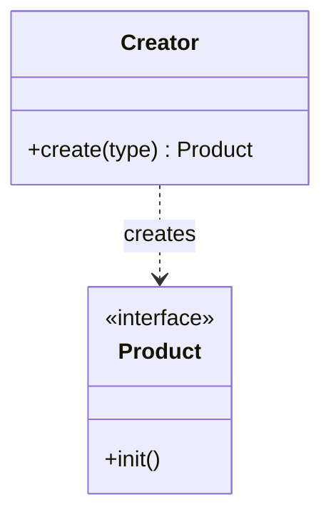
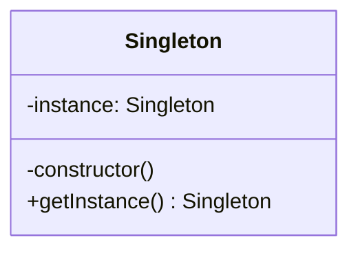
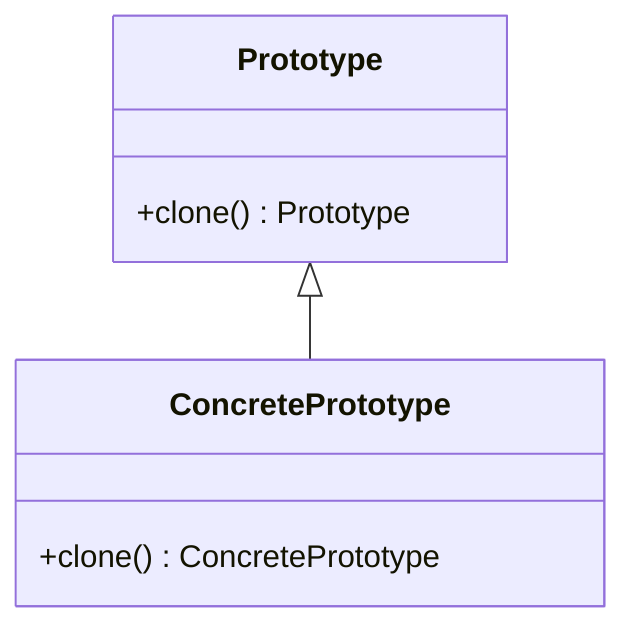
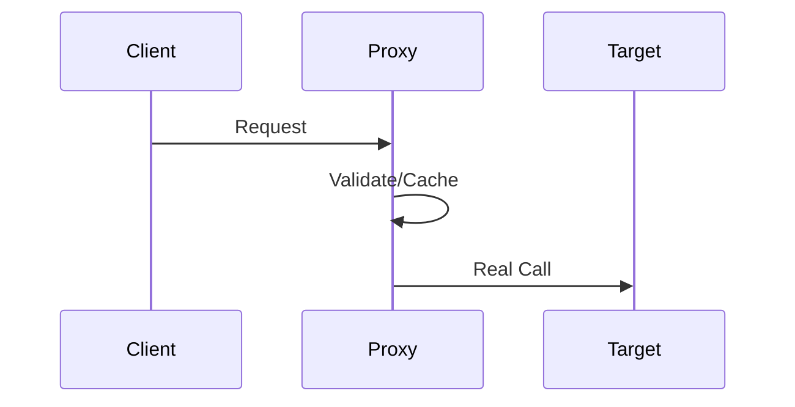
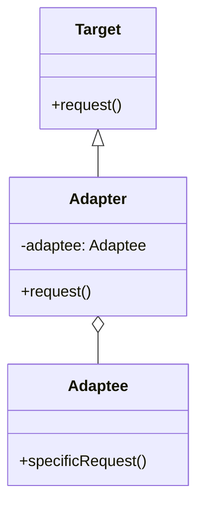
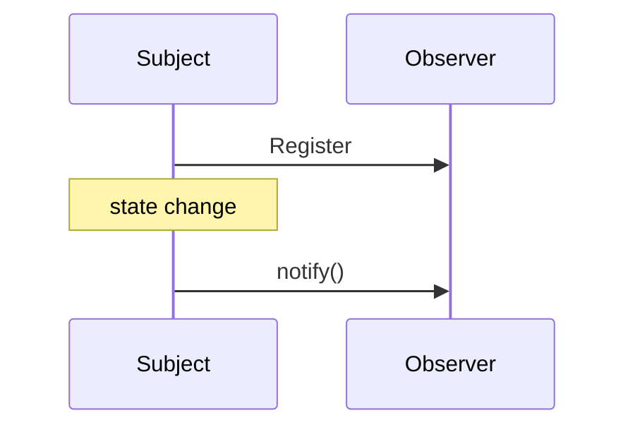
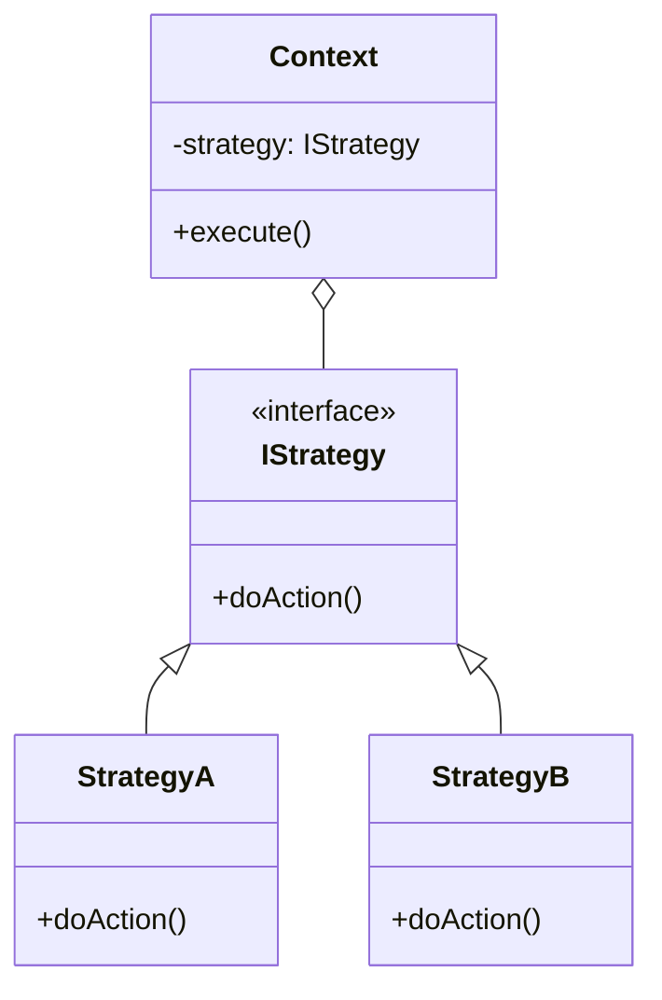

Design Patterns are general solutions to common problems in software design. In the frontend domain, reasonable application of design patterns can significantly improve code maintainability, scalability, and reusability.

## 1. The Foundation of Software Design: SOLID Principles

Before learning specific design patterns, understanding the underlying design principles is crucial. Design patterns are essentially best practices of these principles in different scenarios.

| Principle | Full Name | Core Concept | Frontend Application |
| :--- | :--- | :--- | :--- |
| **OCP** | Open/Closed Principle | **Open for extension, closed for modification.** | When designing components, reserve `slot` or `props` to support extension instead of directly modifying internal logic. |
| **SRP** | Single Responsibility Principle | **A class/function should do only one thing.** | Split complex components into UI components and Container components; extract single business logic into custom Hooks. |
| **LSP** | Liskov Substitution Principle | **Subclasses can extend parent functionality but must not change existing functionality.** | Less common in frontend; mainly used in TS OOP to ensure consistency of types and behaviors during inheritance. |
| **ISP** | Interface Segregation Principle | **Keep interfaces singular; reject bloated interfaces.** | When defining TS `interface`, split by functionality to avoid forcing a component to accept a huge `props` object it doesn't need. |
| **DIP** | Dependency Inversion Principle | **Program to an interface; depend on abstractions, not concrete implementations.** | Dependency Injection (DI), such as Angular service injection, or defining boundaries between data and view layers via interfaces. |

**Linux/Unix Design Philosophy Supplement:**
In the design of frontend toolchains (e.g., Webpack plugins, Babel plugins, Vite plugins), "Small is beautiful" and "Each tool does one thing well" are perfectly embodied. The concept of "Pipe" also deeply influences `compose` and `pipe` functions in functional programming.

---

## 2. Creational Patterns: Where Objects Are Born

### 2.1 Factory Pattern

Where you encounter a large number of `new Class`, you should consider the Factory Pattern.



#### Practice A: jQuery's `$`

```typescript
class jQuery {
	constructor(selector: string) {
		const dom = Array.from(document.querySelectorAll(selector))
		for (let i = 0; i < dom.length; i++) {
			this[i] = dom[i]
		}
		this.length = dom.length
	}
	addClass(name: string) {
		/* ... */
	}
}

// Factory Function: Users don't need to manually use 'new'
window.$ = function (selector: string) {
	return new jQuery(selector)
}
```

#### Practice B: React `createElement`

```typescript
function createElement(type, props, ...children) {
	return {
		type,
		props: {
			...props,
			children: children.map((c) => (typeof c === 'object' ? c : { type: 'TEXT_ELEMENT', props: { nodeValue: c } })),
		},
	}
}
```

### 2.2 Singleton Pattern

Ensures a class has only one instance.



#### Practice: Global Modal Container

```typescript
class Modal {
	private static instance: Modal
	private container: HTMLElement

	private constructor() {
		this.container = document.createElement('div')
		this.container.id = 'global-modal'
		document.body.appendChild(this.container)
	}

	public static getInstance(): Modal {
		if (!Modal.instance) Modal.instance = new Modal()
		return Modal.instance
	}

	show(content: string) {
		this.container.innerHTML = content
	}
}
```

### 2.3 Prototype Pattern

Creates new objects by cloning existing ones, manifested as "Prototypal Inheritance" in JS.



#### Practice: `Object.create` and Property Descriptors

```typescript
const baseUser = {
	getRole() {
		return this.role
	},
}

// Create a new object using baseUser as the prototype
const admin = Object.create(baseUser, {
	role: { value: 'ADMIN' },
	permissions: { value: ['READ', 'WRITE'], writable: false },
})

console.log(admin.getRole()) // ADMIN
```

---

## 3. Structural Patterns: The Art of Object Organization

### 3.1 Proxy Pattern

Controls access to a target object to implement filtering, caching, or logging.



#### Practice: Vue3 Reactivity and `this` binding fix

```typescript
function reactive<T extends object>(target: T): T {
	return new Proxy(target, {
		get(target, key, receiver) {
			const res = Reflect.get(target, key, receiver)
			// Fix: If it's a method of a native object (like Map.get), it needs to be bound back to the original target
			return typeof res === 'function' ? res.bind(target) : res
		},
		set(target, key, value, receiver) {
			console.log(`Setting ${String(key)} to ${value}`)
			return Reflect.set(target, key, value, receiver)
		},
	})
}
```

### 3.2 Decorator Pattern

Dynamically adds extra responsibilities to an object.

#### Practice: Redux `connect` and AOP (Aspect-Oriented Programming)

```typescript
// TS Decorator example: Tracking execution time
function timeTrack(target: any, name: string, descriptor: PropertyDescriptor) {
	const original = descriptor.value
	descriptor.value = function (...args: any[]) {
		const start = performance.now()
		const result = original.apply(this, args)
		console.log(`${name} took ${performance.now() - start}ms`)
		return result
	}
}

class ApiService {
	@timeTrack
	fetchData() {
		/* Simulate request */
	}
}
```

### 3.3 Adapter Pattern

Converts one interface into another that the client expects, solving incompatibility issues.



#### Practice: Adapting Old and New API Interfaces

```typescript
// Old interface format
interface OldUser {
	name: string
	age: number
}
// New interface expected format
interface NewUser {
	fullName: string
	years: number
}

class UserAdapter {
	static adapt(oldUser: OldUser): NewUser {
		return {
			fullName: oldUser.name,
			years: oldUser.age,
		}
	}
}

// Usage: Feeding old data into a new component
const oldData = { name: 'Max', age: 25 }
const adaptedData = UserAdapter.adapt(oldData)
```

### 3.4 Facade Pattern

Provides a unified high-level interface to a complex subsystem.

#### Practice: Encapsulation of Vue `computed`

Vue's `computed` encapsulates complex logic such as dependency collection, dirty checking, and cache management under a simple `.value` interface.

---

## 4. Behavioral Patterns: Object Interaction Logic

### 4.1 Observer Pattern

Subject maintains a list of Observers and notifies them directly when state changes.



### 4.2 Pub-Sub Pattern

A variant of the Observer pattern, decoupled through an "Event Center".


#### Practice: Mitt / EventEmitter Implementation

```typescript
type Handler = (data?: any) => void

class EventEmitter {
	private events: Map<string, Handler[]> = new Map()

	on(name: string, fn: Handler) {
		const handlers = this.events.get(name) || []
		handlers.push(fn)
		this.events.set(name, handlers)
	}

	emit(name: string, data?: any) {
		this.events.get(name)?.forEach((fn) => fn(data))
	}

	off(name: string, fn: Handler) {
		const handlers = this.events.get(name)
		if (handlers) {
			this.events.set(
				name,
				handlers.filter((h) => h !== fn),
			)
		}
	}
}
```

### 4.3 Strategy Pattern

Defines a series of algorithms, encapsulates each one, and makes them interchangeable. Avoids bloated `if-else`.



#### Practice: Form Validation Rules

```typescript
const validatorStrategies = {
	isNonEmpty: (val: string) => val.length > 0 || 'Cannot be empty',
	minLength: (val: string, len: number) => val.length >= len || `Length must be greater than ${len}`,
	isEmail: (val: string) => /@/.test(val) || 'Invalid format',
}

class FormValidator {
	private checks: any[] = []
	add(val: string, rule: keyof typeof validatorStrategies, ...args: any[]) {
		this.checks.push(() => validatorStrategies[rule](val, ...args))
	}
	start() {
		for (const check of this.checks) {
			const msg = check()
			if (msg !== true) return msg
		}
		return true
	}
}

// Usage
const validator = new FormValidator()
validator.add('test', 'minLength', 6)
const result = validator.start() // Returns "Length must be greater than 6"
```

### 4.4 Iterator Pattern

Provides a way to access elements of a collection (Array, Map, Set, NodeList) sequentially.

#### Practice: `Symbol.iterator`

```typescript
const myIterable = {
	[Symbol.iterator]: function* () {
		yield 1
		yield 2
		yield 3
	},
}

for (const val of myIterable) {
	console.log(val) // 1, 2, 3
}
```

---

## Conclusion

- **Creational**: Focus on "who creates" and "how to create".
- **Structural**: Focus on "how to combine objects" to form larger structures.
- **Behavioral**: Focus on "how objects communicate".

Mastering patterns is not for the sake of applying them blindly, but for **decoupling, reuse, and resilience (responding to changes in requirements)**. In actual development, multiple patterns are often mixed, such as Vue using Proxy (Reactivity), Observer (Dependency updates), and Factory (VNode) patterns simultaneously.
