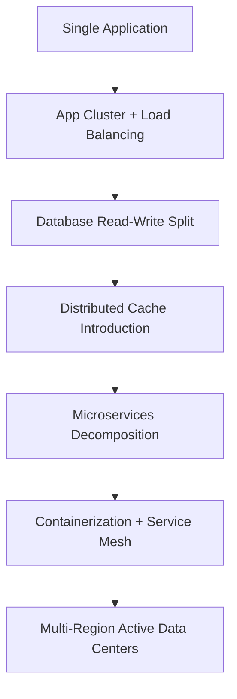
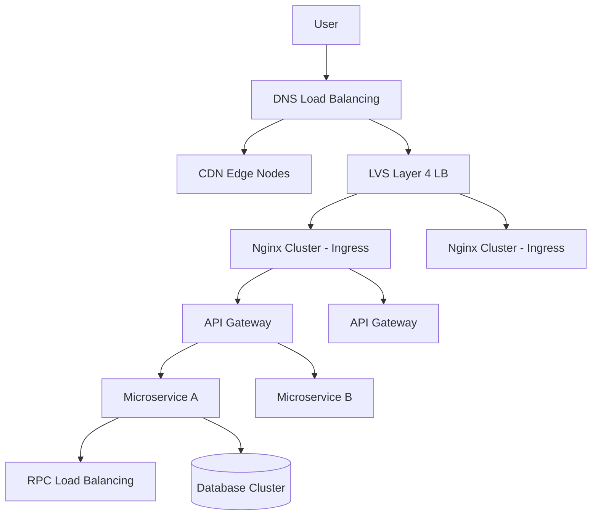
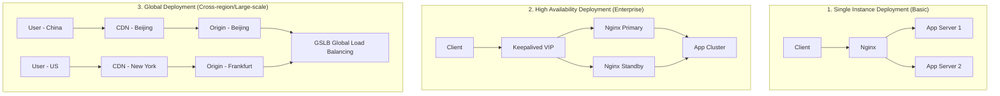
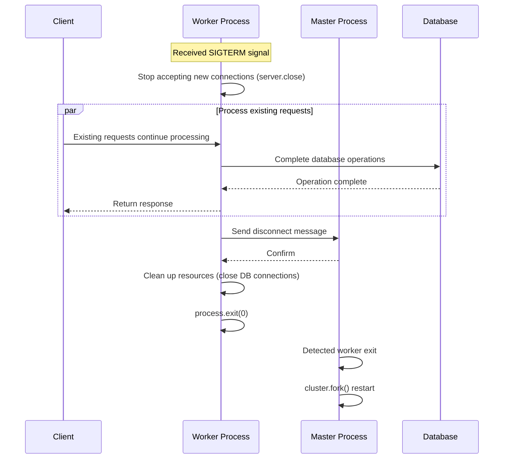
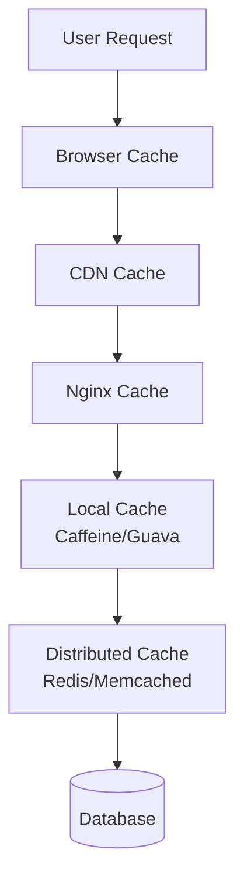
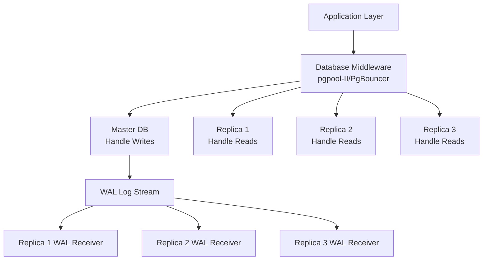
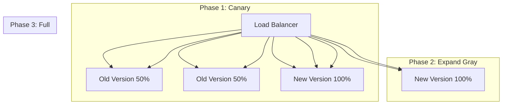
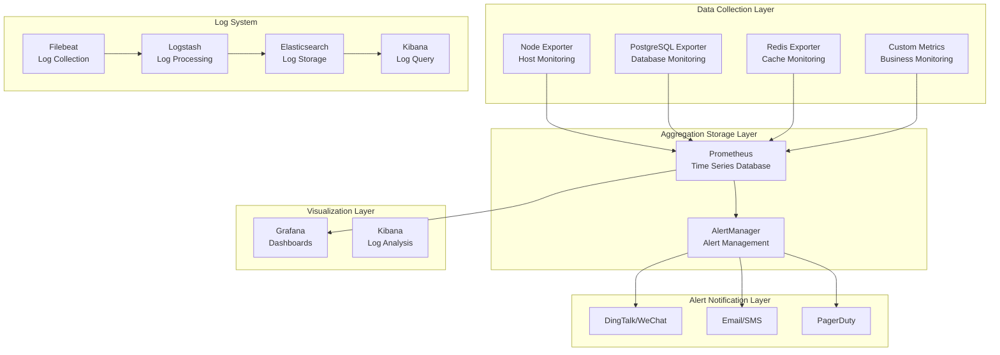

> A comprehensive guide for developers who want to understand system architecture from the ground up

Have you ever wondered: how can a website handle the kind of traffic that hits during Singles Day (China's biggest shopping festival) or Black Friday? While your company's site crashes every time you run a promotion, how do the big players stay online?

Here's the frustrating part: everything works fine normally, but as soon as you run a promotion, the site goes down. Your local tests pass perfectly, but production is a nightmare.

This article explains in plain language: **how exactly is a website designed to handle massive traffic?** The article includes plenty of code examples, configuration files, and architecture diagrams. Whether you're a complete beginner or an experienced developer looking to review the fundamentals, you'll find something useful here.

---

## 1. Core Challenges and Design Goals of High-Concurrency Systems

### 1.1 The Nature of High Concurrency

Let me tell you a story first. You open a small restaurant and hire one chef. The chef can only cook one dish at a time. Now imagine 100 customers show up at once, all waiting in line. Isn't that going to kill the chef?

Websites work the same way. A single server is like one chef—limited capacity. When traffic spikes:

- Response times get slower and slower
- Eventually it crashes completely
- Users see "502 Bad Gateway" or "Service Unavailable"

**High Concurrency refers to scenarios where a system needs to handle a massive number of requests in an extremely short time.**

The core challenge is: **how do you keep the system stable, fast, and error-free with limited resources?**

Take a typical e-commerce flash sale as an example:

- 100,000 users refresh the product page simultaneously
- 50,000 users click "Buy Now"
- 30,000 users submit orders
- 20,000 users complete payment

All of this happens within seconds, putting tremendous pressure on every component of the system. If any single part lags, the entire experience falls apart.

### 1.2 Core Design Goals

The design goals for high-concurrency architecture can be boiled down to three main points:

| Goal                  | Plain English                               | Key Metrics           | What It Means                                    |
| --------------------- | ------------------------------------------- | --------------------- | ------------------------------------------------ |
| **Low Latency**       | Users get angry waiting too long            | TP99 < 200ms          | 99% of requests complete within 200 milliseconds |
| **High Throughput**   | How many users can be served simultaneously | QPS > 100,000         | Can handle 100,000 requests per second           |
| **High Availability** | Can't be down all the time                  | Availability > 99.99% | Total downtime per year under 52 minutes         |

> **What's TP99?**
>
> TP99 stands for Top Percentile 99%, meaning that 99% of request response times fall below this value. For example, TP99=200ms means that out of 100 requests, 99 complete within 200ms, while maybe 1 takes longer.

### 1.3 Architecture Evolution Path

Rome wasn't built in a day, and neither was a large-scale distributed system.

From a single application to handling millions of concurrent users, systems typically evolve through this path:



Let me explain what each stage does:

- **Single Application**: Initially, all code is bundled together, running all functionality on one server
- **App Cluster + Load Balancing**: Can't handle it anymore? Add more machines and use load balancing to spread the load
- **Database Read-Write Split**: The database becomes the bottleneck, so separate reads from writes
- **Distributed Cache Introduction**: Cache hot data to reduce database pressure
- **Microservices Decomposition**: Code gets too complex, so split it into independent services by function
- **Containerization + Service Mesh**: Too many services to manage, need a better management approach
- **Multi-Region Active Data Centers**: One data center isn't enough, need multi-region disaster recovery

Each stage solves different bottleneck problems. This article starts from the most fundamental concept—load balancing.

---

## 2. Load Balancing: The First Line of Defense for Traffic Distribution

### 2.1 Layered Load Balancing Architecture

When a single server's processing capacity reaches its limit, we must distribute requests across multiple machines. The load balancer is the key component that makes this possible.

Think of it this way: if you want to travel from Beijing to Shanghai, you can take a plane, high-speed train, or drive. But no matter which method you choose, you eventually need to pass through transportation hubs to reach your destination. Load balancing is the "traffic hub" of the web world.

In real architecture, load balancing often works together across multiple layers, forming a complete traffic distribution system:



What's the benefit of layering? **Each layer does its own job, specialization wins.**

#### 2.1.1 DNS Layer Load Balancing

DNS load balancing is the simplest and most basic form of traffic distribution. By returning multiple IPs during domain resolution, it achieves basic traffic distribution.

```dns
# DNS configuration example (BIND syntax)
www.example.com.  IN  A  10.0.1.1
www.example.com.  IN  A  10.0.1.2
www.example.com.  IN  A  10.0.1.3
```

This configuration means: when a user accesses `www.example.com`, the DNS server will return one of these three IPs in rotation.

But DNS load balancing has a problem: **it can't sense the health status of servers.** If a server goes down, DNS will still return its IP, and user access will fail.

Usually, DNS load balancing is combined with CDN, which caches static resources (images, CSS, JS, etc.) at nodes closest to users, significantly reducing origin server pressure. The core value of CDN:

- **Reduce network latency**: From 300ms to under 50ms (physical distance is closer)
- **Reduce origin bandwidth pressure**: CDN nodes serve static content directly
- **Resist DDoS attacks**: Traffic goes to CDN first, blocked at the edge

#### 2.1.2 Network Layer (LVS/Hardware F5)

DNS load balancing works at the application layer (Layer 7), while LVS works at the transport layer (Layer 4). This means LVS is faster and simpler, suitable as the first checkpoint for incoming traffic.

LVS has three working modes:

| Mode                     | Principle                                    | Use Case     |
| ------------------------ | -------------------------------------------- | ------------ |
| NAT Mode                 | Modifies source and destination IP addresses | Cross-subnet |
| DR Mode (Direct Routing) | Modifies MAC addresses, highest performance  | Same subnet  |
| TUN Mode (Tunnel)        | IP tunnel encapsulation                      | Cross-subnet |

```bash
# LVS NAT mode configuration example
# -A: Add new virtual service
# -t: TCP protocol, listen on port 80
# -s rr: Round robin algorithm
ipvsadm -A -t 192.168.1.100:80 -s rr

# -a: Add real server
# -r: Real server IP and port
# -m: NAT mode
ipvsadm -a -t 192.168.1.100:80 -r 10.0.0.1:80 -m
ipvsadm -a -t 192.168.1.100:80 -r 10.0.0.2:80 -m
ipvsadm -a -t 192.168.1.100:80 -r 10.0.0.3:80 -m
```

> **Tip**: Hardware F5 is a more premium choice with stronger performance, but it's also painfully expensive. For small to medium companies, LVS is sufficient.

#### 2.1.3 Application Layer (Nginx/OpenResty)

Nginx is a Layer 7 load balancer based on the HTTP protocol, capable of implementing finer-grained routing, rate limiting, caching, SSL termination, and more.

If LVS is the toll booth on a highway, Nginx is the traffic dispatch system in a city—it can understand where the "request" passenger wants to go, then precisely deliver it to the corresponding service.

```nginx
# Nginx load balancing complete configuration
upstream backend {
    # Load balancing algorithm: least_conn (least connections)
    # Whichever server currently has fewer requests gets the new one
    least_conn;

    # Server list with weights and health check parameters
    # weight=3 means this server gets 3x the traffic of weight=1
    # max_fails=3 means 3 consecutive failures marks server unhealthy
    # fail_timeout=30s means retry after 30 seconds
    server 10.0.0.1:8080 weight=3 max_fails=3 fail_timeout=30s;
    server 10.0.0.2:8080 weight=2 max_fails=3 fail_timeout=30s;
    server 10.0.0.3:8080 backup;  # Backup node, inactive normally, only activates when primary fails

    keepalive 32;  # Keep connections alive, avoid frequent TCP handshakes
}

server {
    listen 80;
    server_name api.example.com;

    # Access log format
    # Records client IP, request time, request content, response status, etc.
    log_format main '$remote_addr - $remote_user [$time_local] "$request" '
                    '$status $body_bytes_sent "$http_referer" '
                    '"$http_user_agent" "$http_x_forwarded_for" '
                    '$upstream_addr $upstream_response_time';

    access_log /var/log/nginx/api_access.log main;

    location / {
        proxy_pass http://backend;

        # Pass the real client IP
        # Without this, the backend service sees only Nginx's IP
        proxy_set_header Host $host;
        proxy_set_header X-Real-IP $remote_addr;
        proxy_set_header X-Forwarded-For $proxy_add_x_forwarded_for;
        proxy_set_header X-Forwarded-Proto $scheme;

        # Timeout configuration
        # Connection timeout: wait max 5 seconds to establish connection
        proxy_connect_timeout 5s;
        # Send timeout: wait max 10 seconds to send request to backend
        proxy_send_timeout 10s;
        # Read timeout: wait max 10 seconds to read response from backend
        proxy_read_timeout 10s;

        # Retry on failures
        # If backend returns these errors, automatically try another server
        # error: Connection failed
        # timeout: Response timeout
        # invalid_header: Backend returned invalid response header
        # http_500/http_502/http_503: Server-side errors
        proxy_next_upstream error timeout invalid_header http_500 http_502 http_503;
        proxy_next_upstream_tries 3;  # Max 3 retries
        proxy_next_upstream_timeout 10s;  # Total retry timeout 10 seconds
    }

    # Health check endpoint
    # This path is dedicated to health checks, no logging
    location /health {
        access_log off;
        return 200 "healthy\n";
        add_header Content-Type text/plain;
    }
}
```

#### 2.1.4 API Gateway Layer

In microservices architecture, the API gateway takes on more complex responsibilities:

- **Authentication**: JWT verification, OAuth2 integration—"Who are you?"
- **Traffic Control**: Token bucket rate limiting, concurrency control—"How many times can you access per second?"
- **Service Discovery**: Integration with Consul/Etcd/Nacos—"Where is the service you're looking for?"
- **Protocol Translation**: HTTP to gRPC—"You use this format, I'll convert it to that format"
- **Request/Response Transformation**: Field mapping, data aggregation—"You only need this data, I'll organize it for you"

Simply put, the API gateway is the "gatekeeper" of microservices—all requests must pass through it first.

```javascript
// Node.js API Gateway rate limiting configuration example (using express-rate-limit)
// This example shows how to implement Redis-based rate limiting
import rateLimit from 'express-rate-limit'
import RedisStore from 'rate-limit-redis'
import { createClient } from 'redis'

const redisClient = createClient({ url: 'redis://localhost:6379' })

// Create a rate limiter
const limiter = rateLimit({
	// Use Redis to store rate limiting data
	store: new RedisStore({
		sendCommand: (...args) => redisClient.sendCommand(args),
	}),
	windowMs: 1 * 60 * 1000, // Time window: 1 minute
	max: 1000, // Limit each IP to max 1000 requests per minute
	standardHeaders: true, // Return standard rate limit headers
	legacyHeaders: false, // Disable legacy rate limit headers
	handler: (req, res) => {
		// What to return when request is rate limited
		res.status(429).json({ error: 'Too many requests, please try again later' })
	},
})

// Apply to order service route
// All requests starting with /api/order must pass through the limiter
app.use('/api/order', limiter, (req, res) => {
	// Forward request to order microservice
})
```

### 2.2 Load Balancing Algorithm Deep Dive

Load balancing algorithms determine "which server a request should go to." Based on whether they consider backend real-time status, they are divided into static algorithms (don't consider) and dynamic algorithms (consider).

#### 2.2.1 Static Algorithms

**Round Robin**: The simplest and fairest algorithm, one by one.

```javascript
// Node.js Round Robin Load Balancer Implementation
class LoadBalancer {
	constructor(servers) {
		this.servers = servers
		this.currentIndex = 0
	}

	getNextServer() {
		const server = this.servers[this.currentIndex]
		// Increment index, wrap to 0 when exceeding array length
		this.currentIndex = (this.currentIndex + 1) % this.servers.length
		return server
	}
}

// Usage example
const servers = ['Server1:8080', 'Server2:8080', 'Server3:8080']
const lb = new LoadBalancer(servers)

// Simulate 10 requests
for (let i = 0; i < 10; i++) {
	const server = lb.getNextServer()
	console.log(`Request ${i + 1} forwarded to ${server}`)
}
```

Output:

```
Request 1 forwarded to Server1:8080
Request 2 forwarded to Server2:8080
Request 3 forwarded to Server3:8080
Request 4 forwarded to Server1:8080
Request 5 forwarded to Server2:8080
Request 6 forwarded to Server3:8080
Request 7 forwarded to Server1:8080
Request 8 forwarded to Server2:8080
Request 9 forwarded to Server3:8080
Request 10 forwarded to Server1:8080
```

**Weighted Round Robin**: Those who can do more, should do more. More capable servers handle more load.

For example, with 3 servers:

- Server A: 8-core CPU, powerful
- Server B: 4-core CPU, medium
- Server C: 2-core CPU, weaker

If using regular round robin, all 3 servers get equal requests, but the weaker server gets overwhelmed.

Weighted round robin can be configured like this:

```javascript
// Node.js Weighted Round Robin Algorithm (Smooth Weighted)
// "Smooth" means requests are distributed more evenly, not all at once to one server
class WeightedRoundRobin {
	constructor(servers) {
		// servers: [{ name: 'S1', weight: 5 }, { name: 'S2', weight: 1 }]
		this.servers = servers
		// Each node's current "weight", initially 0
		this.currentWeights = servers.map(() => 0)
		// Total weight of all nodes
		this.totalWeight = servers.reduce((sum, s) => sum + s.weight, 0)
	}

	getNextServer() {
		let maxWeight = -1
		let index = -1

		// Step 1: Add each node's current weight to its original weight
		for (let i = 0; i < this.servers.length; i++) {
			this.currentWeights[i] += this.servers[i].weight

			// At the same time, find the node with the highest current weight
			if (this.currentWeights[i] > maxWeight) {
				maxWeight = this.currentWeights[i]
				index = i
			}
		}

		// Step 2: Subtract total weight from the selected node
		if (index !== -1) {
			this.currentWeights[index] -= this.totalWeight
			return this.servers[index]
		}

		return null
	}
}
```

**IP Hash**: Make requests from the same IP always go to the same server.

Why is this needed? Because some scenarios require "session persistence."

For example, when a user logs in, the server stores their session information in memory. If the user's next request is load-balanced to a different server, that server won't have the user's session, and the user will need to log in again.

IP hash determines routing by calculating a hash of the IP:

```javascript
import crypto from 'node:crypto'

function ipHash(ipAddress, serverList) {
	/**
	 * Select server based on client IP hash
	 * Core idea: Same IP, same calculation result every time
	 */
	// Calculate MD5 hash of the IP
	const hash = crypto.createHash('md5').update(ipAddress).digest('hex')
	// Take part of the hash value, convert to integer, then modulo by number of servers
	// Modulo result is always between 0 and servers.length-1
	const hashInt = parseInt(hash.substring(0, 8), 16)
	const serverIndex = hashInt % serverList.length

	return serverList[serverIndex]
}

// Test
const servers = ['Server1', 'Server2', 'Server3', 'Server4']
const ips = ['192.168.1.100', '192.168.1.101', '192.168.1.100']

ips.forEach((ip) => {
	const selected = ipHash(ip, servers)
	console.log(`IP ${ip} -> ${selected}`)
})
```

Output:

```
IP 192.168.1.100 -> Server3
IP 192.168.1.101 -> Server1
IP 192.168.1.100 -> Server3  # Same IP always hits the same server
```

Notice the last line: `192.168.1.100` hits `Server3` both times. That's the core feature of IP hash.

**Consistent Hashing**: This is an advanced technique, mainly used for distributed caching.

Here's the problem: Suppose you have 3 Redis servers caching user data. When one server goes down or you add capacity, with regular hashing, most caches become invalid (because the divisor in the modulo changed).

Consistent hashing solves this: when a server goes down or is added, only a small amount of data is affected.

```javascript
import crypto from 'node:crypto'

class ConsistentHash {
	constructor(nodes = [], virtualNodes = 150) {
		// Number of virtual nodes: how many positions each physical node occupies on the hash ring
		// More virtual nodes means more even data distribution
		this.virtualNodes = virtualNodes
		this.ring = new Map() // Hash ring: hash value -> node name
		this.sortedKeys = [] // Sorted hash value list for binary search

		// Initialize: add each node to the ring
		nodes.forEach((node) => this.addNode(node))
	}

	// Calculate hash value
	_hash(key) {
		const hash = crypto.createHash('md5').update(key).digest('hex')
		return parseInt(hash.substring(0, 8), 16)
	}

	// Add node to ring
	addNode(node) {
		// Each physical node corresponds to multiple virtual nodes
		for (let i = 0; i < this.virtualNodes; i++) {
			const virtualKey = `${node}:${i}`
			const hashValue = this._hash(virtualKey)
			this.ring.set(hashValue, node)
			this.sortedKeys.push(hashValue)
		}
		// Sort for binary search
		this.sortedKeys.sort((a, b) => a - b)
	}

	// Remove node from ring
	removeNode(node) {
		for (let i = 0; i < this.virtualNodes; i++) {
			const virtualKey = `${node}:${i}`
			const hashValue = this._hash(virtualKey)
			this.ring.delete(hashValue)
			this.sortedKeys = this.sortedKeys.filter((k) => k !== hashValue)
		}
	}

	// Find which node data should be stored on
	getNode(key) {
		if (this.ring.size === 0) return null

		// Calculate hash of the data
		const hashValue = this._hash(key)

		// Binary search: find first position >= hashValue
		// Because hash ring is closed loop, if not found, go back to start
		let low = 0,
			high = this.sortedKeys.length - 1

		while (low <= high) {
			const mid = Math.floor((low + high) / 2)
			if (this.sortedKeys[mid] >= hashValue) {
				high = mid - 1
			} else {
				low = mid + 1
			}
		}

		// If out of range, return first node (closed loop)
		if (low === this.sortedKeys.length) low = 0

		return this.ring.get(this.sortedKeys[low])
	}
}

// Usage example
const nodes = ['Redis1', 'Redis2', 'Redis3']
const ch = new ConsistentHash(nodes, 100) // 100 virtual nodes per node

const keys = ['user:1001', 'user:1002', 'user:1003', 'product:2001', 'order:3001']
keys.forEach((key) => {
	const node = ch.getNode(key)
	console.log(`Key: ${key} -> Node: ${node}`)
})
```

#### 2.2.2 Dynamic Algorithms

Static algorithms only consider the algorithm itself, not the actual status of backend servers. Dynamic algorithms consider the real-time load of backend servers.

**Least Connections**: Assign new requests to the server with the fewest current connections.

This algorithm is suitable for **long-connection scenarios**, such as:

- Instant messaging (chat applications)
- WebSocket push
- Long-polling APIs

Why? Because in short-connection scenarios, connections close quickly, which doesn't accurately reflect server load.

```javascript
// Node.js Least Connections Load Balancer Implementation
class LeastConnectionsLB {
	constructor(servers) {
		// Initialize connection count for each server
		this.servers = servers.map((addr) => ({
			address: addr,
			connections: 0,
		}))
	}

	// Get next server
	getNextServer() {
		let selected = null
		let minConns = Infinity

		// Find server with fewest connections
		for (const server of this.servers) {
			if (server.connections < minConns) {
				minConns = server.connections
				selected = server
			}
		}

		// Increment selected server's connection count
		if (selected) {
			selected.connections++
		}
		return selected
	}

	// Release connection (call after request processing)
	release(server) {
		if (server && server.connections > 0) {
			server.connections--
		}
	}
}
```

### 2.3 Health Check Mechanisms

Load balancers need to know which backend instances are healthy before distributing traffic there. If you send a request to a crashed server, users will see error pages.

Health checks typically come in two types: **active checks** and **passive checks**.

#### 2.3.1 Active Health Checks

The load balancer actively sends probe requests to backend servers and determines if they're healthy based on responses.

```nginx
# Nginx active health check configuration (requires nginx_upstream_check_module)
upstream backend {
    server 10.0.0.1:8080;
    server 10.0.0.2:8080;
    server 10.0.0.3:8080;

    # Health check configuration
    # interval=3000: Check every 3 seconds
    # rise=2: Server considered healthy after 2 consecutive successes
    # fall=5: Server considered unhealthy after 5 consecutive failures
    # timeout=1000: Probe timeout 1 second
    # type=http: Use HTTP protocol for check
    check interval=3000 rise=2 fall=5 timeout=1000 type=http;

    # HTTP request to send
    check_http_send "HEAD /health HTTP/1.0\r\n\r\n";

    # Which HTTP status codes are considered healthy
    check_http_expect_alive http_2xx http_3xx;
}
```

#### 2.3.2 Passive Health Checks

Passive health checks determine health based on actual backend server responses. If requests fail a certain number of times, the server is removed from the pool.

```nginx
# Nginx passive health check
upstream backend {
    # max_fails=3: 3 consecutive failures
    # fail_timeout=30s: Remove after 3 failures within 30 seconds
    # After 30 seconds, will retry; if successful, restore
    server 10.0.0.1:8080 max_fails=3 fail_timeout=30s;
    server 10.0.0.2:8080 max_fails=3 fail_timeout=30s;
    server 10.0.0.3:8080 max_fails=3 fail_timeout=30s;
}
```

Differences between the two approaches:

| Approach      | Advantages                | Disadvantages                | Use Case                       |
| ------------- | ------------------------- | ---------------------------- | ------------------------------ |
| Active Check  | Can detect problems early | Requires extra probe traffic | High availability requirements |
| Passive Check | Simple to implement       | Delayed problem detection    | General scenarios              |

#### 2.3.3 Application-Level Health Check Endpoints

Sometimes we don't just care if the server is alive, but also if dependent databases, caches, etc. are functioning. This requires application-level health checks.

```javascript
// healthcheck.js
// This is an Express application health check endpoint implementation
import express from 'express'
import mongoose from 'mongoose'
import { createClient } from 'redis'
import checkDiskSpace from 'check-disk-space'

const app = express()

// Health check endpoint
// Access GET /health to get detailed application health status
app.get('/health', async (req, res) => {
	const healthcheck = {
		uptime: process.uptime(), // Process uptime
		status: 'OK',
		timestamp: Date.now(),
		checks: {}, // Results of various checks
	}

	try {
		// Check database connection
		// mongoose.connection.readyState:
		// 0 = disconnected, 1 = connected, 2 = connecting, 3 = disconnecting
		if (mongoose.connection.readyState === 1) {
			healthcheck.checks.database = 'up'
		} else {
			healthcheck.checks.database = 'down'
		}

		// Check Redis connection
		const redisClient = createClient()
		await redisClient.connect()
		await redisClient.ping()
		healthcheck.checks.redis = 'up'
		await redisClient.quit()

		// Check disk space
		const diskSpace = await checkDiskSpace('/')
		const freeSpaceGB = diskSpace.free / 1024 / 1024 / 1024

		if (freeSpaceGB > 10) {
			healthcheck.checks.disk = 'up'
		} else {
			healthcheck.checks.disk = 'warning'
		}
	} catch (error) {
		healthcheck.status = 'error'
		healthcheck.error = error.message
		return res.status(503).json(healthcheck) // 503 means service unavailable
	}

	// If any critical dependency is down, return 503
	if (healthcheck.checks.database === 'down' || healthcheck.checks.redis === 'down') {
		return res.status(503).json(healthcheck)
	}

	res.json(healthcheck)
})

app.listen(3000, () => {
	console.log('Health check server running on port 3000')
})
```

### 2.4 Load Balancer Deployment Modes

The load balancer itself can become a single point of failure. So load balancers also need high-availability deployment.



Explanation:

- **Single Instance**: Simplest, suitable for low traffic. If Nginx crashes, entire service is down.
- **High Availability**: Use Keepalived for Nginx primary-standby failover. If primary Nginx crashes, VIP moves to standby Nginx, users don't notice.
- **Global Deployment**: Users access nearest CDN, CDN retrieves from nearest origin, GSLB (Global Server Load Balancing) coordinates overall.

---

## 3. High Availability Practices for Node.js Applications

Node.js's single-threaded model, while avoiding the complexity of multi-threaded programming (no dealing with locks, deadlocks, etc.), has two obvious problems:

1. **Can't fully utilize multi-core CPUs**: An 8-core server, but Node.js only uses 1 core, the other 7 are idle
2. **Process crash means service interruption**: Once the process panics, the entire service becomes unavailable

In production environments, we need special strategies to solve these problems.

### 3.1 Implementing Multi-Process with Cluster Module

Node.js's built-in `cluster` module allows us to create multiple worker processes, each independently handling requests, fully utilizing multi-core CPUs.

```javascript
// cluster-app.js
import cluster from 'cluster'
import http from 'http'
import { cpus } from 'os'
import process from 'process'

// Get number of CPU cores
const numCPUs = cpus().length

// Determine if this is master or worker process
if (cluster.isPrimary) {
	// ============ Master Process (Manager) ============

	console.log(`Master process ${process.pid} is running`)
	console.log(`Number of CPU cores: ${numCPUs}`)

	// Track worker count
	let workerCount = 0

	// Fork worker processes
	for (let i = 0; i < numCPUs; i++) {
		const worker = cluster.fork() // Fork a worker process
		workerCount++

		// Listen for messages from worker
		worker.on('message', (msg) => {
			console.log(`Master received message: ${msg} from ${worker.process.pid}`)
		})
	}

	console.log(`Started ${workerCount} worker processes`)

	// Listen for worker exit events
	cluster.on('exit', (worker, code, signal) => {
		console.log(`Worker ${worker.process.pid} exited, exit code: ${code}, signal: ${signal}`)

		// Auto-restart (essential in production!)
		console.log('Restarting worker...')
		cluster.fork()
	})

	// Periodically send status queries to workers (optional)
	setInterval(() => {
		const workers = Object.values(cluster.workers)
		workers.forEach((worker) => {
			worker.send({ cmd: 'status' })
		})
	}, 10000)
} else {
	// ============ Worker Process ============

	// Worker starts HTTP server
	const server = http
		.createServer((req, res) => {
			// Simulate request processing
			const start = Date.now()

			// Return different content based on path
			if (req.url === '/') {
				res.writeHead(200, { 'Content-Type': 'text/html' })
				res.end(`
                <html>
                <head><title>Cluster Demo</title></head>
                <body>
                    <h1>Hello from Worker ${process.pid}</h1>
                    <p>Request processing time: ${Date.now() - start}ms</p>
                </body>
                </html>
            `)
			} else if (req.url === '/health') {
				// Health check
				res.writeHead(200, { 'Content-Type': 'application/json' })
				res.end(
					JSON.stringify({
						pid: process.pid,
						memory: process.memoryUsage(),
						uptime: process.uptime(),
						timestamp: Date.now(),
					}),
				)
			} else if (req.url === '/slow') {
				// Simulate slow request (takes 5 seconds)
				setTimeout(() => {
					res.writeHead(200)
					res.end(`Slow response from ${process.pid}`)
				}, 5000)
			} else {
				res.writeHead(404)
				res.end('Not Found')
			}
		})
		.listen(3000)

	console.log(`Worker ${process.pid} started, listening on port 3000`)

	// Handle messages from master process
	process.on('message', (msg) => {
		if (msg.cmd === 'status') {
			console.log(`Worker ${process.pid} status: alive`)
			process.send({ cmd: 'status', pid: process.pid, memory: process.memoryUsage() })
		} else if (msg.cmd === 'shutdown') {
			console.log(`Worker ${process.pid} received shutdown signal, graceful exit`)
			gracefulShutdown()
		}
	})

	// Graceful shutdown function
	function gracefulShutdown() {
		server.close(() => {
			console.log(`Worker ${process.pid} closed all connections`)
			process.exit(0)
		})

		// Set timeout to force exit (prevent requests from hanging indefinitely)
		setTimeout(() => {
			console.error(`Worker ${process.pid} forced exit`)
			process.exit(1)
		}, 10000)
	}

	// Handle uncaught exceptions (prevent process crash)
	process.on('uncaughtException', (err) => {
		console.error(`Worker ${process.pid} uncaught exception:`, err)
		gracefulShutdown()
	})
}
```

### 3.2 Graceful Shutdown Mechanism Explained

Why graceful shutdown?

Abruptly terminating a process causes:

1. **Requests in progress are interrupted**: Users get `ECONNRESET` error, confused
2. **Data state corruption**: If database operations are in progress, could lead to data inconsistency

Graceful shutdown flow:



Complete graceful shutdown implementation:

```javascript
// graceful-shutdown.js
// A general-purpose graceful shutdown manager
class GracefulShutdownManager {
	constructor(server, options = {}) {
		this.server = server
		this.options = {
			timeout: options.timeout || 10000, // Timeout, default 10 seconds
			connections: new Set(), // Track all connections
			...options,
		}

		this.isShuttingDown = false
		this.pendingRequests = 0 // Number of pending requests

		// Start tracking connections
		this.trackConnections()
	}

	// Track TCP connections
	trackConnections() {
		this.server.on('connection', (socket) => {
			// If shutting down, destroy new connections
			if (this.isShuttingDown) {
				socket.destroy()
				return
			}

			this.options.connections.add(socket)

			socket.on('close', () => {
				this.options.connections.delete(socket)
			})
		})

		// Track HTTP requests
		this.server.on('request', (req, res) => {
			// When shutting down, tell client to close connection
			if (this.isShuttingDown) {
				res.setHeader('Connection', 'close')
			}

			this.pendingRequests++

			res.on('finish', () => {
				this.pendingRequests--
				this.checkIfDone()
			})
		})
	}

	// Execute shutdown
	shutdown(callback) {
		if (this.isShuttingDown) return

		this.isShuttingDown = true
		console.log('Starting graceful shutdown...')

		// Stop accepting new connections
		this.server.close(() => {
			console.log('Server closed, no longer accepting new connections')
		})

		// Set timeout for forced exit
		const forceShutdown = setTimeout(() => {
			console.error(`Graceful shutdown timed out (${this.options.timeout}ms), forcing exit`)
			this.destroyConnections()
			process.exit(1)
		}, this.options.timeout)

		// Periodically check if all requests are done
		const checkInterval = setInterval(() => {
			if (this.pendingRequests === 0 && this.options.connections.size === 0) {
				// All requests completed, safe to exit
				clearInterval(checkInterval)
				clearTimeout(forceShutdown)
				console.log('All requests processed, exiting process')
				process.exit(0)
			} else {
				console.log(`Waiting - Requests: ${this.pendingRequests}, Connections: ${this.options.connections.size}`)
			}
		}, 1000)
	}

	// Force destroy all connections
	destroyConnections() {
		this.options.connections.forEach((socket) => {
			if (!socket.destroyed) {
				socket.destroy()
			}
		})
		this.options.connections.clear()
	}

	// Check if can exit
	checkIfDone() {
		if (this.isShuttingDown && this.pendingRequests === 0 && this.options.connections.size === 0) {
			console.log('All requests processed, exiting process')
			process.exit(0)
		}
	}
}

// Usage example
import http from 'node:http'
const server = http.createServer((req, res) => {
	// Simulate request taking 2 seconds to process
	setTimeout(() => {
		res.writeHead(200)
		res.end('OK')
	}, 2000)
})

const shutdownManager = new GracefulShutdownManager(server)

// Listen for exit signals
// SIGTERM: Sent when Kubernetes/container stops
// SIGINT: Sent on Ctrl+C
// SIGQUIT: Process exit request
process.on('SIGTERM', () => shutdownManager.shutdown())
process.on('SIGINT', () => shutdownManager.shutdown())
process.on('SIGQUIT', () => shutdownManager.shutdown())

// Handle uncaught exceptions
process.on('uncaughtException', (err) => {
	console.error('Uncaught exception:', err)
	shutdownManager.shutdown()
})

server.listen(3000, () => {
	console.log('Server started, PID:', process.pid)
})
```

### 3.3 PM2 Process Manager

Implementing cluster, graceful shutdown, auto-restart manually is not only tedious but error-prone. PM2 is a mature Node.js process management tool that packages these features into simple commands, ready to use out of the box.

#### 3.3.1 PM2 Core Capabilities

| Feature              | Command                    | Description                                    |
| -------------------- | -------------------------- | ---------------------------------------------- |
| Cluster Mode         | `pm2 start app.js -i max`  | Automatically utilize all CPU cores            |
| Zero-downtime Reload | `pm2 reload all`           | Restart workers one by one, users don't notice |
| Auto Restart         | `pm2 start app.js --watch` | Auto restart on file changes (for development) |
| Memory Monitoring    | `pm2 monit`                | Real-time CPU/memory monitoring                |
| Log Management       | `pm2 logs`                 | Centralized log management                     |
| Auto-start on Boot   | `pm2 startup`              | Generate system startup scripts                |

#### 3.3.2 PM2 Configuration File

Configuration files allow finer control over PM2 behavior:

```javascript
// ecosystem.config.js
// Whether to use CommonJS or ESM depends on your project configuration
export default {
	apps: [
		{
			name: 'my-app', // Application name
			script: './app.js',
			instances: 'max', // Number of instances to start, 'max' means CPU cores
			exec_mode: 'cluster', // cluster mode vs fork mode

			// Can enable watch in development, disable in production
			watch: false,

			// ============ Auto-restart configuration ============
			autorestart: true, // Auto restart after crash
			restart_delay: 5000, // Wait 5 seconds before restart
			max_restarts: 10, // Max 10 restarts
			min_uptime: '10s', // Running for over 10 seconds counts as "normal start"

			// ============ Memory limit ============
			// Auto restart if memory exceeds 500M, prevent memory leaks
			max_memory_restart: '500M',

			// ============ Graceful shutdown configuration ============
			kill_timeout: 10000, // Wait 10 seconds after SIGTERM, then force SIGKILL
			listen_timeout: 3000, // Startup timeout

			// ============ Environment variables ============
			env: {
				NODE_ENV: 'production',
				PORT: 3000,
			},

			// ============ Log configuration ============
			log_file: './logs/app.log', // All logs
			error_file: './logs/err.log', // Error logs
			out_file: './logs/out.log', // Standard output
			log_date_format: 'YYYY-MM-DD HH:mm:ss', // Log timestamp format
			merge_logs: true, // Merge multi-instance logs

			// ============ Monitoring configuration ============
			instance_var: 'INSTANCE_ID', // Environment variable containing instance ID

			// ============ Health check ============
			// PM2 periodically accesses this URL, restarts if fails
			health_check: {
				url: 'http://localhost:3000/health',
				interval: 30000, // Check every 30 seconds
				timeout: 5000, // Timeout 5 seconds
			},
		},
		{
			// Second app: Background Worker
			name: 'worker-app',
			script: './worker.js',
			instances: 2, // Start 2 Workers
			exec_mode: 'fork', // Background tasks use fork mode
			cron_restart: '0 0 * * *', // Restart daily at midnight, prevent memory leaks

			env: {
				NODE_ENV: 'production',
				WORKER_TYPE: 'background',
			},
		},
	],
}
```

#### 3.3.3 PM2 and Graceful Shutdown Integration

PM2 natively supports graceful shutdown, just listen for signals in your application:

```javascript
// app.js
import express from 'express'
const app = express()

// Business logic... (omitted)

// Graceful shutdown handling
process.on('SIGINT', () => {
	console.log('Received SIGINT signal, preparing for graceful shutdown')

	// Close database connection
	db.close(() => {
		console.log('Database connection closed')

		// Close Redis connection
		redis.quit(() => {
			console.log('Redis connection closed')

			// Close HTTP server
			server.close(() => {
				console.log('HTTP server closed')
				process.exit(0)
			})
		})
	})

	// Timeout forced exit (prevent connections from hanging)
	setTimeout(() => {
		console.error('Graceful shutdown timed out, forcing exit')
		process.exit(1)
	}, 10000)
})
```

PM2 common commands:

```bash
# Install PM2
npm install pm2@latest -g

# Start application
pm2 start ecosystem.config.js

# View status
pm2 list
pm2 show my-app

# Monitor (real-time CPU and memory display)
pm2 monit

# View logs
pm2 logs my-app --lines 100

# Zero-downtime reload (for code updates)
pm2 reload my-app

# Restart
pm2 restart my-app

# Save state (save current running process list)
pm2 save

# Generate startup script (Linux uses systemd, Mac uses launchd, etc.)
pm2 startup

# Stop all
pm2 stop all

# Delete all
pm2 delete all
```

---

## 4. Caching Strategies: Reducing Backend Pressure

Caching is the core technique for handling high concurrency. Simply put: **trading space for time**.

The database is the easiest bottleneck in a system. A single database query might take tens of milliseconds, while reading from memory takes just microseconds. If we can put frequently-used data in memory, the system's concurrent capacity can increase dozens or even hundreds of times.

### 4.1 Multi-Level Cache Architecture

Caching exists at multiple levels in a system. The closer to the user, the faster, but the harder to ensure data consistency.



Characteristics of each cache layer:

| Layer         | Speed   | Capacity | Sharing Scope   | Use Case                                      |
| ------------- | ------- | -------- | --------------- | --------------------------------------------- |
| Browser Cache | Fastest | Small    | Single user     | Static resources, low personalization content |
| CDN Cache     | Fast    | Medium   | All users       | Static resources, public content              |
| Nginx Cache   | Fast    | Medium   | All users       | Frequently accessed API responses             |
| Local Cache   | Fast    | Small    | Single instance | Hot data, rarely changing data                |
| Redis Cache   | Medium  | Large    | All instances   | Hot data, session information                 |
| Database      | Slow    | Largest  | All instances   | Final data source                             |

### 4.2 Browser Caching

Browser caching is the most overlooked layer. If configured properly, users' browsers can read resources directly from local storage, completely bypassing server requests.

```nginx
# Nginx browser caching configuration
location ~* \.(jpg|jpeg|png|gif|ico|css|js)$ {
    # Set cache expiration to 30 days
    expires 30d;

    # Cache control headers
    # public: Can be stored by any cache
    # no-transform: Disable compression (some CDNs compress images)
    add_header Cache-Control "public, no-transform";
    add_header Pragma public;

    # Enable gzip compression to reduce transfer size
    gzip on;
    gzip_types text/css application/javascript image/svg+xml;

    # Static resources don't need access logs
    access_log off;
}
```

### 4.3 Redis Caching in Practice

Redis is the most commonly used distributed cache. Here's a complete caching implementation:

```javascript
// redis-cache.js
import { createClient } from 'redis'

class RedisCache {
	constructor(options = {}) {
		this.client = createClient({
			url: `redis://${options.host || 'localhost'}:${options.port || 6379}`,
			password: options.password,
			database: options.db || 0,
		})

		// Error handling
		this.client.on('error', (err) => console.error('Redis error:', err))
		this.client.on('connect', () => console.log('Redis connection successful'))

		this.client.connect().catch(console.error)

		// Default expiration time (seconds)
		this.defaultTTL = options.defaultTTL || 3600

		// Cache prefix to avoid key conflicts
		this.prefix = options.prefix || 'cache:'
	}

	// Generate key with prefix
	_getKey(key) {
		return `${this.prefix}${key}`
	}

	// ============ Basic Operations ============

	// Get cache
	async get(key) {
		try {
			const cacheKey = this._getKey(key)
			const data = await this.client.get(cacheKey)

			if (data) {
				console.log(`Cache hit: ${key}`)
				return JSON.parse(data)
			}

			console.log(`Cache miss: ${key}`)
			return null
		} catch (err) {
			console.error('Get cache failed:', err)
			return null
		}
	}

	// Set cache
	async set(key, value, ttl = this.defaultTTL) {
		try {
			const cacheKey = this._getKey(key)
			const data = JSON.stringify(value)

			if (ttl > 0) {
				// EX: Set expiration time (seconds)
				await this.client.set(cacheKey, data, { EX: ttl })
			} else {
				// Never expire
				await this.client.set(cacheKey, data)
			}

			console.log(`Cache set: ${key}, TTL: ${ttl}s`)
			return true
		} catch (err) {
			console.error('Set cache failed:', err)
			return false
		}
	}

	// Delete cache
	async del(key) {
		try {
			const cacheKey = this._getKey(key)
			await this.client.del(cacheKey)
			console.log(`Cache deleted: ${key}`)
			return true
		} catch (err) {
			console.error('Delete cache failed:', err)
			return false
		}
	}

	// ============ Advanced Operations ============

	// Get cache, if not exists, fetch via callback and cache
	// This is the most commonly used pattern, handles both cache penetration and breakdown
	async remember(key, ttl, callback) {
		let value = await this.get(key)

		if (value !== null) {
			return value
		}

		// Cache doesn't exist, use mutex lock to prevent cache breakdown
		const lockKey = `lock:${key}`
		const lockAcquired = await this.acquireLock(lockKey, 10)

		if (lockAcquired) {
			try {
				// Double-check: other process might have loaded cache
				value = await this.get(key)
				if (value !== null) {
					return value
				}

				// Call callback to fetch data (usually from database)
				value = await callback()

				// Cache it
				await this.set(key, value, ttl)
				return value
			} finally {
				// Release lock
				await this.releaseLock(lockKey)
			}
		} else {
			// Didn't get lock, meaning other process is loading, wait and retry
			await new Promise((resolve) => setTimeout(resolve, 100))
			return await this.get(key)
		}
	}

	// Acquire distributed lock
	async acquireLock(lockKey, ttl) {
		// SET ... NX EX: Only set if key doesn't exist, and set expiration
		const result = await this.client.set(lockKey, 'locked', { NX: true, EX: ttl })
		return result === 'OK'
	}

	// Release lock
	async releaseLock(lockKey) {
		await this.client.del(lockKey)
	}

	// ============ Tag functionality (batch invalidation) ============

	// Tag a group of caches
	async tag(tag, keys) {
		const tagKey = `tag:${tag}`
		await this.client.set(tagKey, JSON.stringify(keys))
		// Set tag to never expire, can be manually deleted
		return true
	}

	// Get all caches under a tag
	async getByTag(tag) {
		const tagKey = `tag:${tag}`
		const data = await this.client.get(tagKey)

		if (!data) return []

		const keys = JSON.parse(data)
		const results = []

		for (const key of keys) {
			const value = await this.get(key)
			if (value) {
				results.push({ key, value })
			}
		}

		return results
	}

	// Clear all caches under a tag
	async flushTag(tag) {
		const tagKey = `tag:${tag}`
		const data = await this.client.get(tagKey)

		if (data) {
			const keys = JSON.parse(data)
			for (const key of keys) {
				await this.client.del(key)
			}
			await this.client.del(tagKey)
		}

		return true
	}
}

// Usage example
async function example() {
	const cache = new RedisCache({
		host: 'localhost',
		port: 6379,
		prefix: 'app:',
		defaultTTL: 1800, // 30 minutes
	})

	// ============ Basic usage ============
	await cache.set('user:1001', { name: 'John', age: 30 })
	const user = await cache.get('user:1001')
	console.log('User data:', user)

	// ============ Remember pattern ============
	// Automatically handles cache miss
	const product = await cache.remember('product:2001', 3600, async () => {
		console.log('Loading product data from database...')
		// Simulate database query
		return {
			id: 2001,
			name: 'iPhone 15',
			price: 999,
		}
	})
	console.log('Product data:', product)

	// ============ Tag usage ============
	// Tag products under "phones" category
	await cache.tag('category:phone', ['app:product:2001', 'app:product:2002'])
	const phones = await cache.getByTag('category:phone')
	console.log('Phone products:', phones)

	// When phones category updates, clear all related caches with one click
	await cache.flushTag('category:phone')
}

example()
```

### 4.4 Common Cache Problems and Solutions

While caching improves performance, it also introduces some problems. Understanding these problems helps you use caching better.

#### 4.4.1 Cache Penetration

**Problem**: Querying data that doesn't exist in the database (malicious requests or normal queries), every request skips the cache and hits the database directly.

For example, someone frequently queries user information with non-existent IDs. These requests never hit the cache, and database pressure skyrockets.

**Solution**: Cache null values.

```javascript
// Cache penetration solution: cache null values
async function getUserById(id) {
	const cacheKey = `user:${id}`
	let user = await cache.get(cacheKey)

	// Value exists in cache
	if (user !== null) {
		// Check if it's the null value marker
		if (user === 'NULL_VALUE') {
			return null
		}
		return user
	}

	// Not in cache, query database
	user = await db.query('SELECT * FROM users WHERE id = ?', [id])

	if (user) {
		// Has data, cache the real value
		await cache.set(cacheKey, user, 3600)
		return user
	} else {
		// No data, cache null value (short-term)
		// Next time querying the same ID, won't hit database for 1 minute
		await cache.set(cacheKey, 'NULL_VALUE', 300)
		return null
	}
}
```

#### 4.4.2 Cache Breakdown

**Problem**: A hot key (like homepage recommended products) suddenly expires, causing massive concurrent requests to penetrate to the database at the same time.

Under normal circumstances, cache blocks most requests. But if this key expires at a certain moment, all requests find cache missing, then all go query the database... database explodes.

**Solution**: Mutex lock + never expire.

```javascript
// Cache breakdown solution: mutex lock
async function getHotProduct(id) {
	const cacheKey = `product:${id}`
	let product = await cache.get(cacheKey)

	if (product) {
		return product
	}

	// Try to acquire lock
	const lockKey = `lock:product:${id}`
	const lock = await cache.acquireLock(lockKey, 10)

	if (lock) {
		try {
			// Double-check: other process might have loaded cache
			product = await cache.get(cacheKey)
			if (product) {
				return product
			}

			// Query database
			product = await db.query('SELECT * FROM products WHERE id = ?', [id])

			// Set cache, no expiration or long TTL
			await cache.set(cacheKey, product, 3600)

			return product
		} finally {
			await cache.releaseLock(lockKey)
		}
	} else {
		// Didn't get lock, wait and retry (other process might be loading cache)
		await new Promise((resolve) => setTimeout(resolve, 100))
		return getHotProduct(id)
	}
}
```

#### 4.4.3 Cache Avalanche

**Problem**: Massive caches expire simultaneously (e.g., batch write during system initialization, or all caches set the same expiration time), causing all requests to hit the database.

**Solution 1**: Add random value to expiration time.

```javascript
// Cache avalanche solution: random expiration time
async function setWithRandomExpire(key, value, baseTTL) {
	// Add 0-300 seconds random value to base expiration
	// This prevents all caches from expiring simultaneously
	const randomTTL = baseTTL + Math.floor(Math.random() * 300)
	await cache.set(key, value, randomTTL)
}
```

**Solution 2**: Never expire, refresh asynchronously in background.

```javascript
// Never expire, refresh in background
async function getWithBackgroundRefresh(key, ttl, fetchFunction) {
	let value = await cache.get(key)

	// Check if refresh is needed
	const ttlRemaining = await cache.client.ttl(cache._getKey(key))

	// If remaining time is less than 1/3, refresh asynchronously
	// This way cache never "expires", only has "needs update" concept
	if (ttlRemaining < ttl / 3) {
		// Async refresh, doesn't block current request
		refreshCache(key, ttl, fetchFunction).catch((err) => {
			console.error('Cache refresh failed:', err)
		})
	}

	return value
}

async function refreshCache(key, ttl, fetchFunction) {
	try {
		const newValue = await fetchFunction()
		await cache.set(key, newValue, ttl)
		console.log(`Cache refresh successful: ${key}`)
	} catch (err) {
		console.error(`Cache refresh failed: ${key}`, err)
	}
}
```

---

## 5. Database Layer Optimization Strategies

The database is the biggest bottleneck hotspot. When cache can't handle it, all pressure goes to the database. Optimization directions include read-write splitting, database sharding, asynchronization, etc.

### 5.1 Read-Write Split Architecture

Most business scenarios are **read-heavy, write-light**. For example, a news website, 99% of requests are browsing news, only 1% are editors publishing.

The idea of read-write splitting is simple: separate read and write requests, let multiple replicas share read pressure.



#### PostgreSQL Streaming Replication Configuration

```sql
-- Master configuration postgresql.conf
wal_level = replica          -- Enable WAL logging
max_wal_senders = 10        -- Max 10 WAL sender processes
wal_keep_size = 1GB          -- Keep 1GB of WAL logs
max_replication_slots = 10    -- Max 10 replication slots
hot_standby = on              -- Enable hot standby (replica readable)

-- Create replication user
CREATE USER replicator WITH REPLICATION ENCRYPTED PASSWORD 'password';
GRANT CONNECT ON DATABASE myapp TO replicator;

-- Configure pg_hba.conf to allow replication connections
# host replication replicator 0.0.0.0/0 md5

-- Restart PostgreSQL to apply changes
SELECT pg_reload_conf();

-- Check master status
SELECT * FROM pg_stat_replication;
```

```sql
-- Replica configuration
-- 1. Stop PostgreSQL service
pg_ctl stop

-- 2. Copy data from master (master needs to be running)
pg_basebackup -h master_host -D /var/lib/postgresql/data -U replicator -P -v -R

-- 3. Configure postgresql.conf
hot_standby = on

-- 4. Start replica
pg_ctl start

-- Check replica status
SELECT * FROM pg_stat_wal_receiver;
```

#### pgpool-II Read-Write Split Configuration

pgpool-II is a database middleware that can automatically implement read-write splitting and load balancing.

```ini
# pgpool.conf configuration

# ============ Backend servers ============
# Each backend corresponds to one database server
backend_hostname0 = '10.0.0.1'
backend_port0 = 5432
backend_weight0 = 1           -- Load weight, 0 means don't participate in load balancing
backend_data_directory0 = '/var/lib/postgresql/data'
backend_flag0 = 'ALLOW_TO_FAILOVER'  -- Allow failover

backend_hostname1 = '10.0.0.2'
backend_port1 = 5432
backend_weight1 = 1
backend_data_directory1 = '/var/lib/postgresql/data'
backend_flag1 = 'ALLOW_TO_FAILOVER'

backend_hostname2 = '10.0.0.3'
backend_port2 = 5432
backend_weight2 = 1
backend_data_directory2 = '/var/lib/postgresql/data'
backend_flag2 = 'ALLOW_TO_FAILOVER'

# ============ Load balancing mode ============
load_balance_mode = on           -- Enable load balancing
master_slave_mode = on           -- Master-slave mode
master_slave_sub_mode = 'stream' -- Use streaming replication

# ============ Health check ============
health_check_period = 10         -- Check every 10 seconds
health_check_timeout = 20        -- Timeout 20 seconds
health_check_user = 'health_check'  -- User for health check
health_check_password = 'password'
health_check_database = 'postgres'

# ============ Failover ============
# When master goes down, automatically execute this script
failover_command = '/etc/pgpool-II/failover.sh %d %h %p %D %m %H %M %P %r %R'
failover_on_backend_error = on
```

### 5.2 Database Sharding Strategies

When a single table exceeds 5 million rows, query performance declines noticeably. At this point, consider database sharding.

There are two types of sharding:

- **Horizontal Sharding**: Split rows into multiple tables (e.g., by user ID modulo)
- **Vertical Sharding**: Split columns into multiple tables (e.g., separate frequently-used and rarely-used fields)

#### Horizontal Sharding Example (PostgreSQL Native Partitioned Tables)

PostgreSQL 10+ supports native partitioned tables, no routing needed at application level:

```sql
-- Create parent table (stores no data, only defines structure and routing)
CREATE TABLE users (
    id BIGINT PRIMARY KEY,
    username VARCHAR(50),
    email VARCHAR(100),
    created_at TIMESTAMP DEFAULT CURRENT_TIMESTAMP
) PARTITION BY HASH (id);  -- Hash partition by ID

-- Create partition child tables
-- MODULUS 4, REMAINDER 0 means: data where ID % 4 == 0 goes to this table
CREATE TABLE users_0 PARTITION OF users FOR VALUES WITH (MODULUS 4, REMAINDER 0);
CREATE TABLE users_1 PARTITION OF users FOR VALUES WITH (MODULUS 4, REMAINDER 1);
CREATE TABLE users_2 PARTITION OF users FOR VALUES WITH (MODULUS 4, REMAINDER 2);
CREATE TABLE users_3 PARTITION OF users FOR VALUES WITH (MODULUS 4, REMAINDER 3);

-- Create indexes (automatically created on all partitions)
CREATE INDEX idx_users_username ON users (username);
CREATE INDEX idx_users_email ON users (email);

-- Insert data (PostgreSQL automatically routes to correct partition)
INSERT INTO users (id, username, email) VALUES (1001, 'user1', 'user1@example.com');
INSERT INTO users (id, username, email) VALUES (1002, 'user2', 'user2@example.com');
INSERT INTO users (id, username, email) VALUES (1003, 'user3', 'user3@example.com');
INSERT INTO users (id, username, email) VALUES (1004, 'user4', 'user4@example.com');

-- Query data (automatically queries all relevant partitions)
SELECT * FROM users WHERE id = 1001;
SELECT * FROM users WHERE username = 'user2';

-- View partition information
SELECT
    schemaname,
    tablename,
    partitiontablename,
    partitiontype,
    partitionboundary
FROM pg_partitions
WHERE tablename = 'users';
```

#### Node.js Database Horizontal Sharding Logic

For databases that don't support native partitioning, or for more flexible routing scenarios, implement sharding at the application layer:

```javascript
// Node.js PostgreSQL Database Horizontal Sharding Router Example
class ShardingManager {
	constructor(dbClusters) {
		// dbClusters: Array of PostgreSQL database connection pools [db0, db1, ...]
		this.dbClusters = dbClusters
	}

	// Get corresponding database node based on user ID (database-level sharding)
	// For example, 4 database nodes, userId % 4 determines which to use
	getDatabaseNode(userId) {
		const dbIndex = Number(BigInt(userId) % BigInt(this.dbClusters.length))
		return this.dbClusters[dbIndex]
	}

	// Get corresponding table name based on order ID (table-level sharding)
	// For example, 16 tables, orderId % 16 determines which
	getTableName(orderId) {
		const tableIndex = Number(BigInt(orderId) % BigInt(16))
		return `orders_${tableIndex}`
	}

	// Execute sharded query
	async executeQuery(userId, orderId, sql, params) {
		const db = this.getDatabaseNode(userId)

		// For PostgreSQL partitioned tables, can directly use parent table name
		// But if manual routing to specific partition needed:
		const tableName = this.getTableName(orderId)

		// Replace logical table name with actual partitioned table name
		const finalSql = sql.replace('orders', tableName)

		console.log(`Routing to PostgreSQL node: ${userId % this.dbClusters.length}, table: ${tableName}`)
		return await db.query(finalSql, params)
	}

	// Use PostgreSQL native partitioned tables (recommended)
	async executePartitionedQuery(userId, sql, params) {
		const db = this.getDatabaseNode(userId)
		console.log(`Routing to PostgreSQL node: ${userId % this.dbClusters.length}, using partitioned tables`)
		return await db.query(sql, params)
	}
}
```

### 5.3 Database Connection Pool Optimization

Database connections are precious resources. Establishing a TCP connection, authentication, initialization... a single connection might take tens of milliseconds. If every request creates a new connection, the database spends most of its time waiting for connections to be established.

The idea of connection pooling is: **pre-establish a batch of connections, return them to the pool after use, rather than destroying them.**

```javascript
import pg from 'pg'
const { Pool } = pg

// Create connection pool
const pool = new Pool({
	host: 'localhost',
	port: 5432,
	user: 'postgres',
	password: 'password',
	database: 'myapp',

	// Connection pool size
	max: 50, // Max 50 connections
	min: 5, // Keep at least 5 connections

	// Timeout configuration
	idleTimeoutMillis: 60000, // Release if idle for 60 seconds
	connectionTimeoutMillis: 10000, // Connection acquisition timeout 10 seconds

	allowExitOnIdle: false, // Don't exit when idle

	// SSL configuration (must enable in production)
	ssl: process.env.NODE_ENV === 'production' ? { rejectUnauthorized: false } : false,

	// PostgreSQL-specific configuration
	application_name: 'myapp-api', // For logging and monitoring
	statement_timeout: 30000, // Single SQL timeout 30 seconds
	query_timeout: 60000, // Query timeout
	keepAlive: true, // Keep connections alive
	keepAliveInitialDelayMillis: 10000, // Start heartbeat after 10 seconds
})

// Connection pool event listeners
pool.on('connect', (client) => {
	console.log('PostgreSQL connection established')
})

pool.on('acquire', (client) => {
	console.log('Client acquired from pool')
})

pool.on('remove', (client) => {
	console.log('Client removed from pool')
})

pool.on('error', (err, client) => {
	console.error('PostgreSQL connection pool error:', err)
})

// Query with retry
async function queryWithRetry(sql, params, retries = 3) {
	for (let i = 0; i < retries; i++) {
		try {
			const result = await pool.query(sql, params)
			return result.rows
		} catch (err) {
			console.error(`Query failed, retry ${i + 1}/${retries}:`, err.message)

			// If connection error, wait and retry
			if (err.code === 'ECONNREFUSED' || err.code === 'ETIMEDOUT') {
				console.log('Connection failed, waiting before retry...')
				await new Promise((resolve) => setTimeout(resolve, 1000 * (i + 1)))
				continue
			}

			if (i === retries - 1) {
				throw err
			}

			await new Promise((resolve) => setTimeout(resolve, 1000 * (i + 1)))
		}
	}
}

// Transaction example
async function transactionExample() {
	const client = await pool.connect()

	try {
		await client.query('BEGIN') // Start transaction

		// Execute multiple operations
		await client.query('UPDATE accounts SET balance = balance - $1 WHERE id = $2', [100, 1])
		await client.query('UPDATE accounts SET balance = balance + $1 WHERE id = $2', [100, 2])

		// Check constraints
		const checkResult = await client.query('SELECT balance FROM accounts WHERE balance < 0')
		if (checkResult.rows.length > 0) {
			throw new Error('Insufficient balance, rolling back transaction')
		}

		await client.query('COMMIT')
		console.log('Transaction committed successfully')
	} catch (err) {
		await client.query('ROLLBACK')
		console.error('Transaction rolled back:', err.message)
		throw err
	} finally {
		client.release() // Release connection back to pool
	}
}

// Batch insert optimization
async function batchInsert(tableName, rows) {
	if (!rows || rows.length === 0) return

	const columns = Object.keys(rows[0])
	const placeholders = rows
		.map(
			(_, rowIndex) => `(${columns.map((_, colIndex) => `$${rowIndex * columns.length + colIndex + 1}`).join(', ')})`,
		)
		.join(', ')

	const values = rows.flatMap((row) => columns.map((col) => row[col]))
	const sql = `INSERT INTO ${tableName} (${columns.join(', ')}) VALUES ${placeholders} ON CONFLICT DO NOTHING`

	try {
		const result = await pool.query(sql, values)
		console.log(`Batch inserted ${result.rowCount} rows`)
		return result
	} catch (err) {
		console.error('Batch insert failed:', err.message)
		throw err
	}
}

// Connection pool health check
async function checkPoolHealth() {
	try {
		const result = await pool.query('SELECT 1 as health, version() as pg_version, current_timestamp as timestamp')
		console.log('PostgreSQL connection pool health check passed:', result.rows[0])
		return true
	} catch (err) {
		console.error('PostgreSQL connection pool health check failed:', err.message)
		return false
	}
}
```

---

## 6. Gray Release Mechanisms

Deploying a new version directly to all users carries extremely high risk: once a bug appears, all users are affected.

Gray release (canary release) allows us to gradually direct traffic to the new version, first validating on a small scale, then switching fully after confirming stability. Like a new app version first released to a small group of users,发现问题及时回滚 can quickly roll back if problems are found.

### 6.1 Release Strategy Comparison

| Strategy                  | Principle                                        | Advantages                   | Disadvantages            | Use Case                         |
| ------------------------- | ------------------------------------------------ | ---------------------------- | ------------------------ | -------------------------------- |
| **Canary Release**        | New version carries only small amount of traffic | Low risk, gradual validation | Long release cycle       | Core business upgrades           |
| **Blue-Green Deployment** | Two environments, one old, one new               | Fast switch, simple rollback | High resource usage      | Businesses sensitive to downtime |
| **Rolling Update**        | Replace old versions instance by instance        | High resource utilization    | Complex rollback         | Stateless services               |
| **Feature Toggle**        | Bury switch in code, switch online               | Flexible, fine-grained       | Complex code maintenance | Feature validation, A/B testing  |

### 6.2 Canary Release Implementation

The name "canary release" comes from miners using canaries to detect gas leaks: try on a small scale first, expand if no problems.



#### Nginx Implementation of Canary Release

```nginx
# nginx-canary.conf
upstream backend {
    # Old version cluster (90% weight)
    server old-version-1:8080 weight=45;
    server old-version-2:8080 weight=45;

    # New version cluster (10% weight)
    server new-version-1:8080 weight=5;
    server new-version-2:8080 weight=5;

    keepalive 32;
}

# Cookie-based gray scaling (specific users go to new version)
upstream backend_by_cookie {
    server old-version-1:8080;
    server old-version-2:8080;
    # Gray users go to new version
    server new-version-1:8080;
}

server {
    listen 80;
    server_name api.example.com;

    # Cookie-based gray strategy
    set $backend "backend";

    # If cookie has canary=1, go to new version
    if ($http_cookie ~* "canary=1") {
        set $backend "backend_by_cookie";
    }

    # IP-based gray (internal test IPs go to new version)
    set $canary_ip 0;

    if ($remote_addr ~ "192.168.1.100|192.168.1.101") {
        set $canary_ip 1;
    }

    location / {
        if ($canary_ip = 1) {
            proxy_pass http://backend_by_cookie;
            break;
        }

        proxy_pass http://$backend;
    }
}
```

#### Using Docker Compose for Canary Release

```yaml
# docker-compose-canary.yml
version: '3.8'

services:
  # Old version service (3 instances)
  app-v1:
    image: myapp:1.0.0
    deploy:
      replicas: 3
    environment:
      - NODE_ENV=production
      - APP_VERSION=1.0.0
    networks:
      - app-network
    healthcheck:
      test: ['CMD', 'curl', '-f', 'http://localhost:3000/health']
      interval: 30s
      timeout: 10s
      retries: 3

  # New version service (1 instance, canary)
  app-v2:
    image: myapp:2.0.0
    deploy:
      replicas: 1
    environment:
      - NODE_ENV=production
      - APP_VERSION=2.0.0
      - FEATURE_NEW_PAYMENT=true # Enable new feature
    networks:
      - app-network
    healthcheck:
      test: ['CMD', 'curl', '-f', 'http://localhost:3000/health']
      interval: 30s
      timeout: 10s
      retries: 3

  # Nginx load balancer
  nginx:
    image: nginx:alpine
    ports:
      - '80:80'
    volumes:
      - ./nginx-canary.conf:/etc/nginx/conf.d/default.conf
    depends_on:
      - app-v1
      - app-v2
    networks:
      - app-network
    deploy:
      replicas: 2

networks:
  app-network:
    driver: overlay
```

### 6.3 Kubernetes Advanced Gray Release

In Kubernetes environments, you can use Kruise Rollout to implement more refined gray release control.

```yaml
# kruise-rollout.yaml
apiVersion: rollouts.kruise.io/v1alpha1
kind: Rollout
metadata:
  name: canary-rollout
spec:
  objectRef:
    workloadRef:
      apiVersion: apps/v1
      kind: Deployment
      name: myapp
  strategy:
    canary:
      steps:
        # Step 1: Canary release, 20% traffic, pause for confirmation
        - weight: 20
          replicas: 1
          pause: {}

        # Step 2: Expand gray to 50%, auto pause 60 seconds (for metrics observation)
        - weight: 50
          replicas: 50%
          pause: { duration: 60 }

        # Step 3: Full release
        - weight: 100
          replicas: 100%
          pause: { duration: 60 }

      trafficRoutings:
        - service: myapp-service
          ingress:
            name: myapp-ingress
---
# A/B Testing configuration
apiVersion: rollouts.kruise.io/v1alpha1
kind: Rollout
metadata:
  name: ab-test-rollout
spec:
  objectRef:
    workloadRef:
      apiVersion: apps/v1
      kind: Deployment
      name: myapp
  strategy:
    canary:
      steps:
        # Phase 1: Only effective for Android users
        - matches:
            - headers:
                - type: Exact
                  name: User-Agent
                  value: Android
          pause: {}
          replicas: 1

        # Phase 2: Effective for 50% of Android users
        - matches:
            - headers:
                - type: Exact
                  name: User-Agent
                  value: Android
          pause: { duration: 60 }
          replicas: 50%

        # Phase 3: Effective for all Android users
        - matches:
            - headers:
                - type: Exact
                  name: User-Agent
                  value: Android
          pause: { duration: 60 }
          replicas: 100%

      trafficRoutings:
        - service: myapp-service
          ingress:
            name: myapp-ingress
```

### 6.4 Feature Toggle Release

Sometimes we're not just releasing a new version, but testing new features on the old version. Feature toggles allow you to bury a switch in the code and toggle the feature online.

```javascript
// feature-toggle.js
import { createClient } from 'redis'
const client = createClient()

class FeatureToggle {
	constructor() {
		this.features = new Map()
		this.watchInterval = 5000 // Check for config changes every 5 seconds
		this.startWatching()
	}

	async getFeature(featureName, userId) {
		// Get config from Redis
		const config = await this.getConfig(featureName)

		if (!config.enabled) {
			return false
		}

		// Decide whether to enable based on config
		switch (config.strategy) {
			case 'percentage':
				// Enable by percentage (e.g., 10% of users)
				return this._checkPercentage(userId, config.percentage)

			case 'userList':
				// Whitelist users (specific user IDs)
				return config.users.includes(userId)

			case 'environment':
				// Enable by environment (dev/staging/production)
				return process.env.NODE_ENV === config.environment

			default:
				return config.enabled
		}
	}

	// Hash by user ID, decide whether to enable
	_checkPercentage(userId, percentage) {
		const hash = this._hash(userId)
		return hash % 100 < percentage
	}

	_hash(str) {
		let hash = 0
		for (let i = 0; i < str.length; i++) {
			hash = (hash << 5) - hash + str.charCodeAt(i)
			hash = hash & hash // Convert to 32bit integer
		}
		return Math.abs(hash)
	}

	async getConfig(featureName) {
		// Get from local cache first
		if (this.features.has(featureName)) {
			return this.features.get(featureName)
		}

		// Get from Redis
		return new Promise((resolve) => {
			client.get(`feature:${featureName}`, (err, data) => {
				if (err || !data) {
					resolve({ enabled: false, strategy: 'default' })
					return
				}

				const config = JSON.parse(data)
				this.features.set(featureName, config)
				resolve(config)
			})
		})
	}

	startWatching() {
		// Periodically clear local cache, fetch from Redis
		setInterval(() => {
			this.features.clear()
		}, this.watchInterval)
	}
}

// Usage example
const toggle = new FeatureToggle()

app.get('/api/new-payment', async (req, res) => {
	const userId = req.user.id
	const enabled = await toggle.getFeature('new-payment', userId)

	if (!enabled) {
		return res.redirect('/api/old-payment')
	}

	// New payment logic
	res.json({ payment: 'new', method: 'New Payment Method' })
})
```

---

## 7. Monitoring and Alerting System

The monitoring system is the "guardian" of system stability. A system without monitoring is like driving blind—without knowing when you'll hit a wall.

### 7.1 Monitoring Layered Architecture

A complete monitoring system includes multiple layers:



### 7.2 Node.js Application Monitoring

Use Prometheus client to monitor application metrics:

```javascript
// metrics.js
import promClient from 'prom-client'
import responseTime from 'response-time'

// Create Registry (metric registry)
const register = new promClient.Registry()

// Add default metrics (process info, memory, CPU, etc.)
promClient.collectDefaultMetrics({ register })

// ============ Custom metrics ============

// HTTP request duration (histogram)
// Used to calculate P50/P90/P99
const httpRequestDuration = new promClient.Histogram({
	name: 'http_request_duration_seconds',
	help: 'HTTP request duration in seconds',
	labelNames: ['method', 'route', 'status_code'],
	// Bucket ranges: 0.1s, 0.3s, 0.5s, 0.8s, 1s, 3s, 5s, 10s
	buckets: [0.1, 0.3, 0.5, 0.8, 1, 3, 5, 10],
})

// HTTP request total (counter)
const httpRequestTotal = new promClient.Counter({
	name: 'http_requests_total',
	help: 'Total HTTP requests',
	labelNames: ['method', 'route', 'status_code'],
})

// Current active connections (gauge)
const activeConnections = new promClient.Gauge({
	name: 'http_active_connections',
	help: 'Current active connections',
})

// Database query duration
const dbQueryDuration = new promClient.Histogram({
	name: 'db_query_duration_seconds',
	help: 'Database query duration',
	labelNames: ['query_type', 'table'],
	buckets: [0.01, 0.05, 0.1, 0.5, 1, 2],
})

// Register metrics
register.registerMetric(httpRequestDuration)
register.registerMetric(httpRequestTotal)
register.registerMetric(activeConnections)
register.registerMetric(dbQueryDuration)

// ============ Middleware ============

// Record HTTP metrics
const metricsMiddleware = responseTime((req, res, time) => {
	// Record request duration
	httpRequestDuration.labels(req.method, req.route?.path || req.path, res.statusCode).observe(time / 1000)

	// Record request total
	httpRequestTotal.labels(req.method, req.route?.path || req.path, res.statusCode).inc()
})

// Active connection tracking
app.use((req, res, next) => {
	activeConnections.inc()

	res.on('finish', () => {
		activeConnections.dec()
	})

	next()
})

// ============ Metrics endpoint ============
// Prometheus periodically pulls metrics from this endpoint
app.get('/metrics', async (req, res) => {
	try {
		res.set('Content-Type', register.contentType)
		res.end(await register.metrics())
	} catch (err) {
		res.status(500).end(err.message)
	}
})

// ============ Business monitoring example ============
class BusinessMetrics {
	constructor() {
		// Order counter
		this.orderCounter = new promClient.Counter({
			name: 'orders_total',
			help: 'Total orders',
			labelNames: ['status', 'payment_method'],
		})

		// Revenue gauge
		this.revenueGauge = new promClient.Gauge({
			name: 'revenue_total',
			help: 'Total revenue',
		})

		register.registerMetric(this.orderCounter)
		register.registerMetric(this.revenueGauge)
	}

	recordOrder(status, paymentMethod) {
		this.orderCounter.labels(status, paymentMethod).inc()
	}

	updateRevenue(amount) {
		this.revenueGauge.set(amount)
	}
}

const businessMetrics = new BusinessMetrics()

// Usage example
app.post('/api/orders', (req, res) => {
	// Create order logic...
	businessMetrics.recordOrder('completed', 'paypal')
	businessMetrics.updateRevenue(299)

	res.json({ success: true })
})
```

### 7.3 Prometheus + Grafana Configuration

```yaml
# prometheus.yml
global:
  scrape_interval: 15s # Pull metrics every 15 seconds
  evaluation_interval: 15s # Evaluate alerting rules every 15 seconds

alerting:
  alertmanagers:
    - static_configs:
        - targets: ['alertmanager:9093']

rule_files:
  - 'alerts.yml'

scrape_configs:
  # Node.js application
  - job_name: 'nodejs'
    static_configs:
      - targets: ['app1:3000', 'app2:3000', 'app3:3000']
    metrics_path: /metrics

  # Node Exporter (host monitoring)
  - job_name: 'node_exporter'
    static_configs:
      - targets: ['node1:9100', 'node2:9100', 'node3:9100']

  # PostgreSQL Exporter
  - job_name: 'postgresql'
    static_configs:
      - targets: ['postgres-exporter:9187']

  # Redis Exporter
  - job_name: 'redis'
    static_configs:
      - targets: ['redis-exporter:9121']
```

```yaml
# alerts.yml
groups:
  - name: nodejs_alerts
    rules:
      # High error rate alert
      - alert: HighErrorRate
        expr: rate(http_requests_total{status_code=~"5.."}[5m]) > 0.1
        for: 5m
        labels:
          severity: critical
        annotations:
          summary: 'High error rate alert'
          description: 'Instance {{ $labels.instance }} error rate exceeds 10% in 5 minutes'

      # High response latency
      - alert: HighResponseTime
        expr: histogram_quantile(0.95, rate(http_request_duration_seconds_bucket[5m])) > 2
        for: 5m
        labels:
          severity: warning
        annotations:
          summary: 'High response latency'
          description: 'Instance {{ $labels.instance }} P95 response time exceeds 2 seconds'

      # Service down
      - alert: ServiceDown
        expr: up{job="nodejs"} == 0
        for: 1m
        labels:
          severity: critical
        annotations:
          summary: 'Service down'
          description: 'Instance {{ $labels.instance }} is unreachable'

  - name: system_alerts
    rules:
      # High CPU usage
      - alert: HighCPUUsage
        expr: 100 - (avg by (instance) (rate(node_cpu_seconds_total{mode="idle"}[5m])) * 100) > 80
        for: 10m
        labels:
          severity: warning
        annotations:
          summary: 'High CPU usage'
          description: 'Instance {{ $labels.instance }} CPU usage exceeds 80%'

      # High memory usage
      - alert: HighMemoryUsage
        expr: (node_memory_MemTotal_bytes - node_memory_MemFree_bytes - node_memory_Buffers_bytes - node_memory_Cached_bytes) / node_memory_MemTotal_bytes * 100 > 85
        for: 10m
        labels:
          severity: warning
        annotations:
          summary: 'High memory usage'
          description: 'Instance {{ $labels.instance }} memory usage exceeds 85%'
```

### 7.4 Log Collection and Analysis

Structured logs + ELK = powerful problem investigation capability:

```javascript
// logger.js
import winston from 'winston'
import { ElasticsearchTransport } from 'winston-elasticsearch'

// Elasticsearch transport
const esTransport = new ElasticsearchTransport({
	level: 'info',
	clientOpts: {
		node: 'http://elasticsearch:9200',
		maxRetries: 5,
		requestTimeout: 10000,
	},
	index: 'app-logs-' + new Date().toISOString().split('T')[0], // One index per day
	transformer: (logData) => {
		return {
			'@timestamp': logData.timestamp,
			severity: logData.level,
			message: logData.message,
			service: 'my-app',
			pid: process.pid,
			...logData.meta,
		}
	},
})

// Create logger
const logger = winston.createLogger({
	level: process.env.LOG_LEVEL || 'info',
	format: winston.format.combine(
		winston.format.timestamp(),
		winston.format.errors({ stack: true }),
		winston.format.json(), // JSON format for ELK parsing
	),
	defaultMeta: { service: 'my-app' },
	transports: [
		// Error log file
		new winston.transports.File({
			filename: 'logs/error.log',
			level: 'error',
			maxsize: 10485760, // 10MB
			maxFiles: 10,
		}),
		// All logs file
		new winston.transports.File({
			filename: 'logs/combined.log',
			maxsize: 10485760,
			maxFiles: 5,
		}),
		// Elasticsearch
		esTransport,
		// Development environment output to console
		...(process.env.NODE_ENV !== 'production'
			? [
					new winston.transports.Console({
						format: winston.format.simple(),
					}),
				]
			: []),
	],
})

// Request log middleware
function requestLogger(req, res, next) {
	const start = Date.now()

	res.on('finish', () => {
		const duration = Date.now() - start
		const logData = {
			method: req.method,
			url: req.originalUrl || req.url,
			status: res.statusCode,
			duration: duration,
			ip: req.ip,
			userAgent: req.get('User-Agent'),
			userId: req.user?.id,
			requestId: req.id,
		}

		// Log based on status code level
		if (res.statusCode >= 500) {
			logger.error('Request failed', logData)
		} else if (res.statusCode >= 400) {
			logger.warn('Request warning', logData)
		} else {
			logger.info('Request completed', logData)
		}
	})

	next()
}

// Usage example
app.use(requestLogger)

app.post('/api/orders', async (req, res) => {
	try {
		const order = await createOrder(req.body)

		logger.info('Order created successfully', {
			orderId: order.id,
			userId: req.user.id,
			amount: order.amount,
			items: order.items.length,
		})

		res.json(order)
	} catch (err) {
		logger.error('Order creation failed', {
			error: err.message,
			stack: err.stack,
			userId: req.user?.id,
			body: req.body,
		})

		res.status(500).json({ error: 'Failed to create order' })
	}
})
```

---

## 8. Summary and Best Practices

Building a website that can handle millions of visits is definitely not solved by a single technology. It requires us to consider optimization of all aspects from a holistic perspective.

### 8.1 Core Points Review

| Layer                     | Key Technology                              | Key Metrics                         | How to Choose                              |
| ------------------------- | ------------------------------------------- | ----------------------------------- | ------------------------------------------ |
| **Traffic Entry**         | DNS LB, CDN, LVS, Nginx                     | Requests per second, Bandwidth      | Choose based on traffic size               |
| **Application Layer**     | Clustering, Graceful Exit, PM2              | CPU usage, Response time            | Node.js must learn PM2                     |
| **Cache Layer**           | Multi-level cache, Redis, Cache strategies  | Hit rate, Memory usage              | Redis is standard                          |
| **Database Layer**        | Read-write split, Sharding, Connection pool | QPS, Slow queries, Connection count | Optimize SQL first, then consider sharding |
| **Release Strategy**      | Gray release, Blue-green, Feature toggles   | Release success rate, Rollback time | Gray release is standard                   |
| **Monitoring & Alerting** | Prometheus, Grafana, ELK                    | Availability, Error rate, Latency   | Early adoption, early benefits             |

### 8.2 Architecture Evolution Path Recommendations

You don't need all technologies from the start. Choose appropriate solutions based on business scale:

**1. Startup Stage (DAU < 10,000)**

- Single application + single database
- Nginx for reverse proxy
- Basic monitoring (PM2 + logs)

**2. Growth Stage (DAU 10,000-100,000)**

- Application clustering
- Introduce Redis caching
- Database read-write split
- PM2 process management

**3. Expansion Stage (DAU 100,000-1,000,000)**

- Microservices decomposition
- Database sharding
- Message queue asynchronization
- Containerized deployment

**4. Maturity Stage (DAU 1,000,000+)**

- Multi-active data centers
- Service Mesh
- Full-link pressure testing
- Intelligent operations (AIOps)

### 8.3 Common Pitfalls and Avoidance

1. **Premature Optimization**: First ensure functional correctness, then consider performance optimization
   - Don't introduce complex technologies like microservices and containerization in the startup stage
   - Premature optimization is the root of all evil

2. **Ignoring Monitoring**: A system without monitoring is like an elephant being touched by blind people
   - Integrate monitoring from day one, don't wait until problems appear

3. **Single Point of Failure**: Any single point can become a system bottleneck
   - Load balancers need primary-backup
   - Databases need master-replica
   - Services need clustering

4. **Insufficient Testing**: Must undergo sufficient stress testing before going live
   - Use tools to simulate real traffic
   - Testing must cover database, cache and other critical paths

5. **Difficult Rollback**: Prepare rollback plan before release
   - Gray release + one-click rollback
   - Database changes must support rollback

### 8.4 Recommended Tools Checklist

```yaml
Load Balancing:
  - Nginx/OpenResty # HTTP load balancing
  - HAProxy # TCP load balancing
  - LVS # Transport layer load balancing
  - F5 (hardware) # Large-scale scenarios

Caching:
  - Redis # Distributed cache
  - Memcached # Simple cache
  - Caffeine # Local cache

Database:
  - PostgreSQL # Relational database
  - TimescaleDB # Time-series data
  - CockroachDB # Distributed SQL
  - MongoDB # Document database

Message Queue:
  - Kafka # High-traffic scenarios
  - RabbitMQ # Small to medium scenarios
  - RocketMQ # Popular in China

Monitoring:
  - Prometheus # Metrics collection
  - Grafana # Visualization
  - ELK Stack # Log analysis
  - SkyWalking # Distributed tracing

Containerization:
  - Docker # Container engine
  - Kubernetes # Container orchestration
  - Docker Compose # Local development

Release Tools:
  - Jenkins # CI/CD
  - GitLab CI # GitLab integration
  - ArgoCD # GitOps
  - Kruise Rollout # Advanced gray release
```

---

Technology evolution never ends, but as long as you master core principles and best practices, you'll have confidence when facing massive traffic and can handle it calmly. Hopefully this article provides some practical reference on your journey to building high-concurrency systems.

**Don't use technology for technology's sake—everything must start from actual business needs.** Using a cannon to kill a mosquito in low-traffic scenarios only increases complexity.
