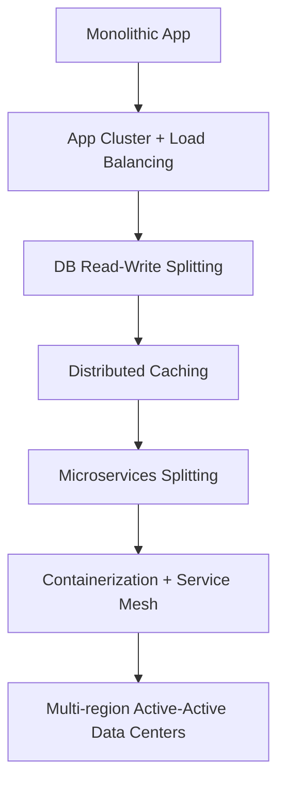
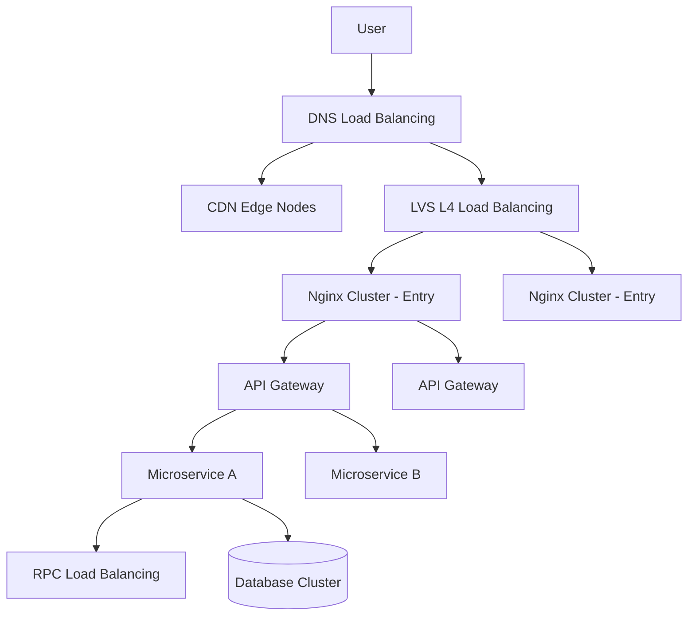
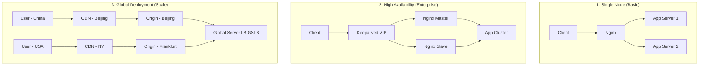
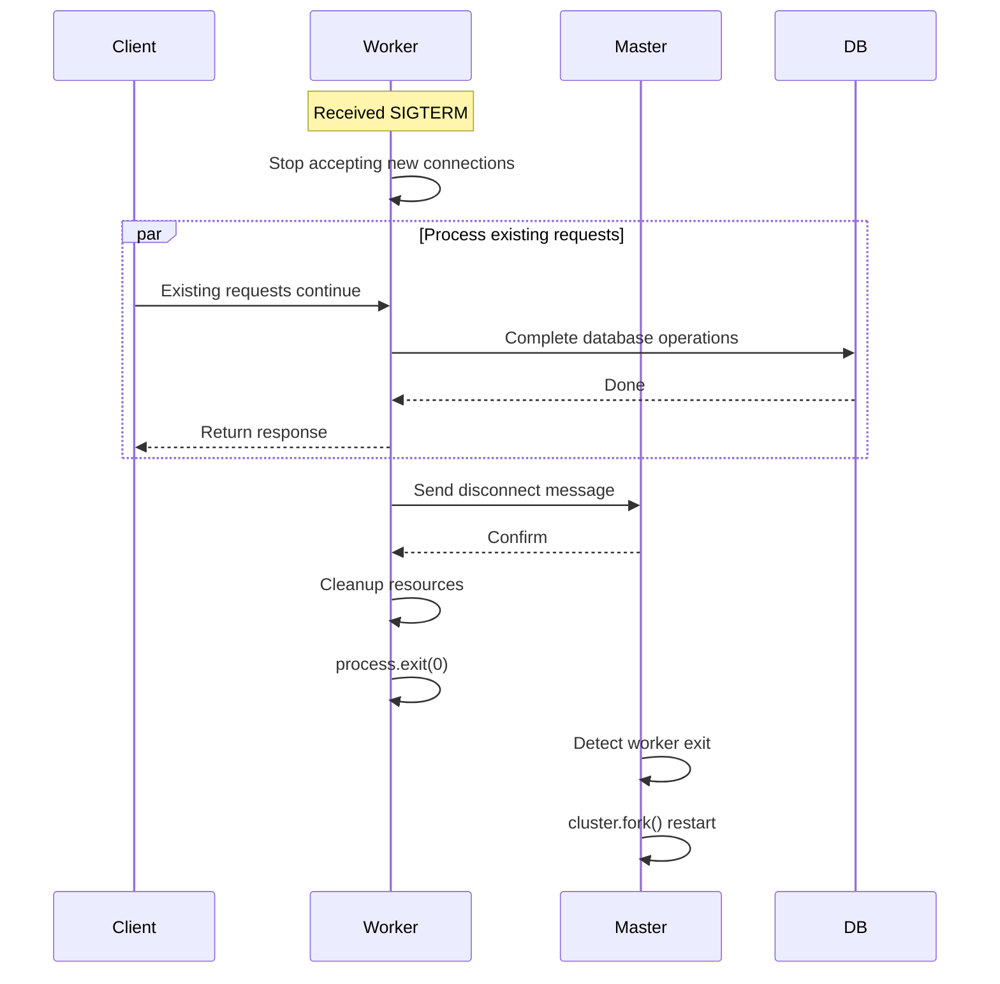
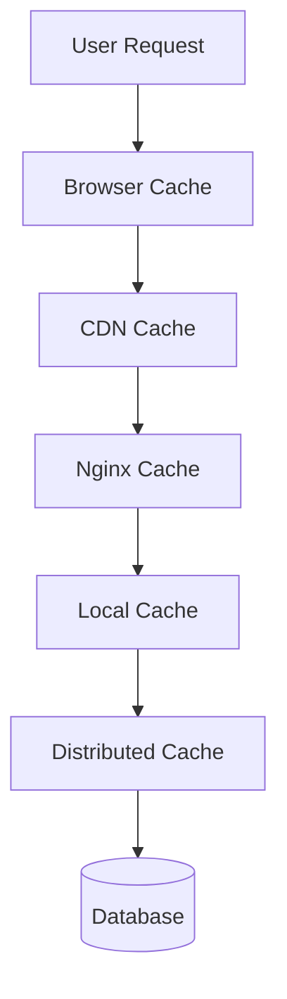
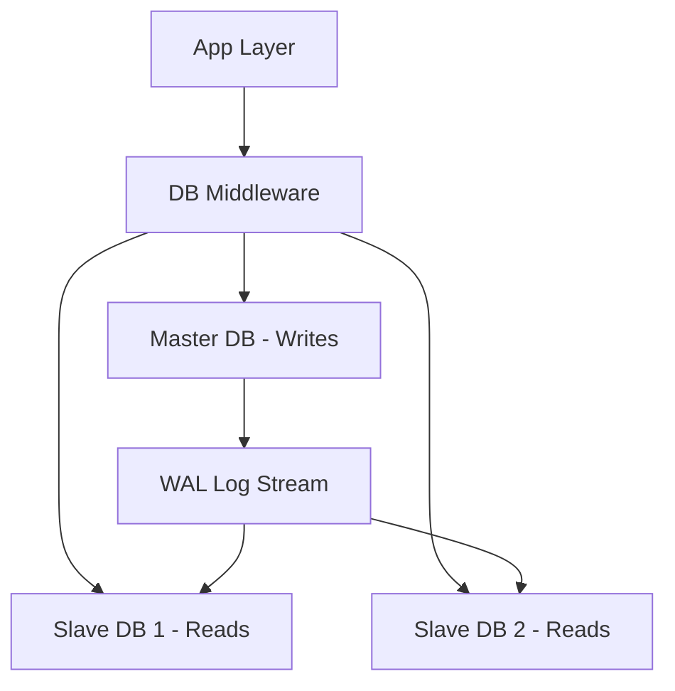
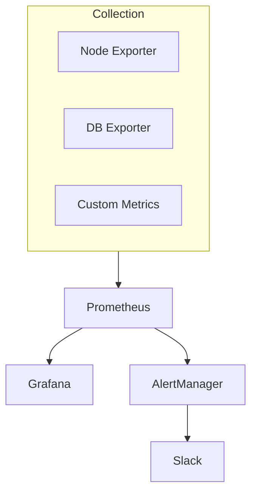

## Introduction

In the internet era, a successful product often faces massive concurrent access from users. Tens of millions of Daily Active Users (DAU) and tens of thousands of requests per second (QPS) pose immense challenges to backend architecture. From the traffic peaks of Alibaba's Double 11 to the instantaneous burst of Spring Festival red envelopes, these scenarios test the ultimate carrying capacity of systems.

This article systematically explains how to build a website architecture that supports tens of millions of concurrent accesses, covering **load balancing, high availability design, caching strategies, database optimization, canary releases, and containerized deployment**. The text includes a large number of code examples, configuration files, and architectural diagrams, aiming to provide a practical technical guide for readers.

---

## 1. Core Challenges and Design Goals of High-Concurrency Systems

### 1.1 The Essence of High Concurrency

High concurrency refers to scenarios where a system needs to process a large number of requests in an extremely short period. Its core challenge lies in: **how to ensure system stability, response speed, and data consistency under limited resources**.

Take a typical e-commerce flash sale as an example:

- 100,000 users refresh the product page simultaneously.
- 50,000 users click "Buy Now."
- 30,000 users submit orders.
- 20,000 users complete payments.

These operations occur within a few seconds, posing a severe test to every component of the system.

### 1.2 Core Design Goals

The design goals of a high-concurrency architecture can be summarized into three points:

| Goal | Description | Key Metric |
| :--- | :--- | :--- |
| **Low Latency** | Ensure user requests are completed in milliseconds | TP99 < 200ms |
| **High Throughput** | Support processing tens of thousands or even millions of requests per second | QPS > 100,000 |
| **High Availability** | Fast recovery from failures, avoiding single point of failure | Availability > 99.99% |

### 1.3 Architecture Evolution Path

From monolithic applications to tens of millions of concurrent users, the evolution usually follows this path:



Each stage solves different bottleneck issues. This article starts with the most basic: load balancing.

---

## 2. Load Balancing: The First Line of Defense for Traffic Distribution

When the processing capacity of a single server reaches its bottleneck, we must distribute requests across multiple machines. A load balancer is the key component to achieving this goal.

### 2.1 Layered Architecture of Load Balancing

In a real-world architecture, load balancing often works collaboratively across multiple layers to form a complete traffic distribution system:



#### 2.1.1 DNS Layer Load Balancing

DNS load balancing is the simplest and most basic way to distribute traffic. It returns multiple IPs for a domain name, achieving basic traffic distribution.

```dns
# DNS configuration example (BIND syntax)
www.example.com.  IN  A  10.0.1.1
www.example.com.  IN  A  10.0.1.2
www.example.com.  IN  A  10.0.1.3
```

It is usually combined with a CDN to cache static resources at nodes closest to the user, significantly reducing pressure on the origin server. The core value of a CDN lies in:

- Reducing network latency (from 300ms to under 50ms)
- Reducing origin server bandwidth pressure
- Defending against DDoS attacks

#### 2.1.2 Network Layer (LVS / Hardware F5)

LVS (Linux Virtual Server) forwards traffic at the transport layer (TCP/UDP). It has extremely high performance and is often the first checkpoint for incoming traffic. LVS has three working modes:

```bash
# LVS NAT mode configuration example
ipvsadm -A -t 192.168.1.100:80 -s rr
ipvsadm -a -t 192.168.1.100:80 -r 10.0.0.1:80 -m
ipvsadm -a -t 192.168.1.100:80 -r 10.0.0.2:80 -m
ipvsadm -a -t 192.168.1.100:80 -r 10.0.0.3:80 -m
```

#### 2.1.3 Application Layer (Nginx / OpenResty)

Nginx is a Layer 7 load balancer based on the HTTP protocol. It can implement finer routing, rate limiting, caching, SSL offloading, and other functions.

```nginx
# Complete Nginx load balancing configuration
upstream backend {
    # Algorithm: least_conn
    least_conn;

    # Server list with weight and health check parameters
    server 10.0.0.1:8080 weight=3 max_fails=3 fail_timeout=30s;
    server 10.0.0.2:8080 weight=2 max_fails=3 fail_timeout=30s;
    server 10.0.0.3:8080 backup;  # Backup node

    keepalive 32;  # Keep-alive connections
}

server {
    listen 80;
    server_name api.example.com;

    # Access log format
    log_format main '$remote_addr - $remote_user [$time_local] "$request" '
                    '$status $body_bytes_sent "$http_referer" '
                    '"$http_user_agent" "$http_x_forwarded_for" '
                    '$upstream_addr $upstream_response_time';

    access_log /var/log/nginx/api_access.log main;

    location / {
        proxy_pass http://backend;
        proxy_set_header Host $host;
        proxy_set_header X-Real-IP $remote_addr;
        proxy_set_header X-Forwarded-For $proxy_add_x_forwarded_for;
        proxy_set_header X-Forwarded-Proto $scheme;

        # Timeout settings
        proxy_connect_timeout 5s;
        proxy_send_timeout 10s;
        proxy_read_timeout 10s;

        # Failure retries
        proxy_next_upstream error timeout invalid_header http_500 http_502 http_503;
        proxy_next_upstream_tries 3;
        proxy_next_upstream_timeout 10s;
    }

    # Health check endpoint
    location /health {
        access_log off;
        return 200 "healthy\n";
        add_header Content-Type text/plain;
    }
}
```

#### 2.1.4 API Gateway Layer

In a microservices architecture, the API gateway takes on more complex responsibilities:

- **Authentication**: JWT verification, OAuth2 integration
- **Traffic Control**: Token bucket rate limiting, concurrency control
- **Service Discovery**: Integration with Consul/Etcd/Nacos
- **Protocol Transformation**: HTTP to gRPC
- **Request/Response Transformation**: Field mapping, data aggregation

```javascript
// Node.js API Gateway rate limiting example (using express-rate-limit)
import rateLimit from 'express-rate-limit'
import RedisStore from 'rate-limit-redis'
import { createClient } from 'redis'

const redisClient = createClient({ url: 'redis://localhost:6379' })

const limiter = rateLimit({
    store: new RedisStore({
        sendCommand: (...args) => redisClient.sendCommand(args),
    }),
    windowMs: 1 * 60 * 1000, // 1 minute
    max: 1000, // Limit each IP to 1000 requests per minute
    standardHeaders: true,
    legacyHeaders: false,
    handler: (req, res) => {
        res.status(429).json({ error: 'Too many requests, please try again later' });
    }
});

// Apply to order service routes
app.use('/api/order', limiter, (req, res) => {
    // Forward request to order microservice
});
```

### 2.2 Load Balancing Algorithms Explained

Load balancing algorithms are divided into static and dynamic categories based on whether they consider the real-time status of the backend.

#### 2.2.1 Static Algorithms

**Round Robin Implementation**:

```javascript
// Node.js Round Robin Load Balancer Implementation
class LoadBalancer {
    constructor(servers) {
        this.servers = servers;
        this.currentIndex = 0;
    }

    getNextServer() {
        const server = this.servers[this.currentIndex];
        // Increment index and wrap around
        this.currentIndex = (this.currentIndex + 1) % this.servers.length;
        return server;
    }
}

// Example usage
const servers = ["Server1:8080", "Server2:8080", "Server3:8080"];
const lb = new LoadBalancer(servers);

// Simulate 10 requests
for (let i = 0; i < 10; i++) {
    const server = lb.getNextServer();
    console.log(`Request ${i + 1} forwarded to ${server}`);
}
```

**Weighted Round Robin (Smooth Weighted)**:

```javascript
// Node.js Weighted Round Robin (Smooth)
class WeightedRoundRobin {
    constructor(servers) {
        // servers: [{ name: 'S1', weight: 5 }, { name: 'S2', weight: 1 }]
        this.servers = servers;
        this.currentWeights = servers.map(() => 0);
        this.totalWeight = servers.reduce((sum, s) => sum + s.weight, 0);
    }

    getNextServer() {
        let maxWeight = -1;
        let index = -1;

        for (let i = 0; i < this.servers.length; i++) {
            // Add original weight to current weight
            this.currentWeights[i] += this.servers[i].weight;

            // Select node with maximum current weight
            if (this.currentWeights[i] > maxWeight) {
                maxWeight = this.currentWeights[i];
                index = i;
            }
        }

        if (index !== -1) {
            // Subtract total weight from the selected node's current weight
            this.currentWeights[index] -= this.totalWeight;
            return this.servers[index];
        }

        return null;
    }
}
```

**IP Hash**:

```javascript
import crypto from 'node:crypto'

function ipHash(ipAddress, serverList) {
    /**
     * Choose server based on client IP hash
     */
    const hash = crypto.createHash('md5').update(ipAddress).digest('hex');
    const hashInt = parseInt(hash.substring(0, 8), 16);
    const serverIndex = hashInt % serverList.length;

    return serverList[serverIndex];
}

// Test
const servers = ["Server1", "Server2", "Server3", "Server4"];
const ips = ["192.168.1.100", "192.168.1.101", "192.168.1.100"];

ips.forEach(ip => {
    const selected = ipHash(ip, servers);
    console.log(`IP ${ip} -> ${selected}`);
});
```

**Consistent Hashing**:

Consistent hashing is especially useful in distributed caching, as only a small number of requests are affected when a machine goes down, effectively avoiding cache stampedes.

```javascript
import crypto from 'node:crypto'

class ConsistentHash {
    constructor(nodes = [], virtualNodes = 150) {
        this.virtualNodes = virtualNodes; // Virtual nodes per physical node
        this.ring = new Map(); // Hash ring
        this.sortedKeys = []; // Sorted list of hash values

        nodes.forEach(node => this.addNode(node));
    }

    _hash(key) {
        const hash = crypto.createHash('md5').update(key).digest('hex');
        return parseInt(hash.substring(0, 8), 16);
    }

    addNode(node) {
        for (let i = 0; i < this.virtualNodes; i++) {
            const virtualKey = `${node}:${i}`;
            const hashValue = this._hash(virtualKey);
            this.ring.set(hashValue, node);
            this.sortedKeys.push(hashValue);
        }
        this.sortedKeys.sort((a, b) => a - b);
    }

    removeNode(node) {
        for (let i = 0; i < this.virtualNodes; i++) {
            const virtualKey = `${node}:${i}`;
            const hashValue = this._hash(virtualKey);
            this.ring.delete(hashValue);
            this.sortedKeys = this.sortedKeys.filter(k => k !== hashValue);
        }
    }

    getNode(key) {
        if (this.ring.size === 0) return null;

        const hashValue = this._hash(key);
        // Binary search for first key >= hashValue
        let low = 0, high = this.sortedKeys.length - 1;

        while (low <= high) {
            const mid = Math.floor((low + high) / 2);
            if (this.sortedKeys[mid] >= hashValue) {
                high = mid - 1;
            } else {
                low = mid + 1;
            }
        }

        // Return first node if wrap around
        if (low === this.sortedKeys.length) low = 0;

        return this.ring.get(this.sortedKeys[low]);
    }
}
```

#### 2.2.2 Dynamic Algorithms

**Least Connections**: Assigns new requests to the server with the fewest active connections, suitable for long-connection scenarios.

```javascript
// Node.js Least Connections Load Balancer Implementation
class LeastConnectionsLB {
    constructor(servers) {
        this.servers = servers.map(addr => ({
            address: addr,
            connections: 0
        }));
    }

    getNextServer() {
        let selected = null;
        let minConns = Infinity;

        for (const server of this.servers) {
            if (server.connections < minConns) {
                minConns = server.connections;
                selected = server;
            }
        }

        if (selected) {
            selected.connections++;
        }
        return selected;
    }

    release(server) {
        if (server && server.connections > 0) {
            server.connections--;
        }
    }
}
```

### 2.3 Health Check Mechanisms

A load balancer needs to know which backend instances are healthy to distribute traffic. There are two main methods:

#### 2.3.1 Active Health Check

```nginx
# Nginx Active Health Check (requires nginx_upstream_check_module)
upstream backend {
    server 10.0.0.1:8080;
    server 10.0.0.2:8080;
    server 10.0.0.3:8080;

    check interval=3000 rise=2 fall=5 timeout=1000 type=http;
    check_http_send "HEAD /health HTTP/1.0\r\n\r\n";
    check_http_expect_alive http_2xx http_3xx;
}
```

#### 2.3.2 Passive Health Check

```nginx
# Nginx Passive Health Check
upstream backend {
    server 10.0.0.1:8080 max_fails=3 fail_timeout=30s;
    server 10.0.0.2:8080 max_fails=3 fail_timeout=30s;
    server 10.0.0.3:8080 max_fails=3 fail_timeout=30s;
}
```

#### 2.3.3 Application Layer Health Check Endpoint

Example of a health check endpoint for a Node.js application:

```javascript
// healthcheck.js
import express from 'express'
import mongoose from 'mongoose'
import { createClient } from 'redis'
import checkDiskSpace from 'check-disk-space'

const app = express()

app.get('/health', async (req, res) => {
	const healthcheck = {
		uptime: process.uptime(),
		status: 'OK',
		timestamp: Date.now(),
		checks: {},
	}

	try {
		// Database check
		healthcheck.checks.database = mongoose.connection.readyState === 1 ? 'up' : 'down';

		// Redis check
		const redisClient = createClient()
		await redisClient.connect()
		await redisClient.ping()
		healthcheck.checks.redis = 'up'
		await redisClient.quit()

		// Disk space check
		const diskSpace = await checkDiskSpace('/')
		const freeSpaceGB = diskSpace.free / 1024 / 1024 / 1024
		healthcheck.checks.disk = freeSpaceGB > 10 ? 'up' : 'warning';
	} catch (error) {
		healthcheck.status = 'error'
		healthcheck.error = error.message
		return res.status(503).json(healthcheck)
	}

	if (healthcheck.checks.database === 'down' || healthcheck.checks.redis === 'down') {
		return res.status(503).json(healthcheck)
	}

	res.json(healthcheck)
})
```

### 2.4 Load Balancer Deployment Modes



---

## 3. High Availability Practices for Node.js Applications

While the single-threaded model of Node.js avoids the complexity of multithreaded programming, it cannot fully utilize multi-core CPUs, and the service is interrupted if a process crashes. Therefore, we need special strategies in production.

### 3.1 Multi-process Implementation with Cluster Module

The built-in `cluster` module in Node.js allows us to create multiple worker processes sharing the same server port.

```javascript
// cluster-app.js
import cluster from 'cluster'
import http from 'http'
import { cpus } from 'os'
import process from 'process'

const numCPUs = cpus().length

if (cluster.isPrimary) {
	console.log(`Primary process ${process.pid} is running`)

	for (let i = 0; i < numCPUs; i++) {
		cluster.fork()
	}

	cluster.on('exit', (worker, code, signal) => {
		console.log(`Worker ${worker.process.pid} died, restarting...`)
		cluster.fork()
	})
} else {
	http.createServer((req, res) => {
		res.writeHead(200);
		res.end(`Hello from Worker ${process.pid}`);
	}).listen(3000)
}
```

### 3.2 Graceful Shutdown Mechanism

Forcefully terminating a process causes ongoing requests to break and clients to receive `ECONNRESET` errors. It can also corrupt data in the database.



Full graceful shutdown implementation:

```javascript
// graceful-shutdown.js
class GracefulShutdownManager {
	constructor(server, options = {}) {
		this.server = server
		this.options = {
			timeout: options.timeout || 10000,
			connections: new Set(),
			...options,
		}
		this.isShuttingDown = false
		this.pendingRequests = 0
		this.trackConnections()
	}

	trackConnections() {
		this.server.on('connection', (socket) => {
			if (this.isShuttingDown) {
				socket.destroy()
				return
			}
			this.options.connections.add(socket)
			socket.on('close', () => this.options.connections.delete(socket))
		})

		this.server.on('request', (req, res) => {
			if (this.isShuttingDown) res.setHeader('Connection', 'close');
			this.pendingRequests++
			res.on('finish', () => {
				this.pendingRequests--
				this.checkIfDone()
			})
		})
	}

	shutdown() {
		if (this.isShuttingDown) return
		this.isShuttingDown = true
		this.server.close(() => console.log('Server closed'))

		const forceShutdown = setTimeout(() => {
			console.error('Shutdown timeout, forcing exit')
			process.exit(1)
		}, this.options.timeout)

		const checkInterval = setInterval(() => {
			if (this.pendingRequests === 0 && this.options.connections.size === 0) {
				clearInterval(checkInterval)
				clearTimeout(forceShutdown)
				process.exit(0)
			}
		}, 1000)
	}

	checkIfDone() {
		if (this.isShuttingDown && this.pendingRequests === 0 && this.options.connections.size === 0) {
			process.exit(0)
		}
	}
}
```

### 3.3 PM2 Process Manager

PM2 is a mature Node.js process management tool that bundles cluster, graceful shutdown, and auto-restart into simple commands.

#### 3.3.1 Key Capabilities of PM2

| Feature | Command | Description |
| :--- | :--- | :--- |
| Cluster Mode | `pm2 start app.js -i max` | Automatically utilizes all CPU cores |
| Zero-downtime Reload | `pm2 reload all` | Restarts workers one by one |
| Auto Restart | `pm2 start app.js --watch` | Restarts on file changes |
| Monitoring | `pm2 monit` | Real-time CPU/Memory monitoring |
| Log Management | `pm2 logs` | Centralized log management |

#### 3.3.2 Configuration Example

```javascript
// ecosystem.config.js
export default {
	apps: [{
		name: 'my-app',
		script: './app.js',
		instances: 'max',
		exec_mode: 'cluster',
		autorestart: true,
		max_memory_restart: '500M',
		kill_timeout: 10000,
		env: {
			NODE_ENV: 'production',
			PORT: 3000
		}
	}]
}
```

---

## 4. Caching Strategies: Reducing Backend Pressure

Caching is a core method for handling high concurrency by trading space for time.

### 4.1 Multi-level Caching Architecture



### 4.2 Browser Caching

```nginx
# Nginx browser cache configuration
location ~* \.(jpg|jpeg|png|gif|ico|css|js)$ {
    expires 30d;
    add_header Cache-Control "public, no-transform";
}
```

### 4.3 Redis Caching in Action

```javascript
// redis-cache.js
import { createClient } from 'redis'

class RedisCache {
	constructor(options = {}) {
		this.client = createClient({ url: `redis://${options.host || 'localhost'}:6379` })
		this.client.connect()
	}

	async get(key) {
		const data = await this.client.get(key)
		return data ? JSON.parse(data) : null;
	}

	async set(key, value, ttl = 3600) {
		await this.client.set(key, JSON.stringify(value), { EX: ttl })
	}

	async remember(key, ttl, callback) {
		let value = await this.get(key)
		if (value !== null) return value;

		// Using mutex locks to prevent cache breakdown
		const lockKey = `lock:${key}`
		const lockAcquired = await this.client.set(lockKey, 'locked', { NX: true, EX: 10 })

		if (lockAcquired) {
			try {
				value = await callback()
				await this.set(key, value, ttl)
				return value
			} finally {
				await this.client.del(lockKey)
			}
		} else {
			await new Promise(resolve => setTimeout(resolve, 100))
			return this.remember(key, ttl, callback)
		}
	}
}
```

### 4.4 Common Caching Problems and Solutions

- **Cache Penetration**: Querying non-existent data. Solution: Cache null values for a short period.
- **Cache Breakdown (Stampede)**: Hot key expires. Solution: Mutex locks or background refresh.
- **Cache Avalanche**: Mass expiration. Solution: Randomize TTLs.

---

## 5. Database Tier Optimization Strategies

The database is often the heaviest bottleneck. Optimizations include read-write splitting, sharding, and asynchronization.

### 5.1 Read-Write Splitting Architecture



### 5.2 Database Sharding

When a single table exceeds 5 million rows, consider sharding. PostgreSQL's native partitioning is recommended:

```sql
-- Horizontal partitioning example (User table)
CREATE TABLE users (
    id BIGINT PRIMARY KEY,
    username VARCHAR(50)
) PARTITION BY HASH (id);

CREATE TABLE users_0 PARTITION OF users FOR VALUES WITH (MODULUS 4, REMAINDER 0);
CREATE TABLE users_1 PARTITION OF users FOR VALUES WITH (MODULUS 4, REMAINDER 1);
```

### 5.3 Connection Pool Optimization

```javascript
import pg from 'pg'
const pool = new pg.Pool({
	max: 50,
	idleTimeoutMillis: 30000,
	connectionTimeoutMillis: 2000,
})
```

---

## 6. Canary Release Mechanism

Full release of a new version is risky. Canary releases allow gradual traffic diversion to the new version.

### 6.1 Strategy Comparison

| Strategy | Pros | Cons | Use Case |
| :--- | :--- | :--- | :--- |
| **Canary** | Low risk, gradual validation | Long cycle | Core business upgrades |
| **Blue-Green** | Fast switch, simple rollback | High resource usage | Downtime-sensitive services |
| **Rolling** | High resource utilization | Complex rollback | Stateless services |

### 6.2 Implementation via Nginx

```nginx
upstream backend {
    # 90% traffic to old version
    server old-version:8080 weight=90;
    # 10% traffic to new version
    server new-version:8080 weight=10;
}
```

---

## 7. Monitoring and Alerting Systems

Monitoring is the "gatekeeper" of system stability.

### 7.1 Layered Monitoring Architecture



### 7.2 Key Metrics for Node.js (RED Method)

- **Rate**: Number of requests per second.
- **Errors**: Rate of failed requests.
- **Duration**: Distribution of request processing times.

```javascript
const httpRequestDuration = new promClient.Histogram({
	name: 'http_request_duration_seconds',
	labelNames: ['method', 'route', 'status_code'],
	buckets: [0.1, 0.5, 1, 2]
})
```

---

## 8. Summary and Best Practices

Building a website that supports tens of millions of visits requires a holistic approach across multiple dimensions.

### 8.1 Core Takeaways

- **Traffic Entry**: DNS, CDN, LVS, Nginx.
- **App Layer**: Clustering, graceful shutdown, PM2.
- **Cache Layer**: Multi-level cache, Redis, TTL randomization.
- **DB Layer**: Read-write splitting, partitioning, connection pooling.
- **Release**: Canary deployment, feature toggles.
- **Observability**: Prometheus, Grafana, ELK.

### 8.2 Recommended Toolset

- **Load Balancing**: Nginx, HAProxy.
- **Caching**: Redis, Memcached.
- **Database**: PostgreSQL, CockroachDB.
- **Monitoring**: Prometheus, Grafana, OpenTelemetry.
- **Containerization**: Docker, Kubernetes.

Technological evolution is endless, but by mastering core principles and best practices, you can handle massive traffic with confidence.
