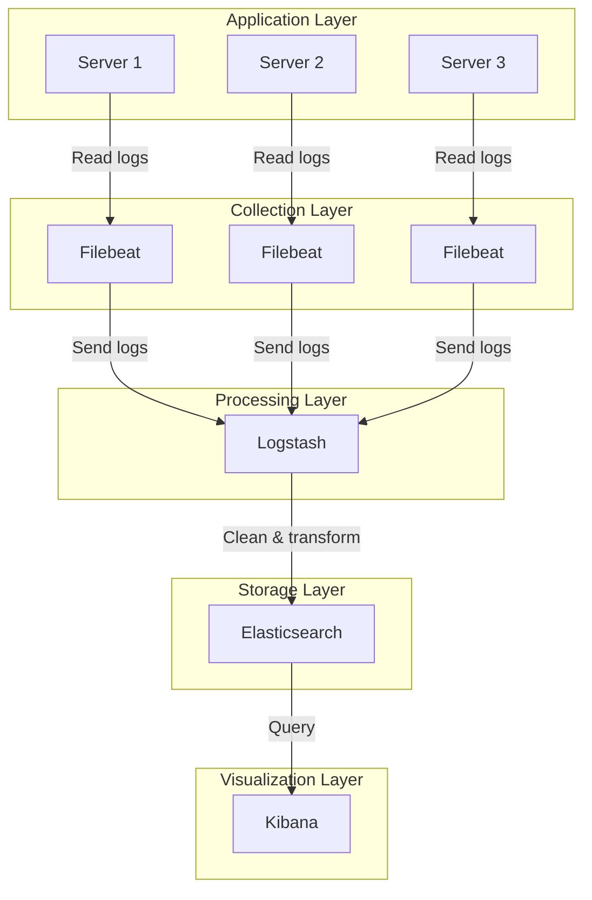
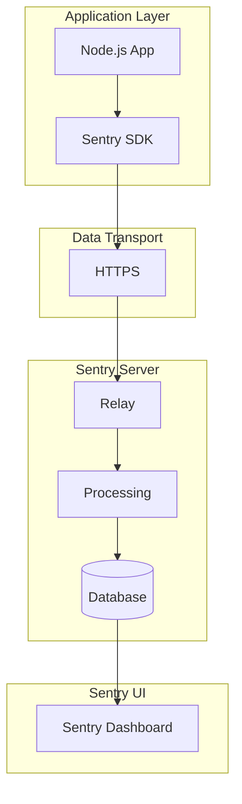
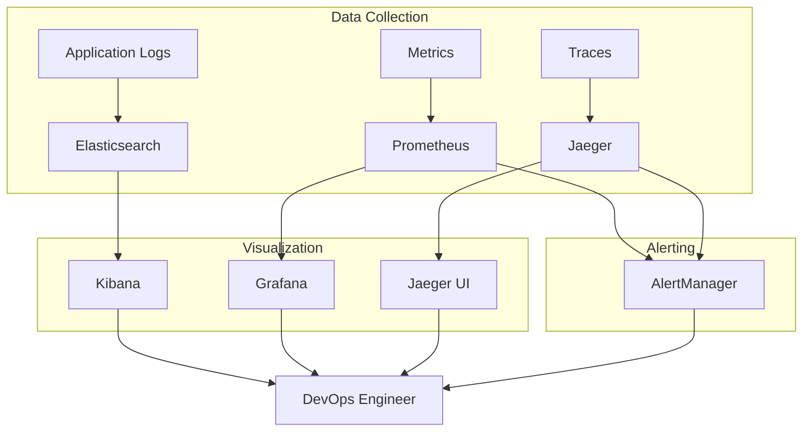

> A comprehensive guide for developers who want to understand what "logging" is and how to use it effectively

Have you ever encountered these situations: the website has a problem but you can't find where it went wrong no matter how hard you look through the code? Or a user says "I clicked a button and nothing happened" but you have no idea what happened? Or you get woken up at 3 AM with an alert, but you're staring at a screen full of logs with no clue where to start?

This article explains in plain language this seemingly simple but actually deep topic called logging. Whether you're a Node.js beginner or an experienced developer wanting a systematic review, you'll find something useful here.

---

## 1. Why Do We Need Logs?

### 1.1 Let's Start with a Story: What Are Logs?

Imagine you run a 24-hour convenience store with security cameras installed. The footage recorded by these cameras is like "logs"—it faithfully records everything that happens in the store.

Normally, nobody watches the footage. But when problems occur:

- Someone complains they weren't given correct change → Check the footage
- Someone broke in at night → Check the footage
- Want to know which time slots have the most customers → Analyze the footage

Logs are the "footage" of your application. They record everything that happens during runtime, allowing us to "replay the footage" afterward.

### 1.2 The Value of Logs

Logs provide value across multiple dimensions:

| Dimension                                | Description                                                                                               | Example                                                                               |
| ---------------------------------------- | --------------------------------------------------------------------------------------------------------- | ------------------------------------------------------------------------------------- |
| **Debugging**                            | Record error stacks, request parameters, execution flow to quickly reproduce and locate production issues | User's order failed, log shows inventory service timed out                            |
| **User Behavior Analysis**               | Record user clicks, access paths, providing data for product optimization and recommendation systems      | Discovered users generally spend a long time on payment page, might need optimization |
| **Monitoring & Risk Control**            | Detect abnormal traffic, attack behaviors, respond quickly with alerting systems                          | Some IP making 1000 requests per second, might be under attack                        |
| **Site Recording & Root Cause Analysis** | Snapshot of crash scene for post-incident tracing of root causes                                          | Service crashed at 3 AM, logs can reconstruct what happened                           |
| **Product Value**                        | Analyze user habits through logs to drive product iteration                                               | Found 80% of users only use search function, homepage can be simplified               |

### 1.3 Logs Are Not Just "Printing Information"

Many beginners think logs are just `console.log("hello")`, but this is completely wrong. Good logs should be:

- **Structured**: Not a pile of strings, but parseable JSON
- **Leveled**: Clear distinction between debug, info, warn, error
- **Correlated**: Request IDs to link logs from the same request
- **Sanitized**: Passwords, ID numbers must be masked

> **Note**: Logs are infrastructure for your application, like water, electricity, and network—not a nice-to-have, but a must-have.

---

## 2. Node.js Logging Basics

### 2.1 The Truth About console

In Node.js, `console.log` actually outputs to standard output stream (stdout), while `console.error` outputs to standard error stream (stderr).

Understanding the difference is important:

```bash
# Redirect stdout and stderr separately
node app.js > output.log 2> error.log

# Redirect both combined
node app.js &> all.log

# Pipe stdout to another command
node app.js | grep "error"
```

### 2.2 Mastering the Console API: Beyond Just log

Many people only know `console.log`, but console has many useful APIs:

#### 2.2.1 ES6 Variable Shorthand

Use object property shorthand to print variable names and values at once:

```javascript
const user = 'Max'
const status = 'active'

// Normal approach: can you tell which is the variable name and which is the value?
console.log('user:', user, 'status:', status)

// Concise approach: crystal clear
console.log({ user, status })
// Output: { user: 'Max', status: 'active' }
```

#### 2.2.2 Tabular Display

Essential for viewing complex data structures:

```javascript
const users = [
	{ id: 1, name: 'Alice', role: 'Admin' },
	{ id: 2, name: 'Bob', role: 'User' },
	{ id: 3, name: 'Charlie', role: 'User' },
]

// Normal print is a mess
console.log(users)

// Tabular print is much clearer
console.table(users)
```

Terminal displays:

```
┌─────────┬──────────┬─────────┐
│ (index) │   name   │  role   │
├─────────┼──────────┼─────────┤
│    0    │  'Alice' │  'Admin'│
│    1    │  'Bob'   │  'User' │
│    2    │ 'Charlie'│  'User' │
└─────────┴──────────┴─────────┘
```

#### 2.2.3 Stack Tracing

Print the current call stack to understand function call chains:

```javascript
function level3() {
	console.trace('Reached here')
}

function level2() {
	level3()
}

function level1() {
	level2()
}

level1()
```

Output:

```
Trace: Reached here
    at level3 (/app.js:2:9)
    at level2 (/app.js:6:5)
    at level1 (/app.js:10:5)
    at Object.<anonymous> (/app.js:13:1)
```

#### 2.2.4 Conditional Assertions

Print only when condition is false, great for simple validations:

```javascript
const count = 5

// count > 10 is false, so it prints
console.assert(count > 10, 'Count must be greater than 10')
// Assertion failed: Count must be greater than 10

// This won't print because condition is true
console.assert(count > 1, "This won't print")
```

#### 2.2.5 Performance Timing

Measure code execution time:

```javascript
console.time('fetch-data')

// Simulate async operation
setTimeout(() => {
	console.timeEnd('fetch-data')
	// Output: fetch-data: 2003.123ms
}, 2000)

// Can also be nested
console.time('total')
console.time('step1')
// ... operation 1
console.timeEnd('step1')
console.time('step2')
// ... operation 2
console.timeEnd('step2')
console.timeEnd('total')
```

#### 2.2.6 Hierarchical Grouping

Create collapsible log groups:

```javascript
console.group('User Registration Flow')
console.info('Step 1: Validate form...')
console.info('Step 2: Check if username exists')

console.group('Database Operations')
console.log('Query users table...')
console.log('User already exists, returning error')
console.groupEnd()

console.info('Step 3: Create user')
console.groupEnd()
```

Terminal shows indented hierarchy for easy reading.

#### 2.2.7 Object Deep Inspection

Control display depth when printing complex nested objects:

```javascript
const bigObject = {
	level1: {
		level2: {
			level3: {
				value: 'Deep value',
			},
		},
	},
}

// Default might only show a few levels
console.log(bigObject)

// Specify depth null = show all
console.dir(bigObject, { depth: null, colors: true })
```

#### 2.2.8 Styling Output

Use CSS styling in browser console:

```javascript
// Note: This works in browser console, not in Node.js terminal
console.log('%cSuccess!', 'color: green; font-weight: bold; font-size: 20px;')
```

> **Tip**: For美化output in Node.js, use libraries like `chalk` which support colors and styles in terminal.

#### 2.2.9 Leveled Output

Print to different streams based on severity:

| Method            | Level | Description                       |
| ----------------- | ----- | --------------------------------- |
| `console.log()`   | info  | General information               |
| `console.info()`  | info  | Information (behaves same as log) |
| `console.warn()`  | warn  | Warning, outputs to stderr        |
| `console.error()` | error | Error, outputs to stderr          |

### 2.3 Best Practices for File Writing

#### 2.3.1 Why Can't We Use fs.appendFile?

Many beginners write logs like this:

```javascript
import fs from 'node:fs'

// Never do this!
function logMessage(message) {
	fs.appendFile('app.log', message + '\n', (err) => {
		if (err) console.error('Write failed')
	})
}

// Business code calls this repeatedly
logMessage('User logged in')
logMessage('User placed order')
logMessage('Payment successful')
// ... called 1000 times
```

The problem: each `fs.appendFile` call does:

1. Open file
2. Write data
3. Close file

This causes "frequent IO", leading to:

- **File handle leaks**: Operating system limits number of open files
- **Performance issues**: Each call does full open-write-close cycle

#### 2.3.2 Writing with Streams: The Right Way

The correct approach is to use a writable stream, keeping the file open and batching writes through a buffer:

```javascript
import fs from 'fs'

// Create write stream in append mode
const logStream = fs.createWriteStream('app.log', { flags: 'a' })

// Write logs (automatically buffered)
logStream.write('User logged in\n')
logStream.write('User placed order\n')
logStream.write('Payment successful\n')

// Close stream before program exits
process.on('SIGINT', () => {
	logStream.end()
	process.exit(0)
})
```

**Why are streams better?**

1. File only opened once, continuous writing
2. OS automatically buffers, reducing IO operations
3. No file handle leaks

**Important**: `write()` returns a boolean indicating whether data was fully written to internal buffer. If it returns `false`, wait for 'drain' event:

```javascript
function safeWrite(stream, message) {
	if (!stream.write(message)) {
		// Return false means buffer is full, wait for drain
		stream.once('drain', () => {
			stream.write(message)
		})
	}
}
```

### 2.4 Inodes and File Handles

#### 2.4.1 What Is an Inode?

In Linux systems, every file has a unique **inode** (index node). Inodes store:

- File metadata (permissions, size, timestamps)
- Pointers to data blocks

View file inodes with `ls -i`:

```bash
ls -i app.log
# Output: 1234567 app.log
# 1234567 is the inode number
```

#### 2.4.2 Relationship Between Inodes and Logs

When you "delete" a file that's still being used by a process:

```bash
# Process is writing to app.log
rm app.log  # File is "deleted"
```

The file becomes invisible, but the inode still exists and the process can still write to it. Disk space is only freed when all processes close the file handle.

#### 2.4.3 Understanding Inodes Helps with Log Rotation

During log rotation:

1. Rename `app.log` to `app-2025-03-10.log`
2. Create new `app.log` to continue writing

Because inodes persist, after renaming, the process still writes to the original inode. This explains why logs can "disappear" after rotation—they're being written to the new filename.

---

## 3. Server Application Logging Practices

### 3.1 Request Logs (Access Log)

Every HTTP request should log an entry. This is the most basic requirement.

```javascript
import express from 'express'

const app = express()

// Request logging middleware
app.use((req, res, next) => {
	const start = Date.now()

	// Callback when request finishes
	res.on('finish', () => {
		const duration = Date.now() - start

		console.log(
			JSON.stringify({
				timestamp: new Date().toISOString(),
				type: 'access',
				method: req.method,
				url: req.originalUrl,
				status: res.statusCode,
				duration, // Response time in milliseconds
				ip: req.ip,
				userAgent: req.get('User-Agent'),
				userId: req.user?.id, // If user auth is implemented
				traceId: req.headers['x-trace-id'], // Distributed tracing ID
			}),
		)
	})

	next()
})
```

#### 3.1.1 What to Include in Request Logs?

| Field     | Description                | Example                  |
| --------- | -------------------------- | ------------------------ |
| timestamp | Request time               | 2025-03-10T10:00:00.000Z |
| method    | HTTP method                | GET, POST, PUT, DELETE   |
| url       | Request path               | /api/users/123           |
| status    | Response status code       | 200, 404, 500            |
| duration  | Response time (ms)         | 125                      |
| ip        | Client IP                  | 192.168.1.100            |
| userId    | User ID (if authenticated) | user_abc123              |
| traceId   | Distributed tracing ID     | trace_xyz789             |

### 3.2 External Service Call Logs

When Node.js acts as a BFF layer calling backend services, log complete call information:

```javascript
async function callBackend(serviceUrl, params, options = {}) {
	const start = Date.now()
	const requestId = crypto.randomUUID()

	try {
		const response = await axios.post(serviceUrl, params, {
			headers: {
				'X-Request-ID': requestId,
				...options.headers,
			},
			timeout: options.timeout || 5000,
		})

		const duration = Date.now() - start

		console.log(
			JSON.stringify({
				type: 'backend_call',
				requestId,
				service: serviceUrl,
				params: params, // Note: Must sanitize in production!
				responseStatus: response.status,
				duration,
				timestamp: new Date().toISOString(),
			}),
		)

		return response.data
	} catch (err) {
		const duration = Date.now() - start

		console.error(
			JSON.stringify({
				type: 'backend_error',
				requestId,
				service: serviceUrl,
				params: params,
				error: err.message,
				errorCode: err.code,
				stack: err.stack,
				duration,
				timestamp: new Date().toISOString(),
			}),
		)

		throw err
	}
}
```

#### 3.2.1 Value of Call Logs

- Troubleshoot slow responses from a specific backend service
- Analyze inter-service dependencies
- Discover abnormal calling patterns (like circular calls)

### 3.3 Exception Handling and Logging

#### 3.3.1 Try/Catch for Synchronous Code

```javascript
app.get('/api/user/:id', async (req, res) => {
	try {
		const user = await getUser(req.params.id)

		if (!user) {
			return res.status(404).json({ error: 'User not found' })
		}

		res.json(user)
	} catch (err) {
		// Must log complete context!
		console.error(
			JSON.stringify({
				type: 'error',
				route: '/api/user/:id',
				params: req.params,
				query: req.query,
				userId: req.user?.id,
				error: err.message,
				stack: err.stack,
				timestamp: new Date().toISOString(),
			}),
		)

		res.status(500).json({ error: 'Internal Server Error' })
	}
})
```

#### 3.3.2 Special Handling for Async Errors

Promise.reject won't be caught by try/catch:

```javascript
// This is wrong!
try {
	Promise.reject(new Error('async error'))
} catch (err) {
	// This will never execute
}

// Correct写法
async function wrong() {
	try {
		await Promise.reject(new Error('async error'))
	} catch (err) {
		console.error(err)
	}
}

// Or use .catch()
Promise.reject(new Error('async error')).catch((err) => console.error(err))
```

#### 3.3.3 Global Uncaught Exception Handling

Set up the last line of defense for the process:

```javascript
// Catch unhandled promise rejections
process.on('unhandledRejection', (reason, promise) => {
	console.error(
		JSON.stringify({
			type: 'unhandled_rejection',
			reason: reason instanceof Error ? reason.message : reason,
			stack: reason instanceof Error ? reason.stack : undefined,
			timestamp: new Date().toISOString(),
		}),
	)
})

// Catch unhandled exceptions
process.on('uncaughtException', (err) => {
	console.error(
		JSON.stringify({
			type: 'uncaught_exception',
			error: err.message,
			stack: err.stack,
			timestamp: new Date().toISOString(),
		}),
	)

	// For uncaught exceptions, usually need graceful exit
	process.exit(1)
})
```

> **Tip**: After catching an unhandled exception, Node.js recommends exiting anyway, because state may already be inconsistent.

### 3.4 Business Process Logs

Record state changes at critical business nodes:

```javascript
// Order creation
async function createOrder(orderData) {
	const orderId = generateOrderId()

	console.log(
		JSON.stringify({
			type: 'business',
			action: 'create_order_start',
			orderId,
			userId: orderData.userId,
			productId: orderData.productId,
			quantity: orderData.quantity,
			totalPrice: orderData.totalPrice,
			timestamp: new Date().toISOString(),
		}),
	)

	try {
		// Check inventory
		const stockAvailable = await checkStock(orderData.productId, orderData.quantity)

		if (!stockAvailable) {
			console.log(
				JSON.stringify({
					type: 'business',
					action: 'create_order_failed',
					orderId,
					reason: 'stock_insufficient',
					timestamp: new Date().toISOString(),
				}),
			)
			throw new Error('Insufficient stock')
		}

		// Reduce stock
		await reduceStock(orderData.productId, orderData.quantity)

		// Create order
		const order = await saveOrder(orderId, orderData)

		console.log(
			JSON.stringify({
				type: 'business',
				action: 'create_order_success',
				orderId,
				userId: orderData.userId,
				totalPrice: orderData.totalPrice,
				timestamp: new Date().toISOString(),
			}),
		)

		return order
	} catch (err) {
		console.error(
			JSON.stringify({
				type: 'business',
				action: 'create_order_error',
				orderId,
				error: err.message,
				timestamp: new Date().toISOString(),
			}),
		)
		throw err
	}
}
```

#### 3.4.1 Key Points for Business Logs

- **Complete lifecycle**: Log start, success, failure
- **ID correlation**: Each order has unique ID for searching
- **Log key parameters**: Product, quantity, price
- **Errors need reasons**: Not just "something went wrong", specify what went wrong

### 3.5 Log Levels and Format

#### 3.5.1 Log Levels

From low to high:

| Level | English | Description                        | Use Case                                   |
| ----- | ------- | ---------------------------------- | ------------------------------------------ |
| trace | TRACE   | Most detailed, usually not enabled | Trace code flow during development         |
| debug | DEBUG   | Debugging info                     | Troubleshooting during development         |
| info  | INFO    | Normal info                        | Request start/end, business flows          |
| warn  | WARN    | Warning                            | High resource usage, triggered degradation |
| error | ERROR   | Error                              | Request failure, exceptions caught         |
| fatal | FATAL   | Fatal error                        | Process about to exit                      |

#### 3.5.2 Structured Logs

**Must use JSON format** for easy parsing and analysis:

```json
{
	"timestamp": "2025-03-10T10:00:00.000Z",
	"level": "info",
	"service": "user-service",
	"pid": 12345,
	"hostname": "server-01",
	"message": "User logged in",
	"userId": "user_1001",
	"ip": "192.168.1.100",
	"requestId": "req_abc123"
}
```

**Why not string logs?**

```
[2025-03-10 10:00:00] INFO: User logged in, userId=user_1001
```

Problems with string logs:

- Searching "user_1001" might match other unrelated content
- Can't filter by field
- Difficult to parse

### 3.6 Principles of Logging

#### 3.6.1 Logging Should Never Throw Exceptions

```javascript
// Wrong
function log(message) {
	if (!message) {
		throw new Error('message cannot be empty') // Logging throwing exceptions?
	}
	console.log(message)
}

// Correct
function log(message) {
	try {
		console.log(message)
	} catch (err) {
		// Logging failed, but business must continue
		// Can try writing to a fallback location
	}
}
```

#### 3.6.2 Logging Should Have No Side Effects

```javascript
// Wrong
function logUser(user) {
	console.log(user)
	user.lastLogged = new Date() // Side effect!
	db.save(user) // Changed data because of logging
}

// Correct
function logUser(user) {
	console.log({
		id: user.id,
		name: user.name,
		// Only print needed info, don't modify original object
	})
}
```

#### 3.6.3 Never Log Sensitive Information

These must be sanitized:

| Information Type | Sanitization          | Example         |
| ---------------- | --------------------- | --------------- |
| Password         | Delete or print `***` | password: `***` |
| Phone            | Show last 4 digits    | 138\*\*\*\*5678 |
| ID Number        | Show first 3 last 4   | 110\*\*\*5678   |
| Bank Card        | Show last 4 digits    | \*\*\*\*1234    |
| Token            | Show first 5 last 5   | eyJhb...4r3s5   |

```javascript
function sanitizeObject(obj) {
	const sensitiveFields = ['password', 'token', 'secret', 'apiKey']
	const sanitized = { ...obj }

	for (const field of sensitiveFields) {
		if (sanitized[field]) {
			if (sanitized[field].length > 10) {
				sanitized[field] = sanitized[field].slice(0, 5) + '...' + sanitized[field].slice(-5)
			} else {
				sanitized[field] = '***'
			}
		}
	}

	return sanitized
}
```

---

## 4. Log Rotation and Management

### 4.1 Why Do We Need Log Rotation?

Log files grow indefinitely:

```
app.log: 10MB
app.log: 100MB
app.log: 1GB
app.log: 10GB  // Disk full!
```

So we must rotate logs periodically.

### 4.2 Rotation Strategies

#### 4.2.1 Time-Based Rotation

New file each day:

```
app-2025-03-08.log
app-2025-03-09.log
app-2025-03-10.log
app.log  <-- currently writing
```

Best for: Applications with stable log volume

#### 4.2.2 Size-Based Rotation

New file when reaching 100MB:

```
app-001.log  (100MB)
app-002.log  (100MB)
app-003.log  (80MB)   <-- currently writing
```

Best for: Applications with variable log volume

### 4.3 Rotation Methods

#### 4.3.1 Create Method (Rename)

How logging libraries like winston's DailyRotateFile work:

1. Rename `app.log` to `app-2025-03-10.log`
2. Create new `app.log` to continue writing

**Problem**: After renaming, process still holds old inode, new file gets no content.

**Solution**: Notify process to reopen file (send SIGUSR2 signal).

#### 4.3.2 Copytruncate Method (Copy and Clear)

How logrotate tool works:

1. Copy `app.log` content to `app-2025-03-10.log`
2. Clear original `app.log`

**Pros**: No process restart needed
**Cons**: May lose data being written at exact moment of clearing

### 4.4 logrotate Configuration

Linux uses logrotate to manage logs:

```bash
# /etc/logrotate.d/myapp

/var/log/myapp/*.log {
    daily              # Rotate once daily
    rotate 30         # Keep 30 days
    compress          # Compress old logs
    delaycompress      # Don't compress yesterday's (for debugging)
    missingok          # No error if log doesn't exist
    notifempty         # Don't rotate if empty
    create 0640 myapp myapp  # New file permissions
    sharedscripts       # Run postrotate only once

    postrotate
        # Notify process to reopen log file
        kill -USR2 $(cat /var/run/myapp.pid)
    endscript
}
```

### 4.5 Log Cleanup Policies

| Strategy      | Description                          | Example        |
| ------------- | ------------------------------------ | -------------- |
| Keep by time  | Keep only logs from last N days      | Keep 30 days   |
| Keep by size  | Auto-delete oldest when disk is full | Keep last 10GB |
| Keep by count | Keep only last N files               | Keep 100 files |

---

## 5. Command Line Logging Beautification and Interaction

During development and debugging, we want to see colorful, readable logs in the terminal.

### 5.1 chalk: Color Your Text

```javascript
import chalk from 'chalk'

// Various colors
console.log(chalk.red('Error message'))
console.log(chalk.green('Success message'))
console.log(chalk.yellow('Warning message'))
console.log(chalk.blue('Info'))
console.log(chalk.cyan('Cyan'))
console.log(chalk.magenta('Purple'))

// Combined styles
console.log(chalk.bold.red('Bold red'))
console.log(chalk.bgRed.white('Red background, white text'))
console.log(chalk.underline('Underlined'))

// Template strings
console.log(chalk`{red Error:} {green Success:} {blue Info:}`)
```

### 5.2 progress: Progress Bars

```javascript
import ProgressBar from 'progress'

const bar = new ProgressBar('Downloading: [:bar] :percent :etas', {
	total: 100,
	width: 40,
})

const timer = setInterval(() => {
	bar.tick()

	if (bar.complete) {
		clearInterval(timer)
		console.log('\nDownload complete!')
	}
}, 100)
```

Terminal displays:

```
Downloading: [████████████████████] 80% 2.0s
```

### 5.3 inquirer: Interactive CLI

```javascript
import inquirer from 'inquirer'

async function askQuestions() {
	const answers = await inquirer.prompt([
		{
			type: 'input',
			name: 'name',
			message: 'What is your name?',
		},
		{
			type: 'list',
			name: 'color',
			message: 'What is your favorite color?',
			choices: ['Red', 'Green', 'Blue'],
		},
		{
			type: 'confirm',
			name: 'confirm',
			message: 'Do you want to continue?',
		},
	])

	console.log('Your answers:', answers)
}

askQuestions()
```

### 5.4 blessed-contrib: Terminal Dashboard

```javascript
import blessed from 'blessed'
import contrib from 'blessed-contrib'

const screen = blessed.screen()

// Create line chart
const line = contrib.line({
	label: 'Request Statistics',
	showLegend: true,
	legend: { width: 20 },
})

screen.append(line)

// Update data
setInterval(() => {
	const data = Math.random() * 100
	line.setData([{ x: ['00:00', '00:01', '00:02'], y: [10, 20, data] }])
	screen.render()
}, 1000)
```

### 5.5 commander.js: CLI Tools

```javascript
import { Command } from 'commander'

const program = new Command()

program.name('myapp').description('My CLI Tool').version('1.0.0')

program
	.command('serve')
	.description('Start the server')
	.option('-p, --port <number>', 'Port number', 3000)
	.option('-d, --debug', 'Enable debug mode')
	.action((options) => {
		console.log('Starting server on port:', options.port)
		console.log('Debug mode:', options.debug)
	})

program
	.command('init')
	.description('Initialize project')
	.action(() => {
		console.log('Initializing...')
	})

program.parse()
```

Usage:

```bash
myapp serve -p 8080 -d
myapp init
myapp --version
```

### 5.6 cfonts: ASCII Art

```javascript
import cfonts from 'cfonts'

cfonts.say('Hello World!', {
	font: 'block', // Font: block, huge, simple
	colors: ['blue', 'yellow'], // Gradient colors
	background: 'black', // Background color
	align: 'center', // Alignment
	letterSpacing: 1,
})
```

---

## 6. ELK: Log Collection and Analysis Platform

### 6.1 Why Do We Need ELK?

When you have multiple servers, logs are scattered across machines. You can't log into each one to check!

```
Server 1: app.log
Server 2: app.log
Server 3: app.log
...
Server 100: app.log
```

How do you search? Login to each of the 100 machines?

ELK solves this problem—a **centralized logging platform**.

### 6.2 What Is ELK?

ELK is a combination of three open source software:

| Software      | Purpose                  | Analogy                       |
| ------------- | ------------------------ | ----------------------------- |
| Elasticsearch | Store and search logs    | Library (storage + retrieval) |
| Logstash      | Collect and process logs | Librarian (organization)      |
| Kibana        | Visualize data           | Library search system         |

### 6.3 ELK Architecture



#### 6.3.1 Filebeat: Lightweight Collector

Installed on each server, lightweight, low resource usage:

- Monitors log file changes
- Reads new content in real-time
- Sends to Logstash or Elasticsearch

#### 6.3.2 Logstash: Data Processing Pipeline

Powerful data processing:

- Parse JSON logs
- Filter sensitive info
- Add fields (server name, timestamp)
- Transform formats

#### 6.3.3 Elasticsearch: Distributed Search Engine

Storage and retrieval:

- Distributed storage, large capacity
- Strong full-text search
- Complex query support

#### 6.3.4 Kibana: Visualization Interface

- Search logs
- Create charts
- Build dashboards
- Set up alerts

### 6.4 Quick ELK Deployment

Use Docker Compose for one-click startup:

```bash
# Clone the project
git clone https://github.com/deviantony/docker-elk.git
cd docker-elk

# Start
docker-compose up -d

# Access Kibana
# http://localhost:5601
```

### 6.5 Node.js Application Integration

#### 6.5.1 Pino: High-Performance Logger

Pino is the fastest Node.js logger, 10x faster than winston:

```javascript
import pino from 'pino'

const logger = pino({
	level: 'info', // Log info and above only
	base: {
		service: 'user-service', // Add common fields
		pid: process.pid,
	},
	timestamp: pino.stdTimeFunctions.isoTime, // ISO format time
})

// Usage
logger.info({ userId: '1001' }, 'User logged in')
logger.error({ err }, 'Request failed')
logger.debug({ query }, 'Database query')
```

**Why is Pino so fast?**

- Asynchronous writing, non-blocking
- Minimal serialization (much less than winston)
- JSON output by default, no configuration needed

#### 6.5.2 Winston: Feature-Rich Logger

More features, more mature ecosystem:

```javascript
import winston from 'winston'
import { ElasticsearchTransport } from 'winston-elasticsearch'

// Create logger
const logger = winston.createLogger({
	level: 'info',
	format: winston.format.combine(
		winston.format.timestamp(),
		winston.format.json(), // JSON format
	),
	defaultMeta: { service: 'user-service' },
	transports: [
		// File output
		new winston.transports.File({
			filename: 'logs/error.log',
			level: 'error',
		}),
		new winston.transports.File({
			filename: 'logs/combined.log',
		}),

		// Console output (colorful for development)
		new winston.transports.Console({
			format: winston.format.combine(winston.format.colorize(), winston.format.simple()),
		}),

		// Elasticsearch output
		new ElasticsearchTransport({
			level: 'info',
			clientOpts: {
				node: 'http://elasticsearch:9200',
			},
			indexPrefix: 'myapp',
		}),
	],
})
```

### 6.6 Logstash Configuration

```ruby
# logstash.conf

input {
  # Receive from Filebeat
  beats {
    port => 5044
  }
}

filter {
  # Parse JSON
  json {
    source => "message"
    target => "parsed"
  }

  # Add timestamp
  date {
    match => ["timestamp", "ISO8601"]
    target => "@timestamp"
  }

  # Filter sensitive info
  mutate {
    gsub => [
      "password", "\S", "***",
      "token", "\S", "***"
    ]
  }

  # Keep only needed fields
  if [type] == "access" {
    mutate {
      select => ["@timestamp", "method", "url", "status", "duration"]
    }
  }
}

output {
  # Output to Elasticsearch
  elasticsearch {
    hosts => ["elasticsearch:9200"]
    index => "myapp-%{+YYYY.MM.dd}"
  }

  # Console output for development
  stdout {
    codec => rubydebug
  }
}
```

### 6.7 Using Kibana

#### 6.7.1 Create Index Pattern

1. Open Kibana → Management → Index Patterns
2. Enter `myapp-*`
3. Select time field `@timestamp`

#### 6.7.2 Search Logs

```
# Search all errors
level: error

# Search specific user's logs
userId: user_1001

# Search specific time range
@timestamp: [2025-03-10 TO 2025-03-11]

# Combined search
level: error AND userId: user_1001
```

#### 6.7.3 Create Dashboards

Common charts:

- **Error trend chart**: Count errors per hour
- **Request latency distribution**: P50/P90/P99
- **Top 10 errors**: Most common error types
- **Request volume timeline**: Show request volume over time

---

## 7. Sentry: Error Monitoring Platform

### 7.1 Logs vs Sentry

| Dimension   | Logs                         | Sentry                                 |
| ----------- | ---------------------------- | -------------------------------------- |
| Proactivity | Passive: Someone has to look | Active: It notifies you                |
| Real-time   | Post-analysis                | Real-time alerts                       |
| Aggregation | Weak                         | Strong: Auto-aggregates similar errors |
| Context     | Need to add manually         | Auto-collected                         |

Simply put: **Logs are "footage", Sentry is "alarm system"**.

### 7.2 Core Sentry Features

#### 7.2.1 Error Capture

- Auto-capture unhandled exceptions
- Auto-capture Promise rejections
- Source Map support (can see pre-minified code line numbers)

#### 7.2.2 Rich Context

Auto-collected:

- User info (IP, ID)
- Browser info
- Operating system
- Request parameters
- Request headers
- Current page URL

Can also add manually:

```javascript
Sentry.setUser({
	id: 'user_123',
	email: 'user@example.com',
	username: 'john_doe',
})

Sentry.setTag('version', '1.0.0')
Sentry.setExtra('order_id', 'order_456')
```

#### 7.2.3 Error Aggregation

1000 users encountering the same bug are aggregated into 1 Issue, not 1000 alerts.

#### 7.2.4 Performance Monitoring

Auto-tracks:

- Page load time
- API request duration
- Database query time

### 7.3 Node.js Integration

#### 7.3.1 Installation

```bash
npm install @sentry/node
```

#### 7.3.2 Initialization

```javascript
import * as Sentry from '@sentry/node'

Sentry.init({
	dsn: 'https://your-dsn@sentry.io/project-id',
	environment: process.env.NODE_ENV,
	release: process.env.APP_VERSION,

	// Sample rate: 1.0 = 100%, 0.1 = 10%
	tracesSampleRate: 1.0,

	// Custom sample rate
	tracesSampler: (samplingContext) => {
		if (samplingContext.transactionContext.name === '/health') {
			return 0 // Don't sample health checks
		}
		return 0.1
	},
})

// Use with Express
import express from 'express'
const app = express()

Sentry.setupExpressErrorHandler(app)

// Routes...
```

#### 7.3.3 Manual Error Capture

```javascript
// Capture exception
try {
	riskyOperation()
} catch (err) {
	Sentry.captureException(err)
	throw err // Still throw for other handlers
}

// Capture message (not an exception)
Sentry.captureMessage('Something went wrong', 'warning')

// Capture custom event
Sentry.captureEvent({
	message: 'Custom event',
	contexts: {
		custom: {
			orderId: '123',
			action: 'checkout',
		},
	},
})
```

#### 7.3.4 Request Tracing

```javascript
// Create transaction
const transaction = Sentry.startTransaction({
	op: 'task',
	name: 'Process Order',
})

try {
	await processOrder()
	transaction.setStatus('ok')
} catch (err) {
	transaction.setStatus('error')
	Sentry.captureException(err)
} finally {
	transaction.finish()
}
```

### 7.4 Sentry Data Flow



### 7.5 Self-Hosted Sentry

Don't want to use Sentry cloud? Self-host:

```bash
# Clone repo
git clone https://github.com/getsentry/self-hosted.git
cd self-hosted

# Install (configures a lot on first run)
./install.sh

# Start
docker-compose up -d

# Access
# http://your-server:9000
```

> **Tip**: Self-hosting requires significant resources (8GB+ RAM recommended) and maintenance cost is not low. For small projects, use Sentry cloud service directly.

---

## 8. Limitations of Logging

### 8.1 Logs Are Not a Silver Bullet

Although logs and Sentry are very useful, they're not a cure-all:

#### 8.1.1 High Storage Cost

- Full logs require lots of disk space
- Elasticsearch cluster is expensive
- Need regular cleanup and archival

#### 8.1.2 Limited Query Flexibility

Logs are good at:

- Searching for specific keywords
- Filtering by time range
- Counting errors

Logs are bad at:

- Cross-service call chain tracing
- Performance trend analysis
- Real-time alerts (not as convenient as Sentry)

#### 8.1.3 Can't Capture All Problems

These require metric monitoring:

- Slow memory leaks
- Sustained high CPU
- Connection pool exhaustion
- Frequent GC

#### 8.1.4 Missing Context

Logs only record single service info. In distributed systems, one request may cross 10 services. Need **Trace ID** to link them.

### 8.2 The Three Pillars of Observability

Modern operations need a triad of observability:

| Pillar      | English | Question Answered      | Tools                |
| ----------- | ------- | ---------------------- | -------------------- |
| **Logs**    | Logs    | What happened?         | ELK, Loki            |
| **Metrics** | Metrics | Is the system healthy? | Prometheus, InfluxDB |
| **Traces**  | Traces  | Why is it slow?        | Jaeger, SkyWalking   |

#### 8.2.1 Logs

Records discrete events:

- "User Zhang San logged in"
- "Order 123 failed to create, reason: insufficient inventory"
- "Database query timed out"

**Best for**: Troubleshooting, audit trails

#### 8.2.2 Metrics

Aggregated numerical data:

- CPU usage: 75%
- Request QPS: 1000/s
- Error rate: 0.1%
- P99 latency: 250ms

**Best for**: Real-time monitoring, trend analysis, alerting

#### 8.2.3 Traces

Complete path of requests through distributed systems:

```
User request → API Gateway(50ms)
             → User Service(30ms)
             → Inventory Service(150ms)
             → Database(80ms)
             → Payment Service(200ms)
```

**Best for**: Performance analysis, call chain troubleshooting

### 8.3 Complete Observability System Example



---

## 9. Summary

### 9.1 Key Points Review

| Topic              | Key Points                                                         |
| ------------------ | ------------------------------------------------------------------ |
| **Logging Basics** | console is more than log, stream writing is better than appendFile |
| **Log Format**     | Must use JSON structure, record sufficient context                 |
| **Log Levels**     | Clearly distinguish debug/info/warn/error/fatal                    |
| **Log Rotation**   | By time or size, use logrotate or built-in library features        |
| **ELK Platform**   | Filebeat collection + Logstash processing + Elasticsearch storage  |
| **Sentry**         | Active alerts, auto-aggregation, complement to logs                |
| **Observability**  | Logs + Metrics + Traces, all three are essential                   |

### 9.2 Tool Recommendations

```
Logging Libraries:
  - Pino          # High performance, first choice
  - Winston       # Feature-rich, mature ecosystem

Logging Platforms:
  - ELK Stack     # Classic solution
  - Loki          # Grafana's, lighter
  - Splunk        # Commercial, powerful

Error Monitoring:
  - Sentry        # Open source + cloud, first choice
  - Bugsnag       # Similar to Sentry

Metrics Monitoring:
  - Prometheus    # Cloud-native monitoring
  - Grafana       # Visualization

Distributed Tracing:
  - Jaeger        # CNCF project
  - SkyWalking    # Chinese-made, strong APM capabilities
```

### 9.3 Practical Recommendations

1. **Add logs from day one**: Don't wait until problems occur
2. **Structured output**: JSON format for easy analysis
3. **Sanitize sensitive info**: Passwords, Tokens, ID numbers must be masked
4. **Correct log levels**: Don't log everything as info
5. **Integrate Sentry**: Let errors come to you proactively
6. **Learn ELK**: Essential for multi-server environments
7. **Also watch metrics**: Logs help find problems, metrics confirm them

---

Logs are the "security footage" of your application. Normally no one looks at them, but when problems occur, they're your lifeline. Good logging practices mean that when you're woken up at 3 AM, you can quickly pinpoint the problem instead of staring blankly at a dark screen with no clue.
