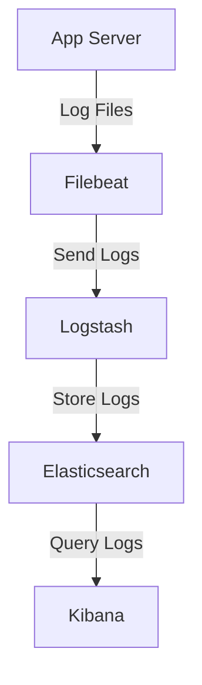

## 1. Why Do We Need Logs?

The value of logs is reflected in multiple dimensions:

| Dimension | Description |
| :--- | :--- |
| **Debug & Troubleshooting** | Record error stacks, request parameters, and execution flows to quickly reproduce and locate online issues. |
| **User Behavior Analysis** | Track user clicks and access paths to provide data for product optimization and recommendation systems. |
| **Monitoring & Risk Control** | Detect abnormal traffic and attack behaviors, working with alerting systems for timely responses. |
| **Snapshots & Root Cause Analysis** | Snapshots of crash scenes used to trace the root cause after the fact. |
| **Product Value** | Analyze user habits through logs to drive product iterations. |

Logs are not just "printing information"; they are a piece of infrastructure. Let's see how to implement logging correctly in Node.js.

---

## 2. Node.js Logging Basics

### 2.1 The Truth About console

In Node.js, `console.log` actually outputs to the standard output stream (stdout), while `console.error` outputs to the standard error stream (stderr).

#### 2.1.1 Mastering the Console API: More Than Just log

Beyond basic printing, utilizing advanced `console` APIs can greatly enhance debugging efficiency:

- **ES6 Variable Shorthand**: Use object property shorthand to print variable names and values at once.
  ```javascript
  const user = 'Max';
  const status = 'active';
  console.log({ user, status }); // Output: { user: 'Max', status: 'active' }
  ```

- **Table Display (`console.table`)**: Outputs arrays or objects in a table format, making complex data structures intuitive to view.
  ```javascript
  const users = [
    { id: 1, name: 'Alice', role: 'Admin' },
    { id: 2, name: 'Bob', role: 'User' }
  ];
  console.table(users);
  ```

- **Stack Tracing (`console.trace`)**: Prints the current call stack, helping you clarify function call chains.
  ```javascript
  function deepTask() {
    console.trace('Executed here');
  }
  deepTask();
  ```

- **Performance Timing (`console.time` / `console.timeEnd`)**: Quickly measure the execution time of code blocks.
  ```javascript
  console.time('fetch-data');
  // ... perform some async operations
  console.timeEnd('fetch-data'); // Output: fetch-data: 12.345ms
  ```

- **Hierarchical Grouping (`console.group` / `console.groupEnd`)**: Creates collapsible (in supported terminals or browsers) indented groups in the console.
  ```javascript
  console.group('User Registration Flow');
  console.info('Validating form...');
  console.info('Saving to DB...');
  console.groupEnd();
  ```

- **Deep Object Analysis (`console.dir`)**: Compared to `log`, `dir` can control display depth and colors through options, suitable for complex nested objects.
  ```javascript
  console.dir(bigObject, { depth: null, colors: true });
  ```

- **Level-based Output**:
  - `console.info()`: Outputs general information (usually consistent with `log`).
  - `console.warn()`: Outputs warning information.
  - `console.error()`: Outputs error information.

#### 2.1.2 Underlying Differences Between stdout and stderr

There are differences in the low-level implementation of these two streams...

In the command line, you can use redirection symbols to output logs to a file:

```bash
# Write stdout to app.log
node app.js > app.log

# Write stderr to error.log
node app.js 2> error.log

# Merge stdout and stderr into all.log
node app.js &> all.log
```

The pipe operator `|` can take the output of one command as the input for another, commonly used for real-time log processing.

### 2.2 Best Practices for Writing to Files

When writing logs directly to files, a common mistake for beginners is using `fs.appendFile` for frequent writes:

```javascript
import fs from 'node:fs'
fs.appendFile('app.log', 'log message\n', (err) => {
	if (err) console.error('Write failed')
})
```

Every call to `fs.appendFile` opens the file, writes data, and closes the file. Frequent operations lead to file handle leaks and performance issues. A **file handle** is an abstraction used by the OS to identify an open file; each open file occupies one handle. If not released in time, you hit the system limit, preventing new files from being opened.

A better way is to use `fs.createWriteStream` to create a writable stream, keeping the file open and using a buffer for batch writes:

```javascript
import fs from 'fs'
const logStream = fs.createWriteStream('app.log', { flags: 'a' }) // 'a' for append mode

// Write log
logStream.write('This is a log message.\n')

// Close stream before program ends
logStream.end()
```

Using streams not only improves write performance but also avoids handle leaks. Note that the `write` method returns a boolean indicating if data is fully written to the internal buffer; if it returns `false`, listen for the `'drain'` event to wait for the buffer to clear.

### 2.3 inodes and File Handles

In Linux systems, every file has a unique **inode** that stores file metadata (permissions, size, timestamps, etc.) and pointers to data blocks. When you open a file, the OS returns a file handle associated with the file's inode. Even if the file is moved or deleted, as long as the handle is not closed, the program can still read/write the original file via the handle.

Understanding inodes helps in designing log rotation strategies because when renaming log files, as long as the stream remains open, writes will continue to flow to the file corresponding to the original inode.

---

## 3. Server Application Logging Practices

In typical BFF (Backend For Frontend) or Node.js services, we need to record various types of logs.

### 3.1 Access Logs

Every client request should be logged with information including method, URL, status code, response time, and client IP. This helps monitor traffic and troubleshoot performance issues.

```javascript
app.use((req, res, next) => {
	const start = Date.now()
	res.on('finish', () => {
		const duration = Date.now() - start
		logger.info({
			type: 'access',
			method: req.method,
			url: req.originalUrl,
			status: res.statusCode,
			duration,
			ip: req.ip,
			userAgent: req.get('User-Agent'),
		})
	})
	next()
})
```

### 3.2 External Service Call Logs

When a Node.js app acts as a BFF layer calling backend services, it's necessary to log request parameters, response results, and time taken to locate issues in dependent services.

```javascript
async function callBackend(serviceUrl, params) {
	const start = Date.now()
	try {
		const response = await axios.post(serviceUrl, params)
		logger.debug({
			type: 'backend_call',
			service: serviceUrl,
			params,
			response: response.data,
			duration: Date.now() - start,
		})
		return response.data
	} catch (err) {
		logger.error({
			type: 'backend_error',
			service: serviceUrl,
			params,
			error: err.message,
			stack: err.stack,
			duration: Date.now() - start,
		})
		throw err
	}
}
```

### 3.3 Exception Capture and Logging

After capturing exceptions using `try/catch`, error logs should be recorded immediately with sufficient context (like User ID, request path, etc.).

```javascript
app.get('/api/user/:id', async (req, res) => {
	try {
		const user = await getUser(req.params.id)
		res.json(user)
	} catch (err) {
		logger.error({
			message: 'Failed to get user',
			userId: req.params.id,
			error: err.message,
			stack: err.stack,
		})
		res.status(500).send('Internal Server Error')
	}
})
```

### 3.4 Business Flow Logs

In critical business processes (like ordering, payment), record business status changes for future tracing and statistics.

```javascript
function createOrder(orderData) {
	logger.info({
		type: 'business',
		action: 'create_order',
		userId: orderData.userId,
		productId: orderData.productId,
		price: orderData.price,
	})
	// ... business logic
}
```

### 3.5 Log Levels and Formats

Commonly used log levels (from low to high):

- `debug`: Debugging info, enabled during development.
- `info`: General info, like request start/end.
- `warn`: Warnings, doesn't affect running but worth attention.
- `error`: Errors affecting some functionality.
- `fatal`: Fatal errors, process might exit.

**Structured logs** (JSON format) are recommended for easy parsing by tools like Logstash. A log entry should contain:

```json
{
	"timestamp": "2025-03-10T10:00:00.000Z",
	"level": "info",
	"service": "user-service",
	"pid": 12345,
	"hostname": "server-01",
	"message": "User logged in",
	"userId": "1001",
	"ip": "192.168.1.100"
}
```

### 3.6 Principles of Logging

- **Logging itself should not produce exceptions**: Ensure the stability of the logging library.
- **Logging should not produce side effects**: Do not modify business status just to record a log.
- **Prohibit printing sensitive information**: Like passwords, ID numbers, credit card numbers, etc. Masking is required.

---

## 4. Log Rotation and Management

As an application runs, log files will grow continuously and must be rotated. Common strategies include:

- **By Time**: Generate a new file daily, e.g., `app-2025-03-10.log`.
- **By Size**: Automatically split when the file reaches 100MB.

Rotation methods are divided into:

1. **create method**: Rename the current log file and create a new one with the same name to continue writing. Libraries like `winston` with `DailyRotateFile` use this.
2. **copytruncate method**: Copy the current log file and then empty the original. This allows rotation without restarting the process but might lose the last few lines of logs. Commonly used by the `logrotate` tool.

In Linux, you can configure rotation rules using `logrotate`:

```bash
/var/log/myapp/*.log {
    daily
    rotate 30
    compress
    delaycompress
    missingok
    notifempty
    create 0640 myapp myapp
    sharedscripts
    postrotate
        kill -USR2 `cat /var/run/myapp.pid`
    endscript
}
```

If using streams for logging, the old file is still held by the process after renaming; you need to notify the process to reopen the file (e.g., by sending a `SIGUSR2` signal).

---

## 5. Beautifying and Interacting with CLI Logs

During development or debugging, we want readable, colorful logs in the terminal. The following tools can help:

- **chalk**: Adds color and style to text.
  ```javascript
  import chalk from 'chalk'
  console.log(chalk.green('Success:'), 'Data saved')
  ```

- **progress**: Displays progress bars.
  ```javascript
  import ProgressBar from 'progress'
  const bar = new ProgressBar(':bar :percent', { total: 100 })
  const timer = setInterval(() => {
  	bar.tick()
  	if (bar.complete) clearInterval(timer)
  }, 100)
  ```

- **inquirer**: Interactive command-line prompts.
  ```javascript
  import inquirer from 'inquirer'
  inquirer
  	.prompt([{ type: 'input', name: 'username', message: 'Username:' }])
  	.then((answers) => console.log('Hello', answers.username))
  ```

- **commander.js**: Build complex command-line tools.
  ```javascript
  import { Command } from 'commander'
  const program = new Command()
  program.version('1.0.0').option('-d, --debug', 'enable debug').parse()
  ```

These tools are usually for development tools, scaffolding, or debug output and are not recommended for production use as they increase output overhead and interfere with structured logs.

---

## 6. ELK: Log Collection and Analysis Platform

When the number of servers increases and logs are scattered across machines, we need a centralized log analysis platform. **ELK** is the industry-standard solution, consisting of three components:

- **Elasticsearch**: Distributed search and analysis engine for storing logs and providing fast queries.
- **Logstash**: Data collection and processing pipeline that collects logs from various sources, filters and transforms them, then sends them to Elasticsearch.
- **Kibana**: Visualization tool for displaying log data through charts and dashboards.

### 6.1 Architecture Diagram



- **Filebeat**: Lightweight log collector that reads log files and sends them to Logstash or directly to Elasticsearch.
- **Logstash**: Performs data cleaning, such as parsing JSON, adding fields, and filtering sensitive info.
- **Elasticsearch**: Stores data and builds indexes for fast retrieval.
- **Kibana**: Provides a Web interface for searching, aggregating, and creating dashboards.

### 6.2 Node.js Application Integration

In modern Node.js apps, we usually choose **Pino** or **Winston**.

- **Pino**: The performance benchmark for 2026, with extremely low overhead and native support for structured JSON. It's the first choice for high-concurrency scenarios.
- **Winston**: Feature-rich with a mature ecosystem, suitable for complex applications requiring multiple transport channels.

```javascript
// Using Pino for high-performance logging
import pino from 'pino'
const logger = pino({
  level: 'info',
  base: { service: 'user-service' },
  timestamp: pino.stdTimeFunctions.isoTime
})

logger.info({ userId: '1001' }, 'User logged in')
```

---

## 7. Sentry: Error Monitoring Platform

While logs record errors, they are often passive: developers need to check logs actively to find problems. **Sentry** is an active error monitoring platform that captures exceptions in real-time, aggregating them, alerting, and providing rich context.

### 7.1 Key Features of Sentry

- **Error Capture**: Automatically captures unhandled exceptions and Promise rejections.
- **Contextual Info**: Records user IP, browser, OS, request parameters, etc.
- **Error Aggregation**: Merges identical errors to avoid noise.
- **Performance Monitoring**: Tracks request duration and slow queries.
- **Release Tracking**: Associates errors with code versions to quickly locate the introducing version.

### 7.2 Node.js Integration

Install `@sentry/node`:

```bash
pnpm add @sentry/node
```

Initialize at the app entry:

```javascript
import * as Sentry from '@sentry/node'
Sentry.init({
	dsn: 'https://your-dsn@sentry.io/project-id',
	environment: process.env.NODE_ENV,
	tracesSampleRate: 1.0, // Performance monitoring sample rate
})

// Manually capture errors
try {
	riskyOperation()
} catch (err) {
	Sentry.captureException(err)
}
```

---

## 8. Limitations of Logging

While logs and Sentry are extremely useful, they are not omnipotent:

- **Consume massive storage space**: Especially full logs; regular cleaning and archiving are needed.
- **Queries not flexible enough**: While log systems are strong at querying structured data, cross-service call chain tracing still requires APM (Application Performance Monitoring) tools like SkyWalking or Jaeger.
- **Cannot capture all problems**: Like memory leaks or CPU spikes, which might need metric monitoring (like Prometheus) to be discovered.
- **Missing context**: Logs often only record information for a single service; distributed tracing requires extra Trace IDs for correlation.

Therefore, a complete observability system usually includes:

- **Logs**: Record discrete events.
- **Metrics**: Aggregated numerical data, like QPS, latency, and error rate.
- **Traces**: Record the complete path of a request through a distributed system.

Combining all three provides full control over the system status.

---

## 9. Conclusion

This article covered the basics of Node.js logging, including write methods, structured formats, log rotation, CLI beautification, and integration with ELK and Sentry. I hope you can build an efficient and reliable logging system for your Node.js applications based on these best practices. Logs are not just troubleshooting tools but windows into the system's operational state.
