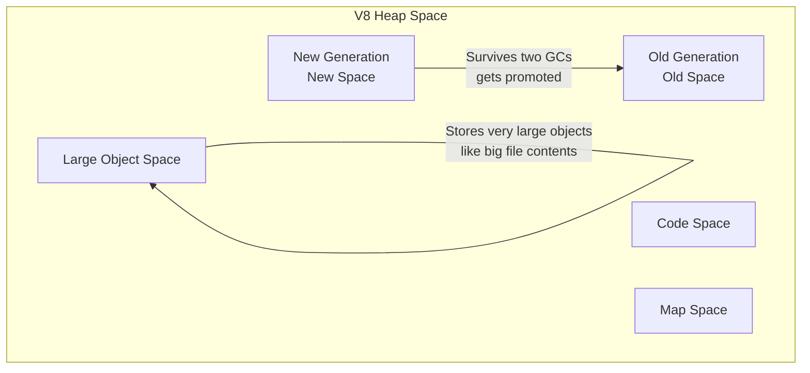
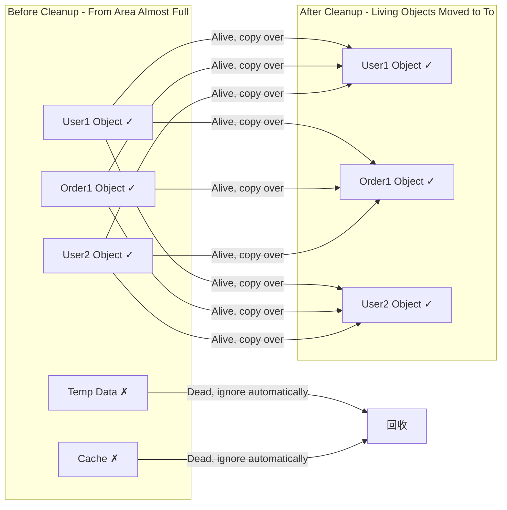
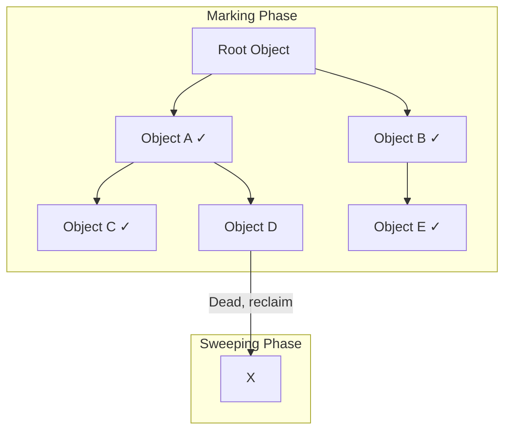
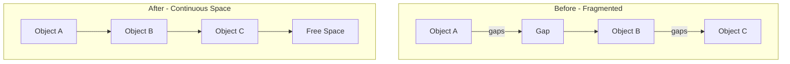

> Written for developers who want to understand what memory leaks are, how to find them, and how to fix them

Have you ever experienced this: the server gets slower and slower until it crashes? Or the memory usage keeps climbing like a balloon, and after restarting it gets better, but a few days later the same problem happens again?

That's memory leakage at work!

In this article, we'll talk about this problem that has plagued countless Node.js developers. What? You think this is something only senior engineers need to understand? No worries - I'll explain everything in plain language so you can start investigating after reading.

---

## 1. First, Understand How Memory Works: V8's "Warehouse Management"

### 1.1 What's the Relationship Between Node.js and V8?

Before talking about memory, let's clarify how Node.js works.

Think of it this way: you run a restaurant (that's Node.js), but you've hired an incredibly capable warehouse manager (that's the V8 engine). All the ingredients (data) in the restaurant are managed by this warehouse manager.

Node.js runs JavaScript based on the V8 engine, so memory management is essentially V8's responsibility.

### 1.2 Two Major Memory "Warehouses": Stack and Heap

V8 divides memory into two major areas. Understanding these is the first step to understanding memory leaks.

#### 1.2.1 The Stack: Small but Fast Temporary Storage

The stack is like a place mat on your dining table, used for small items:

- **What goes there**: Numbers, strings, booleans - these "small parts", plus "remotes" (pointers) to objects
- **Who manages it**: The operating system handles it automatically, cleaning up when function calls finish
- **Characteristics**: Super fast, but limited space - like a small table, can't hold much

```javascript
// These are stored on the stack
const name = 'John' // String (small part)
const age = 25 // Number (small part)
const isStudent = true // Boolean (small part)
const score = [98, 97, 100] // The "remote" for the array is on the stack, data is in the heap
```

#### 1.2.2 The Heap: Large but Requires Manual Management

The heap is like a big cold storage in the restaurant - large space, but needs someone to manage when to store and when to clean:

- **What goes there**: Objects, arrays, Buffers (large data), closures - these "large items"
- **Who manages it**: Needs a "garbage collector" (GC) to clean up
- **Characteristics**: Large space, but complex management - if not managed well, things pile up randomly

```javascript
// These are stored on the heap
const user = { name: 'John', age: 25 } // Large object
const scores = [98, 97, 100, 99] // Large array
const buffer = Buffer.alloc(1024 * 1024) // 1MB buffer

// Closures also occupy heap memory
function createCounter() {
  let count = 0 // This variable exists in the heap because the closure references it
  return () => ++count
}
```

### 1.3 Detailed Heap Regions: V8's "Storage System"

V8 divides the heap into several regions, each with different purposes:



| Region           | Name               | What Goes There                                              | Characteristics                      |
| ---------------- | ------------------ | ------------------------------------------------------------ | ------------------------------------ |
| **New Gen**      | New Space          | Newly created objects, like temporary variables in functions | Small space, frequent cleaning, fast |
| **Old Gen**      | Old Space          | Long-lived objects, like global caches, closures             | Large space, slower cleaning         |
| **Large Object** | Large Object Space | Objects exceeding a certain size                             | Not involved in regular GC           |
| **Code**         | Code Space         | Stores compiled machine code                                 | Generally not your concern           |
| **Map**          | Map Space          | Stores object structure information                          | Records what objects look like       |

**Quick Tip**: New Generation and Old Generation are the two most important regions - V8's garbage collection mainly revolves around them.

---

## 2. Garbage Collection: How Does V8 "Clean House"?

### 2.1 Why Do We Need Garbage Collection?

Imagine if you ran a restaurant and never cleaned the cold storage. What would happen?

- Expired ingredients pile up like mountains
- No room for fresh ingredients
- Eventually the whole cold storage is packed full

Memory works the same way! As programs run, they continuously create objects. Without cleanup, those "dead objects" (no longer needed) take up space, leaving no room for new objects.

### 2.2 Generational Collection: Making Cleanup More Efficient

V8's clever approach: instead of cleaning all memory at once, it uses different methods based on objects' "ages".

This is like a restaurant's cleaning strategy:

- **Daily**: Clean leftovers from the dining table (New Generation - fast and simple)
- **Weekly**: Clean expired items from the cold storage (Old Generation - time-consuming but can be done slowly)

#### 2.2.1 New Generation Cleanup: Scavenge Algorithm

New Generation uses a "relocation-style" cleanup called the Scavenge algorithm.

**How it works**:

1. New Generation is divided into two equal areas: From and To
2. New objects go in the From area
3. When the From area is almost full, cleanup is triggered
4. Living objects (still in use) are copied to the To area
5. Dead objects (not in use) are ignored
6. From and To swap roles



**Why this design?**

Because most objects in New Generation are "born in the morning, die by evening" - created, used briefly, then abandoned. So there are few living objects, making copying fast.

**Promotion Rules**:

- An object survives two Scavenges and is still alive → Promoted to Old Generation
- Or if To space usage exceeds 25% → Direct promotion

#### 2.2.2 Old Generation Cleanup: Mark-Sweep & Mark-Compact

Objects in Old Generation have long lifespans, so we can't use the "relocation" method which is too labor-intensive. Instead, we use the "Mark-Sweep" algorithm.

**Mark-Sweep**:

1. **Marking Phase**: Start from "root objects" and find all living objects
   - Root objects are global objects, variables on the stack - things that are "definitely still alive"
   - Mark along the reference path like mapping a route

2. **Sweeping Phase**: Traverse the entire heap and reclaim all unmarked objects



**Problem**: After sweeping, memory becomes "fragmented" - like gaps in a book with pages torn out. Large new objects can't fit in anymore.

**Mark-Compact**:

To solve this problem, V8 performs "compaction" at appropriate times:

1. Push all living objects toward one side
2. Fill all gaps in the middle
3. Clean all memory outside the boundary



**When to compact?** V8 decides based on fragmentation level - it won't compact casually (because compaction has overhead).

#### 2.2.3 Oilpan: Special Cleaner for C++ Objects (2026 New Feature)

This is Node.js 2026's new trick.

Previously, there was a headache: objects created by JavaScript code using `Buffer`, Native Addons (C++ extensions) - who managed their memory?

Now there's **Oilpan**, specifically responsible for garbage collection at the C++ level, working seamlessly with V8's main GC. "External memory leaks" that were common before have been greatly reduced.

### 2.3 Modern V8: Making GC "Pauses" History

Early V8 would "Stop the World" during GC - stop everything to clean house, causing the application to freeze like a crashed computer.

Modern V8 uses three tricks to solve this:

| Technique               | Principle                                                                  | Effect                    |
| ----------------------- | -------------------------------------------------------------------------- | ------------------------- |
| **Incremental Marking** | Break marking work into many small steps, interspersed with code execution | No long pauses needed     |
| **Concurrent Marking**  | Mark simultaneously on multiple helper threads while main thread continues | Fully utilizes multi-core |
| **Parallel GC**         | Multiple threads work in parallel during cleanup                           | Shortens pause time       |

**Result**: GC pauses dropped from "hundreds of milliseconds" to "milliseconds or even microseconds" - users can't even feel it.

---

## 3. Five Typical Memory Leak Scenarios

**Important Correction**: The original article title said "Four Typical Scenarios", but listed five! I've corrected it here.

The essence of memory leaks is: **objects that are no longer needed are still being referenced somewhere**, so the garbage collector doesn't dare clean them up.

Below are the five most common leak scenarios in Node.js, with code examples and solutions.

### 3.1 Scenario One: Closures - Node.js's Soul is Also a Leak Hotspot

Closures are the essence of Node.js programming - powerful when used well, but a major source of leaks when used poorly.

**What's the problem?**

Closures can "remember" variables from outer functions. But if the closure is held long-term and references a large object, that large object can never be reclaimed.

```javascript
// ❌ Bad example: Closure leak
import fs from 'node:fs'

function createLeakingClosure() {
  // Create a large buffer
  const hugeBuffer = Buffer.alloc(1024 * 1024 * 10) // 10MB

  // Return a closure
  return () => {
    // Closure only uses one byte of hugeBuffer
    // But the entire 10MB is held by the closure!
    console.log(hugeBuffer[0])
  }
}

// This leak variable will persist forever
const leak = createLeakingClosure()

// 10MB memory leak!
// Even though hugeBuffer is "not needed anymore", the closure still holds it
```

**Why does closure hold the entire object?**

Think of it like a photograph. If someone appears in a photo, even if you only want one person's photo, you have to save the whole picture. Closures work the same way - they reference external variables, so they keep the entire environment alive.

**Solutions**:

```javascript
// ✅ Correct example: Safe closure
function createSafeClosure() {
  let hugeBuffer = Buffer.alloc(1024 * 1024 * 10)

  return () => {
    if (!hugeBuffer) return // Already released
    console.log(hugeBuffer[0])
    hugeBuffer = null // Manually release reference!
  }
}
```

**Quick Tip**: If a large object is only needed once, consider creating it inside the closure and letting it be reclaimed naturally after use.

### 3.2 Scenario Two: EventEmitter Listeners - Accumulating "Ghosts"

Node.js's event-driven architecture relies on EventEmitter. But if you add listeners and forget to remove them, they accumulate like mountains.

**What's the problem?**

```javascript
import { EventEmitter } from 'node:events'

// Global event bus
const globalEmitter = new EventEmitter()

// Request handler
export async function handleRequest(req, res) {
  const onData = (data) => {
    console.log('Received data:', data)
  }

  // Add listener on every request
  globalEmitter.on('update', onData)

  // Request ends...
  res.end('OK')

  // ❌ Forgot to remove the listener!
  // This onData function stays attached to globalEmitter forever
}
```

**Imagine this**:

Like a restaurant where every guest arrival causes a waiter to stand by waiting for the guest to finish eating. But when guests leave, the waiters don't leave. Ten guests come, ten waiters stand around. Eventually the restaurant is full of waiters with nowhere for guests to sit.

**As requests increase**:

- 1000 requests → 1000 `onData` listeners
- Each listener is a function object
- Each function may reference request context data through closure
- Memory climbs rapidly

**Solutions**:

```javascript
// ✅ Solution 1: Remove when done
export async function handleRequest(req, res) {
  const onData = (data) => {
    console.log('Received data:', data)
  }

  globalEmitter.on('update', onData)

  // Remove when request ends or response completes
  res.on('finish', () => {
    globalEmitter.off('update', onData)
  })

  res.end('OK')
}

// ✅ Solution 2: Use once for single trigger
globalEmitter.once('update', (data) => {
  console.log('Received data:', data)
})

// ✅ Solution 3: Use AbortController for unified management (recommended)
const controller = new AbortController()

emitter.on(
  'data',
  (data) => console.log(data),
  { signal: controller.signal }, // Bound to signal
)

res.on('finish', () => {
  controller.abort() // Clean up all related listeners in one line
})
```

### 3.3 Scenario Three: Timers - The Never-Ending "Loop"

`setInterval` is a classic source of leaks because it runs continuously unless you actively stop it.

**What's the problem?**

```javascript
// ❌ Bad example: Timer leak
function startTask(data) {
  // Create timer that sends status every second
  const timer = setInterval(() => {
    // data will always be referenced by the timer
    process.send(data.status)
  }, 1000)

  // ❌ If there's no corresponding clearInterval, timer never stops
}

// If startTask is called 100 times
startTask({ status: 'Task 1' })
startTask({ status: 'Task 2' })
// ...
startTask({ status: 'Task 100' })

// Now you have 100 timers running simultaneously!
// Each timer references its corresponding data
// These data objects can never be reclaimed
```

**Imagine this**:

Like booking 100 couriers who deliver packages every hour. But you don't need that many packages anymore, yet you forget to cancel. Couriers keep showing up every hour, wasting your time and resources.

**Solutions**:

```javascript
// ✅ Solution 1: Save timer ID, clear when needed
const activeTimers = new Map()

function startTask(taskId, data) {
  const timer = setInterval(() => {
    process.send({ taskId, status: data.status })
  }, 1000)

  activeTimers.set(taskId, timer)
  return timer
}

function stopTask(taskId) {
  const timer = activeTimers.get(taskId)
  if (timer) {
    clearInterval(timer)
    activeTimers.delete(taskId)
  }
}

// ✅ Solution 2: Use recursive setTimeout for more flexibility
async function safeRepeatTask(data) {
  await processData(data)

  // Recursive setTimeout with condition check
  if (shouldContinue(data)) {
    setTimeout(() => safeRepeatTask(data), 1000)
  }
}

// ✅ Solution 3: Use AbortController
const controller = new AbortController()

setInterval(
  () => {
    process.send(data.status)
  },
  1000,
  { signal: controller.signal },
)

// When you need to stop
controller.abort()
```

### 3.4 Scenario Four: Streams - Doors Left Open

Streams are Node.js's powerful tool for handling large files. But if not handled properly, underlying file descriptors and buffers can leak.

**What's the problem?**

```javascript
import fs from 'node:fs'

// ❌ Bad example: Stream leak
function processFile(filePath) {
  const stream = fs.createReadStream(filePath)

  stream.on('data', (chunk) => {
    // Process data...
    processChunk(chunk)
  })

  // ❌ If an error occurs mid-process or flow is interrupted
  // error/close events might not fire
  // Stream stays open, file descriptor not released

  // Worse: internal buffers may still occupy memory
}

// Like calling this
processFile('huge-file-1.bin')
processFile('huge-file-2.bin')
// Processing fails but streams don't close...
// 10 large file streams all open...
```

**Imagine this**:

Like opening many doors to grab things, but halfway through发现不对，又去开别的门。门越开越多，但你忘了关前面的。最后整栋楼都是开着的门，既不安全也浪费资源。

**Solutions**:

```javascript
// ✅ Correct example: Complete stream handling
import fs from 'node:fs'

async function processFileSafely(filePath) {
  const stream = fs.createReadStream(filePath)

  try {
    for await (const chunk of stream) {
      await processChunk(chunk)
    }
    // Automatically reaches here on normal completion
  } catch (error) {
    console.error('File processing failed:', filePath, error)
    // Actively destroy stream on error
    stream.destroy()
  }
}

// ✅ Or use pipeline for automatic management
import { pipeline } from 'node:stream/promises'
import { createGzip } from 'node:zlib'

async function compressFile(input, output) {
  try {
    await pipeline(fs.createReadStream(input), createGzip(), fs.createWriteStream(output))
    console.log('Compression complete:', input)
  } catch (error) {
    console.error('Compression failed:', error)
    // pipeline automatically closes all streams
  }
}

// ✅ Or use AbortController
const controller = new AbortController()

const stream = Readable.from([1, 2, 3], { signal: controller.signal })

// When cleaning up
controller.abort()
```

### 3.5 Scenario Five: SSR Singleton Trap - The "Time Bomb" on the Server

**This is the most easily overlooked and most dangerous type of leak from the original article!**

In SSR (Server-Side Rendering) frameworks like Next.js and Nuxt.js, singleton patterns are the most problematic.

**What's the problem?**

```javascript
// ❌ Bad example: lib/auth.js - Singleton cache leak
const userCache = new Map() // Module-level definition, persists across requests

export async function getUserData(userId) {
  if (userCache.has(userId)) {
    return userCache.get(userId)
  }

  const data = await fetchUserData(userId)
  userCache.set(userId, data) // Problem here!
  return data
}
```

**Why is this a "time bomb"?**

Node.js processes run continuously after startup, unlike browsers where refreshing clears everything. This `userCache` persists across all user requests:

- First user visits → 1 item added to cache
- Ten-thousandth user visits → 10,000 items in cache
- Nobody cleans up, only additions, never deletions
- Eventually memory explodes, OOM crash

**Imagine this**:

Like a restaurant cold storage with no cleaning system. Every customer brings leftover food to store. First day is fine. After a week, the cold storage is full. After a month, leftovers are rotting.

**Solutions**:

```javascript
// ✅ Solution 1: Use LRU cache with capacity limit
import { LRUCache } from 'lru-cache'

// Max 500 items, auto-cleanup of oldest when exceeded
// Each item expires after 10 minutes
const userCache = new LRUCache({
  max: 500, // Max 500 items
  ttl: 1000 * 60 * 10, // 10 minute expiration
})

export async function getUserData(userId) {
  if (userCache.has(userId)) {
    return userCache.get(userId)
  }

  const data = await fetchUserData(userId)
  userCache.set(userId, data)
  return data
}

// ✅ Solution 2: Simple Map with TTL
const userCacheWithTTL = new Map()

export async function getUserDataWithTTL(userId) {
  const cached = userCacheWithTTL.get(userId)

  // Check if expired
  if (cached && Date.now() - cached.timestamp < 10 * 60 * 1000) {
    return cached.data
  }

  const data = await fetchUserData(userId)
  userCacheWithTTL.set(userId, {
    data,
    timestamp: Date.now(),
  })

  return data
}

// ✅ Solution 3: Use external cache like Redis (recommended for production)
import { createClient } from 'redis'

const redis = createClient()

export async function getUserDataFromRedis(userId) {
  const cached = await redis.get(`user:${userId}`)
  if (cached) {
    return JSON.parse(cached)
  }

  const data = await fetchUserData(userId)
  await redis.setEx(`user:${userId}`, 600, JSON.stringify(data)) // 10 min expiration
  return data
}
```

**Quick Tip**: In SSR environments, **never ever** store user-related data at module level. All data should either be used immediately or have explicit cleanup mechanisms.

---

## 4. 2026 Modern Defense Strategies: Letting Code Manage Itself

Modern Node.js provides powerful tools for managing resource lifecycles, reducing the "forgot to cleanup" problem.

### 4.1 AbortController: The "Master Key" for Unified Destruction Signals

`AbortController` was originally designed for canceling Fetch requests, but its uses have expanded greatly.

**What can it do?**

- Cancel EventEmitter listeners
- Cancel timers
- Cancel Streams
- Cancel Fetch requests
- Any async operation that supports AbortSignal

**One-line summary**: Think of it like a "main switch" - when pressed, all related async operations automatically stop and clean up.

```javascript
import { EventEmitter } from 'node:events'
import { setTimeout } from 'node:timers/promises'
import { Readable } from 'node:stream'

// Create a controller
const controller = new AbortController()
const { signal } = controller

// Use case 1: Control EventEmitter listeners
const emitter = new EventEmitter()

emitter.on(
  'data',
  (data) => {
    console.log('Data received:', data)
  },
  { signal }, // Key: bound to signal
)

// Use case 2: Control timers
setTimeout(5000, 'Time is up!', { signal })
  .then(console.log)
  .catch((err) => {
    if (err.name === 'AbortError') {
      console.log('Timer cancelled')
    }
  })

// Use case 3: Control Streams
const stream = Readable.from([1, 2, 3, 4, 5], { signal })

// When you need to cleanup, one line handles everything!
// For example, when request ends:
res.on('finish', () => {
  controller.abort() // All resources bound to this signal auto-cleanup
})
```

**Why use AbortController?**

| Traditional Way                  | AbortController           |
| -------------------------------- | ------------------------- |
| Listeners: Use `off()` to remove | Auto cleanup              |
| Timers: Use `clearInterval()`    | Auto cleanup              |
| Streams: Use `destroy()`         | Auto cleanup              |
| Need to remember many APIs       | One `abort()` handles all |
| Easy to miss                     | Hard to miss              |

### 4.2 FinalizationRegistry: The "Early Warning Radar" for Leaks

This API can't prevent leaks, but it can **help you discover them**.

**What is it?**

When you register an object with a FinalizationRegistry, you'll get notified if that object is garbage collected.

```javascript
// Create warning registry
const registry = new FinalizationRegistry((heldValue) => {
  console.warn(`🔔 Alert: Object "${heldValue}" has been GC'd`)
})

function createSession(userId) {
  const session = {
    id: Math.random().toString(36).slice(2),
    userId,
    data: Buffer.alloc(1024 * 1024), // Simulate 1MB usage
  }

  // Register for monitoring
  // When session is GC'd, callback fires
  registry.register(session, `Session_${session.id}`)

  return session
}

// Simulate usage
console.log('Creating session...')
let session1 = createSession('User A')

// Release reference
session1 = null

console.log('Released session1 reference, waiting for GC...')
// If normal, you should see an alert here
// If you wait a long time with no alert, memory is leaking!
```

**Use cases**:

1. During debugging, confirm objects are properly reclaimed
2. Monitor key objects' (Session, Connection) lifecycles
3. Discover potential leak points

**Caveats**:

- Callback timing is uncertain - could fire long after object is collected
- Not guaranteed to fire at all (e.g., before process exit)
- Primarily for debugging - shouldn't rely on it for critical logic

---

## 5. Detection and Debugging: Becoming a Memory "Sherlock"

Now you understand what memory leaks are and how they happen. Next: how to find them?

### 5.1 Heap Snapshot Analysis: The Most Intuitive Weapon

A heap snapshot is a "photo" of memory, showing all objects at a specific moment.

**Generating a snapshot**:

```bash
# Enable debug port at startup
node --inspect app.js
```

Then:

1. Open Chrome browser
2. Enter `chrome://inspect` in the address bar
3. Click "Open dedicated DevTools for Node"
4. Switch to the **Memory** tab
5. Click "Take Snapshot"

**Analyzing snapshots**:

| Metric            | Meaning                                     | How to Read                                                 |
| ----------------- | ------------------------------------------- | ----------------------------------------------------------- |
| **Shallow Size**  | Object's own size                           | Memory directly occupied by the object                      |
| **Retained Size** | Object + all referenced objects' total size | How much memory would be freed if this object was reclaimed |
| **Distance**      | Distance to root object                     | Smaller numbers mean more "rooted"                          |

**Most useful technique: Compare snapshots**

1. Take snapshot 1 (fresh start, clean memory)
2. Run for a while (simulate user operations)
3. Take another snapshot
4. Select "Comparison" view
5. Look for object types with growing counts

**Typical leak indicators**:

- `(closure)` count keeps growing → Closure leak
- `EventListener` count keeps growing → Listener leak
- `Buffer` count keeps growing → Buffer leak
- `Timeout` / `Immediate` growing → Timer leak

### 5.2 Monitor Memory Metrics: Let the Data Speak

**Using `process.memoryUsage()`**:

```javascript
// Print memory usage regularly
setInterval(() => {
  const mem = process.memoryUsage()

  console.log({
    heapUsed: `${Math.round(mem.heapUsed / 1024 / 1024)}MB`, // Heap used
    heapTotal: `${Math.round(mem.heapTotal / 1024 / 1024)}MB`, // Heap total
    rss: `${Math.round(mem.rss / 1024 / 1024)}MB`, // Process total memory
    external: `${Math.round(mem.external / 1024 / 1024)}MB`, // C++ object memory
  })
}, 10000)
```

**How to determine if there's a leak?**

- `heapUsed` continuously rises, never drops → Probably leaking
- After manually triggering GC, `heapUsed` is still high → Confirmed leak

### 5.3 Manually Trigger GC: Confirming True Leaks

```bash
# Expose GC functionality at startup
node --expose-gc app.js
```

```javascript
// Trigger GC in code
if (global.gc) {
  console.log('Memory before manual GC:', process.memoryUsage().heapUsed)
  global.gc() // Force full GC
  console.log('Memory after manual GC:', process.memoryUsage().heapUsed)
} else {
  console.warn('GC not exposed, start with --expose-gc')
}
```

**Judgment method**:

- GC causes `heapUsed` to drop significantly → Previous growth was "reclaimable objects", not a leak
- GC causes `heapUsed` to barely change → Confirmed real leak

### 5.4 node --report: The "Black Box" for Production

You can't pause production to generate snapshots. But you can use **Diagnostic Report**.

**Enable report**:

```bash
# Enable report generation
node \
    --report-on-fatalerror \
    --report-on-signal \
    --report-signal=SIGUSR2 \
    app.js
```

**Manually trigger report**:

```bash
# Find process ID
ps aux | grep node

# Send signal to trigger report
kill -USR2 <pid>
```

**Report includes**:

- Heap memory distribution (by type)
- Resource limits
- Call stacks (JavaScript and C++)
- All `libuv` handles (helps find unclosed Sockets, timers)
- System information

**What's the point?**

On OOM crash, the report generates automatically. You can see where memory was going before the crash - no need to reproduce the issue, evidence is saved automatically.

### 5.5 Third-Party Tools: Making Analysis Simpler

| Tool              | Purpose                       | Features                                                                 |
| ----------------- | ----------------------------- | ------------------------------------------------------------------------ |
| **clinic.js**     | Performance diagnostics suite | Has doctor (diagnose), flame (flame graphs), bubbleprof (async analysis) |
| **heapdump**      | Generate heap snapshots       | Runtime generation via signals, convenient                               |
| **memwatch-next** | Memory monitoring             | Auto-detects leaks and alerts                                            |

**clinic.js Flame Graph Example**:

```bash
# Install
npm install -g clinic

# Use
clinic doctor -- node app.js

# Run for a while then Ctrl+C
# Automatically opens visual report
```

---

## 6. Optimization Recommendations Summary

### 6.1 Core Principles

1. **Prefer WeakMap/WeakSet**
   Weak references don't prevent GC - perfect for object caching

```javascript
// ✅ Good: No manual cleanup needed
const cache = new WeakMap()

function processObject(obj) {
  if (!cache.has(obj)) {
    cache.set(obj, expensiveOperation(obj))
  }
  return cache.get(obj)
}
// When obj is no longer referenced elsewhere, cache auto-clears

// ❌ Not suitable: Scenarios needing long-term caching
// WeakMap keys can't be primitives
```

2. **Avoid Global Variables**
   Globals go to Old Generation - avoid unless necessary

```javascript
// ❌ Bad: Hard to clean up
global.userCache = new Map()

// ✅ Good: Dispose after use
function getUserData(userId) {
  const cache = new Map() // Function-local variable
  // ...
} // Function ends, cache auto-cleans
```

3. **Stream Process Large Files**
   Stop using `fs.readFile` for big files

```javascript
// ❌ Bad: Loads everything at once, might OOM
const data = fs.readFileSync('huge-file.bin')

// ✅ Good: Stream processing, stable memory usage
const stream = fs.createReadStream('huge-file.bin')
stream.pipe(process.stdout)
```

4. **Use AbortController for Unified Resource Management**

```javascript
// All async operations use the same signal
const controller = new AbortController()

emitter.on('data', handler, { signal: controller.signal })
setTimeout(fn, 1000, { signal: controller.signal })
fetch(url, { signal: controller.signal })

// One-click cleanup
controller.abort()
```

5. **Set Cache Limits and Expiration**

```javascript
import { LRUCache } from 'lru-cache'

const cache = new LRUCache({
  max: 1000, // Max 1000 items
  ttl: 1000 * 60 * 5, // 5 minute expiration
  maxSize: 1000 * 1024 * 1024, // Max 1GB
})
```

6. **Long-term Load Testing to Observe Memory Curves**

Use `k6` or `Artillery` for extended stress testing:

```yaml
# k6 config example
script: test.js
duration: '4h'
vus: 100
```

**Healthy curve**:

```
Memory
  ↑
  │    ↗ ↘ ↗ ↘  (GC periodic cleanup)
  │ ↗       ↘
  │        ↗   ↘  (Normal operation)
  └──────────────────→ Time
```

**Leak curve** (monotonic increase):

```
Memory
  ↑
  │\
  │ \
  │  \
  │   \
  └──────→ Time
```

7. **Deploy Monitoring and Alerts**

Use Prometheus + Grafana to monitor `nodejs_heap_used_bytes`, set alerts:

- Continuous 15-minute increase exceeding 20% → Alert
- Approaching container memory limit 80% → Alert

---

## 7. Common Questions FAQ

**Q: What's the difference between memory leak and memory overflow?**

A:

- **Memory leak**: Objects that should be reclaimed aren't, memory gradually decreases (like a leaking bucket)
- **Memory overflow**: Can't allocate the memory you want (OOM)

Leak is a common cause of overflow, but not the only one.

**Q: What's Node.js's default heap memory size?**

A: Default is about 1.5GB on 64-bit systems, 0.7GB on 32-bit. Adjustable via `--max-old-space-size`:

```bash
node --max-old-space-size=4096 app.js  # Set to 4GB
```

**Q: How to prevent memory leaks in production?**

A:

1. Code level: Use AbortController, LRU caches, etc.
2. Monitoring level: Deploy Prometheus monitoring + alerts
3. Testing level: Long-duration stress testing to observe memory curves
4. Operations level: Set container memory limits + periodic restarts

**Q: During debugging, `heapUsed` is high, but drops after GC - is this a leak?**

A: No! This is normal memory fluctuation. As long as it drops after GC, objects are being properly reclaimed.

**Q: FinalizationRegistry callback didn't fire - is this a leak?**

A: Not necessarily. FinalizationRegistry doesn't guarantee callback will fire. Maybe GC hasn't run yet, or process exited before the callback could trigger.

---

Memory leaks are like kitchen grease - invisible and intangible, but they accumulate until the whole kitchen can't function. Good coding habits + regular monitoring = healthy Node.js applications.

When problems occur, don't panic. Follow the investigation steps above, and memory leaks can definitely be found and fixed!
