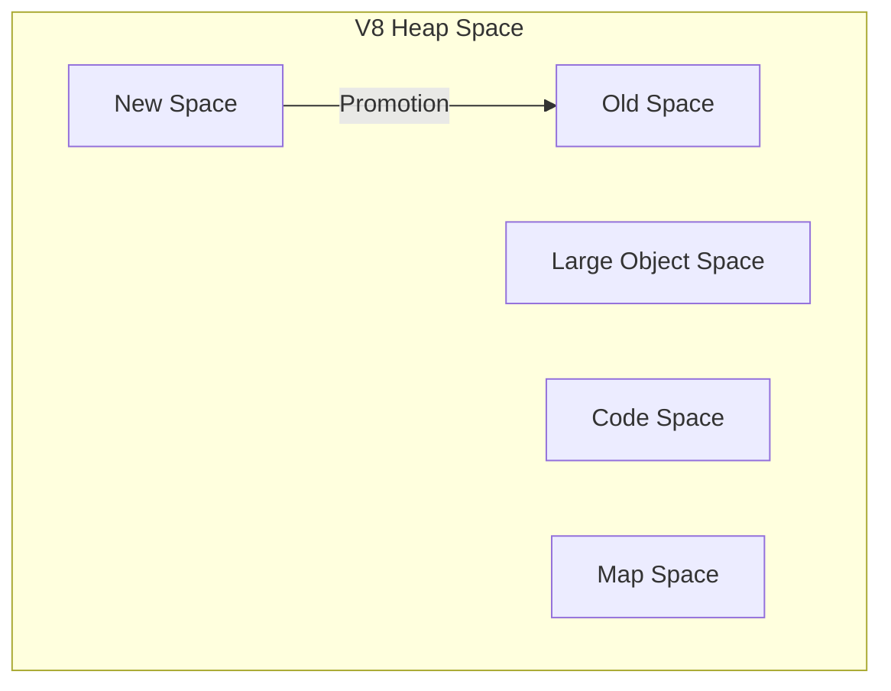
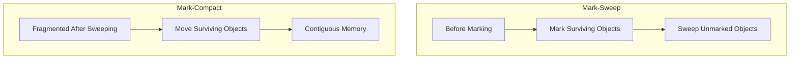

## 1. V8 Memory Model: The Tug-of-War Between Stack and Heap

Node.js is built on the V8 engine, and its memory management inherits V8's generational garbage collection strategy. Understanding the V8 memory layout is a prerequisite for troubleshooting memory leaks.

### 1.1 Stack vs. Heap

- **Stack**: Stores primitive types (Number, String, Boolean, etc.) and pointers to objects. It's automatically managed by the OS, released immediately when a function call ends, and offers extremely fast read/write speeds but limited space.
- **Heap**: Stores complex reference types (Object, Array, Buffer, Closure, etc.). This is the primary battlefield for Garbage Collection (GC). It offers large space but requires GC to reclaim memory that is no longer in use.

V8 further divides the heap into several spaces, the core ones being **New Space** and **Old Space**.



### 1.2 Core Garbage Collection Algorithms

V8 employs a generational collection strategy, using different algorithms for objects with different lifecycles to balance throughput and latency.

#### 1.2.1 New Space (Scavenge Algorithm)

New Space stores short-lived objects (e.g., function local variables). It's divided into two equal-sized semi-spaces: From and To.

- **Allocation**: New objects are always allocated in the From space.
- **Collection**: Triggered when From space is nearly full.
  - Using the **Cheney Algorithm** (breadth-first copy), surviving objects in From are copied to To.
  - Pointers are adjusted during copying to maintain reference relationships.
  - After copying, From and To swap roles.
- **Promotion**: Objects that survive multiple Scavenge cycles or when To space exceeds 25% occupancy are moved to Old Space.

**Characteristics**: Fast (only copies survivors, which are usually a small percentage), but space utilization is only 50%.

#### 1.2.2 Old Space (Mark-Sweep & Mark-Compact)

Old Space stores long-lived objects promoted from New Space (e.g., caches, global objects, closures). Since Old Space is larger and copying is inefficient, V8 uses **Mark-Sweep** and **Mark-Compact** algorithms.

- **Mark-Sweep**:
  1. **Marking**: Starting from root objects (globals, stack variables), it recursively traverses all reachable objects and marks them.
  2. **Sweeping**: Traverses the heap, reclaims unmarked objects, and clears marks.
  - Drawback: Leads to memory fragmentation, potentially hindering large object allocation.
- **Mark-Compact**:
  - After marking, surviving objects are moved to one end of the heap, and memory beyond the boundary is cleared. This solves fragmentation but has higher overhead due to object movement. V8 decides when to compact based on fragmentation levels.



#### 1.2.3 Oilpan: GC for C++ Objects

Node.js in 2026 deeply integrates **Oilpan**—V8's specialized garbage collector for C++ objects. It handles complex objects allocated in the C++ layer but referenced through JavaScript (like the underlying memory of `Buffer` or objects created by Native Addons). Oilpan works in tandem with V8's main GC to ensure External Memory is accurately reclaimed, reducing common "external memory leak" issues.

#### 1.2.4 Modern V8 Evolution: Concurrent and Incremental

Early V8 paused all JavaScript execution during GC ("Stop-the-world"), causing application stutters. Modern V8 significantly reduces pauses through:

- **Incremental Marking**: Breaks marking work into small steps, interleaved with JavaScript execution.
- **Concurrent Marking**: Performs marking on multiple background threads without blocking the main thread.
- **Parallel GC**: Multiple threads handle sweeping in parallel.

These optimizations have reduced GC pause times from hundreds of milliseconds to mere milliseconds or even microseconds, critical for high-real-time applications like gaming and real-time communication.

---

## 2. Four Typical Memory Leak Scenarios

The essence of a memory leak is that **objects no longer needed are still referenced**, preventing GC reclamation. Here are the most common scenarios in Node.js.

### 2.1 Hidden Closure Leaks

Closures are the soul of Node.js but also a frequent source of leaks. When a closure references a large outer object and the closure itself is held long-term, the large object can never be reclaimed.

```javascript
// Leaking closure example
import fs from 'node:fs'

function createLeakingClosure() {
	const hugeBuffer = Buffer.alloc(1024 * 1024 * 10) // 10MB
	return () => {
		// Even if only a small part is used, the entire Buffer is trapped in the closure
		console.log(hugeBuffer[0])
	}
}

const leak = createLeakingClosure()
// hugeBuffer cannot be reclaimed because 'leak' holds a reference to it
```

**Solution**: Ensure closures only reference necessary objects or set references to `null` after use.

### 2.2 Forgotten EventEmitter Listeners

`EventEmitter` is fundamental to Node.js's asynchronous architecture. If you continuously bind listeners to global objects within request handlers without unbinding them, the listeners will persistently hold references to their context.

```javascript
import { EventEmitter } from 'node:events'
const globalEmitter = new EventEmitter()

export async function handleRequest(req, res) {
	const onData = (data) => {
		console.log('Received data')
	}

	globalEmitter.on('update', onData)

	// !!! Forgot to remove listener at the end of the request
	res.end('OK')
}
```

**Solution**: Always remove listeners at appropriate times (e.g., end of request) or use the `once` method.

### 2.3 Ghost Timers

Uncleared `setInterval` or `setTimeout` calls hold references within their callbacks, preventing the associated context from being released.

```javascript
function startTask(data) {
	// Even if 'data' is no longer needed, it stays in the heap as long as the timer runs
	const timer = setInterval(() => {
		process.send(data.status)
	}, 1000)

	// Must have corresponding clearInterval(timer) logic
}
```

**Solution**: Always save timer IDs and clear them when no longer needed.

### 2.4 Unclosed Resource Streams

In high-concurrency file or network operations, if streams do not correctly trigger `close` or `end`, underlying file descriptors and buffers will remain in memory.

**Solution**: Ensure streams are destroyed and resources released, especially when errors occur. Listen for `error` events and call `stream.destroy()`.

### 2.5 The "Singleton Trap" in SSR Environments

In SSR frameworks like Next.js, **singletons are a major source of leaks**. Since the Node.js process is long-running, global variables or singletons defined at the module level (e.g., `const cache = new Map()`) will be **shared across all user requests**.

```javascript
// lib/auth.js (Singleton leak example)
const userCache = new Map() // Persists across requests

export async function getUserData(userId) {
	if (userCache.has(userId)) return userCache.get(userId)

	const data = await fetchUserData(userId)
	userCache.set(userId, data) // !!! Leak: cache grows indefinitely with user volume
	return data
}
```

**Defensive Advice**: Strictly avoid storing request-specific data in the global scope in SSR. If caching is necessary, always use **TTL (Time To Live)** or **LRU (Least Recently Used)** strategies to limit capacity.

---

## 3. 2026 Modern Defensive Strategies

As Node.js evolves, the standard library provides more powerful tools to manage resource lifecycles.

### 3.1 AbortController: Unified Disposal Signal

Originally for aborting Fetch requests, `AbortController` now supports `EventEmitter`, streams, timers, etc. It provides a unified mechanism to cancel multiple async operations simultaneously.

```javascript
const controller = new AbortController()
const { signal } = controller

const emitter = new EventEmitter()
emitter.on('data', (data) => console.log(data), { signal })

// Clean up all resources bound to this signal with one call
controller.abort()
```

### 3.2 FinalizationRegistry: An "Automatic Warning System" for Leaks

`FinalizationRegistry` allows you to register a callback that triggers when an object is garbage collected. It's excellent for monitoring if critical objects are being reclaimed correctly.

```javascript
const registry = new FinalizationRegistry((heldValue) => {
	console.warn(`[GC Alert]: Object "${heldValue}" reclaimed`)
})

function createSession(user) {
	const session = { id: Math.random(), user }
	registry.register(session, `Session_${session.id}`)
	return session
}
```

---

## 4. Detection and Debugging in Practice

### 4.1 Heap Snapshot Analysis

Comparing snapshots from two different points in time is the most direct way to identify growing object counts.

**Generate Snapshot**: Use `node --inspect` and connect via Chrome DevTools (`chrome://inspect`).

**Key Metrics**:
- **Shallow Size**: Memory occupied by the object itself.
- **Retained Size**: Memory that would be freed if the object were reclaimed (includes referenced children).

### 4.2 Production Diagnostics

#### 4.2.1 Using `process.memoryUsage()`
Returns an object with `rss` (physical memory), `heapTotal`, `heapUsed`, and `external` (C++ memory managed by V8).

#### 4.2.2 Manual GC with `node --expose-gc`
In debug environments, expose `global.gc()` to manually trigger a full GC and check if memory is truly reclaimable.

### 4.3 Powerful Weapon: `node --report`
For production OOMs, Node.js's built-in **Diagnostic Report** is more elegant than snapshots. It generates a JSON report upon fatal errors or specific signals (`SIGUSR2`) without freezing the process.

---

## 5. Optimization Summary

1. **Prefer WeakMap/WeakSet**: References are "weak" and don't prevent GC. Ideal for caches.
2. **Avoid Global Variables**: Global scope objects are permanent residents of Old Space.
3. **Stream Large Data**: Never use `fs.readFile` for large files; always prefer `fs.createReadStream`.
4. **Automate Cleanup**: Use `AbortController` to coordinate the lifecycle of async resources.
5. **Set Cache Limits**: Always implement size limits and TTLs for memory-based caches.
6. **Regular Load Testing**: Use tools like `k6` to observe if memory trends remain stable over time.
7. **Monitoring & Alerting**: Deploy memory monitoring (e.g., Prometheus + Grafana) with sensible alert thresholds.
