> A practical security handbook for developers, so you'll never fear getting hacked again

Have you ever wondered: why do some websites get "account stolen"? Why can someone else place orders using your account? Why do certain websites crash during promotions?

These problems usually stem from security vulnerabilities. In this article, I'll explain the most common security issues in Node.js development in plain language, along with how to protect against them. The article includes numerous diagrams and code examples, designed to be understandable even for beginners.

---

## Introduction: Why Does Security Matter?

After years of web development, I've seen countless security disasters:

- A social media platform leaked user data; tens of millions of accounts were sold
- An e-commerce site was hit with massive coupon abuse, losing millions of dollars
- A company's database was breached; all user passwords were exposed

These aren't horror stories—they're real events that happened. As one of the mainstream backend technologies, Node.js security directly determines whether your application can hold the line.

Many beginners think "who would attack my small website?" But the truth is, hackers use automated scanners that run 24/7, sweeping the entire internet for vulnerabilities. The moment your site goes live, it's already being watched by countless bots.

So security isn't "something only big companies need to worry about"—it's a fundamental skill every developer must master.

Below, I'll walk through the most common vulnerabilities, explaining the attack mechanisms, visual diagrams, and code solutions for each one.

---

## I. CSRF: The Trap That Makes Others Act on Your Behalf

### 1.1 What is CSRF?

CSRF stands for Cross-Site Request Forgery. The nasty thing about this vulnerability is that attackers don't need to know your password or hack into your account—they just need to trick you into clicking a link, and you'll unknowingly perform actions for the attacker.

Here's an example: you're logged into your banking website preparing to make a transfer. An attacker sends you an email with a link. You click it out of curiosity, only to find you've inexplicably transferred money to a stranger. That's a CSRF attack.

### 1.2 How Does the Attack Work?

Let's understand the entire attack flow with a diagram:

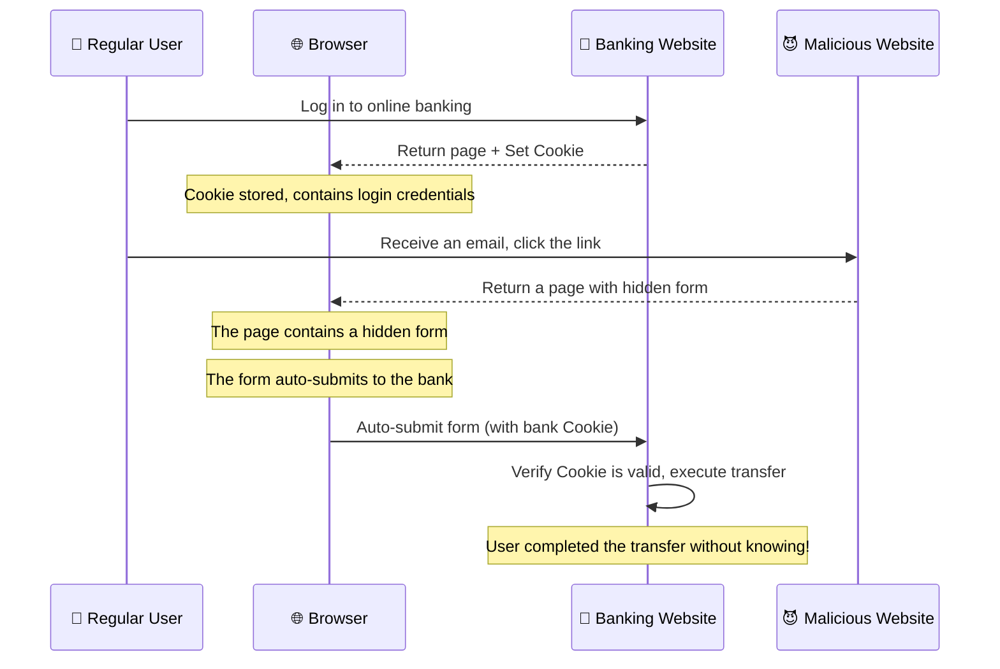

The sneakiest part is that the browser automatically includes cookies for the target website, regardless of whether the form came from that site. So when the bank sees a request with a valid cookie, it assumes this is the user's own action.

### 1.3 Real-World Scenario

Imagine this scenario:

1. You're logged into a shopping website
2. An attacker sends you an email with a link: "Congratulations! You won a $100 coupon, click to claim"
3. You open the link and see "Coupon expired"
4. But actually, the attacker's page contains a hidden form that auto-submits the moment you open the page, changing your shipping address to the attacker's address
5. All your subsequent orders get shipped to the attacker

Scary, right? Throughout this process, you're completely unaware because you're looking at the "coupon expired" page, with no idea what's happening behind the scenes.

### 1.4 How to Protect?

**Method 1: SameSite Cookie**

This is a browser-provided protection mechanism. Simply add the `SameSite` attribute when setting cookies, and the browser won't include them in cross-site requests.

```javascript
// Secure cookie configuration
res.cookie('session', userSessionId, {
	httpOnly: true, // Prevent JavaScript from reading, blocks XSS cookie theft
	secure: true, // Only transmit over HTTPS, prevents man-in-the-middle
	sameSite: 'strict', // Completely block cross-site携带, most strict
	// Or use 'lax' to allow cross-site for GET requests (better UX but slightly less secure)
})
```

`SameSite` has three options:

- `Strict`: Most strict, no cross-site requests carry this cookie, not even links
- `Lax`: More permissive, GET request links carry the cookie, but POST forms don't
- `None`: No restrictions, but must be used with `secure` (HTTPS)

**Method 2: CSRF Token**

Add a randomly generated token to the form. The backend verifies this token before processing the request.

```javascript
// Server: Generate Token
app.get('/transfer', (req, res) => {
	// Generate a secure random token
	const csrfToken = crypto.randomBytes(32).toString('hex')

	// Store in session or Redis
	req.session.csrfToken = csrfToken

	// Render the form with the token in a hidden field
	res.render('transfer', { csrfToken })
})
```

```html
<!-- Frontend: Form includes the Token -->
<form action="/transfer" method="POST">
	<input type="hidden" name="csrfToken" value="{{csrfToken}}" />
	<input type="text" name="amount" placeholder="Transfer amount" />
	<button type="submit">Transfer</button>
</form>
```

```javascript
// Server: Verify Token
app.post('/transfer', (req, res) => {
	// Get token from form
	const submittedToken = req.body.csrfToken

	// Compare with token stored in session
	if (submittedToken !== req.session.csrfToken) {
		return res.status(403).json({ error: 'CSRF verification failed' })
	}

	// Token verified, continue with business logic
	// ...
})
```

**Method 3: Double Submit Cookie**

Instead of storing tokens server-side, have frontend JavaScript read the cookie value and put it in a header. The backend verifies consistency between the cookie and header.

```javascript
// Middleware: Verify double submit
const csrfProtection = (req, res, next) => {
	const cookieToken = req.cookies['csrf-token']
	const headerToken = req.headers['x-csrf-token']

	if (!cookieToken || !headerToken || cookieToken !== headerToken) {
		return res.status(403).json({ error: 'CSRF verification failed' })
	}
	next()
}

// Frontend: Set Header when sending requests
fetch('/api/transfer', {
	method: 'POST',
	headers: {
		'Content-Type': 'application/json',
		'x-csrf-token': document.cookie.match(/csrf-token=([^;]+)/)?.[1],
	},
	body: JSON.stringify({ amount: 100 }),
})
```

### 1.5 Which Solution is Best?

Modern web development recommends using multiple layers:

1. **SameSite Cookie**: Browser-provided protection, sufficient for most cases
2. **CSRF Token**: Essential for sensitive operations like transfers and password changes
3. **Framework Built-in Protection**: If using Next.js, Laravel, etc., many already include CSRF protection

Don't rely entirely on one solution—defense in depth is the way to go.

---

## II. XSS: The Hidden Time Bomb in Your Pages

### 2.1 What is XSS?

XSS stands for Cross-Site Scripting. The key is "scripting"—attackers find ways to inject malicious JavaScript code into your pages.

The scary thing about this vulnerability is that the malicious script runs in your own browser, can access your cookies, localStorage, and can even impersonate you on the website.

### 2.2 What Types of XSS Are There?

There are three main types of XSS, each with different attack methods:

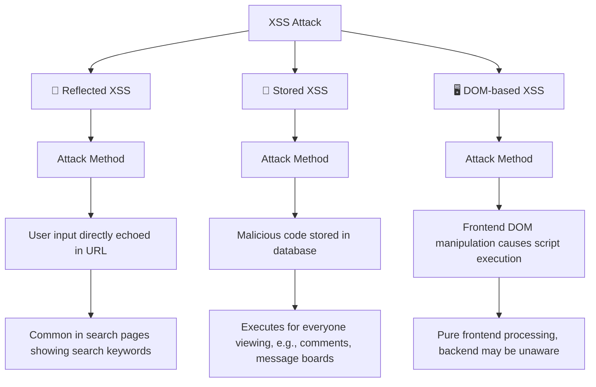

#### Reflected XSS: Fleeting Moment

This is the most common XSS type. Malicious code is in URL parameters, the server echoes the parameters back to the browser unchanged, and the browser executes the code.

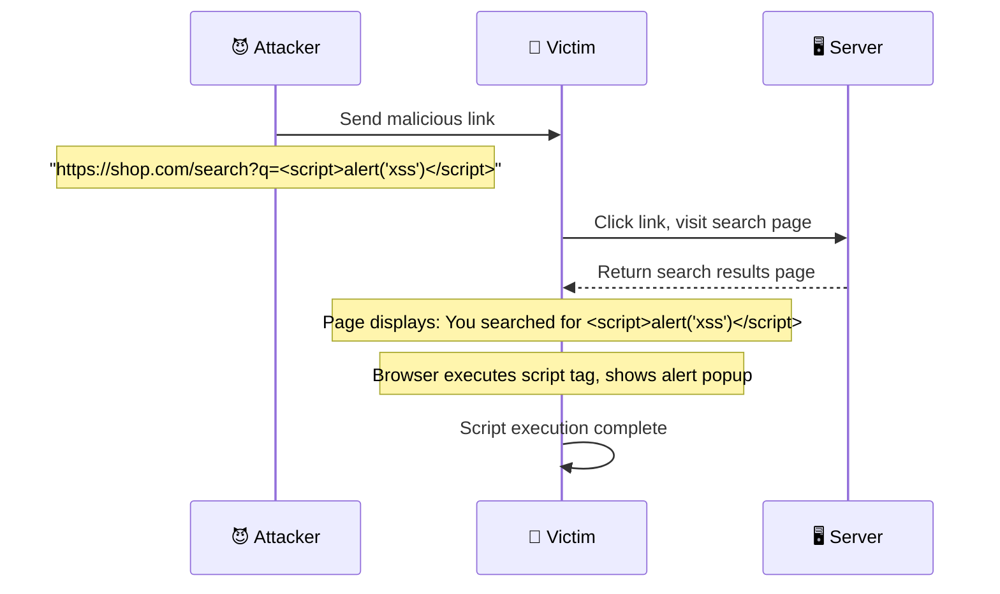

#### Stored XSS: The Lurking Cancer

This is the most dangerous. Malicious code gets stored in the database, and everyone who accesses this data gets hit.

Typical scenarios:

- Forum posts, comment sections
- User signatures, nicknames
- Article titles (some systems display them directly on pages)

Imagine this: You reply to a post on a tech forum with the content: ``

From then on, everyone who opens that post has their cookies automatically sent to the attacker's server. This isn't one-time—it's continuous harm.

#### DOM-based XSS: The Frontend Trap

This XSS happens entirely in the browser, completely unrelated to the backend.

```javascript
// Frontend code: Get URL parameter and display
const params = new URLSearchParams(window.location.search)
const name = params.get('name')
document.getElementById('welcome').innerHTML = 'Welcome, ' + name
```

An attacker crafts this URL: `http://example.com?name=`

When the victim opens this link, JavaScript gets the name parameter containing malicious code and inserts it into the page using innerHTML. When the browser parses the HTML, it executes the script in the onerror handler.

### 2.3 What Damage Can XSS Cause?

Many people think "what's the big deal about an alert popup?" But XSS damage is far beyond that:

1. **Cookie Theft**: Read user login credentials, impersonate the user
2. **Key Logging**: Monitor passwords, bank card numbers typed by users
3. **Page Defacement**: Modify page content for phishing scams
4. **Cryptojacking**: Embed mining scripts, use user computers to mine cryptocurrency
5. **Worm Propagation**: Automatically share your malicious links to all friends

### 2.4 How to Protect?

**Principle 1: Never Trust User Input**

Regardless of where the data comes from—URL parameters, form submissions, databases—treat everything as potentially malicious.

**Principle 2: Escape When Outputting, Not Before Inserting HTML**

```javascript
// Wrong approach: Directly insert user input
element.innerHTML = userInput // Dangerous!

// Correct approach: Use textContent instead of innerHTML
element.textContent = userInput // Safe

// If you must use innerHTML, escape first
function escapeHtml(text) {
	const div = document.createElement('div')
	div.textContent = text
	return div.innerHTML
}
element.innerHTML = escapeHtml(userInput)
```

**Backend using xss library:**

```javascript
import xss from 'xss'

// Whitelist filtering: Only allow some tags
const clean = xss(userInput, {
	whiteList: {
		p: ['class'],
		strong: [],
		em: [],
		a: ['href', 'title'],
	},
})
```

**Backend setting CSP (Content Security Policy):**

```javascript
import helmet from 'helmet'

app.use(
	helmet.contentSecurityPolicy({
		directives: {
			defaultSrc: ["'self'"],
			scriptSrc: ["'self'", "'nonce-{generated-csp-nonce}'"],
			styleSrc: ["'self'", "'unsafe-inline'"], // Note: Try to avoid unsafe-inline
			imgSrc: ["'self'", 'https:'], // Only allow same-origin and HTTPS images
			connectSrc: ["'self'"],
			fontSrc: ["'self'"],
			objectSrc: ["'none'"],
			mediaSrc: ["'self'"],
			frameSrc: ["'none'"],
		},
	}),
)
```

### 2.5 Complete Protection Example

Full protection combining frontend and backend:

```javascript
// Backend Express server
import express from 'express'
import xss from 'xss'
import helmet from 'helmet'

const app = express()

// 1. Use helmet to set security headers
app.use(helmet())

// 2. Global XSS filtering middleware
app.use((req, res, next) => {
	// Sanitize all request parameters
	const sanitize = (obj) => {
		if (typeof obj === 'string') {
			return xss(obj)
		}
		if (typeof obj === 'object' && obj !== null) {
			for (const key in obj) {
				obj[key] = sanitize(obj[key])
			}
		}
		return obj
	}

	req.body = sanitize(req.body)
	req.query = sanitize(req.query)
	req.params = sanitize(req.params)
	next()
})

// 3. Secure template rendering
app.set('view engine', 'ejs')
app.locals.xss = xss // Can be called in templates

// Example route
app.post('/comment', async (req, res) => {
	const { content } = req.body

	// Escape again before storing in database
	const safeContent = xss(content)
	await db.comments.insert({ content: safeContent })

	res.json({ success: true })
})
```

---

## III. Authorization Flaws: Seeing What You Shouldn't

### 3.1 What is Broken Access Control?

There are two types: horizontal and vertical privilege escalation.

**Horizontal Privilege Escalation**: You can access resources belonging to users at your same level.

For example, you and your classmate are both regular users. You log in and see your order details. But when you change the order ID to your classmate's, you can somehow see their order contents too. That's horizontal privilege escalation.

**Vertical Privilege Escalation**: You can access features you don't have permission for.

For instance, you're a regular user, but directly accessing `/admin/dashboard` shows you the admin backend. That's vertical privilege escalation.

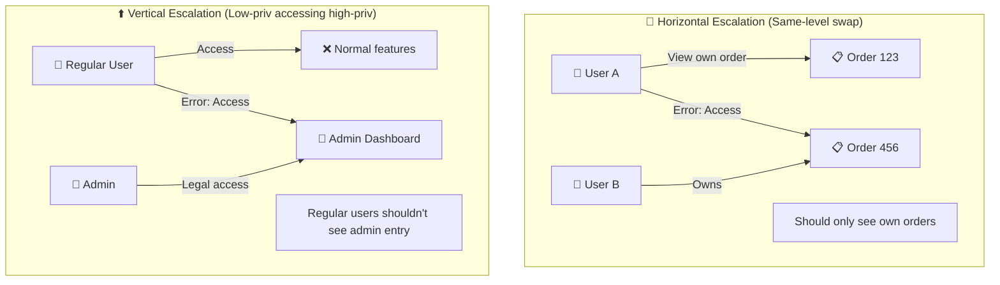

### 3.2 Common Scenarios for Broken Access Control

**Scenario 1: User ID in URL Parameter**

```javascript
// Common problematic code
app.get('/user/profile/:userId', async (req, res) => {
	const userId = req.params.userId
	const profile = await db.user.findById(userId)
	res.json(profile)
})
```

Attackers just need to iterate through userId parameters to see any user's information.

**Scenario 2: Admin Endpoints Without Permission Check**

```javascript
// Common problematic code
app.post('/admin/deleteUser', async (req, res) => {
	const { userId } = req.body
	await db.user.delete(userId)
	res.json({ success: true })
})
```

Regular users can POST to this address and delete any user.

**Scenario 3: Hidden Endpoints Protected by "Obscurity"**

```javascript
// Thinking renaming makes it secure? Too naive.
app.post('/manage/delete-account', async (req, res) => {
	// No permission check whatsoever
	await db.user.delete(req.body.id)
})
```

### 3.3 How to Protect?

**Core Principle: Get Current User from Session, Don't Trust Frontend User Identifiers**

```javascript
// ✅ Correct approach: Get current user from session
app.get('/order/:orderId', async (req, res) => {
	const orderId = req.params.orderId

	// 1. Get currently logged-in user first
	const currentUser = req.session.userId

	// 2. Query the order
	const order = await db.order.findById(orderId)

	// 3. Verify the order owner is the current user
	if (order.userId !== currentUser) {
		return res.status(403).json({
			error: 'You are not authorized to view this order',
		})
	}

	res.json(order)
})
```

**Use UUID Instead of Auto-increment ID:**

```javascript
// ❌ Auto-increment ID, easy to enumerate
// GET /order/1001, /order/1002, /order/1003...

// ✅ UUID, impossible to guess
// GET /order/a1b2c3d4-e5f6-7890-abcd-ef1234567890
```

```javascript
// Generate UUID
import { v4 as uuidv4 } from 'uuid'

app.post('/order', async (req, res) => {
	const order = {
		id: uuidv4(), // Random UUID
		userId: req.session.userId,
		items: req.body.items,
		createdAt: new Date(),
	}

	await db.order.insert(order)
	res.json({ orderId: order.id })
})
```

**Global Permission Check Middleware:**

```javascript
// Define permission check function
function requireAuth(allowedRoles = []) {
	return async (req, res, next) => {
		// Check if logged in
		if (!req.session.userId) {
			return res.status(401).json({ error: 'Please log in first' })
		}

		// Get user info
		const user = await db.user.findById(req.session.userId)

		// Check role permissions
		if (allowedRoles.length > 0 && !allowedRoles.includes(user.role)) {
			return res.status(403).json({ error: 'You do not have permission to access this feature' })
		}

		// Attach user info to req, subsequent handlers can use directly
		req.user = user
		next()
	}
}

// Usage
app.get(
	'/admin/dashboard',
	requireAuth(['admin']), // Only admins can access
	(req, res) => {
		res.json({ message: 'Welcome to admin dashboard' })
	},
)

app.get(
	'/order/:id',
	requireAuth(), // Any logged-in user can access (but can only access their own)
	async (req, res) => {
		// Additional ownership check needed here
		const order = await db.order.findById(req.params.id)
		if (order.userId !== req.user.id) {
			return res.status(403).json({ error: 'Unauthorized access' })
		}
		res.json(order)
	},
)
```

---

## IV. SSRF: The "Proxy" Feature That Gets Exploited

### 4.1 What is SSRF?

SSRF stands for Server-Side Request Forgery. The essence of this vulnerability is that your server has features requiring "fetching external resources" (like downloading images, taking screenshots). Attackers exploit these features to make the server access internal resources it shouldn't reach.

### 4.2 Attack Mechanism

Normally, user inputs an image URL, server downloads and saves it:

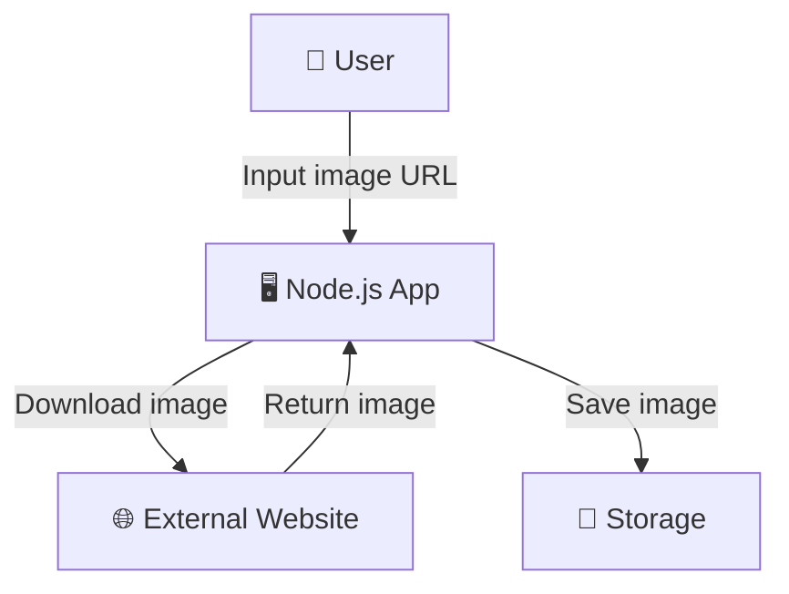

Attacker exploits this feature to make the app access internal resources:

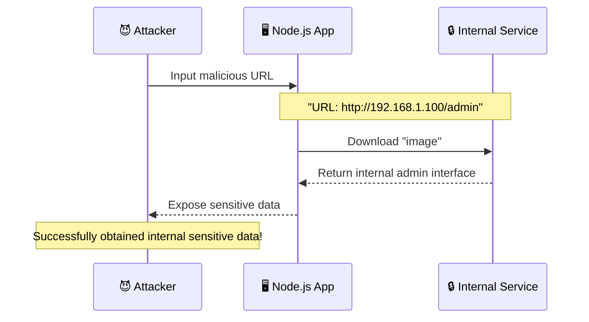

### 4.3 Which Features Are Vulnerable?

- **Image Preview/Thumbnail**: User inputs image URL, server downloads and processes
- **Webpage Screenshot**: Convert any URL to an image
- **File Download**: Allow users to download files from specified URLs
- **Webhook Callbacks**: Send requests to user-provided URLs
- **API Proxy**: Proxy access to user-provided URLs

### 4.4 Real Attack Cases

**Case 1: Reading Cloud Metadata**

Many cloud services (AWS, Alibaba Cloud) have metadata services running at `169.254.169.254`:

```
http://example.com/fetch?url=http://169.254.169.254/latest/meta-data/
```

If your app lacks protection, attackers can obtain cloud server keys, instance info, etc.

**Case 2: Scanning Internal Ports**

```
http://example.com/fetch?url=http://192.168.1.1:8080/
```

Determine if ports are open and what services are running based on returned content.

**Case 3: Reading Local Files**

```
http://example.com/fetch?url=file:///etc/passwd
```

Some servers support `file://` protocol, directly reading local files.

### 4.5 How to Protect?

**Method 1: Block Internal IPs**

```javascript
import dns from 'node:dns/promises'
import { isInternal } from 'is-internal-ip'

app.post('/fetch', async (req, res) => {
	const { url } = req.body

	try {
		// Resolve domain name to get IP
		const urlObj = new URL(url)
		const hostname = urlObj.hostname

		// Check if it's an internal domain (like localhost, *.local)
		if (hostname === 'localhost' || hostname.endsWith('.local')) {
			return res.status(400).json({ error: 'Local resource access forbidden' })
		}

		// Get all IPs for the domain
		const records = await dns.lookup(hostname, { all: true })

		// Check for internal IPs
		for (const record of records) {
			if (await isInternal(record.address)) {
				return res.status(400).json({ error: 'Internal resource access forbidden' })
			}
		}

		// Verification passed, continue processing
		const response = await fetch(url)
		const buffer = await response.arrayBuffer()
		res.send(Buffer.from(buffer))
	} catch (error) {
		res.status(400).json({ error: 'URL format error or cannot be accessed' })
	}
})
```

**Method 2: Whitelist Domains**

```javascript
const ALLOWED_DOMAINS = ['cdn.example.com', 'images.example.com', 'img.example.org']

app.post('/fetch', async (req, res) => {
	const { url } = req.body
	const urlObj = new URL(url)

	if (!ALLOWED_DOMAINS.includes(urlObj.hostname)) {
		return res.status(400).json({ error: 'Only specified domains allowed' })
	}

	// ...
})
```

**Method 3: Disable Dangerous Protocols**

```javascript
app.post('/fetch', async (req, res) => {
	const { url } = req.body

	// Only allow http and https
	if (!url.startsWith('http://') && !url.startsWith('https://')) {
		return res.status(400).json({ error: 'Only http and https protocols supported' })
	}

	// Block common internal ports
	const suspiciousPorts = [22, 23, 25, 3306, 5432, 6379, 27017]
	const urlObj = new URL(url)
	if (suspiciousPorts.includes(urlObj.port)) {
		return res.status(400).json({ error: 'Access to this port forbidden' })
	}

	// ...
})
```

**Method 4: DNS Rebinding Protection**

Attackers may exploit DNS cache timing differences, resolving to a valid IP during verification but pointing to an internal IP during actual requests. Combine IP blacklists and timestamp verification.

---

## V. Other Common Vulnerabilities

### 5.1 HPP - HTTP Parameter Pollution

HPP stands for HTTP Parameter Pollution. The problem is that different backend frameworks handle duplicate parameters differently.

```
GET /search?q=apple&q=banana
```

| Framework  | Result                              |
| ---------- | ----------------------------------- |
| PHP        | `q = "banana"` (latter overrides)   |
| ASP.NET    | `q = "apple,banana"` (concatenated) |
| Express.js | `q = "banana"` (latter overrides)   |

Attackers can exploit these parsing differences to bypass security filters. For example, a security check only validates the first parameter, but the application actually uses the second.

**Protection: Use hpp Middleware**

```javascript
import hpp from 'hpp'

app.use(
	hpp({
		// Specify which parameters allow duplicates
		allow: ['tags', 'category'],
	}),
)

// Now /search?q=apple&q=banana gets processed by hpp
// Only keeps the last one: q = "banana"
```

### 5.2 Open Redirect

Many websites have a "redirect after login" feature, like:

```
https://shop.com/login?redirect=/cart
```

After successful login, it automatically redirects to `/cart`. But if the `redirect` parameter can be controlled:

```
https://shop.com/login?redirect=http://evil.com/phishing
```

Attackers can use this for phishing—the site looks trustworthy, but actually redirects to a fake website.

**Attack Flow:**

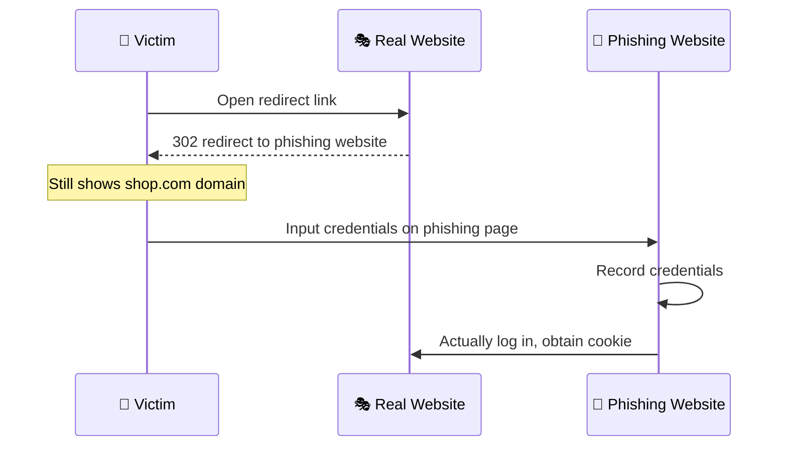

**Protection: Whitelist Verification**

```javascript
const ALLOWED_HOSTS = ['example.com', 'shop.example.com']

app.get('/login', (req, res) => {
	const redirectUrl = req.query.redirect

	if (!redirectUrl) {
		return res.redirect('/dashboard')
	}

	// Parse URL
	let hostname
	try {
		const url = new URL(redirectUrl, 'http://localhost')
		hostname = url.hostname
	} catch {
		return res.redirect('/dashboard')
	}

	// Check if on whitelist
	if (!ALLOWED_HOSTS.includes(hostname)) {
		return res.redirect('/dashboard')
	}

	// Check if relative path (recommended approach)
	if (redirectUrl.startsWith('/') && !redirectUrl.startsWith('//')) {
		return res.redirect(redirectUrl)
	}

	res.redirect('/dashboard')
})
```

### 5.3 Dependency Vulnerabilities

Think using only native Node.js keeps you safe? Too young too simple.

The npm ecosystem has millions of packages. Your project installs dozens of dependencies, each dependency may depend on dozens more. Layer after layer, your project actually depends on hundreds or thousands of third-party code snippets.

The security of this code entirely depends on the authors. Once a vulnerability is found in any package, your project is in danger too.

**Attack Chain:**

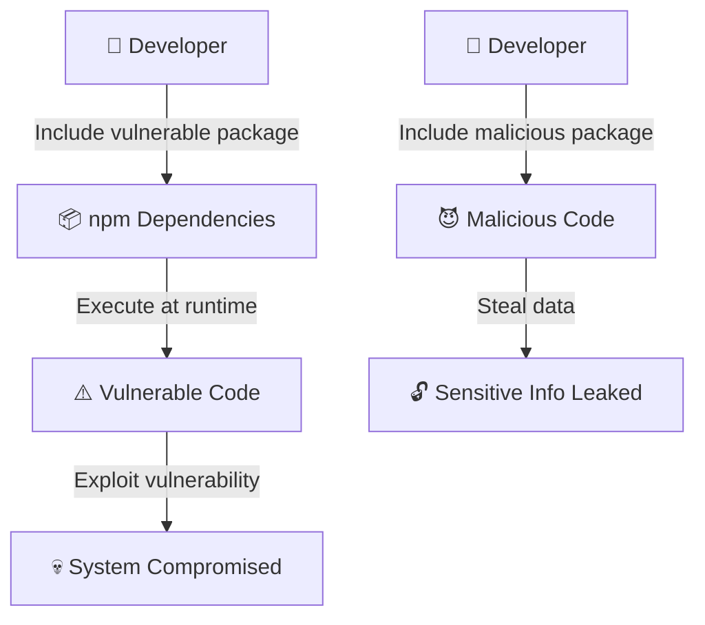

**Real Cases:**

The 2018 event-stream incident. An attacker injected malicious code into the popular event-stream package, specifically targeting Bitcoin wallet private key theft. Millions of projects worldwide were affected.

**Protection Measures:**

1. **Regular Audits**

```bash
# Check dependency vulnerabilities
npm audit

# View detailed report
npm audit --audit-level=high
```

2. **Use Automated Tools**

```yaml
# .github/workflows/security.yml
name: Security Audit
on: [push, pull_request]

jobs:
  security:
    runs-on: ubuntu-latest
    steps:
      - uses: actions/checkout@v3
      - uses: actions/setup-node@v3
        with:
          node-version: '18'
      - run: npm ci
      - uses: snyk/actions/node@master
        env:
          SNYK_TOKEN: ${{ secrets.SNYK_TOKEN }}
```

3. **Lock Versions**

```json
{
	"dependencies": {
		"lodash": "4.17.21"
	}
}
```

```bash
# Generate lock file, every install gets the exact same versions
npm ci
```

4. **Use Private Mirrors**

For critical dependencies, consider forking to your own controlled repository and checking updates periodically.

### 5.4 Path Traversal

This vulnerability stems from the server not checking whether the user-provided path stays within the expected directory when handling file paths.

```javascript
// Problematic code
app.get('/download', (req, res) => {
	const file = req.query.file
	// Direct path concatenation, no checks
	res.sendFile(__dirname + '/files/' + file)
})
```

Attacker inputs:

```
GET /download?file=../../../etc/passwd
```

The actual path the server reads is `/var/www/yourapp/files/../../../etc/passwd`, which equals `/etc/passwd`.

**Attack Path:**

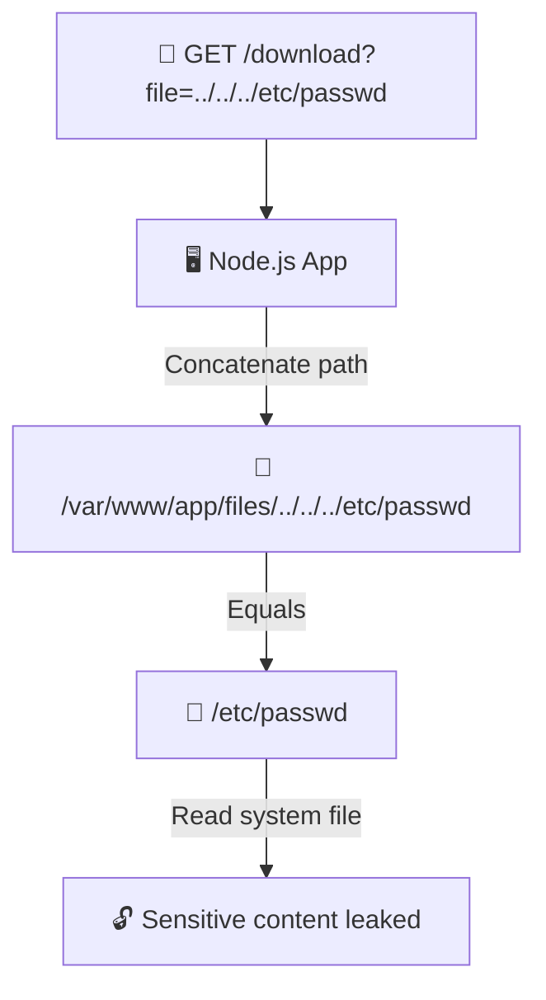

**Protection: Path Normalization**

```javascript
import path from 'node:path'
import fs from 'node:fs'

app.get('/download', (req, res) => {
	const requestedFile = req.query.file

	// Safe directory
	const baseDir = path.join(__dirname, 'files')

	// Normalize path
	const filePath = path.normalize(path.join(baseDir, requestedFile))

	// Ensure final path is within safe directory
	if (!filePath.startsWith(baseDir)) {
		return res.status(403).json({ error: 'Invalid path' })
	}

	// Check if file exists and is actually a file
	if (!fs.existsSync(filePath) || !fs.statSync(filePath).isFile()) {
		return res.status(404).json({ error: 'File not found' })
	}

	res.sendFile(filePath)
})
```

### 5.5 SQL Injection

Although many people use ORMs with Node.js, it's still worth understanding SQL injection principles.

**Problematic Code:**

```javascript
// ❌ Never do this
const sql = `SELECT * FROM users WHERE name = '${username}'`
db.query(sql)

// Attacker inputs username: "' OR '1'='1"
// Actual SQL executed:
// SELECT * FROM users WHERE name = '' OR '1'='1'
// Result: Returns ALL users!
```

**Correct Approach: Parameterized Queries**

```javascript
// ✅ Use parameterized queries
const sql = 'SELECT * FROM users WHERE name = ?'
db.query(sql, [username])

// Or use ORM
const user = await db.user.findFirst({
	where: { name: username },
})
```

---

## VI. Application Rate Limiting

Rate limiting isn't strictly a "security vulnerability," but it's an important measure to protect systems from being overwhelmed by malicious requests.

Imagine this: someone writes a script, sending you 10,000 requests per second. Your server struggles to process these invalid requests while real users can't get through. This is a DoS (Denial of Service) attack.

Rate limiting exists to solve this problem.

### 6.1 Fixed Window Counter

The simplest approach: a fixed time period allows a fixed number of requests.

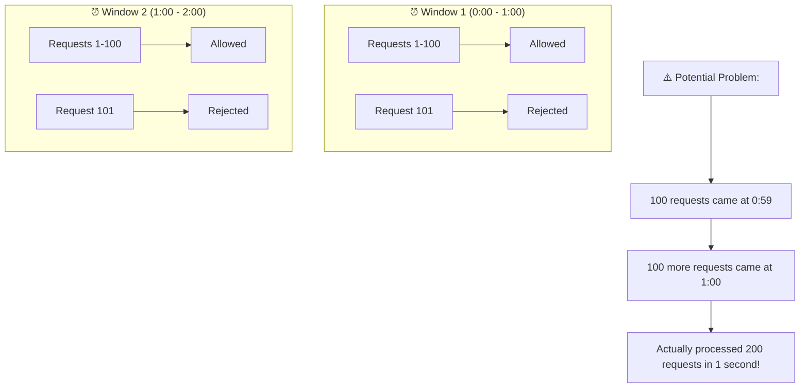

**Code Implementation:**

```javascript
import rateLimit from 'express-rate-limit'

const limiter = rateLimit({
	windowMs: 60 * 1000, // Time window: 1 minute
	max: 100, // Maximum 100 requests
	message: 'Too many requests, please try again later',
	standardHeaders: true, // Return RateLimit-* headers
	legacyHeaders: false,
	keyGenerator: (req) => {
		// Rate limit by IP (can also change to user ID)
		return req.ip
	},
})

app.use('/api', limiter)
```

### 6.2 Sliding Window Counter

Solves the fixed window's "boundary spike" problem. Splits the time window into multiple smaller segments and calculates a weighted average.

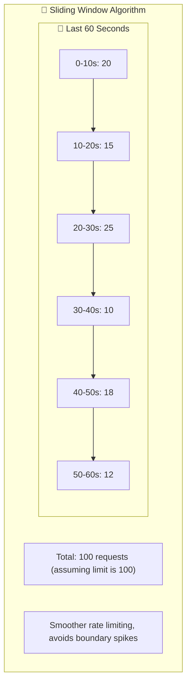

**Code Implementation:**

```javascript
class SlidingWindowRateLimiter {
	constructor(windowMs, maxRequests) {
		this.windowMs = windowMs
		this.maxRequests = maxRequests
		this.requests = new Map() // { ip: [timestamp1, timestamp2, ...] }
	}

	isAllowed(ip) {
		const now = Date.now()
		const windowStart = now - this.windowMs

		// Get this IP's historical request records
		if (!this.requests.has(ip)) {
			this.requests.set(ip, [])
		}

		const timestamps = this.requests.get(ip)

		// Only keep requests within the window
		const validTimestamps = timestamps.filter((t) => t > windowStart)
		this.requests.set(ip, validTimestamps)

		// Check if over limit
		if (validTimestamps.length >= this.maxRequests) {
			return { allowed: false, remaining: 0 }
		}

		// Record this request
		validTimestamps.push(now)
		return { allowed: true, remaining: this.maxRequests - validTimestamps.length }
	}
}

const limiter = new SlidingWindowRateLimiter(60 * 1000, 100)

app.use('/api', (req, res, next) => {
	const ip = req.ip
	const { allowed, remaining } = limiter.isAllowed(ip)

	res.setHeader('X-RateLimit-Remaining', remaining)

	if (!allowed) {
		return res.status(429).json({ error: 'Too many requests' })
	}

	next()
})
```

### 6.3 Leaky Bucket Algorithm

Imagine a bucket with a hole in the bottom. Water (requests) flows in from the top and leaks out from the bottom at a fixed rate. When the bucket is full, new water overflows (gets rejected).

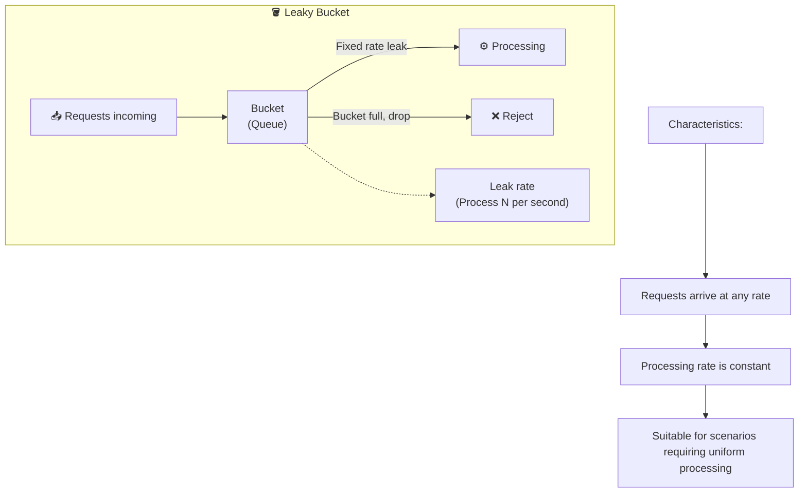

**Code Implementation:**

```javascript
class LeakyBucket {
	constructor(capacity, leakRatePerSecond) {
		this.capacity = capacity // Bucket capacity
		this.water = 0 // Current water level
		this.leakRate = leakRatePerSecond // Leaks per second
		this.lastLeakTime = Date.now()
	}

	drop() {
		this.leak()

		if (this.water < this.capacity) {
			this.water++
			return true // Can be processed
		}
		return false // Bucket full, reject
	}

	leak() {
		const now = Date.now()
		const elapsed = (now - this.lastLeakTime) / 1000 // Seconds
		const leaked = elapsed * this.leakRate

		this.water = Math.max(0, this.water - leaked)
		this.lastLeakTime = now
	}
}

const bucket = new LeakyBucket(100, 10) // Capacity 100, processes 10 per second

app.use('/api', (req, res, next) => {
	if (bucket.drop()) {
		next()
	} else {
		res.status(429).json({ error: 'Server busy, please try again later' })
	}
})
```

### 6.4 Token Bucket Algorithm

This is the most flexible rate limiting algorithm. The bucket contains tokens; requests must take a token to be processed. Tokens are generated at a fixed rate but can accumulate (up to bucket capacity).

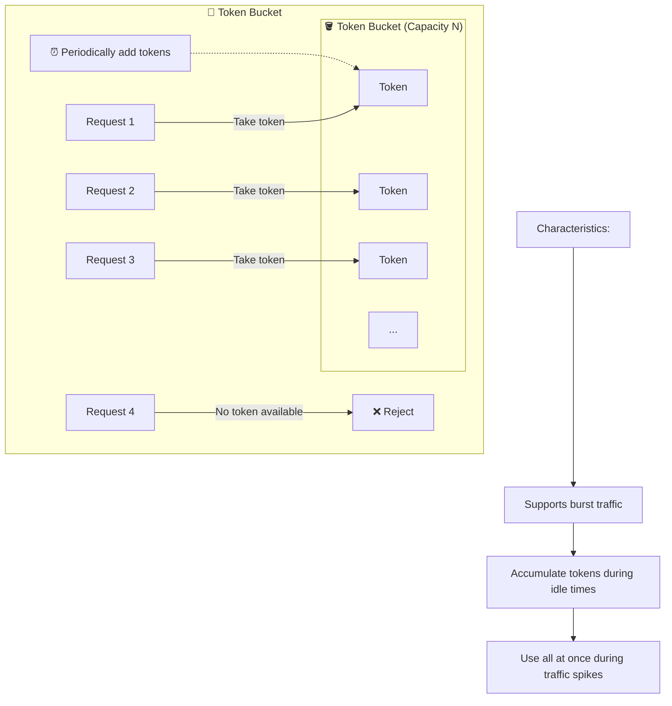

**Code Implementation:**

```javascript
class TokenBucket {
	constructor(capacity, refillRatePerSecond) {
		this.capacity = capacity // Bucket capacity
		this.tokens = capacity // Current token count
		this.refillRate = refillRatePerSecond // Tokens replenished per second
		this.lastRefillTime = Date.now()
	}

	take() {
		this.refill()

		if (this.tokens >= 1) {
			this.tokens -= 1
			return true
		}
		return false
	}

	refill() {
		const now = Date.now()
		const elapsed = (now - this.lastRefillTime) / 1000
		const tokensToAdd = elapsed * this.refillRate

		this.tokens = Math.min(this.capacity, this.tokens + tokensToAdd)
		this.lastRefillTime = now
	}
}

const bucket = new TokenBucket(100, 10) // Max 100 tokens, replenish 10 per second

app.use('/api', (req, res, next) => {
	if (bucket.take()) {
		next()
	} else {
		res.status(429).json({
			error: 'Too many requests',
			retryAfter: 1, // Suggest retry after 1 second
		})
	}
})
```

### 6.5 Algorithm Comparison

| Algorithm      | Advantages          | Disadvantages          | Best For                       |
| -------------- | ------------------- | ---------------------- | ------------------------------ |
| Fixed Window   | Simple to implement | Boundary spikes        | Low precision requirements     |
| Sliding Window | High precision      | Complex implementation | API rate limiting              |
| Leaky Bucket   | Smooth traffic      | Cannot handle bursts   | Message queues, API gateways   |
| Token Bucket   | Supports bursts     | Slightly complex       | Rate limiting, traffic shaping |

### 6.6 Distributed Rate Limiting

Single-machine rate limiting only protects that one server. Real rate limiting requires a global perspective.

**Redis + Sliding Window Implementation:**

```javascript
import Redis from 'ioredis'

const redis = new Redis(process.env.REDIS_URL)

async function slidingWindowRateLimit(key, windowMs, maxRequests) {
	const now = Date.now()
	const windowStart = now - windowMs

	const multi = redis.multi()

	// Remove records outside window
	multi.zremrangebyscore(key, 0, windowStart)

	// Add current request
	multi.zadd(key, now, `${now}-${Math.random()}`)

	// Get request count within window
	multi.zcard(key)

	// Set expiration
	multi.expire(key, Math.ceil(windowMs / 1000))

	const results = await multi.exec()
	const requestCount = results[2][1]

	return {
		allowed: requestCount <= maxRequests,
		remaining: Math.max(0, maxRequests - requestCount),
	}
}

app.use('/api', async (req, res, next) => {
	const key = `ratelimit:${req.ip}`
	const { allowed, remaining } = await slidingWindowRateLimit(
		key,
		60 * 1000, // 1 minute
		100, // 100 requests
	)

	res.setHeader('X-RateLimit-Remaining', remaining)

	if (!allowed) {
		return res.status(429).json({ error: 'Too many requests' })
	}

	next()
})
```

---

## VII. Security Trio: Rate Limiting, Caching, Degradation

High-availability systems rely on three pillars: rate limiting, caching, and degradation. They work together to ensure systems can still provide core services under extreme conditions.

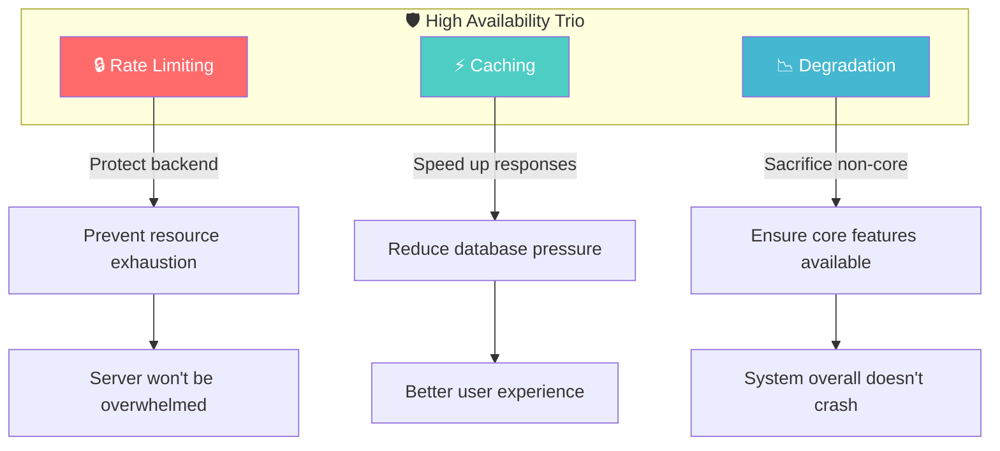

**Examples:**

- **Rate Limiting**: During Double Eleven, 1 million people place orders per second, but you can only process 100,000. You have to make 900,000 people wait or return "try again later"
- **Caching**: Most data doesn't change frequently. Caching blocks 90% of requests, reducing database pressure
- **Degradation**: Image captcha computation is too slow. Temporarily disable it, switch to SMS verification, restore after peak hours

---

## VIII. Summary: Security Checklist

Here's a checklist for you to go through before every deployment:

### Request Validation

- [ ] All user input is validated and sanitized
- [ ] Use parameterized queries to prevent SQL injection
- [ ] Use ORM security features

### Authentication

- [ ] Use secure password hashing algorithm (Argon2 or bcrypt)
- [ ] Session/Cookie set with httpOnly, secure, sameSite
- [ ] Implement CSRF protection

### Authorization

- [ ] All endpoints have permission checks
- [ ] Use UUID or random IDs, avoid predictable IDs
- [ ] Verify resource ownership, don't rely solely on URL parameters

### Sensitive Data

- [ ] Sensitive data stored encrypted
- [ ] APIs don't return unnecessary sensitive information
- [ ] Logs don't record passwords, tokens, or other sensitive info

### Network Security

- [ ] Use HTTPS
- [ ] Set CSP, X-Frame-Options, and other security headers
- [ ] Rate limit to prevent DoS

### Dependency Security

- [ ] Regularly run `npm audit`
- [ ] Use automated tools to check dependencies
- [ ] Lock dependency versions

### Error Handling

- [ ] Production environment disables detailed error stack traces
- [ ] Unified error response format
- [ ] Log exceptions without exposing sensitive information

---

Security isn't a one-time task—it's an ongoing process. I hope this article helps you build security awareness and think one step ahead in daily development: "Could a user exploit this feature against me?"

A little extra vigilance saves a lot of损失. May your applications be unbreakable!
