## Introduction: Why is Security So Important?

Modern Web applications face a wide variety of attacks. Attackers exploit developer oversights, bypassing defenses through carefully crafted requests. As a major backend player, the security of Node.js directly affects the entire system. We will start with common vulnerabilities, each accompanied by attack flowcharts or principle diagrams to aid understanding.

## 1. Common Web Security Vulnerabilities and Protection

### 1. CSRF (Cross-Site Request Forgery)

**Mechanism**
When a user is logged into a trusted site A, an attacker induces the user to visit a malicious site B. A hidden request in B automatically carries A's Cookie to A, executing unauthorized operations.

**CSRF Attack Flowchart**

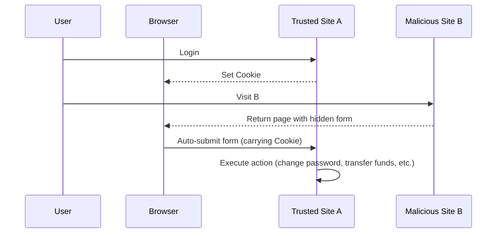

**Protection**

- CSRF Tokens
- SameSite Cookies
- Referer Validation

**Node.js Example** (Modern Security Practices)

In modern Web development, traditional middlewares like `csurf` are no longer recommended. A combination of the following is suggested:

1. **SameSite Cookie Attribute**: Set Cookies to `SameSite=Lax` or `Strict` to block cross-site transfers at the browser level.
2. **Double Submit Cookie**: The frontend reads a signed Cookie and places it into a custom Header.
3. **Framework Built-in Protection**: Frameworks like Next.js have built-in CSRF validation for Server Actions.

```javascript
// Basic defense using Cookie options
res.cookie('session', 'value', {
  httpOnly: true,
  secure: true, // Production environment
  sameSite: 'strict'
});
```

---

### 2. XSS (Cross-Site Scripting)

**XSS Classification**

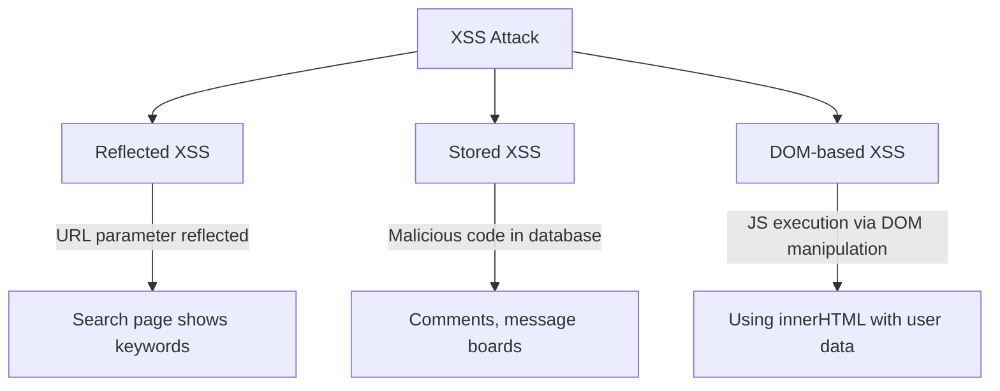

**Reflected XSS Flow**

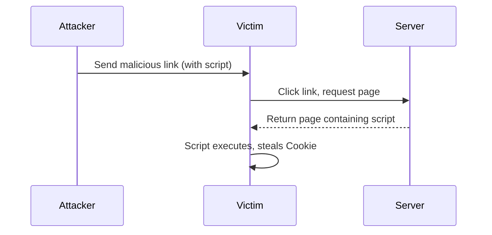

**Protection**

- Input Filtering (`xss` library)
- Output Escaping (template engines usually escape by default)
- Content Security Policy (CSP) headers

```javascript
import xss from 'xss'
const clean = xss(userInput)
```

---

### 3. Broken Access Control

**Horizontal vs. Vertical Privilege Escalation**

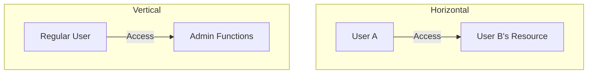

**Typical Scenarios**

- Predictable IDs in URL: `/order/1001`, attacker traverses IDs to view others' orders.
- Unprotected Admin Backends: `/admin/deleteUser` accessed by non-admins.

**Protection**

- Retrieve current user ID from session and compare with resource owner.
- Use UUIDs instead of auto-incrementing IDs.
- Clear client info after session expiry.

```javascript
app.get('/order/:id', async (req, res) => {
	const order = await Order.findById(req.params.id)
	if (order.userId !== req.session.userId) {
		return res.status(403).end()
	}
	res.json(order)
})
```

---

### 4. SSRF (Server-Side Request Forgery)

**SSRF Attack Path**

```mermaid
flowchart TD
    Attacker[Attacker] -->|Crafts malicious URL| App[Node.js App]
    App -->|Initiates request| Internal[Internal Services<br>(e.g., DB, Admin panel)]
    Internal -->|Returns sensitive data| App
    App --> Attacker
```

**Common Feature Points**

- Image downloads: User inputs an image URL, server fetches and stores it.
- Webpage screenshots, proxy scraping.
- Webhook callbacks.

**Protection**

- Resolve URL to IP and ban internal IPs (127.0.0.0/8, 10.0.0.0/8, etc.).
- Domain allowlists.

```javascript
import dns from 'node:dns/promises'
import { isInternal } from 'is-internal-ip'

app.post('/fetch', async (req, res) => {
	const { url } = req.body
	const hostname = new URL(url).hostname
	const ips = await dns.lookup(hostname, { all: true })
	for (const ip of ips) {
		if (await isInternal(ip.address)) {
			return res.status(400).send('Access to internal address forbidden')
		}
	}
	// Fetch request...
})
```

---

### 5. HPP (HTTP Parameter Pollution)

**Parameter Pollution Example**
`GET /search?q=apple&q=banana`
Different servers parse this differently:

- PHP: `q=banana` (last one wins)
- ASP.NET: `q=apple,banana` (comma-separated)
- Node.js (Express): `q='banana'` (last one wins)

Attackers exploit these differences to bypass security filters.

**Protection**
Use `hpp` middleware to clear duplicate parameters.

```javascript
import hpp from 'hpp'
app.use(hpp())
```

---

### 6. Open Redirect

**Phishing Flow**

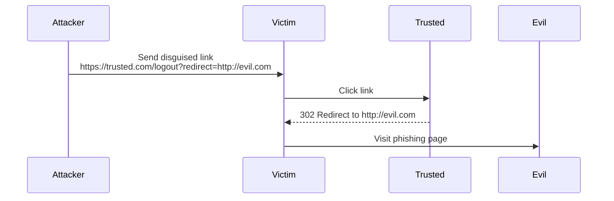

**Protection**
Allowlist redirect domains or permit only relative paths.

```javascript
const allowedHosts = ['example.com']
app.get('/redirect', (req, res) => {
	const target = req.query.url
	const { hostname } = new URL(target, 'http://localhost')
	if (!allowedHosts.includes(hostname)) {
		return res.status(400).send('Invalid redirect')
	}
	res.redirect(target)
})
```

---

### 7. Dependency Vulnerabilities

**Attack Chain**

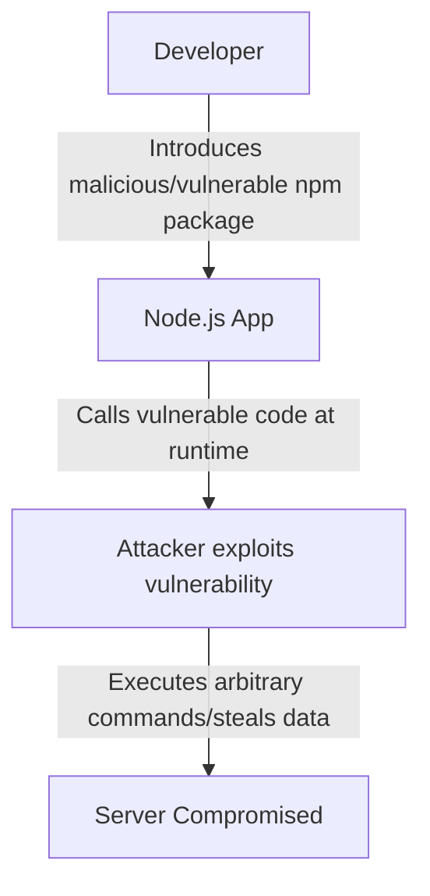

**Protection**

- Regular `npm audit` checks.
- Use Snyk or Dependabot for automatic fixes.
- Pin versions to avoid auto-upgrades introducing malicious packages.

---

### 8. Directory Traversal

**Path Traversal Example**

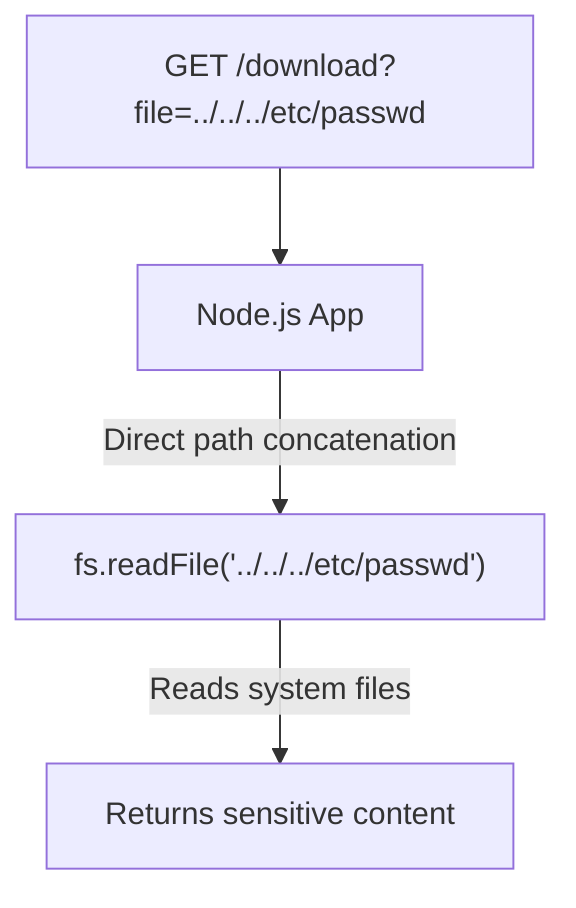

**Protection**
Use `path.resolve` and verify the result is within the expected directory.

```javascript
import path from 'node:path'
const base = '/var/data/'
app.get('/download', (req, res) => {
	const file = req.query.file
	const fullPath = path.normalize(path.join(base, file))
	if (!fullPath.startsWith(base)) {
		return res.status(403).send('Invalid path')
	}
	res.sendFile(fullPath)
})
```

---

### 9. Other Vulnerabilities

- **SQL Injection**: Use modern ORMs like Prisma/TypeORM, or strictly use parameterized queries.
- **Password Hashing**: **Argon2** is the preferred choice for 2026, offering strong memory resistance, followed by **bcrypt**.
- **Deserialization**: Strictly forbid `eval` or `node-serialize`; permit only standard `JSON.parse`.
- **Security Headers**: Use `helmet` to set secure response headers.
- **Log Injection**: Escape user input before logging to prevent control character injection.

---

## 2. Application Rate Limiting

Rate limiting is crucial for service stability. Here are four common algorithms compared.

### 1. Fixed Window Counter

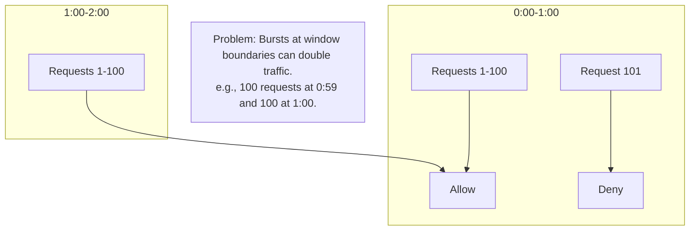

```javascript
import rateLimit from 'express-rate-limit'

const limiter = rateLimit({
	windowMs: 60 * 1000,
	max: 100,
	message: 'Too many requests, please try again later',
	headers: true,
	keyGenerator: (req) => req.ip,
})

app.use('/api/', limiter)
```

### 2. Sliding Window Counter

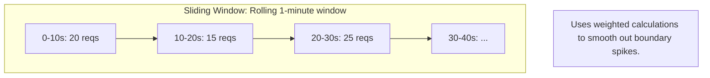

### 3. Leaky Bucket

```mermaid
flowchart TD
    Requests[Requests] -->|Enter bucket| Bucket[Leaky Bucket<br>(Queue)]
    Bucket -->|Flow out at constant rate| Process[Processing]
    Bucket -->|Bucket full| Drop[Deny]
```

### 4. Token Bucket

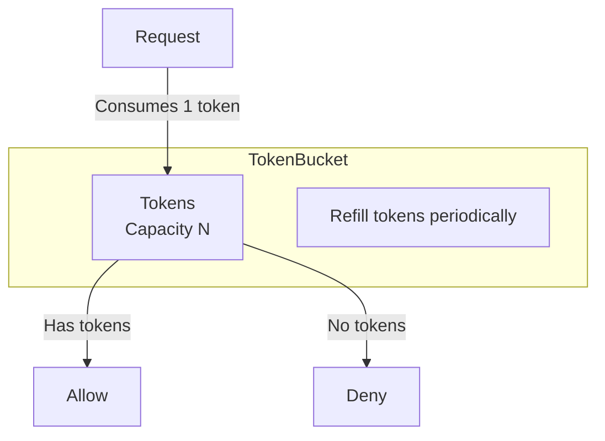

---

## 3. The Trinity of High Availability

Rate limiting, caching, and circuit breaking work together to keep the system running under high load.

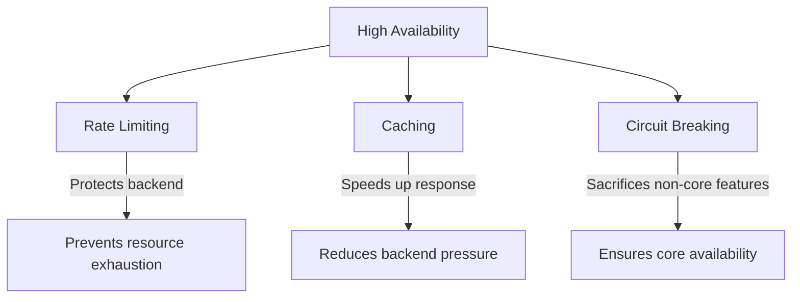

**Why do giants like Alibaba still crash?**

- Traffic spikes far exceeding estimates.
- Bottlenecks in underlying components (DB, Cache).
- Human error or bug-triggered cascades.
- Infrastructure failure (fiber cuts, power outages).

Security and high availability are systemic engineering efforts requiring continuous investment across architecture, operations, and code.

---

## Conclusion

This article reviewed over 10 common Node.js security vulnerabilities and their defenses, alongside rate-limiting algorithms. Security is not a feature but a mindset; developers should integrate it into the entire development lifecycle. I hope this helps you build more robust Node.js applications.
