> A practical testing handbook for developers, so you'll finally stop dreading writing tests

Ever had this happen to you: you finished writing some code, tested it yourself, thought everything was fine, and then—bam—bugs showed up the moment it went live? Or maybe your system crashed during a promotional event, even though your local stress tests said everything was good to go?

Behind problems like these, testing usually fell short. Today, I'm going to walk you through Node.js unit testing and performance testing in plain language, with tons of code examples and diagrams. Even if you're a complete beginner, you'll get it.

---

## What Problems Can Testing Solve for You?

- **Prevent code regression**: You change something in one place, and suddenly something else breaks—this is called "regression." Automated tests catch this the moment it happens
- **Cut down debugging time**: When a test fails, the error message tells you exactly what's wrong. Way more efficient than sprinkling console.log everywhere
- **Boost your confidence during refactoring**: Want to optimize your code but scared of breaking things? Tests give you a safety net, so refactor boldly
- **Serve as living documentation**: Read the test code and you'll instantly know what a function does—more reliable than comments

**Here's a good analogy**: Unit tests are like steel inspection for buildings. Each steel beam must meet standards before the entire structure is safe. Would you move into a building that skipped inspection?

---

## Part One: Unit Testing—Ensuring Correctness at the Smallest Scale

### 1.1 What Exactly Is Unit Testing?

A unit test is code that checks and verifies the **smallest testable unit** of your software. This "smallest unit" typically means:

- A function
- A method
- A module

Important note: unit tests verify **isolated** units—they don't depend on databases, external APIs, or other modules. If your test needs to connect to a database, it's no longer a "unit test"—that's more accurately called an "integration test."

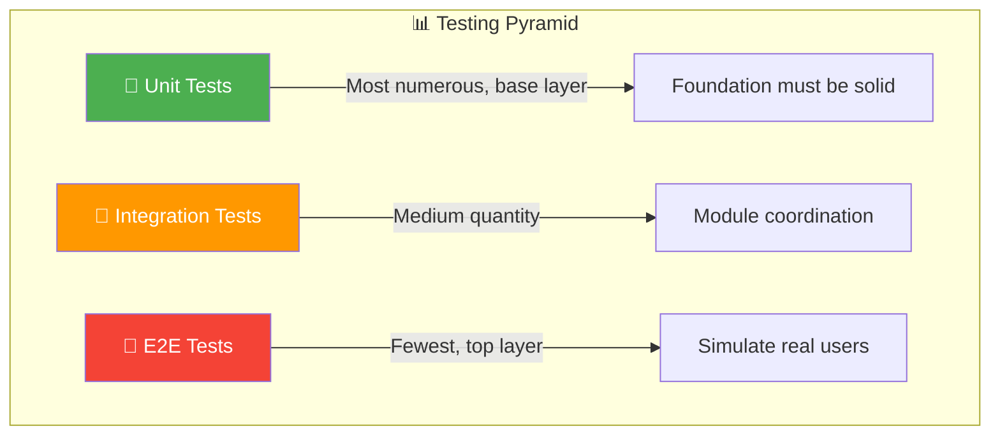

### 1.2 Why Bother With Unit Testing?

A lot of beginners think "my code logic is simple, no need to test" or "testing takes too long, better to just ship it and see."

This mindset is dangerous. Let me show you the numbers:

| Stage                       | Bug Discovery Cost |
| --------------------------- | ------------------ |
| During coding               | 1x                 |
| Caught by unit tests        | 1x - 10x           |
| Caught by integration tests | 10x - 50x          |
| Caught by QA                | 50x - 200x         |
| Found in production         | 200x - 1000x       |

See that? Catching a bug in production can cost 200 times more than catching it during coding!

The value of unit testing shows up in several ways:

- **Early problem detection**: Test right after you write the code, while the logic is still fresh in your mind—fixes come faster
- **Regression prevention**: Every code change risks introducing new bugs; automated tests ensure old features keep working
- **Documentation**: Test cases serve as living docs, explaining what inputs a function accepts and what outputs it produces
- **Better development efficiency**: Writing tests forces you to think about edge cases, which naturally improves code design

### 1.3 How to Write Unit Tests: The AAA Pattern

Alright, now let's get into the how-to. The most classic pattern is called **AAA Pattern**, dividing each test into three parts:

**1. Arrange (Setup)**

- Initialize the data the test needs
- Set up mocks (simulated objects)
- Prepare the test environment

**2. Act (Execute)**

- Call the function under test
- Capture the actual output

**3. Assert (Verify)**

- Check whether the actual output matches expectations
- If not, the test fails

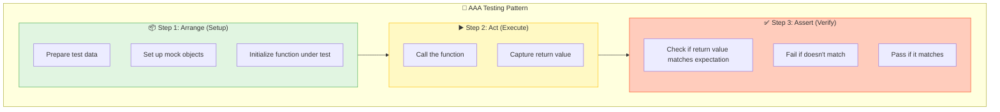

### 1.4 Hands-On: Writing Tests From Scratch

Let's start with the simplest possible example.

**Code under test** (a calculator module):

```javascript
// math.js
/**
 * Addition function
 * @param {number} a - First number
 * @param {number} b - Second number
 * @returns {number} Sum of the two numbers
 */
export function add(a, b) {
  return a + b
}

/**
 * Subtraction function
 * @param {number} a - The minuend
 * @param {number} b - The subtrahend
 * @returns {number} Difference
 */
export function subtract(a, b) {
  return a - b
}

/**
 * Multiplication function
 * @param {number} a - First number
 * @param {number} b - Second number
 * @returns {number} Product
 */
export function multiply(a, b) {
  return a * b
}

/**
 * Division function
 * @param {number} a - The dividend
 * @param {number} b - The divisor
 * @returns {number} Quotient
 * @throws {Error} Division by zero not allowed
 */
export function divide(a, b) {
  if (b === 0) {
    throw new Error('Division by zero')
  }
  return a / b
}
```

**Test code**:

```javascript
// math.test.js
import assert from 'node:assert'
import { add, subtract, multiply, divide } from '../math.js'

describe('Calculator Module Tests', () => {
  // ===== Addition Tests =====
  describe('add function', () => {
    it('should return the sum of two positive numbers', () => {
      // Arrange
      const a = 2
      const b = 3
      const expected = 5

      // Act
      const result = add(a, b)

      // Assert
      assert.strictEqual(result, expected)
    })

    it('should handle negative numbers correctly', () => {
      assert.strictEqual(add(-1, 1), 0)
      assert.strictEqual(add(-5, -3), -8)
    })

    it('should handle zero correctly', () => {
      assert.strictEqual(add(0, 0), 0)
      assert.strictEqual(add(5, 0), 5)
    })

    it('should handle decimal numbers', () => {
      assert.strictEqual(add(0.1, 0.2), 0.3)
    })
  })

  // ===== Subtraction Tests =====
  describe('subtract function', () => {
    it('should return the difference of two numbers', () => {
      assert.strictEqual(subtract(5, 3), 2)
      assert.strictEqual(subtract(3, 5), -2)
    })
  })

  // ===== Multiplication Tests =====
  describe('multiply function', () => {
    it('should return the product of two numbers', () => {
      assert.strictEqual(multiply(3, 4), 12)
      assert.strictEqual(multiply(-2, 3), -6)
    })
  })

  // ===== Division Tests =====
  describe('divide function', () => {
    it('should return the quotient of two numbers', () => {
      assert.strictEqual(divide(10, 2), 5)
    })

    // Edge case: division by zero
    it('should throw error when divisor is zero', () => {
      assert.throws(() => divide(10, 0), /Division by zero/)
    })
  })
})
```

Running the tests produces:

```
Calculator Module Tests
  add function
    ✓ should return the sum of two positive numbers
    ✓ should handle negative numbers correctly
    ✓ should handle zero correctly
    ✓ should handle decimal numbers
  subtract function
    ✓ should return the difference of two numbers
  multiply function
    ✓ should return the product of two numbers
  divide function
    ✓ should return the quotient of two numbers
    ✓ should throw error when divisor is zero

8 passing (15ms)
```

### 1.5 What Makes a Good Test?

Writing tests isn't enough—the tests themselves need to be good. A solid test follows the **FIRST** principles:

- **Fast**: Unit tests must be quick. A single feature might have hundreds of tests. If each one takes seconds to run, nobody will want to execute them
- **Independent**: Each test case must stand alone. It can't depend on other tests having run first
- **Repeatable**: Running it any number of times should produce consistent results. Environment-dependent factors (like time, network) should be mocked
- **Self-Validating**: Test results must be clear—either pass or fail, no manual judgment required
- **Timely**: Tests should be written right after the code, not put off until later

### 1.6 Test Coverage: How Much of Your Code Is Actually Tested?

Test coverage measures how much of your code your tests actually exercise. Common metrics include:

| Metric                 | Meaning                                  | Example                                                                                |
| ---------------------- | ---------------------------------------- | -------------------------------------------------------------------------------------- |
| **Statement Coverage** | Has every line of code been executed?    | `if (x) { doSomething(); }` — if x is always false, this line doesn't count as covered |
| **Branch Coverage**    | Has every if-else branch been traversed? | Both true and false branches need testing                                              |
| **Function Coverage**  | Has every function been called?          | Can't leave some functions completely untested                                         |
| **Line Coverage**      | Has every line of code been executed?    | Similar to statement coverage                                                          |

**Sample coverage report** (using Istanbul/NYC):

```bash
--------------|---------|----------|---------|---------|-------------------
File          | % Stmts | % Branch | % Funcs | % Lines | Uncovered Line #s
--------------|---------|----------|---------|---------|-------------------
All files     |   85.71 |       75 |     100 |   85.71 |
 math.js      |   85.71 |       75 |     100 |   85.71 | 5-6
 user.js      |   90.00 |       80 |     100 |   90.00 | 12, 45-47
--------------|---------|----------|---------|---------|-------------------
```

How to read it? Using `math.js` as an example:

- Statement coverage 85.71%: 14% of the code wasn't executed
- Branch coverage 75%: 25% of branches weren't tested
- Function coverage 100%: Every function was tested
- Line coverage 85.71%: Lines 5-6 weren't covered

**Is higher coverage always better?**

Not necessarily! Coverage is just a reference metric, not a goal in itself. The key is testing **valuable scenarios**, not chasing numbers.

Common mistakes:

- 100% coverage but no edge cases tested—useless
- Only testing simple paths, skipping complex logic—a waste
- Writing meaningless assertions just to boost coverage—pointless

**Recommendations**:

- Aim for 80%+ coverage on core business logic
- Always test edge cases and error handling
- Simple getters/setters don't need testing

### 1.7 Node.js Testing Framework Comparison

The Node.js ecosystem has many testing frameworks, but three stand out: **Mocha**, **Jest**, and **Vitest**. Let me give you a detailed comparison:

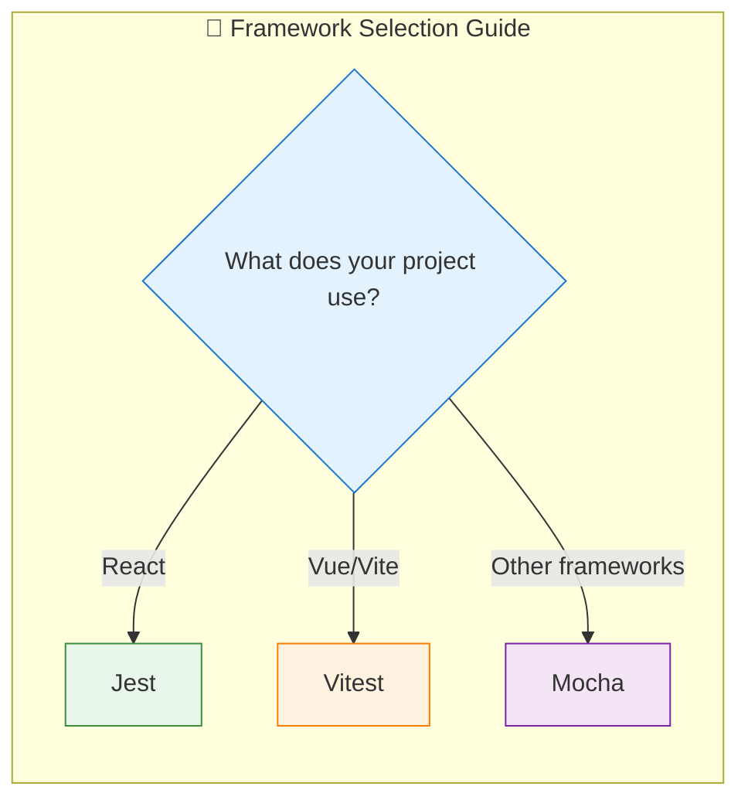

#### Feature Comparison Table

| Feature                      | Mocha                               | Jest                         | Vitest                               |
| ---------------------------- | ----------------------------------- | ---------------------------- | ------------------------------------ |
| **Assertion Library**        | Needs separate install (Chai)       | Built-in                     | Built-in (Jest-compatible)           |
| **Mock/Stub**                | Needs Sinon                         | Built-in                     | Built-in                             |
| **Snapshot Testing**         | Needs plugin                        | Built-in                     | Built-in                             |
| **Parallel Execution**       | Needs config                        | Automatic                    | Automatic (Vite-based, blazing fast) |
| **ESM Support**              | Needs config                        | Good                         | Native support                       |
| **TypeScript**               | Needs config                        | Built-in                     | Built-in                             |
| **Learning Curve**           | Steeper (need to assemble yourself) | Gentle                       | Gentle                               |
| **Configuration Complexity** | High (flexible)                     | Low (convention over config) | Low                                  |

#### 1.7.1 Mocha + Chai + Sinon: The Classic Combo

Mocha is just a test runner by itself—you need to bring your own assertions and mocks. Great for projects that need heavy customization.

**Example: Testing API Calls**

```javascript
// api.js
import axios from 'axios'

export async function fetchUser(userId) {
  const response = await axios.get(`/api/users/${userId}`)
  return response.data
}
```

```javascript
// api.test.js
import { expect } from 'chai'
import sinon from 'sinon'
import axios from 'axios'
import { fetchUser } from './api.js'

// Mock axios
describe('fetchUser', () => {
  let stub

  beforeEach(() => {
    // Create a new stub before each test
    stub = sinon.stub(axios, 'get')
  })

  afterEach(() => {
    // Restore stub after each test
    stub.restore()
  })

  it('should successfully fetch user data', async () => {
    // Arrange: set up mock return value
    const mockUser = { id: 1, name: 'John' }
    stub.resolves({ data: mockUser })

    // Act
    const result = await fetchUser(1)

    // Assert
    expect(result).to.deep.equal(mockUser)
    expect(stub.calledOnce).to.be.true
    expect(stub.calledWith('/api/users/1')).to.be.true
  })

  it('should return null when user not found', async () => {
    // Arrange: simulate 404 response
    const error = new Error('Request failed with status 404')
    error.response = { status: 404 }
    stub.rejects(error)

    // Act & Assert
    await expect(fetchUser(999)).to.eventually.be.rejected
  })
})
```

Run with: `npx mocha test/**/*.test.js`

#### 1.7.2 Jest: The Zero-Config Framework from Facebook

Jest's biggest strength is **batteries included**—assertions, mocks, coverage, watch mode, all built in. First choice for React projects.

**Example: Testing a User Creation Function**

```javascript
// user.js
export function createUser(name, email) {
  if (!name || !email) {
    throw new Error('Name and email are required')
  }
  return {
    id: Date.now(),
    name,
    email,
    createdAt: new Date().toISOString(),
  }
}
```

```javascript
// user.test.js
import { createUser } from './user.js'

describe('createUser', () => {
  test('should return object with id, name, email', () => {
    const user = createUser('John', 'john@example.com')

    // Jest's built-in matchers
    expect(user).toHaveProperty('id')
    expect(user).toHaveProperty('name', 'John')
    expect(user).toHaveProperty('email', 'john@example.com')
    expect(user).toHaveProperty('createdAt')
  })

  test('should throw error for empty name', () => {
    expect(() => createUser('', 'test@example.com')).toThrow('Name and email are required')
  })

  test('should throw error for empty email', () => {
    expect(() => createUser('John', '')).toThrow('Name and email are required')
  })
})
```

Run with: `npx jest` or configure a script in package.json.

#### 1.7.3 Vitest: The New Generation Testing Framework for the Vite Era

Vitest bills itself as "the next-generation testing framework built on Vite," compatible with Jest's API but with faster startup and execution. If you're using Vue/Vite, give it a try.

**Example: Testing Array Operations**

```javascript
// arrayUtils.js
export function filterByStatus(items, status) {
  return items.filter((item) => item.status === status)
}

export function groupByCategory(items) {
  return items.reduce((acc, item) => {
    const key = item.category
    if (!acc[key]) {
      acc[key] = []
    }
    acc[key].push(item)
    return acc
  }, {})
}
```

```javascript
// arrayUtils.test.js
import { describe, it, expect } from 'vitest'
import { filterByStatus, groupByCategory } from './arrayUtils.js'

describe('Array utility functions', () => {
  const mockItems = [
    { id: 1, status: 'active', category: 'A' },
    { id: 2, status: 'inactive', category: 'A' },
    { id: 3, status: 'active', category: 'B' },
  ]

  describe('filterByStatus', () => {
    it('should filter items by specified status', () => {
      const result = filterByStatus(mockItems, 'active')
      expect(result).toHaveLength(2)
      expect(result.every((item) => item.status === 'active')).toBe(true)
    })

    it('should return empty array when no match', () => {
      const result = filterByStatus(mockItems, 'deleted')
      expect(result).toHaveLength(0)
    })
  })

  describe('groupByCategory', () => {
    it('should group items by category', () => {
      const result = groupByCategory(mockItems)
      expect(result).toHaveProperty('A')
      expect(result).toHaveProperty('B')
      expect(result['A']).toHaveLength(2)
      expect(result['B']).toHaveLength(1)
    })
  })
})
```

Run with: `npx vitest`

#### 1.7.4 Async Testing and Hook Functions

Real-world development often requires testing async code (database queries, API calls, etc.). All frameworks support `async/await`.

**Mocha async test**:

```javascript
it('should asynchronously fetch user list', async () => {
  const users = await getUsers()
  expect(users).to.be.an('array')
  expect(users.length).to.be.greaterThan(0)
})
```

**Hook functions**: Used to set up and tear down before/after tests.

```javascript
describe('Database-related tests', () => {
  // Run once before all tests start
  before(async () => {
    console.log('Connecting to database...')
    await db.connect()
  })

  // Run once after all tests finish
  after(async () => {
    console.log('Closing database connection...')
    await db.close()
  })

  // Run before each test
  beforeEach(() => {
    console.log('Clearing test data...')
    db.clear()
  })

  // Run after each test
  afterEach(() => {
    console.log('Cleaning up temporary files from tests...')
    cleanupTempFiles()
  })

  // Actual test cases
  it('should create user correctly', async () => {
    const user = await db.users.create({ name: 'Test User' })
    expect(user.id).to.exist
  })
})
```

### 1.8 Mocking and Stubbing: The Art of Isolating Dependencies

What's the hardest part of writing unit tests? **Isolating dependencies.**

For example, if you're testing an order processing function, it probably depends on:

- Database (query users, query products, save orders)
- Cache (check inventory)
- Payment API (initiate payment)

If every test requires actually calling these services:

1. It's slow
2. External API calls might fail
3. Results might vary between runs
4. You can't test error scenarios

This is where **Mock** and **Stub** come in.

**Conceptual distinction**:

- **Stub**: Replace a function to return preset values
- **Mock**: More advanced, can verify how many times a function was called, with what arguments, etc.

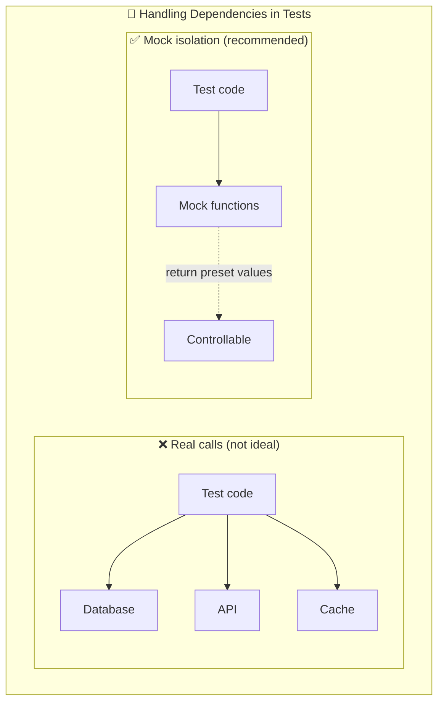

**Hands-on: Mocking API Calls**

```javascript
// userService.js
export async function getUserWithPosts(userId) {
  const user = await fetchUser(userId)
  const posts = await fetchPosts(userId)
  return { user, posts }
}
```

```javascript
// userService.test.js (using Jest Mock)
import { getUserWithPosts } from './userService.js'
import { fetchUser, fetchPosts } from './api.js'

// Mock the API module
jest.mock('./api.js')

describe('getUserWithPosts', () => {
  beforeEach(() => {
    jest.clearAllMocks() // Clear mock records before each test
  })

  it('should return user and their posts', async () => {
    // Stub: preset return values
    fetchUser.mockResolvedValue({ id: 1, name: 'John' })
    fetchPosts.mockResolvedValue([{ id: 1, title: 'First Post' }])

    const result = await getUserWithPosts(1)

    expect(result.user.name).toBe('John')
    expect(result.posts).toHaveLength(1)

    // Verify function was called
    expect(fetchUser).toHaveBeenCalledWith(1)
    expect(fetchPosts).toHaveBeenCalledWith(1)
  })

  it('should return null when user not found', async () => {
    fetchUser.mockResolvedValue(null)
    fetchPosts.mockResolvedValue([])

    const result = await getUserWithPosts(999)

    expect(result.user).toBeNull()
    expect(result.posts).toHaveLength(0)
  })

  it('should throw error on API failure', async () => {
    fetchUser.mockRejectedValue(new Error('Network error'))

    await expect(getUserWithPosts(1)).rejects.toThrow('Network error')
  })
})
```

---

## Part Two: Performance Testing—Keeping Your System Steady Under Pressure

### 2.1 What Is Performance Testing?

Unit tests answer: **Is the code logic correct?**

Performance testing answers: **Is the code fast enough? Stable enough?**

Performance testing uses automated tools to simulate various load levels, measuring system metrics:

- **Response time**: How long does a request take?
- **Throughput (TPS/QPS)**: How many requests can it handle per second?
- **Resource utilization**: CPU, memory, disk, network usage
- **Error rate**: What percentage of requests failed?

It helps answer:

- How many concurrent users can the system handle?
- Does response time meet SLA (Service Level Agreement)?
- Will there be memory leaks during long runs?
- Will it crash under peak traffic?

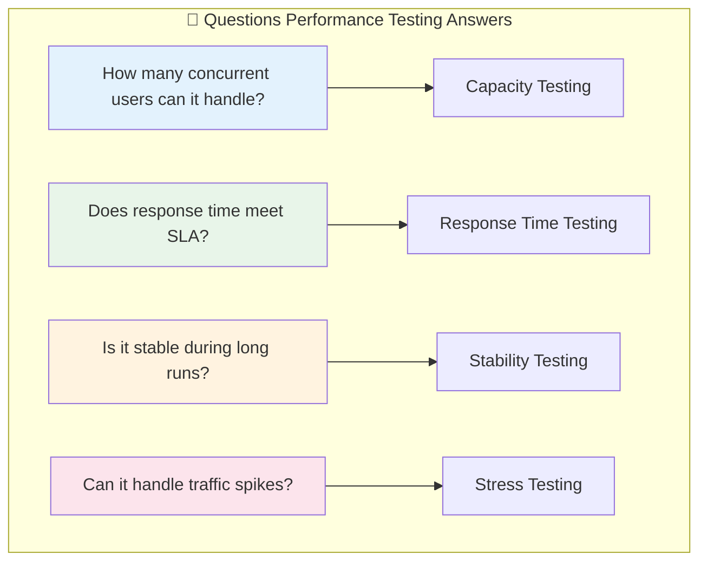

### 2.2 Four Types of Performance Testing

Performance testing isn't a single thing—it's four distinct types. Each serves a different purpose and applies different loads.

#### 2.2.1 Baseline Performance Testing (Baseline Test)

**Purpose**: Establish baseline performance data under low load as a reference for future comparisons.

**When to use**:

- After each release, compare against baseline to check for performance regression
- Before a new system goes live, get a "what's normal" reference

**Load model**: Single user or few users, short duration (e.g., 5-10 minutes)

**Output metrics**:

- Single-user average response time
- Single-user TPS
- Basic resource consumption

#### 2.2.2 Capacity Performance Testing (Capacity Test / Load Test)

**Purpose**: Test system performance under expected load, verify it meets requirements.

This is the most common type of performance test. When people say "load testing," they usually mean this.

**When to use**:

- Before a major e-commerce promotion
- Before launching a new feature, assessing capacity
- Wanting to find the system's limit

**Load model**: Gradually increase concurrent users/requests until reaching target TPS or concurrency level.

**Load curve diagram**:

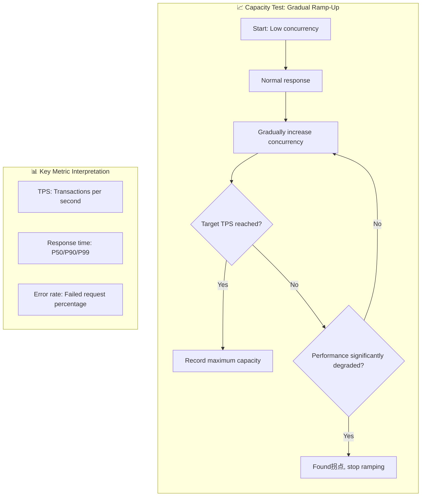

**Output**:

- Maximum TPS
- Response time distribution at different concurrency levels
- Location of performance inflection point

#### 2.2.3 Stability Performance Testing (Stability Test / Endurance Test)

**Purpose**: Verify system stability during long-running operations, check for slow problems like memory leaks and connection leaks.

**When to use**:

- Services running 7x24
- Concerned about memory leaks
- Wanting to know if the system "gets slower over time" under sustained load

**Load model**: Constant load (e.g., 80% capacity), sustained for extended periods (8 hours, 24 hours, or even 7 days).

**Metrics you must monitor**:

| Metric           | What to Watch                            |
| ---------------- | ---------------------------------------- |
| **Memory**       | Any leaks? (Memory continuously growing) |
| **CPU**          | Continuously high usage?                 |
| **File handles** | Any connection/file handle leaks?        |
| **GC**           | Is GC frequency abnormal?                |
| **Error logs**   | Any slowly accumulating errors?          |

**Stability test monitoring diagram**:

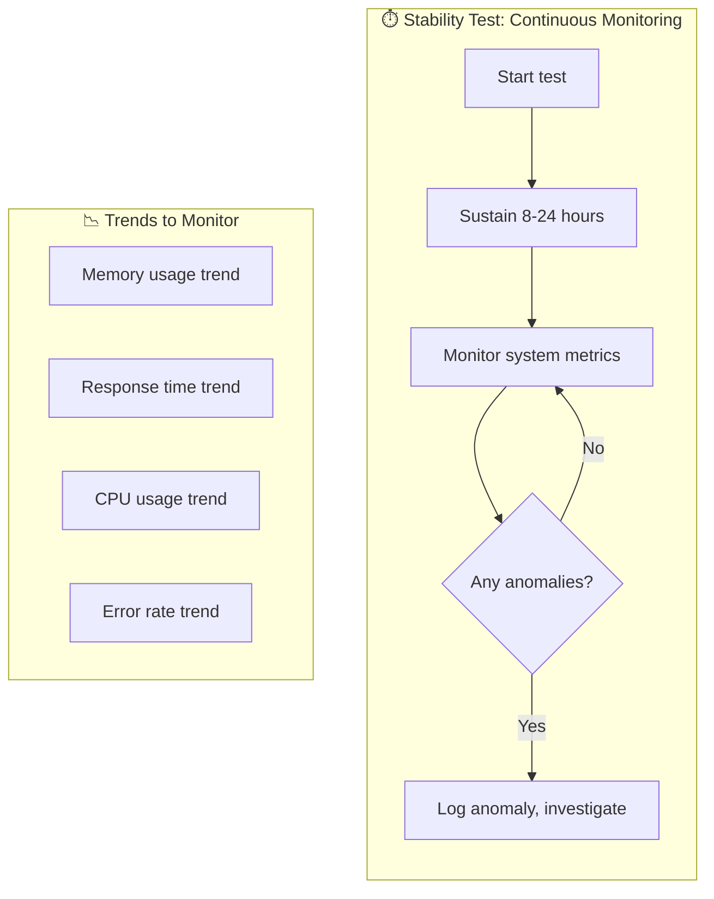

#### 2.2.4 Stress Performance Testing (Stress Test / Spike Test)

**Purpose**: Test system behavior under sudden extreme load and its recovery capability.

**When to use**:

- Before a "flash sale" event
- Wanting to know system performance under extreme conditions
- Verifying that rate limiting and degradation mechanisms work

**Load model**: Sudden high concurrency, or load that spikes up and down dramatically.

**Stress test diagram**:

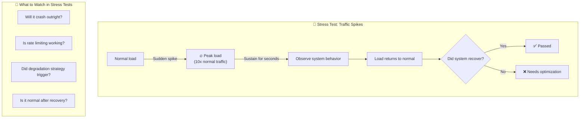

### 2.3 Complete Performance Testing Process

A proper performance test should follow this process:

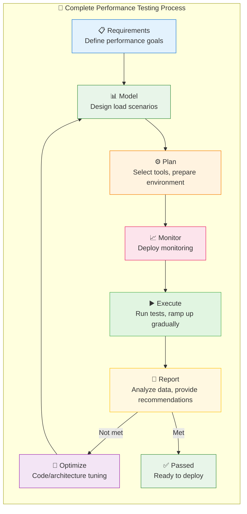

**Detailed breakdown of each step**:

**1. Requirements**

- Define performance goals, such as:
  - TPS ≥ 1000
  - P95 response time ≤ 200ms
  - Availability ≥ 99.9%
- Reference industry standards or historical data
- Confirm SLA with business stakeholders

**2. Performance Model**

- Analyze user behavior, design load scenarios
- Determine scenario proportions (e.g., 80% browsing, 15% ordering, 5% searching)
- Define test script data sets

**3. Performance Plan**

- Select testing tools (Artillery, k6, Locust)
- Prepare test environment (ideally 1:1 with production)
- Design test scripts

**4. Performance Monitoring**

- Deploy monitoring systems
- Collect server metrics (CPU, memory, disk, network)
- Collect application metrics (response time, error rate, TPS)
- Common tools: Prometheus + Grafana

**5. Scenario Execution**

- Execute tests according to plan
- Gradually increase load, observe metric changes
- Log any anomalies

**6. Results Report**

- Analyze data, identify bottlenecks
- Provide optimization recommendations
- Compare against goals, determine pass/fail

### 2.4 When Is Performance Testing Absolutely Required?

Many teams skip performance testing, citing "no time" or "should be fine." But in these scenarios, testing is **mandatory**:

| Scenario                         | Reason                                                                  |
| -------------------------------- | ----------------------------------------------------------------------- |
| **New application launch**       | Estimate post-launch QPS, verify it can handle the load                 |
| **Core high-frequency services** | Payment, ordering, flash sales—performance issues directly cause losses |
| **Before promotions/events**     | E-commerce rush purchases, concert ticketing—must pre-load test         |
| **After architecture changes**   | Microservice splits, database migrations—must verify performance        |
| **Long-running services**        | Detect slow problems like memory leaks, connection pool exhaustion      |

**Hard lessons learned**:

- An e-commerce site skipped load testing before Double Eleven (Singles' Day), database maxed out within the first minute
- A bank's system was upgraded without testing; three days later, a memory leak caused a restart
- A ticket-grabbing system crashed during peak hours, directly costing millions in ticket sales

### 2.5 Performance Testing Tool Comparison

Current mainstream performance testing tools include:

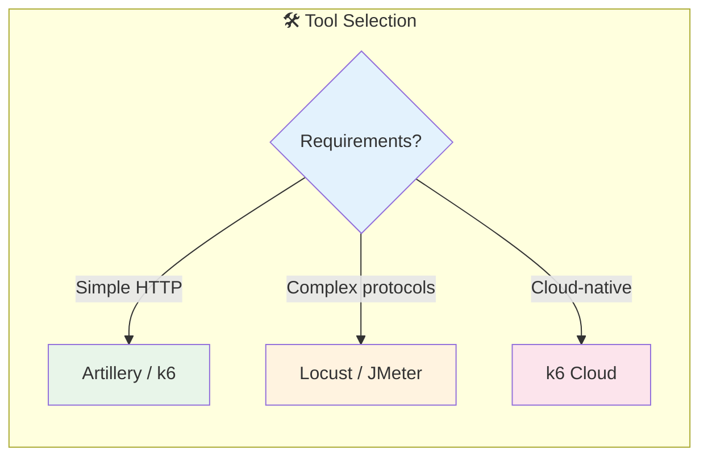

#### 2.5.1 Artillery: The Node.js Native

Artillery is a modern performance testing tool built on Node.js, naturally suited for testing Node.js services.

**Supported protocols**:

- HTTP/HTTPS
- WebSocket
- Socket.io
- Other custom protocols

**Advantages**:

- Simple configuration in YAML/JSON format
- Rich reporting capabilities
- Supports scenario orchestration
- Supports parameterized test data

**Installation**:

```bash
npm install -g artillery
```

**Basic example**: Testing a simple GET endpoint

```yaml
# test.yml
config:
  target: 'http://localhost:3000' # Target address
  phases:
    # Warm-up phase: gradually increase to 5 users over 10 seconds
    - duration: 10
      arrivalRate: 5
      name: 'Warm up'
    # Main test: sustain 20 users for 60 seconds
    - duration: 60
      arrivalRate: 20
      name: 'Sustained load'
  processor: './scenarios.js' # Custom processor

scenarios:
  - name: 'Get user list'
    flow:
      - get:
          url: '/api/users'
          capture:
            - json: '$.data[0].id'
              as: 'userId'
      - get:
          url: '/api/users/{{ userId }}'
```

Run with:

```bash
artillery run test.yml
```

**Sample output**:

```
Report @ 00:00:05 (+05000ms)
--------------------------------------------------
  Period: "Warm up"
  Scenarios launched:  50
  Scenarios completed:  48
  Requests completed:   98
  Mean response time:  45.23 ms
  Min response time:   12.10 ms
  Max response time:  156.78 ms
  RPS sent: 9.71
  Request latency:
    min: 12.10 ms
    max: 156.78 ms
    median: 38.45 ms
    p95: 95.12 ms
    p99: 134.56 ms
--------------------------------------------------
```

**Advanced example**: Parameterization + Think time + Custom checks

```yaml
# advanced-test.yml
config:
  target: 'http://my-api.com'
  phases:
    # 5-minute test, ramping up to 50 users
    - duration: 300
      arrivalRate: 20
      rampTo: 50
  # Read test data from CSV file
  payload:
    path: 'users.csv'
    fields:
      - 'userId'
      - 'token'
    order: 'random'
  # Custom processor
  processor: './scenarios.js'

scenarios:
  - name: 'Complete user flow'
    flow:
      # 1. Login (with parameters)
      - post:
          url: '/api/auth/login'
          json:
            userId: '{{ userId }}'
            token: '{{ token }}'
          capture:
            - json: '$.token'
              as: 'authToken'
          expect:
            - statusCode: 200

      # 2. Think time: simulate user thinking
      - think: 2

      # 3. Get user info
      - get:
          url: '/api/users/me'
          headers:
            Authorization: 'Bearer {{ authToken }}'

      # 4. Get user order list
      - get:
          url: '/api/orders'
          headers:
            Authorization: 'Bearer {{ authToken }}'
```

```javascript
// scenarios.js
const fs = require('fs')

module.exports = {
  // Custom processor: runs before request
  onRequest: (request, userContext, events, done) => {
    // Add random delay to simulate real user
    const delay = Math.random() * 1000
    setTimeout(() => done(), delay)
  },

  // Custom processor: runs after response
  afterResponse: (request, response, userContext, events, done) => {
    // Log response time
    events.log({
      type: 'custom',
      message: `Response time: ${response.elapsedTime}ms`,
    })
    done()
  },
}
```

#### 2.5.2 k6: Developer-Friendly Load Testing Tool

k6 is written in Go, performs exceptionally well, and supports writing test scripts in JavaScript. It emphasizes **developer experience**—scripts are clean and easy to understand.

**Advantages**:

- Excellent performance (written in Go)
- Simple scripting with JavaScript
- Friendly output, multiple formats supported
- Native CI/CD integration
- Cloud service available (k6 Cloud)

**Installation** (Linux/macOS):

```bash
# macOS
brew install k6

# Linux
curl -s https://github.com/grafana/k6/releases/latest/download/k6-latest-linux-amd64.deb -o k6.deb
sudo dpkg -i k6.deb
```

**Basic example**:

```javascript
// script.js
import http from 'k6/http'
import { check, sleep } from 'k6'

// Test configuration
export const options = {
  stages: [
    // Gradually increase to 10 users within 1 minute
    { duration: '1m', target: 10 },
    // Sustain for 3 minutes
    { duration: '3m', target: 10 },
    // Decrease to 0 within 1 minute
    { duration: '1m', target: 0 },
  ],
  thresholds: {
    // P95 response time must be under 500ms
    http_req_duration: ['p(95)<500'],
    // Failure rate must be under 1%
    http_req_failed: ['rate<0.01'],
  },
}

export default function () {
  // Send GET request
  const res = http.get('http://localhost:3000/api/users')

  // Check response status
  check(res, {
    'status is 200': (r) => r.status === 200,
    'response has users': (r) => r.json('data').length > 0,
  })

  // Think time: wait 1 second
  sleep(1)
}
```

Run with:

```bash
k6 run script.js
```

**Sample output**:

```
     ✓ status is 200
     ✓ response has users

     checks.........................: 100.00% ✓ 4523      ✗ 0
     data_received..................: 3.5 MB  45 kB/s
     data_sent......................: 1.2 MB  15 kB/s
     http_req_blocked...............: avg=4.8ms   min=2µs    med=6µs    max=1.2s
     http_req_connecting............: avg=2.1ms   min=0s     med=0s     max=1.1s
     http_req_duration..............: avg=123.4ms min=12ms   med=98ms   max=1.5s
       { expected_response:true }...: avg=123.4ms min=12ms   med=98ms   max=1.5s
     http_req_failed................: 0.00%   ✓ 0         ✗ 4523
     http_reqs......................: 4523    58.2/s
     iteration_duration.............: avg=1.12s   min=1.01s  med=1.09s  max=2.5s
     iterations.....................: 4523    58.2/s
     vus............................: 10      min=10     max=10
     vus_max........................: 10      min=10     max=10
```

**Advanced example**: Complete user flow + Parameterization

```javascript
// advanced-script.js
import http from 'k6/http'
import { check, sleep } from 'k6'
import { Rate, Trend } from 'k6/metrics'

// Custom metrics
const loginDuration = new Trend('login_duration')
const orderDuration = new Trend('order_duration')
const errorRate = new Rate('errors')

// Test configuration
export const options = {
  stages: [
    { duration: '2m', target: 50 }, // Ramp to 50 users in 2 minutes
    { duration: '5m', target: 50 }, // Sustain for 5 minutes
    { duration: '2m', target: 0 }, // Ramp down in 2 minutes
  ],
  thresholds: {
    http_req_duration: ['p(95)<200'], // P95 < 200ms
    login_duration: ['p(95)<100'], // Login P95 < 100ms
    order_duration: ['p(95)<500'], // Order P95 < 500ms
    errors: ['rate<0.05'], // Error rate < 5%
  },
}

// Read config from environment variables
const BASE_URL = __ENV.BASE_URL || 'http://localhost:3000'

// Test scenarios
export default function () {
  // ===== Scenario 1: User Login =====
  const loginRes = http.post(
    `${BASE_URL}/api/auth/login`,
    JSON.stringify({
      username: `user${__VU}`, // __VU is the virtual user ID
      password: 'test123',
    }),
    {
      headers: { 'Content-Type': 'application/json' },
      tags: { name: 'login' },
    },
  )

  loginDuration.add(loginRes.timings.duration)

  check(loginRes, {
    'login successful': (r) => r.status === 200,
    'has token': (r) => r.json('token') !== undefined,
  }) || errorRate.add(1)

  const token = loginRes.json('token')
  const headers = {
    Authorization: `Bearer ${token}`,
    'Content-Type': 'application/json',
  }

  sleep(1)

  // ===== Scenario 2: Get product list =====
  const productsRes = http.get(`${BASE_URL}/api/products`, {
    headers,
    tags: { name: 'products' },
  })

  check(productsRes, {
    'products loaded': (r) => r.status === 200,
    'has products': (r) => r.json('data').length > 0,
  }) || errorRate.add(1)

  // Randomly select a product
  const products = productsRes.json('data')
  const randomProduct = products[Math.floor(Math.random() * products.length)]

  sleep(1)

  // ===== Scenario 3: Create order =====
  const orderRes = http.post(
    `${BASE_URL}/api/orders`,
    JSON.stringify({
      productId: randomProduct.id,
      quantity: Math.floor(Math.random() * 3) + 1,
    }),
    {
      headers,
      tags: { name: 'order' },
    },
  )

  orderDuration.add(orderRes.timings.duration)

  check(orderRes, {
    'order created': (r) => r.status === 201,
    'has orderId': (r) => r.json('orderId') !== undefined,
  }) || errorRate.add(1)

  // Think time
  sleep(2)
}
```

**Output to InfluxDB + Grafana** (real-time monitoring):

```bash
# Specify output when starting
k6 run --out influxdb=http://localhost:8086/k6 script.js
```

Then import the k6 template in Grafana to see a real-time dashboard:

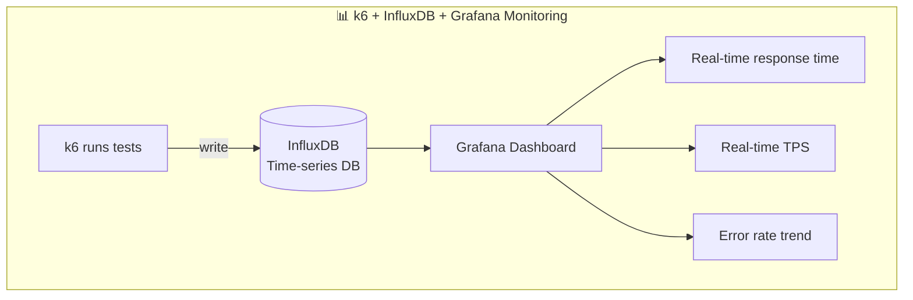

### 2.6 Combining APM Tools: Pinpointing Code-Level Bottlenecks

Performance testing tools tell you "the system is slow." APM tools tell you **where** it's slow and **why**.

**What can APM do**:

- Trace the complete call chain for each request
- Show time spent at each stage
- Identify slow database queries
- Discover external API latency
- Locate memory leaks

**Common APM tools**:

| Tool                           | Type        | Characteristics                   |
| ------------------------------ | ----------- | --------------------------------- |
| **New Relic**                  | Commercial  | Full-featured, end-to-end tracing |
| **Datadog**                    | Commercial  | Cloud-native, strong integration  |
| **Elastic APM**                | Open source | Integrates with ELK stack         |
| **Prometheus + OpenTelemetry** | Open source | Self-hosted, fully controllable   |

**Typical usage scenario**:

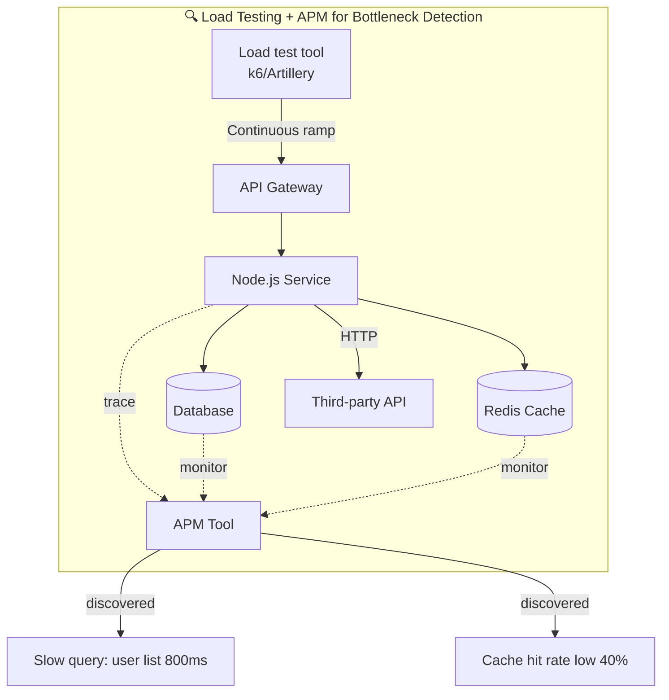

**Hands-on: Tracking Down a Performance Problem**

Say load testing revealed P95 response time hit 1 second, but it should be < 200ms.

1. Check APM trace records to find slow requests
2. APM shows: database query taking 800ms
3. Check the specific SQL: missing index found
4. Add index
5. Re-run load test: P95 drops to 150ms

### 2.7 Performance Testing Checklist

Before each performance test, run through this checklist:

**Pre-Test Preparation**

- [ ] Define performance goals (TPS, response time, error rate)
- [ ] Prepare test data (real distribution, no fake data)
- [ ] Test environment matches production as closely as possible
- [ ] Monitoring systems deployed and operational
- [ ] Test scripts written and reviewed

**During Test Execution**

- [ ] Start from low load, increase gradually
- [ ] Observe metric changes at each stage
- [ ] Log any anomalies
- [ ] Run multiple times to verify consistency

**Post-Test Analysis**

- [ ] Compare actual results against goals
- [ ] Identify bottleneck locations
- [ ] Provide optimization recommendations
- [ ] Document results as baseline

---

## Part Three: Testing in CI/CD—From Manual to Automated

### 3.1 Why Integrate Testing Into CI/CD?

You might wonder: "I tested it locally, why run it again in CI?"

Because:

- **Prevent merges from breaking code**: Someone else's code changes might affect your module
- **Enforce quality gates**: CI failing blocks the merge, ensuring a quality baseline
- **Continuous monitoring**: Every code change gets tested, problems caught early

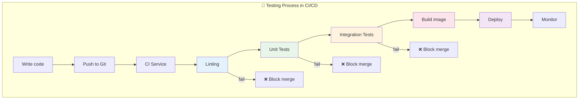

### 3.2 GitHub Actions Example

```yaml
# .github/workflows/test.yml
name: Tests

on:
  push:
    branches: [main]
  pull_request:
    branches: [main]

jobs:
  unit-test:
    runs-on: ubuntu-latest
    steps:
      - uses: actions/checkout@v3
      - uses: actions/setup-node@v3
        with:
          node-version: '18'
          cache: 'npm'
      - run: npm ci
      - run: npm test
      - uses: codecov/codecov-action@v3
        with:
          file: ./coverage/lcov.info

  performance-test:
    runs-on: ubuntu-latest
    needs: unit-test # Only runs after unit tests pass
    steps:
      - uses: actions/checkout@v3
      - uses: actions/setup-node@v3
        with:
          node-version: '18'
      - run: npm ci
      - run: npm run start:prod &
      - run: npx k6 run tests/performance.js
```

---

## Part Four: Summary

Unit testing and performance testing are the two pillars of Node.js application quality assurance.

**Unit testing addresses "Is the code correct?"**:

- Organize tests using the AAA pattern
- Pursue meaningful coverage, not just numbers
- Choose the right framework (Mocha/Jest/Vitest)
- Use mocks to isolate external dependencies

**Performance testing addresses "Can the system handle the load?"**:

- Four types of tests, each with its own purpose
- Artillery and k6 are excellent tools
- Combine with APM to pinpoint code-level bottlenecks
- Integrate testing into CI/CD for continuous monitoring

**Here's a final diagram summarizing the entire guide**:

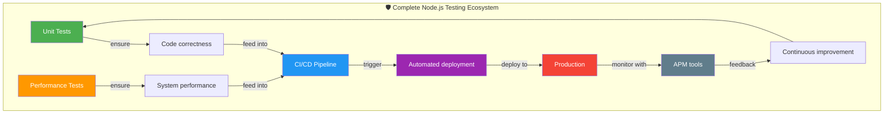

Testing isn't a one-time task—it should become part of your development culture, a daily habit. Only through continuous testing and continuous improvement can you build reliable, high-performance Node.js applications.

Good luck writing high-quality code and running beautiful tests!
