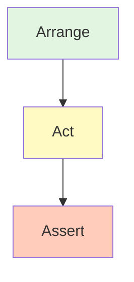
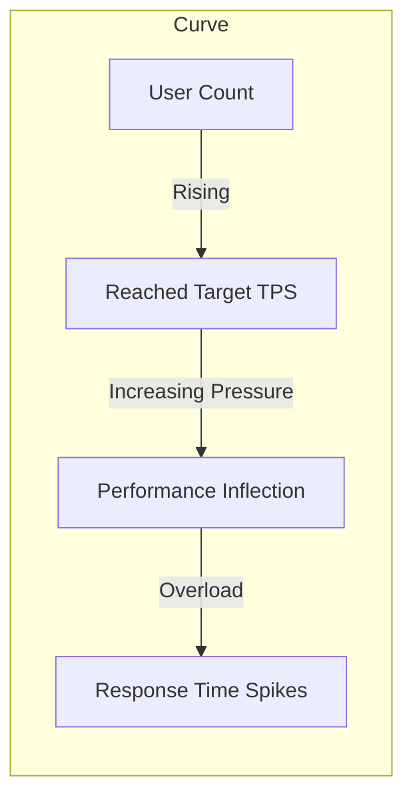
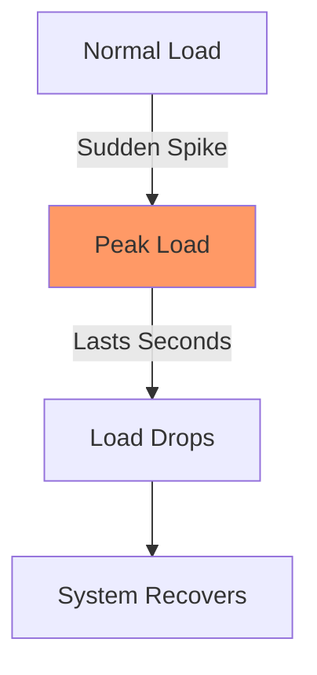
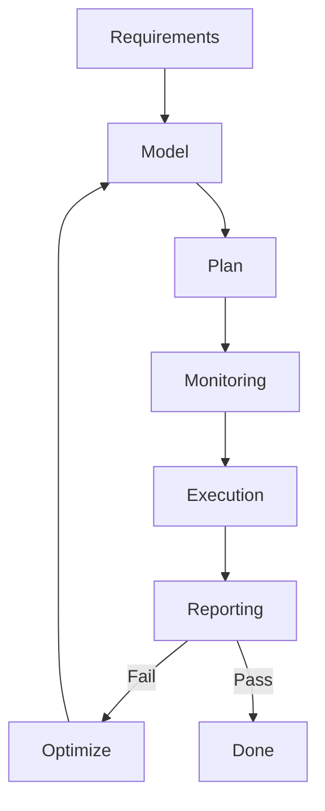
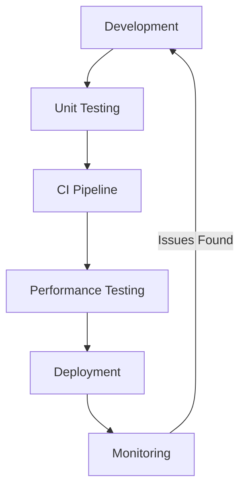

## Introduction

In the software development lifecycle, testing is a critical step for ensuring code quality and system stability. For Node.js applications, unit testing helps verify module correctness, while performance testing ensures the system remains reliable under load. This article starts with the basics of unit testing, dives into the AAA pattern, test coverage, and compares mainstream frameworks (Mocha, Jest, Vitest). We will then explore performance testing types, workflows, and tools (Artillery, k6), providing a comprehensive testing framework.

## 1. Unit Testing

### 1.1 Why Unit Testing?

Unit testing checks the smallest testable parts of software (e.g., functions, methods). Its value includes:

- **Improving Code Quality**: Catch logic errors and boundary conditions early, preventing defects from leaking into later stages.
- **Facilitating Refactoring**: Provides a safety net when changing code, ensuring behavior remains as expected.
- **Living Documentation**: Test cases serve as documentation for module functionality; new members can understand module purposes through tests.
- **Increasing Efficiency**: Automated tests reduce manual regression work and quickly locate introduced issues.

**Analogy**: Unit testing is like inspecting the steel bars of a building to ensure each one meets standards for overall safety.

### 1.2 How to Write Unit Tests: The AAA Pattern

The **AAA pattern** is a classic paradigm for unit testing, dividing it into three stages:

1. **Arrange**: Initialize objects, set up input data, and prepare the environment.
2. **Act**: Call the function or method being tested to get actual output.
3. **Assert**: Verify that the actual output matches the expectation.

**Workflow**:



**Example**: Testing a simple addition function.

```javascript
// math.js
export function add(a, b) {
	return a + b
}
```

```javascript
// test/math.test.js
import assert from 'node:assert'
import { add } from '../math.js'

describe('add function test', () => {
	it('should return the sum of two numbers', () => {
		// Arrange
		const a = 2,
			b = 3
		const expected = 5

		// Act
		const result = add(a, b)

		// Assert
		assert.strictEqual(result, expected)
	})

	it('should handle negative numbers correctly', () => {
		assert.strictEqual(add(-1, 1), 0)
	})

	it('should handle zero correctly', () => {
		assert.strictEqual(add(0, 0), 0)
	})
})
```

### 1.3 Test Coverage

**Test coverage** measures how much code is exercised by tests. Key metrics include:

- **Statement Coverage**: Percentage of executed statements.
- **Branch Coverage**: Percentage of executed conditional branches (e.g., if-else).
- **Function Coverage**: Percentage of called functions.
- **Line Coverage**: Percentage of executed lines of code.

**Coverage Report Example** (using Istanbul/NYC):

```bash
--------------|---------|----------|---------|---------|-------------------
File          | % Stmts | % Branch | % Funcs | % Lines | Uncovered Line #s
--------------|---------|----------|---------|---------|-------------------
All files     |   85.71 |       75 |     100 |   85.71 |
 math.js      |   85.71 |       75 |     100 |   85.71 | 5-6
--------------|---------|----------|---------|---------|-------------------
```

Usually, a threshold (e.g., 80%) is set. However, high coverage doesn't guarantee the absence of bugs; focus should remain on core logic.

### 1.4 Comparison of Node.js Unit Testing Frameworks

| Feature | Mocha | Jest | Vitest |
| :--- | :--- | :--- | :--- |
| **Assertion Lib** | Needs pairing (e.g., Chai) | Built-in | Built-in (Jest-compatible) |
| **Mock/Stub** | Needs pairing (e.g., Sinon) | Built-in | Built-in |
| **Snapshot Testing** | Needs pairing | Built-in | Built-in |
| **Parallel Execution** | Needs config | Automatic | Automatic (Vite-based) |
| **ESM Support** | Needs config | Good | Native support |
| **Best For** | Flexibility, Customization | React projects, All-in-one | Vite projects, Performance |

#### 1.4.1 Mocha Example

Mocha is a flexible framework often paired with Chai and Sinon.

```javascript
import { expect } from 'chai'
import sinon from 'sinon'
import axios from 'axios'
import { fetchData } from './api.js'

describe('fetchData', () => {
	it('should fetch data successfully', async () => {
		const stub = sinon.stub(axios, 'get').resolves({ data: { id: 1 } })
		const result = await fetchData(1)
		expect(result).to.deep.equal({ id: 1 })
		expect(stub.calledOnce).to.be.true
		stub.restore()
	})
})
```

#### 1.4.2 Jest Example

Jest is a zero-config framework by Facebook.

```javascript
// user.test.js
import { createUser } from './user.js'
import { fetchData } from './api.js'

jest.mock('./api.js')

test('createUser should return object with name and id', () => {
	const user = createUser('Alice')
	expect(user).toHaveProperty('id')
	expect(user.name).toBe('Alice')
})
```

#### 1.4.3 Vitest Example

Vitest is designed for Vite, compatible with Jest API but faster.

```javascript
import { describe, it, expect } from 'vitest'
import { add } from './math'

describe('add', () => {
	it('should add two numbers', () => {
		expect(add(2, 3)).toBe(5)
	})
})
```

#### 1.4.4 Async Testing and Hooks

All frameworks support `async/await`. Hooks like `before`, `after`, `beforeEach`, `afterEach` are used for setup and teardown.

---

## 2. Performance Testing

### 2.1 What is Performance Testing?

Performance testing uses automated tools to simulate various loads and measure system response time, throughput, and resource utilization to evaluate bottlenecks and stability.

### 2.2 Types of Performance Testing

#### 2.2.1 Baseline Test
Acquires system performance metrics under low load (single user) to set a benchmark.

#### 2.2.2 Load Test (Capacity Test)
Verifies system behavior under expected load to ensure it meets requirements.

**Load Curve Diagram**:



#### 2.2.3 Endurance Test (Stability Test)
Validates system stability over long periods (e.g., 8-24 hours) to check for memory or connection leaks.

#### 2.2.4 Stress Test (Spike Test)
Tests behavior under sudden extreme load and recovery capabilities.

**Anomaly Test Diagram**:



### 2.3 Performance Testing Workflow

1. **Requirements**: Define goals (e.g., TPS ≥ 1000, P95 ≤ 200ms).
2. **Model**: Design load based on user behavior (e.g., login vs. browse ratio).
3. **Plan**: Select tools, prepare scripts, and environment.
4. **Monitoring**: Deploy Prometheus + Grafana to collect server metrics.
5. **Execution**: Run tests, ramp up pressure, and record data.
6. **Reporting**: Analyze data, locate bottlenecks, and suggest optimizations.

**Workflow Diagram**:



### 2.4 Performance Testing Tools

#### 2.4.1 Artillery
A modern, Node.js-based tool supporting HTTP, WebSocket, etc. Configuration is in YAML.

```yaml
config:
  target: 'http://localhost:3000'
  phases:
    - duration: 60
      arrivalRate: 10
scenarios:
  - flow:
      - get:
          url: '/api/users'
```

#### 2.4.2 k6
A high-performance load testing tool written in Go, using JavaScript for scripts. Focuses on developer experience and CI/CD integration.

```javascript
import http from 'k6/http'
import { check, sleep } from 'k6'

export const options = {
	stages: [
		{ duration: '1m', target: 10 },
		{ duration: '3m', target: 10 },
		{ duration: '1m', target: 0 },
	],
	thresholds: {
		http_req_duration: ['p(95)<500'],
		http_req_failed: ['rate<0.01'],
	},
}

export default function () {
	const res = http.get('http://localhost:3000/api/users')
	check(res, { 'is status 200': (r) => r.status === 200 })
	sleep(1)
}
```

### 2.5 Combined with APM Tools

Performance testing should be combined with APM tools (e.g., New Relic, Datadog, Prometheus + OpenTelemetry) to analyze code-level bottlenecks like slow DB queries or external service latency.

---

## 3. Summary

Unit and performance testing are the pillars of Node.js quality assurance. Unit tests ensure correct logic, while performance tests guarantee stability under production load. Testing should be integrated into the CI/CD pipeline as part of the development culture.

**Summary Diagram**:


