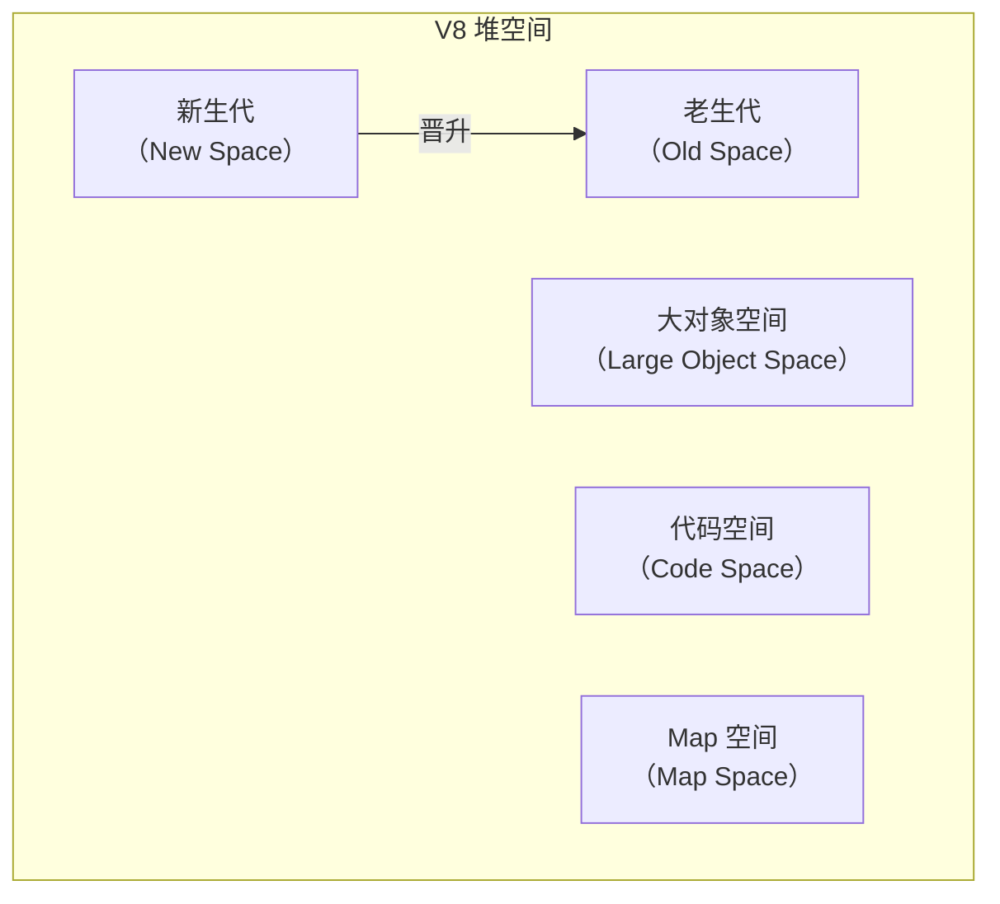
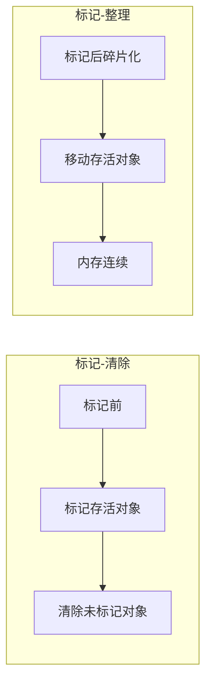

## 一、V8 内存模型：栈与堆的博弈

Node.js 基于 V8 引擎，其内存管理继承了 V8 的分代式垃圾回收策略。理解 V8 的内存布局是排查内存泄露的前提。

### 1.1 栈（Stack）与堆（Heap）

- **栈（Stack）**：存储基础类型（Number、String、Boolean 等）和指向对象的指针。由操作系统自动管理，函数调用结束时自动释放，读写速度极快，但空间有限。
- **堆（Heap）**：存储复杂的引用类型（Object、Array、Buffer、Closure 等）。这是垃圾回收（GC）的主战场，空间大，但需要 GC 来回收不再使用的内存。

V8 将堆进一步划分为几个区域（Space），其中最核心的是**新生代（New Space）**和**老生代（Old Space）**。



### 1.2 垃圾回收（GC）的核心算法

V8 采用分代回收策略，对不同生命周期的对象使用不同算法，以平衡吞吐和延迟。

#### 1.2.1 新生代（Scavenge 算法）

新生代存放生命周期短的对象（如函数局部变量）。它被划分为两个等大的半空间（Semi-space）：From 和 To。

- **分配**：新对象始终分配在 From 空间。
- **回收**：当 From 空间快满时，触发 Scavenge 回收。
  - 使用 **Cheney 算法**（广度优先复制），将 From 空间中存活的对象复制到 To 空间。
  - 复制过程中会进行指针调整，保证对象间的引用关系不变。
  - 复制完成后，From 和 To 角色互换。
- **晋升**：如果一个对象经过多次 Scavenge 仍然存活，或 To 空间已使用超过 25%，它将被移动到老生代。

**特点**：速度快（只复制存活对象，且存活对象比例通常很小），但空间利用率仅 50%。

#### 1.2.2 老生代（Mark-Sweep & Mark-Compact）

老生代存放从新生代晋升的长期存活对象（如缓存、全局对象、闭包）。老生代空间较大，不能简单地复制，因此采用**标记-清除（Mark-Sweep）**和**标记-整理（Mark-Compact）**算法。

- **标记-清除**：
  1.  **标记**：从根对象（全局对象、栈中的变量）出发，递归遍历所有可达对象，并打上标记。
  2.  **清除**：遍历堆，回收所有未标记的对象，并将标记清除。
  - 缺点：回收后内存空间可能变得碎片化，导致无法分配大对象。
- **标记-整理**：
  - 在标记之后，将存活对象向堆的一端移动，然后清理边界外的内存。这解决了碎片问题，但移动对象开销较大，因此 V8 会根据碎片程度决定何时进行整理。



#### 1.2.3 Oilpan：C++ 对象的 GC

2026 年的 Node.js 深度集成了 **Oilpan**——这是 V8 专门用于管理 C++ 对象的垃圾回收器。它负责处理那些由 C++ 层分配但被 JavaScript 穿透引用的复杂对象（如 `Buffer` 的底层内存、Native Addons 创建的对象）。Oilpan 与 V8 的主 GC 协同工作，确保外部内存（External Memory）也能被精准回收，减少了以往常见的“外部内存泄露”问题。

#### 1.2.4 现代 V8 演进：并发与增量

早期的 V8 在执行 GC 时会暂停所有 JavaScript 执行（“Stop-the-world”），导致应用卡顿。现代 V8 通过以下技术大幅减少了停顿：

- **增量标记（Incremental Marking）**：将标记工作拆分成多个小步骤，穿插在 JavaScript 执行间隙完成。
- **并发标记（Concurrent Marking）**：在多个辅助线程上同时进行标记，不阻塞主线程。
- **并行回收（Parallel GC）**：在清理阶段，多个线程并行处理。

这些优化使得 GC 停顿时间从百毫秒级降至毫秒级甚至微秒级，对高实时性应用（如游戏、实时通信）至关重要。

---

## 二、内存泄露的四大典型场景

内存泄露的本质是**不再需要的对象仍然被引用**，导致 GC 无法回收。下面列举 Node.js 中最常见的内存泄露场景，并附代码示例。

### 2.1 隐蔽的闭包泄露

闭包是 Node.js 的灵魂，也是泄露的高发区。当一个闭包引用了外部的大对象，而该闭包本身又被长期持有，那么大对象将永远无法回收。

```javascript
// 错误示例
import fs from 'node:fs'

function createLeakingClosure() {
	const hugeBuffer = Buffer.alloc(1024 * 1024 * 10) // 10MB
	return () => {
		// 虽然只用了 hugeBuffer 的一小部分，但整个 Buffer 都会被留在闭包中
		console.log(hugeBuffer[0])
	}
}

const leak = createLeakingClosure()
// hugeBuffer 无法被回收，因为 leak 一直持有它
```

**解决方案**：确保闭包只引用必要的对象，或在使用完后将引用置为 `null`。如果大对象只需使用一次，可以考虑在闭包内用完后手动释放：

```javascript
function createSafeClosure() {
	let hugeBuffer = Buffer.alloc(1024 * 1024 * 10)
	return () => {
		if (!hugeBuffer) return
		console.log(hugeBuffer[0])
		hugeBuffer = null // 释放引用
	}
}
```

### 2.2 遗忘的 EventEmitter 监听器

`EventEmitter` 是 Node.js 异步架构的基础。如果你在请求处理函数中不断向全局对象绑定监听器且不解绑，监听器会一直持有其所在上下文的引用，导致内存泄露。

```javascript
import { EventEmitter } from 'node:events'
const globalEmitter = new EventEmitter()

export async function handleRequest(req, res) {
	const onData = (data) => {
		console.log('Received data')
	}

	// 每次请求都添加一个新的监听器
	globalEmitter.on('update', onData)

	// ！！！忘记在请求结束时移除监听器
	res.end('OK')
}
```

随着请求增多，监听器数量无限增长，每个监听器都持有 `onData` 函数，而 `onData` 又可能通过闭包引用大对象，导致雪崩。

**解决方案**：始终在适当时候（如请求结束、响应完成）移除监听器，或使用 `once` 方法（只触发一次）。现代 Node.js 还可以利用 `AbortController` 统一清理（见后文）。

### 2.3 幽灵定时器

未清理的 `setInterval` 或 `setTimeout` 会持有其回调函数中的引用，导致相关上下文无法释放。

```javascript
function startTask(data) {
	// 即使 data 不再使用，由于定时器在运行，它将一直存在于堆中
	const timer = setInterval(() => {
		process.send(data.status)
	}, 1000)

	// 必须有对应的 clearInterval(timer) 逻辑
}
```

如果 `startTask` 被多次调用且没有清理之前的定时器，内存中会积累大量定时器对象及其关联的数据。

**解决方案**：始终保存定时器 ID，并在不需要时清除。对于周期性任务，考虑使用 `setInterval` 并配合条件判断，或者改用 `setTimeout` 递归实现更灵活的控制。

### 2.4 资源流（Streams）未正常关闭

在高并发文件或网络操作中，如果流没有正确触发 `close` 或 `end`，底层的文件描述符和缓冲区将常驻内存。

```javascript
import fs from 'node:fs'

function processFile() {
	const stream = fs.createReadStream('large-file.bin')
	stream.on('data', (chunk) => {
		// 处理数据...
	})
	// 如果中途报错导致流程中断，且没有处理 error/close 事件
	// stream 内部的缓冲区可能产生泄露
}
```

当流因为错误而终止时，必须确保销毁流并释放资源。可以监听 `error` 事件并调用 `stream.destroy()`。

### 2.5 SSR 环境下的“单例陷阱”

在 Next.js 或 Nuxt.js 等 SSR 框架中，**单例模式是泄露的重灾区**。由于 Node.js 进程是长久运行的，而在服务端渲染期间，如果你在模块顶层定义了一个全局变量或单例（如 `const cache = new Map()`），这个变量将会在**所有用户请求之间共享**。

```javascript
// lib/auth.js (单例泄露示例)
const userCache = new Map() // 在模块顶层定义，跨请求持久存在

export async function getUserData(userId) {
	if (userCache.has(userId)) return userCache.get(userId)

	const data = await fetchUserData(userId)
	userCache.set(userId, data) // ！！！泄露点：用户量大时，userCache 永不清理，直至 OOM
	return data
}
```

随着用户量增长，`userCache` 无限膨胀，最终导致 OOM。

**防御建议**：在 SSR 环境中，严禁在全局作用域存储请求相关的数据。如果必须使用缓存，请务必设置 **TTL（过期时间）** 或使用 **LRU（最近最少使用）** 策略限制容量，例如使用 `lru-cache` 包。

````javascript
import { LRUCache } from 'lru-cache'

const userCache = new LRUCache({ max: 500, ttl: 1000 * 60 * 10 }) // 最多500条，存活10分钟
```
---

## 三、2026 现代防御策略

随着 Node.js 的发展，标准库提供了更强大的工具来管理资源生命周期，避免手动清理的繁琐和遗漏。

### 3.1 AbortController：统一销毁信号

`AbortController` 最初用于中止 Fetch 请求，如今已扩展到支持 `EventEmitter`、流、定时器等。它提供了一个统一的信号机制，可以同时取消多个异步操作。

```javascript
import { EventEmitter } from 'node:events'
import { setTimeout } from 'node:timers/promises'
import { Readable } from 'node:stream'

const controller = new AbortController()
const { signal } = controller

const emitter = new EventEmitter()

// 将信号传递给监听器
emitter.on(
	'data',
	(data) => {
		console.log(data)
	},
	{ signal },
)

// 也可以用于定时器（使用 Promises API）
setTimeout(1000, 'Timeout Value', { signal })
	.then(console.log)
	.catch((err) => {
		if (err.name === 'AbortError') console.log('定时器已安全取消')
	})

// 或者用于流
const stream = Readable.from([1, 2, 3], { signal })

// 一键清理所有绑定了该信号的监听器、定时器、流或 Fetch 请求
controller.abort()
````

controller.abort()

````

当 `controller.abort()` 被调用时，所有注册了该 `signal` 的异步资源都会自动清理，大大降低了资源泄露风险。

### 3.2 FinalizationRegistry：泄露的“自动预警机”

`FinalizationRegistry` 允许你在对象被垃圾回收时注册一个回调。虽然不能直接防止泄露，但可以用来监控关键对象是否被正确回收，从而发现潜在的泄露点。

```javascript
// 泄露预警器
const registry = new FinalizationRegistry((heldValue) => {
	console.warn(`[GC Alert]: 对象 "${heldValue}" 已被成功回收`)
})

function createSession(user) {
	const session = { id: Math.random(), user }
	// 注册监控，如果 session 被 GC，会触发回调
	registry.register(session, `Session_${session.id}`)
	return session
}

// 模拟使用
let s = createSession('Alice')
s = null // 解除引用，期待 GC 回收

// 如果你在代码运行很久后依然没看到回调，说明该 session 可能产生了泄露
````

注意：回调可能在对象被回收后的任意时间触发，且不保证一定触发（例如在进程退出前）。它主要用于调试和监控，不应依赖它来执行关键逻辑。

---

## 四、检测与调试实战

当怀疑内存泄露时，我们需要一套科学的排查流程。以下是 Node.js 生态中常用的内存调试工具和方法。

### 4.1 内存快照分析（Heap Snapshot）

生成堆快照是最直观的排查手段。通过比较两个时间点的快照，可以发现哪些对象数量在增长。

**生成快照**：

```bash
# 启动时开启 inspect 模式
node --inspect app.js
```

然后在 Chrome 浏览器中打开 `chrome://inspect`，点击“Open dedicated DevTools for Node”。进入 **Memory** 标签，点击“Take Snapshot”。

**关键指标解读**：

- **Shallow Size**：对象本身占用的内存（不包括引用的对象）。
- **Retained Size**：对象及其所有引用的子对象占用的总内存。回收该对象能释放的总量。
- **对比快照**：在两次快照后，选择“Comparison”视图，查看新增的对象类型和数量。重点关注那些持续增加且未被释放的对象。

**常见泄露对象**：

- 大量闭包（`(closure)`）
- 累积的 `EventListener`
- `Detached HTML`（如果在 Node.js 中涉及 DOM，但一般不会）
- 未清理的 `Buffer`

### 4.2 生产环境热诊断

在生产环境中，无法随时暂停进程生成快照（会导致应用卡顿）。此时可以通过监控内存指标来预警。

#### 4.2.1 使用 `process.memoryUsage()`

`process.memoryUsage()` 返回一个对象，包含：

- `rss`：常驻集大小（Resident Set Size），进程占用的物理内存。
- `heapTotal`：V8 分配的堆总大小。
- `heapUsed`：已使用的堆内存。
- `external`：V8 管理的 C++ 对象内存（如 Buffer）。
- `arrayBuffers`：为 `ArrayBuffer` 和 `SharedArrayBuffer` 分配的内存（独立于 external）。

```javascript
setInterval(() => {
	const { heapUsed, rss } = process.memoryUsage()
	console.log(`Heap: ${Math.round(heapUsed / 1024 / 1024)}MB | RSS: ${Math.round(rss / 1024 / 1024)}MB`)
}, 10000)
```

如果 `heapUsed` 持续上升且从不下降（即使在没有请求时），很可能存在内存泄露。

#### 4.2.2 使用 `node --expose-gc` 手动触发 GC

在调试环境中，我们可以通过命令行参数暴露 `global.gc()` 方法，手动触发全量 GC，以确认内存是否真的无法释放。

```bash
node --expose-gc inspect.js
```

在代码中：

```javascript
if (global.gc) {
	console.log('手动触发 GC')
	global.gc()
	console.log(process.memoryUsage())
} else {
	console.warn('GC 未暴露，请使用 --expose-gc 启动')
}
```

执行 GC 后观察 `heapUsed` 是否显著下降。如果下降很少，说明可能存在真正的泄露。

### 4.3 强力武器：`node --report`

对于生产环境的 OOM，生成 Heap Snapshot 可能导致进程瞬间卡死。更优雅的方案是使用 Node.js 内置的 **Diagnostic Report**。它会在发生特定事件（如致命错误、OOM、用户信号）时生成一份 JSON 报告，包含丰富的诊断信息，而不会停止进程。

**启用报告**：

```bash
# 在 OOM 或收到特定信号时自动生成 JSON 报告
node --report-on-fatalerror --report-on-signal --report-signal=SIGUSR2 app.js
```

可以通过向进程发送 `SIGUSR2` 信号来手动触发报告生成：

```bash
kill -USR2 <pid>
```

生成的 `.json` 报告包含：

- 堆内存占用分布（按类型）
- 资源限制（Resource Limits）
- 调用栈（JavaScript 和 C++）
- 所有的 `libuv` 句柄（帮你发现未关闭的 Socket 或定时器）
- 系统信息（CPU、内存、负载）

这是排查线上突发内存问题**开销最低、信息密度最高**的手段。

### 4.4 第三方工具

- **clinic.js**：一个 Node.js 性能诊断工具集，包括 `clinic doctor`、`clinic flame`、`clinic bubbleprof`，可以生成火焰图、内存走势图等，直观展示问题。
- **heapdump**：老牌模块，可以在运行时生成堆快照（通过信号触发），但需要额外安装。

---

## 五、优化建议总结

1.  **优先使用 WeakMap/WeakSet**：它们对对象的引用是“弱”的，不影响垃圾回收。非常适合做缓存或存储元数据，避免因缓存导致对象无法回收。

    ```javascript
    const cache = new WeakMap()
    function processObject(obj) {
    	if (!cache.has(obj)) {
    		cache.set(obj, expensiveComputation(obj))
    	}
    	return cache.get(obj)
    }
    // 当 obj 不再被其他地方引用时，cache 中的条目自动消失
    ```

2.  **避免全局变量**：全局变量是老生代的常驻居民，除非必要，否则应限制其作用域。使用模块级变量时要警惕闭包。

3.  **流式处理大数据**：不要用 `fs.readFile` 一次性读取大文件，始终优先选择 `fs.createReadStream`。同样，写入大文件用流。

4.  **自动化清理**：利用 `AbortController` 统筹异步资源的生命周期，减少手动清理遗漏。

5.  **设置缓存上限**：如果必须使用内存缓存，务必设置大小限制和过期时间（TTL），防止无限增长。

6.  **定期压测**：使用 `k6` 或 `Artillery` 进行长达数小时的压力测试，观察内存斜率是否平稳。内存使用应随时间呈周期性波动（GC 后回落），而不是单调递增。

7.  **监控与告警**：在生产环境部署内存监控（如 Prometheus + Grafana），设置合理的告警阈值（如 `heapUsed` 持续 15 分钟上涨超过 20%）。
