## 引言：为什么安全如此重要？

现代 Web 应用面临各种各样的攻击。攻击者利用开发者的疏忽，通过精心构造的请求绕过防御。Node.js 作为后端主力，其安全性直接影响整个系统。下面我们从常见漏洞开始，每一部分都配有攻击流程图或原理示意图，帮助理解。

## 一、常见 Web 安全漏洞与防护

### 1. CSRF（跨站请求伪造）

**攻击原理**
当用户已登录受信网站 A，攻击者诱导用户访问恶意网站 B，B 中的隐藏请求自动携带 A 的 Cookie 发往 A，执行非授权操作。

**CSRF 攻击流程图**

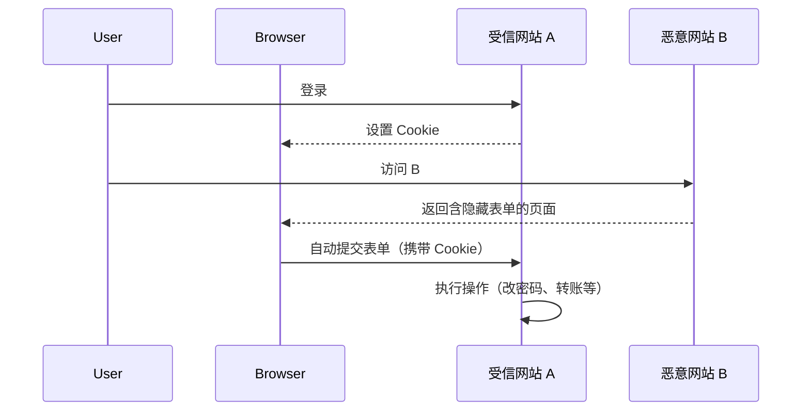

**防护**

- CSRF 令牌
- SameSite Cookie
- 验证 Referer

**Node.js 示例**（使用 `csurf`）

```javascript
const csrf = require('csurf')
const csrfProtection = csrf({ cookie: true })
app.get('/form', csrfProtection, (req, res) => {
	res.render('form', { csrfToken: req.csrfToken() })
})
app.post('/process', csrfProtection, (req, res) => {
	/* ... */
})
```

---

### 2. XSS（跨站脚本攻击）

**XSS 分类图**

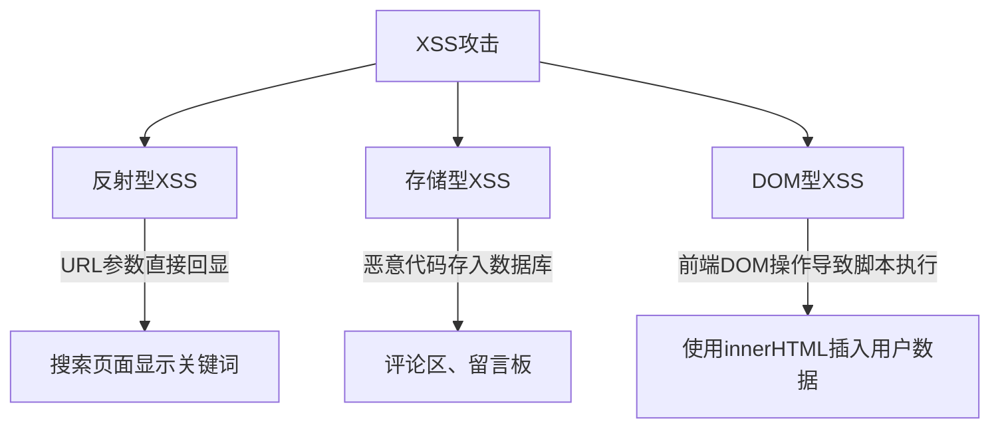

**反射型 XSS 流程**

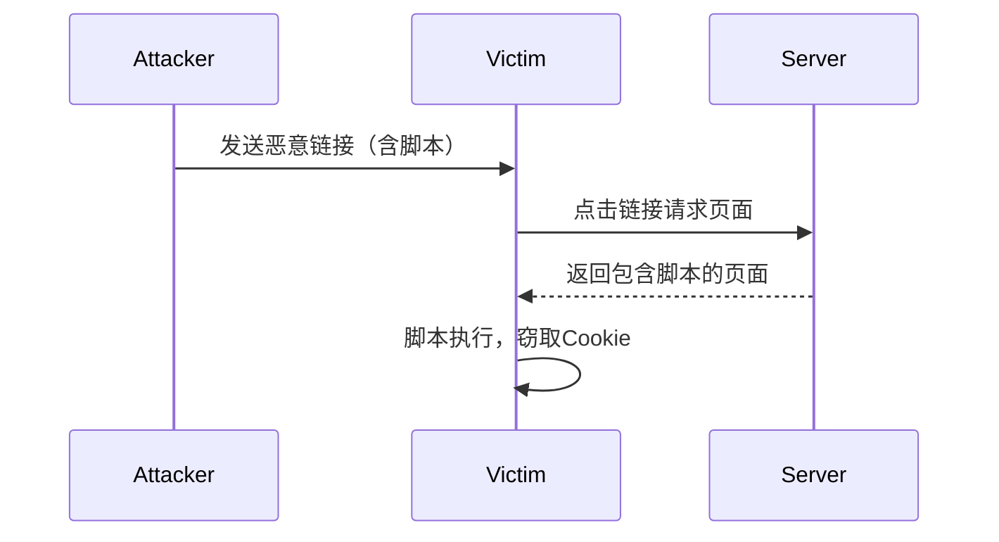

**防护**

- 输入过滤（`xss` 库）
- 输出转义（模板引擎默认转义）
- CSP 头

```javascript
const xss = require('xss')
const clean = xss(userInput)
```

---

### 3. 越权漏洞

**水平越权与垂直越权**

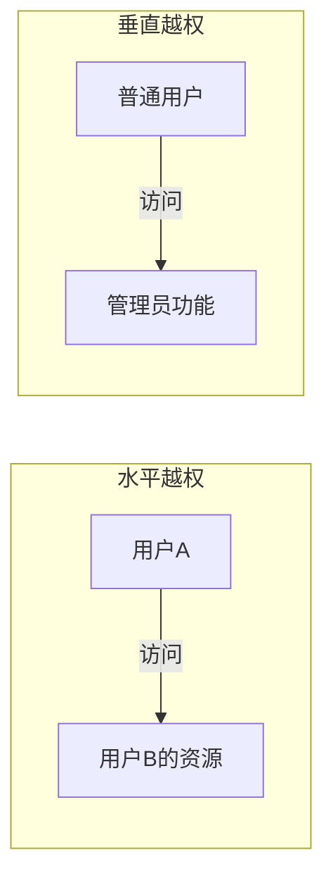

**典型场景**

- URL 中包含可猜测的 ID：`/order/1001`，攻击者遍历 ID 查看他人订单。
- 管理后台未校验权限：`/admin/deleteUser` 被普通用户访问。

**防护**

- 从 session 获取当前用户 ID，与资源所有者比对。
- 使用 UUID 替代自增 ID。
- 登录态过期后清除客户端信息。

```javascript
app.get('/order/:id', async (req, res) => {
	const order = await Order.findById(req.params.id)
	if (order.userId !== req.session.userId) {
		return res.status(403).end()
	}
	res.json(order)
})
```

---

### 4. SSRF（服务器端请求伪造）

**SSRF 攻击路径**

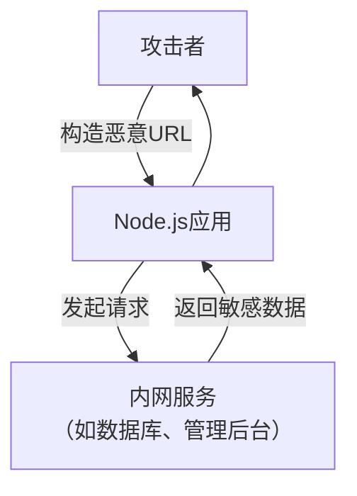

**常见功能点**

- 图片下载：用户输入图片 URL，服务器获取后存储。
- 网页截图、代理抓取。
- Webhook 回调。

**防护**

- 解析 URL 获取 IP，禁止内网 IP（127.0.0.0/8, 10.0.0.0/8, 172.16.0.0/12, 192.168.0.0/16）。
- 白名单域名。

```javascript
const dns = require('dns').promises
const isInternal = require('is-internal-ip') // 第三方库

app.post('/fetch', async (req, res) => {
	const { url } = req.body
	const hostname = new URL(url).hostname
	const ips = await dns.lookup(hostname, { all: true })
	for (const ip of ips) {
		if (isInternal(ip.address)) {
			return res.status(400).send('内网地址禁止访问')
		}
	}
	// 发起请求...
})
```

---

### 5. HPP（HTTP参数污染）

**参数污染示例**
`GET /search?q=apple&q=banana`
不同服务器解析可能得到不同结果：

- PHP: `q=banana`（后一个覆盖）
- Asp.net: `q=apple,banana`（逗号拼接）
- Node.js (Express): `q='banana'`（后一个覆盖）

攻击者可利用解析差异绕过安全过滤。

**防护**
使用 `hpp` 中间件清除同名参数。

```javascript
const hpp = require('hpp')
app.use(hpp())
```

---

### 6. 不安全的跳转（Open Redirect）

**钓鱼流程**

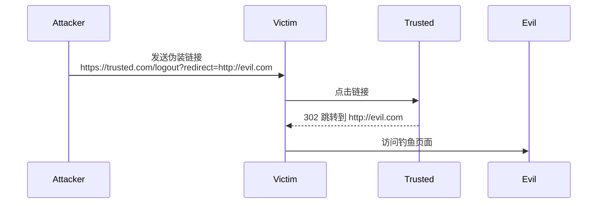

**防护**
白名单验证跳转域名，或只允许相对路径。

```javascript
const allowedHosts = ['example.com']
app.get('/redirect', (req, res) => {
	const target = req.query.url
	const { hostname } = new URL(target, 'http://localhost') // 第二个参数用于解析相对路径
	if (!allowedHosts.includes(hostname)) {
		return res.status(400).send('非法跳转')
	}
	res.redirect(target)
})
```

---

### 7. 依赖漏洞

**攻击链**


**防护**

- `npm audit` 定期检查。
- 使用 Snyk、Dependabot 自动修复。
- 锁定版本，避免语义版本自动升级引入恶意包。

---

### 8. 目录遍历

**路径遍历示例**

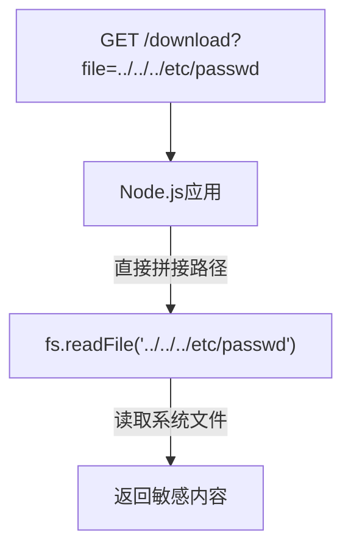

**防护**
使用 `path.resolve` 并检查是否在预期目录内。

```javascript
const path = require('path')
const base = '/var/data/'
app.get('/download', (req, res) => {
	const file = req.query.file
	const fullPath = path.normalize(path.join(base, file))
	if (!fullPath.startsWith(base)) {
		return res.status(403).send('Invalid path')
	}
	res.sendFile(fullPath)
})
```

---

### 9. 其他漏洞

- **SQL 注入**：使用 ORM 或参数化查询。
- **反序列化**：避免使用 `eval` 或 `node-serialize`，使用 JSON。
- **RCE**：杜绝 `eval()`、`setTimeout` 字符串参数。
- **安全配置**：使用 `helmet` 设置安全头。
- **日志注入**：对用户输入进行转义后再记录。

---

## 二、应用访问限流

限流是保障服务稳定的重要手段。下面用示意图对比四种常见算法。

### 1. 固定窗口计数器

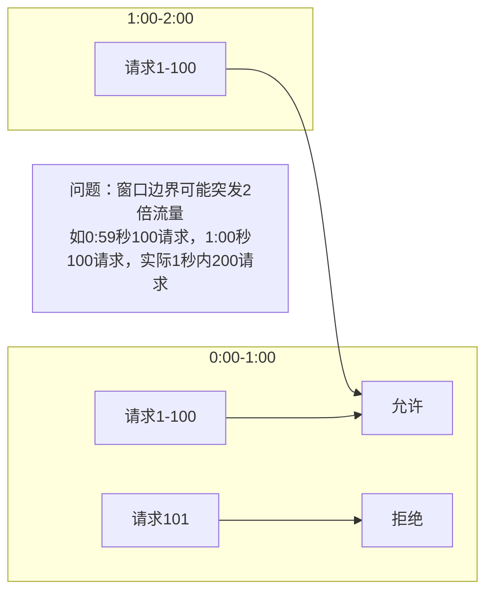

```javascript
const rateLimit = require('express-rate-limit')

// 创建限流器：每分钟最多100次请求
const limiter = rateLimit({
	windowMs: 60 * 1000, // 1分钟
	max: 100, // 最多100个请求
	message: '请求过于频繁，请稍后再试',
	headers: true, // 返回 X-RateLimit-* 头
	keyGenerator: (req) => req.ip, // 按IP限流
})

app.use('/api/', limiter)
```

### 2. 滑动窗口计数器

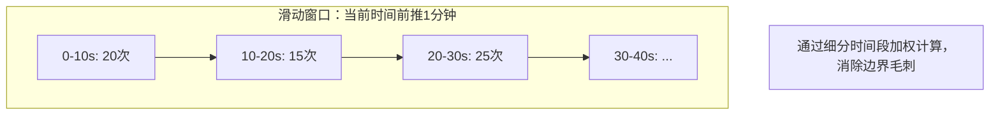

```javascript
// 滑动窗口示例（参考）
class FastSlidingWindow {
	constructor(windowSizeMs, limit) {
		this.windowSizeMs = windowSizeMs
		this.limit = limit
		this.requests = []
		this.head = 0 // 指向窗口内第一个有效元素
	}

	allow() {
		const now = Date.now()
		const threshold = now - this.windowSizeMs

		// 仅仅移动指针，不触发数组重排
		while (this.head < this.requests.length && this.requests[this.head] <= threshold) {
			this.head++
		}

		// 为了防止内存无限增长，定期进行真正的清理
		if (this.head > 1000) {
			this.requests = this.requests.slice(this.head)
			this.head = 0
		}

		if (this.requests.length - this.head < this.limit) {
			this.requests.push(now)
			return true
		}

		return false
	}
}

// 使用示例
const limiter = new FastSlidingWindow(60000, 100) // 每分钟限制 100 次
```

### 3. 漏桶算法

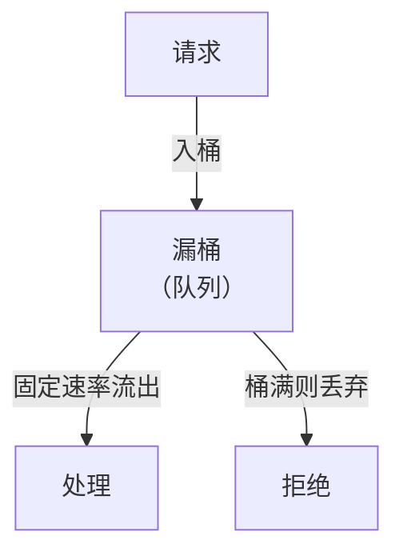

### 4. 令牌桶算法

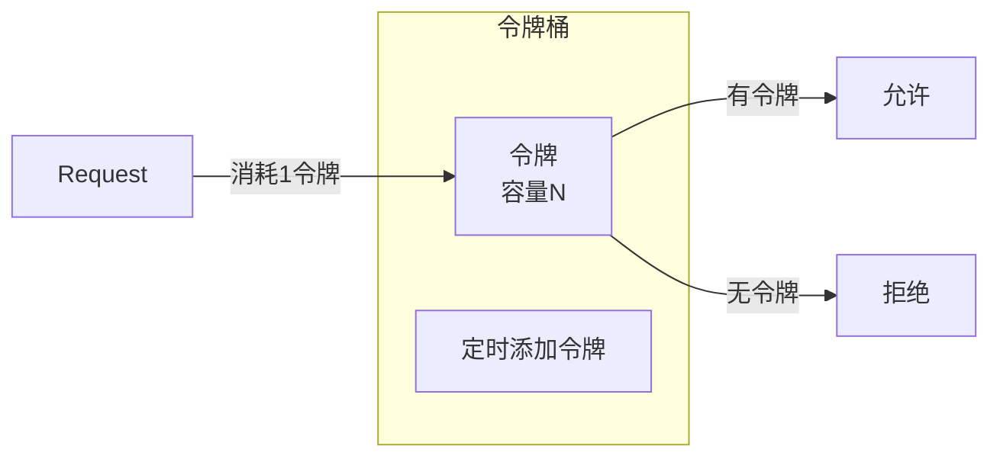

**Node.js 实现**

```javascript
// 简单令牌桶实现（参考）
class TokenBucket {
	constructor(capacity, fillPerSecond) {
		this.capacity = capacity
		this.tokens = capacity
		this.fillPerSecond = fillPerSecond
		this.lastRefill = Date.now()
	}
	take() {
		this.refill()
		if (this.tokens >= 1) {
			this.tokens -= 1
			return true
		}
		return false
	}
	refill() {
		const now = Date.now()
		const elapsed = (now - this.lastRefill) / 1000
		this.tokens = Math.min(this.capacity, this.tokens + elapsed * this.fillPerSecond)
		this.lastRefill = now
	}
}

// 中间件使用
const bucket = new TokenBucket(100, 10) // 容量100，每秒填充10个
app.use((req, res, next) => {
	if (bucket.take()) {
		next()
	} else {
		res.status(429).send('Too Many Requests')
	}
})
```

---

## 三、高可用三大利器关系

限流、缓存、降级共同保障系统在高负载下仍能提供核心服务。

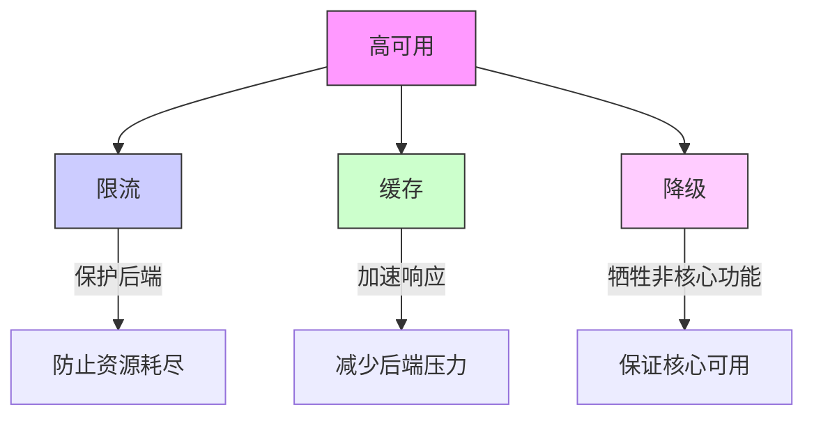

**为什么淘宝每年还是容易挂掉？**

- 流量峰值远超预估，即使限流也可能触发全局限流导致用户体验下降。
- 依赖的数据库、缓存等基础组件成为瓶颈。
- 人为失误或代码 Bug 引发雪崩。
- 基础设施故障（光缆被挖、电力中断）。

安全与高可用是系统工程，需要从架构、运维、代码等多维度持续投入。

---

## 结语

本文通过图例和代码，梳理了 Node.js 应用常见的 10 余种安全漏洞及其防护，同时介绍了限流算法。安全无小事，开发者应时刻保持警惕，将安全内化到开发生命周期。希望这些内容能帮助你构建更健壮的 Node.js 应用。
