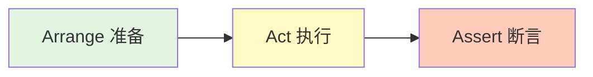
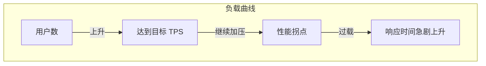
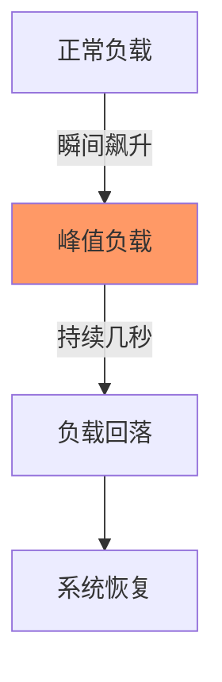
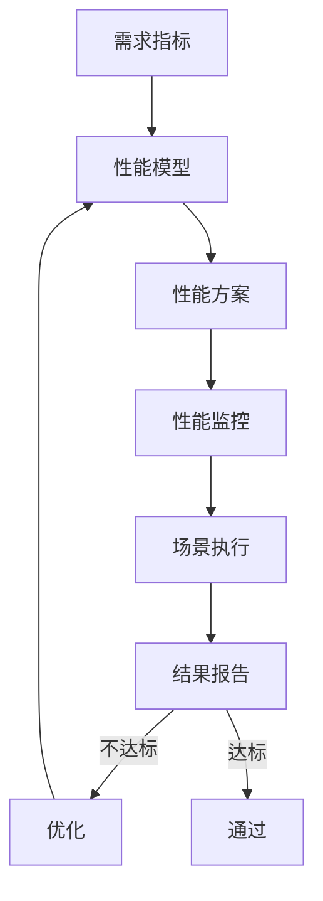
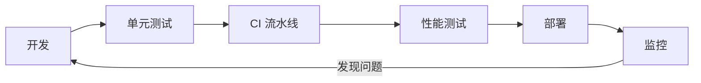

## 引言

在软件开发生命周期中，测试是保证代码质量、提升系统稳定性的关键环节。对于 Node.js 应用而言，单元测试帮助我们验证模块的正确性，性能测试则确保系统在负载下仍能可靠运行。本文将从单元测试的基础开始，深入 AAA 模式、测试覆盖率，并对比主流测试框架（Mocha、Jest、Vitest）。随后，我们将探讨性能测试的类型、流程及工具（Artillery、k6），并通过大量代码示例和图表，帮助你构建完整的测试体系。

## 一、单元测试

### 1.1 为什么需要单元测试？

单元测试是对软件中最小可测试单元（如函数、方法）进行检查和验证。它的价值体现在：

- **提高代码质量**：及早发现逻辑错误、边界条件问题，避免缺陷流入后续阶段。
- **促进重构**：当重构代码时，单元测试提供安全网，确保修改后的行为与预期一致。
- **文档作用**：测试用例本身就是对代码功能的活文档，新成员可通过测试理解模块用途。
- **提高开发效率**：自动化测试减少手工回归测试的工作量，快速定位引入的问题。

**一个形象的比喻**：单元测试就像大楼的钢筋检测，确保每根钢筋都符合标准，整栋楼才安全。

### 1.2 如何编写单元测试：AAA 模式

**AAA 模式**是编写单元测试的经典范式，它将测试分为三个阶段：

1. **Arrange（准备）**：初始化对象，设置输入数据，准备测试环境。
2. **Act（执行）**：调用被测函数或方法，获取实际输出。
3. **Assert（断言）**：验证实际输出是否符合预期。

**流程图**：



**示例代码**：测试一个简单的加法函数

```javascript
// math.js
function add(a, b) {
	return a + b
}
module.exports = { add }
```

```javascript
// test/math.test.js
const assert = require('assert')
const { add } = require('../math')

describe('add 函数测试', () => {
	it('应返回两个数的和', () => {
		// Arrange
		const a = 2,
			b = 3
		const expected = 5

		// Act
		const result = add(a, b)

		// Assert
		assert.strictEqual(result, expected)
	})

	it('应正确处理负数', () => {
		assert.strictEqual(add(-1, 1), 0)
	})

	it('应正确处理零', () => {
		assert.strictEqual(add(0, 0), 0)
	})
})
```

### 1.3 测试覆盖率

**测试覆盖率**衡量被测试代码的覆盖程度，常见的指标包括：

- **语句覆盖**：代码中每行语句是否被执行。
- **分支覆盖**：每个条件分支（如 if-else）是否都走过。
- **函数覆盖**：每个函数是否被调用。
- **行覆盖**：每行代码是否被执行。

**覆盖率报告示例**（使用 Istanbul/NYC）：

```bash
--------------|---------|----------|---------|---------|-------------------
File          | % Stmts | % Branch | % Funcs | % Lines | Uncovered Line #s
--------------|---------|----------|---------|---------|-------------------
All files     |   85.71 |       75 |     100 |   85.71 |
 math.js      |   85.71 |       75 |     100 |   85.71 | 5-6
--------------|---------|----------|---------|---------|-------------------
```

通常我们会设定覆盖率阈值（如 80%），低于阈值则构建失败。但注意：高覆盖率不代表无 Bug，应关注核心逻辑的覆盖。

### 1.4 Node.js 单元测试框架对比

目前 Node.js 生态中主流的测试框架有 Mocha、Jest 和 Vitest。下面是它们的对比：

| 特性          | Mocha                     | Jest               | Vitest            |
| ------------- | ------------------------- | ------------------ | ----------------- |
| **断言库**    | 需搭配（如 assert、chai） | 内置               | 内置（兼容 Jest） |
| **Mock/Stub** | 需搭配（如 sinon）        | 内置               | 内置              |
| **快照测试**  | 需搭配                    | 内置               | 内置              |
| **并行执行**  | 需配置                    | 自动               | 自动（基于 Vite） |
| **ESM 支持**  | 需配置                    | 良好               | 原生支持          |
| **适用场景**  | 灵活、可定制              | React 项目、全功能 | Vite 项目、高性能 |

#### 1.4.1 Mocha 示例

Mocha 是灵活的测试框架，常与 Chai（断言库）和 Sinon（Mock）搭配。

```javascript
// 安装：npm install mocha chai sinon --save-dev
const { expect } = require('chai')
const sinon = require('sinon')
const { fetchData } = require('./api')

describe('fetchData', () => {
	it('应成功获取数据', async () => {
		// 模拟 axios.get
		const stub = sinon.stub(axios, 'get').resolves({ data: { id: 1 } })

		const result = await fetchData(1)

		expect(result).to.deep.equal({ id: 1 })
		expect(stub.calledOnce).to.be.true

		stub.restore()
	})
})
```

运行：`npx mocha test/**/*.test.js`

#### 1.4.2 Jest 示例

Jest 是 Facebook 推出的零配置测试框架，内置断言、Mock 和覆盖率收集。

```javascript
// user.js
function createUser(name) {
	return { id: Date.now(), name }
}
module.exports = { createUser }

// user.test.js
const { createUser } = require('./user')

test('createUser 应返回包含 name 和 id 的对象', () => {
	const user = createUser('Alice')
	expect(user).toHaveProperty('id')
	expect(user.name).toBe('Alice')
})

// 模拟模块
jest.mock('./api')
const { fetchData } = require('./api')
fetchData.mockResolvedValue({ data: 'mock' })
```

运行：`npx jest` 或通过 `package.json` 脚本。

#### 1.4.3 Vitest 示例

Vitest 是专为 Vite 设计的测试框架，兼容 Jest API，但更快。

```javascript
// 安装：npm install vitest --save-dev
// math.js
export function add(a, b) {
	return a + b
}

// math.test.js
import { describe, it, expect } from 'vitest'
import { add } from './math'

describe('add', () => {
	it('should add two numbers', () => {
		expect(add(2, 3)).toBe(5)
	})
})
```

运行：`npx vitest`

#### 1.4.4 异步测试与钩子

测试中常需处理异步操作（如数据库、网络请求）。所有框架都支持 `async/await`。

**Mocha 示例**（需显式调用 `done` 或返回 Promise）：

```javascript
it('should fetch data', async () => {
	const data = await fetchData()
	expect(data).to.exist
})
```

**钩子函数**（`before`、`after`、`beforeEach`、`afterEach`）用于准备和清理环境。

```javascript
describe('数据库测试', () => {
	before(async () => {
		await db.connect()
	})
	after(async () => {
		await db.close()
	})
	beforeEach(() => {
		// 每条测试前执行
	})
	// ...
})
```

---

## 二、性能测试

### 2.1 什么是性能测试？

性能测试是通过自动化工具模拟多种负载，测量系统响应时间、吞吐量、资源利用率等指标，以评估系统性能瓶颈和稳定性。它帮助我们回答：

- 系统能承受多少并发用户？
- 响应时间是否满足 SLA？
- 长时间运行会否内存泄漏？
- 峰值流量下是否会崩溃？

### 2.2 性能测试类型

性能测试通常分为以下四种类型，每种针对不同的目标。

#### 2.2.1 基准性能测试（Baseline Test）

**目的**：在低负载下获取系统性能基准数据，如单用户响应时间、TPS（每秒事务数）。
**负载模型**：单用户或少量用户，持续短时间。
**应用场景**：每次版本发布后对比基准，判断性能是否下降。

#### 2.2.2 容量性能测试（Capacity Test / Load Test）

**目的**：测试系统在预期负载下的表现，验证是否满足性能需求。
**负载模型**：逐步增加并发用户/请求，直至达到目标 TPS 或并发数。
**输出**：最大 TPS、响应时间随负载的变化曲线。

**负载曲线示意图**：



#### 2.2.3 稳定性性能测试（Stability Test / Endurance Test）

**目的**：验证系统在长时间运行（如 8 小时、24 小时）下的稳定性，检查内存泄漏、连接泄漏等。
**负载模型**：恒定负载（如 80% 容量），持续长时间。
**监控指标**：CPU、内存、句柄数、GC 次数。

#### 2.2.4 异常性能测试（Stress Test / Spike Test）

**目的**：测试系统在突发极端负载下的行为，以及恢复能力。
**负载模型**：瞬间高并发，或负载突增突降。
**关注点**：系统是否会崩溃、重启后能否恢复、限流降级机制是否生效。

**异常测试示例图**：



### 2.3 性能测试流程

一个规范的性能测试应遵循以下步骤：

1. **需求指标**：明确性能目标（如 TPS ≥ 1000，P95 响应时间 ≤ 200ms）。
2. **性能模型**：基于用户行为设计负载模型（如登录、浏览、下单比例）。
3. **性能方案**：选择工具、准备环境、设计脚本。
4. **性能监控**：部署监控系统（如 Prometheus + Grafana）收集服务器指标。
5. **场景执行**：运行测试，逐步加压，记录数据。
6. **结果报告**：分析数据，定位瓶颈，输出优化建议。

**流程图**：



### 2.4 什么场景必须做性能测试？

- **新应用上线**：估算上线后 QPS，验证能否支撑预期流量。
- **核心高频服务**：如支付、订单、秒杀系统，任何性能问题都可能导致直接损失。
- **短时间内极大流量**：如电商大促、抢票、抢购，需要提前压测确保系统扛得住。
- **长期运行的服务**：检测内存泄漏、连接池耗尽等慢性问题。

### 2.5 性能测试工具

#### 2.5.1 Artillery

Artillery 是一个现代化的性能测试工具，基于 Node.js，支持 HTTP、WebSocket、Socket.io 等协议。它的配置采用 YAML 或 JSON 格式，易于编写和维护。

**安装**：

```bash
npm install -g artillery
```

**基本使用**：创建一个简单的 HTTP 压测脚本 `test.yml`：

```yaml
config:
  target: 'http://localhost:3000'
  phases:
    - duration: 60 # 持续 60 秒
      arrivalRate: 10 # 每秒新增 10 个用户
scenarios:
  - flow:
      - get:
          url: '/api/users'
```

运行：

```bash
artillery run test.yml
```

**高级示例**：包含思考时间、参数化、自定义报告。

```yaml
config:
  target: 'http://my-api.com'
  phases:
    - duration: 300
      arrivalRate: 20
      rampTo: 50 # 逐渐增加到每秒 50 用户
  payload:
    path: 'users.csv'
    fields: ['userId']
scenarios:
  - name: '获取用户信息'
    flow:
      - think: 2 # 等待 2 秒
      - get:
          url: '/users/{{ userId }}'
```

**分析结果**：Artillery 输出摘要包括请求数、响应时间分布、错误率等。

#### 2.5.2 k6

k6 是一个用 Go 编写的高性能负载测试工具，支持 JavaScript 编写测试脚本，强调开发人员体验和 CI/CD 集成。

**安装**（以 Linux/macOS 为例）：

```bash
curl -s https://github.com/grafana/k6/releases/latest/download/k6-latest-linux-amd64.deb -o k6.deb
sudo dpkg -i k6.deb
```

**编写脚本** `script.js`：

```javascript
import http from 'k6/http'
import { check, sleep } from 'k6'

export const options = {
	stages: [
		{ duration: '1m', target: 10 }, // 1 分钟上升到 10 虚拟用户
		{ duration: '3m', target: 10 }, // 维持 3 分钟
		{ duration: '1m', target: 0 }, // 1 分钟下降到 0
	],
	thresholds: {
		http_req_duration: ['p(95)<500'], // 95% 请求响应时间 < 500ms
		http_req_failed: ['rate<0.01'], // 失败率小于 1%
	},
}

export default function () {
	const res = http.get('http://localhost:3000/api/users')
	check(res, {
		'is status 200': (r) => r.status === 200,
	})
	sleep(1) // 思考时间
}
```

**运行**：

```bash
k6 run script.js
```

**输出示例**：

```
     ✓ is status 200

     checks.........................: 100.00% ✓ 4523      ✗ 0
     data_received..................: 3.5 MB  45 kB/s
     data_sent......................: 1.2 MB  15 kB/s
     http_req_blocked...............: avg=4.8ms   min=2µs    med=6µs    max=1.2s
     http_req_connecting............: avg=2.1ms   min=0s     med=0s     max=1.1s
     http_req_duration..............: avg=123.4ms min=12ms   med=98ms   max=1.5s
       { expected_response:true }...: avg=123.4ms min=12ms   med=98ms   max=1.5s
     http_req_failed................: 0.00%   ✓ 0         ✗ 4523
     http_reqs......................: 4523    58.2/s
     iteration_duration.............: avg=1.12s   min=1.01s  med=1.09s  max=2.5s
     iterations.....................: 4523    58.2/s
     vus............................: 10      min=10     max=10
     vus_max........................: 10      min=10     max=10
```

k6 还支持输出结果到 InfluxDB、Prometheus 等，方便集成监控。

### 2.6 结合 APM 工具

性能测试不仅要看工具生成的汇总数据，更要结合 APM（应用性能监控）工具深入分析代码级瓶颈。常见的 APM 有：

- **New Relic**、**Datadog**：商业方案，提供端到端追踪。
- **Elastic APM**：开源，与 ELK 集成。
- **Prometheus + OpenTelemetry**：自建监控体系。

通过在压测时同时监控 CPU、内存、数据库慢查询、外部服务延迟，可以快速定位瓶颈点。

---

## 三、总结

单元测试和性能测试是保障 Node.js 应用质量的两大支柱。单元测试确保代码逻辑正确，性能测试保证系统在生产负载下稳定运行。

- 单元测试的 AAA 模式、覆盖率概念，以及 Mocha、Jest、Vitest 的基本用法。
- 性能测试的类型（基准、容量、稳定性、异常）、流程和关键场景。
- 使用 Artillery 和 k6 进行压力测试，并结合 APM 工具分析性能瓶颈。

测试不是一次性的工作，而应融入 CI/CD 流程，成为开发文化的一部分。只有持续测试、持续优化，才能构建出可靠、高效的 Node.js 应用。

**最后一张图总结**：


