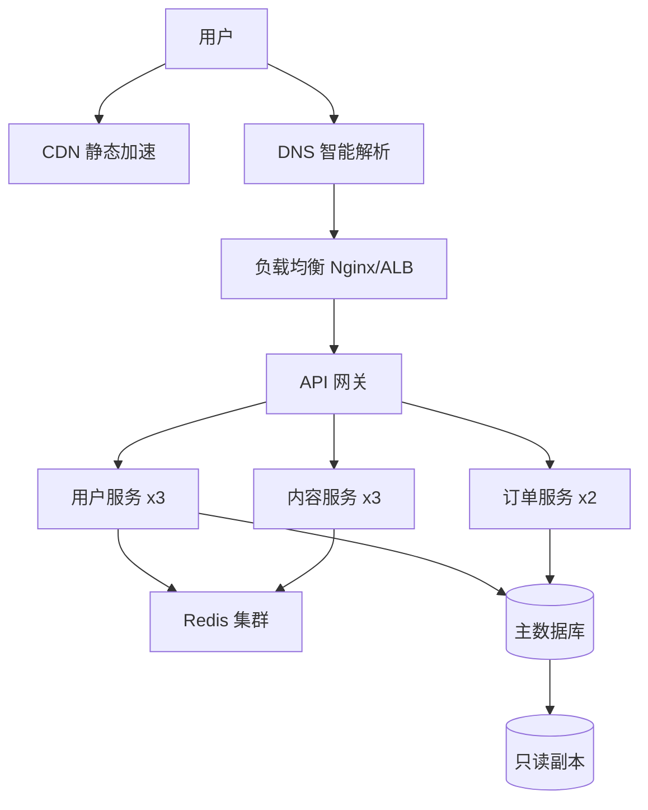
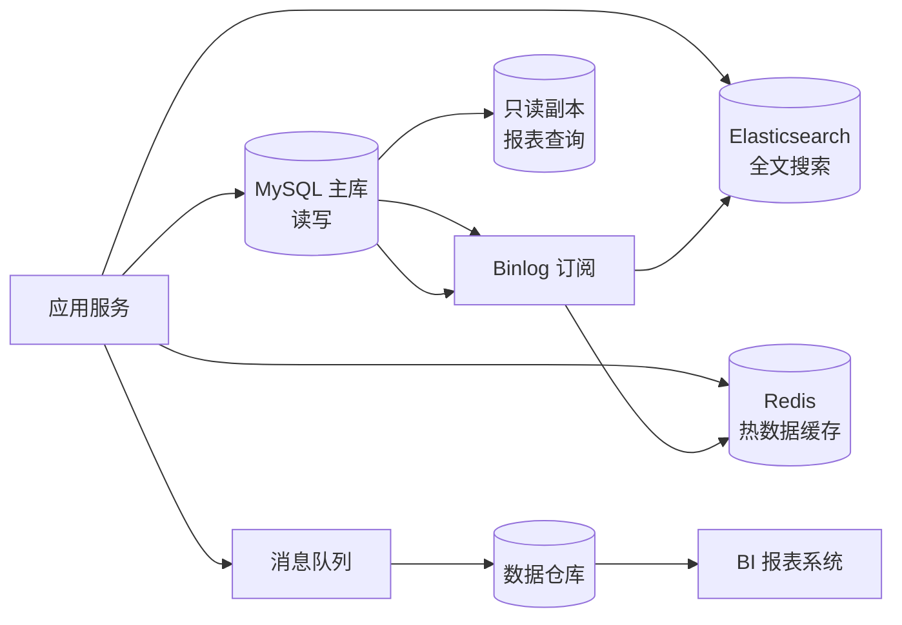
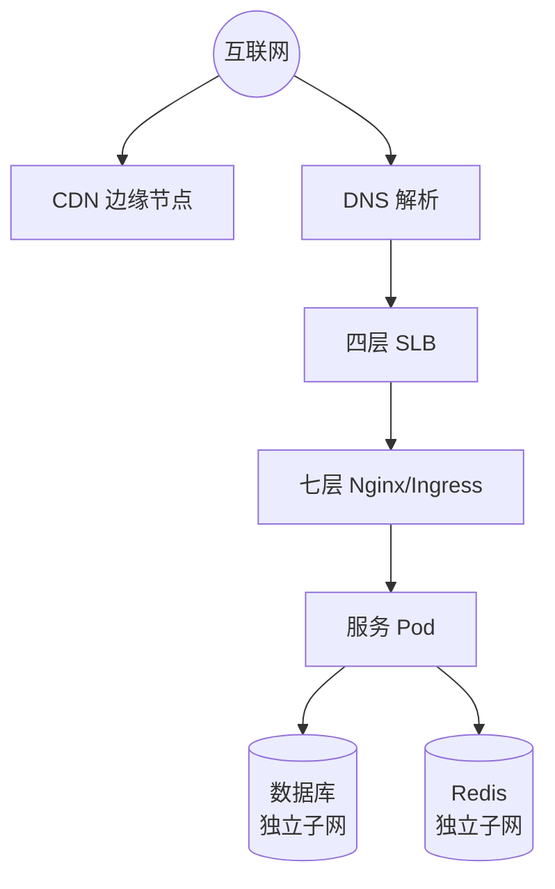
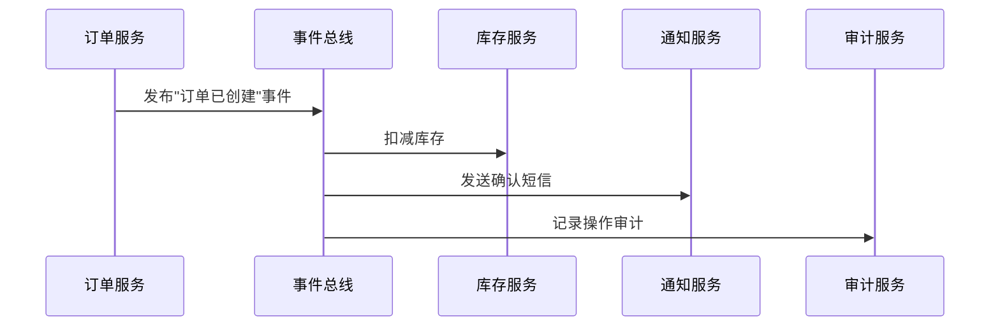
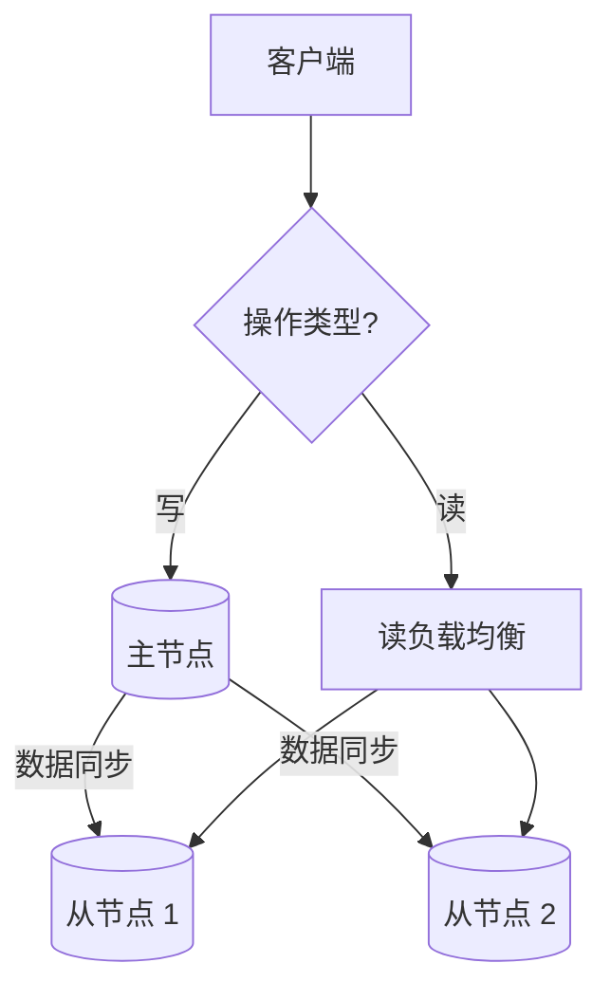

> 写给想搞懂"到底什么是架构设计"的开发者的深度指南

你有没有遇到过这种场景：面试官说"聊聊你上家公司的系统架构"，你脑子里闪过几个框线图，然后发现自己讲的跟另一个同事讲的完全不一样。或者更扎心的——Leader 让你出一个新系统的架构方案，你打开 draw.io 画了一堆框，但自己心里也虚：这架构建出来能扛住吗？三年后还能维护吗？

架构设计这个东西，最难的地方不是不会画图，而是**不知道自己画得对不对**。

这篇文章不教你画图，也不给你贴大厂的架构图让你照抄。我们来聊清楚：架构设计到底是什么、怎么判断一个架构好还是烂、以及从哪些维度去思考和验证一个架构方案。

---

## 一、架构设计到底是什么

### 1.1 架构不是"软件"

很多人第一次接触架构这个词，想到的是微服务架构图、分层架构图——一堆方框和箭头。但架构本身不是软件，不是代码，甚至不是那几张图。

架构是对系统整体结构和组件关系的**抽象描述**。

打个比方：你要盖一栋楼。混凝土、钢筋、玻璃这些是材料（对应代码和库）；设计图纸不是楼本身，但它定义了楼的结构——哪里是承重墙、哪里是管道井、电梯井在哪。这个设计图纸，就是"架构"。

软件架构同理——它不关心你用什么库去实现缓存，但它关心"缓存层在整个系统里的位置和边界在哪里"。

Martin Fowler 有一个很精准的定义：**架构是那些一旦做错就很难改的东西**。路由方案你可以换，ORM 你可以换，但"哪些服务拆分、数据库怎么分布、跨服务怎么通信"——这些一旦定了，改起来伤筋动骨。

### 1.2 架构设计的本质：拆分 + 协作

架构设计说到底就两件事：

1. **把这个系统拆成哪些模块（或服务、组件、层）**
2. **这些模块之间怎么通信、怎么协作**

用餐饮行业来类比：

- 你开一家小餐馆，后厨只有两个人——一个切菜一个炒菜。你不会搞"冷菜部""热菜部""面点部"三层架构，因为人太少了，搞太多模块沟通成本比直接干活还高。
- 但你开一家大型连锁餐厅，有 500 个座位、日客流 3000 人。这时候不拆不行——后厨分成凉菜间、热菜间、面点间、备料间，前厅分成迎宾、点单、传菜、收银四个组。模块拆好了，还要定义协作规则："点单组的单子一式两份，一份给热菜间一份给收银组""热菜间出菜后传菜组必须在 3 分钟内上桌"。

这就是架构设计——**拆分是手段，协作是目标**。拆得太粗，一个模块里塞了太多东西，改不动也测不了；拆得太细，模块间的沟通成本超过了模块本身的收益。判断标准只有一个：**拆分后，整个系统的复杂度是降低了还是增加了**。

---

## 二、五个"不要"原则

在进入具体的架构类型之前，这几个原则比任何方法论都重要。它们是踩了无数坑之后的血泪总结。

### 2.1 不要过度设计

过度设计是工程师最常犯的错误，没有之一。表现形式包括：

- 日活还没破百，就开始搞微服务 + 容器化 + CI/CD 全链路
- 数据量才几万条，就上了分库分表中间件
- 业务需求还在频繁变动，就先定义了一套"完美"的抽象层和接口规范

有一个判断标准很实用：**当前方案能不能撑到下一个业务里程碑？如果能，就不用动。** 一个日活 500 的系统，MySQL 单表 + Redis 缓存撑到日活 5 万绰绰有余。半年的时间，足够让你看清业务形态再决定怎么拆。

过度设计的代价不是"多做了一些工作"——而是多做的那些东西会成为后续迭代的**枷锁**。你为了"未来可能的扩展"加了 5 层抽象，结果三个月后业务方向变了，这 5 层抽象没一个能用，反而每个新需求都要绕过它们。

### 2.2 不要无脑跟大公司

你看到的几乎所有"大厂架构实践"分享，都有一个隐含前提：**他们的流量规模、组织规模、业务复杂度是你的 100 倍以上**。

大厂为什么要搞微服务？因为他们有 5000 个工程师同时在一个代码库里干活，不拆就天天 merge conflict。你团队一共 5 个人，搞 8 个微服务——每个人维护 1.6 个服务，版本兼容性、调试链路、部署编排这些额外成本全部落在你头上。

大厂的架构方案是为**他们的痛点**设计的，不是为你的。你该学的是他们**为什么**那样设计——他们面临什么约束、做了什么取舍。而不是把他们的架构图原样搬到你的系统里。

一个简单的规则：**如果一样技术你解释不清楚为什么需要它，就先不要引入它。**

### 2.3 不要太旧，不要太新

技术选型上有一个经典困境：太新的东西不稳定、生态差、招不到人；太旧的东西招不到年轻人、社区萎缩、安全问题没人修。

推荐的策略：

| 项目类型       | 推荐的技术成熟度      | 例子                     |
| -------------- | --------------------- | ------------------------ |
| 核心业务链路   | 已被广泛验证 2 年以上 | PostgreSQL, Redis, Nginx |
| 非核心辅助工具 | 可尝试较新技术        | 日志/监控/CI 工具        |
| 实验性功能     | 可以追新              | 内部工具、技术预研项目   |

核心原则：**不要把新东西放在关键路径上**。你的支付链路、用户认证、数据库——这些一旦出问题就是事故，用最稳的。你要尝鲜 Vitest 替代 Jest？可以，放在工具链上，放在测试环境跑，出了问题大不了切回去。但不要在"用户下单"这个路径上挂一个刚发布两个月的消息队列。

### 2.4 不要脱离实践

架构设计不是闭门造车。一个架构方案的好坏，要放到具体的**业务上下文**里才能判断。脱离实践的架构设计通常表现为三种形态：

**一、不考虑团队能力。** 你设计了一个完美的 Event Sourcing + CQRS 架构，但团队里没人搞过事件溯源，连 Event Store 都没搭过。这套架构上线后，任何一个小问题都只有你能排查，你成了系统的单点瓶颈。

**二、不考虑上下游。** 你设计的服务对外提供 RESTful API，但上游是一个还在用 SOAP 的老系统，下游是一个只收 XML 的外部供应商。你这套"优雅的 RESTful 设计"除了给自己看，对接起来全是适配层。

**三、不考虑招聘。** 你选了一个非常小众的技术栈——好用，但市场上很难招到会用它的人。两年后你想跳槽，公司发现没人能接手你的服务；或者你想招人扩大团队，发现简历池里认识这个技术栈的人一只手数得过来。

架构设计要考虑三个时间维度：

- **短期（3-6 个月）**：当前需求能不能快速落地？团队能不能上手？
- **中期（6-18 个月）**：业务方向稳定后怎么演进？技术债怎么还？
- **长期（18 个月以上）**：团队规模翻倍后怎么协作？怎么防止系统退化？

---

## 三、系统架构

系统架构是最顶层的视角——它关注的是**硬件资源、服务部署、网络拓扑**。当你画一张图，上面画着"Nginx → 网关 → 服务集群 → 数据库集群 → Redis 集群"，这就是在描述系统架构。

系统架构回答的核心问题：

- 服务跑在几台机器上？怎么扩缩容？
- 请求从用户浏览器到数据库走了哪几条链路？
- 哪些节点是单点？挂了之后系统还能不能用？
- 流量入口在哪里？怎么防止 DDoS？



系统架构的设计要点：

1. **无状态化**：任何请求可以被任何实例处理，实例挂了不影响用户
2. **冗余**：每个关键节点至少双副本，别让单点成为系统的"命门"
3. **容量规划**：基于 QPS 和数据量预估资源需求，留 30% 的余量
4. **灾备**：数据库备份、异地容灾——虽然概率低，但一旦发生就是事故

> 小知识：系统架构这个词在实际工作中经常和"部署架构"混用。严格来说，系统架构包含部署架构，还包含容灾、扩缩容、监控体系等运维维度的设计。

---

## 四、软件架构

软件架构比系统架构低一层，关注的是**代码层面的组织方式和运行机制**。当你讨论"这个项目用分层架构还是六边形架构""模块之间通过接口还是事件通信"时，你讨论的就是软件架构。

软件架构的常见决策维度：

| 维度     | 问题                   | 例子                              |
| -------- | ---------------------- | --------------------------------- |
| 分层     | 代码怎么分层组织？     | Controller → Service → Repository |
| 模块划分 | 按业务还是按功能拆？   | 用户模块 vs 认证模块              |
| 通信方式 | 同步调用还是异步事件？ | HTTP/gRPC vs Kafka/Redis Pub      |
| 依赖方向 | 谁可以依赖谁？         | 上层依赖下层，不能反向            |
| 共享代码 | 公共逻辑放哪里？       | libs/common vs 拷贝代码           |
| 扩展点   | 在哪里允许自定义行为？ | 策略模式、插件机制                |

以最经典的分层架构为例：

```
┌──────────────────────────────────┐
│       表示层 (Controller)         │ ← HTTP 请求入口，参数校验
├──────────────────────────────────┤
│       应用层 (Service)            │ ← 业务流程编排，事务边界
├──────────────────────────────────┤
│       领域层 (Domain)             │ ← 核心业务规则，不依赖任何框架
├──────────────────────────────────┤
│       基础设施层 (Infrastructure)  │ ← 数据库、缓存、消息队列实现
└──────────────────────────────────┘
```

分层架构的核心纪律：**依赖方向永远是向下的。上面的层可以调用下面的层，反之不行。** 一旦出现下层依赖上层（比如 Domain 层 import 了 Controller 层的 DTO），架构就开始腐化——改 Controller 会影响 Domain 的单元测试，换框架会改到业务代码。

---

## 五、数据架构

数据架构是很多开发者最容易忽略的领域——大部分人只关心"用 MySQL 还是 PostgreSQL"，但数据架构远比数据库选型复杂。

数据架构关注的核心问题：

1. **数据存储选型**：关系型、文档型、时序、图数据库——不同形状的数据适合不同的存储
2. **数据分布**：单库还是分库？分表吗？什么做分片键？
3. **数据一致性**：强一致还是最终一致？分布式事务怎么处理？
4. **数据流动**：数据从哪里来、经过哪些系统、最终到哪里去？
5. **数据生命周期**：热数据、温数据、冷数据怎么分层存储？什么时候归档？什么时候删除？



数据架构的几个实战建议：

- **不要一上来就分库分表**。单表 2000 万行以内，PostgreSQL 配合合理的索引完全扛得住。真正需要分库分表的时候，说明你的业务已经成功了——到那时候再拆也有数据量和业务需求做支撑。
- **缓存不是数据库的替代品**。缓存里的数据丢了要有兜底逻辑，数据库永远是一致性的最终来源。
- **读写分离是成本最低的扩展方式**。绝大多数业务场景读远多于写，加只读副本可以线性提升读能力，不需要改代码。
- **冷热数据分离**。把 6 个月以前的订单数据挪到归档库，主库保持轻量，查询速度和备份时间都能大幅改善。

---

## 六、网络架构

网络架构关注的是**数据在节点之间怎么流动**。在一个分布式系统里，网络的不可靠性是架构设计中必须正视的现实——延迟、丢包、分区，这些都一定会发生。

网络架构的核心话题：

1. **网络分区（Split-Brain）**：集群的节点之间网络断了，每个节点都以为自己是主节点——怎么防止两个"主"同时写数据？
2. **服务发现**：客户端怎么知道目标服务在哪个 IP 的哪个端口？DNS？Consul？还是 k8s Service？
3. **负载均衡**：四层还是七层？轮询还是最小连接数？
4. **网络隔离**：服务之间要不要通过 VPC/安全组分隔？数据库要不要放在独立子网？
5. **CDN 和边缘计算**：静态资源和动态内容分别走什么路径？



网络架构的一个重要原则：**把鸡蛋放在不同的篮子里，但要确保篮子之间不会互相伤害**。意思是——数据库和 Redis 放在独立的子网，即使应用层被攻破，攻击者也拿不到数据库的 IP。但同时又要在网络层面做好故障隔离——一个子网出问题不能拖垮整个集群。

---

## 七、安全架构

安全架构不是"加一个防火墙"或者"用 HTTPS"——它是贯穿系统架构、软件架构、数据架构的一条线。安全不是在系统搭完之后"打补丁"，而是在设计阶段就嵌入到架构里。

安全架构的核心维度：

| 层次   | 关注点             | 典型方案                                        |
| ------ | ------------------ | ----------------------------------------------- |
| 网络层 | 谁能访问什么       | VPC 隔离、安全组、WAF、DDoS 防护                |
| 应用层 | 谁在操作、做了什么 | 认证（JWT/OAuth2）、授权（RBAC/CASL）、审计日志 |
| 数据层 | 数据在哪、谁能看   | 加密存储、脱敏、备份加密、传输 TLS              |
| 运维层 | 谁改了什么配置     | 堡垒机、操作审计、最小权限原则                  |
| 供应链 | 依赖有没有问题     | SCA 扫描、镜像签名、SBOM                        |

几个关键设计原则：

1. **纵深防御（Defense in Depth）**：不在单一层面依赖单一方案。即使 WAF 被绕过，应用层还有输入校验；即使应用层被注入，数据库还有最小权限限制。
2. **最小权限原则（Least Privilege）**：一个服务只给它访问必需资源的权限。订单服务不需要访问用户密码表，通知服务不需要访问支付日志。
3. **默认拒绝（Deny by Default）**：所有接口默认需要认证，公开接口必须显式标记。我们在 NestJS 文章里讲的 `@Public()` 装饰器就是这个原则的实践。
4. **安全左移（Shift Left）**：安全检查越早越好——代码提交时跑 SAST，CI 阶段跑依赖扫描，部署前跑容器镜像扫描。

> 小知识：安全架构中有一个概念叫"信任边界"（Trust Boundary）——数据从一个安全域进入另一个安全域时，必须经过校验。比如用户输入进入服务端、服务端数据传给第三方、日志写入外部系统——这些都是信任边界的跨越点。

---

## 八、设计模式

架构设计模式是对常见架构问题的**可复用解决方案**。跟代码层面的设计模式（工厂、策略、观察者）不同，架构模式关注的是系统级别的结构问题。

### 8.1 层次架构模式

前面已经提到过，这是最经典也最常用的模式。核心思想是把系统分成若干层，每层只处理自己职责范围内的事情，**上层依赖下层，下层不感知上层**。

适用场景：几乎所有业务系统。当你在做一个功能不确定、业务还在快速变化的新系统时，分层架构是最安全的起点。

优势：

- 结构清晰，新人上手快
- 每层可以独立替换（比如换数据库只改 Repository 层）
- 测试容易——可以逐层 mock

劣势：

- 层数多了性能有损耗（每一层都要做数据转换）
- 严格的单向依赖有时候会逼你写"绕过代码"（跳过 Service 层直接查数据库）
- 不够灵活，难以应对当业务逻辑需要跨多个层的场景

### 8.2 数据流架构模式

数据流模式关注的是**数据在系统中的流转路径**。典型的实现是"管道-过滤器"（Pipe-Filter）架构：

```typescript
// 数据流模式：每个阶段独立，通过管道连接
const processOrder = pipe(
  validateOrder, // 1. 校验订单数据
  calculateDiscount, // 2. 计算折扣
  checkInventory, // 3. 检查库存
  createPayment, // 4. 创建支付
  sendNotification, // 5. 发送通知
)
```

适用场景：数据处理 Pipeline（ETL、日志处理）、编译器的词法分析→语法分析→代码生成流程、订单处理流。

### 8.3 模块架构模式（微服务）

模块化架构的核心是把系统按业务边界拆成独立部署的单元。微服务是模块化架构在分布式场景下的实现。

模块化拆分的判断标准不是"代码行数"，而是**变更频率和团队边界**。如果一个模块跟另一个模块的需求变更从来不同步，那它们就不该放在一起。反之，如果两个模块每次需求变更都联动修改，强行拆开只会增加协调成本。

> 小提示：模块化架构不等于微服务。你可以先在一个单体里按模块拆分（比如用 NestJS 的 Module 机制），等到真正需要独立部署时再抽成微服务——代码结构不用大动。

### 8.4 事件驱动架构模式（发布/订阅）

事件驱动模式下，服务之间不直接调用，而是通过**事件**来通信。一个服务发布事件，其他服务订阅事件。



适用场景：业务流程需要多个服务联动但又不希望服务之间硬耦合、需要异步处理的场景（下单后减库存、发通知、记审计日志）、数据一致性要求"最终一致"而非"强一致"的业务。

优势：解耦彻底，新增消费者不影响发布者
劣势：调试和排查链路复杂——一个事件触发的链路长了，定位问题跟侦探破案似的

### 8.5 分布式系统架构模式（主从/Leader-Follower）

在主从模式下，有一个主节点负责所有写操作，多个从节点负责读操作。主节点的写入同步到从节点。



优势：

- 读写分离，读能力线性扩展
- 主节点挂了可以从从节点选举新主（需要 Sentinel 或类似机制）
- 数据有天然冗余

劣势：

- 主从之间一定有同步延迟，读从节点可能拿到旧数据
- 主节点是写入瓶颈——写能力不能通过加节点来扩展
- 脑裂问题——主从网络断开后两个节点都以为自己是主

### 8.6 用户界面模式（MVC / MVVM）

MVC 和 MVVM 是前端码最熟悉的两种模式，但它们在架构层面上有不同的适用场景：

| 模式 | 核心理念                              | 数据流                    | 典型框架                   |
| ---- | ------------------------------------- | ------------------------- | -------------------------- |
| MVC  | Controller 协调 Model 和 View         | View ← Controller → Model | Ruby on Rails, Spring MVC  |
| MVVM | View 和 Model 通过 ViewModel 双向绑定 | View ↔ ViewModel → Model  | Vue, React(单向但理念相近) |

关键区别：在 MVC 里，Controller 是"协调者"——它从 Model 拿数据然后传给 View。在 MVVM 里，ViewModel 是"翻译官"——它把 Model 的数据翻译成 View 直接能用的格式，View 的变化也自动同步回 Model。

选择建议：如果你做服务端渲染的 Web 应用（模板引擎返回 HTML），MVC 足够好。如果你做前后端分离的 SPA，前端用 MVVM（Vue/React），后端专注于提供 RESTful/gRPC API——这时候前端的 MVVM 跟后端的 API 层是两套独立的架构。

---

## 九、设计工具

架构设计不能只靠脑子。工具的作用不是"画好看的图"，而是**帮你在脑子里把模糊的想法变成清晰的表达**。

### 9.1 UML（统一建模语言）

UML 是最经典的标准化建模语言，虽然现在很多人觉得它"太重"，但它的核心图示在今天依然有价值：

| 图类型               | 用途                   | 什么时候用             |
| -------------------- | ---------------------- | ---------------------- |
| 用例图（Use Case）   | 描述系统功能和外部角色 | 需求分析阶段           |
| 类图（Class）        | 展示类和它们的关系     | 设计数据模型、领域模型 |
| 时序图（Sequence）   | 展示对象之间的交互顺序 | 梳理复杂接口调用链路   |
| 活动图（Activity）   | 描述业务流程           | 对齐业务方对流程的理解 |
| 部署图（Deployment） | 展示物理部署结构       | 系统架构评审           |

你不必学会所有 UML 图。日常最实用的就三种：**时序图**用来梳理调用链路（特别是跨服务的），**类图**用来对齐数据模型，**部署图**用来沟通系统架构。

### 9.2 ProcessOn / Draw.io

这两个是国内的在线绘图工具。ProcessOn 的模板更丰富，Draw.io 完全免费且可以本地部署。

实践中常见的问题不是不会用工具，而是**画图没有统一的约定**。一个团队里，A 用红色框代表"外部服务"，B 用红色框代表"高危组件"。评审时大家都在问"这个红色框是什么意思"，时间全花在沟通符号定义上。

建议：团队内部约定一套简单的图例规范——什么颜色代表什么层、什么形状代表什么类型的组件。写在团队的文档里，不用很复杂，半页纸就够。

### 9.3 Visual Paradigm

如果项目比较大、需要完整 UML 建模支持，Visual Paradigm 是专业级工具。它支持从类图直接生成代码骨架，也支持从代码反向生成类图。适合做企业级项目的正式架构文档。

### 9.4 Navicat

数据库设计不只是写 DDL。Navicat 提供可视化的 ER 图设计——你可以直接拖拽表、建外键、看数据关系。对于数据架构设计来说，ER 图比一堆 CREATE TABLE 语句直观得多。

建议设计数据库时**先用 Navicat 或同类工具画 ER 图**，把表关系理清楚了再写 DDL。很多性能问题的根源是表结构设计不合理——建表 30 秒，改表可能要停机。

### 9.5 飞书 / Jira

你可能会觉得项目管理工具跟架构设计有什么关系？

**架构决策记录（ADR）**需要有一个地方存放。你今天决定"用户服务的缓存用 Redis 而不是本地内存"——三个月后新同事一定会问"当时为什么选 Redis？"如果你不记录，没人能回答。

建议：每个重大架构决策都在 Jira/飞书文档里存一个 ADR，包含：

1. 决策标题
2. 背景和问题
3. 备选方案及各自的优缺点
4. 最终选择及理由
5. 后续影响（哪些地方因为这个决策做了修改）

### 9.6 Axure

Axure 本身是原型设计工具，但它在架构设计阶段的价值是**快速出交互原型**——特别是当你需要跟产品经理、业务方沟通"这个功能在系统里是怎么流转的"时，一个可点击的原型比十张架构图更能让人理解。

---

## 十、架构设计验证

架构不是画完图就完事了。不验证的架构，跟不测试的代码一样危险。

### 10.1 架构评审（Architecture Review）

架构评审不是一个"汇报-鼓掌-散会"的过程。一个好的架构评审应该回答三个问题：

1. **能满足需求吗？** 用具体的业务场景去推演——把最重要的 5 个接口的完整调用链路在架构图上走一遍。走不通的地方就是设计缺失。
2. **会出什么问题？** 假设每个组件依次挂掉，系统还能不能用？数据会不会丢？故障恢复要多久？
3. **团队能搞吗？** 审计团队的技术能力、排期、上下游依赖——技术上完美的方案如果没人会做，等于零。

评审不是一个人的事。至少拉上一个不做这个系统的人参与——他没有你的思维惯性，最容易发现你忽略的盲区。

### 10.2 模拟、原型、ADR、RAID

**模拟（Simulation）**：如果流量是这个系统的核心挑战（比如秒杀场景），在真正开发前用简单的脚本模拟一下流量。不用很复杂——一个 JMeter 脚本或者一段 wrk 压测，跑出一个数量级的参考数据。

**原型（Prototype）**：对最不确定的那部分架构，先写一个最小原型验证可行性。比如你打算用 Kafka 做事件总线，但团队没人搞过——先用 Docker 搭一个本地环境，写个简单的 Producer/Consumer 跑通。花两天时间来消除几周的不确定性，这笔账很划算。

**ADR（Architecture Decision Record）**：前面已经提到。关键决策必须有记录，不然半年后没人记得当时为什么选了 A 而不是 B。

**RAID（Risk, Assumption, Issue, Dependency）**：这是一个项目风险管理框架，同样适用于架构设计：

- **Risk（风险）**：数据库选型 PostgreSQL，但团队之前只用过 MySQL——有学习成本风险
- **Assumption（假设）**：假设 Redis 集群的可用性有 99.99%，但我方没有验证过——需要测试
- **Issue（已发生问题）**：第三方支付接口文档不全，对接进度受阻——需要升级沟通
- **Dependency（依赖）**：用户服务依赖消息队列稳定运行——消息队列挂了要有降级策略

### 10.3 单元测试与集成测试

架构设计需要代码来验证，代码需要测试来验证。这形成了一个闭环：

```
架构设计 → 代码实现 → 单元测试（验证组件正确性）
                          ↓
                   集成测试（验证组件协作正确性）
                          ↓
                   架构评审（验证全局设计合理性）
```

但有一个容易被忽略的角度：**测试本身也是架构的验证工具**。如果一个模块"很难写测试"，说明它的设计有问题——依赖太深、边界不清、副作用太多。**可测试性是架构质量的重要指标**。

具体到实战中：

- 如果一个 Service 的单元测试需要 mock 10 个依赖，这个 Service 八成该拆了
- 如果两个模块的集成测试总是联动修改，这两个模块可能不该分开
- 如果一个关键业务场景没有任何测试覆盖，要么测试策略有问题，要么你觉得这个场景不重要——不管哪种都值得重新评估

---

## 十一、总结：架构设计的核心思维

### 11.1 什么是架构设计

- **不是画图，是做决策**。每一张架构图背后都是一个个取舍——选 Redis 还是本地缓存、拆三个服务还是五个、用 HTTP 还是 gRPC。图的目的是**记录和沟通这些决策**。
- **不是软件，是抽象描述**。架构关注的是模块的边界、职责、通信方式，不关心具体实现。
- **本质是拆分 + 协作**。拆的目的是降低复杂度，代价是增加沟通成本。好的拆分让复杂度降低 >> 沟通成本增加。

### 11.2 五个不可妥协的原则

- **不要过度设计**：方案能撑到下一个里程碑就别动。多余的抽象不是资产，是负债。
- **不要无脑跟大公司**：学他们的"为什么"，不是抄他们的"怎么做"。
- **不要太旧，不要太新**：核心链路用验证过的技术，创新的空间留给辅助工具和实验项目。
- **不要脱离实践**：架构设计要考虑团队能力、上下游对接和招聘市场——一个没人能维护的架构等于没设计。
- **不要不留文档**：重大决策写 ADR。没有文档的决策跟没做决策的区别只在于前者会被人反复质疑。

### 11.3 五大架构领域的关系

| 领域     | 关注层级   | 核心问题                           |
| -------- | ---------- | ---------------------------------- |
| 系统架构 | 物理层     | 服务怎么部署？挂了怎么办？         |
| 软件架构 | 代码层     | 模块怎么拆？怎么通信？             |
| 数据架构 | 存储层     | 数据放哪？怎么保证一致性？         |
| 网络架构 | 通信层     | 数据怎么流动？延迟和分区怎么处理？ |
| 安全架构 | 贯穿所有层 | 谁可以做什么？怎么防止被攻击？     |

### 11.4 设计模式的选择

- **层次架构**：最安全的新项目起点，等你把业务跑清楚了再考虑其他
- **数据流架构**：适合数据处理 Pipeline、ETL 场景
- **模块/微服务架构**：拆分的标准是变更频率和团队边界，不是代码行数
- **事件驱动架构**：解耦利器，代价是调试变难——衡量清楚得失再用
- **主从架构**：读写分离最简单有效的方案，但一定要处理同步延迟和脑裂
- **MVC/MVVM**：服务端渲染用 MVC，前后端分离时前端 MVVM + 后端 API 层——各管各的

### 11.5 验证持续进行

- **架构评审**拿具体场景推演——走不通的地方就是漏洞
- **原型验证**投入小、回报大——用两天消除两周的不确定性
- **测试即验证**：难写测试的模块就是设计有问题的模块
- **RAID 追踪**：把风险、假设、问题、依赖显式管理起来，不被遗忘的攻击才是最危险的

架构设计没有"唯一正确"的答案。同样的业务、同样的需求、同一个团队——上午的架构方案跟下午的都可能不一样。好的架构师不是知道所有答案的人，而是在信息不完备的情况下**做出最不坏的选择**，并且在条件变化时**敢于推翻自己的设计**的人。
