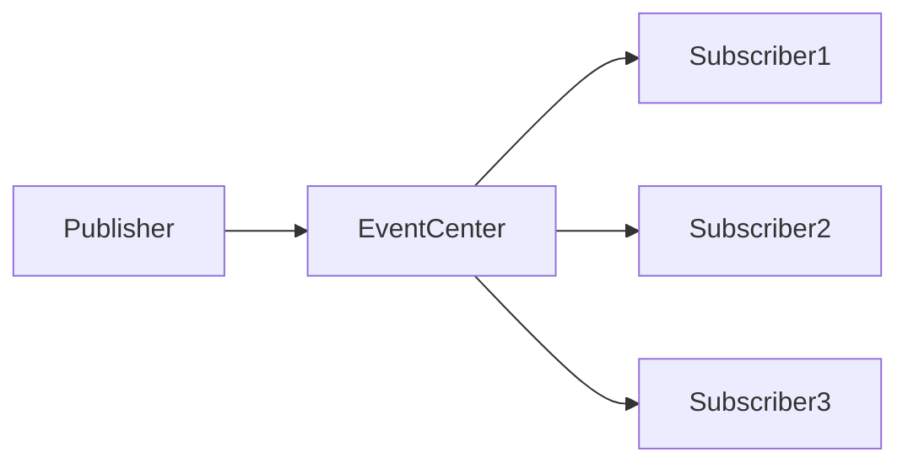

> 写给普通开发者的设计模式入门与实战手册

你是不是有过这样的经历：看了一堆设计模式的文章，当时觉得懂了，过两天又忘了怎么用？或者写代码时隐约感觉这个地方可以用某种模式，但又说不上来是什么？

别担心，这篇文章就是写给你的。我们不追求"把23种模式全部背下来"这种目标，而是让你真正理解：**什么时候该用什么模式，什么时候不该用，以及怎么在自己的项目里用起来**。

---

## 先搞清楚：什么是设计模式？

打个比方。假设你要装修一套房子，厨房怎么布局、卫生间的管道怎么走、客厅的插座放哪里——这些事情前人早就总结出一套经验了，你不需要从零发明，直接借鉴就行。

设计模式就是这个意思。它是**程序员在长期实践中总结出来的套路**，专门用来解决软件开发中反复出现的共性问题。

为什么学设计模式？

- **代码更容易维护**：别人接手你的代码时，不会一脸问号
- **应对需求变化**：加新功能时不用改旧代码，直接扩展就行
- **少走弯路**：很多坑前人已经踩过了，直接用成熟的方案

但要记住一句话：**设计模式是手段，不是目的。** 为了用模式而用模式，只会让简单问题变复杂。

---

## 1. 软件设计的基石：SOLID 五大原则

在具体聊各种模式之前，有几个基本原则你必须了解。这些原则就像是武功的"内功心法"，掌握了它们，你理解设计模式会快很多。

### OCP：开放封闭原则

**对扩展开放，对修改封闭。**

听起来有点绕，我给你讲个故事。

你开了家汉堡店，最初只卖牛肉汉堡。后来顾客说想要鸡肉汉堡、猪肉汉堡，你怎么办？

**错误做法**：直接去改做汉堡的机器，让它能做鸡肉的、猪肉的。这样做的问题是：每次加新品种都要改机器，万一把牛肉汉堡的功能改坏了怎么办？

**正确做法**：机器预留一个"换肉"的接口，加新品种时换不同的肉饼就行，不用动机器本身。

在前端代码里，这个原则体现为：

```typescript
// ❌ 错误：直接在组件里写死判断逻辑
function Button({ type, children }) {
  if (type === 'primary') {
    return <button className="bg-blue-500">{children}</button>
  } else if (type === 'danger') {
    return <button className="bg-red-500">{children}</button>
  }
  // 每加一种类型都要改这里...
}

// ✅ 正确：预留扩展接口
function Button({ variant = 'default', children, ...props }) {
  return (
    <button
      className={`btn btn-${variant}`}
      {...props}
    >
      {children}
    </button>
  )
}
```

Vue 的 `slot` 机制就是很好的例子：你不需要改组件代码，往 slot 里塞什么内容都行。

### SRP：单一职责原则

**一个东西只做一件事。**

这个很好理解，就像你不会让一个人同时做厨师、服务员、收银员一样，代码也应该各司其职。

在前端项目里的实际应用：

```typescript
// ❌ 错误：一个组件干了三件事
function UserProfile({ userId }) {
  const [user, setUser] = useState(null)
  const [posts, setPosts] = useState([])

  useEffect(() => {
    // 发请求获取用户
    fetchUser(userId).then(setUser)
    // 发请求获取帖子
    fetchPosts(userId).then(setPosts)
    // 发送埋点
    trackView('profile', userId)
  }, [userId])

  return (
    <div>
      {/* 渲染用户信息 */}
      <UserInfo user={user} />
      {/* 渲染帖子列表 */}
      <PostList posts={posts} />
    </div>
  )
}

// ✅ 正确：拆分成三个各司其职的部分
// 1. 获取数据的 hook
function useUser(userId) {
  const [user, setUser] = useState(null)
  useEffect(() => {
    fetchUser(userId).then(setUser)
  }, [userId])
  return user
}

// 2. 发送埋点的 hook
function useTrackView(pageName, id) {
  useEffect(() => {
    trackView(pageName, id)
  }, [pageName, id])
}

// 3. 纯粹的 UI 组件
function UserProfile({ userId }) {
  const user = useUser(userId)
  useTrackView('profile', userId)

  return <UserInfo user={user} />
}
```

拆分之后，每个部分都很容易单独测试和复用。

### LSP：里氏替换原则

**子类可以扩展父类的功能，但不能改变父类原有的功能。**

简单说就是：**儿子可以比父亲更厉害，但不能不听话。**

用前端的例子来讲：

```typescript
// 父类：鸟
class Bird {
	fly() {
		return '鸟在天上飞'
	}
}

// ✅ 正确的子类：企鹅（虽然不会飞，但它有自己的方式）
class Penguin extends Bird {
	swim() {
		return '企鹅在水里游'
	}
}

// ❌ 错误的子类：直接改变了父类的行为
class DeadBird extends Bird {
	fly() {
		throw new Error('我死了，飞不了') // 这就违反了里氏替换原则
	}
}
```

在 TypeScript 里，这个原则提醒我们：用继承时，子类必须能完全替代父类使用，不能出现"用了子类反而出错"的情况。

### ISP：接口隔离原则

**不要强迫别人用不需要的东西。**

打个比方：你去餐厅点餐，菜单上写着"必须点套餐，不接受单点"——这就是接口隔离原则的反面教材。

在前端代码里常见的问题是 props 过于臃肿：

```typescript
// ❌ 错误：把不需要的 props 也传给组件
function UserCard({ name, age, email, phone, address, avatar, bio, ...extras }) {
  return <div>{name}</div>
}

// 调用时
<UserCard
  name="张三"
  age={25}
  email="zhangsan@example.com" // 这个组件根本用不到这些
  phone="13800138000"
  address="北京市"
  avatar="xxx.jpg"
  bio="这是个人简介"
/>

// ✅ 正确：按需拆分接口
function BasicInfo({ name, avatar }) { return <div>{name}</div> }
function ContactInfo({ email, phone }) { return <div>{email}</div> }
function FullProfile({ name, email, phone, ... }) { /* ... */ }
```

### DIP：依赖倒置原则

**面向接口编程，依赖于抽象而不是具体实现。**

这句话听起来很玄乎，我给你举个例子。

你要组装一台电脑，CPU、内存、硬盘的接口是固定的（抽象的），不管你买Intel还是AMD的CPU，只要接口对就能用。

在前端项目里，这个原则体现为依赖注入：

```typescript
// ❌ 错误：直接依赖具体实现
class UserService {
  private db = new MySQLDatabase() // 写死了

  getUser(id) {
    return this.db.query(...)
  }
}

// ✅ 正确：依赖抽象接口
interface Database {
  query(sql: string): any
}

class UserService {
  constructor(private db: Database) {} // 哪个数据库都行

  getUser(id) {
    return this.db.query(`SELECT * FROM users WHERE id = ${id}`)
  }
}

// 换数据库时，不用改 UserService
const mysqlDb = new MySQLDatabase()
const userService = new UserService(mysqlDb)

// 或者
const postgresDb = new PostgreSQLDatabase()
const userService2 = new UserService(postgresDb)
```

Angular 的服务注入就大量使用了这个原则。

### 补充：Unix 设计哲学

写前端代码时，可以借鉴 Unix 的设计哲学：

1. **小即是美**：一个函数、一个组件，只做一件事
2. **每个工具只做一件事**：不要让一个函数承担太多职责
3. **管道思想**：函数式编程中的 `compose` 和 `pipe` 就体现了这个思想

```typescript
// 管道式组合函数
const pipe =
	(...fns) =>
	(x) =>
		fns.reduce((v, f) => f(v), x)

const processUser = pipe(
	validateInput, // 第一步：验证输入
	normalizeData, // 第二步：标准化数据
	saveToDatabase, // 第三步：保存
	sendNotification, // 第四步：发送通知
)

processUser(rawData)
```

---

## 2. 创建型模式：对象的诞生地

创建型模式解决的是"**对象怎么创建出来**"的问题。为什么要关心这个？因为对象的创建方式会影响代码的灵活性和可维护性。

### 2.1 工厂模式 (Factory Pattern)

**什么时候用**：当创建对象的过程比较复杂，或者需要根据不同条件创建不同类型的对象时。

**生活类比**：你去麦当劳点餐，不用自己动手做汉堡，告诉服务员你要什么，服务员帮你做好。服务员就是一个"工厂"。

#### 实战 A：jQuery 的 `$`

用过 jQuery 吗？`$('div')` 这种写法背后就是工厂模式：

```typescript
class jQuery {
	constructor(selector: string) {
		// 复杂的 DOM 查询逻辑
		const dom = Array.from(document.querySelectorAll(selector))
		for (let i = 0; i < dom.length; i++) {
			this[i] = dom[i]
		}
		this.length = dom.length
	}

	addClass(name: string) {
		// 添加类的逻辑
	}

	// ... 还有很多方法
}

// 工厂函数：用户不需要知道 jQuery 类的存在
window.$ = function (selector: string) {
	return new jQuery(selector)
}

// 使用时
$('div').addClass('active')
```

用户只需要知道 `$()` 能帮你查 DOM，不需要知道背后的 `jQuery` 类是怎么工作的。

#### 实战 B：React 的 `createElement`

React 为什么能用 JSX 写 UI？因为有 `createElement` 这个工厂函数：

```typescript
// React 内部就是这样把 JSX 转成对象的
function createElement(type, props, ...children) {
	return {
		type, // 标签名，如 'button'，或者组件
		props: {
			...props,
			children: children.map((c) => (typeof c === 'object' ? c : { type: 'TEXT_ELEMENT', props: { nodeValue: c } })),
		},
	}
}

// <button className="btn">点我</button>
// 编译后变成：
createElement('button', { className: 'btn' }, '点我')
```

#### 什么时候不用

如果你的对象创建很简单，比如只是 `new Something()`，那就别折腾了，工厂模式是来解决复杂问题的。

### 2.2 单例模式 (Singleton Pattern)

**什么时候用**：某个东西只需要一个实例，比如全局状态管理、弹窗容器、全局配置。

**生活类比**：一个国家只能有一个总统（正常情况下），一个公司只能有一个 CEO。

#### 实战：全局 Modal 容器

页面上的 Modal 弹窗，不需要每次都创建一个新容器：

```typescript
class Modal {
	// 关键：静态属性，类级别只有一个
	private static instance: Modal
	private container: HTMLElement

	// 关键：构造函数私有化，不能用 new Modal()
	private constructor() {
		this.container = document.createElement('div')
		this.container.id = 'global-modal'
		document.body.appendChild(this.container)
	}

	// 关键：通过 getInstance 获取唯一实例
	public static getInstance(): Modal {
		if (!Modal.instance) {
			Modal.instance = new Modal()
		}
		return Modal.instance
	}

	show(content: string) {
		this.container.innerHTML = content
		this.container.style.display = 'block'
	}

	hide() {
		this.container.style.display = 'none'
	}
}

// 使用时，不管调用多少次，拿到的都是同一个实例
const modal1 = Modal.getInstance()
const modal2 = Modal.getInstance()
console.log(modal1 === modal2) // true
```

Vuex/Pinia 的 store 就是单例模式的应用，确保全局状态只有一个来源。

#### 什么时候不用

- 需要创建多个实例的时候
- 实例之间需要相互独立的时候
- 单例会导致测试困难的地方

### 2.3 原型模式 (Prototype Pattern)

**什么时候用**：需要创建大量相似的对象，但每个对象只有少量属性不同时。

**生活类比**：盖楼用的图纸，原型是一样的，但可以根据需要改颜色、材料等。

#### 实战：`Object.create` 与属性描述符

JavaScript 的原型链本身就是原型模式的应用：

```typescript
// 定义基础模板
const baseUser = {
	getRole() {
		return this.role
	},
	introduce() {
		return `我是${this.name}`
	},
}

// 以 baseUser 为原型创建新对象
const admin = Object.create(baseUser, {
	role: {
		value: 'ADMIN',
		writable: false, // 不可修改
	},
	permissions: {
		value: ['READ', 'WRITE', 'DELETE'],
		writable: false,
	},
	name: { value: '管理员' },
})

const normalUser = Object.create(baseUser, {
	role: { value: 'USER' },
	name: { value: '普通用户' },
})

console.log(admin.getRole()) // ADMIN
console.log(admin.introduce()) // 我是管理员
console.log(normalUser.getRole()) // USER
```

Vue 的 `data` 选项就是基于原型模式的：所有实例共享一份原型方法，但各自拥有不同的数据属性。

---

## 3. 结构型模式：对象的组织艺术

结构型模式关注的是"**怎么把东西组装起来**"，就像搭积木，怎么组合决定了最终的样子。

### 3.1 代理模式 (Proxy Pattern)

**什么时候用**：需要在访问某个对象之前或之后做一些额外的事情，比如权限校验、缓存、日志记录。

**生活类比**：你去公司找 CEO，前台会先拦下你问"你有预约吗？"，这就是前台在扮演代理的角色。

#### 实战：Vue3 响应式原理

Vue3 的响应式系统就是基于 Proxy 实现的：

```typescript
function reactive<T extends object>(target: T): T {
	return new Proxy(target, {
		get(target, key, receiver) {
			const res = Reflect.get(target, key, receiver)

			// 访问属性时，自动打印日志
			console.log(`读取 ${String(key)}`)

			// 如果是函数，绑定回原对象
			if (typeof res === 'function') {
				return res.bind(target)
			}

			// 如果是对象，继续递归代理（深度响应式）
			return typeof res === 'object' && res !== null ? reactive(res) : res
		},

		set(target, key, value, receiver) {
			console.log(`设置 ${String(key)} = ${value}`)
			return Reflect.set(target, key, value, receiver)
		},
	})
}

// 使用
const state = reactive({ count: 0 })
state.count++ // 自动打印日志："读取 count"，"设置 count = 1"
```

这就是为什么 Vue3 里修改数据就能自动更新视图——Proxy 替你做了"拦截"的工作。

#### 实战：图片懒加载

```typescript
function lazyLoadImage(img: HTMLImageElement, realSrc: string) {
	return new Proxy(img, {
		get(target, prop) {
			if (prop === 'src' && !target.dataset.loaded) {
				// 用占位图
				return target.dataset.placeholder || ''
			}
			return target[prop as keyof HTMLImageElement]
		},
		set(target, prop, value) {
			if (prop === 'src' && value === realSrc) {
				target.dataset.loaded = 'true'
			}
			target[prop as keyof HTMLImageElement] = value
		},
	})
}
```

### 3.2 装饰器模式 (Decorator Pattern)

**什么时候用**：需要在不修改原有代码的情况下，给对象添加新功能。AOP（面向切面编程）就是装饰器模式的典型应用。

**生活类比**：手机壳，手机还是那个手机，但多了保护壳的功能。

#### 实战：TypeScript 装饰器

```typescript
// 计时器装饰器：自动记录函数执行时间
function timeTrack(target: any, name: string, descriptor: PropertyDescriptor) {
	const original = descriptor.value

	descriptor.value = function (...args: any[]) {
		const start = performance.now()
		const result = original.apply(this, args)
		const duration = performance.now() - start
		console.log(`${name} 执行耗时: ${duration.toFixed(2)}ms`)
		return result
	}

	return descriptor
}

class ApiService {
	@timeTrack
	fetchUserList() {
		// 模拟 API 请求
		return new Promise((resolve) => setTimeout(() => resolve([1, 2, 3]), 500))
	}

	@timeTrack
	fetchDetail(id: number) {
		return new Promise((resolve) => setTimeout(() => resolve({ id }), 200))
	}
}

const api = new ApiService()
api.fetchUserList() // 输出：fetchUserList 执行耗时: 502.34ms
```

#### 实战：Redux `connect` 的原理

Redux 的 `connect` 函数本质上就是装饰器模式——它"装饰"组件，给组件添加 Redux 状态和 dispatch 能力。

### 3.3 适配器模式 (Adapter Pattern)

**什么时候用**：当两个不兼容的接口需要一起工作的时候。

**生活类比**：手机充电头转换器，插座是三孔的，充电器是两孔的，转换器让它们能一起工作。

#### 实战：适配新旧 API 接口

```typescript
// 旧接口返回的数据格式
interface OldUser {
  name: string
  age: number
  job_detail: string  // 下划线格式
}

// 新接口期望的数据格式
interface NewUser {
  fullName: string
  years: number
  jobDetail: string   // 驼峰格式
}

// 适配器：把旧格式转成新格式
class UserAdapter {
  static adapt(oldUser: OldUser): NewUser {
    return {
      fullName: oldUser.name,
      years: oldUser.age,
      jobDetail: oldUser.job_detail,
    }
  }
}

// 使用：在调用新组件之前先适配
async function loadUserProfile(userId: string) {
  const oldData = await oldApi.getUser(userId)  // 旧接口
  const user = UserAdapter.adapt(oldData)       // 转成新格式
  return <UserProfile user={user} />            // 喂给新组件
}
```

这个模式在前端对接后端 API 时特别有用——后端返回的数据格式和你前端期望的格式往往不一致。

### 3.4 外观模式 (Facade Pattern)

**什么时候用**：当某个功能需要调用很多底层 API，但使用者只想简单调用时。

**生活类比**：电视遥控器，你按一个"开机"按钮，背后电视在做的事情（打开屏幕、连接信号、调节音量）你不需要知道。

#### 实战：Vue `computed` 的封装

Vue 的 `computed` 就是典型的外观模式——它把依赖收集、脏值检查、缓存管理等复杂逻辑都藏在".value"这个简单的接口后面。

```typescript
// 你的代码：写起来很简单
const fullName = computed(() => firstName.value + ' ' + lastName.value)

// Vue 背后做的事：
// 1. 记录依赖关系（firstName, lastName）
// 2. 检测数据变化
// 3. 重新计算值
// 4. 缓存结果避免重复计算
// 5. 通知依赖方更新
```

---

## 4. 行为型模式：对象的交互逻辑

行为型模式关注的是"**对象之间怎么通信**"，就像人与人之间的沟通方式。

### 4.1 观察者模式 (Observer Pattern)

**什么时候用**：当某个对象的状态变化需要通知其他对象时。

**生活类比**：微信公众号。你关注了一个号，作者发文章时，所有订阅者都会收到通知。

```typescript
// 简单实现
class Subject {
	private observers: Function[] = []

	// 订阅
	subscribe(observer: Function) {
		this.observers.push(observer)
	}

	// 取消订阅
	unsubscribe(observer: Function) {
		this.observers = this.observers.filter((o) => o !== observer)
	}

	// 发布：状态变化时通知所有订阅者
	notify(data: any) {
		this.observers.forEach((observer) => observer(data))
	}
}

// 使用
const news = new Subject()

news.subscribe((content) => console.log('用户A收到了：' + content))
news.subscribe((content) => console.log('用户B收到了：' + content))

news.notify('新产品发布啦！')
// 输出：
// 用户A收到了：新产品发布啦！
// 用户B收到了：新产品发布啦！
```

Vue 的响应式系统本质上就是观察者模式：`data` 是 Subject，`watcher` 是 Observer，当 `data` 变化时自动通知 `watcher` 更新。

### 4.2 发布订阅模式 (Pub-Sub Pattern)

观察者模式的升级版，多了一个"调度中心"，发布者和订阅者不需要直接认识对方。



```typescript
type Handler = (data?: any) => void

class EventEmitter {
	private events: Map<string, Handler[]> = new Map()

	// 订阅
	on(name: string, fn: Handler) {
		const handlers = this.events.get(name) || []
		handlers.push(fn)
		this.events.set(name, handlers)
	}

	// 发布
	emit(name: string, data?: any) {
		this.events.get(name)?.forEach((fn) => fn(data))
	}

	// 取消订阅
	off(name: string, fn: Handler) {
		const handlers = this.events.get(name)
		if (handlers) {
			this.events.set(
				name,
				handlers.filter((h) => h !== fn),
			)
		}
	}
}

// 使用
const bus = new EventEmitter()

// A 组件订阅事件
bus.on('user-login', (user) => {
	console.log('收到了用户登录信息：', user)
})

// B 组件发布事件
setTimeout(() => {
	bus.emit('user-login', { name: '张三', time: Date.now() })
}, 1000)
```

**观察者模式 vs 发布订阅模式**

| 对比项   | 观察者模式                | 发布订阅模式        |
| -------- | ------------------------- | ------------------- |
| 通信方式 | Subject 直接通知 Observer | 通过中间件/事件中心 |
| 耦合度   | 发布者和订阅者耦合        | 完全解耦            |
| 使用场景 | Vue 响应式                | 跨组件通信          |
| 灵活性   | 低                        | 高                  |

### 4.3 策略模式 (Strategy Pattern)

**什么时候用**：当有多种算法或行为可以互换，但不想用一堆 if-else 来判断时。

**生活类比**：去北京，你可以坐地铁、公交、打车、骑车——具体选哪个，根据实际情况来定。

#### 实战：表单验证规则

```typescript
// 定义各种验证策略
const validatorStrategies = {
	// 不能为空
	isNonEmpty: (val: string) => {
		return val.trim().length > 0 || '请填写此项'
	},

	// 最小长度
	minLength: (val: string, len: number) => {
		return val.length >= len || `至少需要 ${len} 个字符`
	},

	// 最大长度
	maxLength: (val: string, len: number) => {
		return val.length <= len || `最多 ${len} 个字符`
	},

	// 邮箱格式
	isEmail: (val: string) => {
		const emailRegex = /^[^\s@]+@[^\s@]+\.[^\s@]+$/
		return emailRegex.test(val) || '请输入有效的邮箱地址'
	},

	// 手机号
	isPhone: (val: string) => {
		const phoneRegex = /^1[3-9]\d{9}$/
		return phoneRegex.test(val) || '请输入有效的手机号'
	},
}

// 验证器类
class FormValidator {
	private checks: Array<() => string | true> = []

	// 添加验证规则
	add(value: string, rule: keyof typeof validatorStrategies, ...args: any[]) {
		const strategy = validatorStrategies[rule]
		this.checks.push(() => strategy(value, ...args))
	}

	// 执行验证
	validate() {
		for (const check of this.checks) {
			const result = check()
			if (result !== true) {
				return result // 返回第一条错误信息
			}
		}
		return true // 全部通过
	}
}

// 使用
const validator = new FormValidator()

validator.add('test@example.com', 'isEmail')
validator.add('13800138000', 'isPhone')
validator.add('123456', 'minLength', 6)

const result = validator.validate()
console.log(result) // true

// 或者中途就发现错误
const validator2 = new FormValidator()
validator2.add('', 'isNonEmpty')
validator2.add('abc', 'isEmail')

console.log(validator2.validate()) // "请填写此项"
```

这种方式比 `if-else` 优雅多了，而且添加新规则只需要在 `validatorStrategies` 里加一项。

### 4.4 迭代器模式 (Iterator Pattern)

**什么时候用**：需要统一遍历各种不同类型的数据结构时。

**生活类比**：不管你用的是哪种遥控器（空调、电视、机顶盒），"上一台"和"下一台"按钮的用法都是一样的。

#### 实战：`Symbol.iterator`

```typescript
// 让自定义对象可以被 for...of 遍历
const myIterable = {
	[Symbol.iterator]: function* () {
		yield 1
		yield 2
		yield 3
	},
}

for (const num of myIterable) {
	console.log(num) // 1, 2, 3
}

// 数组展开也可以用
console.log([...myIterable]) // [1, 2, 3]
```

JavaScript 内置的数据结构（Array, Map, Set, NodeList 等）都已经实现了迭代器，所以你可以用统一的方式遍历它们。

```typescript
// 统一的遍历方式
const arr = [1, 2, 3]
const map = new Map([
	['a', 1],
	['b', 2],
])
const set = new Set([1, 2, 3])
const nodeList = document.querySelectorAll('div')

// 都可以用 for...of 遍历
for (const item of arr) {
}
for (const [key, value] of map) {
}
for (const item of set) {
}
for (const node of nodeList) {
}
```

---

## 总结：怎么用好设计模式

### 三大类型一句话总结

- **创建型**：这个对象**谁来创建**、**怎么创建**
- **结构型**：这些对象**怎么组装**成更大的结构
- **行为型**：这些对象**怎么通信**

### 什么时候该用，什么时候不该用

| 该用的情况                       | 不该用的情况               |
| -------------------------------- | -------------------------- |
| 代码反复出现相同的问题           | 简单到不需要模式           |
| 需要团队协作、代码需要被他人维护 | 过度设计会让简单问题变复杂 |
| 需求经常变化，需要灵活扩展       | 强行套用模式会适得其反     |
| 需要提高代码复用性               |                            |

### 一个项目里通常会混用多种模式

比如 Vue 就同时用了：

- **代理模式**：实现响应式
- **观察者模式**：依赖更新
- **工厂模式**：创建 VNode
- **单例模式**：全局组件

---

## 常见问题

**Q：需要把所有 23 种设计模式都记住吗？**

不需要。记住最常用的几种（工厂、单例、代理、观察者、策略）就够了。其他的在需要的时候再查资料、看源码。

**Q：怎么判断该用哪种模式？**

问自己几个问题：

1. 是对象创建的问题吗？→ 创建型
2. 是对象组合的问题吗？→ 结构型
3. 是对象通信的问题吗？→ 行为型

**Q：设计模式会不会让代码变复杂？**

会的。所以有个原则叫 YAGNI（You Aren't Gonna Need It）——你可能不需要它。在代码还没变得复杂之前，不要急着引入设计模式。

---

_掌握设计模式不是为了炫耀技术，而是为了让代码更易维护、更易扩展。写代码的终极目标是把产品做好，而不是写出让面试官惊叹的"完美代码"。_
