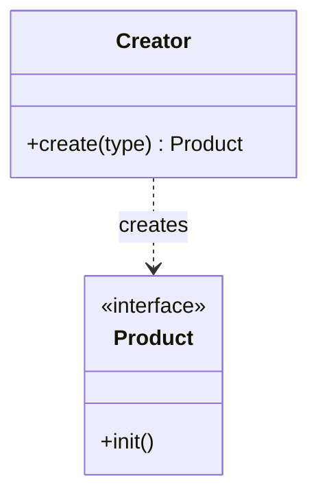
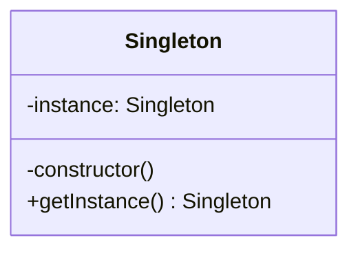
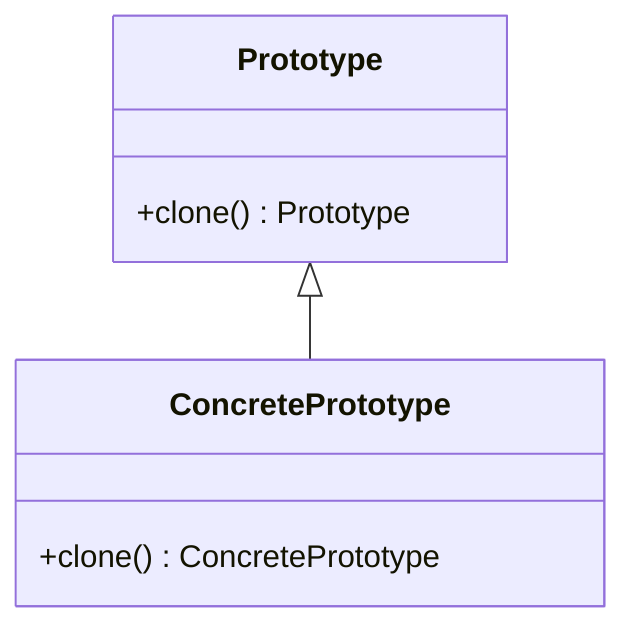
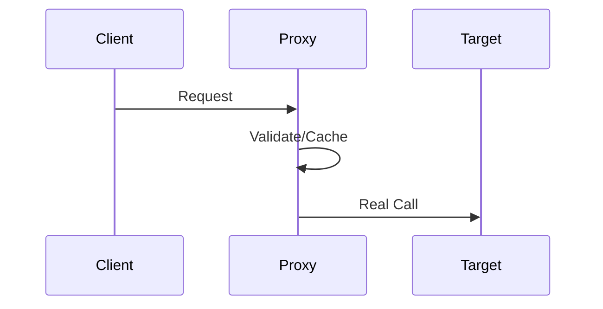
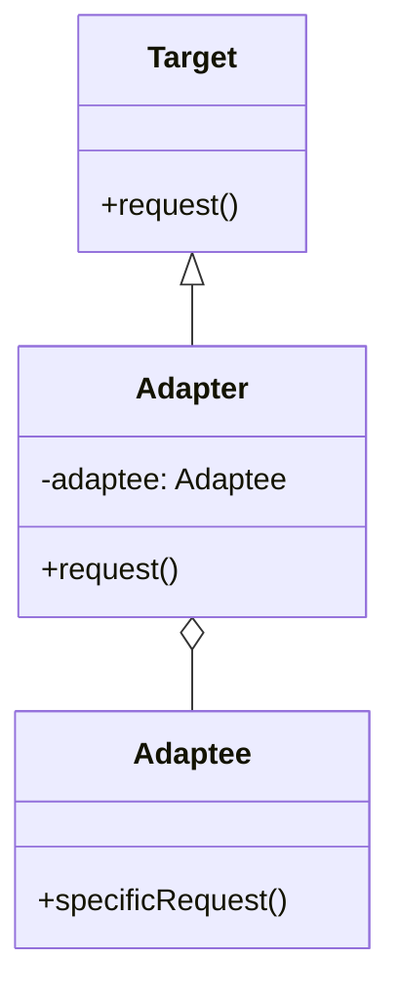
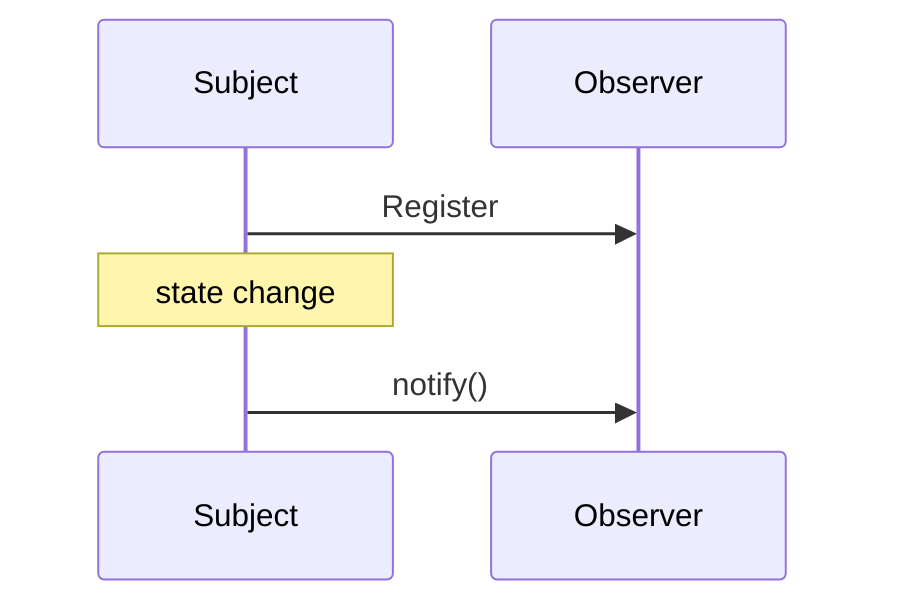
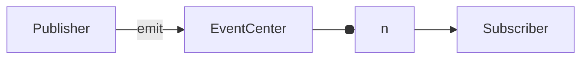
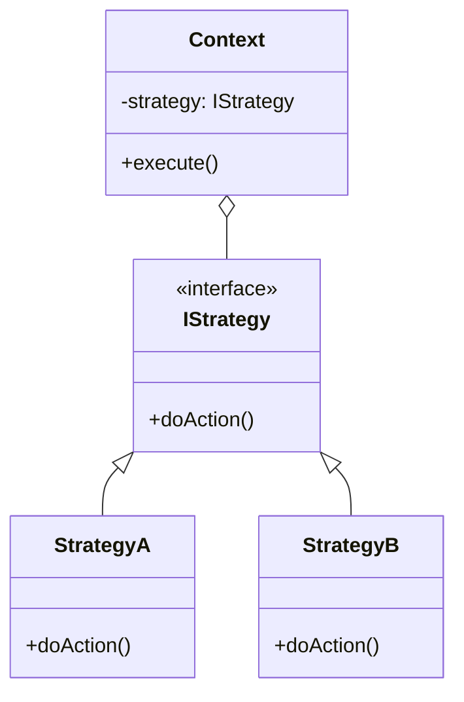

设计模式（Design Patterns）是解决软件设计中常见问题的通用方案。在前端领域，合理运用设计模式能显著提升代码的可维护性、扩展性和复用性。

## 1. 软件设计的基石：SOLID 五大原则

在学习具体的设计模式之前，理解底层的设计原则是至关重要的。设计模式本质上是这些原则在不同场景下的最佳实践。

| 原则简称 | 全称                                 | 核心思想                                               | 前端应用场景                                                                         |
| :------- | :----------------------------------- | :----------------------------------------------------- | :----------------------------------------------------------------------------------- |
| **OCP**  | 开放封闭原则 (Open/Closed)           | **对扩展开放，对修改封闭。**                           | 组件设计时，预留 `slot` 或 `props` 以支持扩展，而不是直接修改组件内部逻辑。          |
| **SRP**  | 单一职责原则 (Single Responsibility) | **一个类/函数只做一件事。**                            | 将复杂的组件拆分为 UI 组件和容器组件；自定义 Hooks 抽离单一业务逻辑。                |
| **LSP**  | 里氏替换原则 (Liskov Substitution)   | **子类可以扩展父类的功能，但不能改变父类原有的功能。** | 前端使用相对较少，主要在 TS 面向对象继承时确保类型和行为的一致性。                   |
| **ISP**  | 接口隔离原则 (Interface Segregation) | **保持接口的单一性，拒绝臃肿的接口。**                 | TS 定义 `interface` 时，按功能拆分，避免一个组件强行传入不需要的庞大 `props` 对象。  |
| **DIP**  | 依赖倒置原则 (Dependency Inversion)  | **面向接口编程，依赖于抽象而不是具体实现。**           | 依赖注入 (DI)，如 Angular 的服务注入，或前端项目中通过接口定义数据层与视图层的边界。 |

**Linux/Unix 设计哲学补充：**
在前端工具链（如 Webpack 插件、Babel 插件、Vite 插件）的设计中，“小即是美”和“每个工具只做一件事”体现得淋漓尽致。管道符（Pipe）的思想也深刻影响了函数式编程中的 `compose` 和 `pipe` 函数。

---

## 2. 创建型模式：对象的诞生地

### 2.1 工厂模式 (Factory Pattern)

遇到大量 `new Class` 的地方，就应考虑工厂模式。



#### 实战 A：jQuery 的 `$`

```typescript
class jQuery {
	constructor(selector: string) {
		const dom = Array.from(document.querySelectorAll(selector))
		for (let i = 0; i < dom.length; i++) {
			this[i] = dom[i]
		}
		this.length = dom.length
	}
	addClass(name: string) {
		/* ... */
	}
}

// 工厂函数：用户不需要手动 new
window.$ = function (selector: string) {
	return new jQuery(selector)
}
```

#### 实战 B：React `createElement`

```typescript
function createElement(type, props, ...children) {
	return {
		type,
		props: {
			...props,
			children: children.map((c) => (typeof c === 'object' ? c : { type: 'TEXT_ELEMENT', props: { nodeValue: c } })),
		},
	}
}
```

### 2.2 单例模式 (Singleton Pattern)

确保一个类只有一个实例。



#### 实战：全局 Modal 容器

```typescript
class Modal {
	private static instance: Modal
	private container: HTMLElement

	private constructor() {
		this.container = document.createElement('div')
		this.container.id = 'global-modal'
		document.body.appendChild(this.container)
	}

	public static getInstance(): Modal {
		if (!Modal.instance) Modal.instance = new Modal()
		return Modal.instance
	}

	show(content: string) {
		this.container.innerHTML = content
	}
}
```

### 2.3 原型模式 (Prototype Pattern)

通过克隆现有对象来创建新对象，在 JS 中表现为“原型继承”。



#### 实战：`Object.create` 与属性描述符

```typescript
const baseUser = {
	getRole() {
		return this.role
	},
}

// 以 baseUser 为原型创建新对象
const admin = Object.create(baseUser, {
	role: { value: 'ADMIN' },
	permissions: { value: ['READ', 'WRITE'], writable: false },
})

console.log(admin.getRole()) // ADMIN
```

---

## 3. 结构型模式：对象的组织艺术

### 3.1 代理模式 (Proxy Pattern)

控制对目标对象的访问，实现过滤、缓存或日志。



#### 实战：Vue3 响应式与 `this` 绑定修复

```typescript
function reactive<T extends object>(target: T): T {
	return new Proxy(target, {
		get(target, key, receiver) {
			const res = Reflect.get(target, key, receiver)
			// 修复：如果是原生对象的方法（如 Map.get），需绑定回原 target
			return typeof res === 'function' ? res.bind(target) : res
		},
		set(target, key, value, receiver) {
			console.log(`Setting ${String(key)} to ${value}`)
			return Reflect.set(target, key, value, receiver)
		},
	})
}
```

### 3.2 装饰器模式 (Decorator Pattern)

动态地为对象添加额外职责。

#### 实战：Redux `connect` 与 AOP

```typescript
// TS 装饰器示例：记录执行耗时
function timeTrack(target: any, name: string, descriptor: PropertyDescriptor) {
	const original = descriptor.value
	descriptor.value = function (...args: any[]) {
		const start = performance.now()
		const result = original.apply(this, args)
		console.log(`${name} took ${performance.now() - start}ms`)
		return result
	}
}

class ApiService {
	@timeTrack
	fetchData() {
		/* 模拟请求 */
	}
}
```

### 3.3 适配器模式 (Adapter Pattern)

将一个接口转换成客户期望的另一个接口，解决不兼容问题。



#### 实战：适配新旧 API 接口

```typescript
// 旧接口返回格式
interface OldUser {
	name: string
	age: number
}
// 新接口期望格式
interface NewUser {
	fullName: string
	years: number
}

class UserAdapter {
	static adapt(oldUser: OldUser): NewUser {
		return {
			fullName: oldUser.name,
			years: oldUser.age,
		}
	}
}

// 在代码中使用：将旧数据喂给新组件
const oldData = { name: 'Max', age: 25 }
const adaptedData = UserAdapter.adapt(oldData)
```

### 3.4 外观模式 (Facade Pattern)

为复杂的子系统提供统一的高层接口。

#### 实战：Vue `computed` 的封装

Vue 的 `computed` 将依赖收集、脏值检查、缓存管理等复杂逻辑封装在一个简单的 `.value` 接口下。

---

## 4. 行为型模式：对象的交互逻辑

### 4.1 观察者模式 (Observer Pattern)

Subject 维护 Observer 列表，状态变化时直接通知。



### 4.2 发布订阅模式 (Pub-Sub Pattern)

观察者模式的变体，通过“调度中心”解耦。



#### 实战：Mitt / EventEmitter 实现

```typescript
type Handler = (data?: any) => void

class EventEmitter {
	private events: Map<string, Handler[]> = new Map()

	on(name: string, fn: Handler) {
		const handlers = this.events.get(name) || []
		handlers.push(fn)
		this.events.set(name, handlers)
	}

	emit(name: string, data?: any) {
		this.events.get(name)?.forEach((fn) => fn(data))
	}

	off(name: string, fn: Handler) {
		const handlers = this.events.get(name)
		if (handlers) {
			this.events.set(
				name,
				handlers.filter((h) => h !== fn),
			)
		}
	}
}
```

### 4.3 策略模式 (Strategy Pattern)

定义一系列算法，将其封装起来，并使它们可以相互替换。避免臃肿的 `if-else`。



#### 实战：表单验证规则

```typescript
const validatorStrategies = {
	isNonEmpty: (val: string) => val.length > 0 || '不能为空',
	minLength: (val: string, len: number) => val.length >= len || `长度需大于${len}`,
	isEmail: (val: string) => /@/.test(val) || '格式错误',
}

class FormValidator {
	private checks: any[] = []
	add(val: string, rule: keyof typeof validatorStrategies, ...args: any[]) {
		this.checks.push(() => validatorStrategies[rule](val, ...args))
	}
	start() {
		for (const check of this.checks) {
			const msg = check()
			if (msg !== true) return msg
		}
		return true
	}
}

// 使用
const validator = new FormValidator()
validator.add('test', 'minLength', 6)
const result = validator.start() // 返回 "长度需大于6"
```

### 4.4 迭代器模式 (Iterator Pattern)

统一遍历各种集合（Array, Map, Set, NodeList）。

#### 实战：`Symbol.iterator`

```typescript
const myIterable = {
	[Symbol.iterator]: function* () {
		yield 1
		yield 2
		yield 3
	},
}

for (const val of myIterable) {
	console.log(val) // 1, 2, 3
}
```

---

## 总结

- **创建型**：关注“谁来创建”、“如何创建”。
- **结构型**：关注“如何组合对象”以实现更大结构。
- **行为型**：关注“对象之间如何通信”。

掌握模式不是为了套用模式，而是为了**解耦、复用、抗压（应对需求变化）**。在实际开发中，往往会多种模式混合使用，如：Vue 既使用了代理模式（响应式），又使用了观察者模式（依赖更新），还使用了工厂模式（VNode）。
