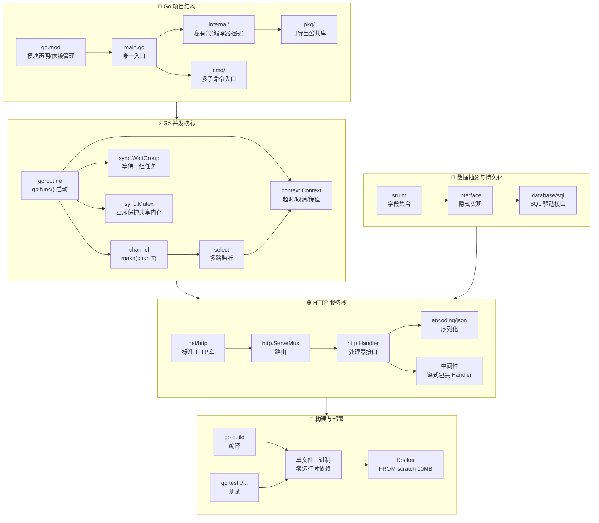

## 那个让我开始认真看 Go 的夜晚

上周四晚上十一点，一个朋友在微信上找我。

他在一家小公司做后端，技术栈是 Python + Django。那天下午他刚把新写的用户服务推到测试环境，然后跟我说了一句话：

"他妈的，我就写了个 CRUD，Docker image 800MB，启动二十秒，监控上看内存稳在 200MB 没掉过。就一个用户表，三个接口。卧槽。"

我理解他的烦躁。这不是他能力问题——Python 的部署体验就是这样。写的时候爽，部署的时候你就开始跟工具链肉搏。

我说："你试过 Go 吗？"

他说："听过，一直没真正写过。语法看着有点怪。Python 写一年了，换语言成本太高。"

"你听我讲。我来给你从头捋一遍。"

这篇文章就是那个对话的整理。不是官方文档，不是我背了一堆概念之后端出来的"全面教程"——就是我最近搞懂的一些东西，用我觉得最舒服的方式讲给你。

---

## 一、Go 是什么，不是什么

先说清楚一件事：Go 不是万能语言。

我知道，你可能会听到有人说 Go 这好那好。然后你跑去用 Go 写机器学习，发现生态跟 Python 差十条街。或者你用 Go 写前端，然后怀疑人生。

Go 诞生于 Google 的服务器机房。三个大佬——Robert Griesemer、Rob Pike、Ken Thompson——当年面对的问题是：C++ 编译太慢，Java 太啰嗦，动态语言上了规模不好维护。他们需要一门语言来写服务器端基础设施。

所以 Go 天然适合这些东西：

- **Web API 和微服务**。JSON 序列化、路由、中间件，标准库就能干。
- **命令行工具**。编译成单文件二进制，给谁谁都能跑。
- **云原生中间件**。Docker、Kubernetes、Prometheus、Terraform，全是用 Go 写的——这不是偶然。
- **代理、网关、消息队列**。高并发场景下 Go 的 goroutine 是硬通货。
- **任何跟网络打交道的东西**。HTTP 服务、TCP 代理、gRPC、WebSocket，Go 的标准库让人觉得"这不就是该有的样子吗"。

它不适合：

- 前端 UI。（别想了，这门语言就没往这方向设计。）
- 数据科学和机器学习。Python 的 NumPy/Pandas/PyTorch 生态 Go 没法取代。
- 操作系统内核。虽然 Docker、K8s 是 Go 写的，但内核还是 C 和 Rust 的事。
- 游戏客户端。有其他更成熟的选择。

明白了这些边界，你心里就有杆秤了。我现在要做的事，是不是 Go 的甜区？

如果是，继续往下看。如果不是，你省了时间，也不亏。

---

## 二、装环境：十分钟的事

Go 的安装简单到让人想骂人——怎么别的东西没这么简单？

```bash
# macOS
brew install go

# Windows
winget install GoLang.Go

# Ubuntu/Debian
sudo apt update && sudo apt install golang-go
```

装完：

```bash
go version
```

看到版本号就完了。不需要虚拟环境，不需要系统包管理器拉一堆依赖，不需要配环境变量（包管理器帮你搞定了）。没有 Python 的 venv，没有 Node 的 nvm 版本冲突，没有 Java 的 Maven/Gradle 地狱。

编辑器的话，VS Code + Go 插件就够了。我自己是终端党，Neovim 也能写。如果你习惯 JetBrains，GoLand 体验更完整。Go 在这方面不挑，你想用啥用啥。

---

## 三、第一个程序：仪式感

新建一个 `main.go`：

```go
package main

import "fmt"

func main() {
    fmt.Println("Hello, Go!")
}
```

然后：

```bash
go run main.go
```

看到终端输出 "Hello, Go!" 了？这事儿就算开始了。

注意两个细节：

1. `package main` 是必须的。Go 用这个判定"这是可执行程序，不是库"。
2. `func main()` 也是必须的。入口就是一个叫 main 的函数，参数为空，没有返回值。

这两个约定很死，但也很清晰——你不会在一个大项目里猜哪个文件是入口。一个 Go 项目最多一个 main 包、一个 main 函数。一清二楚。

---

## 四、go mod：你项目的地契

现代 Go 开发的起手式就一条命令：

```bash
mkdir myapp && cd myapp
go mod init github.com/yourname/myapp
```

执行完后，目录里多了一个 `go.mod` 文件，大概长这样：

```
module github.com/yourname/myapp

go 1.23
```

`go.mod` 是项目的身份证。它记录了三件事：

1. **模块名**——你用 `import "模块名/某包"` 引用自己的代码时用的前缀。
2. **Go 版本**——用哪个版本的 Go 写的。
3. **依赖清单**——你导入了哪些第三方库，以及每个库的版本。

一个典型的项目结构：

```
myapp/
├── go.mod           # 项目身份证
├── go.sum           # 依赖哈希校验，自动生成，别手动改
├── main.go          # 入口文件
├── internal/        # 私有包，外部项目不能导入
│   └── service/
│       └── user.go
├── handler/         # HTTP 处理器
│   └── user_handler.go
└── model/           # 数据结构定义
    └── user.go
```

`internal/` 这个名字是有特殊含义的——Go 编译器强制它下面的包只能被本模块引用。外部项目想导入 `github.com/yourname/myapp/internal/service`？编译器直接拒绝。

这意味着什么？你可以放心地把不想暴露的实现细节丢进 `internal/`，然后对外只暴露一个干净的 API 包。这在大型项目里是救命级的约束。

几个你马上会用到的命令：

```bash
go run .           # 编译并运行当前模块
go build .         # 只编译，生成二进制文件
go test ./...      # 递归跑所有测试
go fmt ./...       # 格式化所有代码
go mod tidy        # 清理没用到的依赖，补上缺的
go doc fmt.Println # 在终端看某个函数/类型的文档
```

一个编译出来的 Go 二进制，没有运行时依赖，没有解释器，没有 .so 文件。你可以把它装在 Docker 里用 `FROM scratch` 只放一个 10MB 的文件就跑起来。对比 Python 那个 800MB 的 image，你体会一下。

---

## 五、语法：比你想象的更简单

Go 的语法设计有一条铁律：**能不要的东西就不要。**

没有 while。没有三元运算符。没有继承。没有构造函数的语法糖。没有 (1.18 之前) 泛型。不是说这些不好——是 Go 的设计者觉得"多一个写法就多一种分歧，多一种分歧就多一份维护成本"。

给你看一段完整的代码，然后咱们逐块聊：

```go
package main

import "fmt"

func main() {
    var name string = "Go"     // 完整声明
    var age = 16               // 类型推导
    city := "Shanghai"         // 短声明，日常最常用

    var enabled bool = true
    var score float64 = 99.5

    fmt.Println(name, age, city, enabled, score)
}
```

### 三种变量声明

- `var name string = "Go"` —— 完整版。你几乎不会在函数里这么写，太啰嗦。
- `var age = 16` —— 类型推导版。类型从右边自动推断。
- `city := "Shanghai"` —— 短声明。你最常用的就是它。90% 的变量你用 `:=` 创建。

但 `:=` 只能用在函数内部。包级别（函数外面）必须用 `var`。

这个限制一开始你觉得烦。但习惯之后你会发现它其实帮你做了作用域的视觉区分——一眼扫过去，`var` 的都是包级变量，`:=` 的都是局部变量。

### 基本类型

Go 的基本类型不多，你把下面这些记住就够了：

- `bool` — 就只有 `true` 和 `false`，没有"真值/假值"的概念。`if 1` 在 Go 里是编译错误。
- `string` — 字符串，不可变。双引号包起来。
- `int`, `int64`, `int32` — 各种长度的有符号整数。日常用 `int`。
- `float64` — 浮点数。日常用这个。
- `byte` — 就是 `uint8`。跟字节打交道的时候用它。
- `rune` — 就是 `int32`。处理 Unicode 码点的时候用。

日常写业务代码，`int`、`string`、`bool`、`float64`、`byte` 这五个就够你用很久了。

### 控制流

```go
score := 85

if score >= 90 {
    fmt.Println("优秀")
} else if score >= 60 {
    fmt.Println("及格")
} else {
    fmt.Println("不及格")
}
```

注意两件事：

1. 条件不需要括号。带上括号编译器也不报错，但 `go fmt` 会自动给你去掉。
2. `{` 必须跟 `if` 同行。这不是编码风格，是语法强制。你换行写 `{`，编译器直接报错。

这个设计太 Go 了——一行规则，消灭了所有团队里关于"左括号放哪"的无意义争论。不是让你选择，是不给你选择。

```go
// Go 只有 for，没有 while
for i := 0; i < 3; i++ {
    fmt.Println(i)
}

// 但你可以这样写，效果跟 while 完全一样
n := 0
for n < 3 {
    fmt.Println(n)
    n++
}

// range 遍历，日常最常用
nums := []int{10, 20, 30}
for i, v := range nums {
    fmt.Println(i, v)  // 索引和值
}
```

`for range` 是你日常写的最多的循环方式。遍历切片、map、channel、字符串，全用它。一行就搞定索引和值，简洁到没有废话。

### 函数和多返回值

```go
package main

import (
    "errors"
    "fmt"
)

func divide(a, b int) (int, error) {
    if b == 0 {
        return 0, errors.New("divisor cannot be zero")
    }
    return a / b, nil
}

func main() {
    result, err := divide(10, 2)
    if err != nil {
        fmt.Println("error:", err)
        return
    }
    fmt.Println("result:", result)
}
```

几点你应该注意到：

1. **参数类型简写**：`a, b int` 意思是两个参数都是 int。不用写 `a int, b int`。
2. **返回值可以有名字也可以没有**。上面这个例子里返回值没有名字，但你可以写 `func divide(a, b int) (result int, err error)`。命名返回值在长函数里有文档作用，但短函数里通常省略。
3. **错误值**。没有 try-catch。没有 throw。函数通过返回一个 `error` 来告诉调用方"出问题了"。

你刚从 Python 或 Java 过来时，会觉得满屏的 `if err != nil` 很烦。

但写过两个项目之后你会意识到：这种"烦"恰恰是 Go 要你的体验。它逼你在每一个可能出错的地方停下来想"出问题了怎么办"。你不会像在 Python 里那样，函数深处抛了个异常，一路冒泡到最外层才被某个不知道谁写的 try-catch 兜底接住——然后你查日志查到天亮。

Go 的哲学：**把错误当数据，不要当异常。显式检查比隐式传播更可靠。**

### 切片和 Map

```go
package main

import "fmt"

func main() {
    // 数组：长度固定，业务代码里用得不多
    arr := [3]int{1, 2, 3}

    // 切片：动态长度，天天用
    nums := []int{10, 20, 30}
    nums = append(nums, 40)  // 追加

    // Map：键值对，字典/缓存/索引 全靠它
    profile := map[string]string{
        "name": "Max",
        "role": "developer",
    }

    fmt.Println(arr)
    fmt.Println(nums)
    fmt.Println(profile["name"])
}
```

**切片**是 Go 里最重要的数据结构，没有之一。它的本质是什么？一个指向底层数组的"视图"——里面装了三样东西：一个指针（指向底层数组从哪里开始）、一个长度、一个容量。

当你把一个切片传给函数时，拷贝的是这三样东西（共 24 字节），底层数组还是共享的。所以函数里改切片元素，外面也能看到变化。

但如果你在函数里 `append` 且触发了扩容——底层数组会重新分配，变成一块新内存——那外面的切片就不会受影响了。这个行为是新手 bug 的重灾区，后面"常见坑"那部分我会细讲。

**Map** 是引用类型。传进函数里改了，外面也变。注意：Map 不是并发安全的。多个 goroutine 同时读写同一个 map，程序直接 panic。正经项目要么用 `sync.Mutex` 包一层，要么用 `sync.Map`。

---

## 六、结构体和方法：Go 的"面向对象"

如果你从 Java 或 C++ 过来，Go 的"面向对象"会让你恍惚——好像什么都见过，但用法全变了。

### 结构体：就是一堆字段的盒子

```go
type User struct {
    Name  string
    Email string
}
```

没有 class。没有构造函数。没有 getter/setter。没有继承。字段首字母大写表示 public，小写表示 private（只能在当前包内访问）。

创建一个 User：

```go
user := User{Name: "Max", Email: "max@example.com"}
```

你想给它加行为？用方法：

```go
// 值接收者：拿到的是 User 的拷贝
func (u User) DisplayName() string {
    return u.Name + " <" + u.Email + ">"
}

// 指针接收者：拿到的是原始 User 的引用
func (u *User) UpdateEmail(email string) {
    u.Email = email
}
```

方法写在结构体外面。那个 `(u User)` 叫"接收者"——表示"我挂在这个类型上"。

接收者分两种：

- **值接收者** `(u User)`：方法拿到一份拷贝。只读场景用它。不修改接收者状态。
- **指针接收者** `(u *User)`：方法拿到原始值的指针。需要修改字段，或者结构体大到拷贝开销不可忽视时用它。

一条简单规则：如果你不确定该用哪个，用指针接收者。既能读又能写，语义统一。而且传指针的开销是固定的 8 字节（在 64 位机器上），不受结构体大小影响。

### 接口：Go 最天才的设计

```go
type Speaker interface {
    Speak() string
}

type Dog struct{}

func (Dog) Speak() string {
    return "汪汪"
}

func printSpeech(s Speaker) {
    fmt.Println(s.Speak())
}

func main() {
    d := Dog{}
    printSpeech(d)  // Dog 自动就实现了 Speaker
}
```

你注意到没有？`Dog` 没有显式写"我实现了 `Speaker`"。它只是刚好有一个 `Speak() string` 的方法，编译器就自动判定它满足 `Speaker` 接口。

这叫**隐式接口实现**。Go 没有 `implements` 关键字。

这事妙在哪？

- 你想在测试里 mock 一个依赖——不需要继承一个抽象类再 override 一堆方法。实现你测试场景用到的那几个方法就行。
- 你的包之间可以做到真正的解耦。包 A 定义接口，包 B 提供实现——但包 B 完全不需要 import 包 A。
- 你可以在事后抽象。先写具体实现，后面发现需要抽象了，抽一个接口。不用在设计阶段画类图。

Go 的接口哲学跟传统 OOP 完全相反：**不是先设计类型体系再实现细节，而是先写好具体的东西再根据使用方式抽出接口。**

---

## 七、goroutine 和 channel：Go 的元神

现在，我们来聊 Go 真正让人心服口服的部分。

### goroutine：轻到你不好意思嫌它重

在其他语言里，"开一个线程"是一件需要掂量的事。线程是操作系统资源——每个线程默认消耗 MB 级内存，调度是有开销的。

Go 的 goroutine 是一个更轻量级的概念。一个 goroutine 初始栈只有几 KB（Go 的栈还能动态伸缩），Go 的 runtime 在少量 OS 线程上调度成百上千甚至上万个 goroutine。

```go
package main

import (
    "fmt"
    "sync"
)

func worker(name string, wg *sync.WaitGroup) {
    defer wg.Done()  // 函数结束时告诉 WaitGroup：我的活干完了
    fmt.Println(name, "is working")
}

func main() {
    var wg sync.WaitGroup

    wg.Add(2)  // 说好有两个任务
    go worker("job-1", &wg)
    go worker("job-2", &wg)

    wg.Wait()  // 等两个都搞定
    fmt.Println("all done")
}
```

`go` 关键字后面跟一个函数调用——就一个关键字，这个函数就变成 goroutine 了。没了。

`sync.WaitGroup` 的用法很简单：`Add(n)` 告诉它有几个任务，每个任务结束时调 `Done()`，`Wait()` 阻塞直到全部完成。比 `time.Sleep` 靠谱一万倍——后者在任务更快完成时浪费时间，在任务更慢时又没等到结果就继续往下走。

### channel：通过通信来共享内存

goroutine 之间怎么交换数据？

你可以用共享内存加锁。但 Go 官方的建议是：

> Don't communicate by sharing memory; share memory by communicating.

翻译成人话：别用共享内存来通信，用通信来共享内存。

channel 就是"用通信来共享数据"的实现。

```go
package main

import "fmt"

func producer(ch chan<- int) {
    for i := 1; i <= 3; i++ {
        ch <- i  // 把数据丢进 channel
    }
    close(ch)  // 丢完了，关掉
}

func main() {
    ch := make(chan int)

    go producer(ch)

    for n := range ch {  // 从 channel 里取数据，直到关闭
        fmt.Println("received:", n)
    }
}
```

把 channel 想象成一根水管：

- 一头灌水（`ch <- value`），另一头接水（`value := <-ch`）
- 水管满的时候灌水的那头会等，空了的时候接水的那头会等——阻塞
- 关了水管（`close(ch)`），接水的那头知道不会再有水了

这个模型太适合生产者-消费者场景了。一个 goroutine 干活，另一个 goroutine 消费结果。代码干净，不需要锁，不容易出死锁。

当然，真实项目里你不只用 channel。你还会用到：

- `sync.Mutex` 和 `sync.RWMutex`：当你确实需要保护一块共享内存时。
- `context.Context`：传递超时、取消信号、请求链路的 trace id 等。
- `errgroup`：并发执行一组任务，任何一个出错就全取消。

但 goroutine + channel 这个组合，是你理解 Go 并发的起点。后面的东西都是在这个基础上做的工程优化。

---

## 八、写个 HTTP 服务，就二十行

你可能会想：Go 写 Web 开发是不是要配一堆框架？

来，看这个：

```go
package main

import (
    "encoding/json"
    "log"
    "net/http"
    "time"
)

type Response struct {
    Message string `json:"message"`
    Time    string `json:"time"`
}

func helloHandler(w http.ResponseWriter, r *http.Request) {
    w.Header().Set("Content-Type", "application/json")

    resp := Response{
        Message: "Hello, Go Web!",
        Time:    time.Now().Format(time.RFC3339),
    }

    if err := json.NewEncoder(w).Encode(resp); err != nil {
        http.Error(w, err.Error(), http.StatusInternalServerError)
    }
}

func main() {
    http.HandleFunc("/hello", helloHandler)

    log.Println("server listening on :8080")
    log.Fatal(http.ListenAndServe(":8080", nil))
}
```

就这些。跑起来，访问 `http://localhost:8080/hello`，你会看到 JSON 响应。

没有框架。没有中间件注册的繁琐步骤。没有装饰器嵌套。就是标准库里的 `net/http`，直接写了就能用。

编译出来是一个独立的二进制文件。扔到任何 Linux 服务器上，`./myapp` 就是你的整个运行时。不需要装解释器，不需要配版本管理器，没有虚拟环境。部署的感觉就是你复制了一个文件，然后跑它。

大了之后，你可能会用 Gin、Echo、Fiber 这些框架——它们提供更方便的路由和中间件。但标准库的能力足够你理解 Web 开发的核心流程了。

---

## 九、测试和那些该养成的习惯

Go 的测试也是标准库自带。

新建一个 `math_test.go`：

```go
package main

import "testing"

func Add(a, b int) int {
    return a + b
}

func TestAdd(t *testing.T) {
    got := Add(2, 3)
    want := 5

    if got != want {
        t.Fatalf("got %d, want %d", got, want)
    }
}
```

约定很简单：测试文件名以 `_test.go` 结尾，测试函数以 `Test` 开头，接收一个 `*testing.T`。

运行：

```bash
go test ./...
```

一行命令，递归跑完所有测试。没有配置，没有插件，没有 pytest 的 fixture 魔法。就是普通函数。

Go 社区有几条不成文的共识，建议你养成肌肉记忆：

1. **提交前跑 `go fmt ./...`。** 代码格式不一致？在 Go 里不存在。`go fmt` 帮你统一到社区唯一标准。你提交的东西跟所有人的格式一模一样。
2. **改完依赖跑 `go mod tidy`。** 你删了 import 忘了解除依赖，或者加了库忘了更新 go.mod——这条命令帮你擦屁股。
3. **不要忽略错误返回值。** Go 编译器允许你用 `_` 丢弃返回值，但你不该这么干。尤其是 error。如果确定某个 error 不可能发生，写注释说清楚为什么。
4. **函数不要超过 50 行。** 如果你发现自己在写一个 80 行的函数，停下来。问自己：这里面是不是藏了多个职责？
5. **包做一件事。** 包名用名词，简洁清晰。不要搞 `util` 包——那是一个没有语义的垃圾桶。

---

## 十、新手坟场：三个最常见的坑

### 坑一：切片共享底层数组

```go
func modifyFirst(s []int) {
    s[0] = 999  // 底层数组被改了，外面也会看到
}
```

切片传递的是描述符的拷贝（24 字节），底层数组还是共享的。所以函数里改元素，外面也会变。

但如果你 `append` 触发了扩容：

```go
func appendAndModify(s []int) {
    s = append(s, 999)  // 触发扩容的话，s 指向新数组了
    s[0] = 111          // 改的是新数组，外面不受影响
}
```

经验规则：如果你要在函数里修改切片内容，要么返回新切片，要么不碰扩容。拿不准的时候，直接 return 新切片。

### 坑二：goroutine 泄漏

goroutine 很轻，但不是免费。一个 goroutine 至少占几 KB 内存。你在循环里不加限制地开 goroutine，然后某天流量上来，几千个 goroutine 同时跑，内存直接炸。

解决办法：用 worker pool。或者用带缓冲的 channel 做并发控制。或者用 `errgroup` 设置 goroutine 上限。总之——别在 for 循环里裸写 `go func()`。

### 坑三：没有 context

一旦你的项目涉及 HTTP 请求、数据库查询、gRPC 调用、消息队列消费——`context.Context` 变成非学不可。

```go
func handleRequest(ctx context.Context, req *Request) error {
    select {
    case <-ctx.Done():
        return ctx.Err()  // 超时了，或者被上游取消了
    case result := <-doWork(req):
        // 正常处理
    }
}
```

在请求入口设置一个超时 context，然后一路传下去。数据库驱动、HTTP 客户端、gRPC 客户端都认 context——超时了会自动取消内部操作，而不是傻等着。

忽略 context 意味着：一个慢查询因为你没设超时挂住整个请求链路，上游超时了它还在跑，最终把连接池榨干。

### 坑四：defer 在循环里堆资源

```go
// 逆天写法——循环里 defer，文件句柄堆到函数结束才释放
for _, file := range files {
    f, _ := os.Open(file)
    defer f.Close()  // 几百次循环 = 几百个文件句柄同时打开
}
```

defer 的执行时机是**包裹它的函数返回时**，不是代码块结束，不是循环迭代结束。你在循环里 defer 开文件，这些文件句柄会一直堆着，直到整个函数跑完。如果你开了 500 个文件，第 501 个可能直接触发操作系统的文件描述符上限。

正确做法只有两条路：要么把循环体抽成一个单独的函数（函数返回时 defer 就执行了），要么别用 defer，手动 close。第一条路更符合 Go 的习惯。

### 坑五：nil interface 不等于 nil——面试钉子户，生产事故常客

```go
var p *User = nil
var i interface{} = p
fmt.Println(i == nil)  // false！卧槽？!
```

Go 的 interface 在内部是两个字段组成的：`(type, value)`。只有 type 和 value **同时为 nil** 时，interface 才等于 nil。

你把 `*User` 类型的 nil 指针赋给 interface，type 字段被填上了 `*User`——从此 interface 就不再是 nil 了。

最坑的场景是函数返回值：

```go
func getUser() *User { return nil }  // 返回类型是 *User

func getSomething() interface{} {
    return getUser()  // 返回值类型是 *User，值是 nil → interface != nil
}
```

调用方 `if getSomething() == nil` 永远进不去。你在 Stack Overflow 上看到的那些"Go interface nil comparison not working"帖子，背后全是这个坑。

记住一条铁律：**如果你想返回 nil interface，直接在 return 语句里写 nil，别赋给一个具类型变量再返回。**

### 坑六：map 并发读写直接 fatal——不是 panic，是直接死

```go
var m = make(map[string]int)
go func() { for { m["a"] = 1 } }()
go func() { for { _ = m["a"] } }()
// 运行几秒：fatal error: concurrent map read and map write
```

Go 的 map 不是并发安全的，跟 Java 的 HashMap 一样。但 Java 最多是数据错乱，Go 是直接 `fatal error`——程序当场暴毙，连 recover 都救不回来。

怎么搞？三条路：
- `sync.RWMutex` 包一层：最万能的方案。读多写少用 RLock/RUnlock。
- `sync.Map`：适合读多写少且 key 相对稳定的场景。不用手动加锁，但 API 别扭（`Load`/`Store`/`Delete`）。
- 用 channel 串行化所有 map 操作：单个 goroutine 持有 map，其他 goroutine 通过 channel 发指令。适合明确的生产者-消费者模型，但代码量最多。

90% 的场景用 `sync.RWMutex` 就够了。别一上来就上 `sync.Map`——它的性能特性不是你直觉想的那样。

### 坑七：time.After 在 select 循环里内存泄漏

```go
for {
    select {
    case <-time.After(5 * time.Second):  // 每次都 new 一个新 timer
        doSomething()
    case <-stopCh:
        return
    }
}
```

`time.After` 内部调用了 `time.NewTimer`。这个 timer 在超时触发之前**不会被 GC 回收**。如果你的循环每秒跑几十次，每次都创建新的 `time.After`，几百个未触发的 timer 就堆在内存里。

修起来也简单——把 `time.NewTimer` 拎到循环外面，用 `Reset` 复用：

```go
timer := time.NewTimer(5 * time.Second)
for {
    select {
    case <-timer.C:
        doSomething()
        timer.Reset(5 * time.Second)
    case <-stopCh:
        timer.Stop()
        return
    }
}
```

`time.After` 只在两种情况下放心用：一是在不需要复用的地方（比如单次超时控制），二是你确认循环频率很低、timer 数量可控。其他场景统统用 `NewTimer` + `Reset`。

---

## 十一、两周，够不够

如果你有其他语言的编程经验，两周足够你从 "Hello World" 写到"一个能部署到服务器的 HTTP API"。

按这个顺序走：

1. **第一天**：变量、基本类型、`if`/`for`/`switch`、函数、多返回值、错误处理。
2. **第二天**：切片、Map、结构体、方法。
3. **第三天**：接口、包管理、`go mod`、项目结构。
4. **第四天**：goroutine、channel、`sync.WaitGroup`。
5. **第五天**：`net/http`、JSON、路由、静态文件。
6. **第六天**：测试、日志、配置管理。
7. **第七天**：连接数据库（`database/sql`），写一个完整的 CRUD API。
8. **第二周**：context、并发控制、超时、限流、部署、Docker。

别贪多。别第一天就想去搞懂泛型。先把"小而完整"的东西做出来——一个能处理请求、能存数据、能返回结果的 API。然后在这个基础上慢慢加东西。

---

## 结束之前，问自己五个问题

我不打算给你写一段漂亮的总结。那些"Go 真是一门好语言"的话你在任何一篇入门文章里都能看到。

我给你一套问题。下次你开始一个新项目或者接手一个老项目的时候，自己掂量：

1. **你写的东西主要吃 CPU 还是吃 IO？** 如果大多数时间是等网络、等数据库、等下游服务——Go 的 goroutine 让等待变成免费午餐。如果主要是数值计算——Python 的 NumPy 或 Rust 可能更合适。

2. **你需要多快的冷启动？** 如果你的服务频繁扩缩容，或者你在搞 Serverless——Go 编译成单文件二进制，比你容器里的 Python runtime + 几百 MB 依赖快十几倍。

3. **你和你的团队能接受显式错误处理吗？** Go 没有 try-catch。所有错误都是 `if err != nil`。代码会有更多行，但出了问题你知道错在哪、谁来负责。如果你觉得这太啰嗦忍不了——Go 会让你每天都想骂人。

4. **你的项目有多依赖第三方生态？** Go 标准库很强，很多时候不需要额外依赖。但如果你重度依赖某个特定生态（Python 的 ML 工具链、JS 的前端工具链）——别强行用 Go，工具没选对痛苦的是你自己。

5. **你在乎三年后的维护成本吗？** Go 的代码风格靠 `go fmt` 强制统一，语法稳定到几乎不加新东西，依赖管理清晰。你三年前写的 Go 代码现在大概率还能编译运行。这不是营销话术——这是你在用 Python 或 JavaScript 维护过一个一年前的项目之后会真正理解的东西。

---

## 十二、全景关系图：一张图串起所有概念

学到这儿，你脑子里可能飘着一堆独立的名词：goroutine、channel、select、go mod、internal、interface、net/http...它们之间的关系还没连起来。

下面这张图把 Go 开发的五大模块——项目结构、并发模型、HTTP 服务、数据抽象、构建部署——串在一起，用箭头标出依赖和协作关系：



这张图你不用背。你只需要在脑子里留一个印象——

- **go.mod 是一切的总控**：定义模块名、锁定依赖版本。`go build` 和 `go test` 都依赖它。
- **goroutine 是并发的唯一起点**：所有并发逻辑都是 `go func()` 起的。channel、WaitGroup、Mutex、context 全是围绕 goroutine 协作的工具——它们不是独立概念，而是一套配套基础设施。
- **struct 和 interface 是数据层的轴**：struct 装数据，interface 定契约，`database/sql` 通过 interface 适配不同数据库驱动——所以你能用同一套代码操作 SQLite、PostgreSQL、MySQL。
- **net/http 的 Handler 是接口**：它不是具体的函数类型，是 `interface{ ServeHTTP(ResponseWriter, *Request) }`。这意味着任何实现了 `ServeHTTP` 的东西都能当 HTTP 处理器——包括 struct、函数包装器、甚至另一个 HTTP 服务。
- **单文件二进制是部署的底牌**：上面所有复杂性——并发、HTTP、数据库——编译完后都收进一个文件。Dockerfile 里 `FROM scratch` 只放这一个文件就能跑，镜像从 800MB 变成 10MB。

---

## 十三、FAQ：读者困惑预判

写这篇文章的过程中，我把草稿给几个正在学 Go 的朋友看了。下面是他们问得最多的四个问题——很可能也是你正在想的。

### Q1: goroutine 和线程到底什么区别？

这个问题被问烂了，但确实值得认真回答。区别在四个维度：

| 维度 | 线程 | goroutine |
|------|------|-----------|
| **管理者** | 操作系统内核 | Go runtime（用户态） |
| **初始栈大小** | ~1MB（固定） | ~2KB（可动态伸缩） |
| **切换成本** | 内核态切换，~1-10μs | 用户态切换，~200ns |
| **数量上限** | 几百到几千（受内存限制） | 轻松几十万个 |
| **调度器** | OS 抢占式调度 | Go 协作式 + 抢占式混合（GMP 模型） |

翻译成人话就是：线程让你开几百个就觉得在铺张浪费，goroutine 开几万个都像在呼吸一样轻松。

但 goroutine 的"神"不在于它能开很多——而在于 Go runtime 帮你把几万个 goroutine 映射到少量 OS 线程上（GOMAXPROCS 控制），你用 `go` 关键字写并发的时候脑子里不需要出现"线程"这个词。你只需要想"这几个事情能不能同时干"，不用想"我怎么管线程池"。

### Q2: channel 什么时候用缓冲什么时候不用？

先说结论：**不确定就用无缓冲。** 无缓冲 channel 让你的并发逻辑更可预测。

- **无缓冲 `ch := make(chan T)`**：发送方必须等接收方准备好。适合需要严格同步的场景——比如"A 做完了通知 B 开始"。它保证数据传递的同时也传递了"发生在之前"的时序关系。
- **有缓冲 `ch := make(chan T, n)`**：缓冲区没满时发送方不阻塞。适合生产者-消费者速率不匹配的场景——比如一个 goroutine 快速生产任务，多个 goroutine 慢慢消费。

缓冲大小怎么定？

- 缓冲 = 1 常用于**信号通知**。"我做完了，你接着干"——不关心数据内容，只关心中间这个"事件发生了"。
- 缓冲 > 1 用于**削峰填谷**。生产者偶尔爆发，消费者匀速处理。

一个容易犯的错：以为缓冲越大性能越好。不对。缓冲只是延后了阻塞发生的时间——它不改变消费速率。如果消费者本身慢，缓冲再多也会满，满了照样阻塞。缓冲的真正价值是**吸收瞬时抖动**，不是提升吞吐。

### Q3: Go 的错误处理看着好啰嗦，他妈的为什么不用 try-catch？

这个问题 Go 团队被问了十几年了。Rob Pike 的回答大概是：不是不能加，是不应该加。

要理解这个设计，你得先接受一个前提：**在 Go 看来，错误是正常流程的一部分，不是"异常"。** 你调了一个函数，它可能成功也可能失败——两种情况都是函数契约里写好的正常结果。try-catch 的哲学是把错误当成"意外"，需要一条独立的、脱离正常控制流的路径来处理。Go 说：不对，错误就是第二返回值，你正常处理就行。

显式错误处理有三个好处：
1. **每个调用者都必须面对错误**。你没法像在 Python 里那样写 `data = requests.get(url).json()`，异常抛到三层外的 except 兜底——而那个 except 可能是 `except Exception: pass`，把错误吃干净了没人知道。
2. **错误处理路径和正常逻辑路径在源码里是相邻的**。你看代码时能一眼看到"正常情况往下走，出错情况往左转"。而不是跳转到某个不知道在哪的 catch 块。
3. **强制你给错误添加上下文**。`if err != nil { return fmt.Errorf("failed to query user %d: %w", id, err) }`——每一层调用都把"我是谁、我在干什么"包进错误信息里。出问题时你看到的日志是一条完整的调用链，而不是一个孤零零的 `NullPointerException`。

当然，代价是你的代码行数增加了。但 Go 社区普遍认为：**代码行数和代码复杂度是两回事。** 显式错误处理多出来的行是线性重复的、一眼就能看懂的，而 try-catch 隐藏起来的控制流转移才是真正的复杂度来源。

### Q4: 学了 Go 以后做后端还需要 Node.js 吗？

需要。不是"谁替代谁"，而是"什么活用什么工具"。Go 跟 Node.js 在后端不是对手，是搭档。

| 场景 | Go | Node.js |
|------|-----|---------|
| 高并发 API 网关 | ⭐⭐⭐ 原生 goroutine | ⭐⭐ event loop 也能搞，但并发模型更绕 |
| BFF / 前端同构 | ⭐ 没有 SSR 生态 | ⭐⭐⭐ Next.js / Nuxt 全家桶 |
| 微服务 | ⭐⭐⭐ 编译快、镜像小 | ⭐⭐ 生态成熟但冷启动慢 |
| WebSocket 实时应用 | ⭐⭐ 能写但样板多 | ⭐⭐⭐ socket.io 开箱即用 |
| CLI 工具 | ⭐⭐⭐ 单文件二进制 | ⭐⭐ 需要运行时 |
| 快速原型 / MVP | ⭐⭐ 编译型语言不如脚本快 | ⭐⭐⭐ 改了就刷新 |

如果你的团队已经用 TypeScript 做全栈、前后端共享类型定义——Node.js 在工程效率上有天然优势，别为了用 Go 而用 Go。反过来，如果你在写一个需要频繁部署、对冷启动敏感、并发模型复杂的微服务——Go 那个 10MB 的 Docker image 和 goroutine 是你晚上睡得着觉的原因。

学 Go 不是让你忘掉 Node.js。是让你在做技术选型的时候，多一个真正有力的选项。

---

## 参考资源

- [Go 官网](https://go.dev)
- [A Tour of Go](https://tour.go.dev)
- [Go 中文 Tour](https://tour.go-zh.org)
- [标准库文档](https://pkg.go.dev)
