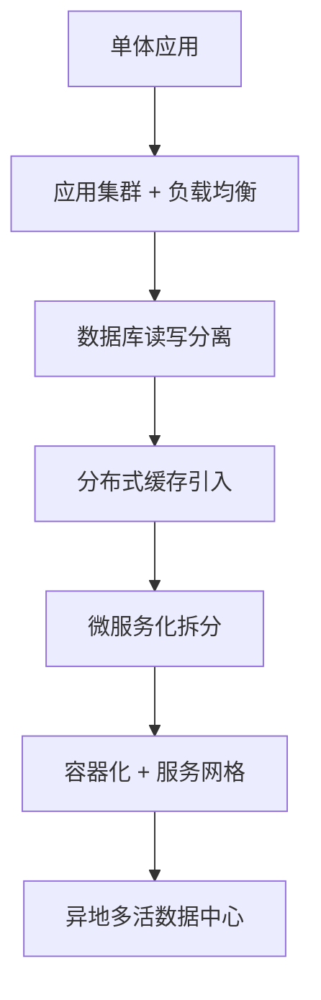
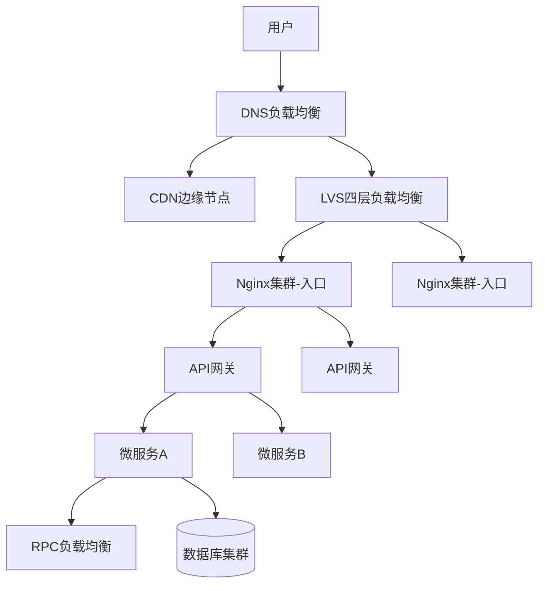
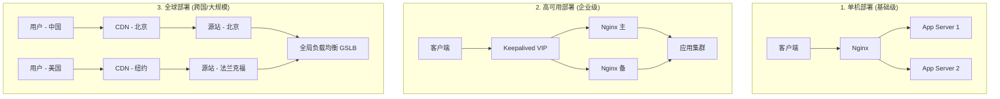
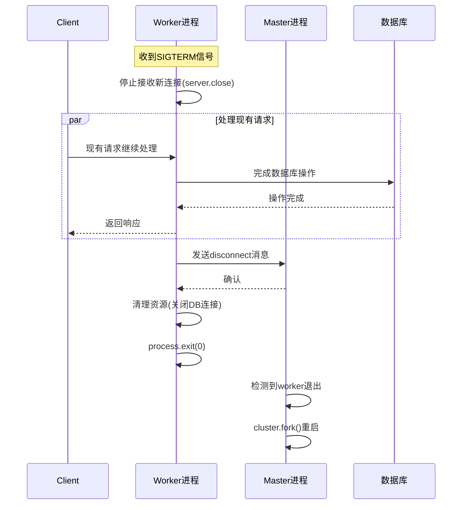
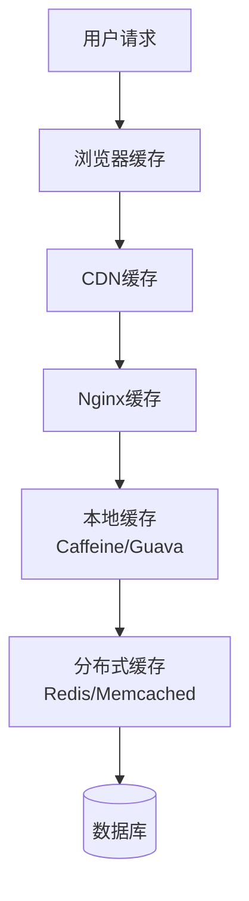
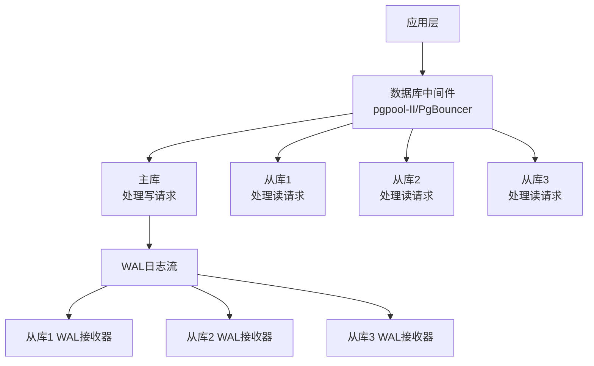
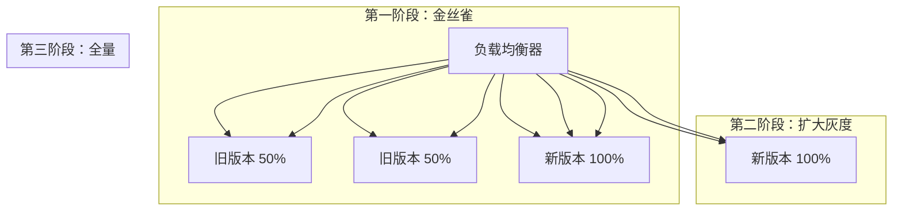
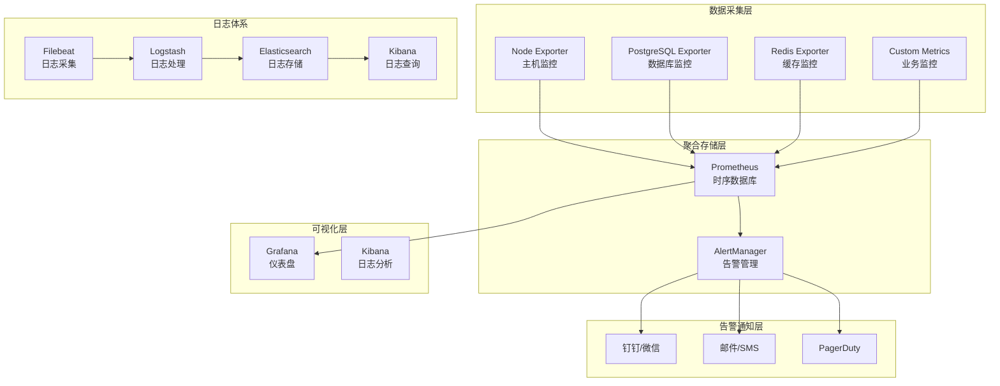

## 引言

在互联网时代，一个成功的产品往往要面对海量用户的并发访问。几千万的日活、每秒数万的请求（QPS），对于后端架构来说无疑是巨大的挑战。从淘宝双十一的流量洪峰，到春晚红包的瞬间爆发，这些场景都在考验着系统的极限承载能力。

本文将从**负载均衡、高可用设计、缓存策略、数据库优化、灰度发布、容器化部署**等多个维度，系统性地讲解如何构建一个能支撑千万级并发访问的网站架构。全文包含大量代码示例、配置文件和架构图，希望能为读者提供一份实用的技术指南。

---

## 一、高并发系统的核心挑战与设计目标

### 1.1 高并发的本质

高并发（High Concurrency）是指系统在极短时间内需要处理大量请求的场景。它的核心挑战在于：**如何在有限资源下保证系统的稳定性、响应速度与数据一致性** 。

以一个典型的电商秒杀活动为例：

- 10万用户同时刷新商品页面
- 5万用户点击“立即购买”
- 3万用户提交订单
- 2万用户完成支付

这些操作在几秒钟内发生，对系统的各个组件都是严峻考验。

### 1.2 核心设计目标

高并发架构的设计目标可归纳为三点 ：

| 目标       | 描述                           | 关键指标        |
| ---------- | ------------------------------ | --------------- |
| **低延迟** | 确保用户请求在毫秒级内完成     | TP99 < 200ms    |
| **高吞吐** | 支持每秒数万甚至百万级请求处理 | QPS > 10万      |
| **高可用** | 故障时快速恢复，避免单点瓶颈   | 可用性 > 99.99% |

### 1.3 架构演进路径

从单体应用到千万级并发，通常经历以下演进路径：



每个阶段解决不同的瓶颈问题，本文将从最基础的负载均衡开始讲解。

---

## 二、负载均衡：流量分发的第一道防线

当单台服务器的处理能力达到瓶颈时，我们必须将请求分散到多台机器上处理。负载均衡器就是实现这一目标的关键组件 。

### 2.1 负载均衡的分层架构

在实际架构中，负载均衡往往在多个层面协同工作，形成一个完整的流量分发体系：



#### 2.1.1 DNS层负载均衡

DNS负载均衡是最简单也最基础的流量分发方式。通过域名解析返回多个IP，实现最基本的流量分发 。

```dns
# DNS配置示例（BIND语法）
www.example.com.  IN  A  10.0.1.1
www.example.com.  IN  A  10.0.1.2
www.example.com.  IN  A  10.0.1.3
```

通常结合CDN使用，将静态资源缓存在离用户最近的节点，大幅降低源站压力。CDN的核心价值在于 ：

- 减少网络延迟（从300ms降至50ms以内）
- 减轻源站带宽压力
- 抵御DDoS攻击

#### 2.1.2 网络层（LVS/硬件F5）

LVS（Linux Virtual Server）在传输层（TCP/UDP）进行流量转发，性能极高，常作为入口流量的第一道关卡。LVS的三种工作模式：

```bash
# LVS NAT模式配置示例
ipvsadm -A -t 192.168.1.100:80 -s rr
ipvsadm -a -t 192.168.1.100:80 -r 10.0.0.1:80 -m
ipvsadm -a -t 192.168.1.100:80 -r 10.0.0.2:80 -m
ipvsadm -a -t 192.168.1.100:80 -r 10.0.0.3:80 -m
```

#### 2.1.3 应用层（Nginx/OpenResty）

Nginx是基于HTTP协议的七层负载均衡器，可实现更精细的路由、限流、缓存、SSL卸载等功能 。

```nginx
# Nginx负载均衡完整配置
upstream backend {
    # 负载均衡算法：least_conn（最少连接）
    least_conn;

    # 服务器列表，带权重和健康检查参数
    server 10.0.0.1:8080 weight=3 max_fails=3 fail_timeout=30s;
    server 10.0.0.2:8080 weight=2 max_fails=3 fail_timeout=30s;
    server 10.0.0.3:8080 backup;  # 备用节点

    keepalive 32;  # 保持长连接
}

server {
    listen 80;
    server_name api.example.com;

    # 访问日志格式
    log_format main '$remote_addr - $remote_user [$time_local] "$request" '
                    '$status $body_bytes_sent "$http_referer" '
                    '"$http_user_agent" "$http_x_forwarded_for" '
                    '$upstream_addr $upstream_response_time';

    access_log /var/log/nginx/api_access.log main;

    location / {
        proxy_pass http://backend;
        proxy_set_header Host $host;
        proxy_set_header X-Real-IP $remote_addr;
        proxy_set_header X-Forwarded-For $proxy_add_x_forwarded_for;
        proxy_set_header X-Forwarded-Proto $scheme;

        # 超时配置
        proxy_connect_timeout 5s;
        proxy_send_timeout 10s;
        proxy_read_timeout 10s;

        # 失败重试
        proxy_next_upstream error timeout invalid_header http_500 http_502 http_503;
        proxy_next_upstream_tries 3;
        proxy_next_upstream_timeout 10s;
    }

    # 健康检查端点
    location /health {
        access_log off;
        return 200 "healthy\n";
        add_header Content-Type text/plain;
    }
}
```

#### 2.1.4 API网关层

在微服务架构中，API网关承担了更复杂的职责 ：

- **身份认证**：JWT验证、OAuth2集成
- **流量控制**：令牌桶限流、并发控制
- **服务发现**：与Consul/Etcd/Nacos集成
- **协议转换**：HTTP转gRPC
- **请求/响应转换**：字段映射、数据聚合

```javascript
// Node.js API网关限流配置示例 (使用 express-rate-limit)
import rateLimit from 'express-rate-limit'
import RedisStore from 'rate-limit-redis'
import { createClient } from 'redis'

const redisClient = createClient({ url: 'redis://localhost:6379' })

const limiter = rateLimit({
    store: new RedisStore({
        sendCommand: (...args) => redisClient.sendCommand(args),
    }),
    windowMs: 1 * 60 * 1000, // 1分钟
    max: 1000, // 限制每个IP每分钟1000个请求
    standardHeaders: true,
    legacyHeaders: false,
    handler: (req, res) => {
        res.status(429).json({ error: '请求过于频繁，请稍后再试' });
    }
});

// 应用到订单服务路由
app.use('/api/order', limiter, (req, res) => {
    // 转发请求到订单微服务
});
```

### 2.2 负载均衡算法详解

负载均衡算法根据是否考虑后端实时状态，可分为静态和动态两类 。

#### 2.2.1 静态算法

**轮询（Round Robin）算法实现** ：

```javascript
// Node.js 轮询负载均衡器实现
class LoadBalancer {
    constructor(servers) {
        this.servers = servers;
        this.currentIndex = 0;
    }

    getNextServer() {
        const server = this.servers[this.currentIndex];
        // 递增索引并取模
        this.currentIndex = (this.currentIndex + 1) % this.servers.length;
        return server;
    }
}

// 使用示例
const servers = ["Server1:8080", "Server2:8080", "Server3:8080"];
const lb = new LoadBalancer(servers);

// 模拟10个请求
for (let i = 0; i < 10; i++) {
    const server = lb.getNextServer();
    console.log(`请求 ${i + 1} 转发到 ${server}`);
}
```

输出结果：

```
请求 1 转发到 Server1:8080
请求 2 转发到 Server2:8080
请求 3 转发到 Server3:8080
请求 4 转发到 Server1:8080
请求 5 转发到 Server2:8080
...
```

**加权轮询（Weighted Round Robin）** ：

```javascript
// Node.js 加权轮询算法（平滑加权）
class WeightedRoundRobin {
    constructor(servers) {
        // servers: [{ name: 'S1', weight: 5 }, { name: 'S2', weight: 1 }]
        this.servers = servers;
        this.currentWeights = servers.map(() => 0);
        this.totalWeight = servers.reduce((sum, s) => sum + s.weight, 0);
    }

    getNextServer() {
        let maxWeight = -1;
        let index = -1;

        for (let i = 0; i < this.servers.length; i++) {
            // 每个节点的当前权重增加其原始权重
            this.currentWeights[i] += this.servers[i].weight;

            // 选择当前权重最大的节点
            if (this.currentWeights[i] > maxWeight) {
                maxWeight = this.currentWeights[i];
                index = i;
            }
        }

        if (index !== -1) {
            // 被选中节点的当前权重减去总权重
            this.currentWeights[index] -= this.totalWeight;
            return this.servers[index];
        }

        return null;
    }
}
```

**IP哈希（IP Hash）** ：

```javascript
import crypto from 'node:crypto'

function ipHash(ipAddress, serverList) {
    /**
     * 根据客户端IP哈希选择服务器
     */
    // 计算IP的MD5哈希值
    const hash = crypto.createHash('md5').update(ipAddress).digest('hex');
    // 取哈希值的一部分转为整数并取模
    const hashInt = parseInt(hash.substring(0, 8), 16);
    const serverIndex = hashInt % serverList.length;

    return serverList[serverIndex];
}

// 测试
const servers = ["Server1", "Server2", "Server3", "Server4"];
const ips = ["192.168.1.100", "192.168.1.101", "192.168.1.100"];

ips.forEach(ip => {
    const selected = ipHash(ip, servers);
    console.log(`IP ${ip} -> ${selected}`);
});
```

输出：

```
IP 192.168.1.100 -> Server3
IP 192.168.1.101 -> Server1
IP 192.168.1.100 -> Server3  # 相同IP始终命中同一台服务器
```

**一致性哈希（Consistent Hashing）**：

一致性哈希在分布式缓存场景中特别有用，当一台机器宕机时，只有少量请求受到影响，有效避免了缓存雪崩 。

```javascript
import crypto from 'node:crypto'

class ConsistentHash {
    constructor(nodes = [], virtualNodes = 150) {
        this.virtualNodes = virtualNodes; // 每个物理节点对应的虚拟节点数
        this.ring = new Map(); // 哈希环
        this.sortedKeys = []; // 排序后的哈希值列表

        nodes.forEach(node => this.addNode(node));
    }

    _hash(key) {
        const hash = crypto.createHash('md5').update(key).digest('hex');
        return parseInt(hash.substring(0, 8), 16);
    }

    addNode(node) {
        for (let i = 0; i < this.virtualNodes; i++) {
            const virtualKey = `${node}:${i}`;
            const hashValue = this._hash(virtualKey);
            this.ring.set(hashValue, node);
            this.sortedKeys.push(hashValue);
        }
        this.sortedKeys.sort((a, b) => a - b);
    }

    removeNode(node) {
        for (let i = 0; i < this.virtualNodes; i++) {
            const virtualKey = `${node}:${i}`;
            const hashValue = this._hash(virtualKey);
            this.ring.delete(hashValue);
            this.sortedKeys = this.sortedKeys.filter(k => k !== hashValue);
        }
    }

    getNode(key) {
        if (this.ring.size === 0) return null;

        const hashValue = this._hash(key);
        // 二分查找第一个大于等于 hashValue 的键
        let low = 0, high = this.sortedKeys.length - 1;

        while (low <= high) {
            const mid = Math.floor((low + high) / 2);
            if (this.sortedKeys[mid] >= hashValue) {
                high = mid - 1;
            } else {
                low = mid + 1;
            }
        }

        // 如果超出范围，则返回第一个节点（闭合环）
        if (low === this.sortedKeys.length) low = 0;

        return this.ring.get(this.sortedKeys[low]);
    }
}

// 使用示例
const nodes = ["Redis1", "Redis2", "Redis3"];
const ch = new ConsistentHash(nodes, 100);

const keys = ["user:1001", "user:1002", "user:1003", "product:2001", "order:3001"];
keys.forEach(key => {
    const node = ch.getNode(key);
    console.log(`Key: ${key} -> Node: ${node}`);
});
```

#### 2.2.2 动态算法

**最少连接（Least Connections）**：将新请求分配给连接数最少的服务器，适用于长连接场景 。

```javascript
// Node.js 最少连接负载均衡实现
class LeastConnectionsLB {
    constructor(servers) {
        this.servers = servers.map(addr => ({
            address: addr,
            connections: 0
        }));
    }

    getNextServer() {
        let selected = null;
        let minConns = Infinity;

        for (const server of this.servers) {
            if (server.connections < minConns) {
                minConns = server.connections;
                selected = server;
            }
        }

        if (selected) {
            selected.connections++;
        }
        return selected;
    }

    release(server) {
        if (server && server.connections > 0) {
            server.connections--;
        }
    }
}
```

### 2.3 健康检查机制

负载均衡器需要知道哪些后端实例是健康的，才能将流量分发过去。健康检查通常有两种方式 ：

#### 2.3.1 主动健康检查

```nginx
# Nginx主动健康检查配置（需安装nginx_upstream_check_module）
upstream backend {
    server 10.0.0.1:8080;
    server 10.0.0.2:8080;
    server 10.0.0.3:8080;

    # 健康检查配置
    check interval=3000 rise=2 fall=5 timeout=1000 type=http;
    check_http_send "HEAD /health HTTP/1.0\r\n\r\n";
    check_http_expect_alive http_2xx http_3xx;
}
```

#### 2.3.2 被动健康检查

```nginx
# Nginx被动健康检查
upstream backend {
    server 10.0.0.1:8080 max_fails=3 fail_timeout=30s;
    server 10.0.0.2:8080 max_fails=3 fail_timeout=30s;
    server 10.0.0.3:8080 max_fails=3 fail_timeout=30s;
}
```

#### 2.3.3 应用层健康检查端点

Node.js应用的健康检查端点示例：

```javascript
// healthcheck.js
import express from 'express'
import mongoose from 'mongoose'
import { createClient } from 'redis'
import checkDiskSpace from 'check-disk-space'

const app = express()

// 健康检查端点
app.get('/health', async (req, res) => {
	const healthcheck = {
		uptime: process.uptime(),
		status: 'OK',
		timestamp: Date.now(),
		checks: {},
	}

	try {
		// 检查数据库连接
		if (mongoose.connection.readyState === 1) {
			healthcheck.checks.database = 'up'
		} else {
			healthcheck.checks.database = 'down'
		}

		// 检查Redis连接
		const redisClient = createClient()
		await redisClient.connect()
		await redisClient.ping()
		healthcheck.checks.redis = 'up'
		await redisClient.quit()

		// 检查磁盘空间
		const diskSpace = await checkDiskSpace('/')
		const freeSpaceGB = diskSpace.free / 1024 / 1024 / 1024

		if (freeSpaceGB > 10) {
			healthcheck.checks.disk = 'up'
		} else {
			healthcheck.checks.disk = 'warning'
		}
	} catch (error) {
		healthcheck.status = 'error'
		healthcheck.error = error.message
		return res.status(503).json(healthcheck)
	}

	// 如果有任何关键依赖异常，返回503
	if (healthcheck.checks.database === 'down' || healthcheck.checks.redis === 'down') {
		return res.status(503).json(healthcheck)
	}

	res.json(healthcheck)
})

app.listen(3000, () => {
	console.log('Health check server running on port 3000')
})
```

### 2.4 负载均衡的部署模式



---

## 三、Node.js应用的高可用实践

Node.js单线程模型虽然避免了多线程编程的复杂性，但无法充分利用多核CPU，且一旦进程崩溃服务即中断。因此，在生产环境中我们需要特别的策略 。

### 3.1 Cluster模块实现多进程

Node.js内置的`cluster`模块允许我们创建多个工作进程（worker）共享同一个服务器端口，充分利用多核CPU资源 。

```javascript
// cluster-app.js
import cluster from 'cluster'
import http from 'http'
import { cpus } from 'os'
import process from 'process'

const numCPUs = cpus().length

if (cluster.isPrimary) {
	console.log(`主进程 ${process.pid} 正在运行`)
	console.log(`CPU核心数: ${numCPUs}`)

	// 记录工作进程数量
	let workerCount = 0

	// 衍生工作进程
	for (let i = 0; i < numCPUs; i++) {
		const worker = cluster.fork()
		workerCount++

		// 监听工作进程消息
		worker.on('message', (msg) => {
			console.log(`主进程收到消息: ${msg} from ${worker.process.pid}`)
		})
	}

	console.log(`已启动 ${workerCount} 个工作进程`)

	// 监听工作进程退出事件
	cluster.on('exit', (worker, code, signal) => {
		console.log(`工作进程 ${worker.process.pid} 退出，退出码: ${code}, 信号: ${signal}`)

		// 自动重启
		console.log('正在重启工作进程...')
		cluster.fork()
	})

	// 定期向工作进程发送状态查询
	setInterval(() => {
		const workers = Object.values(cluster.workers)
		workers.forEach((worker) => {
			worker.send({ cmd: 'status' })
		})
	}, 10000)
} else {
	// 工作进程启动HTTP服务
	const server = http
		.createServer((req, res) => {
			// 模拟请求处理
			const start = Date.now()

			// 根据不同路径返回不同内容
			if (req.url === '/') {
				res.writeHead(200, { 'Content-Type': 'text/html' })
				res.end(`
                <html>
                <head><title>Cluster Demo</title></head>
                <body>
                    <h1>Hello from Worker ${process.pid}</h1>
                    <p>请求处理时间: ${Date.now() - start}ms</p>
                </body>
                </html>
            `)
			} else if (req.url === '/health') {
				res.writeHead(200, { 'Content-Type': 'application/json' })
				res.end(
					JSON.stringify({
						pid: process.pid,
						memory: process.memoryUsage(),
						uptime: process.uptime(),
						timestamp: Date.now(),
					}),
				)
			} else if (req.url === '/slow') {
				// 模拟慢请求
				setTimeout(() => {
					res.writeHead(200)
					res.end(`Slow response from ${process.pid}`)
				}, 5000)
			} else {
				res.writeHead(404)
				res.end('Not Found')
			}
		})
		.listen(3000)

	console.log(`工作进程 ${process.pid} 启动，监听端口 3000`)

	// 处理主进程消息
	process.on('message', (msg) => {
		if (msg.cmd === 'status') {
			console.log(`Worker ${process.pid} 状态: 存活`)
			process.send({ cmd: 'status', pid: process.pid, memory: process.memoryUsage() })
		} else if (msg.cmd === 'shutdown') {
			console.log(`Worker ${process.pid} 收到关闭信号，优雅退出`)
			gracefulShutdown()
		}
	})

	// 优雅退出函数
	function gracefulShutdown() {
		server.close(() => {
			console.log(`Worker ${process.pid} 已关闭所有连接`)
			process.exit(0)
		})

		// 设置超时强制退出
		setTimeout(() => {
			console.error(`Worker ${process.pid} 强制退出`)
			process.exit(1)
		}, 10000)
	}

	// 处理未捕获的异常
	process.on('uncaughtException', (err) => {
		console.error(`Worker ${process.pid} 未捕获异常:`, err)
		gracefulShutdown()
	})
}
```

### 3.2 优雅退出机制详解

粗暴地终止进程会导致正在处理的请求中断，客户端收到 `ECONNRESET` 错误；若此时有数据库操作，还可能污染数据状态 。



完整优雅退出实现：

```javascript
// graceful-shutdown.js
class GracefulShutdownManager {
	constructor(server, options = {}) {
		this.server = server
		this.options = {
			timeout: options.timeout || 10000,
			connections: new Set(),
			...options,
		}

		this.isShuttingDown = false
		this.pendingRequests = 0

		// 跟踪连接
		this.trackConnections()
	}

	trackConnections() {
		this.server.on('connection', (socket) => {
			if (this.isShuttingDown) {
				socket.destroy()
				return
			}

			this.options.connections.add(socket)

			socket.on('close', () => {
				this.options.connections.delete(socket)
			})
		})

		// 跟踪请求
		this.server.on('request', (req, res) => {
			if (this.isShuttingDown) {
				res.setHeader('Connection', 'close')
			}

			this.pendingRequests++

			res.on('finish', () => {
				this.pendingRequests--
				this.checkIfDone()
			})
		})
	}

	shutdown(callback) {
		if (this.isShuttingDown) return

		this.isShuttingDown = true
		console.log('开始优雅退出...')

		// 停止接收新连接
		this.server.close(() => {
			console.log('服务器已关闭，不再接受新连接')
		})

		// 设置超时强制退出
		const forceShutdown = setTimeout(() => {
			console.error(`优雅退出超时(${this.options.timeout}ms)，强制退出`)
			this.destroyConnections()
			process.exit(1)
		}, this.options.timeout)

		// 等待现有请求完成
		const checkInterval = setInterval(() => {
			if (this.pendingRequests === 0 && this.options.connections.size === 0) {
				clearInterval(checkInterval)
				clearTimeout(forceShutdown)
				console.log('所有请求处理完成，退出进程')
				process.exit(0)
			} else {
				console.log(`等待中 - 请求: ${this.pendingRequests}, 连接: ${this.options.connections.size}`)
			}
		}, 1000)
	}

	destroyConnections() {
		this.options.connections.forEach((socket) => {
			if (!socket.destroyed) {
				socket.destroy()
			}
		})
		this.options.connections.clear()
	}

	checkIfDone() {
		if (this.isShuttingDown && this.pendingRequests === 0 && this.options.connections.size === 0) {
			console.log('所有请求处理完成，退出进程')
			process.exit(0)
		}
	}
}

// 使用示例
import http from 'node:http'
const server = http.createServer((req, res) => {
	// 模拟请求处理
	setTimeout(() => {
		res.writeHead(200)
		res.end('OK')
	}, 2000)
})

const shutdownManager = new GracefulShutdownManager(server)

// 监听退出信号
process.on('SIGTERM', () => shutdownManager.shutdown())
process.on('SIGINT', () => shutdownManager.shutdown())
process.on('SIGQUIT', () => shutdownManager.shutdown())

// 处理未捕获异常
process.on('uncaughtException', (err) => {
	console.error('未捕获异常:', err)
	shutdownManager.shutdown()
})

server.listen(3000, () => {
	console.log('服务器启动，PID:', process.pid)
})
```

### 3.3 PM2进程管理器

手动实现cluster、优雅退出、自动重启等逻辑不仅繁琐，还容易出错。PM2是一个成熟的Node.js进程管理工具，它将这些功能打包成简单的命令 。

#### 3.3.1 PM2核心能力

| 功能       | 命令                       | 说明             |
| ---------- | -------------------------- | ---------------- |
| 集群模式   | `pm2 start app.js -i max`  | 自动利用多核CPU  |
| 零停机重载 | `pm2 reload all`           | 逐个重启worker   |
| 自动重启   | `pm2 start app.js --watch` | 文件变化时重启   |
| 内存监控   | `pm2 monit`                | 实时监控CPU/内存 |
| 日志管理   | `pm2 logs`                 | 集中管理日志     |
| 开机自启   | `pm2 startup`              | 生成开机启动脚本 |

#### 3.3.2 PM2配置文件

```javascript
// ecosystem.config.js
export default {
	apps: [
		{
			name: 'my-app',
			script: './app.js',
			instances: 'max', // 使用所有CPU核心
			exec_mode: 'cluster', // 集群模式
			watch: false, // 开发时可设为true

			// 自动重启配置
			autorestart: true,
			restart_delay: 5000, // 重启延迟
			max_restarts: 10, // 最大重启次数
			min_uptime: '10s', // 最小运行时间

			// 内存限制
			max_memory_restart: '500M', // 超过500M自动重启

			// 优雅退出配置
			kill_timeout: 10000, // 强制退出等待时间
			listen_timeout: 3000, // 启动超时

			// 环境变量
			env: {
				NODE_ENV: 'production',
				PORT: 3000,
			},

			// 日志配置
			log_file: './logs/app.log',
			error_file: './logs/err.log',
			out_file: './logs/out.log',
			log_date_format: 'YYYY-MM-DD HH:mm:ss',

			// 合并日志
			merge_logs: true,

			// 监控配置
			instance_var: 'INSTANCE_ID',

			// 健康检查
			health_check: {
				url: 'http://localhost:3000/health',
				interval: 30000,
				timeout: 5000,
			},
		},
		{
			name: 'worker-app',
			script: './worker.js',
			instances: 2,
			exec_mode: 'fork', // fork模式
			cron_restart: '0 0 * * *', // 每天凌晨重启
			env: {
				NODE_ENV: 'production',
				WORKER_TYPE: 'background',
			},
		},
	],
}
```

#### 3.3.3 PM2与优雅退出集成

PM2原生支持优雅退出，只需在应用中监听SIGINT信号 ：

```javascript
// app.js
import express from 'express'
const app = express()

// 业务逻辑...

// 优雅退出处理
process.on('SIGINT', () => {
	console.log('收到SIGINT信号，准备优雅退出')

	// 关闭数据库连接
	db.close(() => {
		console.log('数据库连接已关闭')

		// 关闭Redis连接
		redis.quit(() => {
			console.log('Redis连接已关闭')

			// 关闭HTTP服务器
			server.close(() => {
				console.log('HTTP服务器已关闭')
				process.exit(0)
			})
		})
	})

	// 超时强制退出
	setTimeout(() => {
		console.error('优雅退出超时，强制退出')
		process.exit(1)
	}, 10000)
})
```

使用PM2启动：

```bash
# 安装PM2
npm install pm2@latest -g

# 启动应用
pm2 start ecosystem.config.js

# 查看状态
pm2 list
pm2 show my-app

# 监控
pm2 monit

# 日志
pm2 logs my-app --lines 100

# 零停机重载
pm2 reload my-app

# 保存状态并设置开机自启
pm2 save
pm2 startup
```

---

## 四、缓存策略：减轻后端压力

缓存是应对高并发的核心手段，通过空间换时间降低后端负载 。

### 4.1 多级缓存架构



### 4.2 浏览器缓存

```nginx
# Nginx配置浏览器缓存
location ~* \.(jpg|jpeg|png|gif|ico|css|js)$ {
    expires 30d;
    add_header Cache-Control "public, no-transform";
    add_header Pragma public;

    # 开启gzip压缩
    gzip on;
    gzip_types text/css application/javascript image/svg+xml;

    # 关闭访问日志
    access_log off;
}
```

### 4.3 Redis缓存实战

```javascript
// redis-cache.js
import { createClient } from 'redis'

class RedisCache {
	constructor(options = {}) {
		this.client = createClient({
			url: `redis://${options.host || 'localhost'}:${options.port || 6379}`,
			password: options.password,
			database: options.db || 0,
		})

		this.client.on('error', (err) => console.error('Redis错误:', err))
		this.client.on('connect', () => console.log('Redis连接成功'))

		this.client.connect().catch(console.error)

		// 默认过期时间（秒）
		this.defaultTTL = options.defaultTTL || 3600

		// 缓存前缀
		this.prefix = options.prefix || 'cache:'
	}

	// 生成带前缀的key
	_getKey(key) {
		return `${this.prefix}${key}`
	}

	// 获取缓存
	async get(key) {
		try {
			const cacheKey = this._getKey(key)
			const data = await this.client.get(cacheKey)

			if (data) {
				console.log(`缓存命中: ${key}`)
				return JSON.parse(data)
			}

			console.log(`缓存未命中: ${key}`)
			return null
		} catch (err) {
			console.error('获取缓存失败:', err)
			return null
		}
	}

	// 设置缓存
	async set(key, value, ttl = this.defaultTTL) {
		try {
			const cacheKey = this._getKey(key)
			const data = JSON.stringify(value)

			if (ttl > 0) {
				await this.client.set(cacheKey, data, { EX: ttl })
			} else {
				await this.client.set(cacheKey, data)
			}

			console.log(`缓存设置: ${key}, TTL: ${ttl}s`)
			return true
		} catch (err) {
			console.error('设置缓存失败:', err)
			return false
		}
	}

	// 删除缓存
	async del(key) {
		try {
			const cacheKey = this._getKey(key)
			await this.client.del(cacheKey)
			console.log(`缓存删除: ${key}`)
			return true
		} catch (err) {
			console.error('删除缓存失败:', err)
			return false
		}
	}

	// 获取缓存，如果不存在则通过回调获取并缓存
	async remember(key, ttl, callback) {
		let value = await this.get(key)

		if (value !== null) {
			return value
		}

		// 使用互斥锁防止缓存击穿
		const lockKey = `lock:${key}`
		const lockAcquired = await this.acquireLock(lockKey, 10)

		if (lockAcquired) {
			try {
				value = await callback()
				await this.set(key, value, ttl)
				return value
			} finally {
				await this.releaseLock(lockKey)
			}
		} else {
			// 等待其他进程加载缓存
			await new Promise((resolve) => setTimeout(resolve, 100))
			return await this.get(key)
		}
	}

	// 获取分布式锁
	async acquireLock(lockKey, ttl) {
		const result = await this.client.set(lockKey, 'locked', { NX: true, EX: ttl })
		return result === 'OK'
	}

	// 释放锁
	async releaseLock(lockKey) {
		await this.client.del(lockKey)
	}

	// 缓存标签（用于批量失效）
	async tag(tag, keys) {
		const tagKey = `tag:${tag}`
		await this.client.set(tagKey, JSON.stringify(keys))

		// 设置tag永不过期，但可以手动删除
		return true
	}

	async getByTag(tag) {
		const tagKey = `tag:${tag}`
		const data = await this.client.get(tagKey)

		if (!data) return []

		const keys = JSON.parse(data)
		const results = []

		for (const key of keys) {
			const value = await this.get(key)
			if (value) {
				results.push({ key, value })
			}
		}

		return results
	}

	async flushTag(tag) {
		const tagKey = `tag:${tag}`
		const data = await this.client.get(tagKey)

		if (data) {
			const keys = JSON.parse(data)
			for (const key of keys) {
				await this.client.del(key)
			}
			await this.client.del(tagKey)
		}

		return true
	}
}

// 使用示例
async function example() {
	const cache = new RedisCache({
		host: 'localhost',
		port: 6379,
		prefix: 'app:',
		defaultTTL: 1800,
	})

	// 简单缓存
	await cache.set('user:1001', { name: '张三', age: 30 })
	const user = await cache.get('user:1001')
	console.log('用户数据:', user)

	// remember模式
	const product = await cache.remember('product:2001', 3600, async () => {
		console.log('从数据库加载产品数据...')
		// 模拟数据库查询
		return {
			id: 2001,
			name: 'iPhone 15',
			price: 6999,
		}
	})

	console.log('产品数据:', product)

	// 标签使用
	await cache.tag('category:phone', ['product:2001', 'product:2002'])
	const phones = await cache.getByTag('category:phone')
	console.log('手机产品:', phones)

	// 清理缓存
	await cache.flushTag('category:phone')
}

example()
```

### 4.4 缓存常见问题及解决方案

#### 4.4.1 缓存穿透

缓存穿透是指查询一个不存在的数据，导致请求直接打到数据库 。

```javascript
// 缓存穿透解决方案：缓存空值
async function getUserById(id) {
	const cacheKey = `user:${id}`
	let user = await cache.get(cacheKey)

	// 如果缓存中有值，直接返回
	if (user !== null) {
		// 判断是否是空值标记
		if (user === 'NULL_VALUE') {
			return null
		}
		return user
	}

	// 查询数据库
	user = await db.query('SELECT * FROM users WHERE id = ?', [id])

	if (user) {
		// 有数据，缓存真实值
		await cache.set(cacheKey, user, 3600)
		return user
	} else {
		// 无数据，缓存空值（短时间）
		await cache.set(cacheKey, 'NULL_VALUE', 300)
		return null
	}
}
```

#### 4.4.2 缓存击穿

缓存击穿是指某个热点key过期，导致大量并发请求同时穿透到数据库 。

```javascript
// 缓存击穿解决方案：互斥锁
async function getHotProduct(id) {
	const cacheKey = `product:${id}`
	let product = await cache.get(cacheKey)

	if (product) {
		return product
	}

	// 尝试获取锁
	const lockKey = `lock:product:${id}`
	const lock = await cache.acquireLock(lockKey, 10)

	if (lock) {
		try {
			// 双重检查
			product = await cache.get(cacheKey)
			if (product) {
				return product
			}

			// 查询数据库
			product = await db.query('SELECT * FROM products WHERE id = ?', [id])

			// 设置缓存（不过期或长过期时间）
			await cache.set(cacheKey, product, 3600)

			return product
		} finally {
			await cache.releaseLock(lockKey)
		}
	} else {
		// 等待锁释放
		await new Promise((resolve) => setTimeout(resolve, 100))
		return getHotProduct(id)
	}
}
```

#### 4.4.3 缓存雪崩

缓存雪崩是指大量缓存同时过期，导致请求全部打到数据库 。

```javascript
// 缓存雪崩解决方案：随机过期时间
async function setWithRandomExpire(key, value, baseTTL) {
	// 在基础过期时间上增加随机值，避免同时过期
	const randomTTL = baseTTL + Math.floor(Math.random() * 300)
	await cache.set(key, value, randomTTL)
}

// 或者永不过期，后台异步更新
async function getWithBackgroundRefresh(key, ttl, fetchFunction) {
	let value = await cache.get(key)

	// 检查是否需要刷新
	const ttlRemaining = await cache.client.ttl(cache._getKey(key))

	// 如果剩余时间小于1/3，异步刷新
	if (ttlRemaining < ttl / 3) {
		// 异步刷新，不阻塞当前请求
		refreshCache(key, ttl, fetchFunction).catch((err) => {
			console.error('缓存刷新失败:', err)
		})
	}

	return value
}

async function refreshCache(key, ttl, fetchFunction) {
	try {
		const newValue = await fetchFunction()
		await cache.set(key, newValue, ttl)
		console.log(`缓存刷新成功: ${key}`)
	} catch (err) {
		console.error(`缓存刷新失败: ${key}`, err)
	}
}
```

---

## 五、数据库层的优化策略

数据库是系统瓶颈的重灾区，优化方向包括读写分离、分库分表、异步化等 。

### 5.1 读写分离架构



#### PostgreSQL流复制配置

```sql
-- 主库配置 postgresql.conf
wal_level = replica
max_wal_senders = 10
wal_keep_size = 1GB
max_replication_slots = 10
hot_standby = on

-- 创建复制用户
CREATE USER replicator WITH REPLICATION ENCRYPTED PASSWORD 'password';
GRANT CONNECT ON DATABASE myapp TO replicator;

-- 配置pg_hba.conf允许复制连接
# host replication replicator 0.0.0.0/0 md5

-- 重启PostgreSQL使配置生效
SELECT pg_reload_conf();

-- 查看主库状态
SELECT * FROM pg_stat_replication;
```

```sql
-- 从库配置
-- 1. 停止PostgreSQL服务
pg_ctl stop

-- 2. 从主库复制数据
pg_basebackup -h master_host -D /var/lib/postgresql/data -U replicator -P -v -R

-- 3. 配置postgresql.conf
hot_standby = on

-- 4. 启动从库
pg_ctl start

-- 查看从库状态
SELECT * FROM pg_stat_wal_receiver;
```

#### pgpool-II读写分离配置

```ini
# pgpool.conf配置
backend_hostname0 = '10.0.0.1'
backend_port0 = 5432
backend_weight0 = 1
backend_data_directory0 = '/var/lib/postgresql/data'
backend_flag0 = 'ALLOW_TO_FAILOVER'

backend_hostname1 = '10.0.0.2'
backend_port1 = 5432
backend_weight1 = 1
backend_data_directory1 = '/var/lib/postgresql/data'
backend_flag1 = 'ALLOW_TO_FAILOVER'

backend_hostname2 = '10.0.0.3'
backend_port2 = 5432
backend_weight2 = 1
backend_data_directory2 = '/var/lib/postgresql/data'
backend_flag2 = 'ALLOW_TO_FAILOVER'

# 负载均衡模式
load_balance_mode = on
master_slave_mode = on
master_slave_sub_mode = 'stream'

# 健康检查
health_check_period = 10
health_check_timeout = 20
health_check_user = 'health_check'
health_check_password = 'password'
health_check_database = 'postgres'

# 故障转移
failover_command = '/etc/pgpool-II/failover.sh %d %h %p %D %m %H %M %P %r %R'
failover_on_backend_error = on

# 读写分离
# 写操作路由到主节点（backend 0）
# 读操作根据负载均衡分配到所有节点
```

### 5.2 分库分表策略

当单表数据量超过500万条时，就需要考虑分库分表 。

#### 水平分表示例（用户表）

```sql
-- 创建主表和子表（按用户ID取模）
-- 创建主表（不存储数据，只用于定义结构）
CREATE TABLE users (
    id BIGINT PRIMARY KEY,
    username VARCHAR(50),
    email VARCHAR(100),
    created_at TIMESTAMP DEFAULT CURRENT_TIMESTAMP
) PARTITION BY HASH (id);

-- 创建分区子表
CREATE TABLE users_0 PARTITION OF users FOR VALUES WITH (MODULUS 4, REMAINDER 0);
CREATE TABLE users_1 PARTITION OF users FOR VALUES WITH (MODULUS 4, REMAINDER 1);
CREATE TABLE users_2 PARTITION OF users FOR VALUES WITH (MODULUS 4, REMAINDER 2);
CREATE TABLE users_3 PARTITION OF users FOR VALUES WITH (MODULUS 4, REMAINDER 3);

-- 创建索引（自动在所有分区上创建）
CREATE INDEX idx_users_username ON users (username);
CREATE INDEX idx_users_email ON users (email);

-- 插入数据（PostgreSQL自动路由到正确的分区）
INSERT INTO users (id, username, email) VALUES (1001, 'user1', 'user1@example.com');
INSERT INTO users (id, username, email) VALUES (1002, 'user2', 'user2@example.com');
INSERT INTO users (id, username, email) VALUES (1003, 'user3', 'user3@example.com');
INSERT INTO users (id, username, email) VALUES (1004, 'user4', 'user4@example.com');

-- 查询数据（自动查询所有相关分区）
SELECT * FROM users WHERE id = 1001;
SELECT * FROM users WHERE username = 'user2';

-- 查看分区信息
SELECT
    schemaname,
    tablename,
    partitiontablename,
    partitiontype,
    partitionboundary
FROM pg_partitions
WHERE tablename = 'users';
```

#### Node.js 数据库水平分片逻辑

对于 Node.js 应用，我们可以通过逻辑层来实现数据库的分片路由：

```javascript
// Node.js PostgreSQL数据库水平分片路由示例
class ShardingManager {
    constructor(dbClusters) {
        // dbClusters: PostgreSQL数据库连接池数组 [db0, db1, ...]
        this.dbClusters = dbClusters;
    }

    // 根据用户ID获取对应的数据库节点（库级分片）
    getDatabaseNode(userId) {
        const dbIndex = Number(BigInt(userId) % BigInt(this.dbClusters.length));
        return this.dbClusters[dbIndex];
    }

    // 根据订单ID获取对应的表名（表级分片）- 对于PostgreSQL分区表
    getTableName(orderId) {
        const tableIndex = Number(BigInt(orderId) % BigInt(16));
        return `orders_${tableIndex}`;
    }

    /**
     * 执行分片查询
     * @param {string} userId 用户ID
     * @param {string} orderId 订单ID
     * @param {string} sql 原始SQL（使用逻辑表名 orders）
     */
    async executeQuery(userId, orderId, sql, params) {
        const db = this.getDatabaseNode(userId);

        // 对于PostgreSQL分区表，可以直接使用主表名，PostgreSQL会自动路由
        // 但如果需要手动路由到特定分区，可以使用以下逻辑
        const tableName = this.getTableName(orderId);

        // 将逻辑表名替换为实际分区表名
        const finalSql = sql.replace('orders', tableName);

        console.log(`路由至PostgreSQL节点: ${userId % this.dbClusters.length}, 表名: ${tableName}`);
        return await db.query(finalSql, params);
    }

    /**
     * 使用PostgreSQL原生分区表（推荐）
     * 直接查询主表，PostgreSQL自动路由到正确的分区
     */
    async executePartitionedQuery(userId, sql, params) {
        const db = this.getDatabaseNode(userId);
        console.log(`路由至PostgreSQL节点: ${userId % this.dbClusters.length}, 使用分区表`);
        return await db.query(sql, params);
    }
}
```

### 5.3 数据库连接池优化

```javascript
import pg from 'pg'
const { Pool } = pg

const pool = new Pool({
	host: 'localhost',
	port: 5432,
	user: 'postgres',
	password: 'password',
	database: 'myapp',
	max: 50, // 最大连接数
	min: 5, // 最小连接数
	idleTimeoutMillis: 60000, // 空闲连接超时（毫秒）
	connectionTimeoutMillis: 10000, // 连接超时
	allowExitOnIdle: false, // 空闲时不允许退出
	ssl: process.env.NODE_ENV === 'production' ? { rejectUnauthorized: false } : false,

	// PostgreSQL特定配置
	application_name: 'myapp-api',
	statement_timeout: 30000, // 语句超时（毫秒）
	query_timeout: 60000, // 查询超时
	keepAlive: true, // 保持连接
	keepAliveInitialDelayMillis: 10000, // 保持连接延迟
})

// 连接池事件监听
pool.on('connect', (client) => {
	console.log('PostgreSQL连接建立')
})

pool.on('acquire', (client) => {
	console.log('客户端从连接池获取')
})

pool.on('remove', (client) => {
	console.log('客户端从连接池移除')
})

pool.on('error', (err, client) => {
	console.error('PostgreSQL连接池错误:', err)
})

// 使用连接池执行查询
async function queryWithRetry(sql, params, retries = 3) {
	for (let i = 0; i < retries; i++) {
		try {
			const result = await pool.query(sql, params)
			return result.rows
		} catch (err) {
			console.error(`查询失败，重试 ${i + 1}/${retries}:`, err.message)

			// 如果是连接错误，尝试重新连接
			if (err.code === 'ECONNREFUSED' || err.code === 'ETIMEDOUT') {
				console.log('连接失败，等待后重试...')
				await new Promise((resolve) => setTimeout(resolve, 1000 * (i + 1)))
				continue
			}

			if (i === retries - 1) {
				throw err
			}

			// 等待后重试
			await new Promise((resolve) => setTimeout(resolve, 1000 * (i + 1)))
		}
	}
}

// 使用事务（PostgreSQL方式）
async function transactionExample() {
	const client = await pool.connect()

	try {
		await client.query('BEGIN')

		// 执行多个操作
		await client.query('UPDATE accounts SET balance = balance - $1 WHERE id = $2', [100, 1])
		await client.query('UPDATE accounts SET balance = balance + $1 WHERE id = $2', [100, 2])

		// 检查约束
		const checkResult = await client.query('SELECT balance FROM accounts WHERE balance < 0')
		if (checkResult.rows.length > 0) {
			throw new Error('余额不足，事务回滚')
		}

		await client.query('COMMIT')
		console.log('事务提交成功')
	} catch (err) {
		await client.query('ROLLBACK')
		console.error('事务回滚:', err.message)
		throw err
	} finally {
		client.release() // 释放连接回池
	}
}

// 批量插入优化
async function batchInsert(tableName, rows) {
	if (!rows || rows.length === 0) return

	const columns = Object.keys(rows[0])
	const placeholders = rows.map((_, rowIndex) =>
		`(${columns.map((_, colIndex) => `$${rowIndex * columns.length + colIndex + 1}`).join(', ')})`
	).join(', ')

	const values = rows.flatMap(row => columns.map(col => row[col]))
	const sql = `INSERT INTO ${tableName} (${columns.join(', ')}) VALUES ${placeholders} ON CONFLICT DO NOTHING`

	try {
		const result = await pool.query(sql, values)
		console.log(`批量插入 ${result.rowCount} 行数据`)
		return result
	} catch (err) {
		console.error('批量插入失败:', err.message)
		throw err
	}
}

// 连接池健康检查
async function checkPoolHealth() {
	try {
		const result = await pool.query('SELECT 1 as health, version() as pg_version, current_timestamp as timestamp')
		console.log('PostgreSQL连接池健康检查通过:', result.rows[0])
		return true
	} catch (err) {
		console.error('PostgreSQL连接池健康检查失败:', err.message)
		return false
	}
}
```

---

## 六、灰度发布机制

直接全量发布新版本风险极高：一旦出现bug，所有用户都将受到影响。灰度发布允许我们逐步将流量导向新版本，先在小范围验证，确认稳定后再全量切换 。

### 6.1 发布策略对比

| 策略           | 优点               | 缺点         | 适用场景          |
| -------------- | ------------------ | ------------ | ----------------- |
| **金丝雀发布** | 风险小，可逐步验证 | 发布周期长   | 核心业务升级      |
| **蓝绿发布**   | 切换快，回滚简单   | 资源占用高   | 对停机敏感的业务  |
| **滚动发布**   | 资源利用率高       | 回滚复杂     | 无状态服务        |
| **功能开关**   | 灵活，粒度细       | 代码维护复杂 | 功能验证、A/B测试 |

### 6.2 金丝雀发布实现



#### Nginx实现金丝雀发布

```nginx
# nginx-canary.conf
upstream backend {
    # 旧版本集群（90%权重）
    server old-version-1:8080 weight=45;
    server old-version-2:8080 weight=45;

    # 新版本集群（10%权重）
    server new-version-1:8080 weight=5;
    server new-version-2:8080 weight=5;

    # 健康检查
    keepalive 32;
}

# 基于Cookie的灰度（指定用户）
upstream backend_by_cookie {
    server old-version-1:8080;
    server old-version-2:8080;

    # 灰度用户
    server new-version-1:8080;
}

server {
    listen 80;
    server_name api.example.com;

    # 基于Cookie的灰度策略
    set $backend "backend";

    if ($http_cookie ~* "canary=1") {
        set $backend "backend_by_cookie";
    }

    # 基于IP的灰度（内部测试）
    set $canary_ip 0;

    if ($remote_addr ~ "192.168.1.100|192.168.1.101") {
        set $canary_ip 1;
    }

    location / {
        if ($canary_ip = 1) {
            proxy_pass http://backend_by_cookie;
            break;
        }

        proxy_pass http://$backend;
    }
}
```

#### 使用Docker Compose实现金丝雀发布

```yaml
# docker-compose-canary.yml
version: '3.8'

services:
  # 旧版本服务（3个实例）
  app-v1:
    image: myapp:1.0.0
    deploy:
      replicas: 3
    environment:
      - NODE_ENV=production
      - APP_VERSION=1.0.0
    networks:
      - app-network
    healthcheck:
      test: ['CMD', 'curl', '-f', 'http://localhost:3000/health']
      interval: 30s
      timeout: 10s
      retries: 3

  # 新版本服务（1个实例，金丝雀）
  app-v2:
    image: myapp:2.0.0
    deploy:
      replicas: 1
    environment:
      - NODE_ENV=production
      - APP_VERSION=2.0.0
      - FEATURE_NEW_PAYMENT=true
    networks:
      - app-network
    healthcheck:
      test: ['CMD', 'curl', '-f', 'http://localhost:3000/health']
      interval: 30s
      timeout: 10s
      retries: 3

  # Nginx负载均衡
  nginx:
    image: nginx:alpine
    ports:
      - '80:80'
    volumes:
      - ./nginx-canary.conf:/etc/nginx/conf.d/default.conf
    depends_on:
      - app-v1
      - app-v2
    networks:
      - app-network
    deploy:
      replicas: 2

networks:
  app-network:
    driver: overlay
```

### 6.3 Kubernetes高级灰度发布

在Kubernetes环境中，可以使用Kruise Rollout实现更精细的灰度发布控制 。

```yaml
# kruise-rollout.yaml
apiVersion: rollouts.kruise.io/v1alpha1
kind: Rollout
metadata:
  name: canary-rollout
spec:
  objectRef:
    workloadRef:
      apiVersion: apps/v1
      kind: Deployment
      name: myapp
  strategy:
    canary:
      steps:
        # 第一步：金丝雀发布，20%流量，暂停等待确认
        - weight: 20
          replicas: 1
          pause: {}

        # 第二步：扩大灰度到50%，自动暂停60秒
        - weight: 50
          replicas: 50%
          pause: { duration: 60 }

        # 第三步：全量发布
        - weight: 100
          replicas: 100%
          pause: { duration: 60 }

      trafficRoutings:
        - service: myapp-service
          ingress:
            name: myapp-ingress
---
# A/B Testing配置
apiVersion: rollouts.kruise.io/v1alpha1
kind: Rollout
metadata:
  name: ab-test-rollout
spec:
  objectRef:
    workloadRef:
      apiVersion: apps/v1
      kind: Deployment
      name: myapp
  strategy:
    canary:
      steps:
        # 第一阶段：只对Android用户生效
        - matches:
            - headers:
                - type: Exact
                  name: User-Agent
                  value: Android
          pause: {}
          replicas: 1

        # 第二阶段：对50%的Android用户生效
        - matches:
            - headers:
                - type: Exact
                  name: User-Agent
                  value: Android
          pause: { duration: 60 }
          replicas: 50%

        # 第三阶段：对所有Android用户生效
        - matches:
            - headers:
                - type: Exact
                  name: User-Agent
                  value: Android
          pause: { duration: 60 }
          replicas: 100%

      trafficRoutings:
        - service: myapp-service
          ingress:
            name: myapp-ingress
```

### 6.4 功能开关发布

使用配置中心实现功能开关 。

```javascript
// feature-toggle.js
import { createClient } from 'redis'
const client = createClient()

class FeatureToggle {
	constructor() {
		this.features = new Map()
		this.watchInterval = 5000 // 5秒检查一次
		this.startWatching()
	}

	async getFeature(featureName, userId) {
		// 从Redis获取配置
		const config = await this.getConfig(featureName)

		if (!config.enabled) {
			return false
		}

		// 根据配置决定是否启用
		switch (config.strategy) {
			case 'percentage':
				// 按百分比启用
				return this._checkPercentage(userId, config.percentage)

			case 'userList':
				// 白名单用户
				return config.users.includes(userId)

			case 'environment':
				// 按环境启用
				return process.env.NODE_ENV === config.environment

			default:
				return config.enabled
		}
	}

	_checkPercentage(userId, percentage) {
		const hash = this._hash(userId)
		return hash % 100 < percentage
	}

	_hash(str) {
		let hash = 0
		for (let i = 0; i < str.length; i++) {
			hash = (hash << 5) - hash + str.charCodeAt(i)
			hash = hash & hash // Convert to 32bit integer
		}
		return Math.abs(hash)
	}

	async getConfig(featureName) {
		// 先从本地缓存获取
		if (this.features.has(featureName)) {
			return this.features.get(featureName)
		}

		// 从Redis获取
		return new Promise((resolve) => {
			client.get(`feature:${featureName}`, (err, data) => {
				if (err || !data) {
					// 默认配置
					resolve({ enabled: false, strategy: 'default' })
					return
				}

				const config = JSON.parse(data)
				this.features.set(featureName, config)
				resolve(config)
			})
		})
	}

	startWatching() {
		// 定期更新配置
		setInterval(() => {
			this.features.clear()
		}, this.watchInterval)
	}
}

// 使用示例
const toggle = new FeatureToggle()

app.get('/api/new-payment', async (req, res) => {
	const userId = req.user.id
	const enabled = await toggle.getFeature('new-payment', userId)

	if (!enabled) {
		return res.redirect('/api/old-payment')
	}

	// 新支付逻辑
	res.json({ payment: 'new', method: '新支付方式' })
})
```

---

## 七、监控与告警体系

监控体系是系统稳定的"守门人"，通过监控可以及时发现和定位问题 。

### 7.1 监控分层架构



### 7.2 Node.js应用监控

```javascript
// metrics.js
import promClient from 'prom-client'
import responseTime from 'response-time'

// 创建Registry
const register = new promClient.Registry()

// 添加默认指标
promClient.collectDefaultMetrics({ register })

// 自定义指标
const httpRequestDuration = new promClient.Histogram({
	name: 'http_request_duration_seconds',
	help: 'HTTP请求持续时间（秒）',
	labelNames: ['method', 'route', 'status_code'],
	buckets: [0.1, 0.3, 0.5, 0.8, 1, 3, 5, 10],
})

const httpRequestTotal = new promClient.Counter({
	name: 'http_requests_total',
	help: 'HTTP请求总数',
	labelNames: ['method', 'route', 'status_code'],
})

const activeConnections = new promClient.Gauge({
	name: 'http_active_connections',
	help: '当前活跃连接数',
})

const dbQueryDuration = new promClient.Histogram({
	name: 'db_query_duration_seconds',
	help: '数据库查询持续时间',
	labelNames: ['query_type', 'table'],
	buckets: [0.01, 0.05, 0.1, 0.5, 1, 2],
})

// 注册指标
register.registerMetric(httpRequestDuration)
register.registerMetric(httpRequestTotal)
register.registerMetric(activeConnections)
register.registerMetric(dbQueryDuration)

// 中间件：记录HTTP指标
const metricsMiddleware = responseTime((req, res, time) => {
	// 记录请求持续时间
	httpRequestDuration.labels(req.method, req.route?.path || req.path, res.statusCode).observe(time / 1000) // 转换为秒

	// 记录请求总数
	httpRequestTotal.labels(req.method, req.route?.path || req.path, res.statusCode).inc()
})

// 活跃连接跟踪
app.use((req, res, next) => {
	activeConnections.inc()

	res.on('finish', () => {
		activeConnections.dec()
	})

	next()
})

// 监控端点
app.get('/metrics', async (req, res) => {
	try {
		res.set('Content-Type', register.contentType)
		res.end(await register.metrics())
	} catch (err) {
		res.status(500).end(err.message)
	}
})

// 业务监控示例
class BusinessMetrics {
	constructor() {
		this.orderCounter = new promClient.Counter({
			name: 'orders_total',
			help: '订单总数',
			labelNames: ['status', 'payment_method'],
		})

		this.revenueGauge = new promClient.Gauge({
			name: 'revenue_total',
			help: '总收入',
		})

		register.registerMetric(this.orderCounter)
		register.registerMetric(this.revenueGauge)
	}

	recordOrder(status, paymentMethod) {
		this.orderCounter.labels(status, paymentMethod).inc()
	}

	updateRevenue(amount) {
		this.revenueGauge.set(amount)
	}
}

const businessMetrics = new BusinessMetrics()

// 使用示例
app.post('/api/orders', (req, res) => {
	// 创建订单逻辑...
	businessMetrics.recordOrder('completed', 'alipay')
	businessMetrics.updateRevenue(2999)

	res.json({ success: true })
})
```

### 7.3 Prometheus + Grafana配置

```yaml
# prometheus.yml
global:
  scrape_interval: 15s
  evaluation_interval: 15s

alerting:
  alertmanagers:
    - static_configs:
        - targets: ['alertmanager:9093']

rule_files:
  - 'alerts.yml'

scrape_configs:
  - job_name: 'nodejs'
    static_configs:
      - targets: ['app1:3000', 'app2:3000', 'app3:3000']
    metrics_path: /metrics

  - job_name: 'node_exporter'
    static_configs:
      - targets: ['node1:9100', 'node2:9100', 'node3:9100']

  - job_name: 'postgresql'
    static_configs:
      - targets: ['postgres-exporter:9187']

  - job_name: 'redis'
    static_configs:
      - targets: ['redis-exporter:9121']
```

```yaml
# alerts.yml
groups:
  - name: nodejs_alerts
    rules:
      - alert: HighErrorRate
        expr: rate(http_requests_total{status_code=~"5.."}[5m]) > 0.1
        for: 5m
        labels:
          severity: critical
        annotations:
          summary: '高错误率告警'
          description: '实例 {{ $labels.instance }} 5分钟错误率超过10%'

      - alert: HighResponseTime
        expr: histogram_quantile(0.95, rate(http_request_duration_seconds_bucket[5m])) > 2
        for: 5m
        labels:
          severity: warning
        annotations:
          summary: '高响应延迟'
          description: '实例 {{ $labels.instance }} P95响应时间超过2秒'

      - alert: ServiceDown
        expr: up{job="nodejs"} == 0
        for: 1m
        labels:
          severity: critical
        annotations:
          summary: '服务宕机'
          description: '实例 {{ $labels.instance }} 无法访问'

  - group: system_alerts
    rules:
      - alert: HighCPUUsage
        expr: 100 - (avg by (instance) (rate(node_cpu_seconds_total{mode="idle"}[5m])) * 100) > 80
        for: 10m
        labels:
          severity: warning
        annotations:
          summary: 'CPU使用率过高'
          description: '实例 {{ $labels.instance }} CPU使用率超过80%'

      - alert: HighMemoryUsage
        expr: (node_memory_MemTotal_bytes - node_memory_MemFree_bytes - node_memory_Buffers_bytes - node_memory_Cached_bytes) / node_memory_MemTotal_bytes * 100 > 85
        for: 10m
        labels:
          severity: warning
        annotations:
          summary: '内存使用率过高'
          description: '实例 {{ $labels.instance }} 内存使用率超过85%'
```

### 7.4 日志收集与分析

```javascript
// logger.js
import winston from 'winston'
import { ElasticsearchTransport } from 'winston-elasticsearch'

const esTransport = new ElasticsearchTransport({
	level: 'info',
	clientOpts: {
		node: 'http://elasticsearch:9200',
		maxRetries: 5,
		requestTimeout: 10000,
	},
	index: 'app-logs-' + new Date().toISOString().split('T')[0],
	transformer: (logData) => {
		return {
			'@timestamp': logData.timestamp,
			severity: logData.level,
			message: logData.message,
			service: 'my-app',
			pid: process.pid,
			...logData.meta,
		}
	},
})

const logger = winston.createLogger({
	level: process.env.LOG_LEVEL || 'info',
	format: winston.format.combine(
		winston.format.timestamp(),
		winston.format.errors({ stack: true }),
		winston.format.json(),
	),
	defaultMeta: { service: 'my-app' },
	transports: [
		// 文件输出
		new winston.transports.File({
			filename: 'logs/error.log',
			level: 'error',
			maxsize: 10485760, // 10MB
			maxFiles: 10,
		}),
		new winston.transports.File({
			filename: 'logs/combined.log',
			maxsize: 10485760,
			maxFiles: 5,
		}),
		// Elasticsearch输出
		esTransport,
		// 开发环境下控制台输出
		...(process.env.NODE_ENV !== 'production'
			? [
					new winston.transports.Console({
						format: winston.format.simple(),
					}),
				]
			: []),
	],
})

// 请求日志中间件
function requestLogger(req, res, next) {
	const start = Date.now()

	res.on('finish', () => {
		const duration = Date.now() - start
		const logData = {
			method: req.method,
			url: req.originalUrl || req.url,
			status: res.statusCode,
			duration: duration,
			ip: req.ip,
			userAgent: req.get('User-Agent'),
			userId: req.user?.id,
			requestId: req.id,
		}

		if (res.statusCode >= 500) {
			logger.error('请求失败', logData)
		} else if (res.statusCode >= 400) {
			logger.warn('请求警告', logData)
		} else {
			logger.info('请求完成', logData)
		}
	})

	next()
}

// 使用示例
app.use(requestLogger)

// 业务日志
app.post('/api/orders', async (req, res) => {
	try {
		const order = await createOrder(req.body)

		logger.info('订单创建成功', {
			orderId: order.id,
			userId: req.user.id,
			amount: order.amount,
			items: order.items.length,
		})

		res.json(order)
	} catch (err) {
		logger.error('订单创建失败', {
			error: err.message,
			stack: err.stack,
			userId: req.user?.id,
			body: req.body,
		})

		res.status(500).json({ error: '创建订单失败' })
	}
})
```

---

## 八、总结与最佳实践

构建一个能支撑千万级访问的网站，绝不是单一技术就能解决的。它需要我们从全局出发，综合考虑各个环节的优化。

### 8.1 核心要点回顾

| 层面         | 关键技术                     | 关键指标             |
| ------------ | ---------------------------- | -------------------- |
| **流量入口** | DNS负载均衡、CDN、LVS、Nginx | 每秒请求数、带宽     |
| **应用层**   | 集群化、优雅退出、PM2        | CPU使用率、响应时间  |
| **缓存层**   | 多级缓存、Redis、缓存策略    | 命中率、内存使用     |
| **数据库层** | 读写分离、分库分表、连接池   | QPS、慢查询、连接数  |
| **发布策略** | 灰度发布、蓝绿部署、功能开关 | 发布成功率、回滚时间 |
| **监控告警** | Prometheus、Grafana、ELK     | 可用性、错误率、延迟 |

### 8.2 架构演进路径建议

1. **起步阶段（日活< 1万）**
   - 单体应用 + 单库
   - Nginx做反向代理
   - 基础监控

2. **成长阶段（日活1-10万）**
   - 应用集群化
   - 引入Redis缓存
   - 数据库读写分离
   - PM2进程管理

3. **扩张阶段（日活10-100万）**
   - 微服务拆分
   - 分库分表
   - 消息队列异步化
   - 容器化部署

4. **成熟阶段（日活100万+）**
   - 多活数据中心
   - Service Mesh
   - 全链路压测
   - 智能化运维

### 8.3 常见陷阱与规避

1. **过早优化**：先保证功能正确，再考虑性能优化
2. **忽视监控**：没有监控的系统如同盲人摸象
3. **单点故障**：任何单点都可能成为系统瓶颈
4. **测试不足**：上线前必须经过充分的压力测试
5. **回滚困难**：发布前准备好回滚方案

### 8.4 推荐工具清单

```yaml
负载均衡:
  - Nginx/OpenResty
  - HAProxy
  - LVS
  - F5（硬件）

缓存:
  - Redis
  - Memcached
  - Caffeine（本地缓存）

数据库:
  - PostgreSQL
  - TimescaleDB (时序数据)
  - CockroachDB (分布式)
  - MongoDB (文档数据库)

消息队列:
  - Kafka
  - RabbitMQ
  - RocketMQ

监控:
  - Prometheus
  - Grafana
  - ELK Stack
  - SkyWalking

容器化:
  - Docker
  - Kubernetes
  - Docker Compose

发布工具:
  - Jenkins
  - GitLab CI
  - ArgoCD
  - Kruise Rollout
```

技术演进永无止境，但只要掌握了核心思想和最佳实践，你就能在面对海量流量时心中有数，从容应对。希望本文能为你在构建高并发系统的道路上提供一些实用的参考。
