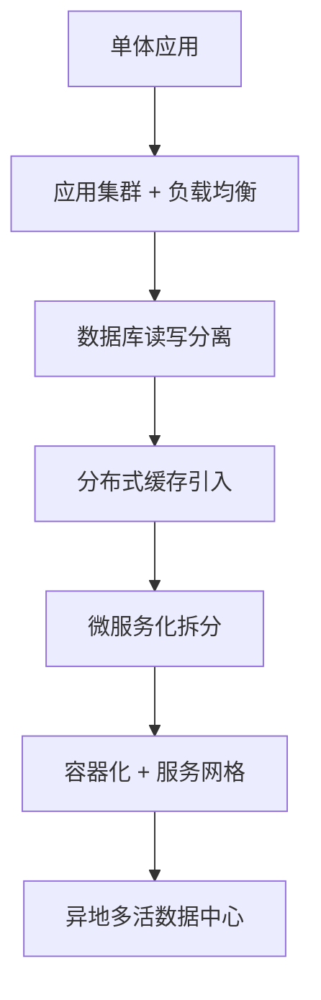
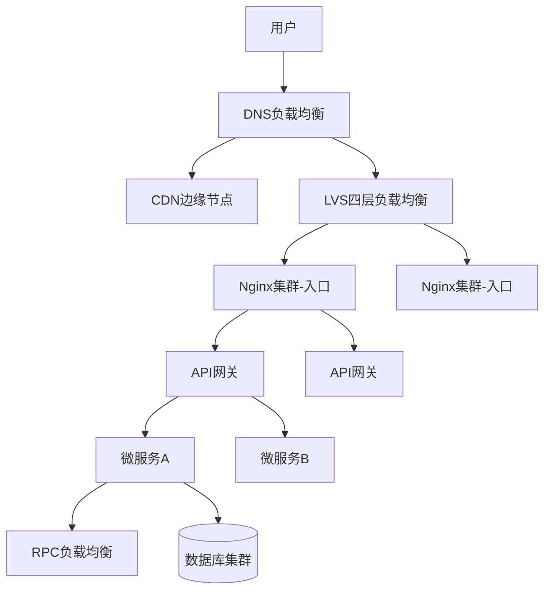
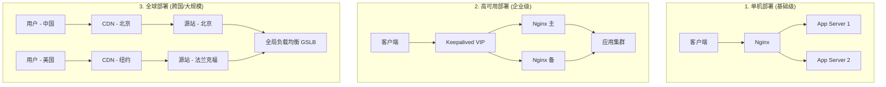
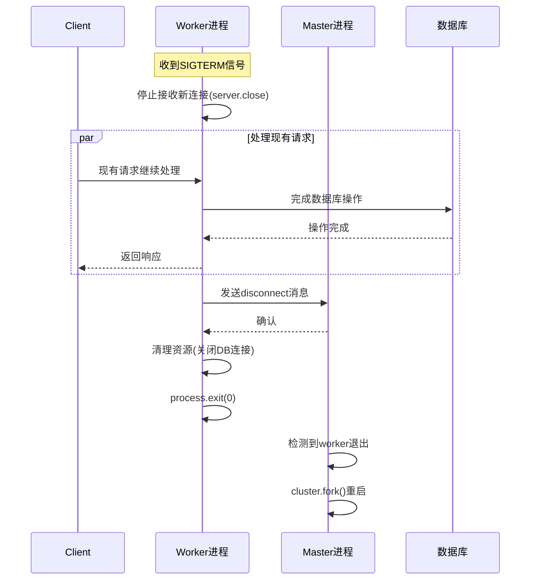
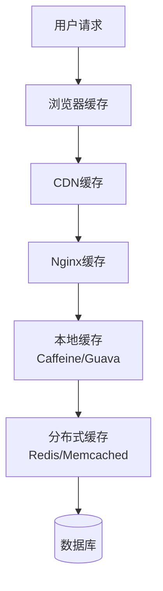
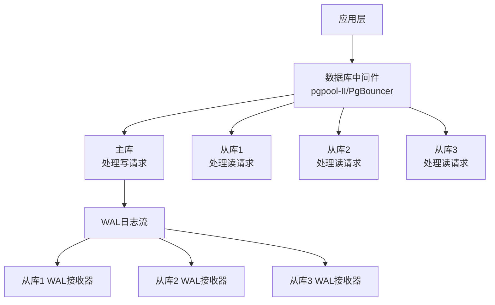
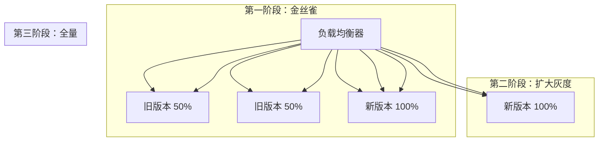
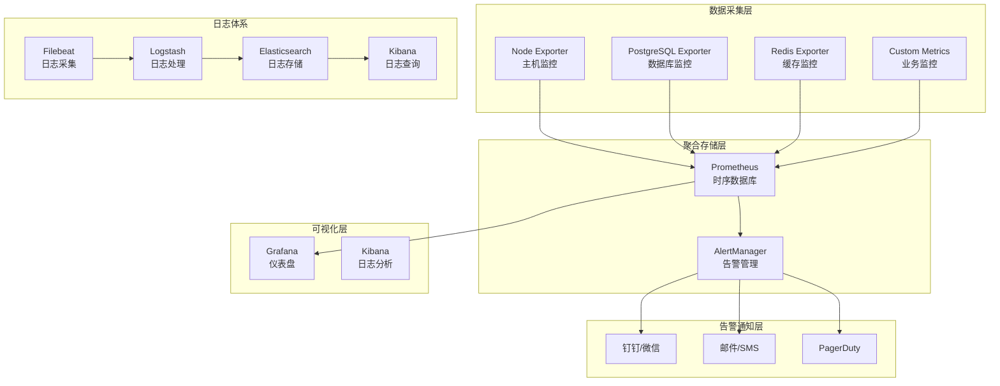

> 写给普通开发者的架构入门手册，看完再也不怕被问系统设计了

你有没有想过这样一个问题：一个网站怎么能撑住"双十一"那种级别的流量？

- 同一秒钟，几百万人同时点进来
- 服务器要同时处理几十万甚至上百万的请求
- 任何一个环节出问题，整个系统可能就崩了

更让人崩溃的是：明明平时跑得好好的，一搞活动就挂；本地测试没问题，一上线就出妖蛾子。

这篇文章就是用大白话讲清楚：**一个能扛住大流量的网站，到底是怎么设计出来的。** 全文包含大量代码示例、配置文件和架构图，不管你是刚入门的小白，还是想系统复习的老手，都能有所收获。

---

## 一、高并发系统的核心挑战与设计目标

### 1.1 高并发的本质

先说个故事。你开了一家小餐厅，请了一个厨师。一次只能做一个菜，来了100个客人排队等着——这不是要把厨师累死？

网站也是一样的道理。一台服务器就像一个厨师，能力有限。当流量大了，它就会：

- 响应越来越慢
- 最后直接崩溃
- 用户看到"502 Bad Gateway"或者"服务不可用"

**高并发（High Concurrency）就是指系统在极短时间内需要处理大量请求的场景。**

它的核心挑战在于：**在有限资源下，保证系统稳定、快速、数据还不能出错。**

以一个典型的电商秒杀活动为例：

- 10万用户同时刷新商品页面
- 5万用户点击"立即购买"
- 3万用户提交订单
- 2万用户完成支付

这些操作在几秒钟内发生，对系统的各个组件都是严峻考验。任何一个环节拖后腿，整个体验就崩了。

### 1.2 核心设计目标

高并发架构的设计目标，说白了就三点：

| 目标       | 大白话           | 关键指标        | 什么意思                   |
| ---------- | ---------------- | --------------- | -------------------------- |
| **低延迟** | 用户等太久会骂人 | TP99 < 200ms    | 99%的请求要在200毫秒内完成 |
| **高吞吐** | 同时能服务多少人 | QPS > 10万      | 每秒能处理10万个请求       |
| **高可用** | 不能动不动就挂   | 可用性 > 99.99% | 一年宕机时间不超过52分钟   |

> 小知识：TP99是什么？
>
> TP99 = Top Percentile 99%，意思是99%的请求响应时间都在这个值以下。比如TP99=200ms，就是说100个请求里有99个在200ms内返回，剩下1个可能慢一点。

### 1.3 架构演进路径

罗马不是一天建成的，系统也不是一开始就这么复杂的。

从单体应用到千万级并发，通常经历以下演进路径：



简单解释一下每个阶段在干什么：

- **单体应用**：一开始代码都写在一起，一台服务器跑所有功能
- **应用集群 + 负载均衡**：扛不住了，加机器，用负载均衡分散压力
- **数据库读写分离**：数据库成了瓶颈，把读和写分开
- **分布式缓存引入**：缓存热点数据，减少数据库压力
- **微服务化拆分**：代码太复杂了，按功能拆成独立服务
- **容器化 + 服务网格**：服务太多了，需要更好的管理方式
- **异地多活数据中心**：一个机房不够，得多机房容灾

每个阶段解决不同的瓶颈问题，本文将从最基础的负载均衡开始讲解。

---

## 二、负载均衡：流量分发的第一道防线

### 2.1 负载均衡的分层架构

当单台服务器的处理能力达到瓶颈时，我们必须将请求分散到多台机器上处理。负载均衡器就是实现这一目标的关键组件。

打个比方：你想从北京去上海，可以坐飞机、坐高铁、自驾...但不管哪种方式，最终都要通过交通枢纽把你送到目的地。负载均衡就是网站世界的"交通枢纽"。

在实际架构中，负载均衡往往在多个层面协同工作，形成一个完整的流量分发体系：



分层的好处是什么？**各司其职，术业有专攻。**

#### 2.1.1 DNS层负载均衡

DNS负载均衡是最简单也最基础的流量分发方式。通过域名解析返回多个IP，实现最基本的流量分发。

```dns
# DNS配置示例（BIND语法）
www.example.com.  IN  A  10.0.1.1
www.example.com.  IN  A  10.0.1.2
www.example.com.  IN  A  10.0.1.3
```

这个配置的意思是：当用户访问 `www.example.com` 时，DNS服务器会轮询返回这三个IP中的一个。

但DNS负载均衡有个问题：**它不能感知服务器的健康状态**。如果某台服务器挂了，DNS还是会返回它的IP，用户访问就会失败。

通常DNS负载均衡会结合CDN使用，将静态资源（图片、CSS、JS等）缓存在离用户最近的节点，大幅降低源站压力。CDN的核心价值在于：

- **减少网络延迟**：从300ms降至50ms以内（物理距离近了）
- **减轻源站带宽压力**：静态内容由CDN节点直接返回
- **抵御DDoS攻击**：流量先到CDN，被拦截在边缘

#### 2.1.2 网络层（LVS/硬件F5）

DNS负载均衡工作在应用层（第七层），而LVS工作在传输层（第四层）。这意味着LVS更快、更简单，适合作为入口流量的第一道关卡。

LVS的三种工作模式：

| 模式               | 原理                   | 适用场景 |
| ------------------ | ---------------------- | -------- |
| NAT模式            | 修改请求和响应的IP地址 | 跨网段   |
| DR模式（直接路由） | 修改MAC地址，性能最高  | 同网段   |
| TUN模式（隧道）    | IP隧道封装             | 跨网段   |

```bash
# LVS NAT模式配置示例
# -A: 添加新的虚拟服务
# -t: TCP协议，监听80端口
# -s rr: 轮询算法
ipvsadm -A -t 192.168.1.100:80 -s rr

# -a: 添加真实服务器
# -r: 真实服务器IP和端口
# -m: NAT模式
ipvsadm -a -t 192.168.1.100:80 -r 10.0.0.1:80 -m
ipvsadm -a -t 192.168.1.100:80 -r 10.0.0.2:80 -m
ipvsadm -a -t 192.168.1.100:80 -r 10.0.0.3:80 -m
```

> 小提示：硬件F5是更高端的选择，性能更强，但价格也感人。中小公司用LVS就够了。

#### 2.1.3 应用层（Nginx/OpenResty）

Nginx是基于HTTP协议的七层负载均衡器，可实现更精细的路由、限流、缓存、SSL卸载等功能。

如果说LVS是高速公路的收费口，Nginx就是城市里的交通调度系统——它能看懂"请求"这个乘客要去哪里，然后精准送达到对应的服务。

```nginx
# Nginx负载均衡完整配置
upstream backend {
    # 负载均衡算法：least_conn（最少连接）
    # 谁当前处理的请求少，就把新请求分给谁
    least_conn;

    # 服务器列表，带权重和健康检查参数
    # weight=3 表示这台服务器分到的流量是weight=1的3倍
    # max_fails=3 表示连续失败3次就认为服务器不健康
    # fail_timeout=30s 表示30秒后重新尝试
    server 10.0.0.1:8080 weight=3 max_fails=3 fail_timeout=30s;
    server 10.0.0.2:8080 weight=2 max_fails=3 fail_timeout=30s;
    server 10.0.0.3:8080 backup;  # 备用节点，平时不干活，主机都挂了才上

    keepalive 32;  # 保持长连接，避免频繁建立TCP连接
}

server {
    listen 80;
    server_name api.example.com;

    # 访问日志格式
    # 记录客户端IP、请求时间、请求内容、响应状态等
    log_format main '$remote_addr - $remote_user [$time_local] "$request" '
                    '$status $body_bytes_sent "$http_referer" '
                    '"$http_user_agent" "$http_x_forwarded_for" '
                    '$upstream_addr $upstream_response_time';

    access_log /var/log/nginx/api_access.log main;

    location / {
        proxy_pass http://backend;

        # 传递真实IP
        # 如果不加这个，后端服务看到的都是Nginx的IP
        proxy_set_header Host $host;
        proxy_set_header X-Real-IP $remote_addr;
        proxy_set_header X-Forwarded-For $proxy_add_x_forwarded_for;
        proxy_set_header X-Forwarded-Proto $scheme;

        # 超时配置
        # 连接超时：建立连接最多等5秒
        proxy_connect_timeout 5s;
        # 发送超时：发送请求到后端最多等10秒
        proxy_send_timeout 10s;
        # 读取超时：从后端读取响应最多等10秒
        proxy_read_timeout 10s;

        # 失败重试
        # 如果后端返回这些错误，自动换一台重试
        # error: 连接失败
        # timeout: 响应超时
        # invalid_header: 后端返回的响应头无效
        # http_500/http_502/http_503: 服务端错误
        proxy_next_upstream error timeout invalid_header http_500 http_502 http_503;
        proxy_next_upstream_tries 3;  # 最多重试3次
        proxy_next_upstream_timeout 10s;  # 重试总超时10秒
    }

    # 健康检查端点
    # 这个路径专门用来做健康检查，不记日志
    location /health {
        access_log off;
        return 200 "healthy\n";
        add_header Content-Type text/plain;
    }
}
```

#### 2.1.4 API网关层

在微服务架构中，API网关承担了更复杂的职责：

- **身份认证**：JWT验证、OAuth2集成——"你是谁？"
- **流量控制**：令牌桶限流、并发控制——"你每秒最多访问几次？"
- **服务发现**：与Consul/Etcd/Nacos集成——"你要找的服务在哪？"
- **协议转换**：HTTP转gRPC——"你用这个格式，我帮你转成那个格式"
- **请求/响应转换**：字段映射、数据聚合——"你只要这个数据，我帮你整理好"

简单说，API网关就是微服务的"门卫"，所有请求都要先过它这一关。

```javascript
// Node.js API网关限流配置示例 (使用 express-rate-limit)
// 这个例子展示了如何实现基于Redis的限流
import rateLimit from 'express-rate-limit'
import RedisStore from 'rate-limit-redis'
import { createClient } from 'redis'

const redisClient = createClient({ url: 'redis://localhost:6379' })

// 创建一个限流器
const limiter = rateLimit({
	// 使用Redis存储限流数据
	store: new RedisStore({
		sendCommand: (...args) => redisClient.sendCommand(args),
	}),
	windowMs: 1 * 60 * 1000, // 时间窗口：1分钟
	max: 1000, // 限制每个IP每分钟最多1000个请求
	standardHeaders: true, // 返回标准限流头信息
	legacyHeaders: false, // 关闭旧的限流头信息
	handler: (req, res) => {
		// 请求被限流时返回什么
		res.status(429).json({ error: '请求过于频繁，请稍后再试' })
	},
})

// 应用到订单服务路由
// 所有 /api/order 开头的请求都要过限流器
app.use('/api/order', limiter, (req, res) => {
	// 转发请求到订单微服务
})
```

### 2.2 负载均衡算法详解

负载均衡算法决定了"请求该去哪台服务器"。根据是否考虑后端实时状态，分为静态算法（不考虑）和动态算法（考虑）。

#### 2.2.1 静态算法

**轮询（Round Robin）**：最简单、最公平的算法，一个一个来。

```javascript
// Node.js 轮询负载均衡器实现
class LoadBalancer {
	constructor(servers) {
		this.servers = servers
		this.currentIndex = 0
	}

	getNextServer() {
		const server = this.servers[this.currentIndex]
		// 递增索引，超过数组长度就回到0
		this.currentIndex = (this.currentIndex + 1) % this.servers.length
		return server
	}
}

// 使用示例
const servers = ['Server1:8080', 'Server2:8080', 'Server3:8080']
const lb = new LoadBalancer(servers)

// 模拟10个请求
for (let i = 0; i < 10; i++) {
	const server = lb.getNextServer()
	console.log(`请求 ${i + 1} 转发到 ${server}`)
}
```

输出结果：

```
请求 1 转发到 Server1:8080
请求 2 转发到 Server2:8080
请求 3 转发到 Server3:8080
请求 4 转发到 Server1:8080
请求 5 转发到 Server2:8080
请求 6 转发到 Server3:8080
请求 7 转发到 Server1:8080
请求 8 转发到 Server2:8080
请求 9 转发到 Server3:8080
请求 10 转发到 Server1:8080
```

**加权轮询（Weighted Round Robin）**：能者多劳，性能强的多扛点。

比如有3台服务器：

- 服务器A：8核CPU，性能强
- 服务器B：4核CPU，性能中等
- 服务器C：2核CPU，性能弱

如果用普通轮询，3台服务器分到的请求量一样多，但性能弱的服务器会被压垮。

加权轮询可以这样配置：

```javascript
// Node.js 加权轮询算法（平滑加权）
// "平滑"是指请求分配得更均匀，不会一下子全打到某一台
class WeightedRoundRobin {
	constructor(servers) {
		// servers: [{ name: 'S1', weight: 5 }, { name: 'S2', weight: 1 }]
		this.servers = servers
		// 每个节点当前的"权重"，初始为0
		this.currentWeights = servers.map(() => 0)
		// 所有节点的权重总和
		this.totalWeight = servers.reduce((sum, s) => sum + s.weight, 0)
	}

	getNextServer() {
		let maxWeight = -1
		let index = -1

		// 第一步：给每个节点的当前权重加上它的原始权重
		for (let i = 0; i < this.servers.length; i++) {
			this.currentWeights[i] += this.servers[i].weight

			// 同时找出当前权重最大的节点
			if (this.currentWeights[i] > maxWeight) {
				maxWeight = this.currentWeights[i]
				index = i
			}
		}

		// 第二步：被选中的节点，减去总权重
		if (index !== -1) {
			this.currentWeights[index] -= this.totalWeight
			return this.servers[index]
		}

		return null
	}
}
```

**IP哈希（IP Hash）**：让同一个IP的请求，每次都打到同一台服务器。

为什么需要这个？因为有些场景需要"会话保持"。

比如用户登录后，服务端会在内存里存用户的Session信息。如果用户下次请求被负载均衡到另一台服务器，那台服务器没有这个用户的Session，用户就需要重新登录。

IP哈希通过计算IP的哈希值来决定路由：

```javascript
import crypto from 'node:crypto'

function ipHash(ipAddress, serverList) {
	/**
	 * 根据客户端IP哈希选择服务器
	 * 核心思想：同一个IP，每次计算结果一样
	 */
	// 计算IP的MD5哈希值
	const hash = crypto.createHash('md5').update(ipAddress).digest('hex')
	// 取哈希值的一部分转为整数，然后对服务器数量取模
	// 取模的结果永远在 0 ~ 服务器数量-1 之间
	const hashInt = parseInt(hash.substring(0, 8), 16)
	const serverIndex = hashInt % serverList.length

	return serverList[serverIndex]
}

// 测试
const servers = ['Server1', 'Server2', 'Server3', 'Server4']
const ips = ['192.168.1.100', '192.168.1.101', '192.168.1.100']

ips.forEach((ip) => {
	const selected = ipHash(ip, servers)
	console.log(`IP ${ip} -> ${selected}`)
})
```

输出：

```
IP 192.168.1.100 -> Server3
IP 192.168.1.101 -> Server1
IP 192.168.1.100 -> Server3  # 相同IP始终命中同一台服务器
```

注意最后一行：`192.168.1.100` 两次都命中 `Server3`，这就是IP哈希的核心特点。

**一致性哈希（Consistent Hashing）**：这是进阶玩法，主要用于分布式缓存。

问题来了：假设有3台Redis服务器缓存用户数据。当某台服务器挂了或者扩容时，按照普通哈希，大部分缓存都会失效（因为取模的除数变了）。

一致性哈希就是为了解决这个问题：服务器挂掉或增加时，只影响少部分数据。

```javascript
import crypto from 'node:crypto'

class ConsistentHash {
	constructor(nodes = [], virtualNodes = 150) {
		// 虚拟节点数：每个物理节点在哈希环上占多少个位置
		// 虚拟节点越多，数据分布越均匀
		this.virtualNodes = virtualNodes
		this.ring = new Map() // 哈希环：hash值 -> 节点名
		this.sortedKeys = [] // 排序后的哈希值列表，用于二分查找

		// 初始化时把每个节点加到环上
		nodes.forEach((node) => this.addNode(node))
	}

	// 计算哈希值
	_hash(key) {
		const hash = crypto.createHash('md5').update(key).digest('hex')
		return parseInt(hash.substring(0, 8), 16)
	}

	// 把节点加到环上
	addNode(node) {
		// 每个物理节点对应多个虚拟节点
		for (let i = 0; i < this.virtualNodes; i++) {
			const virtualKey = `${node}:${i}`
			const hashValue = this._hash(virtualKey)
			this.ring.set(hashValue, node)
			this.sortedKeys.push(hashValue)
		}
		// 排序，便于二分查找
		this.sortedKeys.sort((a, b) => a - b)
	}

	// 把节点从环上移除
	removeNode(node) {
		for (let i = 0; i < this.virtualNodes; i++) {
			const virtualKey = `${node}:${i}`
			const hashValue = this._hash(virtualKey)
			this.ring.delete(hashValue)
			this.sortedKeys = this.sortedKeys.filter((k) => k !== hashValue)
		}
	}

	// 查找数据应该存在哪个节点上
	getNode(key) {
		if (this.ring.size === 0) return null

		// 计算数据的哈希值
		const hashValue = this._hash(key)

		// 二分查找：找到第一个 >= hashValue 的位置
		// 因为哈希环是闭环，如果找不到，就回到环的开头
		let low = 0,
			high = this.sortedKeys.length - 1

		while (low <= high) {
			const mid = Math.floor((low + high) / 2)
			if (this.sortedKeys[mid] >= hashValue) {
				high = mid - 1
			} else {
				low = mid + 1
			}
		}

		// 如果超出范围，则返回第一个节点（闭合环）
		if (low === this.sortedKeys.length) low = 0

		return this.ring.get(this.sortedKeys[low])
	}
}

// 使用示例
const nodes = ['Redis1', 'Redis2', 'Redis3']
const ch = new ConsistentHash(nodes, 100) // 每个节点100个虚拟节点

const keys = ['user:1001', 'user:1002', 'user:1003', 'product:2001', 'order:3001']
keys.forEach((key) => {
	const node = ch.getNode(key)
	console.log(`Key: ${key} -> Node: ${node}`)
})
```

#### 2.2.2 动态算法

静态算法只考虑算法本身，不考虑后端服务器的实际状态。动态算法则会考虑后端服务器的实时负载。

**最少连接（Least Connections）**：将新请求分配给当前连接数最少的服务器。

这个算法适合**长连接场景**，比如：

- 即时通讯（聊天应用）
- WebSocket推送
- 长连接API

为什么？因为短连接场景下，连接很快就会断开，无法准确反映服务器负载。

```javascript
// Node.js 最少连接负载均衡实现
class LeastConnectionsLB {
	constructor(servers) {
		// 初始化每个服务器的连接数
		this.servers = servers.map((addr) => ({
			address: addr,
			connections: 0,
		}))
	}

	// 获取下一个服务器
	getNextServer() {
		let selected = null
		let minConns = Infinity

		// 找出连接数最少的服务器
		for (const server of this.servers) {
			if (server.connections < minConns) {
				minConns = server.connections
				selected = server
			}
		}

		// 给选中的服务器连接数+1
		if (selected) {
			selected.connections++
		}
		return selected
	}

	// 释放连接（请求处理完后调用）
	release(server) {
		if (server && server.connections > 0) {
			server.connections--
		}
	}
}
```

### 2.3 健康检查机制

负载均衡器需要知道哪些后端实例是健康的，才能将流量分发过去。如果把请求发到一台已经宕机的服务器，用户就会看到错误页面。

健康检查通常有两种方式：**主动检查**和**被动检查**。

#### 2.3.1 主动健康检查

负载均衡器主动向后端服务器发送探测请求，根据响应判断服务器是否健康。

```nginx
# Nginx主动健康检查配置（需安装nginx_upstream_check_module）
upstream backend {
    server 10.0.0.1:8080;
    server 10.0.0.2:8080;
    server 10.0.0.3:8080;

    # 健康检查配置
    # interval=3000: 每3秒检查一次
    # rise=2: 连续2次成功才认为服务器健康
    # fall=5: 连续5次失败才认为服务器不健康
    # timeout=1000: 探测超时1秒
    # type=http: 使用HTTP协议检查
    check interval=3000 rise=2 fall=5 timeout=1000 type=http;

    # 发送的HTTP请求
    check_http_send "HEAD /health HTTP/1.0\r\n\r\n";

    # 认为哪些HTTP状态码是健康的
    check_http_expect_alive http_2xx http_3xx;
}
```

#### 2.3.2 被动健康检查

被动健康检查是根据后端服务器的实际响应来判断的。如果请求失败达到一定次数，就把服务器摘掉。

```nginx
# Nginx被动健康检查
upstream backend {
    # max_fails=3: 连续3次失败
    # fail_timeout=30s: 在30秒内失败3次就摘掉
    # 30秒后会重新尝试，如果成功就恢复
    server 10.0.0.1:8080 max_fails=3 fail_timeout=30s;
    server 10.0.0.2:8080 max_fails=3 fail_timeout=30s;
    server 10.0.0.3:8080 max_fails=3 fail_timeout=30s;
}
```

两种方式的区别：

| 方式     | 优点           | 缺点             | 适用场景             |
| -------- | -------------- | ---------------- | -------------------- |
| 主动检查 | 能提前发现问题 | 需要额外探测流量 | 对可用性要求高的场景 |
| 被动检查 | 实现简单       | 有延迟发现问题   | 一般场景             |

#### 2.3.3 应用层健康检查端点

有时候我们不只关心服务器是否活着，还关心依赖的数据库、缓存等是否正常。这时就需要应用层健康检查。

```javascript
// healthcheck.js
// 这是一个Express应用的健康检查端点实现
import express from 'express'
import mongoose from 'mongoose'
import { createClient } from 'redis'
import checkDiskSpace from 'check-disk-space'

const app = express()

// 健康检查端点
// 访问 GET /health 会返回应用的详细健康状态
app.get('/health', async (req, res) => {
	const healthcheck = {
		uptime: process.uptime(), // 进程运行时间
		status: 'OK',
		timestamp: Date.now(),
		checks: {}, // 各项检查的结果
	}

	try {
		// 检查数据库连接
		// mongoose.connection.readyState:
		// 0 = disconnected, 1 = connected, 2 = connecting, 3 = disconnecting
		if (mongoose.connection.readyState === 1) {
			healthcheck.checks.database = 'up'
		} else {
			healthcheck.checks.database = 'down'
		}

		// 检查Redis连接
		const redisClient = createClient()
		await redisClient.connect()
		await redisClient.ping()
		healthcheck.checks.redis = 'up'
		await redisClient.quit()

		// 检查磁盘空间
		const diskSpace = await checkDiskSpace('/')
		const freeSpaceGB = diskSpace.free / 1024 / 1024 / 1024

		if (freeSpaceGB > 10) {
			healthcheck.checks.disk = 'up'
		} else {
			healthcheck.checks.disk = 'warning'
		}
	} catch (error) {
		healthcheck.status = 'error'
		healthcheck.error = error.message
		return res.status(503).json(healthcheck) // 503表示服务不可用
	}

	// 如果有任何关键依赖异常，返回503
	if (healthcheck.checks.database === 'down' || healthcheck.checks.redis === 'down') {
		return res.status(503).json(healthcheck)
	}

	res.json(healthcheck)
})

app.listen(3000, () => {
	console.log('Health check server running on port 3000')
})
```

### 2.4 负载均衡的部署模式

负载均衡器本身也可能成为单点故障。所以负载均衡器也需要做高可用部署。



解释一下：

- **单机部署**：最简单，适合小流量。Nginx挂了，整个服务就挂了。
- **高可用部署**：用Keepalived实现Nginx的主备切换。主Nginx挂了，VIP飘到备Nginx，用户无感知。
- **全球部署**：用户在哪就近访问哪个CDN，CDN回源到最近的源站，全局负载均衡（GSLB）统一调度。

---

## 三、Node.js应用的高可用实践

Node.js单线程模型虽然避免了多线程编程的复杂性（不用处理锁、死锁等问题），但有两个明显的问题：

1. **无法充分利用多核CPU**：一台8核服务器，Node.js只用1核，其他7核闲着
2. **进程崩溃服务中断**：一旦进程panic，整个服务就不可用了

在生产环境中，我们需要特别的策略来解决这些问题。

### 3.1 Cluster模块实现多进程

Node.js内置的`cluster`模块允许我们创建多个工作进程（worker），每个进程都能独立处理请求，从而充分利用多核CPU。

```javascript
// cluster-app.js
import cluster from 'cluster'
import http from 'http'
import { cpus } from 'os'
import process from 'process'

// 获取CPU核心数
const numCPUs = cpus().length

// 判断是主进程还是工作进程
if (cluster.isPrimary) {
	// ============ 主进程（Manager）============

	console.log(`主进程 ${process.pid} 正在运行`)
	console.log(`CPU核心数: ${numCPUs}`)

	// 记录工作进程数量
	let workerCount = 0

	// 衍生工作进程
	for (let i = 0; i < numCPUs; i++) {
		const worker = cluster.fork() // fork一个工作进程
		workerCount++

		// 监听工作进程消息
		worker.on('message', (msg) => {
			console.log(`主进程收到消息: ${msg} from ${worker.process.pid}`)
		})
	}

	console.log(`已启动 ${workerCount} 个工作进程`)

	// 监听工作进程退出事件
	cluster.on('exit', (worker, code, signal) => {
		console.log(`工作进程 ${worker.process.pid} 退出，退出码: ${code}, 信号: ${signal}`)

		// 自动重启（生产环境必须有这个！）
		console.log('正在重启工作进程...')
		cluster.fork()
	})

	// 定期向工作进程发送状态查询（可选）
	setInterval(() => {
		const workers = Object.values(cluster.workers)
		workers.forEach((worker) => {
			worker.send({ cmd: 'status' })
		})
	}, 10000)
} else {
	// ============ 工作进程（Worker）============

	// 工作进程启动HTTP服务
	const server = http
		.createServer((req, res) => {
			// 模拟请求处理
			const start = Date.now()

			// 根据不同路径返回不同内容
			if (req.url === '/') {
				res.writeHead(200, { 'Content-Type': 'text/html' })
				res.end(`
                <html>
                <head><title>Cluster Demo</title></head>
                <body>
                    <h1>Hello from Worker ${process.pid}</h1>
                    <p>请求处理时间: ${Date.now() - start}ms</p>
                </body>
                </html>
            `)
			} else if (req.url === '/health') {
				// 健康检查
				res.writeHead(200, { 'Content-Type': 'application/json' })
				res.end(
					JSON.stringify({
						pid: process.pid,
						memory: process.memoryUsage(),
						uptime: process.uptime(),
						timestamp: Date.now(),
					}),
				)
			} else if (req.url === '/slow') {
				// 模拟慢请求（处理需要5秒）
				setTimeout(() => {
					res.writeHead(200)
					res.end(`Slow response from ${process.pid}`)
				}, 5000)
			} else {
				res.writeHead(404)
				res.end('Not Found')
			}
		})
		.listen(3000)

	console.log(`工作进程 ${process.pid} 启动，监听端口 3000`)

	// 处理主进程发来的消息
	process.on('message', (msg) => {
		if (msg.cmd === 'status') {
			console.log(`Worker ${process.pid} 状态: 存活`)
			process.send({ cmd: 'status', pid: process.pid, memory: process.memoryUsage() })
		} else if (msg.cmd === 'shutdown') {
			console.log(`Worker ${process.pid} 收到关闭信号，优雅退出`)
			gracefulShutdown()
		}
	})

	// 优雅退出函数
	function gracefulShutdown() {
		server.close(() => {
			console.log(`Worker ${process.pid} 已关闭所有连接`)
			process.exit(0)
		})

		// 设置超时强制退出（防止有请求一直不结束）
		setTimeout(() => {
			console.error(`Worker ${process.pid} 强制退出`)
			process.exit(1)
		}, 10000)
	}

	// 处理未捕获的异常（防止进程崩溃）
	process.on('uncaughtException', (err) => {
		console.error(`Worker ${process.pid} 未捕获异常:`, err)
		gracefulShutdown()
	})
}
```

### 3.2 优雅退出机制详解

为什么要优雅退出？

粗暴地终止进程会导致：

1. **正在处理的请求中断**：用户收到`ECONNRESET`错误，一脸懵
2. **数据状态污染**：如果有数据库操作正在执行，可能导致数据不一致

优雅退出的流程：



完整优雅退出实现：

```javascript
// graceful-shutdown.js
// 这是一个通用的优雅退出管理器
class GracefulShutdownManager {
	constructor(server, options = {}) {
		this.server = server
		this.options = {
			timeout: options.timeout || 10000, // 超时时间，默认10秒
			connections: new Set(), // 跟踪所有连接
			...options,
		}

		this.isShuttingDown = false
		this.pendingRequests = 0 // 等待中的请求数

		// 开始跟踪连接
		this.trackConnections()
	}

	// 跟踪TCP连接
	trackConnections() {
		this.server.on('connection', (socket) => {
			// 如果正在关闭，销毁新连接
			if (this.isShuttingDown) {
				socket.destroy()
				return
			}

			this.options.connections.add(socket)

			socket.on('close', () => {
				this.options.connections.delete(socket)
			})
		})

		// 跟踪HTTP请求
		this.server.on('request', (req, res) => {
			// 正在关闭时，告诉客户端关闭连接
			if (this.isShuttingDown) {
				res.setHeader('Connection', 'close')
			}

			this.pendingRequests++

			res.on('finish', () => {
				this.pendingRequests--
				this.checkIfDone()
			})
		})
	}

	// 执行关闭
	shutdown(callback) {
		if (this.isShuttingDown) return

		this.isShuttingDown = true
		console.log('开始优雅退出...')

		// 停止接收新连接
		this.server.close(() => {
			console.log('服务器已关闭，不再接受新连接')
		})

		// 设置超时强制退出
		const forceShutdown = setTimeout(() => {
			console.error(`优雅退出超时(${this.options.timeout}ms)，强制退出`)
			this.destroyConnections()
			process.exit(1)
		}, this.options.timeout)

		// 定期检查是否所有请求都处理完了
		const checkInterval = setInterval(() => {
			if (this.pendingRequests === 0 && this.options.connections.size === 0) {
				// 所有请求处理完毕，可以安全退出了
				clearInterval(checkInterval)
				clearTimeout(forceShutdown)
				console.log('所有请求处理完成，退出进程')
				process.exit(0)
			} else {
				console.log(`等待中 - 请求: ${this.pendingRequests}, 连接: ${this.options.connections.size}`)
			}
		}, 1000)
	}

	// 强制销毁所有连接
	destroyConnections() {
		this.options.connections.forEach((socket) => {
			if (!socket.destroyed) {
				socket.destroy()
			}
		})
		this.options.connections.clear()
	}

	// 检查是否可以退出
	checkIfDone() {
		if (this.isShuttingDown && this.pendingRequests === 0 && this.options.connections.size === 0) {
			console.log('所有请求处理完成，退出进程')
			process.exit(0)
		}
	}
}

// 使用示例
import http from 'node:http'
const server = http.createServer((req, res) => {
	// 模拟请求处理需要2秒
	setTimeout(() => {
		res.writeHead(200)
		res.end('OK')
	}, 2000)
})

const shutdownManager = new GracefulShutdownManager(server)

// 监听退出信号
// SIGTERM: Kubernetes/容器停止时发送
// SIGINT: Ctrl+C 时发送
// SIGQUIT: 进程退出请求
process.on('SIGTERM', () => shutdownManager.shutdown())
process.on('SIGINT', () => shutdownManager.shutdown())
process.on('SIGQUIT', () => shutdownManager.shutdown())

// 处理未捕获异常
process.on('uncaughtException', (err) => {
	console.error('未捕获异常:', err)
	shutdownManager.shutdown()
})

server.listen(3000, () => {
	console.log('服务器启动，PID:', process.pid)
})
```

### 3.3 PM2进程管理器

手动实现cluster、优雅退出、自动重启等逻辑不仅繁琐，还容易出错。PM2是一个成熟的Node.js进程管理工具，它将这些功能打包成简单的命令，开箱即用。

#### 3.3.1 PM2核心能力

| 功能       | 命令                       | 说明                         |
| ---------- | -------------------------- | ---------------------------- |
| 集群模式   | `pm2 start app.js -i max`  | 自动利用所有CPU核心          |
| 零停机重载 | `pm2 reload all`           | 逐个重启worker，用户无感知   |
| 自动重启   | `pm2 start app.js --watch` | 文件变化时自动重启（开发用） |
| 内存监控   | `pm2 monit`                | 实时监控CPU/内存占用         |
| 日志管理   | `pm2 logs`                 | 集中管理所有日志             |
| 开机自启   | `pm2 startup`              | 生成系统启动脚本             |

#### 3.3.2 PM2配置文件

配置文件可以更精细地控制PM2的行为：

```javascript
// ecosystem.config.js
// 使用 CommonJS 还是 ESM 取决于你的项目配置
export default {
	apps: [
		{
			name: 'my-app', // 应用名称
			script: './app.js',
			instances: 'max', // 启动多少个实例，'max'表示CPU核心数
			exec_mode: 'cluster', // cluster模式 vs fork模式

			// 开发时可以用watch，上线后要关闭
			watch: false,

			// ============ 自动重启配置 ============
			autorestart: true, // 崩溃后自动重启
			restart_delay: 5000, // 重启前等待5秒
			max_restarts: 10, // 最多重启10次
			min_uptime: '10s', // 运行超过10秒才算"正常启动"

			// ============ 内存限制 ============
			// 内存超过500M就自动重启，防止内存泄漏
			max_memory_restart: '500M',

			// ============ 优雅退出配置 ============
			kill_timeout: 10000, // 发送SIGTERM后等待10秒，强制SIGKILL
			listen_timeout: 3000, // 启动超时时间

			// ============ 环境变量 ============
			env: {
				NODE_ENV: 'production',
				PORT: 3000,
			},

			// ============ 日志配置 ============
			log_file: './logs/app.log', // 所有日志
			error_file: './logs/err.log', // 错误日志
			out_file: './logs/out.log', // 标准输出
			log_date_format: 'YYYY-MM-DD HH:mm:ss', // 日志时间格式
			merge_logs: true, // 合并多实例日志

			// ============ 监控配置 ============
			instance_var: 'INSTANCE_ID', // 环境变量名，包含实例ID

			// ============ 健康检查 ============
			// PM2会定期访问这个URL，失败就重启
			health_check: {
				url: 'http://localhost:3000/health',
				interval: 30000, // 每30秒检查一次
				timeout: 5000, // 超时5秒
			},
		},
		{
			// 第二个应用：后台Worker
			name: 'worker-app',
			script: './worker.js',
			instances: 2, // 启动2个Worker
			exec_mode: 'fork', // 后台任务用fork模式
			cron_restart: '0 0 * * *', // 每天凌晨重启，防止内存泄漏

			env: {
				NODE_ENV: 'production',
				WORKER_TYPE: 'background',
			},
		},
	],
}
```

#### 3.3.3 PM2与优雅退出集成

PM2原生支持优雅退出，只需要在应用中监听信号即可：

```javascript
// app.js
import express from 'express'
const app = express()

// 业务逻辑...（省略）

// 优雅退出处理
process.on('SIGINT', () => {
	console.log('收到SIGINT信号，准备优雅退出')

	// 关闭数据库连接
	db.close(() => {
		console.log('数据库连接已关闭')

		// 关闭Redis连接
		redis.quit(() => {
			console.log('Redis连接已关闭')

			// 关闭HTTP服务器
			server.close(() => {
				console.log('HTTP服务器已关闭')
				process.exit(0)
			})
		})
	})

	// 超时强制退出（防止有些连接一直不断开）
	setTimeout(() => {
		console.error('优雅退出超时，强制退出')
		process.exit(1)
	}, 10000)
})
```

PM2常用命令：

```bash
# 安装PM2
npm install pm2@latest -g

# 启动应用
pm2 start ecosystem.config.js

# 查看状态
pm2 list
pm2 show my-app

# 监控（实时显示CPU和内存）
pm2 monit

# 查看日志
pm2 logs my-app --lines 100

# 零停机重载（用于更新代码）
pm2 reload my-app

# 重启
pm2 restart my-app

# 保存状态（保存当前运行的进程列表）
pm2 save

# 生成开机自启脚本（Linux用systemd，Mac用launchd等）
pm2 startup

# 停止所有
pm2 stop all

# 删除所有
pm2 delete all
```

---

## 四、缓存策略：减轻后端压力

缓存是应对高并发的核心手段。说白了就是：**用空间换时间**。

数据库是系统里最容易成为瓶颈的地方。一次数据库查询可能需要几十毫秒，而从内存读取只需要几微秒。如果能把常用的数据放内存里，系统能扛的并发量能提升几十倍甚至上百倍。

### 4.1 多级缓存架构

缓存在系统中是多层次的，越靠近用户越快，但数据一致性越难保证。



每一层缓存的特点：

| 层级       | 速度 | 容量 | 共享范围 | 适用场景                     |
| ---------- | ---- | ---- | -------- | ---------------------------- |
| 浏览器缓存 | 最快 | 小   | 单用户   | 静态资源、个性化程度低的内容 |
| CDN缓存    | 快   | 中   | 所有用户 | 静态资源、公共内容           |
| Nginx缓存  | 快   | 中   | 所有用户 | 频繁访问的接口响应           |
| 本地缓存   | 快   | 小   | 单实例   | 热点数据、几乎不变的数据     |
| Redis缓存  | 中   | 大   | 所有实例 | 热点数据、会话信息           |
| 数据库     | 慢   | 最大 | 所有实例 | 最终数据源                   |

### 4.2 浏览器缓存

浏览器缓存是最容易被忽视的一环。如果配置得当，用户的浏览器可以直接从本地读取资源，完全不用请求服务器。

```nginx
# Nginx配置浏览器缓存
location ~* \.(jpg|jpeg|png|gif|ico|css|js)$ {
    # 设置缓存过期时间为30天
    expires 30d;

    # 缓存控制头
    # public: 可以被任何缓存存储
    # no-transform: 禁止压缩（有些CDN会压缩图片）
    add_header Cache-Control "public, no-transform";
    add_header Pragma public;

    # 开启gzip压缩，减少传输大小
    gzip on;
    gzip_types text/css application/javascript image/svg+xml;

    # 静态资源不需要记录访问日志
    access_log off;
}
```

### 4.3 Redis缓存实战

Redis是最常用的分布式缓存。来看一个完整的缓存实现：

```javascript
// redis-cache.js
import { createClient } from 'redis'

class RedisCache {
	constructor(options = {}) {
		this.client = createClient({
			url: `redis://${options.host || 'localhost'}:${options.port || 6379}`,
			password: options.password,
			database: options.db || 0,
		})

		// 错误处理
		this.client.on('error', (err) => console.error('Redis错误:', err))
		this.client.on('connect', () => console.log('Redis连接成功'))

		this.client.connect().catch(console.error)

		// 默认过期时间（秒）
		this.defaultTTL = options.defaultTTL || 3600

		// 缓存前缀，避免key冲突
		this.prefix = options.prefix || 'cache:'
	}

	// 生成带前缀的key
	_getKey(key) {
		return `${this.prefix}${key}`
	}

	// ============ 基础操作 ============

	// 获取缓存
	async get(key) {
		try {
			const cacheKey = this._getKey(key)
			const data = await this.client.get(cacheKey)

			if (data) {
				console.log(`缓存命中: ${key}`)
				return JSON.parse(data)
			}

			console.log(`缓存未命中: ${key}`)
			return null
		} catch (err) {
			console.error('获取缓存失败:', err)
			return null
		}
	}

	// 设置缓存
	async set(key, value, ttl = this.defaultTTL) {
		try {
			const cacheKey = this._getKey(key)
			const data = JSON.stringify(value)

			if (ttl > 0) {
				// EX: 设置过期时间（秒）
				await this.client.set(cacheKey, data, { EX: ttl })
			} else {
				// 不过期
				await this.client.set(cacheKey, data)
			}

			console.log(`缓存设置: ${key}, TTL: ${ttl}s`)
			return true
		} catch (err) {
			console.error('设置缓存失败:', err)
			return false
		}
	}

	// 删除缓存
	async del(key) {
		try {
			const cacheKey = this._getKey(key)
			await this.client.del(cacheKey)
			console.log(`缓存删除: ${key}`)
			return true
		} catch (err) {
			console.error('删除缓存失败:', err)
			return false
		}
	}

	// ============ 高级操作 ============

	// 获取缓存，如果不存在则通过回调获取并缓存
	// 这是最常用的模式，一次搞定缓存穿透和缓存击穿
	async remember(key, ttl, callback) {
		let value = await this.get(key)

		if (value !== null) {
			return value
		}

		// 缓存不存在，使用互斥锁防止缓存击穿
		const lockKey = `lock:${key}`
		const lockAcquired = await this.acquireLock(lockKey, 10)

		if (lockAcquired) {
			try {
				// 双重检查：可能其他进程已经加载了缓存
				value = await this.get(key)
				if (value !== null) {
					return value
				}

				// 调用回调函数获取数据（通常是查数据库）
				value = await callback()

				// 缓存起来
				await this.set(key, value, ttl)
				return value
			} finally {
				// 释放锁
				await this.releaseLock(lockKey)
			}
		} else {
			// 没拿到锁，说明其他进程正在加载，等一下再试
			await new Promise((resolve) => setTimeout(resolve, 100))
			return await this.get(key)
		}
	}

	// 获取分布式锁
	async acquireLock(lockKey, ttl) {
		// SET ... NX EX: 只有key不存在时才设置，并设置过期时间
		const result = await this.client.set(lockKey, 'locked', { NX: true, EX: ttl })
		return result === 'OK'
	}

	// 释放锁
	async releaseLock(lockKey) {
		await this.client.del(lockKey)
	}

	// ============ 标签功能（批量失效） ============

	// 给一组缓存打标签
	async tag(tag, keys) {
		const tagKey = `tag:${tag}`
		await this.client.set(tagKey, JSON.stringify(keys))
		// 设置tag永不过期，但可以手动删除
		return true
	}

	// 获取标签下的所有缓存
	async getByTag(tag) {
		const tagKey = `tag:${tag}`
		const data = await this.client.get(tagKey)

		if (!data) return []

		const keys = JSON.parse(data)
		const results = []

		for (const key of keys) {
			const value = await this.get(key)
			if (value) {
				results.push({ key, value })
			}
		}

		return results
	}

	// 清理标签下的所有缓存
	async flushTag(tag) {
		const tagKey = `tag:${tag}`
		const data = await this.client.get(tagKey)

		if (data) {
			const keys = JSON.parse(data)
			for (const key of keys) {
				await this.client.del(key)
			}
			await this.client.del(tagKey)
		}

		return true
	}
}

// 使用示例
async function example() {
	const cache = new RedisCache({
		host: 'localhost',
		port: 6379,
		prefix: 'app:',
		defaultTTL: 1800, // 30分钟
	})

	// ============ 基础使用 ============
	await cache.set('user:1001', { name: '张三', age: 30 })
	const user = await cache.get('user:1001')
	console.log('用户数据:', user)

	// ============ remember模式 ============
	// 自动处理缓存不存在的情况
	const product = await cache.remember('product:2001', 3600, async () => {
		console.log('从数据库加载产品数据...')
		// 模拟数据库查询
		return {
			id: 2001,
			name: 'iPhone 15',
			price: 6999,
		}
	})
	console.log('产品数据:', product)

	// ============ 标签使用 ============
	// 给"手机"分类下的产品打标签
	await cache.tag('category:phone', ['app:product:2001', 'app:product:2002'])
	const phones = await cache.getByTag('category:phone')
	console.log('手机产品:', phones)

	// 当手机分类更新时，一键清理所有相关缓存
	await cache.flushTag('category:phone')
}

example()
```

### 4.4 缓存常见问题及解决方案

缓存在带来性能提升的同时，也会引入一些问题。了解这些问题，才能更好地使用缓存。

#### 4.4.1 缓存穿透

**问题**：查询一个数据库里根本不存在的数据（恶意请求或正常查询），每次都跳过缓存直接打到数据库。

比如有人用不存在的ID频繁查询用户信息，这些请求都不会命中缓存，数据库压力陡增。

**解决方案**：缓存空值。

```javascript
// 缓存穿透解决方案：缓存空值
async function getUserById(id) {
	const cacheKey = `user:${id}`
	let user = await cache.get(cacheKey)

	// 缓存中有值
	if (user !== null) {
		// 判断是否是空值标记
		if (user === 'NULL_VALUE') {
			return null
		}
		return user
	}

	// 缓存中没有，查询数据库
	user = await db.query('SELECT * FROM users WHERE id = ?', [id])

	if (user) {
		// 有数据，缓存真实值
		await cache.set(cacheKey, user, 3600)
		return user
	} else {
		// 没数据，缓存空值（短期）
		// 这样下次查询同样的ID，1分钟内不会打到数据库
		await cache.set(cacheKey, 'NULL_VALUE', 300)
		return null
	}
}
```

#### 4.4.2 缓存击穿

**问题**：某个热点key（比如首页推荐商品）突然过期，导致大量并发请求同时穿透到数据库。

正常情况下，缓存能挡住大部分请求。但如果这个key过期的一瞬间，所有请求都发现缓存不存在，然后一起去查数据库...数据库就炸了。

**解决方案**：互斥锁 + 永不过期。

```javascript
// 缓存击穿解决方案：互斥锁
async function getHotProduct(id) {
	const cacheKey = `product:${id}`
	let product = await cache.get(cacheKey)

	if (product) {
		return product
	}

	// 尝试获取锁
	const lockKey = `lock:product:${id}`
	const lock = await cache.acquireLock(lockKey, 10)

	if (lock) {
		try {
			// 双重检查：可能其他进程已经加载了缓存
			product = await cache.get(cacheKey)
			if (product) {
				return product
			}

			// 查数据库
			product = await db.query('SELECT * FROM products WHERE id = ?', [id])

			// 设置缓存，不过期或长过期时间
			await cache.set(cacheKey, product, 3600)

			return product
		} finally {
			await cache.releaseLock(lockKey)
		}
	} else {
		// 没拿到锁，等一下再试（可能其他进程正在加载缓存）
		await new Promise((resolve) => setTimeout(resolve, 100))
		return getHotProduct(id)
	}
}
```

#### 4.4.3 缓存雪崩

**问题**：大量缓存同时过期（比如系统初始化时批量写入，或者所有缓存设置了相同的过期时间），导致请求全部打到数据库。

**解决方案1**：过期时间加随机值。

```javascript
// 缓存雪崩解决方案：随机过期时间
async function setWithRandomExpire(key, value, baseTTL) {
	// 在基础过期时间上增加0-300秒随机值
	// 这样不会所有缓存同时过期
	const randomTTL = baseTTL + Math.floor(Math.random() * 300)
	await cache.set(key, value, randomTTL)
}
```

**解决方案2**：永不过期，后台异步更新。

```javascript
// 永不过期，后台异步更新
async function getWithBackgroundRefresh(key, ttl, fetchFunction) {
	let value = await cache.get(key)

	// 检查是否需要刷新
	const ttlRemaining = await cache.client.ttl(cache._getKey(key))

	// 如果剩余时间小于1/3，异步刷新
	// 这样缓存永远不会"过期"，只有"需要更新"的概念
	if (ttlRemaining < ttl / 3) {
		// 异步刷新，不阻塞当前请求
		refreshCache(key, ttl, fetchFunction).catch((err) => {
			console.error('缓存刷新失败:', err)
		})
	}

	return value
}

async function refreshCache(key, ttl, fetchFunction) {
	try {
		const newValue = await fetchFunction()
		await cache.set(key, newValue, ttl)
		console.log(`缓存刷新成功: ${key}`)
	} catch (err) {
		console.error(`缓存刷新失败: ${key}`, err)
	}
}
```

---

## 五、数据库层的优化策略

数据库是系统瓶颈的重灾区。当缓存挡不住的时候，所有的压力都到数据库了。优化方向包括读写分离、分库分表、异步化等。

### 5.1 读写分离架构

大部分业务场景是**读多写少**。比如一个新闻网站，99%的请求都是浏览新闻，只有1%是编辑发布。

读写分离的思路很简单：把读请求和写请求分开，让多个从库分担读的压力。



#### PostgreSQL流复制配置

```sql
-- 主库配置 postgresql.conf
wal_level = replica          -- 开启WAL日志
max_wal_senders = 10        -- 最多10个WAL发送进程
wal_keep_size = 1GB          -- 保留1GB的WAL日志
max_replication_slots = 10    -- 最多10个复制槽
hot_standby = on              -- 开启热备（从库可读）

-- 创建复制用户
CREATE USER replicator WITH REPLICATION ENCRYPTED PASSWORD 'password';
GRANT CONNECT ON DATABASE myapp TO replicator;

-- 配置pg_hba.conf允许复制连接
# host replication replicator 0.0.0.0/0 md5

-- 重启PostgreSQL使配置生效
SELECT pg_reload_conf();

-- 查看主库状态
SELECT * FROM pg_stat_replication;
```

```sql
-- 从库配置
-- 1. 停止PostgreSQL服务
pg_ctl stop

-- 2. 从主库复制数据（需要主库运行中）
pg_basebackup -h master_host -D /var/lib/postgresql/data -U replicator -P -v -R

-- 3. 配置postgresql.conf
hot_standby = on

-- 4. 启动从库
pg_ctl start

-- 查看从库状态
SELECT * FROM pg_stat_wal_receiver;
```

#### pgpool-II读写分离配置

pgpool-II是一个数据库中间件，可以自动实现读写分离和负载均衡。

```ini
# pgpool.conf配置

# ============ 后端服务器 ============
# 每个后端对应一台数据库服务器
backend_hostname0 = '10.0.0.1'
backend_port0 = 5432
backend_weight0 = 1           -- 负载权重，0表示不参与负载均衡
backend_data_directory0 = '/var/lib/postgresql/data'
backend_flag0 = 'ALLOW_TO_FAILOVER'  -- 允许故障转移

backend_hostname1 = '10.0.0.2'
backend_port1 = 5432
backend_weight1 = 1
backend_data_directory1 = '/var/lib/postgresql/data'
backend_flag1 = 'ALLOW_TO_FAILOVER'

backend_hostname2 = '10.0.0.3'
backend_port2 = 5432
backend_weight2 = 1
backend_data_directory2 = '/var/lib/postgresql/data'
backend_flag2 = 'ALLOW_TO_FAILOVER'

# ============ 负载均衡模式 ============
load_balance_mode = on           -- 开启负载均衡
master_slave_mode = on           -- 主从模式
master_slave_sub_mode = 'stream' -- 使用流复制

# ============ 健康检查 ============
health_check_period = 10         -- 每10秒检查一次
health_check_timeout = 20        -- 超时20秒
health_check_user = 'health_check'  -- 检查用的用户名
health_check_password = 'password'
health_check_database = 'postgres'

# ============ 故障转移 ============
# 当主库挂了，自动执行这个脚本
failover_command = '/etc/pgpool-II/failover.sh %d %h %p %D %m %H %M %P %r %R'
failover_on_backend_error = on
```

### 5.2 分库分表策略

当单表数据量超过500万条时，查询性能会明显下降。此时需要考虑分库分表。

分表有两种：

- **水平拆分**：把行拆到多个表（比如按用户ID取模）
- **垂直拆分**：把列拆到多个表（比如常用字段和冷门字段分开）

#### 水平分表示例（PostgreSQL原生分区表）

PostgreSQL 10+ 支持原生分区表，不需要应用层做路由：

```sql
-- 创建主表（不存储数据，只用于定义结构和路由）
CREATE TABLE users (
    id BIGINT PRIMARY KEY,
    username VARCHAR(50),
    email VARCHAR(100),
    created_at TIMESTAMP DEFAULT CURRENT_TIMESTAMP
) PARTITION BY HASH (id);  -- 按ID哈希分区

-- 创建分区子表
-- MODULUS 4, REMAINDER 0 表示：ID % 4 == 0 的数据存在这个表
CREATE TABLE users_0 PARTITION OF users FOR VALUES WITH (MODULUS 4, REMAINDER 0);
CREATE TABLE users_1 PARTITION OF users FOR VALUES WITH (MODULUS 4, REMAINDER 1);
CREATE TABLE users_2 PARTITION OF users FOR VALUES WITH (MODULUS 4, REMAINDER 2);
CREATE TABLE users_3 PARTITION OF users FOR VALUES WITH (MODULUS 4, REMAINDER 3);

-- 创建索引（自动在所有分区上创建）
CREATE INDEX idx_users_username ON users (username);
CREATE INDEX idx_users_email ON users (email);

-- 插入数据（PostgreSQL自动路由到正确的分区）
INSERT INTO users (id, username, email) VALUES (1001, 'user1', 'user1@example.com');
INSERT INTO users (id, username, email) VALUES (1002, 'user2', 'user2@example.com');
INSERT INTO users (id, username, email) VALUES (1003, 'user3', 'user3@example.com');
INSERT INTO users (id, username, email) VALUES (1004, 'user4', 'user4@example.com');

-- 查询数据（自动查询所有相关分区）
SELECT * FROM users WHERE id = 1001;
SELECT * FROM users WHERE username = 'user2';

-- 查看分区信息
SELECT
    schemaname,
    tablename,
    partitiontablename,
    partitiontype,
    partitionboundary
FROM pg_partitions
WHERE tablename = 'users';
```

#### Node.js数据库水平分片逻辑

对于不支持原生分区的数据库，或者需要更灵活路由的场景，可以在应用层实现分片：

```javascript
// Node.js PostgreSQL数据库水平分片路由示例
class ShardingManager {
	constructor(dbClusters) {
		// dbClusters: PostgreSQL数据库连接池数组 [db0, db1, ...]
		this.dbClusters = dbClusters
	}

	// 根据用户ID获取对应的数据库节点（库级分片）
	// 比如4个数据库节点，userId % 4 决定用哪个
	getDatabaseNode(userId) {
		const dbIndex = Number(BigInt(userId) % BigInt(this.dbClusters.length))
		return this.dbClusters[dbIndex]
	}

	// 根据订单ID获取对应的表名（表级分片）
	// 比如16个表，orderId % 16 决定用哪个
	getTableName(orderId) {
		const tableIndex = Number(BigInt(orderId) % BigInt(16))
		return `orders_${tableIndex}`
	}

	// 执行分片查询
	async executeQuery(userId, orderId, sql, params) {
		const db = this.getDatabaseNode(userId)

		// 对于PostgreSQL分区表，可以直接使用主表名
		// 但如果需要手动路由到特定分区：
		const tableName = this.getTableName(orderId)

		// 将逻辑表名替换为实际分区表名
		const finalSql = sql.replace('orders', tableName)

		console.log(`路由至PostgreSQL节点: ${userId % this.dbClusters.length}, 表名: ${tableName}`)
		return await db.query(finalSql, params)
	}

	// 使用PostgreSQL原生分区表（推荐）
	async executePartitionedQuery(userId, sql, params) {
		const db = this.getDatabaseNode(userId)
		console.log(`路由至PostgreSQL节点: ${userId % this.dbClusters.length}, 使用分区表`)
		return await db.query(sql, params)
	}
}
```

### 5.3 数据库连接池优化

数据库连接是宝贵资源。建立TCP连接、认证、初始化...一次连接可能要几十毫秒。如果每个请求都新建连接，数据库大部分时间都在等连接建立。

连接池的思路是：**预先建立一批连接，用完放回池里复用，而不是销毁。**

```javascript
import pg from 'pg'
const { Pool } = pg

// 创建连接池
const pool = new Pool({
	host: 'localhost',
	port: 5432,
	user: 'postgres',
	password: 'password',
	database: 'myapp',

	// 连接池大小
	max: 50, // 最多50个连接
	min: 5, // 保持最少5个连接

	// 超时配置
	idleTimeoutMillis: 60000, // 空闲60秒就释放
	connectionTimeoutMillis: 10000, // 获取连接超时10秒

	allowExitOnIdle: false, // 空闲时不退出

	// SSL配置（生产环境必须开）
	ssl: process.env.NODE_ENV === 'production' ? { rejectUnauthorized: false } : false,

	// PostgreSQL特定配置
	application_name: 'myapp-api', // 用于日志和监控
	statement_timeout: 30000, // 单条SQL超时30秒
	query_timeout: 60000, // 查询超时
	keepAlive: true, // 保持连接活跃
	keepAliveInitialDelayMillis: 10000, // 10秒后开始心跳
})

// 连接池事件监听
pool.on('connect', (client) => {
	console.log('PostgreSQL连接建立')
})

pool.on('acquire', (client) => {
	console.log('客户端从连接池获取')
})

pool.on('remove', (client) => {
	console.log('客户端从连接池移除')
})

pool.on('error', (err, client) => {
	console.error('PostgreSQL连接池错误:', err)
})

// 带重试的查询
async function queryWithRetry(sql, params, retries = 3) {
	for (let i = 0; i < retries; i++) {
		try {
			const result = await pool.query(sql, params)
			return result.rows
		} catch (err) {
			console.error(`查询失败，重试 ${i + 1}/${retries}:`, err.message)

			// 如果是连接错误，等一下再试
			if (err.code === 'ECONNREFUSED' || err.code === 'ETIMEDOUT') {
				console.log('连接失败，等待后重试...')
				await new Promise((resolve) => setTimeout(resolve, 1000 * (i + 1)))
				continue
			}

			if (i === retries - 1) {
				throw err
			}

			await new Promise((resolve) => setTimeout(resolve, 1000 * (i + 1)))
		}
	}
}

// 事务示例
async function transactionExample() {
	const client = await pool.connect()

	try {
		await client.query('BEGIN') // 开始事务

		// 执行多个操作
		await client.query('UPDATE accounts SET balance = balance - $1 WHERE id = $2', [100, 1])
		await client.query('UPDATE accounts SET balance = balance + $1 WHERE id = $2', [100, 2])

		// 检查约束
		const checkResult = await client.query('SELECT balance FROM accounts WHERE balance < 0')
		if (checkResult.rows.length > 0) {
			throw new Error('余额不足，事务回滚')
		}

		await client.query('COMMIT')
		console.log('事务提交成功')
	} catch (err) {
		await client.query('ROLLBACK')
		console.error('事务回滚:', err.message)
		throw err
	} finally {
		client.release() // 释放连接回池
	}
}

// 批量插入优化
async function batchInsert(tableName, rows) {
	if (!rows || rows.length === 0) return

	const columns = Object.keys(rows[0])
	const placeholders = rows
		.map(
			(_, rowIndex) => `(${columns.map((_, colIndex) => `$${rowIndex * columns.length + colIndex + 1}`).join(', ')})`,
		)
		.join(', ')

	const values = rows.flatMap((row) => columns.map((col) => row[col]))
	const sql = `INSERT INTO ${tableName} (${columns.join(', ')}) VALUES ${placeholders} ON CONFLICT DO NOTHING`

	try {
		const result = await pool.query(sql, values)
		console.log(`批量插入 ${result.rowCount} 行数据`)
		return result
	} catch (err) {
		console.error('批量插入失败:', err.message)
		throw err
	}
}

// 连接池健康检查
async function checkPoolHealth() {
	try {
		const result = await pool.query('SELECT 1 as health, version() as pg_version, current_timestamp as timestamp')
		console.log('PostgreSQL连接池健康检查通过:', result.rows[0])
		return true
	} catch (err) {
		console.error('PostgreSQL连接池健康检查失败:', err.message)
		return false
	}
}
```

---

## 六、灰度发布机制

直接全量发布新版本风险极高：一旦出现bug，所有用户都将受到影响。

灰度发布允许我们**逐步**将流量导向新版本，先在小范围验证，确认稳定后再全量切换。就像新版App先让一小部分用户试用，发现问题及时回滚。

### 6.1 发布策略对比

| 策略           | 原理                   | 优点               | 缺点         | 适用场景          |
| -------------- | ---------------------- | ------------------ | ------------ | ----------------- |
| **金丝雀发布** | 新版本只承载少量流量   | 风险小，可逐步验证 | 发布周期长   | 核心业务升级      |
| **蓝绿发布**   | 两套环境，新旧各一套   | 切换快，回滚简单   | 资源占用高   | 对停机敏感的业务  |
| **滚动发布**   | 逐个替换旧版本实例     | 资源利用率高       | 回滚复杂     | 无状态服务        |
| **功能开关**   | 代码里埋开关，在线切换 | 灵活，粒度细       | 代码维护复杂 | 功能验证、A/B测试 |

### 6.2 金丝雀发布实现

金丝雀发布的名称来自煤矿工人用金丝雀检测瓦斯泄漏的做法：小范围试试，没问题再扩大。



#### Nginx实现金丝雀发布

```nginx
# nginx-canary.conf
upstream backend {
    # 旧版本集群（90%权重）
    server old-version-1:8080 weight=45;
    server old-version-2:8080 weight=45;

    # 新版本集群（10%权重）
    server new-version-1:8080 weight=5;
    server new-version-2:8080 weight=5;

    keepalive 32;
}

# 基于Cookie的灰度（指定用户走新版本）
upstream backend_by_cookie {
    server old-version-1:8080;
    server old-version-2:8080;
    # 灰度用户走新版本
    server new-version-1:8080;
}

server {
    listen 80;
    server_name api.example.com;

    # 基于Cookie的灰度策略
    set $backend "backend";

    # 如果Cookie里有 canary=1，走新版本
    if ($http_cookie ~* "canary=1") {
        set $backend "backend_by_cookie";
    }

    # 基于IP的灰度（内部测试IP走新版本）
    set $canary_ip 0;

    if ($remote_addr ~ "192.168.1.100|192.168.1.101") {
        set $canary_ip 1;
    }

    location / {
        if ($canary_ip = 1) {
            proxy_pass http://backend_by_cookie;
            break;
        }

        proxy_pass http://$backend;
    }
}
```

#### 使用Docker Compose实现金丝雀发布

```yaml
# docker-compose-canary.yml
version: '3.8'

services:
  # 旧版本服务（3个实例）
  app-v1:
    image: myapp:1.0.0
    deploy:
      replicas: 3
    environment:
      - NODE_ENV=production
      - APP_VERSION=1.0.0
    networks:
      - app-network
    healthcheck:
      test: ['CMD', 'curl', '-f', 'http://localhost:3000/health']
      interval: 30s
      timeout: 10s
      retries: 3

  # 新版本服务（1个实例，金丝雀）
  app-v2:
    image: myapp:2.0.0
    deploy:
      replicas: 1
    environment:
      - NODE_ENV=production
      - APP_VERSION=2.0.0
      - FEATURE_NEW_PAYMENT=true # 开启新功能
    networks:
      - app-network
    healthcheck:
      test: ['CMD', 'curl', '-f', 'http://localhost:3000/health']
      interval: 30s
      timeout: 10s
      retries: 3

  # Nginx负载均衡
  nginx:
    image: nginx:alpine
    ports:
      - '80:80'
    volumes:
      - ./nginx-canary.conf:/etc/nginx/conf.d/default.conf
    depends_on:
      - app-v1
      - app-v2
    networks:
      - app-network
    deploy:
      replicas: 2

networks:
  app-network:
    driver: overlay
```

### 6.3 Kubernetes高级灰度发布

在Kubernetes环境中，可以使用Kruise Rollout实现更精细的灰度发布控制。

```yaml
# kruise-rollout.yaml
apiVersion: rollouts.kruise.io/v1alpha1
kind: Rollout
metadata:
  name: canary-rollout
spec:
  objectRef:
    workloadRef:
      apiVersion: apps/v1
      kind: Deployment
      name: myapp
  strategy:
    canary:
      steps:
        # 第一步：金丝雀发布，20%流量，暂停等待确认
        - weight: 20
          replicas: 1
          pause: {}

        # 第二步：扩大灰度到50%，自动暂停60秒（用于观察指标）
        - weight: 50
          replicas: 50%
          pause: { duration: 60 }

        # 第三步：全量发布
        - weight: 100
          replicas: 100%
          pause: { duration: 60 }

      trafficRoutings:
        - service: myapp-service
          ingress:
            name: myapp-ingress
---
# A/B Testing配置
apiVersion: rollouts.kruise.io/v1alpha1
kind: Rollout
metadata:
  name: ab-test-rollout
spec:
  objectRef:
    workloadRef:
      apiVersion: apps/v1
      kind: Deployment
      name: myapp
  strategy:
    canary:
      steps:
        # 第一阶段：只对Android用户生效
        - matches:
            - headers:
                - type: Exact
                  name: User-Agent
                  value: Android
          pause: {}
          replicas: 1

        # 第二阶段：对50%的Android用户生效
        - matches:
            - headers:
                - type: Exact
                  name: User-Agent
                  value: Android
          pause: { duration: 60 }
          replicas: 50%

        # 第三阶段：对所有Android用户生效
        - matches:
            - headers:
                - type: Exact
                  name: User-Agent
                  value: Android
          pause: { duration: 60 }
          replicas: 100%

      trafficRoutings:
        - service: myapp-service
          ingress:
            name: myapp-ingress
```

### 6.4 功能开关发布

有时候我们不只是发布新版本，而是要在老版本上测试新功能。功能开关允许你在代码里埋一个开关，在线切换功能是否启用。

```javascript
// feature-toggle.js
import { createClient } from 'redis'
const client = createClient()

class FeatureToggle {
	constructor() {
		this.features = new Map()
		this.watchInterval = 5000 // 5秒检查一次配置变更
		this.startWatching()
	}

	async getFeature(featureName, userId) {
		// 从Redis获取配置
		const config = await this.getConfig(featureName)

		if (!config.enabled) {
			return false
		}

		// 根据配置决定是否启用
		switch (config.strategy) {
			case 'percentage':
				// 按百分比启用（比如10%的用户）
				return this._checkPercentage(userId, config.percentage)

			case 'userList':
				// 白名单用户（指定ID的用户）
				return config.users.includes(userId)

			case 'environment':
				// 按环境启用（dev/staging/production）
				return process.env.NODE_ENV === config.environment

			default:
				return config.enabled
		}
	}

	// 按用户ID哈希，决定是否启用
	_checkPercentage(userId, percentage) {
		const hash = this._hash(userId)
		return hash % 100 < percentage
	}

	_hash(str) {
		let hash = 0
		for (let i = 0; i < str.length; i++) {
			hash = (hash << 5) - hash + str.charCodeAt(i)
			hash = hash & hash // Convert to 32bit integer
		}
		return Math.abs(hash)
	}

	async getConfig(featureName) {
		// 先从本地缓存获取
		if (this.features.has(featureName)) {
			return this.features.get(featureName)
		}

		// 从Redis获取
		return new Promise((resolve) => {
			client.get(`feature:${featureName}`, (err, data) => {
				if (err || !data) {
					resolve({ enabled: false, strategy: 'default' })
					return
				}

				const config = JSON.parse(data)
				this.features.set(featureName, config)
				resolve(config)
			})
		})
	}

	startWatching() {
		// 定期清除本地缓存，从Redis重新获取
		setInterval(() => {
			this.features.clear()
		}, this.watchInterval)
	}
}

// 使用示例
const toggle = new FeatureToggle()

app.get('/api/new-payment', async (req, res) => {
	const userId = req.user.id
	const enabled = await toggle.getFeature('new-payment', userId)

	if (!enabled) {
		return res.redirect('/api/old-payment')
	}

	// 新支付逻辑
	res.json({ payment: 'new', method: '新支付方式' })
})
```

---

## 七、监控与告警体系

监控体系是系统稳定的"守门人"。没有监控的系统，就像蒙着眼睛开车——不知道什么时候会撞墙。

### 7.1 监控分层架构

一个完整的监控体系包含多个层次：



### 7.2 Node.js应用监控

使用Prometheus客户端来监控应用指标：

```javascript
// metrics.js
import promClient from 'prom-client'
import responseTime from 'response-time'

// 创建Registry（指标注册表）
const register = new promClient.Registry()

// 添加默认指标（进程信息、内存、CPU等）
promClient.collectDefaultMetrics({ register })

// ============ 自定义指标 ============

// HTTP请求持续时间（直方图）
// 用于计算P50/P90/P99等
const httpRequestDuration = new promClient.Histogram({
	name: 'http_request_duration_seconds',
	help: 'HTTP请求持续时间（秒）',
	labelNames: ['method', 'route', 'status_code'],
	// 桶的范围：0.1s, 0.3s, 0.5s, 0.8s, 1s, 3s, 5s, 10s
	buckets: [0.1, 0.3, 0.5, 0.8, 1, 3, 5, 10],
})

// HTTP请求总数（计数器）
const httpRequestTotal = new promClient.Counter({
	name: 'http_requests_total',
	help: 'HTTP请求总数',
	labelNames: ['method', 'route', 'status_code'],
})

// 当前活跃连接数（仪表盘）
const activeConnections = new promClient.Gauge({
	name: 'http_active_connections',
	help: '当前活跃连接数',
})

// 数据库查询持续时间
const dbQueryDuration = new promClient.Histogram({
	name: 'db_query_duration_seconds',
	help: '数据库查询持续时间',
	labelNames: ['query_type', 'table'],
	buckets: [0.01, 0.05, 0.1, 0.5, 1, 2],
})

// 注册指标
register.registerMetric(httpRequestDuration)
register.registerMetric(httpRequestTotal)
register.registerMetric(activeConnections)
register.registerMetric(dbQueryDuration)

// ============ 中间件 ============

// 记录HTTP指标
const metricsMiddleware = responseTime((req, res, time) => {
	// 记录请求持续时间
	httpRequestDuration.labels(req.method, req.route?.path || req.path, res.statusCode).observe(time / 1000)

	// 记录请求总数
	httpRequestTotal.labels(req.method, req.route?.path || req.path, res.statusCode).inc()
})

// 活跃连接跟踪
app.use((req, res, next) => {
	activeConnections.inc()

	res.on('finish', () => {
		activeConnections.dec()
	})

	next()
})

// ============ 监控端点 ============
// Prometheus会定期访问这个端点拉取指标
app.get('/metrics', async (req, res) => {
	try {
		res.set('Content-Type', register.contentType)
		res.end(await register.metrics())
	} catch (err) {
		res.status(500).end(err.message)
	}
})

// ============ 业务监控示例 ============
class BusinessMetrics {
	constructor() {
		// 订单计数器
		this.orderCounter = new promClient.Counter({
			name: 'orders_total',
			help: '订单总数',
			labelNames: ['status', 'payment_method'],
		})

		// 收入仪表盘
		this.revenueGauge = new promClient.Gauge({
			name: 'revenue_total',
			help: '总收入',
		})

		register.registerMetric(this.orderCounter)
		register.registerMetric(this.revenueGauge)
	}

	recordOrder(status, paymentMethod) {
		this.orderCounter.labels(status, paymentMethod).inc()
	}

	updateRevenue(amount) {
		this.revenueGauge.set(amount)
	}
}

const businessMetrics = new BusinessMetrics()

// 使用示例
app.post('/api/orders', (req, res) => {
	// 创建订单逻辑...
	businessMetrics.recordOrder('completed', 'alipay')
	businessMetrics.updateRevenue(2999)

	res.json({ success: true })
})
```

### 7.3 Prometheus + Grafana配置

```yaml
# prometheus.yml
global:
  scrape_interval: 15s # 每15秒拉取一次指标
  evaluation_interval: 15s # 每15秒评估一次告警规则

alerting:
  alertmanagers:
    - static_configs:
        - targets: ['alertmanager:9093']

rule_files:
  - 'alerts.yml'

scrape_configs:
  # Node.js应用
  - job_name: 'nodejs'
    static_configs:
      - targets: ['app1:3000', 'app2:3000', 'app3:3000']
    metrics_path: /metrics

  # Node Exporter（主机监控）
  - job_name: 'node_exporter'
    static_configs:
      - targets: ['node1:9100', 'node2:9100', 'node3:9100']

  # PostgreSQL Exporter
  - job_name: 'postgresql'
    static_configs:
      - targets: ['postgres-exporter:9187']

  # Redis Exporter
  - job_name: 'redis'
    static_configs:
      - targets: ['redis-exporter:9121']
```

```yaml
# alerts.yml
groups:
  - name: nodejs_alerts
    rules:
      # 高错误率告警
      - alert: HighErrorRate
        expr: rate(http_requests_total{status_code=~"5.."}[5m]) > 0.1
        for: 5m
        labels:
          severity: critical
        annotations:
          summary: '高错误率告警'
          description: '实例 {{ $labels.instance }} 5分钟错误率超过10%'

      # 高响应延迟
      - alert: HighResponseTime
        expr: histogram_quantile(0.95, rate(http_request_duration_seconds_bucket[5m])) > 2
        for: 5m
        labels:
          severity: warning
        annotations:
          summary: '高响应延迟'
          description: '实例 {{ $labels.instance }} P95响应时间超过2秒'

      # 服务宕机
      - alert: ServiceDown
        expr: up{job="nodejs"} == 0
        for: 1m
        labels:
          severity: critical
        annotations:
          summary: '服务宕机'
          description: '实例 {{ $labels.instance }} 无法访问'

  - name: system_alerts
    rules:
      # CPU使用率过高
      - alert: HighCPUUsage
        expr: 100 - (avg by (instance) (rate(node_cpu_seconds_total{mode="idle"}[5m])) * 100) > 80
        for: 10m
        labels:
          severity: warning
        annotations:
          summary: 'CPU使用率过高'
          description: '实例 {{ $labels.instance }} CPU使用率超过80%'

      # 内存使用率过高
      - alert: HighMemoryUsage
        expr: (node_memory_MemTotal_bytes - node_memory_MemFree_bytes - node_memory_Buffers_bytes - node_memory_Cached_bytes) / node_memory_MemTotal_bytes * 100 > 85
        for: 10m
        labels:
          severity: warning
        annotations:
          summary: '内存使用率过高'
          description: '实例 {{ $labels.instance }} 内存使用率超过85%'
```

### 7.4 日志收集与分析

结构化日志 + ELK = 强大的问题排查能力：

```javascript
// logger.js
import winston from 'winston'
import { ElasticsearchTransport } from 'winston-elasticsearch'

// Elasticsearch传输
const esTransport = new ElasticsearchTransport({
	level: 'info',
	clientOpts: {
		node: 'http://elasticsearch:9200',
		maxRetries: 5,
		requestTimeout: 10000,
	},
	index: 'app-logs-' + new Date().toISOString().split('T')[0], // 每天一个索引
	transformer: (logData) => {
		return {
			'@timestamp': logData.timestamp,
			severity: logData.level,
			message: logData.message,
			service: 'my-app',
			pid: process.pid,
			...logData.meta,
		}
	},
})

// 创建logger
const logger = winston.createLogger({
	level: process.env.LOG_LEVEL || 'info',
	format: winston.format.combine(
		winston.format.timestamp(),
		winston.format.errors({ stack: true }),
		winston.format.json(), // JSON格式，便于ELK解析
	),
	defaultMeta: { service: 'my-app' },
	transports: [
		// 错误日志文件
		new winston.transports.File({
			filename: 'logs/error.log',
			level: 'error',
			maxsize: 10485760, // 10MB
			maxFiles: 10,
		}),
		// 全部日志文件
		new winston.transports.File({
			filename: 'logs/combined.log',
			maxsize: 10485760,
			maxFiles: 5,
		}),
		// Elasticsearch
		esTransport,
		// 开发环境输出到控制台
		...(process.env.NODE_ENV !== 'production'
			? [
					new winston.transports.Console({
						format: winston.format.simple(),
					}),
				]
			: []),
	],
})

// 请求日志中间件
function requestLogger(req, res, next) {
	const start = Date.now()

	res.on('finish', () => {
		const duration = Date.now() - start
		const logData = {
			method: req.method,
			url: req.originalUrl || req.url,
			status: res.statusCode,
			duration: duration,
			ip: req.ip,
			userAgent: req.get('User-Agent'),
			userId: req.user?.id,
			requestId: req.id,
		}

		// 按状态码级别记录日志
		if (res.statusCode >= 500) {
			logger.error('请求失败', logData)
		} else if (res.statusCode >= 400) {
			logger.warn('请求警告', logData)
		} else {
			logger.info('请求完成', logData)
		}
	})

	next()
}

// 使用示例
app.use(requestLogger)

app.post('/api/orders', async (req, res) => {
	try {
		const order = await createOrder(req.body)

		logger.info('订单创建成功', {
			orderId: order.id,
			userId: req.user.id,
			amount: order.amount,
			items: order.items.length,
		})

		res.json(order)
	} catch (err) {
		logger.error('订单创建失败', {
			error: err.message,
			stack: err.stack,
			userId: req.user?.id,
			body: req.body,
		})

		res.status(500).json({ error: '创建订单失败' })
	}
})
```

---

## 八、总结与最佳实践

构建一个能支撑千万级访问的网站，绝不是单一技术就能解决的。它需要我们从全局出发，综合考虑各个环节的优化。

### 8.1 核心要点回顾

| 层面         | 关键技术                     | 关键指标             | 怎么选                |
| ------------ | ---------------------------- | -------------------- | --------------------- |
| **流量入口** | DNS负载均衡、CDN、LVS、Nginx | 每秒请求数、带宽     | 根据流量大小选择      |
| **应用层**   | 集群化、优雅退出、PM2        | CPU使用率、响应时间  | Node.js必学PM2        |
| **缓存层**   | 多级缓存、Redis、缓存策略    | 命中率、内存使用     | Redis是标配           |
| **数据库层** | 读写分离、分库分表、连接池   | QPS、慢查询、连接数  | 先优化SQL，再考虑分库 |
| **发布策略** | 灰度发布、蓝绿部署、功能开关 | 发布成功率、回滚时间 | 灰度是标配            |
| **监控告警** | Prometheus、Grafana、ELK     | 可用性、错误率、延迟 | 早接入早受益          |

### 8.2 架构演进路径建议

不是一开始就要用全套技术，要根据业务规模选择合适的方案：

**1. 起步阶段（日活 < 1万）**

- 单体应用 + 单库
- Nginx做反向代理
- 基础监控（PM2 + 日志）

**2. 成长阶段（日活 1-10万）**

- 应用集群化
- 引入Redis缓存
- 数据库读写分离
- PM2进程管理

**3. 扩张阶段（日活 10-100万）**

- 微服务拆分
- 分库分表
- 消息队列异步化
- 容器化部署

**4. 成熟阶段（日活 100万+）**

- 多活数据中心
- Service Mesh
- 全链路压测
- 智能化运维（AIOps）

### 8.3 常见陷阱与规避

1. **过早优化**：先保证功能正确，再考虑性能优化
   - 不要在起步阶段就引入微服务、容器化等复杂技术
   - 过早优化是万恶之源

2. **忽视监控**：没有监控的系统如同盲人摸象
   - 监控要在第一天就接入，不要等问题出现了才想起来

3. **单点故障**：任何单点都可能成为系统瓶颈
   - 负载均衡器要主备
   - 数据库要主从
   - 服务要集群

4. **测试不足**：上线前必须经过充分的压力测试
   - 用工具模拟真实流量
   - 测试要覆盖到数据库、缓存等关键路径

5. **回滚困难**：发布前准备好回滚方案
   - 灰度发布 + 一键回滚
   - 数据库变更要支持回滚

### 8.4 推荐工具清单

```yaml
负载均衡:
  - Nginx/OpenResty # HTTP负载均衡
  - HAProxy # TCP负载均衡
  - LVS # 传输层负载均衡
  - F5（硬件） # 大型场景

缓存:
  - Redis # 分布式缓存
  - Memcached # 简单缓存
  - Caffeine # 本地缓存

数据库:
  - PostgreSQL # 关系型数据库
  - TimescaleDB # 时序数据
  - CockroachDB # 分布式SQL
  - MongoDB # 文档数据库

消息队列:
  - Kafka # 大流量场景
  - RabbitMQ # 中小型场景
  - RocketMQ # 国内用得多

监控:
  - Prometheus # 指标收集
  - Grafana # 可视化
  - ELK Stack # 日志分析
  - SkyWalking # 链路追踪

容器化:
  - Docker # 容器引擎
  - Kubernetes # 容器编排
  - Docker Compose # 本地开发

发布工具:
  - Jenkins # CI/CD
  - GitLab CI # GitLab集成
  - ArgoCD # GitOps
  - Kruise Rollout # 高级灰度
```

---

技术演进永无止境，但只要掌握了核心思想和最佳实践，你就能在面对海量流量时心中有数，从容应对。希望本文能为你在构建高并发系统的道路上提供一些实用的参考。

**不要为了技术而技术，一切都要从业务实际出发。** 小流量场景用大炮打蚊子，反而增加复杂度。
