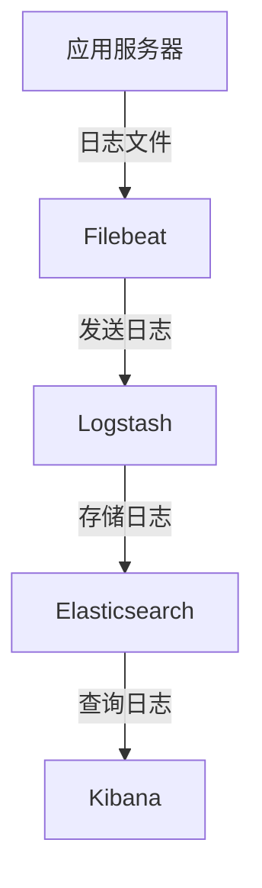

## 一、为什么需要日志？

日志的价值体现在多个层面：

| 维度                   | 说明                                                     |
| ---------------------- | -------------------------------------------------------- |
| **Debug 问题定位**     | 记录错误堆栈、请求参数、执行流程，快速复现和定位线上问题 |
| **用户行为分析**       | 记录用户的点击、访问路径等，为产品优化、推荐系统提供数据 |
| **监控与风控**         | 检测异常流量、攻击行为，配合告警系统及时响应             |
| **现场记录与根因分析** | 崩溃现场的快照，用于事后追溯根本原因                     |
| **产品价值**           | 通过日志分析用户习惯，驱动产品迭代                       |

日志不是简单的“打印信息”，而是一种基础设施。下面我们来看看在 Node.js 中如何正确实现日志。

---

## 二、Node.js 日志基础

### 2.1 console 的真相

在 Node.js 中，`console.log` 实际上是输出到标准输出流（stdout），而 `console.error` 输出到标准错误流（stderr）。

#### 2.1.1 玩转 Console API：不仅是 log

除了基础的打印，充分利用 `console` 的高级 API 能极大地提升调试效率：

- **ES6 变量简写**：利用对象属性简写，一次性打印变量名和值。
  ```javascript
  const user = 'Max';
  const status = 'active';
  console.log({ user, status }); // 输出: { user: 'Max', status: 'active' }
  ```

- **表格化显示 (`console.table`)**：将数组或对象以表格形式输出，查看复杂数据结构非常直观。
  ```javascript
  const users = [
    { id: 1, name: 'Alice', role: 'Admin' },
    { id: 2, name: 'Bob', role: 'User' }
  ];
  console.table(users);
  ```

- **堆栈追踪 (`console.trace`)**：打印当前的调用堆栈，帮助你理清函数的调用链路。
  ```javascript
  function deepTask() {
    console.trace('执行到此处');
  }
  deepTask();
  ```

- **条件断言 (`console.assert`)**：仅在表达式为 `false` 时打印错误信息，非常适合在代码中插入简单的校验。
  ```javascript
  const count = 5;
  console.assert(count > 10, 'Count 必须大于 10'); // 只有不符合时才打印
  ```

- **性能计时 (`console.time` / `console.timeEnd`)**：快速测量代码块的执行耗时。
  ```javascript
  console.time('fetch-data');
  // ... 执行某些异步操作
  console.timeEnd('fetch-data'); // 输出: fetch-data: 12.345ms
  ```

- **层级分组 (`console.group` / `console.groupEnd`)**：在控制台中创建可折叠（在支持的终端或浏览器中）的缩进分组。
  ```javascript
  console.group('用户注册流程');
  console.info('验证表单...');
  console.info('保存数据库...');
  console.groupEnd();
  ```

- **对象深度解析 (`console.dir`)**：相比 `log`，`dir` 可以通过选项控制显示深度和颜色，适合打印复杂的嵌套对象。
  ```javascript
  console.dir(bigObject, { depth: null, colors: true });
  ```

- **样式美化 (`%c`)**：
  > **注意**：`%c` 样式占位符在 **浏览器** 控制台中广泛支持 CSS 样式，但在 **原生 Node.js 终端** 中是不起作用的（它会直接输出 `%c` 字符串）。在 Node.js 中美化输出通常推荐使用 `chalk` 等库。

- **分级输出**：
  - `console.info()`：输出常规信息（通常与 `log` 行为一致）。
  - `console.warn()`：输出警告信息。
  - `console.error()`：输出错误信息。

#### 2.1.2 stdout 与 stderr 的底层差异

这两个流在底层实现上存在差异...

在命令行中，我们可以使用重定向符号将日志输出到文件：

```bash
# 将 stdout 写入 app.log
node app.js > app.log

# 将 stderr 写入 error.log
node app.js 2> error.log

# 将 stdout 和 stderr 合并写入 all.log
node app.js &> all.log
```

管道符 `|` 可以将一个命令的输出作为另一个命令的输入，常用于日志的实时处理。

### 2.2 写入文件的最佳实践

直接将日志写入文件时，新手容易犯的一个错误是使用 `fs.appendFile` 频繁写入：

```javascript
import fs from 'node:fs'
fs.appendFile('app.log', 'log message\n', (err) => {
	if (err) console.error('写入失败')
})
```

每次调用 `fs.appendFile` 都会打开文件、写入数据、关闭文件，频繁操作会导致文件句柄泄漏和性能问题。**文件句柄**是操作系统用于标识打开文件的抽象概念，每个打开的文件都会占用一个句柄。如果不及时释放，会达到系统限制，导致无法打开新文件。

更好的方式是使用 `fs.createWriteStream` 创建一个可写流，保持文件打开状态，利用缓冲区批量写入：

```javascript
import fs from 'fs'
const logStream = fs.createWriteStream('app.log', { flags: 'a' }) // 'a' 表示追加模式

// 写入日志
logStream.write('This is a log message.\n')

// 程序结束前关闭流
logStream.end()
```

使用流的方式不仅提高了写入性能，还能避免句柄泄漏。需要注意的是，`write` 方法返回一个布尔值表示数据是否已完全写入内部缓冲区，如果返回 `false` 应监听 `'drain'` 事件等待缓冲区清空。

### 2.3 inode 与文件句柄

在 Linux 系统中，每个文件都有一个唯一的 **inode**，它存储了文件的元数据（权限、大小、时间戳等）以及指向数据块的指针。当我们打开一个文件时，操作系统返回一个文件句柄，该句柄关联到文件的 inode。即使文件被移动或删除，只要句柄未关闭，程序仍可通过句柄读写原文件。

理解 inode 有助于我们设计日志切割策略，因为重命名日志文件时，只要流保持打开状态，写入仍会继续流向原 inode 对应的文件。

---

## 三、服务器应用日志实践

在典型的 BFF（Backend For Frontend）或 Node.js 服务中，我们需要记录多种类型的日志。

### 3.1 请求日志（Access Log）

每个客户端请求到达时，都应该记录一条请求日志，包含方法、URL、状态码、响应时间、客户端 IP 等信息。这有助于监控流量、排查性能问题。

```javascript
app.use((req, res, next) => {
	const start = Date.now()
	res.on('finish', () => {
		const duration = Date.now() - start
		logger.info({
			type: 'access',
			method: req.method,
			url: req.originalUrl,
			status: res.statusCode,
			duration,
			ip: req.ip,
			userAgent: req.get('User-Agent'),
		})
	})
	next()
})
```

### 3.2 外部服务调用日志

当 Node.js 应用作为 BFF 层调用后端服务时，需要记录请求参数、响应结果和耗时，以便定位依赖服务的问题。

```javascript
async function callBackend(serviceUrl, params) {
	const start = Date.now()
	try {
		const response = await axios.post(serviceUrl, params)
		logger.debug({
			type: 'backend_call',
			service: serviceUrl,
			params,
			response: response.data,
			duration: Date.now() - start,
		})
		return response.data
	} catch (err) {
		logger.error({
			type: 'backend_error',
			service: serviceUrl,
			params,
			error: err.message,
			stack: err.stack,
			duration: Date.now() - start,
		})
		throw err
	}
}
```

### 3.3 异常捕获与日志

使用 `try/catch` 捕获异常后，应立即记录错误日志，并包含足够的上下文信息（如用户 ID、请求路径等）。

```javascript
app.get('/api/user/:id', async (req, res) => {
	try {
		const user = await getUser(req.params.id)
		res.json(user)
	} catch (err) {
		logger.error({
			message: '获取用户失败',
			userId: req.params.id,
			error: err.message,
			stack: err.stack,
		})
		res.status(500).send('Internal Server Error')
	}
})
```

### 3.4 业务流程日志

在关键业务流程（如下单、支付）中，记录业务状态变化，便于后续追溯和数据统计。

```javascript
function createOrder(orderData) {
	logger.info({
		type: 'business',
		action: 'create_order',
		userId: orderData.userId,
		productId: orderData.productId,
		price: orderData.price,
	})
	// ... 业务逻辑
}
```

### 3.5 日志级别与格式

通常使用以下日志级别（从低到高）：

- `debug`：调试信息，开发时开启
- `info`：普通信息，如请求开始/结束
- `warn`：警告，不影响运行但值得关注
- `error`：错误，影响部分功能
- `fatal`：致命错误，进程可能退出

推荐使用 **结构化日志**（JSON 格式），方便后续被 Logstash 等工具解析。一条日志应包含：

```json
{
	"timestamp": "2025-03-10T10:00:00.000Z",
	"level": "info",
	"service": "user-service",
	"pid": 12345,
	"hostname": "server-01",
	"message": "User logged in",
	"userId": "1001",
	"ip": "192.168.1.100"
}
```

### 3.6 日志打印的原则

- **日志打印本身不应产生异常**：确保日志库的稳定性，避免因日志导致主流程中断。
- **日志打印不应产生副作用**：不要因为记录日志而修改业务状态。
- **禁止打印敏感信息**：如密码、身份证号、信用卡号等，需脱敏处理。

---

## 四、日志切割与管理

随着应用运行，日志文件会不断增长，必须进行切割。常见的切割策略有：

- **按时间切割**：每天生成一个新文件，如 `app-2025-03-10.log`。
- **按大小切割**：文件达到 100MB 时自动分割。

切割方式分为两种：

1. **create 方式**：重命名当前日志文件，创建一个同名新文件继续写入。日志库如 `winston` 的 `DailyRotateFile` 即采用此方式。
2. **copytruncate 方式**：复制当前日志文件，然后清空原文件。这种方式可以在不重启进程的情况下切割，但可能会丢失最后几行日志（清空瞬间写入的数据）。常用于 `logrotate` 工具。

在 Linux 中，可以使用 `logrotate` 配置切割规则：

```bash
/var/log/myapp/*.log {
    daily
    rotate 30
    compress
    delaycompress
    missingok
    notifempty
    create 0640 myapp myapp
    sharedscripts
    postrotate
        kill -USR2 `cat /var/run/myapp.pid`
    endscript
}
```

如果使用流写入日志，重命名后旧文件仍被进程持有，需要通知进程重新打开文件（如发送 `SIGUSR2` 信号）。

---

## 五、命令行日志的美化与交互

在开发或调试阶段，我们希望在终端中输出彩色的、易读的日志。以下工具可以帮助我们提升命令行体验：

- **chalk**：给文字添加颜色和样式。

  ```javascript
  import chalk from 'chalk'
  console.log(chalk.green('Success:'), 'Data saved')
  ```

- **progress**：显示进度条。

  ```javascript
  import ProgressBar from 'progress'
  const bar = new ProgressBar(':bar :percent', { total: 100 })
  const timer = setInterval(() => {
  	bar.tick()
  	if (bar.complete) clearInterval(timer)
  }, 100)
  ```

- **inquirer**：交互式命令行提示。

  ```javascript
  import inquirer from 'inquirer'
  inquirer
  	.prompt([{ type: 'input', name: 'username', message: 'Username:' }])
  	.then((answers) => console.log('Hello', answers.username))
  ```

- **blessed-contrib**：在终端中绘制仪表盘和图表。

  ```javascript
  import blessed from 'blessed'
  import contrib from 'blessed-contrib'
  const screen = blessed.screen()
  const line = contrib.line({ label: 'Requests' })
  screen.append(line)
  line.setData([{ x: ['00:00', '00:01'], y: [5, 10] }])
  screen.render()
  ```

- **commander.js**：构建复杂的命令行工具。

  ```javascript
  import { Command } from 'commander'
  const program = new Command()
  program.version('1.0.0').option('-d, --debug', 'enable debug').parse()
  ```

- **cfonts**：大号艺术字输出。
  ```javascript
  import cfonts from 'cfonts'
  cfonts.say('Hello!', { font: 'block', colors: ['red'] })
  ```

这些工具通常用于开发工具、脚手架或调试输出，不建议在生产环境中使用，因为它们会增加输出开销并干扰结构化日志。

---

## 六、ELK：日志收集与分析平台

当服务器数量增多，日志分散在各台机器上时，我们需要一个集中式的日志收集分析平台。**ELK** 是业界标准的解决方案，由三个组件组成：

- **Elasticsearch**：分布式搜索和分析引擎，存储日志并提供快速查询。
- **Logstash**：数据收集和处理管道，从各种来源采集日志，进行过滤、转换后发送到 Elasticsearch。
- **Kibana**：可视化工具，通过图表和仪表盘展示日志数据。

### 6.1 架构示意



- **Filebeat** 轻量级日志采集器，读取日志文件并发送给 Logstash 或直接发送给 Elasticsearch。
- **Logstash** 进行数据清洗，如解析 JSON、添加字段、过滤敏感信息。
- **Elasticsearch** 存储数据，并建立索引以便快速检索。
- **Kibana** 提供 Web 界面，支持搜索、聚合、创建仪表盘。

### 6.2 快速部署 ELK

可以使用 Docker Compose 一键启动 ELK 环境，社区提供了 [docker-elk](https://github.com/deviantony/docker-elk) 项目，非常方便：

```bash
git clone https://github.com/deviantony/docker-elk.git
cd docker-elk
docker-compose up -d
```

访问 `http://localhost:5601` 即可进入 Kibana。

### 6.3 Node.js 应用集成

在现代 Node.js 应用中，我们通常选择 **Pino** 或 **Winston**。

- **Pino**：2026 年的性能标杆，开销极低，原生支持结构化 JSON，是高并发场景的首选。
- **Winston**：功能最丰富，生态最成熟，适合需要多传输通道（Transports）的复杂应用。

```javascript
// 使用 Pino 记录高性能日志
import pino from 'pino'
const logger = pino({
  level: 'info',
  base: { service: 'user-service' },
  timestamp: pino.stdTimeFunctions.isoTime
})

logger.info({ userId: '1001' }, 'User logged in')
```

对于 Winston：

```javascript
import winston from 'winston'
...

Logstash 配置示例（`logstash.conf`）：

```ruby
input {
  beats {
    port => 5044
  }
}
filter {
  json {
    source => "message"
  }
}
output {
  elasticsearch {
    hosts => ["elasticsearch:9200"]
    index => "myapp-%{+YYYY.MM.dd}"
  }
}
```

这样，我们就可以在 Kibana 中搜索和分析日志了。

---

## 七、Sentry：错误监控平台

日志虽然记录了错误，但往往是被动的：开发者需要主动查看日志才能发现问题。而 **Sentry** 是一款主动的错误监控平台，能够实时捕获应用中的异常，并聚合、告警、提供丰富的上下文信息。

### 7.1 Sentry 的核心功能

- **错误捕获**：自动捕获未处理的异常和 Promise rejection。
- **上下文信息**：记录用户 IP、浏览器、操作系统、请求参数等。
- **错误聚合**：将相同错误合并，避免噪音。
- **性能监控**：跟踪请求耗时和慢查询。
- **发布跟踪**：关联错误与代码版本，快速定位引入问题的版本。

### 7.2 Node.js 集成

安装 `@sentry/node`：

```bash
pnpm add @sentry/node
```

在应用入口初始化：

```javascript
import * as Sentry from '@sentry/node'
Sentry.init({
	dsn: 'https://your-dsn@sentry.io/project-id',
	environment: process.env.NODE_ENV,
	tracesSampleRate: 1.0, // 性能监控采样率
})

// 手动捕获错误
try {
	riskyOperation()
} catch (err) {
	Sentry.captureException(err)
}
```

对于 Express 应用，可以使用中间件自动捕获请求错误：

```javascript
import express from 'express'
const app = express()

Sentry.setupExpressErrorHandler(app)

// 所有错误都会自动上报到 Sentry
```

### 7.3 自托管 Sentry

Sentry 提供云服务（sentry.io），也支持自托管。自托管可以使用 [self-hosted](https://github.com/getsentry/self-hosted) 仓库快速部署：

```bash
git clone https://github.com/getsentry/self-hosted.git
cd self-hosted
./install.sh
docker-compose up -d
```

---

## 八、日志的局限性

虽然日志和 Sentry 是非常有用的工具，但它们并非万能：

- **占用大量存储空间**：特别是全量日志，需要定期清理和归档。
- **查询不够灵活**：日志系统对结构化数据的查询能力强，但对于跨服务调用链追踪，仍需 APM（应用性能监控）工具如 SkyWalking、Jaeger。
- **无法捕获所有问题**：如内存泄漏、CPU 飙升，可能需要结合指标监控（如 Prometheus）才能发现。
- **上下文缺失**：日志往往只记录单个服务的信息，分布式追踪需要额外的 Trace ID 串联。

因此，一套完善的观测体系通常包括：

- **日志（Logs）**：记录离散事件
- **指标（Metrics）**：聚合的数值数据，如 QPS、延迟、错误率
- **追踪（Traces）**：记录请求在分布式系统中的完整路径

三者结合，才能全面掌握系统状态。

---

## 九、总结

本文从 Node.js 日志的基础讲起，涵盖了写入方式、结构化格式、日志切割、命令行美化，再到 ELK 和 Sentry 的集成，最后讨论了日志的局限性。希望你能根据这些最佳实践，为自己的 Node.js 应用构建一套高效、可靠的日志体系。日志不仅是排错的工具，更是洞察系统运行状态的窗户。合理利用日志，你的应用将更加健壮，问题定位也将事半功倍。
