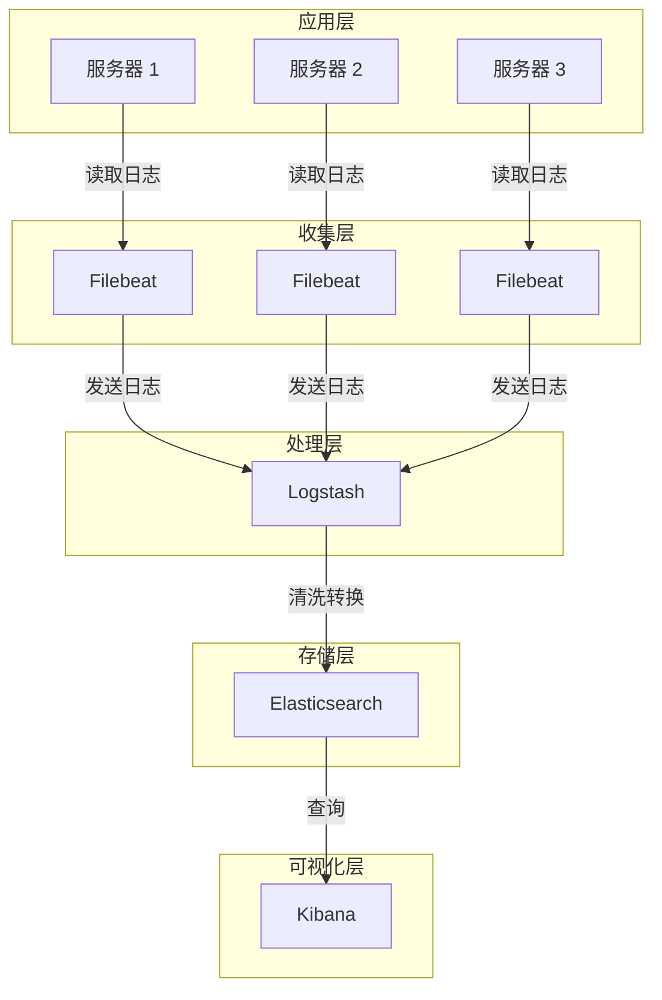
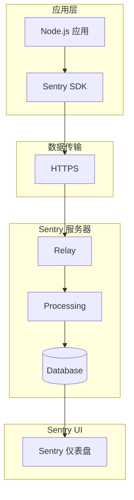
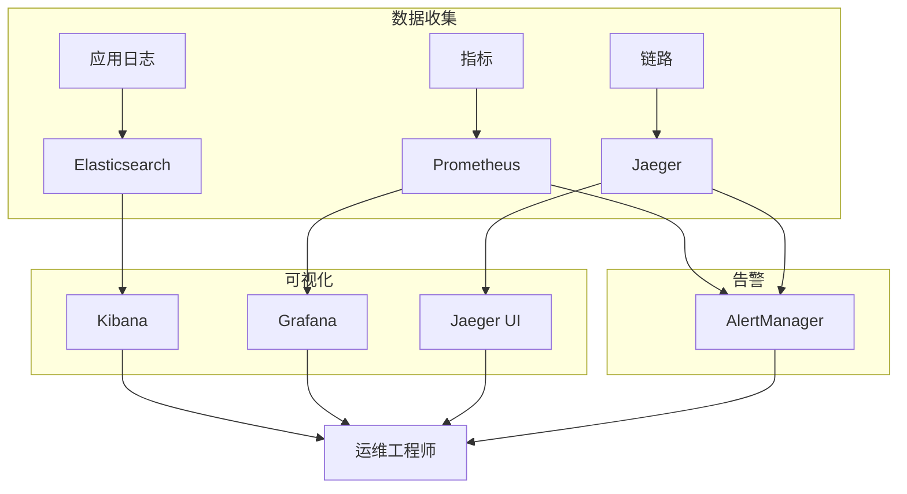

> 写给想搞清楚"日志"是什么、怎么用好的开发者们

你有没有遇到过这种情况：网站出问题了，翻遍代码也找不到哪里出错？或者用户跟你说"我点了按钮没反应"，但你完全不知道发生了什么？或者凌晨三点被报警叫醒，面对满屏的日志两眼一抹黑，完全不知道从哪里开始排查？

这篇文章就用大白话聊聊这个看似简单、实则深奥的话题——日志。不管你是刚学 Node.js 的新手，还是想系统复习一下的老手，都能在这里找到点有用的东西。

---

## 1. 为什么要用日志？

### 1.1 先从一个故事说起：日志是什么？

想象一下，你开了一家 24 小时便利店，在店里装了监控摄像头。这些摄像头录下来的录像，就相当于"日志"——忠实地记录着店里发生的一切。

平时没人看这些录像，但出事了就派上用场了：

- 有人投诉说找零钱找少了 → 调录像看看
- 半夜有人闯进来 → 调录像看看
- 想知道哪个时段客人最多 → 分析录像

日志就是你的应用程序的"录像"。它记录着程序运行期间发生的一切，让我们事后可以"回放录像"。

### 1.2 日志的价值

日志的价值体现在多个维度：

| 维度             | 说明                                                     | 举例                                         |
| ---------------- | -------------------------------------------------------- | -------------------------------------------- |
| **排查问题**     | 记录错误堆栈、请求参数、执行流程，快速复现和定位线上问题 | 用户下单失败了，日志显示库存服务超时了       |
| **用户行为分析** | 记录用户点击、访问路径，为产品优化和推荐系统提供数据     | 发现用户普遍在支付页面停留很久，可能需要优化 |
| **监控风控**     | 检测异常流量、攻击行为，配合报警系统快速响应             | 某个 IP 每秒发 1000 个请求，可能是被攻击了   |
| **录屏与复盘**   | 崩溃现场的快照，用于事后追溯根因                         | 服务凌晨三点崩了，日志能还原当时发生了什么   |
| **产品价值**     | 通过日志分析用户习惯，推动产品迭代                       | 发现 80% 用户只用搜索功能，首页可以简化      |

### 1.3 日志不是"打印信息"那么简单

很多新手觉得日志就是 `console.log("hello")`，这就大错特错了。好的日志应该是这样的：

- **结构化**：不是一堆字符串，而是可以解析的 JSON
- **有级别**：debug、info、warn、error 泾渭分明
- **可关联**：用请求 ID 把同一个请求的日志串起来
- **脱敏处理**：密码、身份证号必须打码

> **小知识**：日志是你的应用程序的基础设施，就像水、电、网络一样——不是"有了更好"，而是"必须有"。

---

## 2. Node.js 日志基础

### 2.1 console 的真相

在 Node.js 里，`console.log` 实际上输出到标准输出流（stdout），而 `console.error` 输出到标准错误流（stderr）。

搞清楚这个区别很重要：

```bash
# 分别重定向 stdout 和 stderr
node app.js > output.log 2> error.log

# 两者合并重定向
node app.js &> all.log

# 把 stdout 用管道传给另一个命令
node app.js | grep "error"
```

### 2.2 console API 不止是 log

很多人只知道 `console.log`，但 console 其实有很多好用的 API：

#### 2.2.1 ES6 变量简写

用对象属性简写，同时打印变量名和值：

```javascript
const user = '张三'
const status = '活跃'

// 普通写法：你能分清哪个是变量名哪个是值吗？
console.log('user:', user, 'status:', status)

// 简洁写法：一目了然
console.log({ user, status })
// 输出: { user: '张三', status: '活跃' }
```

#### 2.2.2 表格展示

看复杂数据结构特别有用：

```javascript
const users = [
  { id: 1, name: '小明', role: '管理员' },
  { id: 2, name: '小红', role: '普通用户' },
  { id: 3, name: '小刚', role: '普通用户' },
]

// 普通打印乱成一团
console.log(users)

// 表格打印清晰多了
console.table(users)
```

终端显示：

```
┌─────────┬──────────┬─────────┐
│ (index) │   name   │  role   │
├─────────┼──────────┼─────────┤
│    0    │  '小明' │ '管理员'│
│    1    │  '小红' │ '普通用户'│
│    2    │  '小刚' │ '普通用户'│
└─────────┴──────────┴─────────┘
```

#### 2.2.3 堆栈追踪

打印当前调用栈，了解函数调用链路：

```javascript
function 第三层函数() {
  console.trace('执行到这里了')
}

function 第二层函数() {
  第三层函数()
}

function 第一层函数() {
  第二层函数()
}

第一层函数()
```

输出：

```
Trace: 执行到这里了
    at 第三层函数 (/app.js:2:9)
    at 第二层函数 (/app.js:6:5)
    at 第一层函数 (/app.js:10:5)
    at Object.<anonymous> (/app.js:13:1)
```

#### 2.2.4 条件断言

只在条件为 false 时打印，适合简单校验：

```javascript
const count = 5

// count > 10 是 false，所以会打印
console.assert(count > 10, '数量必须大于 10')
// Assertion failed: 数量必须大于 10

// 这个不会打印，因为条件为 true
console.assert(count > 1, '这行不会打印')
```

#### 2.2.5 性能计时

测量代码执行时间：

```javascript
console.time('获取数据')

// 模拟异步操作
setTimeout(() => {
  console.timeEnd('获取数据')
  // 输出: 获取数据: 2003.123ms
}, 2000)

// 还可以嵌套使用
console.time('总耗时')
console.time('步骤一')
// ... 操作 1
console.timeEnd('步骤一')
console.time('步骤二')
// ... 操作 2
console.timeEnd('步骤二')
console.timeEnd('总耗时')
```

#### 2.2.6 分层分组

创建可折叠的日志分组：

```javascript
console.group('用户注册流程')
console.info('步骤 1: 校验表单...')
console.info('步骤 2: 检查用户名是否存在')

console.group('数据库操作')
console.log('查询用户表...')
console.log('用户名已存在，返回错误')
console.groupEnd()

console.info('步骤 3: 创建用户')
console.groupEnd()
```

终端会显示缩进的层级结构，阅读起来很方便。

#### 2.2.7 对象深度查看

打印复杂嵌套对象时控制显示深度：

```javascript
const bigObject = {
  level1: {
    level2: {
      level3: {
        value: '深处的值',
      },
    },
  },
}

// 默认可能只显示几层
console.log(bigObject)

// 指定 depth: null = 显示全部
console.dir(bigObject, { depth: null, colors: true })
```

#### 2.2.8 样式化输出

在浏览器控制台使用 CSS 样式：

```javascript
// 注意：这在浏览器控制台有效，在 Node.js 终端里无效
console.log('%c成功!', 'color: green; font-weight: bold; font-size: 20px;')
```

> **小提示**：在 Node.js 里美化输出，建议用 `chalk` 这种库，支持终端里的颜色和样式。

#### 2.2.9 分级输出

根据严重程度输出到不同流：

| 方法              | 级别  | 说明                    |
| ----------------- | ----- | ----------------------- |
| `console.log()`   | info  | 一般信息                |
| `console.info()`  | info  | 信息（和 log 行为相同） |
| `console.warn()`  | warn  | 警告，输出到 stderr     |
| `console.error()` | error | 错误，输出到 stderr     |

### 2.3 文件写入的最佳实践

#### 2.3.1 为什么不能用 fs.appendFile？

很多新手这样写日志：

```javascript
import fs from 'node:fs'

// 千万不要这样写！
function logMessage(message) {
  fs.appendFile('app.log', message + '\n', (err) => {
    if (err) console.error('写入失败')
  })
}

// 业务代码反复调用
logMessage('用户登录了')
logMessage('用户下单了')
logMessage('支付成功了')
// ... 被调用了 1000 次
```

问题在于：每次 `fs.appendFile` 调用都要：

1. 打开文件
2. 写入数据
3. 关闭文件

这就造成了"频繁 IO"，会导致：

- **文件句柄泄漏**：操作系统对打开的文件数量有限制
- **性能问题**：每次调用都要完整地开-写-关一遍

#### 2.3.2 用流写入：正确的方式

正确做法是用可写流，保持文件打开，通过缓冲区批量写入：

```javascript
import fs from 'fs'

// 创建追加模式的写入流
const logStream = fs.createWriteStream('app.log', { flags: 'a' })

// 写入日志（自动缓冲）
logStream.write('用户登录了\n')
logStream.write('用户下单了\n')
logStream.write('支付成功了\n')

// 程序退出前关闭流
process.on('SIGINT', () => {
  logStream.end()
  process.exit(0)
})
```

**流为什么更好？**

1. 文件只打开一次，持续写入
2. 操作系统自动缓冲，减少 IO 次数
3. 不会泄漏文件句柄

**重要知识点**：`write()` 返回布尔值，表示数据是否完全写入内部缓冲区。如果返回 `false`，需要等待 'drain' 事件：

```javascript
function safeWrite(stream, message) {
  if (!stream.write(message)) {
    // 返回 false 说明缓冲区满了，需要等待 drain
    stream.once('drain', () => {
      stream.write(message)
    })
  }
}
```

### 2.4 inode 和文件句柄

#### 2.4.1 什么是 inode？

在 Linux 系统中，每个文件都有唯一的 **inode**（索引节点）。inode 存储的是：

- 文件元数据（权限、大小、时间戳）
- 指向数据块的指针

用 `ls -i` 查看文件的 inode：

```bash
ls -i app.log
# 输出: 1234567 app.log
# 1234567 就是 inode 号
```

#### 2.4.2 inode 和日志的关系

当你"删除"一个正在被进程使用的文件时：

```bash
# 进程正在往 app.log 写东西
rm app.log  # 文件被"删除"了
```

文件变得不可见了，但 inode 仍然存在，进程仍然可以往里面写。只有当所有进程都关闭文件句柄后，磁盘空间才会被释放。

#### 2.4.3 理解 inode 有助于日志切割

日志切割时会这样：

1. 把 `app.log` 重命名为 `app-2025-03-10.log`
2. 创建新的 `app.log` 继续写入

因为 inode 是不变的，重命名后进程仍然往原来的 inode 写。这就解释了为什么日志切割后可能会"丢失"——它们正被写到新文件名对应的文件里。

---

## 3. 服务器应用日志实践

### 3.1 请求日志（访问日志）

每个 HTTP 请求都应该记录一条日志，这是最基本的要求。

```javascript
import express from 'express'

const app = express()

// 请求日志中间件
app.use((req, res, next) => {
  const start = Date.now()

  // 请求结束时的回调
  res.on('finish', () => {
    const duration = Date.now() - start

    console.log(
      JSON.stringify({
        timestamp: new Date().toISOString(),
        type: 'access',
        method: req.method,
        url: req.originalUrl,
        status: res.statusCode,
        duration, // 响应时间，毫秒为单位
        ip: req.ip,
        userAgent: req.get('User-Agent'),
        userId: req.user?.id, // 如果实现了用户认证
        traceId: req.headers['x-trace-id'], // 分布式追踪 ID
      }),
    )
  })

  next()
})
```

#### 3.1.1 请求日志应该包含什么字段？

| 字段      | 说明              | 示例                     |
| --------- | ----------------- | ------------------------ |
| timestamp | 请求时间          | 2025-03-10T10:00:00.000Z |
| method    | HTTP 方法         | GET, POST, PUT, DELETE   |
| url       | 请求路径          | /api/users/123           |
| status    | 响应状态码        | 200, 404, 500            |
| duration  | 响应时间（毫秒）  | 125                      |
| ip        | 客户端 IP         | 192.168.1.100            |
| userId    | 用户 ID（已认证） | user_abc123              |
| traceId   | 分布式追踪 ID     | trace_xyz789             |

### 3.2 外部服务调用日志

当 Node.js 作为 BFF 层调用后端服务时，要记录完整的调用信息：

```javascript
async function callBackend(serviceUrl, params, options = {}) {
  const start = Date.now()
  const requestId = crypto.randomUUID()

  try {
    const response = await axios.post(serviceUrl, params, {
      headers: {
        'X-Request-ID': requestId,
        ...options.headers,
      },
      timeout: options.timeout || 5000,
    })

    const duration = Date.now() - start

    console.log(
      JSON.stringify({
        type: 'backend_call',
        requestId,
        service: serviceUrl,
        params: params, // 注意：生产环境必须脱敏！
        responseStatus: response.status,
        duration,
        timestamp: new Date().toISOString(),
      }),
    )

    return response.data
  } catch (err) {
    const duration = Date.now() - start

    console.error(
      JSON.stringify({
        type: 'backend_error',
        requestId,
        service: serviceUrl,
        params: params,
        error: err.message,
        errorCode: err.code,
        stack: err.stack,
        duration,
        timestamp: new Date().toISOString(),
      }),
    )

    throw err
  }
}
```

#### 3.2.1 调用日志的价值

- 排查某个后端服务的响应为什么变慢了
- 分析服务之间的依赖关系
- 发现异常调用模式（比如循环调用）

### 3.3 异常处理与日志

#### 3.3.1 try/catch 捕获同步代码

```javascript
app.get('/api/user/:id', async (req, res) => {
  try {
    const user = await getUser(req.params.id)

    if (!user) {
      return res.status(404).json({ error: '用户不存在' })
    }

    res.json(user)
  } catch (err) {
    // 必须记录完整上下文！
    console.error(
      JSON.stringify({
        type: 'error',
        route: '/api/user/:id',
        params: req.params,
        query: req.query,
        userId: req.user?.id,
        error: err.message,
        stack: err.stack,
        timestamp: new Date().toISOString(),
      }),
    )

    res.status(500).json({ error: '服务器内部错误' })
  }
})
```

#### 3.3.2 异步错误的特殊处理

Promise.reject 不会被 try/catch 捕获：

```javascript
// 这是错误的写法！
try {
  Promise.reject(new Error('异步错误'))
} catch (err) {
  // 这里永远不会执行
}

// 正确写法
async function 错误示例() {
  try {
    await Promise.reject(new Error('异步错误'))
  } catch (err) {
    console.error(err)
  }
}

// 或者用 .catch()
Promise.reject(new Error('异步错误')).catch((err) => console.error(err))
```

#### 3.3.3 全局未捕获异常处理

为进程设置最后一道防线：

```javascript
// 捕获未处理的 Promise 拒绝
process.on('unhandledRejection', (reason, promise) => {
  console.error(
    JSON.stringify({
      type: 'unhandled_rejection',
      reason: reason instanceof Error ? reason.message : reason,
      stack: reason instanceof Error ? reason.stack : undefined,
      timestamp: new Date().toISOString(),
    }),
  )
})

// 捕获未处理的异常
process.on('uncaughtException', (err) => {
  console.error(
    JSON.stringify({
      type: 'uncaught_exception',
      error: err.message,
      stack: err.stack,
      timestamp: new Date().toISOString(),
    }),
  )

  // 对于 uncaught exception，通常还是需要优雅退出
  process.exit(1)
})
```

> **小提示**：捕获到 unhandled exception 后，Node.js 官方还是建议退出进程，因为状态可能已经不一致了。

### 3.4 业务过程日志

在关键业务节点记录状态变化：

```javascript
// 创建订单
async function createOrder(orderData) {
  const orderId = generateOrderId()

  console.log(
    JSON.stringify({
      type: 'business',
      action: 'create_order_start',
      orderId,
      userId: orderData.userId,
      productId: orderData.productId,
      quantity: orderData.quantity,
      totalPrice: orderData.totalPrice,
      timestamp: new Date().toISOString(),
    }),
  )

  try {
    // 检查库存
    const stockAvailable = await checkStock(orderData.productId, orderData.quantity)

    if (!stockAvailable) {
      console.log(
        JSON.stringify({
          type: 'business',
          action: 'create_order_failed',
          orderId,
          reason: 'stock_insufficient',
          timestamp: new Date().toISOString(),
        }),
      )
      throw new Error('库存不足')
    }

    // 扣减库存
    await reduceStock(orderData.productId, orderData.quantity)

    // 创建订单
    const order = await saveOrder(orderId, orderData)

    console.log(
      JSON.stringify({
        type: 'business',
        action: 'create_order_success',
        orderId,
        userId: orderData.userId,
        totalPrice: orderData.totalPrice,
        timestamp: new Date().toISOString(),
      }),
    )

    return order
  } catch (err) {
    console.error(
      JSON.stringify({
        type: 'business',
        action: 'create_order_error',
        orderId,
        error: err.message,
        timestamp: new Date().toISOString(),
      }),
    )
    throw err
  }
}
```

#### 3.4.1 业务日志要点

- **完整生命周期**：记录开始、成功、失败
- **ID 关联**：每个订单有唯一 ID，方便搜索
- **记录关键参数**：商品、数量、价格
- **错误要有原因**：不是"出错了"，而是"什么错了"

### 3.5 日志级别和格式

#### 3.5.1 日志级别

从低到高：

| 级别  | 英文  | 说明               | 使用场景               |
| ----- | ----- | ------------------ | ---------------------- |
| trace | TRACE | 最详细，通常不开启 | 开发时追踪代码流程     |
| debug | DEBUG | 调试信息           | 开发时排查问题         |
| info  | INFO  | 一般信息           | 请求开始结束、业务流程 |
| warn  | WARN  | 警告               | 资源使用率高、触发降级 |
| error | ERROR | 错误               | 请求失败、捕获的异常   |
| fatal | FATAL | 致命错误           | 进程即将退出           |

#### 3.5.2 结构化日志

**必须使用 JSON 格式**，方便解析和分析：

```json
{
  "timestamp": "2025-03-10T10:00:00.000Z",
  "level": "info",
  "service": "user-service",
  "pid": 12345,
  "hostname": "server-01",
  "message": "用户登录了",
  "userId": "user_1001",
  "ip": "192.168.1.100",
  "requestId": "req_abc123"
}
```

**为什么不用字符串日志？**

```
[2025-03-10 10:00:00] INFO: 用户登录了, userId=user_1001
```

字符串日志的问题：

- 搜索 "user_1001" 可能匹配到其他不相关的内容
- 无法按字段筛选
- 难以解析

### 3.6 日志原则

#### 3.6.1 日志不能抛异常

```javascript
// 错误写法
function log(message) {
  if (!message) {
    throw new Error('消息不能为空') // 日志函数抛异常？
  }
  console.log(message)
}

// 正确写法
function log(message) {
  try {
    console.log(message)
  } catch (err) {
    // 日志失败了，但业务必须继续
    // 可以尝试写到备用位置
  }
}
```

#### 3.6.2 日志不能有副作用

```javascript
// 错误写法
function logUser(user) {
  console.log(user)
  user.lastLogged = new Date() // 副作用！
  db.save(user) // 因为打印日志改了数据
}

// 正确写法
function logUser(user) {
  console.log({
    id: user.id,
    name: user.name,
    // 只打印需要的信息，不要修改原对象
  })
}
```

#### 3.6.3 敏感信息绝对不能打印

这些必须脱敏：

| 信息类型 | 脱敏方式         | 示例            |
| -------- | ---------------- | --------------- |
| 密码     | 删除或打印 `***` | password: `***` |
| 手机号   | 显示后 4 位      | 138\*\*\*\*5678 |
| 身份证号 | 显示前 3 后 4    | 110\*\*\*5678   |
| 银行卡号 | 显示后 4 位      | \*\*\*\*1234    |
| Token    | 显示前 5 后 5    | eyJhb...4r3s5   |

```javascript
function sanitizeObject(obj) {
  const sensitiveFields = ['password', 'token', 'secret', 'apiKey']
  const sanitized = { ...obj }

  for (const field of sensitiveFields) {
    if (sanitized[field]) {
      if (sanitized[field].length > 10) {
        sanitized[field] = sanitized[field].slice(0, 5) + '...' + sanitized[field].slice(-5)
      } else {
        sanitized[field] = '***'
      }
    }
  }

  return sanitized
}
```

---

## 4. 日志切割与管理

### 4.1 为什么需要日志切割

日志文件会无限增长：

```
app.log: 10MB
app.log: 100MB
app.log: 1GB
app.log: 10GB  // 磁盘满了！
```

所以必须定期切割日志。

### 4.2 切割策略

#### 4.2.1 按时间切割

每天一个新文件：

```
app-2025-03-08.log
app-2025-03-09.log
app-2025-03-10.log
app.log  <-- 正在写入
```

适用场景：日志量稳定的应用

#### 4.2.2 按大小切割

达到 100MB 时创建新文件：

```
app-001.log  (100MB)
app-002.log  (100MB)
app-003.log  (80MB)   <-- 正在写入
```

适用场景：日志量变化大的应用

### 4.3 切割方式

#### 4.3.1 create 方式（重命名）

日志库（如 winston 的 DailyRotateFile）的工作方式：

1. 把 `app.log` 重命名为 `app-2025-03-10.log`
2. 创建新的 `app.log` 继续写入

**问题**：重命名后进程仍然持有原来的 inode，新文件收不到内容。

**解决方案**：通知进程重新打开文件（发送 SIGUSR2 信号）。

#### 4.3.2 copytruncate 方式（拷贝清空）

logrotate 工具的工作方式：

1. 把 `app.log` 内容拷贝到 `app-2025-03-10.log`
2. 清空原来的 `app.log`

**优点**：不需要重启进程
**缺点**：清空的瞬间正在写入的数据可能丢失

### 4.4 logrotate 配置

Linux 用 logrotate 来管理日志：

```bash
# /etc/logrotate.d/myapp

/var/log/myapp/*.log {
    daily              # 每天切割一次
    rotate 30         # 保留 30 天
    compress          # 压缩旧日志
    delaycompress      # 昨天的不要压缩（方便调试）
    missingok          # 日志不存在也不报错
    notifempty         # 空日志不切割
    create 0640 myapp myapp  # 新文件的权限
    sharedscripts       # postrotate 脚本只运行一次

    postrotate
        # 通知进程重新打开日志文件
        kill -USR2 $(cat /var/run/myapp.pid)
    endscript
}
```

### 4.5 日志清理策略

| 策略       | 说明                   | 示例            |
| ---------- | ---------------------- | --------------- |
| 按时间保留 | 只保留最近 N 天的日志  | 保留 30 天      |
| 按大小保留 | 磁盘满时自动删除最旧的 | 保留最后 10GB   |
| 按数量保留 | 只保留最后 N 个文件    | 保留 100 个文件 |

---

## 5. 命令行日志美化与交互

开发和调试时，我们希望在终端里看到彩色、易读的日志。

### 5.1 chalk：给文字上色

```javascript
import chalk from 'chalk'

// 各种颜色
console.log(chalk.red('错误信息'))
console.log(chalk.green('成功信息'))
console.log(chalk.yellow('警告信息'))
console.log(chalk.blue('提示信息'))
console.log(chalk.cyan('青色'))
console.log(chalk.magenta('紫色'))

// 组合样式
console.log(chalk.bold.red('粗体红色'))
console.log(chalk.bgRed.white('红底白字'))
console.log(chalk.underline('带下划线'))

// 模板字符串
console.log(chalk`{red 错误:} {green 成功:} {blue 提示:}`)
```

### 5.2 progress：进度条

```javascript
import ProgressBar from 'progress'

const bar = new ProgressBar('下载中: [:bar] :percent 剩余: :etas', {
  total: 100,
  width: 40,
})

const timer = setInterval(() => {
  bar.tick()

  if (bar.complete) {
    clearInterval(timer)
    console.log('\n下载完成！')
  }
}, 100)
```

终端显示：

```
下载中: [████████████████████] 80% 2.0s
```

### 5.3 inquirer：交互式命令行

```javascript
import inquirer from 'inquirer'

async function askQuestions() {
  const answers = await inquirer.prompt([
    {
      type: 'input',
      name: 'name',
      message: '你叫什么名字？',
    },
    {
      type: 'list',
      name: 'color',
      message: '你最喜欢的颜色是什么？',
      choices: ['红色', '绿色', '蓝色'],
    },
    {
      type: 'confirm',
      name: 'confirm',
      message: '确定要继续吗？',
    },
  ])

  console.log('你的回答:', answers)
}

askQuestions()
```

### 5.4 blessed-contrib：终端仪表盘

```javascript
import blessed from 'blessed'
import contrib from 'blessed-contrib'

const screen = blessed.screen()

// 创建折线图
const line = contrib.line({
  label: '请求统计',
  showLegend: true,
  legend: { width: 20 },
})

screen.append(line)

// 更新数据
setInterval(() => {
  const data = Math.random() * 100
  line.setData([{ x: ['00:00', '00:01', '00:02'], y: [10, 20, data] }])
  screen.render()
}, 1000)
```

### 5.5 commander.js：命令行工具

```javascript
import { Command } from 'commander'

const program = new Command()

program.name('myapp').description('我的命令行工具').version('1.0.0')

program
  .command('serve')
  .description('启动服务器')
  .option('-p, --port <number>', '端口号', 3000)
  .option('-d, --debug', '开启调试模式')
  .action((options) => {
    console.log('服务器启动在端口:', options.port)
    console.log('调试模式:', options.debug)
  })

program
  .command('init')
  .description('初始化项目')
  .action(() => {
    console.log('初始化中...')
  })

program.parse()
```

用法：

```bash
myapp serve -p 8080 -d
myapp init
myapp --version
```

### 5.6 cfonts：ASCII 艺术字

```javascript
import cfonts from 'cfonts'

cfonts.say('Hello World!', {
  font: 'block', // 字体: block, huge, simple
  colors: ['blue', 'yellow'], // 渐变色
  background: 'black', // 背景色
  align: 'center', // 对齐方式
  letterSpacing: 1,
})
```

---

## 6. ELK：日志收集分析平台

### 6.1 为什么要用 ELK

当你有多台服务器时，日志散落在各个机器上。总不能一台台登录去看吧？

```
服务器 1: app.log
服务器 2: app.log
服务器 3: app.log
...
服务器 100: app.log
```

怎么搜？100 台机器一台台登录？

ELK 解决了这个问题——一个**日志集中管理平台**。

### 6.2 ELK 是什么

ELK 是三款开源软件的组合：

| 软件          | 作用           | 比喻                  |
| ------------- | -------------- | --------------------- |
| Elasticsearch | 存储和搜索日志 | 图书馆（存储 + 检索） |
| Logstash      | 收集和处理日志 | 图书馆管理员（整理）  |
| Kibana        | 可视化数据     | 图书馆的检索系统      |

### 6.3 ELK 架构



#### 6.3.1 Filebeat：轻量级收集器

安装在每台服务器上，轻量、资源占用低：

- 监控日志文件变化
- 实时读取新增内容
- 发送给 Logstash 或 Elasticsearch

#### 6.3.2 Logstash：数据处理管道

强大的数据处理能力：

- 解析 JSON 格式日志
- 过滤敏感信息
- 添加字段（服务器名、时间戳）
- 转换格式

#### 6.3.3 Elasticsearch：分布式搜索引擎

存储和检索：

- 分布式存储，容量大
- 全文搜索能力强
- 支持复杂查询

#### 6.3.4 Kibana：可视化界面

- 搜索日志
- 创建图表
- 构建仪表盘
- 设置告警

### 6.4 快速部署 ELK

用 Docker Compose 一键启动：

```bash
# 克隆项目
git clone https://github.com/deviantony/docker-elk.git
cd docker-elk

# 启动
docker-compose up -d

# 访问 Kibana
# http://localhost:5601
```

### 6.5 Node.js 应用集成

#### 6.5.1 Pino：高性能日志库

Pino 是最快的 Node.js 日志库，比 winston 快 10 倍：

```javascript
import pino from 'pino'

const logger = pino({
  level: 'info', // 只记录 info 及以上
  base: {
    service: 'user-service', // 添加公共字段
    pid: process.pid,
  },
  timestamp: pino.stdTimeFunctions.isoTime, // ISO 格式时间
})

// 使用
logger.info({ userId: '1001' }, '用户登录了')
logger.error({ err }, '请求失败')
logger.debug({ query }, '数据库查询')
```

**Pino 为什么这么快？**

- 异步写入，不阻塞
- 最小化序列化（比 winston 少很多）
- 默认输出 JSON，不用额外配置

#### 6.5.2 Winston：功能丰富的日志库

功能更多，生态更成熟：

```javascript
import winston from 'winston'
import { ElasticsearchTransport } from 'winston-elasticsearch'

// 创建日志器
const logger = winston.createLogger({
  level: 'info',
  format: winston.format.combine(
    winston.format.timestamp(),
    winston.format.json(), // JSON 格式
  ),
  defaultMeta: { service: 'user-service' },
  transports: [
    // 文件输出
    new winston.transports.File({
      filename: 'logs/error.log',
      level: 'error',
    }),
    new winston.transports.File({
      filename: 'logs/combined.log',
    }),

    // 控制台输出（开发环境彩色）
    new winston.transports.Console({
      format: winston.format.combine(winston.format.colorize(), winston.format.simple()),
    }),

    // Elasticsearch 输出
    new ElasticsearchTransport({
      level: 'info',
      clientOpts: {
        node: 'http://elasticsearch:9200',
      },
      indexPrefix: 'myapp',
    }),
  ],
})
```

### 6.6 Logstash 配置

```ruby
# logstash.conf

input {
  # 接收 Filebeat 的数据
  beats {
    port => 5044
  }
}

filter {
  # 解析 JSON
  json {
    source => "message"
    target => "parsed"
  }

  # 添加时间戳
  date {
    match => ["timestamp", "ISO8601"]
    target => "@timestamp"
  }

  # 过滤敏感信息
  mutate {
    gsub => [
      "password", "\S", "***",
      "token", "\S", "***"
    ]
  }

  # 只保留需要的字段
  if [type] == "access" {
    mutate {
      select => ["@timestamp", "method", "url", "status", "duration"]
    }
  }
}

output {
  # 输出到 Elasticsearch
  elasticsearch {
    hosts => ["elasticsearch:9200"]
    index => "myapp-%{+YYYY.MM.dd}"
  }

  # 开发环境输出到控制台
  stdout {
    codec => rubydebug
  }
}
```

### 6.7 Kibana 使用

#### 6.7.1 创建索引模式

1. 打开 Kibana → Management → Index Patterns
2. 输入 `myapp-*`
3. 选择时间字段 `@timestamp`

#### 6.7.2 搜索日志

```
# 搜索所有错误
level: error

# 搜索指定用户的日志
userId: user_1001

# 搜索指定时间范围
@timestamp: [2025-03-10 TO 2025-03-11]

# 组合搜索
level: error AND userId: user_1001
```

#### 6.7.3 创建仪表盘

常用图表：

- **错误趋势图**：每小时错误数量
- **请求延迟分布**：P50/P90/P99
- **Top 10 错误**：最常见的错误类型
- **请求量时间线**：展示请求量随时间变化

---

## 7. Sentry：错误监控平台

### 7.1 日志和 Sentry 的区别

| 维度     | 日志             | Sentry               |
| -------- | ---------------- | -------------------- |
| 主动性   | 被动：得自己去查 | 主动：它来通知你     |
| 实时性   | 事后分析         | 实时告警             |
| 聚合能力 | 弱               | 强：自动聚合相似错误 |
| 上下文   | 需要自己加       | 自动收集             |

简单说：**日志是"录像"，Sentry 是"报警系统"**。

### 7.2 Sentry 核心功能

#### 7.2.1 错误捕获

- 自动捕获未处理的异常
- 自动捕获 Promise 拒绝
- 支持 Source Map（能看到压缩前的代码行号）

#### 7.2.2 丰富的上下文

自动收集：

- 用户信息（IP、ID）
- 浏览器信息
- 操作系统
- 请求参数
- 请求头
- 当前页面 URL

也可以手动添加：

```javascript
Sentry.setUser({
  id: 'user_123',
  email: 'user@example.com',
  username: 'john_doe',
})

Sentry.setTag('version', '1.0.0')
Sentry.setExtra('order_id', 'order_456')
```

#### 7.2.3 错误聚合

1000 个用户遇到同一个 bug，会被聚合成 1 个 Issue，而不是 1000 条告警。

#### 7.2.4 性能监控

自动追踪：

- 页面加载时间
- API 请求耗时
- 数据库查询时间

### 7.3 Node.js 集成

#### 7.3.1 安装

```bash
npm install @sentry/node
```

#### 7.3.2 初始化

```javascript
import * as Sentry from '@sentry/node'

Sentry.init({
  dsn: 'https://your-dsn@sentry.io/project-id',
  environment: process.env.NODE_ENV,
  release: process.env.APP_VERSION,

  // 采样率：1.0 = 100%，0.1 = 10%
  tracesSampleRate: 1.0,

  // 自定义采样
  tracesSampler: (samplingContext) => {
    if (samplingContext.transactionContext.name === '/health') {
      return 0 // 健康检查不采样
    }
    return 0.1
  },
})

// 和 Express 一起使用
import express from 'express'
const app = express()

Sentry.setupExpressErrorHandler(app)

// 路由...
```

#### 7.3.3 手动捕获错误

```javascript
// 捕获异常
try {
  riskyOperation()
} catch (err) {
  Sentry.captureException(err)
  throw err // 仍然要抛出，让其他处理器处理
}

// 捕获消息（不是异常）
Sentry.captureMessage('出问题了', 'warning')

// 捕获自定义事件
Sentry.captureEvent({
  message: '自定义事件',
  contexts: {
    custom: {
      orderId: '123',
      action: 'checkout',
    },
  },
})
```

#### 7.3.4 请求追踪

```javascript
// 创建事务
const transaction = Sentry.startTransaction({
  op: 'task',
  name: '处理订单',
})

try {
  await processOrder()
  transaction.setStatus('ok')
} catch (err) {
  transaction.setStatus('error')
  Sentry.captureException(err)
} finally {
  transaction.finish()
}
```

### 7.4 Sentry 数据流程



### 7.5 自建 Sentry

不想用 Sentry 云服务？可以自己搭建：

```bash
# 克隆仓库
git clone https://github.com/getsentry/self-hosted.git
cd self-hosted

# 安装（首次运行配置很多东西）
./install.sh

# 启动
docker-compose up -d

# 访问
# http://your-server:9000
```

> **小提示**：自建 Sentry 需要不少资源（建议 8GB+ 内存），维护成本也不低。小项目直接用 Sentry 云服务就好。

---

## 8. 日志的局限性

### 8.1 日志不是万能药

虽然日志和 Sentry 非常有用，但它们不是银弹：

#### 8.1.1 存储成本高

- 全量日志需要大量磁盘空间
- Elasticsearch 集群很贵
- 需要定期清理和归档

#### 8.1.2 查询灵活性有限

日志擅长：

- 搜索特定关键词
- 按时间范围筛选
- 统计错误数量

日志不擅长：

- 跨服务的调用链追踪
- 性能趋势分析
- 实时告警（不如 Sentry 方便）

#### 8.1.3 无法捕获所有问题

这些问题需要指标监控：

- 缓慢的内存泄漏
- 持续的高 CPU
- 连接池耗尽
- 频繁的 GC

#### 8.1.4 上下文缺失

日志只记录单个服务的信息。在分布式系统中，一个请求可能跨越 10 个服务。需要 **Trace ID** 来串联它们。

### 8.2 可观测性的三大支柱

现代运维需要可观测性三件套：

| 支柱         | 英文    | 回答的问题     | 工具                 |
| ------------ | ------- | -------------- | -------------------- |
| **日志**     | Logs    | 发生了什么？   | ELK, Loki            |
| **指标**     | Metrics | 系统健康吗？   | Prometheus, InfluxDB |
| **链路追踪** | Traces  | 为什么这么慢？ | Jaeger, SkyWalking   |

#### 8.2.1 日志

记录离散事件：

- "用户张三登录了"
- "订单 123 创建失败，原因：库存不足"
- "数据库查询超时"

**最适合**：排错、审计追踪

#### 8.2.2 指标

聚合的数值数据：

- CPU 使用率：75%
- 请求 QPS：1000/秒
- 错误率：0.1%
- P99 延迟：250ms

**最适合**：实时监控、趋势分析、告警

#### 8.2.3 链路追踪

请求在分布式系统中的完整路径：

```
用户请求 → API 网关(50ms)
         → 用户服务(30ms)
         → 库存服务(150ms)
         → 数据库(80ms)
         → 支付服务(200ms)
```

**最适合**：性能分析、调用链排错

### 8.3 完整可观测性系统示例



---

## 9. 总结

### 9.1 重点回顾

| 主题         | 要点                                               |
| ------------ | -------------------------------------------------- |
| **日志基础** | console 不止是 log，流写入比 appendFile 好         |
| **日志格式** | 必须用 JSON 结构，记录足够的上下文                 |
| **日志级别** | debug/info/warn/error/fatal 泾渭分明               |
| **日志切割** | 按时间或大小，用 logrotate 或库自带功能            |
| **ELK 平台** | Filebeat 收集 + Logstash 处理 + Elasticsearch 存储 |
| **Sentry**   | 主动告警、自动聚合，日志的补充                     |
| **可观测性** | 日志 + 指标 + 链路追踪，三者缺一不可               |

### 9.2 工具推荐

```
日志库：
  - Pino          # 高性能，首选
  - Winston       # 功能丰富，生态成熟

日志平台：
  - ELK Stack     # 经典方案
  - Loki          # Grafana 家的，更轻量
  - Splunk        # 商业版，功能强大

错误监控：
  - Sentry        # 开源 + 云服务，首选
  - Bugsnag       # 和 Sentry 类似

指标监控：
  - Prometheus    # 云原生监控
  - Grafana       # 可视化

分布式链路追踪：
  - Jaeger        # CNCF 项目
  - SkyWalking    # 国产，APM 能力强大
```

### 9.3 实践建议

1. **从第一天就加日志**：别等出问题了再加
2. **结构化输出**：JSON 格式，方便分析
3. **敏感信息脱敏**：密码、Token、身份证号必须打码
4. **日志级别要正确**：不要什么都打成 info
5. **接入 Sentry**：让错误主动来找你
6. **学会用 ELK**：多服务器环境必备
7. **也要关注指标**：日志帮你发现问题，指标帮你确认问题

---

日志就是你的应用程序的"监控录像"。平时没人看，但出问题了，它就是你的救命稻草。好的日志习惯，意味着凌晨三点被叫醒时，你能快速定位问题，而不是对着黑屏两眼一抹黑。
