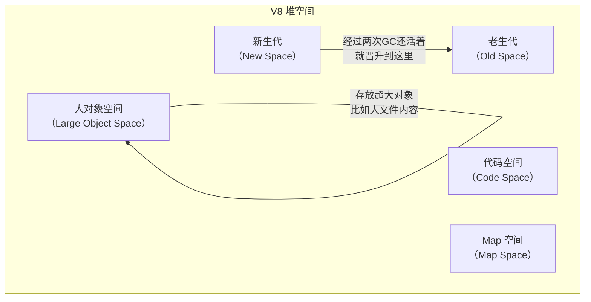
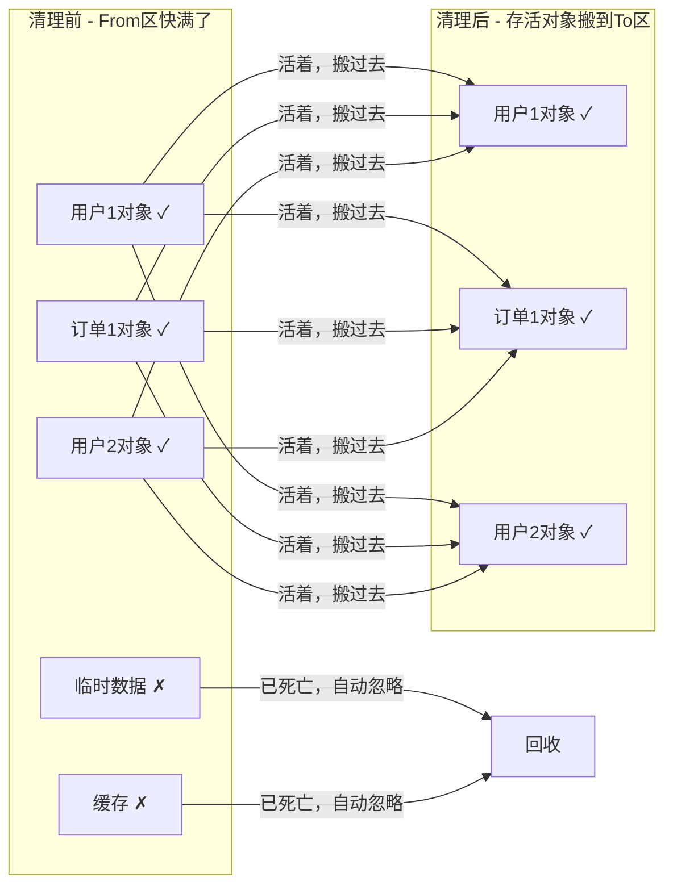
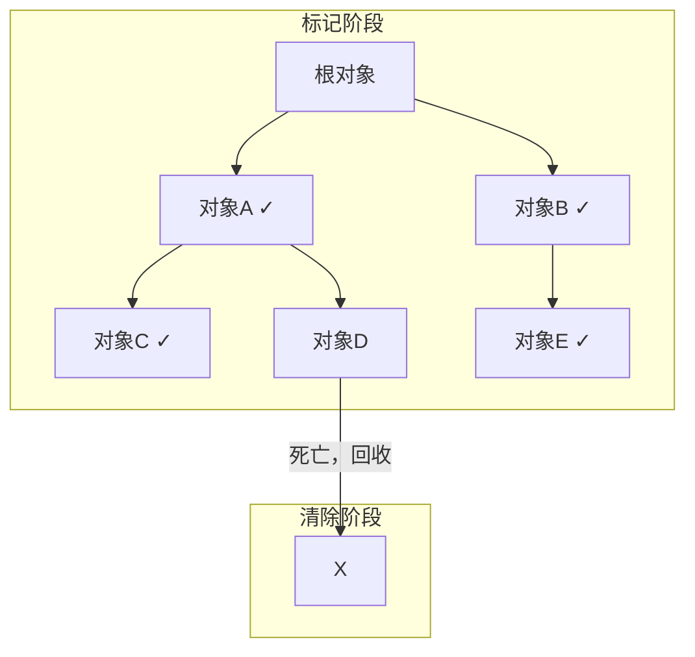
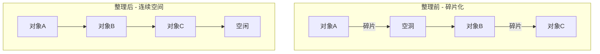

> 写给想搞清楚内存泄露是什么、怎么排查怎么治的开发者们

你有没有遇到过这种情况：服务器跑着跑着越来越慢，最后直接崩了？或者内存占用像吹气球一样往上涨，重启一下好了，但过几天又一样的问题？

这就是内存泄露在作怪！

这篇文章就来聊聊这个让无数 Node.js 开发者头疼的问题。什么？你觉得这是高级工程师才需要懂的东西？没关系，我会用大白话讲，保证你看完就能动手排查。

---

## 1. 先搞懂内存是怎么回事：V8 的"仓库管理"

### 1.1 Node.js 和 V8 是什么关系？

在开始聊内存之前，先搞清楚 Node.js 是怎么工作的。

打个比方：你开了一家餐厅（这就是 Node.js），但你雇了一个超级能干的仓库管理员（这就是 V8 引擎）。餐厅里所有的食材（数据）都归这个仓库管理员管。

Node.js 就是基于 V8 引擎来运行 JavaScript 的，所以内存管理的事，基本上就是 V8 在操心。

### 1.2 内存的两大"仓库"：栈和堆

V8 把内存分成了两个大区域，理解这两个区域是搞清楚内存泄露的第一步。

#### 1.2.1 栈（Stack）：小而快的临时仓库

栈就像你餐桌上的餐盘垫纸，用来放一些小东西：

- **放什么**：数字、字符串、布尔值这些"小零件"，还有指向对象的"遥控器"
- **谁管**：操作系统自动管理，函数调用完自动清理，不用你操心
- **特点**：速度飞快，但空间有限，像个小桌面，放不了太多东西

```javascript
// 这些都存在栈上
const name = '张三' // 字符串（小零件）
const age = 25 // 数字（小零件）
const isStudent = true // 布尔值（小零件）
const score = [98, 97, 100] // 数组的"遥控器"在栈上，真正的数据在堆里
```

#### 1.2.2 堆（Heap）：大但需要人管理的仓库

堆就像餐厅的大冷库，空间大，但需要人来管理什么时候放进去、什么时候清理：

- **放什么**：对象、数组、Buffer（大型数据）、闭包这些"大件"
- **谁管**：需要"垃圾回收器"（GC）来清理
- **特点**：空间大，但管理复杂，如果不管好就会乱堆乱放

```javascript
// 这些都存在堆上
const user = { name: '张三', age: 25 } // 大对象
const scores = [98, 97, 100, 99] // 大数组
const buffer = Buffer.alloc(1024 * 1024) // 1MB的缓冲区

// 闭包也会占用堆内存
function createCounter() {
  let count = 0 // 这个变量存在堆里，因为被闭包引用着
  return () => ++count
}
```

### 1.3 堆的详细分区：V8 的"仓储系统"

V8 引擎把堆又分成了几个区域，每个区域有不同的用途：



| 区域           | 名字               | 放什么                               | 特点                     |
| -------------- | ------------------ | ------------------------------------ | ------------------------ |
| **新生代**     | New Space          | 刚创建的对象，比如函数里的临时变量   | 空间小，清理频繁，速度快 |
| **老生代**     | Old Space          | 存活时间长的对象，比如全局缓存、闭包 | 空间大，清理较慢         |
| **大对象空间** | Large Object Space | 超过一定大小的对象                   | 不参与常规GC             |
| **代码空间**   | Code Space         | 存放编译后的机器码                   | 一般不需要你管           |
| **Map空间**    | Map Space          | 存放对象的结构信息                   | 记录对象长什么样         |

**小知识**：新生代和老生代是最重要的两个区域，V8 的垃圾回收主要就围着它们转。

---

## 2. 垃圾回收：V8 是怎么"打扫卫生"的？

### 2.1 为什么需要垃圾回收？

想象一下，如果你开餐厅从来不清理冷库，会怎么样？

- 过期食材堆成山
- 新鲜食材没地方放
- 最后整个冷库都塞满了

内存也是一个道理！程序运行时会不断创建对象，如果不清理，那些"死对象"（再也不用的对象）就会占着地方，导致新对象没地方放。

### 2.2 分代回收：让清理更高效

V8 的聪明之处在于：它不是一股脑地清理所有内存，而是根据对象的"年龄"用不同的方法清理。

这就像餐厅的清洁策略：

- **每天**：清理餐桌上的剩饭（新生代，快速简单）
- **每周**：清理冷库里的过期食材（老生代，费时费力但可以慢慢做）

#### 2.2.1 新生代清理：Scavenge 算法

新生代用的是"搬家式"清理，叫 Scavenge（清道夫）算法。

**原理**：

1. 新生代分成两个等大的区域：From 和 To
2. 新对象都放在 From 区
3. 当 From 区快满时，触发清理
4. 活着的对象（还在用的）复制到 To 区
5. 死的对象（不用的）不管它
6. From 和 To 角色互换



**为什么这样设计？**

因为新生代里的对象大多"朝生夕死"——刚创建用完就不要了。所以存活对象很少，复制起来很快。

**晋升规则**：

- 对象经历两次 Scavenge 还活着 → 晋升到老生代
- 或者 To 区使用超过 25% → 直接晋升

#### 2.2.2 老生代清理：标记-清除 & 标记-整理

老生代里的对象存活时间长，不能用"搬家"这种费力的方式，所以用"标记-清除"算法。

**标记-清除（Mark-Sweep）**：

1. **标记阶段**：从"根对象"出发，找出所有还活着的对象
   - 根对象就是全局对象、栈上的变量这些"肯定还活着"的东西
   - 沿着引用一路标记，像画地图一样

2. **清除阶段**：遍历整个堆，把没标记的对象全部回收



**问题**：清除后内存会变得"支离破碎"，就像一本书被撕掉很多页，中间全是洞。这时候大一点的新对象就放不进去了。

**标记-整理（Mark-Compact）**：

为了解决这个问题，V8 会在适当时候启动"整理"模式：

1. 把所有存活的对象往一边挤
2. 中间的空洞全部挤掉
3. 清理边界外的所有内存



**什么时候整理？** V8 会根据碎片程度决定，不会随便整理（因为整理开销大）。

#### 2.2.3 Oilpan：C++ 对象的专属清洁工（2026年新特性）

这是 2026 年 Node.js 的新招数。

之前有个头疼的问题：JavaScript 代码里用的 `Buffer`、Native Addons（C++ 扩展）创建的对象，它们的内存归谁管？

现在有了 **Oilpan**，专门负责 C++ 层面的垃圾回收，和 V8 主 GC 配合得天衣无缝。以前常见的"外部内存泄露"问题大大减少了。

### 2.3 现代 V8：让 GC "卡顿"成为历史

早期的 V8 做 GC 时会"Stop the World"——就是停下来专心打扫卫生，这时候 JavaScript 全部暂停，应用就像死机一样。

现代 V8 用了三个绝招解决这个问题：

| 技术         | 原理                                           | 效果             |
| ------------ | ---------------------------------------------- | ---------------- |
| **增量标记** | 把标记工作拆成很多小步骤，穿插在代码执行间隙做 | 不需要长时间停顿 |
| **并发标记** | 用多个辅助线程同时标记，主线程继续跑代码       | 充分利用多核     |
| **并行回收** | 清理阶段多个线程一起干                         | 缩短停顿时间     |

**结果**：GC 停顿从"百毫秒级"降到了"毫秒级甚至微秒级"，用户根本感觉不到。

---

## 3. 内存泄露的五大典型场景

**重要更正**：原文标题说"四大典型场景"，但实际列了 5 个！这里我帮你纠正过来。

内存泄露的本质就是：**不用的对象还被某个地方抓着不放**，垃圾回收器不敢清理。

下面列出 Node.js 中最常见的 5 个泄露场景，附带代码和解决方案。

### 3.1 场景一：闭包——Node.js 的灵魂也是泄露高发区

闭包是 Node.js 编程的精华，用好了功能强大，用不好就是内存泄露的重灾区。

**问题出在哪？**

闭包可以"记住"外部函数的变量。但如果闭包被长期持有，而它又引用了大对象，那这个大对象就永远无法回收。

```javascript
// ❌ 错误示例：闭包泄露
import fs from 'node:fs'

function createLeakingClosure() {
  // 创建一个大缓冲区
  const hugeBuffer = Buffer.alloc(1024 * 1024 * 10) // 10MB

  // 返回一个闭包
  return () => {
    // 闭包只用了 hugeBuffer 的一个字节
    // 但整个 10MB 都会被闭包抓着不放！
    console.log(hugeBuffer[0])
  }
}

// 这个 leak 变量会一直存在
const leak = createLeakingClosure()

// 10MB 内存泄露！
// 即使 hugeBuffer 已经"不需要了"，但闭包还抓着它
```

**闭包为什么会抓着整个对象不放？**

你可以把闭包想象成一张照片。如果照片里拍到了一个人，即使你只想要这个人的一张照片，你也得整张照片都保存着。闭包也是一样——它引用了外部变量，就会把整个变量所在的环境都留住。

**解决方案**：

```javascript
// ✅ 正确示例：闭包安全写法
function createSafeClosure() {
  let hugeBuffer = Buffer.alloc(1024 * 1024 * 10)

  return () => {
    if (!hugeBuffer) return // 已经释放过了
    console.log(hugeBuffer[0])
    hugeBuffer = null // 手动释放引用！
  }
}
```

**小提示**：如果大对象只需要用一次，考虑在闭包内部创建，用完就让它自己被回收。

### 3.2 场景二：EventEmitter 监听器——越积越多的"幽灵"

Node.js 的事件驱动架构靠 EventEmitter 实现，但如果监听器加了就忘记移除，就会堆积成山。

**问题出在哪？**

```javascript
import { EventEmitter } from 'node:events'

// 全局事件总线
const globalEmitter = new EventEmitter()

// 处理请求的函数
export async function handleRequest(req, res) {
  const onData = (data) => {
    console.log('收到数据:', data)
  }

  // 每次请求都添加监听器
  globalEmitter.on('update', onData)

  // 请求结束了...
  res.end('OK')

  // ❌ 忘记移除监听器！
  // 这个 onData 函数会一直挂在 globalEmitter 上
}
```

**想象一下**：

这就好像餐厅里每来一个客人，服务员就站在旁边等客人吃完。但是客人吃完走了，服务员还在那站着不走。一百个客人来，就有一百个服务员站着不动——最后餐厅全是服务员，没地方坐客人了。

**随着请求增多**：

- 1000 个请求 → 1000 个 `onData` 监听器
- 每个监听器都是一个函数对象
- 每个函数可能还引用着请求的上下文数据
- 内存蹭蹭往上涨

**解决方案**：

```javascript
// ✅ 方案一：用完了记得移除
export async function handleRequest(req, res) {
  const onData = (data) => {
    console.log('收到数据:', data)
  }

  globalEmitter.on('update', onData)

  // 请求结束或者响应完成时移除
  res.on('finish', () => {
    globalEmitter.off('update', onData)
  })

  res.end('OK')
}

// ✅ 方案二：用 once 只触发一次
globalEmitter.once('update', (data) => {
  console.log('收到数据:', data)
})

// ✅ 方案三：用 AbortController 统一管理（推荐）
const controller = new AbortController()

emitter.on(
  'data',
  (data) => console.log(data),
  { signal: controller.signal }, // 绑定了信号
)

res.on('finish', () => {
  controller.abort() // 一键清理所有相关监听器
})
```

### 3.3 场景三：定时器——永不消逝的"循环"

`setInterval` 是泄露的经典来源，因为它会一直运行，除非你主动停止。

**问题出在哪？**

```javascript
// ❌ 错误示例：定时器泄露
function startTask(data) {
  // 创建定时器，每秒发送一次状态
  const timer = setInterval(() => {
    // data 会一直被 timer 引用着
    process.send(data.status)
  }, 1000)

  // ❌ 如果没有对应的 clearInterval，timer 永远不会停
}

// 如果 startTask 被调用了 100 次
startTask({ status: '任务1' })
startTask({ status: '任务2' })
// ...
startTask({ status: '任务100' })

// 现在你有 100 个定时器在同时运行！
// 每个定时器都引用着对应的 data
// 这些 data 永远不会被回收
```

**想象一下**：

就像你预约了 100 个快递员，每小时给你送一次快递。但你不需要那么多快递了，却忘了取消预约。快递员们每隔一小时就来敲门，浪费你的时间和资源。

**解决方案**：

```javascript
// ✅ 方案一：保存定时器ID，需要时清除
const activeTimers = new Map()

function startTask(taskId, data) {
  const timer = setInterval(() => {
    process.send({ taskId, status: data.status })
  }, 1000)

  activeTimers.set(taskId, timer)
  return timer
}

function stopTask(taskId) {
  const timer = activeTimers.get(taskId)
  if (timer) {
    clearInterval(timer)
    activeTimers.delete(taskId)
  }
}

// ✅ 方案二：用 setTimeout 递归实现，更灵活
async function safeRepeatTask(data) {
  await processData(data)

  // 用 setTimeout 递归，条件满足时自然停止
  if (shouldContinue(data)) {
    setTimeout(() => safeRepeatTask(data), 1000)
  }
}

// ✅ 方案三：用 AbortController
const controller = new AbortController()

setInterval(
  () => {
    process.send(data.status)
  },
  1000,
  { signal: controller.signal },
)

// 需要停止时
controller.abort()
```

### 3.4 场景四：Streams 流——打开没关的门

Streams（流）是 Node.js 处理大文件的利器，但如果处理不当，底层的文件描述符和缓冲区会泄露。

**问题出在哪？**

```javascript
import fs from 'node:fs'

// ❌ 错误示例：流泄露
function processFile(filePath) {
  const stream = fs.createReadStream(filePath)

  stream.on('data', (chunk) => {
    // 处理数据...
    processChunk(chunk)
  })

  // ❌ 如果中途报错，或者流程中断
  // error/close 事件可能没触发
  // stream 就一直开着，文件描述符不释放

  // 更糟的是：缓冲区可能还占着内存
}

// 比如这样调用
processFile('huge-file-1.bin')
processFile('huge-file-2.bin')
// 处理失败但流没关闭...
// 10 个大文件的流都开着...
```

**想象一下**：

就像你打开了很多门拿东西，但拿到一半发现不对，又去开别的门。门越开越多，但你忘了关前面的。最后整栋楼都是开着的门，既不安全也浪费资源。

**解决方案**：

```javascript
// ✅ 正确示例：完善的流处理
import fs from 'node:fs'

async function processFileSafely(filePath) {
  const stream = fs.createReadStream(filePath)

  try {
    for await (const chunk of stream) {
      await processChunk(chunk)
    }
    // 自动到达这里表示正常结束
  } catch (error) {
    console.error('处理文件失败:', filePath, error)
    // 发生错误时主动销毁流
    stream.destroy()
  }
}

// ✅ 或者用 pipeline 自动管理
import { pipeline } from 'node:stream/promises'
import { createGzip } from 'node:zlib'

async function compressFile(input, output) {
  try {
    await pipeline(fs.createReadStream(input), createGzip(), fs.createWriteStream(output))
    console.log('压缩完成:', input)
  } catch (error) {
    console.error('压缩失败:', error)
    // pipeline 会自动关闭所有流
  }
}

// ✅ 也可以用 AbortController
const controller = new AbortController()

const stream = Readable.from([1, 2, 3], { signal: controller.signal })

// 清理时
controller.abort()
```

### 3.5 场景五：SSR 单例陷阱——服务端的"定时炸弹"

**这是原文最容易忽略、危害最大的一种泄露！**

在 Next.js、Nuxt.js 这类 SSR（服务端渲染）框架里，单例模式是最容易出问题的。

**问题出在哪？**

```javascript
// ❌ 错误示例：lib/auth.js - 单例缓存泄露
const userCache = new Map() // 模块顶层定义，跨请求持久存在

export async function getUserData(userId) {
  if (userCache.has(userId)) {
    return userCache.get(userId)
  }

  const data = await fetchUserData(userId)
  userCache.set(userId, data) // 问题在这里！
  return data
}
```

**为什么这是"定时炸弹"？**

Node.js 进程启动后一直运行，不像浏览器刷新就没了。这个 `userCache` 会跨越所有用户请求：

- 第一个用户访问 → cache 里多一条
- 第一万个用户访问 → cache 里有一万条
- 没有人清理，永远只增不减
- 最后内存爆了，OOM 崩溃

**想象一下**：

就像餐厅的冷库没有清理机制。每来一个客人，就往冷库里塞他的剩菜。第一天还好，一周后冷库满了，一个月后剩菜都发臭了。

**解决方案**：

```javascript
// ✅ 方案一：使用有容量限制的 LRU 缓存
import { LRUCache } from 'lru-cache'

// 最多 500 条，超过就自动清理最老的
// 每条数据 10 分钟后自动过期
const userCache = new LRUCache({
  max: 500, // 最多存 500 条
  ttl: 1000 * 60 * 10, // 每条 10 分钟后过期
})

export async function getUserData(userId) {
  if (userCache.has(userId)) {
    return userCache.get(userId)
  }

  const data = await fetchUserData(userId)
  userCache.set(userId, data)
  return data
}

// ✅ 方案二：设置 TTL 的 Map（简单实现）
const userCacheWithTTL = new Map()

export async function getUserDataWithTTL(userId) {
  const cached = userCacheWithTTL.get(userId)

  // 检查是否过期
  if (cached && Date.now() - cached.timestamp < 10 * 60 * 1000) {
    return cached.data
  }

  const data = await fetchUserData(userId)
  userCacheWithTTL.set(userId, {
    data,
    timestamp: Date.now(),
  })

  // 定期清理过期数据（可以用定时器或按需清理）
  return data
}

// ✅ 方案三：使用 Redis 等外部缓存（生产推荐）
import { createClient } from 'redis'

const redis = createClient()

export async function getUserDataFromRedis(userId) {
  const cached = await redis.get(`user:${userId}`)
  if (cached) {
    return JSON.parse(cached)
  }

  const data = await fetchUserData(userId)
  await redis.setEx(`user:${userId}`, 600, JSON.stringify(data)) // 10分钟过期
  return data
}
```

**小提示**：SSR 环境中，**永远不要**在模块顶层存储用户相关的数据。所有数据都要么立即用完，要么有明确的清理机制。

---

## 4. 2026 现代防御策略：让代码自己管理自己

现代 Node.js 提供了更强大的工具来管理资源生命周期，减少"忘记清理"的问题。

### 4.1 AbortController：统一销毁信号的"万能钥匙"

`AbortController` 最初是为了取消 Fetch 请求设计的，但现在它的用途已经大大扩展了。

**它能做什么？**

- 取消 EventEmitter 的监听器
- 取消定时器
- 取消 Stream
- 取消 Fetch 请求
- 任何支持 AbortSignal 的异步操作

**一句话理解**：它就像一个"总开关"，按下去，所有相关的异步操作都自动停止并清理。

```javascript
import { EventEmitter } from 'node:events'
import { setTimeout } from 'node:timers/promises'
import { Readable } from 'node:stream'

// 创建一个控制器
const controller = new AbortController()
const { signal } = controller

// 用法一：控制 EventEmitter 监听器
const emitter = new EventEmitter()

emitter.on(
  'data',
  (data) => {
    console.log('收到数据:', data)
  },
  { signal }, // 关键：绑定了信号
)

// 用法二：控制定时器
setTimeout(5000, '时间到！', { signal })
  .then(console.log)
  .catch((err) => {
    if (err.name === 'AbortError') {
      console.log('定时器被取消了')
    }
  })

// 用法三：控制 Stream
const stream = Readable.from([1, 2, 3, 4, 5], { signal })

// 当需要清理时，一行代码全部搞定！
// 比如请求结束时：
res.on('finish', () => {
  controller.abort() // 所有绑定了这个 signal 的资源全部自动清理
})
```

**为什么推荐用 AbortController？**

| 传统方式                     | AbortController       |
| ---------------------------- | --------------------- |
| 监听器：用 `off()` 移除      | 自动清理              |
| 定时器：用 `clearInterval()` | 自动清理              |
| Stream：用 `destroy()`       | 自动清理              |
| 需要记很多 API               | 一个 `abort()` 全搞定 |
| 容易遗漏                     | 不容易遗漏            |

### 4.2 FinalizationRegistry：泄露的"预警雷达"

这个 API 不能防止泄露，但可以**帮你发现泄露**。

**它是什么？**

当你注册一个对象到 FinalizationRegistry 后，如果这个对象被垃圾回收了，你就会收到通知。

```javascript
// 创建预警器
const registry = new FinalizationRegistry((heldValue) => {
  console.warn(`🔔 预警：对象 "${heldValue}" 已被 GC 回收`)
})

function createSession(userId) {
  const session = {
    id: Math.random().toString(36).slice(2),
    userId,
    data: Buffer.alloc(1024 * 1024), // 模拟占用 1MB
  }

  // 注册监控
  // 当 session 被 GC 回收时，会触发回调
  registry.register(session, `Session_${session.id}`)

  return session
}

// 模拟使用
console.log('创建会话...')
let session1 = createSession('用户A')

// 解除引用
session1 = null

console.log('已解除 session1 引用，等待 GC...')
// 如果正常，这里应该会输出预警信息
// 如果等了很久都没有预警，说明内存泄露了！
```

**使用场景**：

1. 调试时确认对象是否被正确回收
2. 监控关键对象（如 Session、Connection）的生命周期
3. 发现潜在的泄露点

**注意事项**：

- 回调时机不确定，可能在对象回收后很久才触发
- 不保证一定触发（比如进程退出前）
- 主要用于调试，不应该依赖它执行关键逻辑

---

## 5. 检测与调试实战：找到内存问题的"福尔摩斯"

现在你知道了什么是内存泄露、怎么产生的。接下来就是：怎么找到它？

### 5.1 内存快照分析（Heap Snapshot）：最直观的武器

堆快照就是内存的"照片"，能看到某个时刻所有对象的状态。

**生成快照**：

```bash
# 启动时开启调试端口
node --inspect app.js
```

然后：

1. 打开 Chrome 浏览器
2. 地址栏输入 `chrome://inspect`
3. 点击 "Open dedicated DevTools for Node"
4. 切到 **Memory** 标签
5. 点击 "Take Snapshot"

**分析快照**：

| 指标              | 含义                            | 怎么看                     |
| ----------------- | ------------------------------- | -------------------------- |
| **Shallow Size**  | 对象本身的大小                  | 对象直接占用的内存         |
| **Retained Size** | 对象 + 它引用的所有对象的总大小 | 回收这个对象能释放多少内存 |
| **Distance**      | 到根对象的距离                  | 数字越小说明越"根正苗红"   |

**最实用的技巧：对比快照**

1. 拍一张快照（刚启动，内存干净）
2. 运行一段时间（模拟用户操作）
3. 再拍一张快照
4. 选择 "Comparison" 视图
5. 看哪些对象**数量在增长**

**泄露的典型特征**：

- `(closure)` 数量不断增长 → 闭包泄露
- `EventListener` 数量不断增长 → 监听器泄露
- `Buffer` 数量不断增长 → Buffer 泄露
- `Timeout` / `Immediate` 增长 → 定时器泄露

### 5.2 监控内存指标：让数据说话

**使用 `process.memoryUsage()`**：

```javascript
// 定期打印内存使用情况
setInterval(() => {
  const mem = process.memoryUsage()

  console.log({
    heapUsed: `${Math.round(mem.heapUsed / 1024 / 1024)}MB`, // 堆已使用
    heapTotal: `${Math.round(mem.heapTotal / 1024 / 1024)}MB`, // 堆总量
    rss: `${Math.round(mem.rss / 1024 / 1024)}MB`, // 进程占用总内存
    external: `${Math.round(mem.external / 1024 / 1024)}MB`, // C++ 对象内存
  })
}, 10000)
```

**怎么判断泄露？**

- `heapUsed` 持续上升，从不下降 → 很可能泄露
- 手动触发 GC 后，`heapUsed` 仍然很高 → 确认泄露

### 5.3 手动触发 GC：确认是不是真泄露

```bash
# 启动时暴露 GC 功能
node --expose-gc app.js
```

```javascript
// 在代码中手动触发 GC
if (global.gc) {
  console.log('手动触发 GC 前的内存:', process.memoryUsage().heapUsed)
  global.gc() // 强制执行一次完整 GC
  console.log('手动触发 GC 后的内存:', process.memoryUsage().heapUsed)
} else {
  console.warn('GC 未暴露，请用 --expose-gc 启动')
}
```

**判断方法**：

- GC 后 `heapUsed` 大幅下降 → 说明之前增长的是"可回收对象"，不是泄露
- GC 后 `heapUsed` 基本不变 → 确认是真正的泄露

### 5.4 node --report：生产环境的"黑匣子"

生产环境不能随便停服务生成快照，但可以用 **Diagnostic Report**。

**启用报告**：

```bash
# 启用报告生成
node \
    --report-on-fatalerror \
    --report-on-signal \
    --report-signal=SIGUSR2 \
    app.js
```

**手动触发报告**：

```bash
# 找到进程 ID
ps aux | grep node

# 发送信号触发报告生成
kill -USR2 <pid>
```

**报告包含的内容**：

- 堆内存分布（按类型）
- 资源限制
- 调用栈（JavaScript 和 C++）
- 所有 `libuv` 句柄（帮你发现未关闭的 Socket、定时器）
- 系统信息

**这有什么用？**

OOM 崩溃时，报告会自动生成。你拿到报告就能看到崩溃前内存都在哪些地方——不用复现问题，证据已经自动保存了。

### 5.5 第三方工具：让分析更简单

| 工具              | 用途           | 特点                                                       |
| ----------------- | -------------- | ---------------------------------------------------------- |
| **clinic.js**     | 性能诊断全家桶 | 有 doctor（诊断）、flame（火焰图）、bubbleprof（异步分析） |
| **heapdump**      | 生成堆快照     | 运行时通过信号生成，方便                                   |
| **memwatch-next** | 内存监控       | 自动检测泄露并报警                                         |

**clinic.js 火焰图示例**：

```bash
# 安装
npm install -g clinic

# 使用
clinic doctor -- node app.js

# 运行一段时间后 Ctrl+C
#会自动打开可视化报告
```

---

## 6. 优化建议总结

### 6.1 核心原则

1. **优先使用 WeakMap/WeakSet**
   弱引用不会阻止 GC，非常适合做对象缓存

```javascript
// ✅ 适合：不需要手动清理
const cache = new WeakMap()

function processObject(obj) {
  if (!cache.has(obj)) {
    cache.set(obj, expensiveOperation(obj))
  }
  return cache.get(obj)
}
// 当 obj 不再被其他地方引用时，cache 自动清空

// ❌ 不适合：需要长期缓存的场景
// WeakMap 的 key 不能是基本类型
```

2. **避免全局变量**
   全局变量到老生代，除非必要不要用

```javascript
// ❌ 不好：全局变量难以清理
global.userCache = new Map()

// ✅ 好：用完即弃
function getUserData(userId) {
  const cache = new Map() // 函数内局部变量
  // ...
} // 函数结束，cache 自动清理
```

3. **流式处理大文件**
   不要再用 `fs.readFile` 读大文件

```javascript
// ❌ 不好：一次性加载，可能 OOM
const data = fs.readFileSync('huge-file.bin')

// ✅ 好：流式处理，内存占用稳定
const stream = fs.createReadStream('huge-file.bin')
stream.pipe(process.stdout)
```

4. **用 AbortController 统一管理资源**

```javascript
// 所有异步操作都用同一个信号
const controller = new AbortController()

emitter.on('data', handler, { signal: controller.signal })
setTimeout(fn, 1000, { signal: controller.signal })
fetch(url, { signal: controller.signal })

// 一键清理
controller.abort()
```

5. **设置缓存上限和过期时间**

```javascript
import { LRUCache } from 'lru-cache'

const cache = new LRUCache({
  max: 1000, // 最多 1000 条
  ttl: 1000 * 60 * 5, // 5 分钟后过期
  maxSize: 1000 * 1024 * 1024, // 最大 1GB
})
```

6. **长期压测观察内存曲线**

用 `k6` 或 `Artillery` 做长时间压测：

```yaml
# k6 配置示例
script: test.js
duration: '4h'
vus: 100
```

**健康曲线**：

```
内存
  ↑
  │    ↗ ↘ ↗ ↘  （GC 周期性回收）
  │ ↗       ↘
  │        ↗   ↘  （正常运行）
  └──────────────────→ 时间
```

**泄露曲线**（单调递增）：

```
内存
  ↑
  │\
  │ \
  │  \
  │   \
  └──────→ 时间
```

7. **部署监控和告警**

用 Prometheus + Grafana 监控 `nodejs_heap_used_bytes`，设置告警：

- 持续 15 分钟上涨超过 20% → 告警
- 接近容器内存限制的 80% → 告警

---

## 7. 常见问题 FAQ

**Q: 内存泄露和内存溢出有什么区别？**

A:

- **内存泄露**：该回收的没回收，内存慢慢变少（像漏水的桶）
- **内存溢出**：想分配的内存不够了（OOM）

泄露是溢出的常见原因，但不是唯一原因。

**Q: Node.js 默认堆内存多大？**

A: 默认 64 位系统约 1.5GB，32 位约 0.7GB。可以通过 `--max-old-space-size` 调整：

```bash
node --max-old-space-size=4096 app.js  # 设置为 4GB
```

**Q: 生产环境怎么预防内存泄露？**

A:

1. 代码层面：用 AbortController、LRU 缓存等
2. 监控层面：部署 Prometheus 监控 + 告警
3. 测试层面：长期压测观察内存曲线
4. 运维层面：设置容器内存限制 + 定期重启

**Q: 调试时发现 `heapUsed` 很高，但 GC 后就降下来了，这是泄露吗？**

A: 不是！这只是正常的内存波动。只要 GC 后能降下来，就说明对象被正确回收了。

**Q: FinalizationRegistry 的回调没触发，是不是泄露了？**

A: 不一定。FinalizationRegistry 不保证回调一定触发。可能只是还没来得及触发，GC 还没运行，或者进程就退出了。

---

内存泄露就像厨房的油烟——看不见摸不着，但积累起来就会让整个厨房没法用。好的代码习惯 + 定期监控 = 让你的 Node.js 应用健康运行。

出现问题不要慌，按照上面的排查流程一步步来，内存泄露一定能找到并解决！
