> 写给普通开发者的安全入门手册，看完再也不怕网站被黑

你有没有想过这个问题：为什么有些网站会被"盗号"？为什么明明是自己的账号，别人却能帮你下单？为什么有些网站搞活动的时候突然就崩了？

这些问题背后，往往是安全漏洞在作怪。今天这篇文章，我用大白话给你讲清楚 Node.js 开发中最常见的安全问题，以及怎么防。全文包含大量图解和代码示例，保证小白也能看懂。

---

## 引言：为什么安全这么重要？

做 Web 开发这么多年，我见过太多因为安全问题导致的惨案：

- 某社交网站用户数据泄露，几千万用户信息被卖
- 某电商平台被人疯狂刷券，损失几百万
- 某公司数据库被拖，用户密码直接暴露

这些不是故事，是真实发生过的事情。Node.js 作为后端开发的主流技术栈之一，安全性直接决定了你的应用能不能守住最后一道防线。

很多新手觉得"我这个小网站谁会来攻击"，但实际上黑客的扫描器是全自动的，24 小时不停扫描全网的漏洞。你的网站只要一上线，就会被无数机器人盯上。

所以，安全不是"大公司才需要考虑的事"，而是每个开发者都必须掌握的基本功。

下面我从最常见的几种漏洞说起，每一种都会讲到攻击原理、图解说明、以及怎么用代码防护。

---

## 一、CSRF：让人替你操作的陷阱

### 1.1 什么是 CSRF？

CSRF 的全称是 Cross-Site Request Forgery，翻译过来就是"跨站请求伪造"。

这个漏洞的恶心之处在于：攻击者不需要知道你的密码，也不需要黑进你的账号，只需要诱导你点击一个链接，就能让你在不知情的情况下帮攻击者做事。

举个例子：你登录了银行网站正准备转账，攻击者给你发了一封邮件，里面有个链接。你好奇点了一下，结果发现自己莫名其妙地给陌生人转了一笔钱。这就是 CSRF 攻击。

### 1.2 攻击是怎么实现的？

让我们用图来理解整个攻击流程：

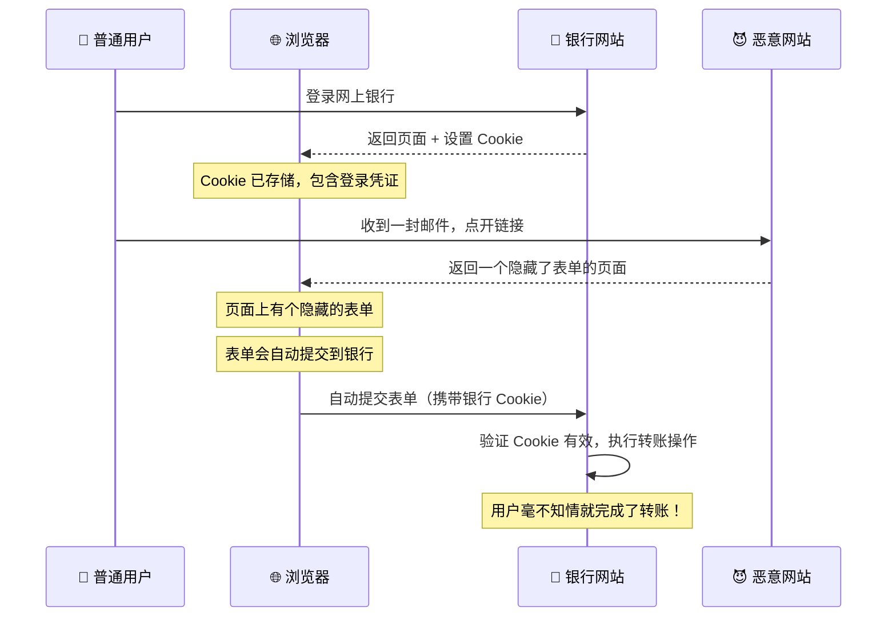

整个过程最阴险的地方在于：浏览器会自动带上目标网站的 Cookie，不管这个表单是不是来自目标网站。所以银行网站看到请求带着有效的 Cookie，就认为这是用户本人的操作。

### 1.3 真实场景举例

想象这样一个场景：

1. 你在购物网站登录了账号
2. 攻击者给你发送了一封邮件，里面有个链接："恭喜获得100元优惠券，点击领取"
3. 你点开链接后，页面显示"优惠券已过期"
4. 但实际上，攻击者的页面里有一个隐藏的表单，在你打开页面的瞬间自动提交，把你的收货地址改成了攻击者的地址
5. 之后你下的订单全部发到攻击者那里去了

可怕吗？整个过程你完全不知情，因为你看的是"优惠券过期"的页面，根本不知道背后发生了什么。

### 1.4 怎么防护？

**方法一：SameSite Cookie**

这是浏览器提供的防护机制。只要在设置 Cookie 的时候加上 `SameSite` 属性，浏览器就不会在跨站请求中携带这个 Cookie。

```javascript
// 设置 Cookie 时的安全配置
res.cookie('session', userSessionId, {
	httpOnly: true, // 禁止 JavaScript 读取，防止 XSS 偷 Cookie
	secure: true, // 只在 HTTPS 下传输，防止中间人攻击
	sameSite: 'strict', // 完全禁止跨站携带，最严格
	// 或者用 'lax'，在 GET 请求时允许跨站（用户体验更好但安全性略低）
})
```

`SameSite` 有三个选项：

- `Strict`：最严格，任何跨站请求都不带这个 Cookie，连链接都不行
- `Lax`：相对宽松，GET 请求的链接会带 Cookie，但 POST 表单不行
- `None`：不限制，但必须配合 `secure` 使用（HTTPS）

**方法二：CSRF Token**

在表单中加入一个随机生成的令牌，后端验证这个令牌才能处理请求。

```javascript
// 服务端：生成 Token
app.get('/transfer', (req, res) => {
	// 生成一个安全的随机令牌
	const csrfToken = crypto.randomBytes(32).toString('hex')

	// 存入 session 或 Redis
	req.session.csrfToken = csrfToken

	// 渲染表单，把 Token 放到隐藏字段里
	res.render('transfer', { csrfToken })
})
```

```html
<!-- 前端：表单中包含 Token -->
<form action="/transfer" method="POST">
	<input type="hidden" name="csrfToken" value="{{csrfToken}}" />
	<input type="text" name="amount" placeholder="转账金额" />
	<button type="submit">转账</button>
</form>
```

```javascript
// 服务端：验证 Token
app.post('/transfer', (req, res) => {
	// 从表单获取 Token
	const submittedToken = req.body.csrfToken

	// 与 session 中存储的 Token 对比
	if (submittedToken !== req.session.csrfToken) {
		return res.status(403).json({ error: 'CSRF 验证失败' })
	}

	// Token 验证通过，继续处理业务
	// ...
})
```

**方法三：双重提交 Cookie**

不用在服务端存储 Token，而是让前端 JavaScript 读取 Cookie 中的值，然后放到 Header 里。后端同时验证 Cookie 和 Header 的一致性。

```javascript
// 中间件：验证双重提交
const csrfProtection = (req, res, next) => {
	const cookieToken = req.cookies['csrf-token']
	const headerToken = req.headers['x-csrf-token']

	if (!cookieToken || !headerToken || cookieToken !== headerToken) {
		return res.status(403).json({ error: 'CSRF 验证失败' })
	}
	next()
}

// 前端：发送请求时设置 Header
fetch('/api/transfer', {
	method: 'POST',
	headers: {
		'Content-Type': 'application/json',
		'x-csrf-token': document.cookie.match(/csrf-token=([^;]+)/)?.[1],
	},
	body: JSON.stringify({ amount: 100 }),
})
```

### 1.5 哪种方案最好？

现代 Web 开发推荐组合使用：

1. **SameSite Cookie**：浏览器自带防护，大部分情况下够用
2. **CSRF Token**：敏感操作必备，如转账、修改密码
3. **框架内置防护**：如果用 Next.js、Laravel 等框架，很多已经内置了 CSRF 防护

不要完全依赖某一种方案，多层防护才是王道。

---

## 二、XSS：藏在页面里的定时炸弹

### 2.1 什么是 XSS？

XSS 的全称是 Cross-Site Scripting，翻成中文是"跨站脚本攻击"。重点在"脚本"两个字——攻击者想尽办法把恶意 JavaScript 代码植入到你的页面里。

这个漏洞的可怕之处在于：恶意脚本在你自己的浏览器里运行，能访问你的 Cookie、localStorage，甚至可以冒充你在网站上操作。

### 2.2 XSS 有哪几种？

XSS 主要分三种类型，每种攻击方式都不一样：

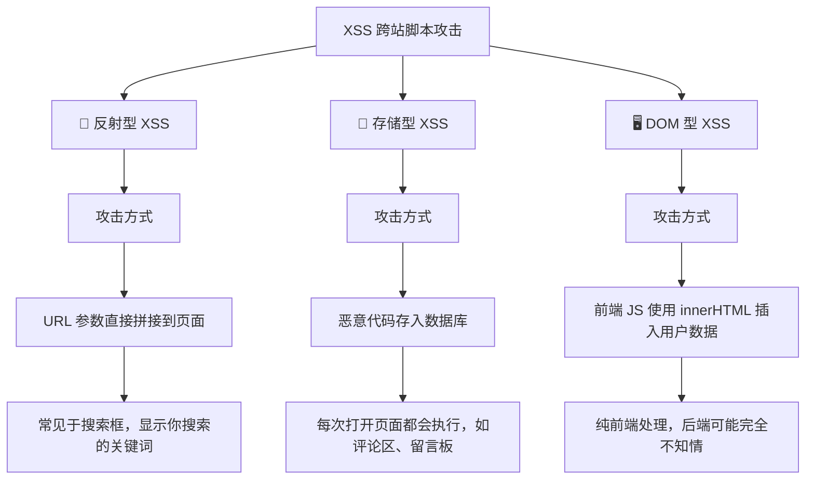

#### 反射型 XSS：昙花一现

这种是最常见的 XSS 类型。恶意代码在 URL 参数里，服务器把参数原封不动地返回给浏览器，浏览器执行了这段代码。

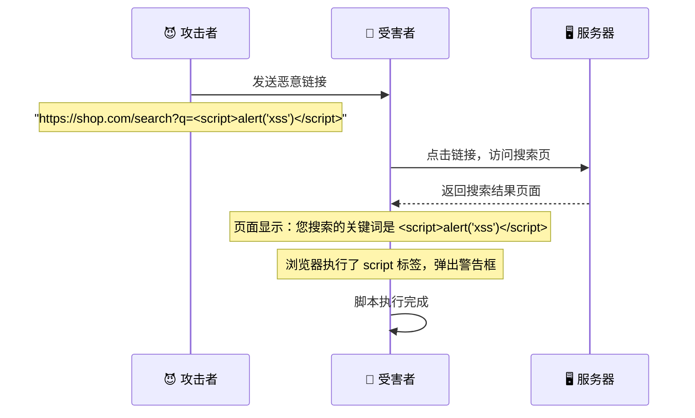

#### 存储型 XSS：潜伏的毒瘤

这种最危险。恶意代码被存到了数据库里，每个访问这个数据的用户都会中招。

典型场景：

- 论坛帖子、评论区
- 用户签名、昵称
- 文章标题（有些系统会直接显示在页面上）

想象一下：你在一个技术论坛回复了一个帖子，内容是：``

从此以后，每个打开这个帖子的人，他们的 Cookie 都会自动发送到攻击者的服务器。这不是一次性的，是持续性的伤害。

#### DOM 型 XSS：纯前端的陷阱

这种 XSS 完全发生在浏览器端，跟后端没关系。

```javascript
// 前端代码：获取 URL 参数并显示
const params = new URLSearchParams(window.location.search)
const name = params.get('name')
document.getElementById('welcome').innerHTML = '欢迎，' + name
```

攻击者构造这样的 URL：`http://example.com?name=`

当受害者打开这个链接，JavaScript 会获取到包含恶意代码的 name 参数，然后用 innerHTML 插入到页面。浏览器解析 HTML 的时候就会执行 onerror 里的脚本。

### 2.3 XSS 能造成什么危害？

很多人觉得"弹出个 alert 框有什么大不了的"，但实际上 XSS 的危害远不止于此：

1. **Cookie 盗取**：读取用户的登录凭证，冒充用户操作
2. **键盘记录**：监听用户输入的密码、银行卡号
3. **页面篡改**：修改页面内容，进行钓鱼诈骗
4. **挖矿攻击**：在页面里嵌入挖矿代码，利用用户电脑挖加密货币
5. **蠕虫传播**：自动把你的恶意链接分享给所有好友

### 2.4 怎么防护？

**原则一：永远不要相信用户输入**

不管数据来自哪里——URL 参数、表单提交、数据库——都要当作可能是恶意的来处理。

**原则二：输出时转义，不要在插入 HTML 之前转义**

```javascript
// 错误的做法：直接插入用户输入
element.innerHTML = userInput // 危险！

// 正确的做法：使用 textContent 而不是 innerHTML
element.textContent = userInput // 安全

// 如果必须使用 innerHTML，先转义
function escapeHtml(text) {
	const div = document.createElement('div')
	div.textContent = text
	return div.innerHTML
}
element.innerHTML = escapeHtml(userInput)
```

**后端使用 xss 库过滤：**

```javascript
import xss from 'xss'

// 白名单过滤：只允许部分标签
const clean = xss(userInput, {
	whiteList: {
		p: ['class'],
		strong: [],
		em: [],
		a: ['href', 'title'],
	},
})
```

**后端设置 CSP（内容安全策略）：**

```javascript
import helmet from 'helmet'

app.use(
	helmet.contentSecurityPolicy({
		directives: {
			defaultSrc: ["'self'"],
			scriptSrc: ["'self'", "'nonce-{generated-csp-nonce}'"],
			styleSrc: ["'self'", "'unsafe-inline'"], // 注意：尽量不用 unsafe-inline
			imgSrc: ["'self'", 'https:'], // 只允许同源和 HTTPS 图片
			connectSrc: ["'self'"],
			fontSrc: ["'self'"],
			objectSrc: ["'none'"],
			mediaSrc: ["'self'"],
			frameSrc: ["'none'"],
		},
	}),
)
```

### 2.5 完整防护示例

结合前端和后端的完整防护：

```javascript
// 后端 Express 服务
import express from 'express'
import xss from 'xss'
import helmet from 'helmet'

const app = express()

// 1. 使用 helmet 设置安全头
app.use(helmet())

// 2. 全局 XSS 过滤中间件
app.use((req, res, next) => {
	// 对所有请求参数进行转义
	const sanitize = (obj) => {
		if (typeof obj === 'string') {
			return xss(obj)
		}
		if (typeof obj === 'object' && obj !== null) {
			for (const key in obj) {
				obj[key] = sanitize(obj[key])
			}
		}
		return obj
	}

	req.body = sanitize(req.body)
	req.query = sanitize(req.query)
	req.params = sanitize(req.params)
	next()
})

// 3. 安全的模板渲染
app.set('view engine', 'ejs')
app.locals.xss = xss // 在模板中可以调用

// 路由示例
app.post('/comment', async (req, res) => {
	const { content } = req.body

	// 存入数据库前再次转义
	const safeContent = xss(content)
	await db.comments.insert({ content: safeContent })

	res.json({ success: true })
})
```

---

## 三、越权漏洞：不该看到的看到了

### 3.1 什么是越权？

越权漏洞分两种：水平越权和垂直越权。

**水平越权**：你能访问到跟你同级别用户的资源。

比如你和同学都是普通用户，你登录后看到自己的订单详情，但改成同学的订单 ID 后，居然也能看到他的订单内容。这就是水平越权。

**垂直越权**：你能访问到你没权限的功能。

比如你是普通用户，但直接访问 `/admin/dashboard` 居然能看到管理员后台，这就是垂直越权。

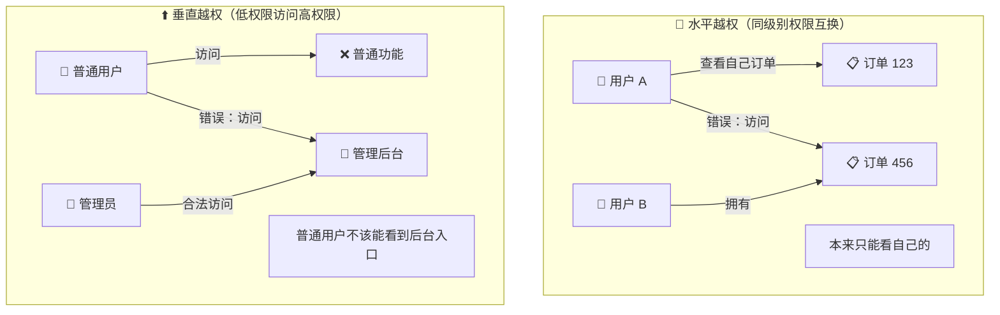

### 3.2 越权的常见场景

**场景一：URL 参数包含用户 ID**

```javascript
// 常见的问题代码
app.get('/user/profile/:userId', async (req, res) => {
	const userId = req.params.userId
	const profile = await db.user.findById(userId)
	res.json(profile)
})
```

攻击者只需要遍历 userId 参数，就能看到任意用户的信息。

**场景二：管理接口没有权限校验**

```javascript
// 常见的问题代码
app.post('/admin/deleteUser', async (req, res) => {
	const { userId } = req.body
	await db.user.delete(userId)
	res.json({ success: true })
})
```

普通用户 POST 到这个地址就能删除任意用户。

**场景三：隐藏接口靠"不知名"来保护**

```javascript
// 以为改了名字就安全了？太天真了
app.post('/manage/delete-account', async (req, res) => {
	// 没有任何权限检查
	await db.user.delete(req.body.id)
})
```

### 3.3 怎么防护？

**核心原则：从 session 获取当前用户，不要相信前端传来的用户标识**

```javascript
// ✅ 正确的做法：从 session 获取当前用户
app.get('/order/:orderId', async (req, res) => {
	const orderId = req.params.orderId

	// 1. 先获取当前登录用户
	const currentUser = req.session.userId

	// 2. 查询订单
	const order = await db.order.findById(orderId)

	// 3. 验证订单主人是不是当前用户
	if (order.userId !== currentUser) {
		return res.status(403).json({
			error: '你无权访问这个订单',
		})
	}

	res.json(order)
})
```

**使用 UUID 代替自增 ID：**

```javascript
// ❌ 自增 ID，容易被遍历
// GET /order/1001, /order/1002, /order/1003...

// ✅ UUID，无法猜测
// GET /order/a1b2c3d4-e5f6-7890-abcd-ef1234567890
```

```javascript
// 生成 UUID
import { v4 as uuidv4 } from 'uuid'

app.post('/order', async (req, res) => {
	const order = {
		id: uuidv4(), // 随机 UUID
		userId: req.session.userId,
		items: req.body.items,
		createdAt: new Date(),
	}

	await db.order.insert(order)
	res.json({ orderId: order.id })
})
```

**全局权限检查中间件：**

```javascript
// 定义权限检查函数
function requireAuth(allowedRoles = []) {
	return async (req, res, next) => {
		// 检查是否登录
		if (!req.session.userId) {
			return res.status(401).json({ error: '请先登录' })
		}

		// 获取用户信息
		const user = await db.user.findById(req.session.userId)

		// 检查角色权限
		if (allowedRoles.length > 0 && !allowedRoles.includes(user.role)) {
			return res.status(403).json({ error: '你没有权限访问此功能' })
		}

		// 把用户信息挂到 req 上，后续处理器可以直接用
		req.user = user
		next()
	}
}

// 使用方式
app.get(
	'/admin/dashboard',
	requireAuth(['admin']), // 只有管理员能访问
	(req, res) => {
		res.json({ message: '欢迎来到管理后台' })
	},
)

app.get(
	'/order/:id',
	requireAuth(), // 登录用户就能访问（但只能访问自己的）
	async (req, res) => {
		// 这里还需要额外检查资源所有权
		const order = await db.order.findById(req.params.id)
		if (order.userId !== req.user.id) {
			return res.status(403).json({ error: '无权访问' })
		}
		res.json(order)
	},
)
```

---

## 四、SSRF：被利用的"代理"功能

### 4.1 什么是 SSRF？

SSRF 的全称是 Server-Side Request Forgery，翻译过来是"服务器端请求伪造"。

这个漏洞的本质是：你的服务器上有一些需要"获取外部资源"的功能（比如抓取图片、网页截图），攻击者利用这些功能，让服务器去访问本来不该访问的内网资源。

### 4.2 攻击原理

正常情况下，用户输入一个图片 URL，服务器下载并保存：

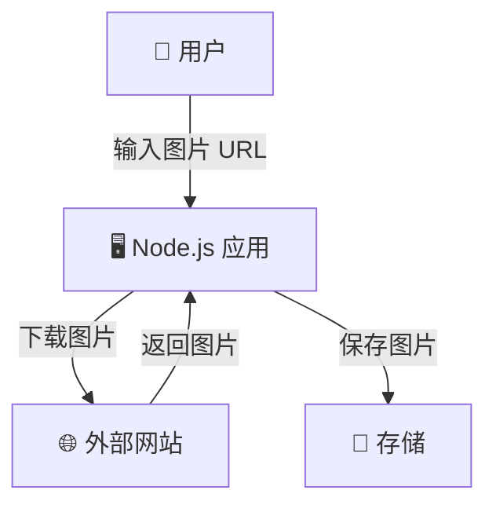

攻击者利用这个功能，让应用去访问内网资源：

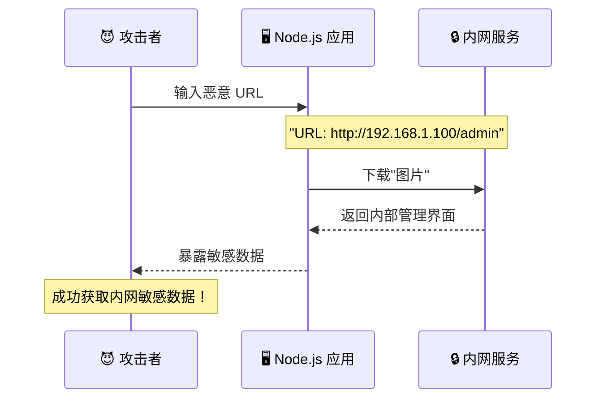

### 4.3 哪些功能容易中招？

- **图片预览/缩略图**：用户输入图片 URL，服务器下载处理
- **网页截图**：把任意 URL 转成图片
- **文件下载**：允许用户下载指定 URL 的文件
- **Webhook 回调**：把用户提供的 URL 发请求
- **API 代理**：代理访问用户提供的 URL

### 4.4 真实攻击案例

**案例一：读取云服务元数据**

很多云服务（AWS、阿里云）都有元数据服务，运行在 `169.254.169.254`：

```
http://example.com/fetch?url=http://169.254.169.254/latest/meta-data/
```

如果你的应用没有防护，攻击者就能拿到云服务器的密钥、实例信息等。

**案例二：探测内网端口**

```
http://example.com/fetch?url=http://192.168.1.1:8080/
```

通过返回的内容判断端口是否开放，服务类型是什么。

**案例三：读取本地文件**

```
http://example.com/fetch?url=file:///etc/passwd
```

有些服务器支持 `file://` 协议，直接读取本地文件。

### 4.5 怎么防护？

**方法一：禁止内网 IP**

```javascript
import dns from 'node:dns/promises'
import { isInternal } from 'is-internal-ip'

app.post('/fetch', async (req, res) => {
	const { url } = req.body

	try {
		// 解析域名获取 IP
		const urlObj = new URL(url)
		const hostname = urlObj.hostname

		// 检查是否是内网域名（如 localhost、*.local）
		if (hostname === 'localhost' || hostname.endsWith('.local')) {
			return res.status(400).json({ error: '禁止访问本地资源' })
		}

		// 获取域名的所有 IP
		const records = await dns.lookup(hostname, { all: true })

		// 检查是否有内网 IP
		for (const record of records) {
			if (await isInternal(record.address)) {
				return res.status(400).json({ error: '禁止访问内网资源' })
			}
		}

		// 验证通过，继续处理
		const response = await fetch(url)
		const buffer = await response.arrayBuffer()
		res.send(Buffer.from(buffer))
	} catch (error) {
		res.status(400).json({ error: 'URL 格式错误或无法访问' })
	}
})
```

**方法二：白名单域名**

```javascript
const ALLOWED_DOMAINS = ['cdn.example.com', 'images.example.com', 'img.example.org']

app.post('/fetch', async (req, res) => {
	const { url } = req.body
	const urlObj = new URL(url)

	if (!ALLOWED_DOMAINS.includes(urlObj.hostname)) {
		return res.status(400).json({ error: '只允许访问指定域名' })
	}

	// ...
})
```

**方法三：禁用危险协议**

```javascript
app.post('/fetch', async (req, res) => {
	const { url } = req.body

	// 只允许 http 和 https
	if (!url.startsWith('http://') && !url.startsWith('https://')) {
		return res.status(400).json({ error: '只支持 http 和 https 协议' })
	}

	// 禁止内网常见端口
	const suspiciousPorts = [22, 23, 25, 3306, 5432, 6379, 27017]
	const urlObj = new URL(url)
	if (suspiciousPorts.includes(urlObj.port)) {
		return res.status(400).json({ error: '禁止访问该端口' })
	}

	// ...
})
```

**方法四：使用 DNS rebinding 防护**

攻击者可能利用 DNS 缓存时间差，在验证时解析到合法 IP，但实际请求时指向内网 IP。可以结合 IP 黑名单和时间戳验证。

---

## 五、其他常见漏洞

### 5.1 HPP - HTTP 参数污染

HPP 是 HTTP Parameter Pollution 的缩写，中文叫"参数污染"。

问题在于：不同的后端框架对重复参数的处理方式不一样。

```
GET /search?q=apple&q=banana
```

| 框架       | 结果                         |
| ---------- | ---------------------------- |
| PHP        | `q = "banana"`（后者覆盖）   |
| ASP.NET    | `q = "apple,banana"`（拼接） |
| Express.js | `q = "banana"`（后者覆盖）   |

攻击者可以利用这种差异绕过安全过滤。比如某安全检查只验证第一个参数，但实际使用的是第二个。

**防护：使用 hpp 中间件**

```javascript
import hpp from 'hpp'

app.use(
	hpp({
		// 可以指定哪些参数允许重复
		allow: ['tags', 'category'],
	}),
)

// 现在 /search?q=apple&q=banana 会被 hpp 处理
// 只保留最后一个：q = "banana"
```

### 5.2 开放式重定向

很多网站有"登录后跳转"功能，比如：

```
https://shop.com/login?redirect=/cart
```

登录成功后会自动跳转到 `/cart`。但如果 `redirect` 参数可以被控制：

```
https://shop.com/login?redirect=http://evil.com/phishing
```

攻击者可以用这个做钓鱼——看起来是你信任的网站，实际上跳到了假网站。

**攻击流程：**

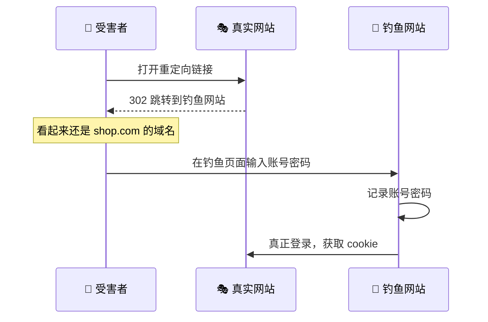

**防护：白名单验证**

```javascript
const ALLOWED_HOSTS = ['example.com', 'shop.example.com']

app.get('/login', (req, res) => {
	const redirectUrl = req.query.redirect

	if (!redirectUrl) {
		return res.redirect('/dashboard')
	}

	// 解析 URL
	let hostname
	try {
		const url = new URL(redirectUrl, 'http://localhost')
		hostname = url.hostname
	} catch {
		return res.redirect('/dashboard')
	}

	// 检查是否在白名单
	if (!ALLOWED_HOSTS.includes(hostname)) {
		return res.redirect('/dashboard')
	}

	// 检查是否相对路径（推荐做法）
	if (redirectUrl.startsWith('/') && !redirectUrl.startsWith('//')) {
		return res.redirect(redirectUrl)
	}

	res.redirect('/dashboard')
})
```

### 5.3 依赖漏洞

你以为只用原生 Node.js 就安全了？Too young too simple。

npm 生态有几百万个包，你一个项目装几十个依赖，每个依赖又可能依赖几十个包。一层层加上去，你的项目实际上依赖了几百上千个第三方代码。

这些代码的安全性完全取决于作者。一旦某个包被发现漏洞，你的项目也就危险了。

**攻击链：**

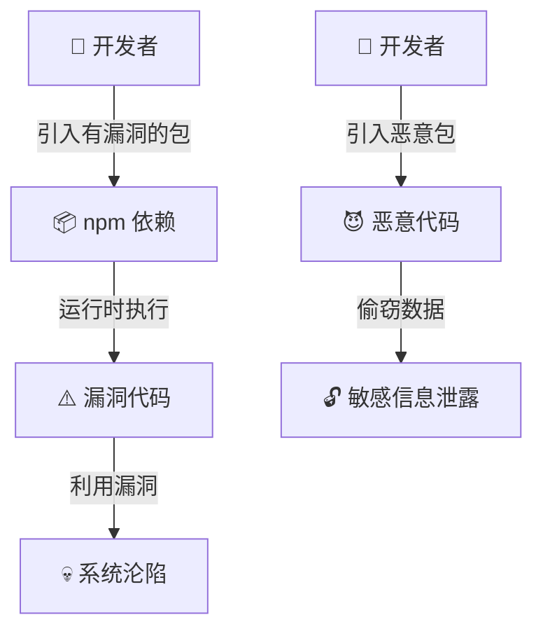

**真实案例：**

2018 年的 event-stream 事件。攻击者向热门包 event-stream 注入了恶意代码，专门窃取比特币钱包的私钥。全球数百万项目受到影响。

**防护措施：**

1. **定期审计**

```bash
# 检查依赖漏洞
npm audit

# 查看详细报告
npm audit --audit-level=high
```

2. **使用自动化工具**

```yaml
# .github/workflows/security.yml
name: Security Audit
on: [push, pull_request]

jobs:
  security:
    runs-on: ubuntu-latest
    steps:
      - uses: actions/checkout@v3
      - uses: actions/setup-node@v3
        with:
          node-version: '18'
      - run: npm ci
      - uses: snyk/actions/node@master
        env:
          SNYK_TOKEN: ${{ secrets.SNYK_TOKEN }}
```

3. **锁定版本**

```json
{
	"dependencies": {
		"lodash": "4.17.21"
	}
}
```

```bash
# 生成 lock 文件后，每次安装的都是完全相同的版本
npm ci
```

4. **使用私有镜像**

对于核心依赖，考虑 fork 一份到自己控制的仓库，定期检查更新。

### 5.4 目录遍历

这个漏洞的原因是服务器在处理文件路径时，没有检查用户输入的路径是否在预期范围内。

```javascript
// 有问题的代码
app.get('/download', (req, res) => {
	const file = req.query.file
	// 直接拼接路径，没有检查
	res.sendFile(__dirname + '/files/' + file)
})
```

攻击者输入：

```
GET /download?file=../../../etc/passwd
```

服务器实际读取的是 `/var/www/yourapp/files/../../../etc/passwd`，等价于 `/etc/passwd`。

**攻击路径：**

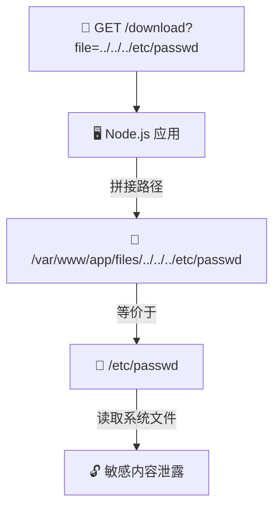

**防护：路径规范化**

```javascript
import path from 'node:path'
import fs from 'node:fs'

app.get('/download', (req, res) => {
	const requestedFile = req.query.file

	// 安全目录
	const baseDir = path.join(__dirname, 'files')

	// 规范化路径
	const filePath = path.normalize(path.join(baseDir, requestedFile))

	// 确保最终路径在安全目录内
	if (!filePath.startsWith(baseDir)) {
		return res.status(403).json({ error: '非法路径' })
	}

	// 检查文件是否存在且是文件
	if (!fs.existsSync(filePath) || !fs.statSync(filePath).isFile()) {
		return res.status(404).json({ error: '文件不存在' })
	}

	res.sendFile(filePath)
})
```

### 5.5 SQL 注入

虽然用 Node.js 的时候很多人会用 ORM，但还是有必要了解一下 SQL 注入的原理。

**有问题的代码：**

```javascript
// ❌ 绝对不要这样做
const sql = `SELECT * FROM users WHERE name = '${username}'`
db.query(sql)

// 攻击者输入 username: "' OR '1'='1"
// 实际执行的 SQL:
// SELECT * FROM users WHERE name = '' OR '1'='1'
// 结果：返回所有用户！
```

**正确的做法：参数化查询**

```javascript
// ✅ 使用参数化查询
const sql = 'SELECT * FROM users WHERE name = ?'
db.query(sql, [username])

// 或者用 ORM
const user = await db.user.findFirst({
	where: { name: username },
})
```

---

## 六、应用访问限流

限流不是严格意义上的"安全漏洞"，但它是保护系统不被恶意请求打垮的重要手段。

想象一下：有人写了脚本，一秒钟给你发一万个请求。你的服务器拼命处理这些无效请求，真正的用户反而打不开了。这就是 DoS（拒绝服务）攻击。

限流就是为了解决这个问题。

### 6.1 固定窗口计数器

最简单的方式，固定一段时间内允许的请求数。

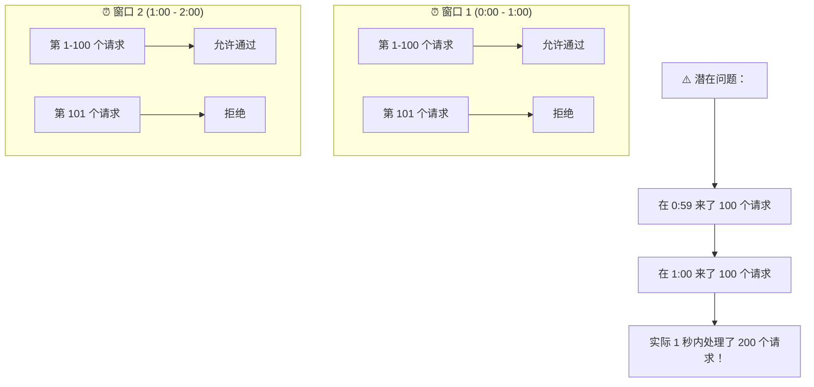

**代码实现：**

```javascript
import rateLimit from 'express-rate-limit'

const limiter = rateLimit({
	windowMs: 60 * 1000, // 时间窗口：1 分钟
	max: 100, // 最多 100 个请求
	message: '请求太频繁了，请稍后再试',
	standardHeaders: true, // 返回 RateLimit-* 头
	legacyHeaders: false,
	keyGenerator: (req) => {
		// 按 IP 限流（也可以改成按用户 ID）
		return req.ip
	},
})

app.use('/api', limiter)
```

### 6.2 滑动窗口计数器

解决了固定窗口的"边界突刺"问题。把时间窗口切分成多个小段，计算加权平均值。

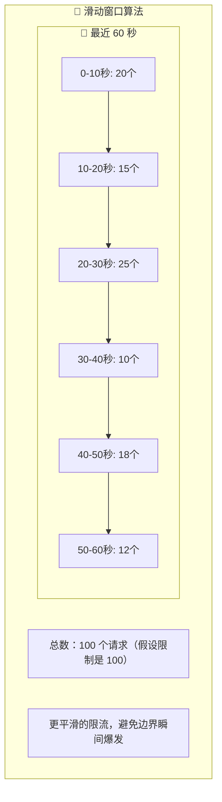

**代码实现：**

```javascript
class SlidingWindowRateLimiter {
	constructor(windowMs, maxRequests) {
		this.windowMs = windowMs
		this.maxRequests = maxRequests
		this.requests = new Map() // { ip: [timestamp1, timestamp2, ...] }
	}

	isAllowed(ip) {
		const now = Date.now()
		const windowStart = now - this.windowMs

		// 获取该 IP 的历史请求记录
		if (!this.requests.has(ip)) {
			this.requests.set(ip, [])
		}

		const timestamps = this.requests.get(ip)

		// 只保留窗口内的请求
		const validTimestamps = timestamps.filter((t) => t > windowStart)
		this.requests.set(ip, validTimestamps)

		// 检查是否超限
		if (validTimestamps.length >= this.maxRequests) {
			return { allowed: false, remaining: 0 }
		}

		// 记录这次请求
		validTimestamps.push(now)
		return { allowed: true, remaining: this.maxRequests - validTimestamps.length }
	}
}

const limiter = new SlidingWindowRateLimiter(60 * 1000, 100)

app.use('/api', (req, res, next) => {
	const ip = req.ip
	const { allowed, remaining } = limiter.isAllowed(ip)

	res.setHeader('X-RateLimit-Remaining', remaining)

	if (!allowed) {
		return res.status(429).json({ error: '请求过于频繁' })
	}

	next()
})
```

### 6.3 漏桶算法

想象一个底部有洞的桶。水（请求）从顶部流入，从底部以固定速率流出。桶满了，新来的水就会溢出（被拒绝）。

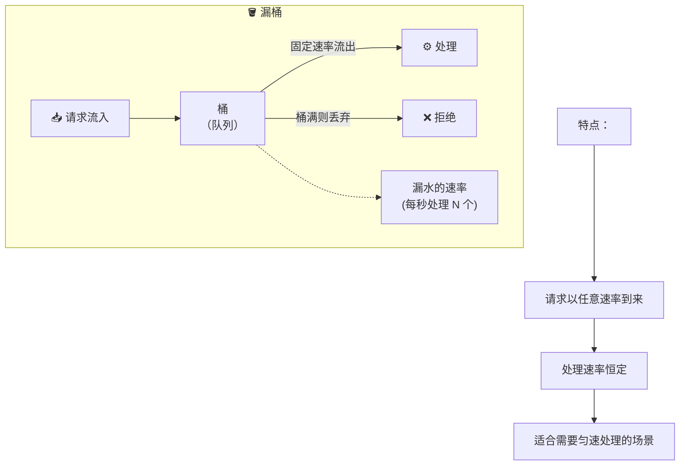

**代码实现：**

```javascript
class LeakyBucket {
	constructor(capacity, leakRatePerSecond) {
		this.capacity = capacity // 桶的容量
		this.water = 0 // 当前水量
		this.leakRate = leakRatePerSecond // 每秒漏水量
		this.lastLeakTime = Date.now()
	}

	drop() {
		this.leak()

		if (this.water < this.capacity) {
			this.water++
			return true // 可以处理
		}
		return false // 桶满了，拒绝
	}

	leak() {
		const now = Date.now()
		const elapsed = (now - this.lastLeakTime) / 1000 // 秒
		const leaked = elapsed * this.leakRate

		this.water = Math.max(0, this.water - leaked)
		this.lastLeakTime = now
	}
}

const bucket = new LeakyBucket(100, 10) // 容量 100，每秒处理 10 个

app.use('/api', (req, res, next) => {
	if (bucket.drop()) {
		next()
	} else {
		res.status(429).json({ error: '服务器繁忙，请稍后再试' })
	}
})
```

### 6.4 令牌桶算法

这是最灵活的限流算法。桶里放令牌，请求来了必须拿走一个令牌才能被处理。令牌按固定速率生成，但可以累积（不超过桶容量）。

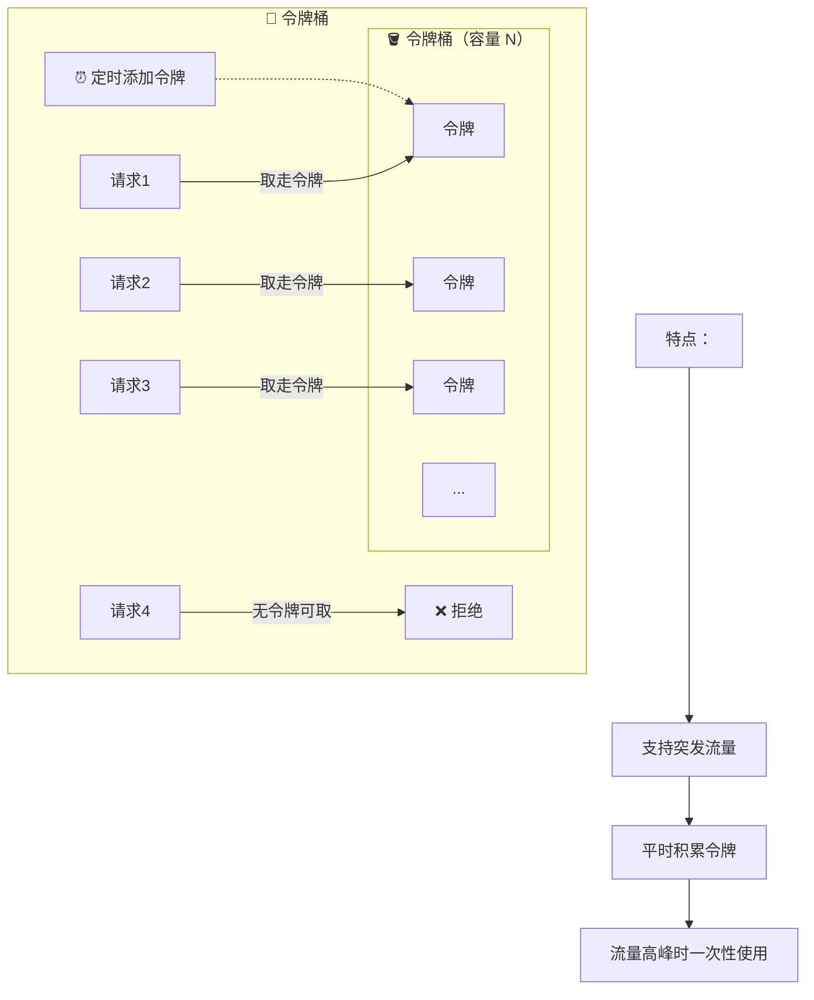

**代码实现：**

```javascript
class TokenBucket {
	constructor(capacity, refillRatePerSecond) {
		this.capacity = capacity // 桶容量
		this.tokens = capacity // 当前令牌数
		this.refillRate = refillRatePerSecond // 每秒补充令牌数
		this.lastRefillTime = Date.now()
	}

	take() {
		this.refill()

		if (this.tokens >= 1) {
			this.tokens -= 1
			return true
		}
		return false
	}

	refill() {
		const now = Date.now()
		const elapsed = (now - this.lastRefillTime) / 1000
		const tokensToAdd = elapsed * this.refillRate

		this.tokens = Math.min(this.capacity, this.tokens + tokensToAdd)
		this.lastRefillTime = now
	}
}

const bucket = new TokenBucket(100, 10) // 最多积攒 100 个令牌，每秒补充 10 个

app.use('/api', (req, res, next) => {
	if (bucket.take()) {
		next()
	} else {
		res.status(429).json({
			error: '请求过于频繁',
			retryAfter: 1, // 建议 1 秒后重试
		})
	}
})
```

### 6.5 四种算法对比

| 算法     | 优点     | 缺点         | 适用场景           |
| -------- | -------- | ------------ | ------------------ |
| 固定窗口 | 实现简单 | 边界突刺     | 对精度要求不高     |
| 滑动窗口 | 精度高   | 实现复杂     | API 限流           |
| 漏桶     | 流量平滑 | 无法处理突发 | 消息队列、API 网关 |
| 令牌桶   | 支持突发 | 实现较复杂   | 限流、流量整形     |

### 6.6 分布式限流

单机限流只能保护单台服务器，真正的限流需要全局视角。

**Redis + 滑动窗口实现：**

```javascript
import Redis from 'ioredis'

const redis = new Redis(process.env.REDIS_URL)

async function slidingWindowRateLimit(key, windowMs, maxRequests) {
	const now = Date.now()
	const windowStart = now - windowMs

	const multi = redis.multi()

	// 移除窗口外的记录
	multi.zremrangebyscore(key, 0, windowStart)

	// 添加当前请求
	multi.zadd(key, now, `${now}-${Math.random()}`)

	// 获取窗口内请求数
	multi.zcard(key)

	// 设置过期时间
	multi.expire(key, Math.ceil(windowMs / 1000))

	const results = await multi.exec()
	const requestCount = results[2][1]

	return {
		allowed: requestCount <= maxRequests,
		remaining: Math.max(0, maxRequests - requestCount),
	}
}

app.use('/api', async (req, res, next) => {
	const key = `ratelimit:${req.ip}`
	const { allowed, remaining } = await slidingWindowRateLimit(
		key,
		60 * 1000, // 1 分钟
		100, // 100 次请求
	)

	res.setHeader('X-RateLimit-Remaining', remaining)

	if (!allowed) {
		return res.status(429).json({ error: '请求过于频繁' })
	}

	next()
})
```

---

## 七、安全三剑客：限流、缓存、降级

高可用系统离不开三板斧：限流、缓存、降级。它们相互配合，共同保护系统在极端情况下依然能提供服务。

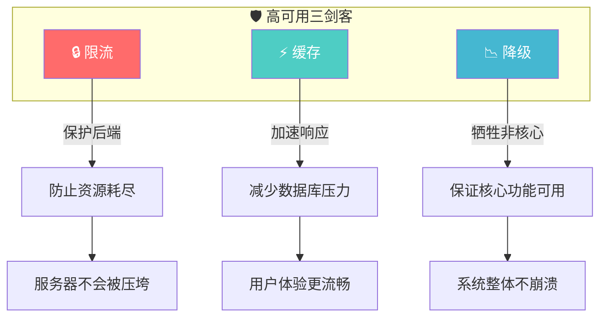

**举例说明：**

- **限流**：双十一每秒 100 万人下单，但我只能处理 10 万，那就只能让 90 万人排队或返回"稍后再试"
- **缓存**：大部分数据其实变化不频繁，用缓存挡掉 90% 的请求，减轻数据库压力
- **降级**：图片验证码计算太慢，那就暂时关闭，改成短信验证，等高峰期过了再恢复

---

## 八、总结：安全 checklist

最后给你列一个清单，每次上线前对照检查一遍：

### 请求验证

- [ ] 所有用户输入都做了验证和过滤
- [ ] 使用参数化查询，防止 SQL 注入
- [ ] 使用 ORM 的安全特性

### 身份认证

- [ ] 使用安全的密码哈希算法（Argon2 或 bcrypt）
- [ ] Session/Cookie 设置了 httpOnly、secure、sameSite
- [ ] 实现 CSRF 防护

### 授权控制

- [ ] 所有接口都有权限检查
- [ ] 使用 UUID 或随机 ID，避免可预测的 ID
- [ ] 验证资源所有权，不能只靠 URL 参数

### 敏感数据

- [ ] 敏感数据加密存储
- [ ] API 不返回不必要的敏感信息
- [ ] 日志不记录密码、Token 等敏感信息

### 网络安全

- [ ] 使用 HTTPS
- [ ] 设置 CSP、X-Frame-Options 等安全头
- [ ] 限流防止 DoS

### 依赖安全

- [ ] 定期运行 `npm audit`
- [ ] 使用自动化工具检查依赖
- [ ] 锁死依赖版本

### 错误处理

- [ ] 生产环境关闭详细错误堆栈
- [ ] 统一错误响应格式
- [ ] 日志记录异常但不暴露敏感信息

---

安全不是一次性的工作，而是持续的过程。希望这篇文章能帮你建立起安全意识，在日常开发中多想一步：用户会不会用这个功能来搞我？

多一分警惕，少一分损失。祝你的应用固若金汤！
