> 写给普通开发者的测试入门手册，看完终于不怕写测试了

你是不是有这样的经历：代码写完了，自己测了测没问题，结果一上线就出 bug？或者系统搞活动的时候突然崩了，但本地压测明明好好的？

这些问题背后，往往是测试没做到位。今天这篇文章，我用大白话讲清楚 Node.js 怎么写单元测试、怎么做性能测试，全文包含大量代码示例和图表，保证小白也能看懂。

---

## 测试能帮你解决什么问题？

- **防止代码退化**：改了一个地方，别的地方突然坏了——这种情况叫"回归"，自动化测试能第一时间发现
- **减少调试时间**：测试失败时，失败信息直接告诉你哪里有问题，比 console.log 到处打印高效多了
- **增强重构信心**：想优化代码但怕改坏？有了测试罩着，大胆重构
- **充当活文档**：看测试代码就能知道这个函数是干嘛的，比注释靠谱多了

**一个形象的比喻**：单元测试就像大楼的钢筋检测，确保每根钢筋都符合标准，整栋楼才安全。你不会住进一栋没经过检测的大楼吧？

---

## 一、单元测试：最小单元的正确性保证

### 1.1 什么是单元测试？

单元测试是对软件中**最小可测试单元**进行检查和验证的代码。这个"最小单元"通常是：

- 一个函数
- 一个方法
- 一个模块

注意：单元测试测的是**隔离**的单元，不依赖数据库、不依赖外部 API、不依赖其他模块。如果你的测试需要连数据库，那它已经不是"单元测试"了，叫"集成测试"更合适。

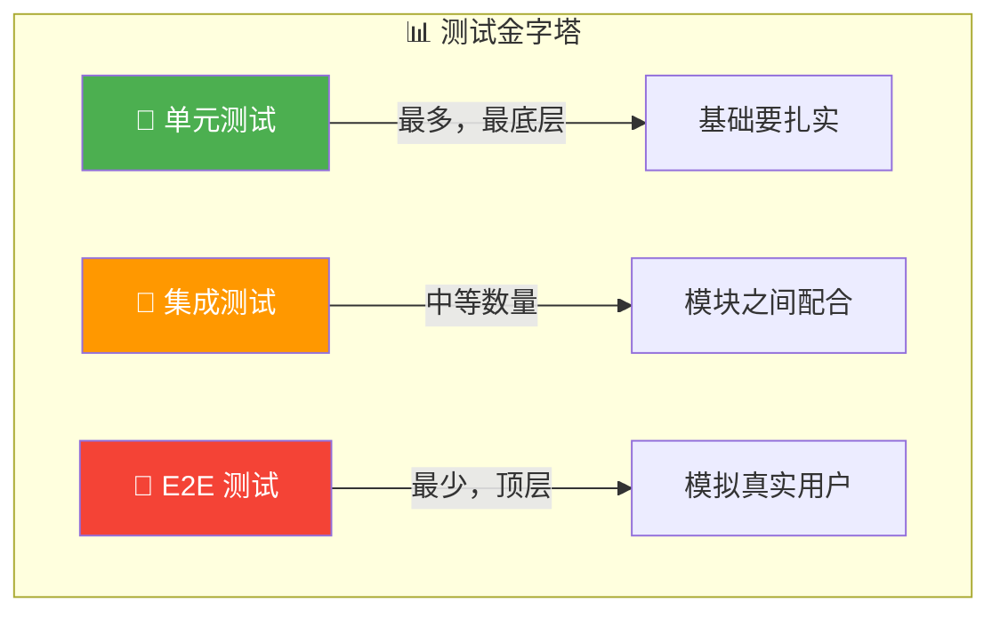

### 1.2 为什么需要单元测试？

很多新手觉得"我代码逻辑很简单，不用测"，或者"测试太费时间，不如直接上线看看"。

这种想法很危险。让我给你算一笔账：

| 阶段         | 发现 bug 的成本 |
| ------------ | --------------- |
| 编码时发现   | 1x              |
| 单元测试发现 | 1x - 10x        |
| 集成测试发现 | 10x - 50x       |
| QA 测试发现  | 50x - 200x      |
| 生产环境发现 | 200x - 1000x    |

看到了吗？生产环境发现一个 bug 的成本，可能是编码时的 200 倍！

单元测试的价值体现在：

- **及早发现问题**：代码刚写完就测试，脑子里还记得逻辑，修复起来快
- **防止回归**：每次改代码都可能引入新 bug，自动化测试保证老功能不坏
- **充当文档**：测试用例就是活的文档，说明这个函数接受什么输入、输出什么结果
- **提高开发效率**：写测试的时候你会强迫自己思考边界条件，代码设计自然更好

### 1.3 如何编写单元测试：AAA 模式

好，现在开始讲怎么写测试。最经典的模式叫 **AAA 模式**，把每个测试分成三部分：

**1. Arrange（准备）**

- 初始化测试需要的数据
- 设置 mock（模拟对象）
- 准备测试环境

**2. Act（执行）**

- 调用被测试的函数
- 获取实际输出

**3. Assert（断言）**

- 判断实际输出是否符合预期
- 不符合就测试失败

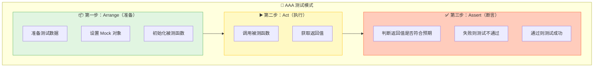

### 1.4 实战：从零开始写测试

让我们从一个最简单的例子开始。

**被测试的代码**（一个计算器模块）：

```javascript
// math.js
/**
 * 加法函数
 * @param {number} a - 第一个数
 * @param {number} b - 第二个数
 * @returns {number} 两数之和
 */
export function add(a, b) {
  return a + b
}

/**
 * 减法函数
 * @param {number} a - 被减数
 * @param {number} b - 减数
 * @returns {number} 差
 */
export function subtract(a, b) {
  return a - b
}

/**
 * 乘法函数
 * @param {number} a - 第一个数
 * @param {number} b - 第二个数
 * @returns {number} 积
 */
export function multiply(a, b) {
  return a * b
}

/**
 * 除法函数
 * @param {number} a - 被除数
 * @param {number} b - 除数
 * @returns {number} 商
 * @throws {Error} 除数不能为0
 */
export function divide(a, b) {
  if (b === 0) {
    throw new Error('除数不能为零')
  }
  return a / b
}
```

**测试代码**：

```javascript
// math.test.js
import assert from 'node:assert'
import { add, subtract, multiply, divide } from '../math.js'

describe('计算器模块测试', () => {
  // ===== 加法测试 =====
  describe('add 函数', () => {
    it('应返回两个正数的和', () => {
      // Arrange
      const a = 2
      const b = 3
      const expected = 5

      // Act
      const result = add(a, b)

      // Assert
      assert.strictEqual(result, expected)
    })

    it('应正确处理负数', () => {
      assert.strictEqual(add(-1, 1), 0)
      assert.strictEqual(add(-5, -3), -8)
    })

    it('应正确处理零', () => {
      assert.strictEqual(add(0, 0), 0)
      assert.strictEqual(add(5, 0), 5)
    })

    it('应正确处理小数', () => {
      assert.strictEqual(add(0.1, 0.2), 0.3)
    })
  })

  // ===== 减法测试 =====
  describe('subtract 函数', () => {
    it('应返回两个数的差', () => {
      assert.strictEqual(subtract(5, 3), 2)
      assert.strictEqual(subtract(3, 5), -2)
    })
  })

  // ===== 乘法测试 =====
  describe('multiply 函数', () => {
    it('应返回两个数的积', () => {
      assert.strictEqual(multiply(3, 4), 12)
      assert.strictEqual(multiply(-2, 3), -6)
    })
  })

  // ===== 除法测试 =====
  describe('divide 函数', () => {
    it('应返回两个数的商', () => {
      assert.strictEqual(divide(10, 2), 5)
    })

    // 边界测试：除数不能为零
    it('除数为零时应抛出错误', () => {
      assert.throws(() => divide(10, 0), /除数不能为零/)
    })
  })
})
```

运行结果：

```
计算器模块测试
  add 函数
    ✓ 应返回两个正数的和
    ✓ 应正确处理负数
    ✓ 应正确处理零
    ✓ 应正确处理小数
  subtract 函数
    ✓ 应返回两个数的差
  multiply 函数
    ✓ 应返回两个数的积
  divide 函数
    ✓ 应返回两个数的商
    ✓ 除数为零时应抛出错误

8 passing (15ms)
```

### 1.5 什么是好的测试？

不是写了测试就够了，测试也有好坏之分。好的测试应该满足 **FIRST** 原则：

- **Fast（快速）**：单元测试要快，一个功能可能几百个测试，如果每个都要跑几秒钟，谁受得了？
- **Independent（独立）**：每个测试用例要独立，不能依赖其他测试的执行结果
- **Repeatable（可重复）**：无论跑多少次，结果应该一致。环境相关的问题（比如时间、网络）要 mock 掉
- **Self-Validating（自验证）**：测试结果要明确——要么 pass，要么 fail，不需要人工判断
- **Timely（及时）**：测试要在代码写完之后立刻写，不能拖到后面补

### 1.6 测试覆盖率：你的代码被测到了多少？

测试覆盖率衡量你的测试到底测了多少代码。常见的指标有：

| 指标         | 含义                        | 例子                                                               |
| ------------ | --------------------------- | ------------------------------------------------------------------ |
| **语句覆盖** | 每行代码是否执行过          | `if (x) { doSomething(); }` —— 如果 x 一直是 false，这行就不算覆盖 |
| **分支覆盖** | 每个 if-else 分支都走过吗？ | 同上，true 和 false 分支都要测试                                   |
| **函数覆盖** | 每个函数都调用过吗？        | 总不能有的函数完全没测试                                           |
| **行覆盖**   | 每行代码都执行过吗？        | 和语句覆盖类似                                                     |

**覆盖率报告示例**（使用 Istanbul/NYC）：

```bash
--------------|---------|----------|---------|---------|-------------------
File          | % Stmts | % Branch | % Funcs | % Lines | Uncovered Line #s
--------------|---------|----------|---------|---------|-------------------
All files     |   85.71 |       75 |     100 |   85.71 |
 math.js      |   85.71 |       75 |     100 |   85.71 | 5-6
 user.js      |   90.00 |       80 |     100 |   90.00 | 12, 45-47
--------------|---------|----------|---------|---------|-------------------
```

怎么看？拿 `math.js` 来说：

- 语句覆盖率 85.71%：还有 14% 的代码没跑到
- 分支覆盖率 75%：有 25% 的分支没测试到
- 函数覆盖率 100%：每个函数都测了
- 行覆盖率 85.71%：第 5-6 行没覆盖到

**覆盖率是不是越高越好？**

不一定！覆盖率只是个参考，不是目标。关键是测试**有价值的场景**，而不是为了凑数字。

常见误区：

- 覆盖率 100% 但没测边界条件 —— 没用
- 只测简单路径，复杂逻辑不测 —— 白搭
- 为了覆盖率测一堆无意义的断言 —— 浪费时间

**建议**：

- 核心业务逻辑追求 80%+ 覆盖率
- 边界条件、异常处理一定要测
- 简单 getter/setter 可以不测

### 1.7 Node.js 测试框架对比

Node.js 生态里测试框架很多，但主流的就三个：**Mocha**、**Jest**、**Vitest**。让我给你详细对比一下：

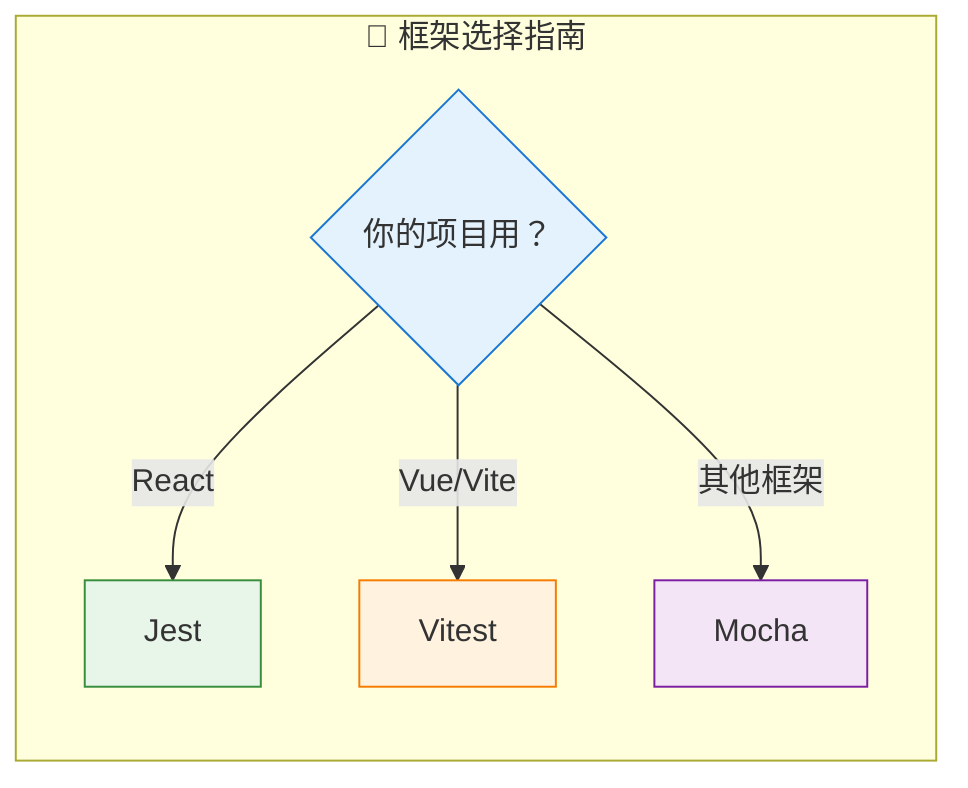

#### 功能对比表

| 特性           | Mocha                | Jest               | Vitest                  |
| -------------- | -------------------- | ------------------ | ----------------------- |
| **断言库**     | 需要单独安装（Chai） | 内置               | 内置（兼容 Jest）       |
| **Mock/Stub**  | 需要 Sinon           | 内置               | 内置                    |
| **快照测试**   | 需要插件             | 内置               | 内置                    |
| **并行执行**   | 需要配置             | 自动               | 自动（基于 Vite，极快） |
| **ESM 支持**   | 需要配置             | 良好               | 原生支持                |
| **TypeScript** | 需要配置             | 内置               | 内置                    |
| **学习曲线**   | 较陡（需要自己组合） | 平缓               | 平缓                    |
| **配置复杂度** | 高（灵活）           | 低（约定大于配置） | 低                      |

#### 1.7.1 Mocha + Chai + Sinon：老牌组合

Mocha 本身只是个测试运行器，断言、Mock 都需要自己配。适合需要高度定制的项目。

**示例：测试 API 调用**

```javascript
// api.js
import axios from 'axios'

export async function fetchUser(userId) {
  const response = await axios.get(`/api/users/${userId}`)
  return response.data
}
```

```javascript
// api.test.js
import { expect } from 'chai'
import sinon from 'sinon'
import axios from 'axios'
import { fetchUser } from './api.js'

// Mock axios
describe('fetchUser', () => {
  let stub

  beforeEach(() => {
    // 每个测试前创建新的 stub
    stub = sinon.stub(axios, 'get')
  })

  afterEach(() => {
    // 每个测试后恢复 stub
    stub.restore()
  })

  it('应成功获取用户数据', async () => {
    // Arrange：设置 mock 返回值
    const mockUser = { id: 1, name: '张三' }
    stub.resolves({ data: mockUser })

    // Act
    const result = await fetchUser(1)

    // Assert
    expect(result).to.deep.equal(mockUser)
    expect(stub.calledOnce).to.be.true
    expect(stub.calledWith('/api/users/1')).to.be.true
  })

  it('用户不存在时应返回 null', async () => {
    // Arrange：模拟 404 响应
    const error = new Error('Request failed with status 404')
    error.response = { status: 404 }
    stub.rejects(error)

    // Act & Assert
    await expect(fetchUser(999)).to.eventually.be.rejected
  })
})
```

运行命令：`npx mocha test/**/*.test.js`

#### 1.7.2 Jest：Facebook 出品的零配置框架

Jest 最大的优点是**开箱即用**——断言、Mock、覆盖率、watch 模式全内置。React 项目首选。

**示例：测试用户创建函数**

```javascript
// user.js
export function createUser(name, email) {
  if (!name || !email) {
    throw new Error('姓名和邮箱不能为空')
  }
  return {
    id: Date.now(),
    name,
    email,
    createdAt: new Date().toISOString(),
  }
}
```

```javascript
// user.test.js
import { createUser } from './user.js'

describe('createUser', () => {
  test('应返回包含 id、name、email 的对象', () => {
    const user = createUser('张三', 'zhangsan@example.com')

    // Jest 内置的 matchers
    expect(user).toHaveProperty('id')
    expect(user).toHaveProperty('name', '张三')
    expect(user).toHaveProperty('email', 'zhangsan@example.com')
    expect(user).toHaveProperty('createdAt')
  })

  test('空姓名应抛出错误', () => {
    expect(() => createUser('', 'test@example.com')).toThrow('姓名和邮箱不能为空')
  })

  test('空邮箱应抛出错误', () => {
    expect(() => createUser('张三', '')).toThrow('姓名和邮箱不能为空')
  })
})
```

运行命令：`npx jest` 或在 package.json 配置脚本。

#### 1.7.3 Vitest：Vite 时代的测试新选择

Vitest 号称"基于 Vite 的下一代测试框架"，兼容 Jest API，但启动和运行速度更快。如果你用 Vue/Vite，一定试试。

**示例：测试数组操作**

```javascript
// arrayUtils.js
export function filterByStatus(items, status) {
  return items.filter((item) => item.status === status)
}

export function groupByCategory(items) {
  return items.reduce((acc, item) => {
    const key = item.category
    if (!acc[key]) {
      acc[key] = []
    }
    acc[key].push(item)
    return acc
  }, {})
}
```

```javascript
// arrayUtils.test.js
import { describe, it, expect } from 'vitest'
import { filterByStatus, groupByCategory } from './arrayUtils.js'

describe('数组工具函数', () => {
  const mockItems = [
    { id: 1, status: 'active', category: 'A' },
    { id: 2, status: 'inactive', category: 'A' },
    { id: 3, status: 'active', category: 'B' },
  ]

  describe('filterByStatus', () => {
    it('应筛选出指定状态的项', () => {
      const result = filterByStatus(mockItems, 'active')
      expect(result).toHaveLength(2)
      expect(result.every((item) => item.status === 'active')).toBe(true)
    })

    it('无匹配时应返回空数组', () => {
      const result = filterByStatus(mockItems, 'deleted')
      expect(result).toHaveLength(0)
    })
  })

  describe('groupByCategory', () => {
    it('应按分类分组', () => {
      const result = groupByCategory(mockItems)
      expect(result).toHaveProperty('A')
      expect(result).toHaveProperty('B')
      expect(result['A']).toHaveLength(2)
      expect(result['B']).toHaveLength(1)
    })
  })
})
```

运行命令：`npx vitest`

#### 1.7.4 异步测试与钩子函数

实际开发中经常要测试异步代码（数据库查询、API 调用等）。所有框架都支持 `async/await`。

**Mocha 异步测试**：

```javascript
it('应异步获取用户列表', async () => {
  const users = await getUsers()
  expect(users).to.be.an('array')
  expect(users.length).to.be.greaterThan(0)
})
```

**钩子函数**：用于在测试前/后做一些准备工作和清理。

```javascript
describe('数据库相关测试', () => {
  // 所有测试开始前执行一次
  before(async () => {
    console.log('连接数据库...')
    await db.connect()
  })

  // 所有测试结束后执行一次
  after(async () => {
    console.log('关闭数据库连接...')
    await db.close()
  })

  // 每个测试开始前执行
  beforeEach(() => {
    console.log('清空测试数据...')
    db.clear()
  })

  // 每个测试结束后执行
  afterEach(() => {
    console.log('清理测试产生的临时文件...')
    cleanupTempFiles()
  })

  // 真正的测试用例
  it('应正确创建用户', async () => {
    const user = await db.users.create({ name: '测试用户' })
    expect(user.id).to.exist
  })
})
```

### 1.8 Mock 和 Stub：隔离依赖的艺术

写单元测试最难的部分是什么？是**如何隔离依赖**。

比如你要测试一个订单处理函数，它依赖：

- 数据库（查询用户、查询商品、保存订单）
- 缓存（检查库存）
- 支付接口（发起支付）

如果每个测试都要真实调这些服务，那：

1. 速度慢
2. 可能调用外部 API 失败
3. 每次运行结果可能不一样
4. 没法测试异常情况

这时候就需要 **Mock**（模拟）和 **Stub**（桩）了。

**概念区分**：

- **Stub**：替换一个函数，返回预设的值
- **Mock**：更高级，可以验证函数被调用的次数、参数等

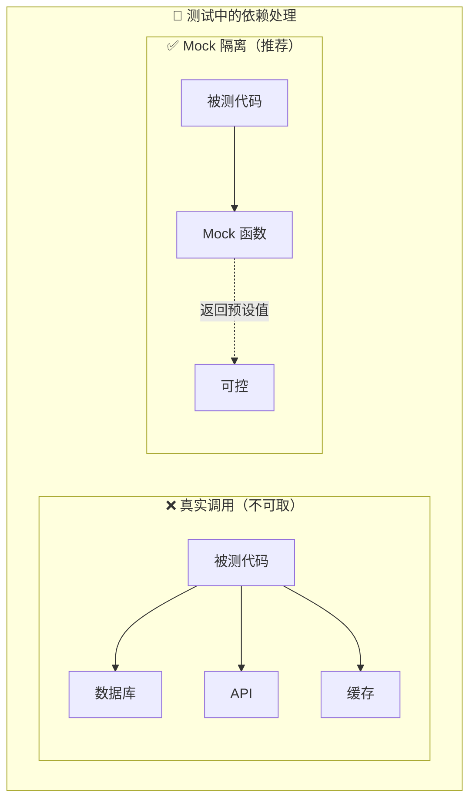

**实战：Mock API 调用**

```javascript
// userService.js
export async function getUserWithPosts(userId) {
  const user = await fetchUser(userId)
  const posts = await fetchPosts(userId)
  return { user, posts }
}
```

```javascript
// userService.test.js (使用 Jest Mock)
import { getUserWithPosts } from './userService.js'
import { fetchUser, fetchPosts } from './api.js'

// Mock API 模块
jest.mock('./api.js')

describe('getUserWithPosts', () => {
  beforeEach(() => {
    jest.clearAllMocks() // 每次测试前清空 mock 记录
  })

  it('应返回用户及其文章', async () => {
    // Stub：预设返回值
    fetchUser.mockResolvedValue({ id: 1, name: '张三' })
    fetchPosts.mockResolvedValue([{ id: 1, title: '第一篇' }])

    const result = await getUserWithPosts(1)

    expect(result.user.name).toBe('张三')
    expect(result.posts).toHaveLength(1)

    // 验证函数被调用
    expect(fetchUser).toHaveBeenCalledWith(1)
    expect(fetchPosts).toHaveBeenCalledWith(1)
  })

  it('用户不存在时应返回 null', async () => {
    fetchUser.mockResolvedValue(null)
    fetchPosts.mockResolvedValue([])

    const result = await getUserWithPosts(999)

    expect(result.user).toBeNull()
    expect(result.posts).toHaveLength(0)
  })

  it('API 错误时应抛出异常', async () => {
    fetchUser.mockRejectedValue(new Error('网络错误'))

    await expect(getUserWithPosts(1)).rejects.toThrow('网络错误')
  })
})
```

---

## 二、性能测试：让系统在压力下也能稳住

### 2.1 什么是性能测试？

单元测试回答的问题是：**代码逻辑对不对？**

性能测试回答的问题是：**代码跑得快不快？稳不稳？**

性能测试通过自动化工具模拟多种负载，测量系统各项指标：

- **响应时间**：一个请求要等多长时间
- **吞吐量（TPS/QPS）**：每秒能处理多少请求
- **资源利用率**：CPU、内存、磁盘、网络的使用情况
- **错误率**：多少请求失败了

它帮助我们回答：

- 系统能承受多少并发用户？
- 响应时间是否满足 SLA（服务等级协议）？
- 长时间运行会否内存泄漏？
- 峰值流量下会不会崩溃？

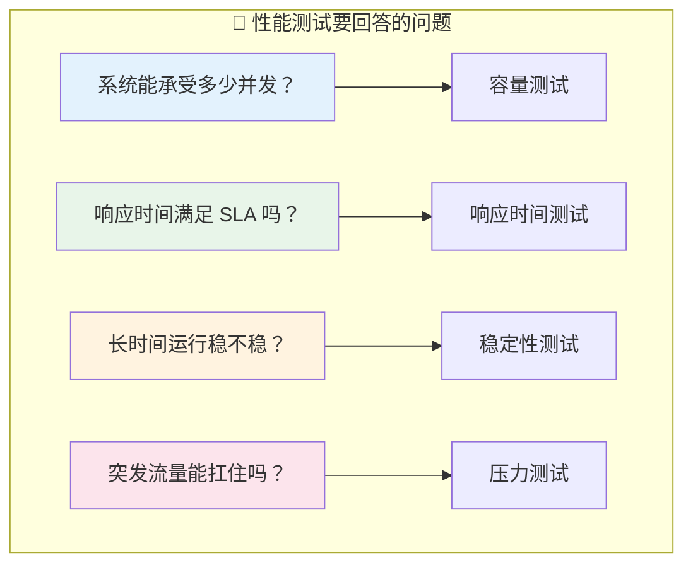

### 2.2 性能测试的四种类型

性能测试不是一种测试，而是四种。每种测试的目的不同，施加的负载也不一样。

#### 2.2.1 基准性能测试（Baseline Test）

**目的**：在低负载下获取系统性能基准数据，作为后续比较的参考线。

**什么时候用**：

- 每次版本发布后，对比基准数据判断性能是否下降
- 新系统上线前，获取一个"正常情况下是什么样"的参考

**负载模型**：单用户或少量用户，持续短时间（如 5-10 分钟）

**输出指标**：

- 单用户平均响应时间
- 单用户 TPS
- 基础资源消耗

#### 2.2.2 容量性能测试（Capacity Test / Load Test）

**目的**：测试系统在预期负载下的表现，验证是否满足性能需求。

这是最常见的性能测试，"压测"通常指的就是这个。

**什么时候用**：

- 电商大促前
- 新功能上线前评估容量
- 想知道系统极限在哪

**负载模型**：逐步增加并发用户/请求，直至达到目标 TPS 或并发数。

**负载曲线示意图**：

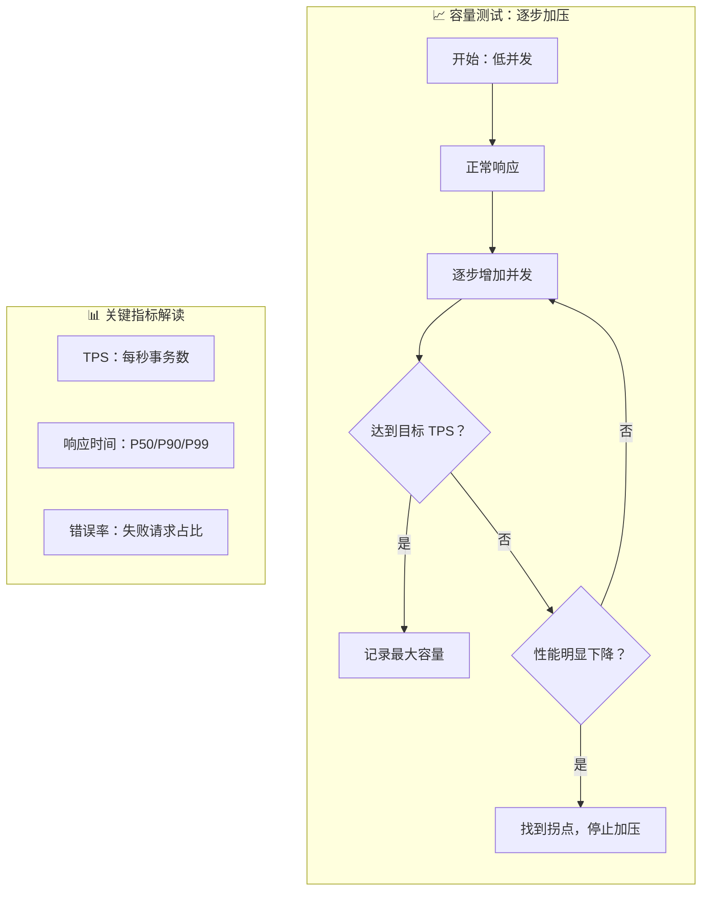

**输出**：

- 最大 TPS
- 不同并发下的响应时间分布
- 性能拐点位置

#### 2.2.3 稳定性性能测试（Stability Test / Endurance Test）

**目的**：验证系统在长时间运行下的稳定性，检查内存泄漏、连接泄漏等慢性问题。

**什么时候用**：

- 7x24 小时运行的服务
- 担心内存泄漏
- 想知道系统在持续负载下会不会"越跑越慢"

**负载模型**：恒定负载（如 80% 容量），持续长时间（8 小时、24 小时、甚至 7 天）。

**必须监控的指标**：

| 指标         | 关注点                     |
| ------------ | -------------------------- |
| **内存**     | 是否有泄漏（内存持续增长） |
| **CPU**      | 是否持续高占用             |
| **句柄数**   | 是否有连接/文件句柄泄漏    |
| **GC**       | GC 频率是否异常            |
| **错误日志** | 是否有缓慢累积的错误       |

**稳定性测试监控图**：

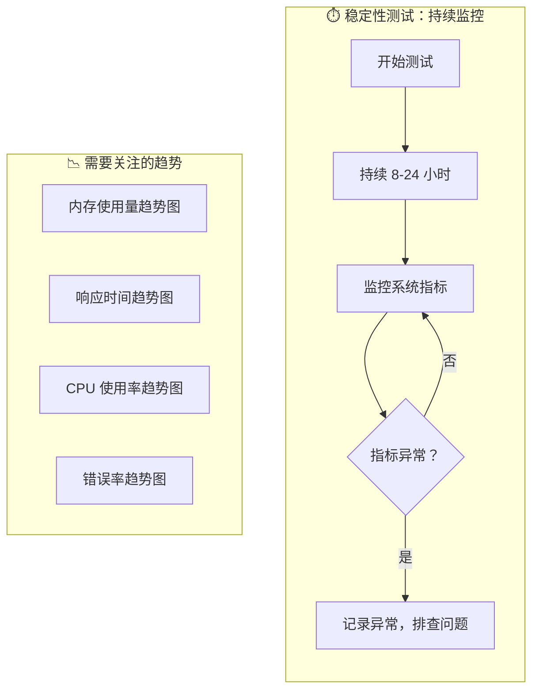

#### 2.2.4 异常性能测试（Stress Test / Spike Test）

**目的**：测试系统在突发极端负载下的行为，以及恢复能力。

**什么时候用**：

- "秒杀"活动前
- 想知道系统在极端情况下的表现
- 验证限流、降级机制是否生效

**负载模型**：瞬间高并发，或负载突增突降。

**异常测试图解**：

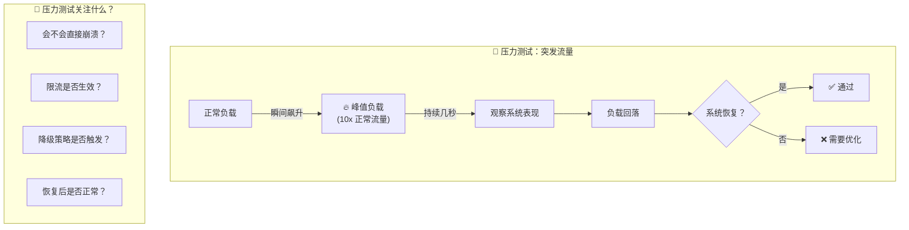

### 2.3 性能测试完整流程

一个规范的性能测试应该遵循以下流程：

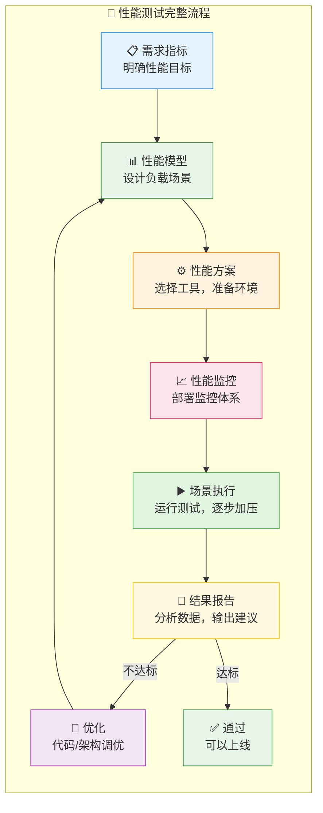

**每一步详解**：

**1. 需求指标**

- 明确性能目标，如：
  - TPS ≥ 1000
  - P95 响应时间 ≤ 200ms
  - 可用性 ≥ 99.9%
- 参考行业标准或历史数据
- 与业务方确认 SLA

**2. 性能模型**

- 分析用户行为，设计负载场景
- 确定各场景比例（如：80% 浏览，15% 下单，5% 搜索）
- 定义测试脚本的数据集

**3. 性能方案**

- 选择测试工具（Artillery、k6、Locust）
- 准备测试环境（最好与生产环境 1:1）
- 设计测试脚本

**4. 性能监控**

- 部署监控系统
- 收集服务器指标（CPU、内存、磁盘、网络）
- 收集应用指标（响应时间、错误率、TPS）
- 常用工具：Prometheus + Grafana

**5. 场景执行**

- 按计划执行测试
- 逐步加压，观察指标变化
- 记录异常情况

**6. 结果报告**

- 分析数据，定位瓶颈
- 输出优化建议
- 与目标对比，判断是否通过

### 2.4 什么场景必须做性能测试？

很多团队不做性能测试，理由是"没时间"或"应该没问题"。但下面这些场景，**必须做**：

| 场景             | 原因                                   |
| ---------------- | -------------------------------------- |
| **新应用上线**   | 估算上线后 QPS，验证能否支撑           |
| **核心高频服务** | 支付、订单、秒杀，性能问题直接导致损失 |
| **大促/活动前**  | 电商抢购、演唱会抢票，必须提前压测     |
| **架构调整后**   | 微服务拆分、数据库迁移，必须验证性能   |
| **长期运行服务** | 检测内存泄漏、连接池耗尽等慢性问题     |

**血的教训**：

- 某电商双十一前没做压测，开卖第一分钟数据库直接打满
- 某银行系统升级后没测，结果运行三天后内存泄漏导致重启
- 某抢票系统在高峰期崩溃，直接损失几百万票房

### 2.5 性能测试工具对比

目前主流的性能测试工具有这些：

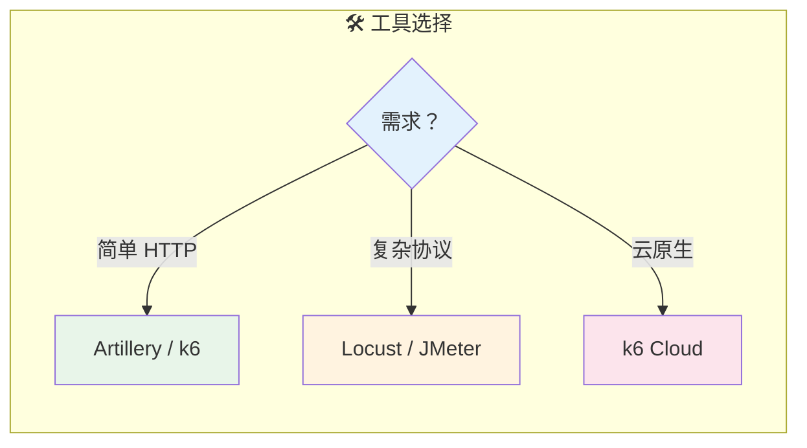

#### 2.5.1 Artillery：Node.js 亲儿子

Artillery 是一个现代化的性能测试工具，基于 Node.js，天生适合测 Node.js 服务。

**支持的协议**：

- HTTP/HTTPS
- WebSocket
- Socket.io
- 其他自定义协议

**优点**：

- 配置简单，YAML/JSON 格式
- 丰富的报告功能
- 支持场景编排
- 支持参数化测试数据

**安装**：

```bash
npm install -g artillery
```

**基础示例**：测试一个简单的 GET 接口

```yaml
# test.yml
config:
  target: 'http://localhost:3000' # 目标地址
  phases:
    # 预热阶段：10 秒内，逐渐增加到 5 用户
    - duration: 10
      arrivalRate: 5
      name: 'Warm up'
    # 正式测试：60 秒，维持 20 用户
    - duration: 60
      arrivalRate: 20
      name: 'Sustained load'
  processor: './scenarios.js' # 自定义处理器

scenarios:
  - name: '获取用户列表'
    flow:
      - get:
          url: '/api/users'
          capture:
            - json: '$.data[0].id'
              as: 'userId'
      - get:
          url: '/api/users/{{ userId }}'
```

运行：

```bash
artillery run test.yml
```

**输出报告**：

```
Report @ 00:00:05 (+05000ms)
--------------------------------------------------
  Period: "Warm up"
  Scenarios launched:  50
  Scenarios completed:  48
  Requests completed:   98
  Mean response time:  45.23 ms
  Min response time:   12.10 ms
  Max response time:  156.78 ms
  RPS sent: 9.71
  Request latency:
    min: 12.10 ms
    max: 156.78 ms
    median: 38.45 ms
    p95: 95.12 ms
    p99: 134.56 ms
--------------------------------------------------
```

**高级示例**：参数化 + 思考时间 + 自定义检查

```yaml
# advanced-test.yml
config:
  target: 'http://my-api.com'
  phases:
    # 5 分钟测试，逐渐加压到 50 用户
    - duration: 300
      arrivalRate: 20
      rampTo: 50
  # 从 CSV 文件读取测试数据
  payload:
    path: 'users.csv'
    fields:
      - 'userId'
      - 'token'
    order: 'random'
  # 自定义处理器
  processor: './scenarios.js'

scenarios:
  - name: '完整用户流程'
    flow:
      # 1. 登录（带参数）
      - post:
          url: '/api/auth/login'
          json:
            userId: '{{ userId }}'
            token: '{{ token }}'
          capture:
            - json: '$.token'
              as: 'authToken'
          expect:
            - statusCode: 200

      # 2. 思考时间：模拟用户思考
      - think: 2

      # 3. 获取用户信息
      - get:
          url: '/api/users/me'
          headers:
            Authorization: 'Bearer {{ authToken }}'

      # 4. 获取用户订单列表
      - get:
          url: '/api/orders'
          headers:
            Authorization: 'Bearer {{ authToken }}'
```

```javascript
// scenarios.js
const fs = require('fs')

module.exports = {
  // 自定义处理器：在请求前执行
  onRequest: (request, userContext, events, done) => {
    // 添加随机延迟模拟真实用户
    const delay = Math.random() * 1000
    setTimeout(() => done(), delay)
  },

  // 自定义处理器：响应后执行
  afterResponse: (request, response, userContext, events, done) => {
    // 记录响应时间
    events.log({
      type: 'custom',
      message: `Response time: ${response.elapsedTime}ms`,
    })
    done()
  },
}
```

#### 2.5.2 k6：开发人员友好的压测工具

k6 是用 Go 编写的，性能极好，支持 JavaScript 编写测试脚本。强调**开发者体验**，脚本简洁易懂。

**优点**：

- 性能强大（用 Go 写的）
- 脚本简单，用 JavaScript
- 输出友好，支持多种格式
- 天然支持 CI/CD 集成
- 云服务可用（k6 Cloud）

**安装**（Linux/macOS）：

```bash
# macOS
brew install k6

# Linux
curl -s https://github.com/grafana/k6/releases/latest/download/k6-latest-linux-amd64.deb -o k6.deb
sudo dpkg -i k6.deb
```

**基础示例**：

```javascript
// script.js
import http from 'k6/http'
import { check, sleep } from 'k6'

// 测试配置
export const options = {
  stages: [
    // 1 分钟内逐渐增加到 10 用户
    { duration: '1m', target: 10 },
    // 维持 3 分钟
    { duration: '3m', target: 10 },
    // 1 分钟内降到 0
    { duration: '1m', target: 0 },
  ],
  thresholds: {
    // P95 响应时间要小于 500ms
    http_req_duration: ['p(95)<500'],
    // 失败率要小于 1%
    http_req_failed: ['rate<0.01'],
  },
}

export default function () {
  // 发送 GET 请求
  const res = http.get('http://localhost:3000/api/users')

  // 检查响应状态
  check(res, {
    'status is 200': (r) => r.status === 200,
    'response has users': (r) => r.json('data').length > 0,
  })

  // 思考时间：等待 1 秒
  sleep(1)
}
```

运行：

```bash
k6 run script.js
```

**输出示例**：

```
     ✓ status is 200
     ✓ response has users

     checks.........................: 100.00% ✓ 4523      ✗ 0
     data_received..................: 3.5 MB  45 kB/s
     data_sent......................: 1.2 MB  15 kB/s
     http_req_blocked...............: avg=4.8ms   min=2µs    med=6µs    max=1.2s
     http_req_connecting............: avg=2.1ms   min=0s     med=0s     max=1.1s
     http_req_duration..............: avg=123.4ms min=12ms   med=98ms   max=1.5s
       { expected_response:true }...: avg=123.4ms min=12ms   med=98ms   max=1.5s
     http_req_failed................: 0.00%   ✓ 0         ✗ 4523
     http_reqs......................: 4523    58.2/s
     iteration_duration.............: avg=1.12s   min=1.01s  med=1.09s  max=2.5s
     iterations.....................: 4523    58.2/s
     vus............................: 10      min=10     max=10
     vus_max........................: 10      min=10     max=10
```

**进阶示例**：完整用户流程 + 参数化

```javascript
// advanced-script.js
import http from 'k6/http'
import { check, sleep } from 'k6'
import { Rate, Trend } from 'k6/metrics'

// 自定义指标
const loginDuration = new Trend('login_duration')
const orderDuration = new Trend('order_duration')
const errorRate = new Rate('errors')

// 测试配置
export const options = {
  stages: [
    { duration: '2m', target: 50 }, // 2 分钟加到 50 用户
    { duration: '5m', target: 50 }, // 维持 5 分钟
    { duration: '2m', target: 0 }, // 2 分钟降到 0
  ],
  thresholds: {
    http_req_duration: ['p(95)<200'], // P95 < 200ms
    login_duration: ['p(95)<100'], // 登录 P95 < 100ms
    order_duration: ['p(95)<500'], // 下单 P95 < 500ms
    errors: ['rate<0.05'], // 错误率 < 5%
  },
}

// 从环境变量读取配置
const BASE_URL = __ENV.BASE_URL || 'http://localhost:3000'

// 测试场景
export default function () {
  // ===== 场景1：用户登录 =====
  const loginRes = http.post(
    `${BASE_URL}/api/auth/login`,
    JSON.stringify({
      username: `user${__VU}`, // __VU 是虚拟用户 ID
      password: 'test123',
    }),
    {
      headers: { 'Content-Type': 'application/json' },
      tags: { name: 'login' },
    },
  )

  loginDuration.add(loginRes.timings.duration)

  check(loginRes, {
    'login successful': (r) => r.status === 200,
    'has token': (r) => r.json('token') !== undefined,
  }) || errorRate.add(1)

  const token = loginRes.json('token')
  const headers = {
    Authorization: `Bearer ${token}`,
    'Content-Type': 'application/json',
  }

  sleep(1)

  // ===== 场景2：获取商品列表 =====
  const productsRes = http.get(`${BASE_URL}/api/products`, {
    headers,
    tags: { name: 'products' },
  })

  check(productsRes, {
    'products loaded': (r) => r.status === 200,
    'has products': (r) => r.json('data').length > 0,
  }) || errorRate.add(1)

  // 随机选择一个商品
  const products = productsRes.json('data')
  const randomProduct = products[Math.floor(Math.random() * products.length)]

  sleep(1)

  // ===== 场景3：创建订单 =====
  const orderRes = http.post(
    `${BASE_URL}/api/orders`,
    JSON.stringify({
      productId: randomProduct.id,
      quantity: Math.floor(Math.random() * 3) + 1,
    }),
    {
      headers,
      tags: { name: 'order' },
    },
  )

  orderDuration.add(orderRes.timings.duration)

  check(orderRes, {
    'order created': (r) => r.status === 201,
    'has orderId': (r) => r.json('orderId') !== undefined,
  }) || errorRate.add(1)

  // 思考时间
  sleep(2)
}
```

**输出到 InfluxDB + Grafana**（实时监控）：

```bash
# 启动时指定输出
k6 run --out influxdb=http://localhost:8086/k6 script.js
```

然后在 Grafana 中导入 k6 模板，就能看到实时仪表盘：

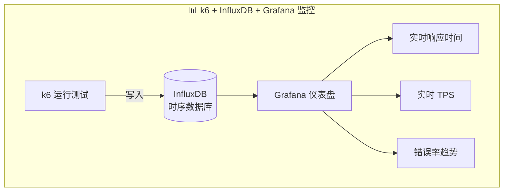

### 2.6 结合 APM 工具：定位代码级瓶颈

性能测试工具告诉你"系统慢"，APM 工具告诉你"**哪里**慢、**为什么**慢"。

**APM 能做什么**：

- 追踪每个请求的完整调用链
- 显示每个环节耗时
- 识别数据库慢查询
- 发现外部 API 延迟
- 定位内存泄漏

**常用 APM 工具**：

| 工具                           | 类型 | 特点                 |
| ------------------------------ | ---- | -------------------- |
| **New Relic**                  | 商业 | 功能全面，端到端追踪 |
| **Datadog**                    | 商业 | 云原生，集成能力强   |
| **Elastic APM**                | 开源 | 与 ELK 栈集成        |
| **Prometheus + OpenTelemetry** | 开源 | 可自建，完全可控     |

**典型使用场景**：

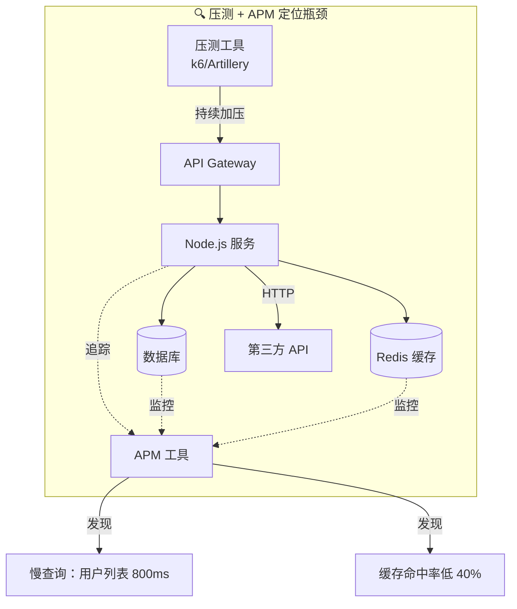

**实战：定位一个性能问题**

假设压测发现 P95 响应时间达到 1 秒，但应该 < 200ms。

1. 查看 APM 追踪记录，找到慢请求
2. APM 显示：数据库查询占用 800ms
3. 查看具体 SQL：发现没有索引
4. 添加索引
5. 重新压测：P95 降到 150ms

### 2.7 性能测试 checklist

每次做性能测试前，检查一下：

**测试前准备**

- [ ] 明确性能目标（TPS、响应时间、错误率）
- [ ] 准备好测试数据（真实分布，不要用假数据）
- [ ] 测试环境与生产环境尽量一致
- [ ] 监控系统已部署并可用
- [ ] 测试脚本已编写并审查

**测试执行**

- [ ] 从低负载开始，逐步加压
- [ ] 每个阶段观察指标变化
- [ ] 记录异常情况
- [ ] 多次测试验证结果一致性

**测试后分析**

- [ ] 对比目标与实际结果
- [ ] 定位瓶颈点
- [ ] 输出优化建议
- [ ] 记录测试结果作为基准

---

## 三、CI/CD 中的测试：从手动到自动化

### 3.1 为什么要把测试加入 CI/CD？

你可能会问："我本地测过了，为啥还要在 CI 里跑？"

因为：

- **防止合并破坏代码**：别人改了代码可能影响你的模块
- **强制要求**：CI 不通过就不能合并，保证质量底线
- **持续监控**：每次代码变更都在测，及时发现问题

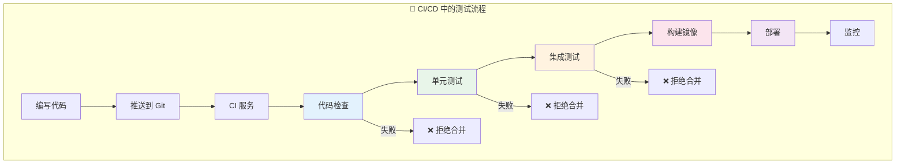

### 3.2 GitHub Actions 示例

```yaml
# .github/workflows/test.yml
name: Tests

on:
  push:
    branches: [main]
  pull_request:
    branches: [main]

jobs:
  unit-test:
    runs-on: ubuntu-latest
    steps:
      - uses: actions/checkout@v3
      - uses: actions/setup-node@v3
        with:
          node-version: '18'
          cache: 'npm'
      - run: npm ci
      - run: npm test
      - uses: codecov/codecov-action@v3
        with:
          file: ./coverage/lcov.info

  performance-test:
    runs-on: ubuntu-latest
    needs: unit-test # 单元测试通过后才运行
    steps:
      - uses: actions/checkout@v3
      - uses: actions/setup-node@v3
        with:
          node-version: '18'
      - run: npm ci
      - run: npm run start:prod &
      - run: npx k6 run tests/performance.js
```

---

## 四、总结

单元测试和性能测试是保障 Node.js 应用质量的两大支柱。

**单元测试解决"代码对不对"的问题**：

- 用 AAA 模式组织测试
- 追求有意义的覆盖率，而不是数字
- 选择合适的框架（Mocha/Jest/Vitest）
- 用 Mock 隔离外部依赖

**性能测试解决"系统扛不扛得住"的问题**：

- 四种测试类型，各有用途
- Artillery 和 k6 是好用的工具
- 结合 APM 定位代码级瓶颈
- 把测试加入 CI/CD，持续监控

**最后一张图总结全文**：

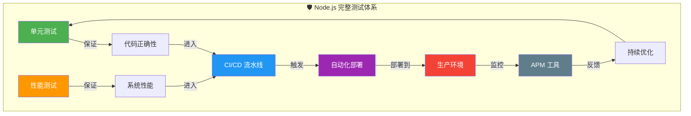

测试不是一次性的工作，而应融入开发文化，成为每一天的习惯。只有持续测试、持续优化，才能构建出可靠、高效的 Node.js 应用。

祝你写出高质量的代码，跑出漂亮的测试！
